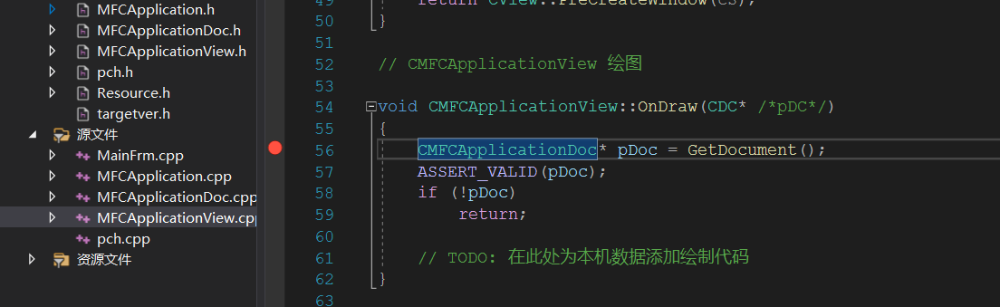
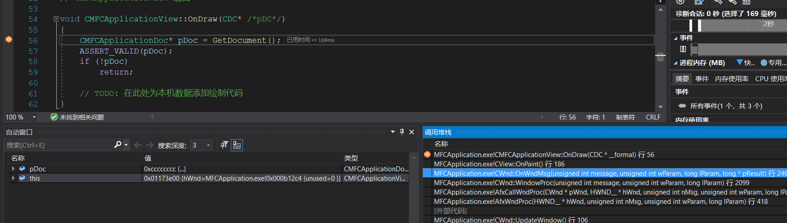
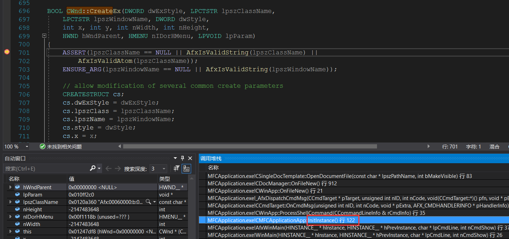
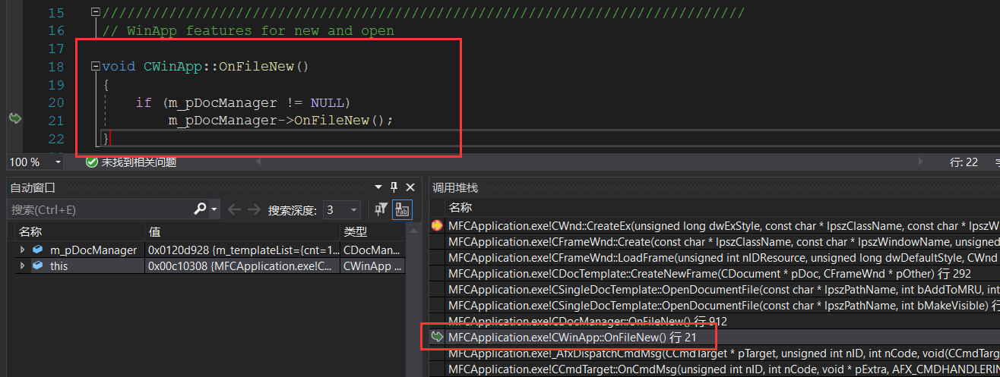
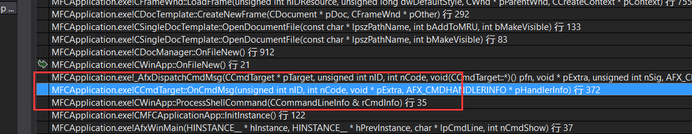
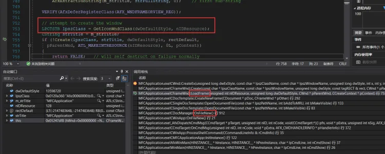
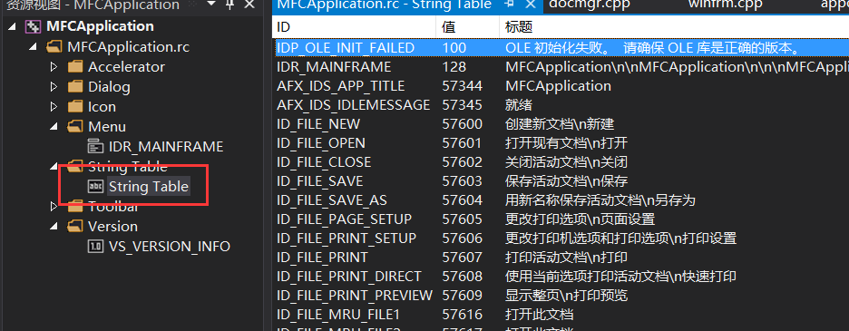
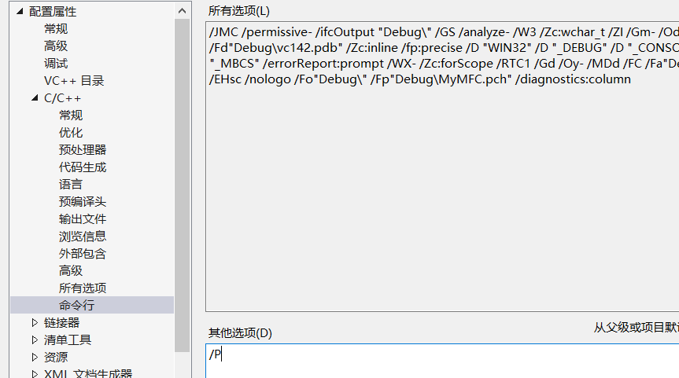

InitCommonControlsEx     用新版本控件时需要调用一下此api

### 通过观察MFC用控制台模拟实现

```c++

int AFXAPI AfxWinMain(HINSTANCE hInstance, HINSTANCE hPrevInstance,
	_In_ LPTSTR lpCmdLine, int nCmdShow)
{

	int nReturnCode = -1;
	CWinThread* pThread = AfxGetThread();  //获取tls种全局对象的值
	CWinApp* pApp = AfxGetApp();           //获取tls种全局对象的值
 
	// Perform specific initializations
	if (!pThread->InitInstance())   //窗口创建失败以及是否成功成功判断	
    {
         //窗口创建失败2种情况   
         // 1. 窗口创建成功了到最后失败了
         // 2. 窗口直接创建失败
		if (pThread->m_pMainWnd != NULL) //这里直接使用 m_pMainWnd 说明此成员在 CWinThread公有 
		{
			TRACE(traceAppMsg, 0, "Warning: Destroying non-NULL m_pMainWnd\n");
			pThread->m_pMainWnd->DestroyWindow();
		}
        //失败了如果有资源就需要释放 是 pThread调用了,因此是CWinThread 的虚函数 .派生可以重写
        //因此  ExitInstance 有两个功能 1.如果有资源就释放 2.修改main函数的返回值
		nReturnCode = pThread->ExitInstance();
		goto InitFailure;
	}
	nReturnCode = pThread->Run();

InitFailure:
	return nReturnCode;
}
```

```c++
BOOL CMFCApplicationApp::InitInstance()
{

	CWinApp::InitInstance();   //解决兼容性问题
	// 注册应用程序的文档模板。  文档模板
	// 将用作文档、框架窗口和视图之间的连接
	CSingleDocTemplate* pDocTemplate;
	pDocTemplate = new CSingleDocTemplate(
		IDR_MAINFRAME,
		RUNTIME_CLASS(CMFCApplicationDoc),
		RUNTIME_CLASS(CMainFrame),       // 主 SDI 框架窗口
		RUNTIME_CLASS(CMFCApplicationView));
	if (!pDocTemplate)
		return FALSE;
	AddDocTemplate(pDocTemplate);


	// 分析标准 shell 命令、DDE、打开文件操作的命令行
	CCommandLineInfo cmdInfo;
	ParseCommandLine(cmdInfo);


	// 调度在命令行中指定的命令。  如果
	// 用 /RegServer、/Register、/Unregserver 或 /Unregister 启动应用程序，则返回 FALSE。
	if (!ProcessShellCommand(cmdInfo))
		return FALSE;

	// 唯一的一个窗口已初始化，因此显示它并对其进行更新
	m_pMainWnd->ShowWindow(SW_SHOW);
	m_pMainWnd->UpdateWindow();
	return TRUE;
}
```

因此我们的主程序的代码为

```c++
CTestApp theApp;

CWinThread* AfxGetThread() {
  return &theApp;  //TLS
}

CWinApp* AfxGetApp() {
  return &theApp; //TLS
}


int main()
{
 // CTestDoc* pObject = (CTestDoc*)CreateObject("CTestDoc");
  
  int nReturnCode = -1;
  CWinThread* pThread = AfxGetThread();
  CWinApp* pApp = AfxGetApp();


  pApp->m_hInstance = ::GetModuleHandle(NULL);
  if (!pThread->InitInstance())
  {
    if (pThread->m_pMainWnd != NULL)
    {
      printf("Warning: Destroying non-NULL m_pMainWnd\n");
      pThread->m_pMainWnd->DestroyWindow();
    }
    nReturnCode = pThread->ExitInstance();
    goto InitFailure;
  }
  nReturnCode = pThread->Run();

InitFailure:
  return nReturnCode;
}
```

CWnd

```c++
---------------CWnd.h------------
class CWnd :
    public CCmdTarget
{
public:
  virtual BOOL DestroyWindow();
  BOOL ShowWindow(int nCmdShow);
  void UpdateWindow();
 
public:
  HWND m_hWnd;
};

---------------CWnd.cpp------------
#include "CWnd.h"

BOOL CWnd::DestroyWindow()
{
  return ::DestroyWindow(m_hWnd);
}

BOOL CWnd::ShowWindow(int nCmdShow)
{
    return ::ShowWindow(m_hWnd, nCmdShow);
}

void CWnd::UpdateWindow()
{
  ::UpdateWindow(m_hWnd);
}

```

这样主程序功能就完成了,接下来就是 完成  CtestApp 中的  InitInstance 功能了

在  InitInstance  主要要完成注册窗口 ,窗口实例化等功能

但是我们并没看在 真正的 MFC程序看到 该功能,需要通过栈回溯看一下在哪 完成的

找有消息处理地方下一个断点






发现我有 create 和  createEX,都下一个断点 ,在运行程序



可以通过栈回溯发现是在  InitInstance  中实现的



单文档会默认打开一个文档,把数据读进去显示出来,因此 我们需要从  OnFileNew 接着继续模拟



中间这些是消息处理,,入口变得这么复杂的原因是因为这时候消息循环还没开始,创口还没创建,因此模拟往消息队列投递了一个消息,有点像直接调窗口过程函数  OnFileNew  就是一个消息处理函数

```c++
BOOL CTestApp::InitInstance()
{
  CWinApp::OnFileNew();

  m_pMainWnd->ShowWindow(SW_SHOW);
  m_pMainWnd->UpdateWindow();

  return TRUE;
}
```

接下来就是找注册代码了,只需要找创建窗口时 类名的来源,通过栈回溯找,可以知道  注册是也是在  OnFileNew 里面实现的




这里也有一个问题,类名和窗口名是不固定的,而且这里也没有传参数,那么是如何解决类名问题的呢?  这个问题我们后来再来解决

```c++
void CWinApp::OnFileNew()
{
	if (m_pDocManager != NULL)
		m_pDocManager->OnFileNew();
}

可以看到函数里面用到了  CDocManager* m_pDocManager;    //文档管理器
因此我们需要完成  CDocManager  类  里面有函数   OnFileNew()


void CDocManager::OnFileNew()
{

	CDocTemplate* pTemplate = (CDocTemplate*)m_templateList.GetHead();
	pTemplate->OpenDocumentFile(NULL);  //核心代码
	
}


可以看到函数里面用到了 CDocTemplate* pTemplate;    //文档管理器
因此我们需要完成  CDocTemplate  类  里面有函数   OpenDocumentFile()

m_templateList 我们f12 过去看可以发现这个一个 mfc自己封装的链表,我们没有,所以可以用stl
里面存的就是文档(单文档和多文档的文档就是存放在里面)
```

CDocManager

```c++
---------------CDocManager.h-------------------
#pragma once
#include "CObject.h"
#include <list>
#include "CDocument.h"
#include "CDocTemplate.h"

class CDocManager :public CObject
{
public:
  void OnFileNew();
  void AddDocTemplate(CDocTemplate* pTemplate);
public:
  std::list<CDocTemplate*> m_templateList;
};

---------------CDocManager.cpp-------------------
 #include "CDocManager.h"
#include "CDocTemplate.h"

void CDocManager::OnFileNew()
{
  if (m_templateList.empty())
  {
    printf("Error: no document templates registered with CWinApp.\n");
    return;
  }

  CDocTemplate* pTemplate = (CDocTemplate*)m_templateList.front();
  pTemplate->OpenDocumentFile(NULL);
}

void CDocManager::AddDocTemplate(CDocTemplate* pTemplate)
{
  m_templateList.push_back(pTemplate);
}


```

```c++
struct CCreateContext   
{
  CDocument* m_pCurrentDoc;
  CDocTemplate* m_pNewDocTemplate;
  //CView* m_pLastView;
  CFrameWnd* m_pCurrentFrame;
};

为了给 create增加额外的参数
把 lpCreateParams  用 结构体地址 替换
```


CFrameWnd

```c++
--------CFrameWnd.h-----------------
#pragma once
#include "CWnd.h"
#include "CDocument.h"

class CFrameWnd : public CWnd
{
public:
  BOOL LoadFrame(UINT nIDResource, DWORD dwDefaultStyle,
    CWnd* pParentWnd, CCreateContext* pContext);

  BOOL Create(LPCTSTR lpszClassName,
    LPCTSTR lpszWindowName,
    DWORD dwStyle,
    const RECT& rect,
    CWnd* pParentWnd,
    LPCTSTR lpszMenuName,
    DWORD dwExStyle,
    CCreateContext* pContext);
};


--------CFrameWnd.cpp-----------------
    
#include "CFrameWnd.h"
#include "CView.h"

LRESULT MainWndProc(HWND hWnd, UINT uMsg, WPARAM wParam, LPARAM lParam) {

  if (uMsg == WM_DESTROY) {
    ::PostQuitMessage(0);
  }

  return ::DefWindowProc(hWnd, uMsg, wParam, lParam);
}

BOOL CFrameWnd::LoadFrame(UINT nIDResource, DWORD dwDefaultStyle,
  CWnd* pParentWnd, CCreateContext* pContext)
{

  const char* lpszClass = "MainWindowClass";
  const char* lpszTitle = "51asm";
  RECT rectDefault = {0, 0, CW_USEDEFAULT, CW_USEDEFAULT};
  WNDCLASS wc;

  // Register the main window class. 
  wc.style = CS_HREDRAW | CS_VREDRAW;
  wc.lpfnWndProc = (WNDPROC)MainWndProc;
  wc.cbClsExtra = 0;
  wc.cbWndExtra = 0;
  wc.hInstance = ::GetModuleHandle(NULL);
  wc.hIcon = LoadIcon(NULL, IDI_APPLICATION);
  wc.hCursor = LoadCursor(NULL, IDC_ARROW);
  wc.hbrBackground = (HBRUSH)GetStockObject(WHITE_BRUSH);
  wc.lpszMenuName = NULL;
  wc.lpszClassName = lpszClass;

  if (!RegisterClass(&wc))
    return FALSE;

  if (!Create(lpszClass, lpszTitle, dwDefaultStyle, rectDefault,
    pParentWnd, MAKEINTRESOURCE(nIDResource), 0L, pContext))
  {
    return FALSE;   
  }

  return TRUE;
}

BOOL CFrameWnd::Create(LPCTSTR lpszClassName,
  LPCTSTR lpszWindowName,
  DWORD dwStyle,
  const RECT& rect,
  CWnd* pParentWnd,
  LPCTSTR lpszMenuName,
  DWORD dwExStyle,
  CCreateContext* pContext)
{
  HMENU hMenu = NULL;
  if (lpszMenuName != NULL)
  {
    if ((hMenu = ::LoadMenu(::GetModuleHandle(NULL), lpszMenuName)) == NULL)
    {
      return FALSE;
    }
  }
 
  if (!CreateEx(dwExStyle, lpszClassName, lpszWindowName, dwStyle,
    rect.left, rect.top, 
    rect.right - rect.left, 
    rect.bottom - rect.top,
    pParentWnd->GetSafeHwnd(),
    hMenu, 
    (LPVOID)pContext))
  {
    if (hMenu != NULL)
      ::DestroyMenu(hMenu);
    return FALSE;
  }

  return TRUE;
}
    

```

CSingleDocTemplate

```c++
-------------------CSingleDocTemplate.h----------------

#pragma once
#include "CDocTemplate.h"
#include "CFrameWnd.h"
class CSingleDocTemplate :public CDocTemplate
{
public:
  CDocument* OpenDocumentFile(LPCTSTR lpszPathName, BOOL bMakeVisible = TRUE);
  CDocument* OpenDocumentFile(LPCTSTR lpszPathName, BOOL bAddToMRU, BOOL bMakeVisible);
protected:  
  CDocument* m_pOnlyDoc;
  UINT m_nIDResource;
};

    

-------------------CSingleDocTemplate.cpp--------------   

#include "CSingleDocTemplate.h"
#include "CTestDoc.h"
#include "CTestFrame.h"
#include "resource.h"
#include "CWinApp.h"

CDocument* CSingleDocTemplate::OpenDocumentFile(LPCTSTR lpszPathName, BOOL bMakeVisible)
{
  return OpenDocumentFile(lpszPathName, TRUE, bMakeVisible);
}

CDocument* CSingleDocTemplate::OpenDocumentFile(LPCTSTR lpszPathName, BOOL bAddToMRU, BOOL bMakeVisible)
{
  CDocument* pDocument = NULL;
  CFrameWnd* pFrame = NULL;
  BOOL bCreated = FALSE;      // => doc and frame created
  BOOL bWasModified = FALSE;

  
  pDocument = new CTestDoc();
  bCreated = TRUE;

  pFrame = new CTestFrame();
  if (pFrame == NULL)
  {
    delete pDocument;       // explicit delete on error
    return NULL;
  }

  AfxGetApp()->m_pMainWnd = pFrame;

  CCreateContext context;
  context.m_pCurrentFrame = pFrame;
  context.m_pCurrentDoc = pDocument;
  //context.m_pNewViewClass = m_pViewClass;
  context.m_pNewDocTemplate = this;

  m_nIDResource = IDR_MENU1;
  if (!pFrame->LoadFrame(m_nIDResource,
    WS_OVERLAPPEDWINDOW,   // default frame styles
    NULL, &context))
  {
    return NULL;
  }

  return pDocument;
}   
 
```

提示：  如果出现头文件相互包含问题，可以用向前申明解决 

​              例如把其中的一个头文件包含  #include “A.h” 改成  class  A

[📎MyMFC.zip](./MyMFC2.zip)

上面代码还有2个问题

1.  窗口名和菜单问题,目前我们是固定的,实际上是不能固定的 

​      字符串我们可以通过资源里面读取就可以了,但是菜单id是整形,不可以,但是是通过传参或得的,因此可以通过传参解决



1.  我们使用后后面添加的类 

​        pDocument = new CTestDoc();

​        pFrame = new CTestFrame();

​        因为我们无法知道后面的派生类的类名，而这里有需要new派生类对象,因此如何通过基类取new派生类就是我们目前遇到的难点,即如何通过函数new 一个后来才出现的类

​         因此我们能想到的方法是把类名当做参数传递,那问题题就转化成了 如何通过字符串 new一个对象

​         这也是大部分框架都会遇到的问题

```c++
//即要实现下面函数需要的效果

CObject* CreateObject(const char* pszClassName) {
  return new pszClassName ;
}

CObject* pObject = CreateObject("CObject");

假设上面可以成功,那么我们还需要实现下面功能

 CTestDoc* pObject = (CTestDoc*)CreateObject("CTestDoc");

这里的问题是我们把一个对象指针转成另一个对象指针,不确定是否存在问题
上面是基类指针转派生类是否可能我们不清楚,因为无法判断继承关系

要解决上面的问题,我们就需要用到类型识别   typeid 识别当前对象指针是什么类型的对象或者对象指针


```

### RTTI    运行时类型识别

Run-Time Type Identification

#### C++类型识别：

-   包含头文件 <typeinfo.h>
-   要使用typeid 关键字  typeid(对象)  typeid (类名)

```c++
当我们要给控件设置文本,要怎么才能通用呢,因为函数名和参数可能不一样,因此无法用多态来实现
只要能够识别类的类型就可以做到

SetControlText(CObject *pObj, CString text) {
  switch(typeid(pObj).name()) {
  case "CButton":
      ((CButton*)pOb)j->SetButtonText(text);
      break;
  case "CListCtrl":
      ((CListCtrl*)pOb)j->SetWindowText(0,text);
      break;
  }
}

这样我们给任意空间设置文本一行代码就可以了,控件即使变了也不影响功能,这样就解决了多态不能解决的问题

SetControlText(obj, "msg");

后面很多新发明的面向对象语言自带这个功能,不需要用到  typeid
```

#### MFC类型识别：

​         typeid 功能太弱,并不能实现我们要实现的代码的功能,因此他是在编译时类型识别,并不能做到运行时类型识别,即不具备多态性,而且能做到运行时类型识别也没办法实现我们上面 要把字符串 转成类 的功能

```c++
CObject* pObject = new CWinApp();
printf("%s\n", typeid(pObj).name());

结果是  class  CObject* ,而正确的应该是   class  CWinApp*
```

因此就用到了  RTTI 


​        我们最终要显示的是一个类名,那我们可以考虑把类名保存起来即在类名保存位该类对象的一个成员,这样我们要获取类名的时候只需要该成员的值就可以了,但是这样有一个缺点就是浪费内存,因为每new一个对象就要产生一个字符串,因此可以用静态,这样不管有多少个对象,一个类给一个字符串就够了,因为每个类都需要,因此这个成员加在总基类(CObject   就可以了),基类在通过虚函数去拿就可以了

​        注意: 静态成员只能在cpp中初始化.

```c++
--------------CObject.h---------------
class CObject
{
private:
public:
  static const char* m_pszClassName;
  virtual const char*  GetClassName(){
      return m_pszClassName;
  };
};

--------------CObject.cpp---------------

const  char* Cobject:: m_pszClassName ="CObject" ;

```

这样就实现了多态,可以动态的识别一个类型

但是还是没办法识别继承关系

```c++
SetControlText(CObject *pObj, CString text) {
  switch(pObj.GetClassName()) {
  case "CButton":
      ((CButton*)pOb)j->SetButtonText(text);
      break;
  case "CListCtrl":
      ((CListCtrl*)pOb)j->SetWindowText(0,text);
      break;
  }
}

但是 如果出现了   CButtonEX :public  CButton
那么 上述代码将无法使用 ,因为上面判断没有 CButtonEX 的类型,显然是不合理的
即上述代码只支持已有的控件,不支持后面新加的控件,或者每新增一个空间就改一次代码,这样就不具备可维护性
而我们的期望是,即使是后面新增的控件也能自动识别出来,上面明显无法做到
因此我们还需要对象的继承关系,即 新增的控件类是否继承于我们已存在控件

要实现当前类是不是一个类的派生类,可以考虑把该类的基类也保存起来,但是基类也可能还有基类
因此我们可以考虑使用单向链表,  但是光字符串用链表不好写,所以我们可以考虑用结构体
,这样,后面如果需要加其他信息也可以直接加

    
struct CRuntimeClass {
    const  char* m_pszClassName;
    const  CRuntimeClass *m_pNext;   
};


--------------CObject.h---------------
class CObject
{
private:
public:
  static const CRuntimeClass classCObject;
  virtual CRuntimeClass* GetRuntimeClass() const;
};


--------------CObject.cpp---------------
const CRuntimeClass CObject::classCObject = { "CObject", NULL };

CRuntimeClass* CObject::GetRuntimeClass() const {
  return (CRuntimeClass*)&classCObject;
}


--------------主函数.cpp--------------

const CRuntimeClass*  pRuntimeClass = pObject->GetRuntimeClass();
while(pRuntimeClass!=NULL)
{
     printf("%s->",pRuntimeClass->m_pszClassName);
     pRuntimeClass=  pRuntimeClass->m_pNext;
}

这样我们就可以遍历 该类所有的父类了,就能知道他所有基类的类名了,这样就判断他是不是某个类的派生类也很简单了
我们还可以吧判断封装成一个成员函数

struct CRuntimeClass {
    const  char* m_pszClassName;
    const  CRuntimeClass *m_pNext; 
    BOOL IsKindOf (const char* m_pszClassName);
};


BOOL IsKindOf ( const  CRuntimeClass* pClass )  const
{
    const CRuntimeClass *pRuntimeClass =  this;
    while(pRuntimeClass!=NULL)
    {
         //为了提高效率,比较字符串可以改成比较地址  if(pRuntimeClass == pClass )
         if(srtcmp(pRuntimeClass->m_pszClassName,pClass->m_pszClassName) == 0){
              return TRUE;
         }
         pRuntimeClass=  pRuntimeClass->m_pNext;
    }
    return FALSE;
}


//比地址的话,调用的时候改一下传参就可以了
pObject->GetRuntimeClass()->IsKindOf(&CObject::classCObject)

```

这样就有一个问题,每个类都重得写上面 CObject 的    static const CRuntimeClass classCObject;

virtual CRuntimeClass* GetRuntimeClass() const;  ,换成自己对应的 ,而且不能写,写错功能就用不了了

例如 

```c++
--------------CWinApp.h---------------
class CCmdTarget : public CObject
{
  ....
  ....
  ....
public:
     
  static const CRuntimeClass classCCmdTarget;
  virtual CRuntimeClass* GetRuntimeClass() const;

};

--------------CCmdTarget.cpp--------------
....
....
....
const CRuntimeClass CCmdTarget::classCCmdTarget = { "CCmdTarget", &CObject::classCObject};

CRuntimeClass* CCmdTarget::GetRuntimeClass() const {
  return (CRuntimeClass*)&classCCmdTarget;
}

```

每个类都得加,很容易出错, 因此可以用宏去替代函数,因为宏不容易出错

```c++
//函数声明
#define DECLARE_DYNAMIC(class_name) \
public: \
	static const CRuntimeClass class##class_name; \
	virtual CRuntimeClass* GetRuntimeClass() const; \


//取成员地址
#define _RUNTIME_CLASS(class_name) ((CRuntimeClass*)(&class_name::class##class_name))


#define RUNTIME_CLASS(class_name) _RUNTIME_CLASS(class_name)


//函数实现
#define IMPLEMENT_RUNTIMECLASS(class_name, base_class_name, wSchema, pfnNew, class_init) \
	const CRuntimeClass class_name::class##class_name = { \
		#class_name, sizeof(class class_name), wSchema, pfnNew, \
			RUNTIME_CLASS(base_class_name), NULL, class_init }; \
	CRuntimeClass* class_name::GetRuntimeClass() const \
		{ return RUNTIME_CLASS(class_name); }


#define IMPLEMENT_DYNAMIC(class_name, base_class_name) \
	IMPLEMENT_RUNTIMECLASS(class_name, base_class_name, 0xFFFF, NULL, NULL)

```

通过去查看mf实现代码,可能看出  CRuntimeClass  结构体存在7个成员

```c++
struct CRuntimeClass {
  LPCSTR m_lpszClassName;             //类名
  int m_nObjectSize;                  //对象大小
  UINT m_wSchema;                     //版本号
  CObject* (*m_pfnCreateObject)();    //函数指针
  CRuntimeClass* m_pBaseClass;        //基类指针


  CRuntimeClass* m_pNextClass;
  const void* m_pClassInit;
};

```

因此前面的代码我们需要修改

```c++
--------------CObject.h---------------
#include <Windows.h>
#include <stdio.h>

class CWinApp;

HINSTANCE AfxGetInstanceHandle();
CWinApp* AfxGetApp();


class CObject;

struct CRuntimeClass {
  LPCSTR m_lpszClassName;
  int m_nObjectSize;
  UINT m_wSchema;
  CObject* (*m_pfnCreateObject)();
  CRuntimeClass* m_pBaseClass;

  //下面两个成员没用
  CRuntimeClass* m_pNextClass;
  const void* m_pClassInit;
};


#define DECLARE_DYNAMIC(class_name) \
public: \
	static const CRuntimeClass class##class_name; \
	virtual CRuntimeClass* GetRuntimeClass() const; \

#define _RUNTIME_CLASS(class_name) ((CRuntimeClass*)(&class_name::class##class_name))

#define RUNTIME_CLASS(class_name) _RUNTIME_CLASS(class_name)

#define IMPLEMENT_RUNTIMECLASS(class_name, base_class_name, wSchema, pfnNew, class_init) \
	const CRuntimeClass class_name::class##class_name = { \
		#class_name, sizeof(class class_name), wSchema, pfnNew, \
			RUNTIME_CLASS(base_class_name), NULL, class_init }; \
	CRuntimeClass* class_name::GetRuntimeClass() const \
		{ return RUNTIME_CLASS(class_name); }


#define IMPLEMENT_DYNAMIC(class_name, base_class_name) \
	IMPLEMENT_RUNTIMECLASS(class_name, base_class_name, 0xFFFF, NULL, NULL)


class CObject
{
private:
public:
  static const CRuntimeClass classCObject;
  virtual CRuntimeClass* GetRuntimeClass() const;
};


--------------CObject.cpp---------------
#include "CObject.h"


const CRuntimeClass CObject::classCObject = { "CObject",
sizeof(CObject), 0xFFFF, NULL, NULL };

CRuntimeClass* CObject::GetRuntimeClass() const {
  return RUNTIME_CLASS(CObject);
}
```

通过在命令行 加选项 /p(只编译不链接) 生成  .i 文件 ,可以查看展开过后的宏是什么样子 



剩下的只需要把各个类加上对应的宏就可以了 , 因为宏定义已经在 CObject 加了,他所有的派生就不需要加了

因为  CObject  跟其他派生类一样,他没有基类,所以他的需要另外写,不会用到宏

没有添加宏的类,把宏加进去就可以了

### 源码

[📎MyMFC2.zip](./MyMFC2.zip)