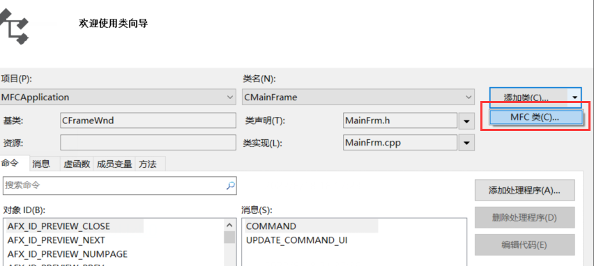
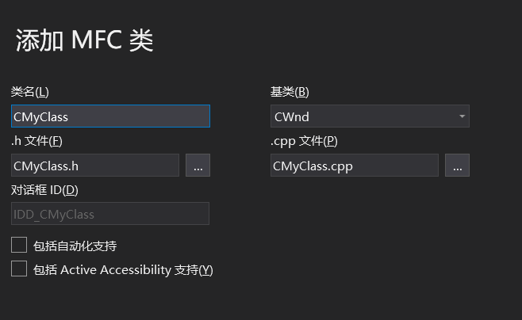
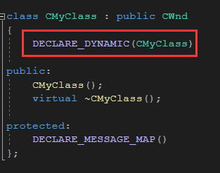
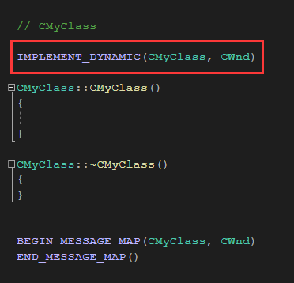
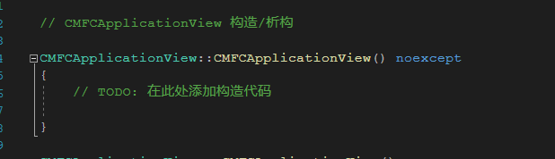
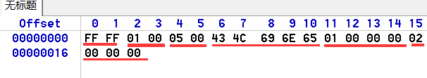
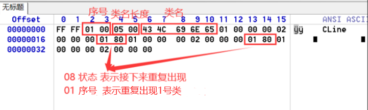

### 动态类型识别

把昨天代码判断继承关系的函数出出来封成函数

```c++
 CRuntimeClass* p = RUNTIME_CLASS(CTestApp);
  while(p) {
      
      printf("%s->", p->m_lpszClassName);
      p = p->m_pBaseClass;
     
  }
  printf("\n");


void ShowRuntime(CRuntimeClass* pRuntimeClass) {

  //RUNTIME_CLASS(CTestApp) 等价于 (CRuntimeClass*)(&CTestApp::classCTestApp)    
  pRuntimeClass = RUNTIME_CLASS(CTestApp);   
    
  while(pRuntimeClass) {
      
      printf("%s->", pRuntimeClass->m_lpszClassName);
      pRuntimeClass = pRuntimeClass->m_pBaseClass;
     
  }
  printf("\n"); 
}

这里参数不用字符串目前是无法实现，用字符串无法得到 CRuntimeClass 的类型
而我们最终目的就是通过字符串来实现类

上面无法用字符串实现的原因，通过字符串 无法知道类的 rtti 信息，因为要遍历所有的类去比较，但是目前我们还无法遍历
那么如果我们有一个数据结构 保存了所有的类名，那么我就可以实现遍历了

现在问题就是 怎么把类保存进数据结构呢，因为要实现框架，所以不可能让用户每写一类自己就加进去
，而我们又不知道用户将来会写那些类，而且就算我们知道，那要加的类可能也需要加很多

因此我们希望能够的动态的加载，当用户创建类，自动把类保存到数据结构中
```

#### 动态保存使用的类

我们用链表保存来保存所有的类（用哈希表也可以）

因为该链表所有的派生类都要用得到，我们放到  CObject 类 的 cpp中

**std::list<CRuntimeClass\*>  g_ClassInfo = nullptr;**

链表有了，不那么我们接下来就考虑怎么自动保存类了

具有 RTTI 功能类 具有一个特点 ，那就是一定有成员 **CRuntimeClass   classCObject**，并且唯一

静态对象就等于一个全局对象

那我们每个类在构造   **CRuntimeClass**    类时，把信息保存进链表就可以了

```c++
CRuntimeClass() {
  g_ClassInfo->push_back(this);
};

但是这样就会产生问题，因为前面我们有

const CRuntimeClass CObject::classCObject = { "CObject",
sizeof(CObject), 0xFFFF, &CObject::CreateObject, NULL };

这样会产生构造和重载不明确的问题，因为下面是等号，并不是带参构造，所以就相当于存在2个默认构造
所以 直接在构造是放链表目前行不通

为了解决这个问题，我们可以再建一个类或结构体    

//类    
struct CClassInit {
  CClassInit(CRuntimeClass* pRuntimeClass);
};

//声明
CClassInit initCObject(RUNTIME_CLASS(CObject));

//实现
CClassInit::CClassInit(CRuntimeClass* pRuntimeClass) {
  g_ClassInfo->push_back(pRuntimeClass);
}

那接下来我们就要考虑怎么让他来调这个函数呢，这个是关键

我们可以考虑 结构体当个类的静态成员 ，那么类构造时，也会调这个函数，但是这样不是很方便
因为 我们可以直接放全局变量   这样的好处就是不用在头文件声明链表

那么怎么让所有类都有呢，那么就可以用到前面的宏了，只需要宏后面加进去

#define IMPLEMENT_RUNTIMECLASS(class_name, base_class_name, wSchema, pfnNew, class_init) \
	const CRuntimeClass class_name::class##class_name = { \
		#class_name, sizeof(class class_name), wSchema, pfnNew, \
			RUNTIME_CLASS(base_class_name), NULL, class_init }; \
	CRuntimeClass* class_name::GetRuntimeClass() const \
		{ return RUNTIME_CLASS(class_name); }\
  CClassInit init##class_name(RUNTIME_CLASS(class_name));     //添加 CClassInit 类


上面还有一个问题，要完成我们需要的功能，需要链表比其他类都要先构造，但是全局对象的构造顺序由编译器控制
我们无法决定构造的先后顺序，因此有可能出现 对象比链表先构造，这时后往链表添加数据，系统就会崩溃。

解决办法就是放全局对象指针，然后再构造对象时，判断一下链表时候构造，没构造的话就先构造链表
std::list<CRuntimeClass*>  *g_pClassInfo = nullptr;

CClassInit::CClassInit(CRuntimeClass* pRuntimeClass) {
  if (g_pClassInfo == nullptr) {   //如果链表对象指针为空，那我们就手工去构造，可以防止重复构造
    g_pClassInfo = new std::list<CRuntimeClass*>();
  }

   g_pClassInfo->push_back(pRuntimeClass);
}

这样会造成资源泄露问题，他因此可以给  CClassInit 写一个析构，当他为空的时候释放内存

这样我们就可以通过字符串来寻找对应的类了
void ShowRuntime(const char* pszClassName) {
  for (auto pRuntimeClass : *g_pClassInfo) {
     if (strcmp(pRuntimeClass->m_lpszClassName, pszClassName) == 0) {
        while (pRuntimeClass) {  //遍历基类
            printf("%s->", pRuntimeClass->m_lpszClassName);
            pRuntimeClass = pRuntimeClass->m_pBaseClass;
         }
         printf("\n");
     }
  } 
}

```

### 动态创建

通过前的步骤,我们已经可以动态拿到类的信息了，但是我们的目的时实现动态创建对象

我们通过字符串获取类信息就是为实现动态创建服务的，如果只是想识别一个对象的类型，昨天的知识点就可以了

那么如何实现动态创建呢

```c++
//动态创建
CObject* CreateObject(const char* pszClassName) {
  for (auto pRuntimeClass : *m_pClassInfo) {
    if (strcmp(pRuntimeClass->m_lpszClassName, pszClassName) == 0) {

        // 实现new对象
    }
  }

  return NULL;
}

CObject* pWnd =  CreateObject("CWnd");
```

 这时候我们可以考虑到 CAD ，点一个菜单，画一种图形，点不同的菜单，画不同的图形，即通过类工厂来实现

​         我们只需要再   CRuntimeClass 里面继承类工厂的功能，就可以实现动态创建了

​         我们在CAD时类工厂是通过多态来实现的，但是我们现在没对象，所以CAD的设计在这里用不了，但是类工厂的设计有很多种方式。没有对象来可以实现类工厂，思路其实很简单

```c++
class CObject
{
   ....
   ....
   ....
public:
  static CObject* CreateObject();
   ....
   ....
   ....
};

CObject* CObject::CreateObject() {
  return new CObject();
}

//把创建对象的函数指针填入 CRuntimeClass 对象
const CRuntimeClass CObject::classCObject = { "CObject",
sizeof(CObject), 0xFFFF, &CObject::CreateObject, NULL };

创建对象
CObject::CreateObject();

但是这样是写死的，那么如何动态决定创建对象呢
我们可以把韩数指针放入  CRuntimeClass  中，这样创建对象是调函数就可以了


struct CRuntimeClass {
public:
  LPCSTR m_lpszClassName;             //类名
  int m_nObjectSize;                  //类大小
  UINT m_wSchema;                     //版本号
  CObject* (*m_pfnCreateObject)();    //创建对象的函数指针
  CRuntimeClass* m_pBaseClass;        //CRuntimeClass 对象指针

  CRuntimeClass* m_pNextClass;
  const void* m_pClassInit;
};


那么接下来我们需要实现 每个类自动实现该函数，并且把地址放入CRuntimeClass对象中不能让用户自己来实现
还是可以继续用之前用到的宏


#define DECLARE_DYNAMIC(class_name) \
public: \
	static const CRuntimeClass class##class_name; \
	virtual CRuntimeClass* GetRuntimeClass() const; \
    static CObject* CreateObject();   //创建对象函数声明


#define IMPLEMENT_DYNAMIC(class_name, base_class_name) \
	IMPLEMENT_RUNTIMECLASS(class_name, base_class_name, 0xFFFF, &class_name::CreateObject, NULL)\
    CObject* class_name::CreateObject() {return new class_name();}    //创建对象函数实现


通过字符串创建对象函数
CObject* CreateObject(const char* pszClassName) {
  for (auto pRuntimeClass : *m_pClassInfo) {
    if (strcmp(pRuntimeClass->m_lpszClassName, pszClassName) == 0) {
         return pRuntimeClass->m_pfnCreateObject();
    }
  }
  return NULL;
}
```

#### 通过UI来辅助完成添加宏功能

​        上面已经可以完整实现动态创一个类了，但是有一个要求，必须添加2个宏，但是用户可能忘记写了，或者不知道要写，甚至因为不知道作用而把宏删除。

​         这个问题的解决方法就是不让用户写代码，而是提供UI 给用户操作，然后自动帮用户写代码









但是MFC中，此功能存在bug，有时候可能漏加宏，可能是 .h 中的宏忘加了也可能是 .cpp 中的宏忘加了

就会编译报错，就需要删了重建 ，或者自己手工把没有的宏加进去


因此编译器加代码也不知道代码加在哪，需要通过信息去定位，因此就会扫描代码，然后做标记(注释)，

       

然后加代码就会在下面加，如果用户标记（注释）删了，编译器就无法定位真正需要加代码的位置，可能代码加错位，导致整个工程出错，这时候删了重建也没法解决问题，因此代码已经被覆盖了

#### MFC的设计

MFC的设计跟我们的存在一点点区别

例如：   new   Cobject 是没有意义的，没用功能

因此MFC 对于有意义的 类 就支持  CreateObject ，没有意义的就不实现 该功能

所以，MFC 定义了多个宏

```
动态创建：  DECLARE_DYNCREATE(CMFCApplicationView)    //有动态创建功能，但不支持字符串创建（没有链表）
#define DECLARE_DYNCREATE(class_name) \
	DECLARE_DYNAMIC(class_name) \
	static CObject* PASCAL CreateObject();

有创建对象，但是没有使用链表


类型识别： DECLARE_DYNAMIC(CCmdTarget)      //没有动态创建功能但是有 动态识别功能
#define DECLARE_DYNAMIC(class_name) \
public: \
	static const CRuntimeClass class##class_name; \
	virtual CRuntimeClass* GetRuntimeClass() const; \

没有用到创建对象，并且没有用到链表

序列化： DECLARE_SERIAL(CObList)    //支持字符串动态创建对象功能
#define DECLARE_SERIAL(class_name) \ 
	_DECLARE_DYNCREATE(class_name) \
	AFX_API friend CArchive& AFXAPI operator>>(CArchive& ar, class_name* &pOb);

用到了创建对象，而且使用了链表

//添加链表
extern AFX_CLASSINIT _init_##class_name;

void AFXAPI AfxClassInit(CRuntimeClass* pNewClass);
struct AFX_CLASSINIT
	{ AFX_CLASSINIT(CRuntimeClass* pNewClass) { AfxClassInit(pNewClass); } };
```

**而且因为多线程同步问题，MFC的很多全局变量都是放在 TLS 中，而我们可以通过关键字** **thread_local****来实现**

**thread_local**   std::list<CRuntimeClass*> *m_pClassInfo = nullptr;

但是接下来可能全局对象需要同步，因此我们需要到处写，所以可使用动态 TLS

申请一个 TLS 指针，这个可以当结构体指针，然后在结构体里面 放全局对象，以后要加全局对象，只需要加在结构体里面就可以了 

**但是这样还是存在一个问题，如果A线程操作B线程的界面，那么将导致同步线程出问题**

**解决办法就是切换 TLS**   

**AfxGetStaticModuleState ()**      获得当前线程的TLS

**AFX_MANAGE_STATE**                   TLS切换成当前线程的TLS

使用的方法    AFX_MANAGE_STATE(AfxGetStaticModuleState( )); 

加这个宏所有的api都是操作当前的线程，如果不加，那么操作的就是主线程


### 序列化

MFC中，序列化才用到字符串创建对象的功能，平时是不用的


序列化 —— 把内存中的对象存入二进制流中

反序列化 —— 把二进制流的对象数据读取到内存中


object => 序列化 =>  二进制流  =>   反序列化  => object

其中 序列化 和反序列化是自动实现的


要使一个类支持序列化：

1.  继承CObject
2.  重写Serialize成员函数
3.  在类声明中使用宏DECLARE_SERIAL
4.  定义一个无参构造（默认构造）  
5.  在类的实现中使用这个宏IMPLEMENT_SERIAL

```c++
---------------.h-------------
class CPerson : public CObject
{
public:
    DECLARE_SERIAL( CPerson )
    // empty constructor is necessary
    CPerson(){};

    CString m_name;
    WORD   m_number;
 
    void Serialize( CArchive& archive ); //数据成员的赋值，因为对象如果是指针，rtti中的对象大小就有问题
    
    // rest of class declaration
};


---------------.cpp-------------
    
IMPLEMENT_SERIAL( CPerson, CObject, 1 )


```

实现序列化和反序列化有2个难点

1.  怎么把对象转为二进制数据
2.  怎么把二进制数据转为对象

核心点就是  字符串创建对象

我只传递数据就只要  {"object" ，data}

这样就可以根据 字符串自动创建对象了， 而且我们在 rtti 中保存了对象的大小

#### MFC中的序列化实现

```c++
---------------CLine.h---------------------
#pragma once
class CLine :public CObject
{
    DECLARE_SERIAL(CLine)
public:
    virtual  void  Serialize(CArchive& ar) {   //重写该函数是为了解决数据读写的兼容性问题
        if (ar.IsStoring())
        {
            // ar.Write(&x, sizeof(x));
            // ar.Write(&y, sizeof(y));

            //MFC支持运算符重载
            ar << x;
            ar << y;
        }
        else
        {
            // ar.Read(&x, sizeof(x));
            // ar.Read(&y, sizeof(y));

            //MFC支持运算符重载
            ar >> x;
            ar >> y;
        } 
    };


private:
    int x = 1;
    int y = 2;       
};


---------------CLine.cpp---------------------
    
#include "pch.h"
#include "CLine.h"

IMPLEMENT_SERIAL(CLine, CObject, 1)  //类名，父类名，版本号


因此有虚函数，存在虚表，编译器肯定会生成默认构造
而且 成员给了初值，编译器只能在自动生成默认构造的时候赋值


   

// CMFCApplicationDoc 序列化
#include "CLine.h"
void CMFCApplicationDoc::Serialize(CArchive& ar)
{
	if (ar.IsStoring())
	{
		// TODO: 在此添加存储代码
		CLine obj;
        ar.WriteCount(3); //表示写入3个对象,用2字节在文件最开始出保存,对象太多的话自己可以重写保存数量
        ar << &obj; 

        //或者
        //ar.WriteClass(ar.ReadClass());  //获取对象类型
		//ar.WriteObject(&obj);  
        
          
	}
	else
	{
		// TODO: 在此添加加载代码
		CObject *pObj = nullptr;
        ar >> pObj;
		
        //或者 
        //pObj = ar.ReadObject(ar.ReadClass()); 
        
       
		
	}
}


MFC的运算符重载，还是分别调用的  WriteObject 和 ReadObject
    
```




#### 模拟实现序列化

1.  实现  ar l类

```c++
-----------  CObject.h ----------- 
class CArchive
{
public:
  enum Mode { store = 0, load = 1, bNoFlushOnDelete = 2, bNoByteSwap = 4 };
public:
  CArchive(const char* lpszFileName, UINT nMode);
  BOOL IsStoring() const;
  size_t Read(void* lpBuf, size_t nMax);
  void Write(const void* lpBuf, size_t nMax);
  CObject* ReadObject();
  void WriteObject(const CObject* pOb);
private:
  UINT m_nMode;         //模式
  FILE *m_FilePoint;    //文件指针
};


class CObject
{

public:
	....
	....
	....
  virtual void Serialize(CArchive& ar) const;
};

-----------  CObject.cpp ----------- 

void CObject::Serialize(CArchive& ar) const
{
}


CArchive::CArchive(const char* lpszFileName, UINT nMode)
{
  m_nMode = nMode;

  if (IsStoring()) {   //判断是读还是写
    m_FilePoint = fopen(lpszFileName, "wb");
  }
  else {
    m_FilePoint = fopen(lpszFileName, "rb");
  }
}


BOOL CArchive::IsStoring() const    //保存还是写入
{
  return (m_nMode & CArchive::load) == 0;      //读写
  return (m_nMode & CArchive::store) == 0;     //保存
}


size_t CArchive::Read(void* lpBuf, size_t nMax)     //读数据
{
  return fread(lpBuf, 1, nMax, m_FilePoint);
}

void CArchive::Write(const void* lpBuf, size_t nMax)   //写数据
{
  fwrite(lpBuf, 1, nMax, m_FilePoint);
  fflush(m_FilePoint);    //把缓冲区内的数据写入文件
}


CObject* CArchive::ReadObject()    //读对象
{
  int nLen = 0;
  Read(&nLen, sizeof(nLen));  //读长度

  char * lpszClassName = new char[nLen + 1];    //new 保存类名的缓冲区
  Read(lpszClassName, nLen);      //读取类名
  lpszClassName[nLen] = '\0';

 // new 对象
  CObject *pOb = NULL;
  for (auto pRuntimeClass : *m_pClassInfo) {
    if (strcmp(pRuntimeClass->m_lpszClassName, lpszClassName) == 0) {
      pOb =  pRuntimeClass->m_pfnCreateObject();
      break;
    }
  }
  if (pOb == NULL)
  {
    return NULL;
  }
  pOb->Serialize(*this);  //调用序列化保存数据

  return pOb;
}

void CArchive::WriteObject(const CObject* pOb)      //写入对象
{
  CRuntimeClass *pRuntimeClass = pOb->GetRuntimeClass();
  //check
  int nLen = strlen(pRuntimeClass->m_lpszClassName);
  Write(&nLen, sizeof(nLen));
  Write(pRuntimeClass->m_lpszClassName, nLen);  //写入类名
  pOb->Serialize(*this);                        //写入数据
}


```

```c++
---------- CTestDoc.h --------------
#include "CDocument.h"


class CTestDoc :public CDocument
{
  DECLARE_DYNAMIC(CTestDoc);

  void Serialize(CArchive& ar) const;
};


---------- CTestDoc.cpp --------------
#include "CTestDoc.h"

IMPLEMENT_DYNAMIC(CTestDoc, CDocument)


class CLine :public CObject  
{
  DECLARE_DYNAMIC(CLine)
public:
  virtual void Serialize(CArchive& ar) const {
    if (ar.IsStoring()) {
      ar.Write((void*)&x, sizeof(x));
      ar.Write((void*)&y, sizeof(y));
    }
    else {
       ar.Read((void*)&x, sizeof(x));
       ar.Read((void*)&y, sizeof(y));
    }
  }
private:
  int x = 0; 
  int y = 0;
};

IMPLEMENT_DYNAMIC(CLine, CObject)

void CTestDoc::Serialize(CArchive& ar) const
{
  if (ar.IsStoring()) {
    CObject *pOb = new CLine();
    ar.WriteObject(pOb);
 /*   CLine obj2;
    ar.WriteObject(&obj2);*/
  }
  else {
    CObject *pObj1 = ar.ReadObject();
    //CObject* pObj2 = ar.ReadObject();
  }
}

使用
CArchive ar("test.dat", CArchive::store);   //保存文件
pDocTemplate->m_pOnlyDoc->Serialize(ar);

CArchive ar("test.dat", CArchive::load);   //读取文件
pDocTemplate->m_pOnlyDoc->Serialize(ar);
```

但是上文保存数据还是有问题，因为一个对象就要一条数据，那怕对象类型相同，因此比较占空间，相同类性的对象多个，还是需要每个保存类名和长度，可以进行优化，把相同类名的对象的对象名和长度写一个，并且给一个序号，后面的再出现只需要把类名和长度用序号表示就可以了，这样就可以避免重复保存 类名 和 类名长度了

MFC的序列化就对此进行了优化设计，设计的代码在  WriteObject 里面感兴趣的可以去看



​         FF 是版本号，主要用于检查是否是我们保存的文件 ， 防止对文件是别人修改文件数据导致读数据造成漏洞 


​         现在很多语言提供关键字   seriza  自动实现序列化功能 

​        那样我们就可以少些很多代码，而且自动实现序列化和反序列化   ，如果成员不想加序列化 可以加关键字  unseriza   那么在实现序列化时就会忽略该成员