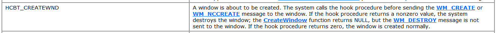

使用SDK编程最麻烦的就是消息处理  WndProc

1.  有哪些消息   -> 最好是提供界面查看
2.  参数解析
3.  修改代码

解决办法:

1.  用多态处理消息  重写处理消息的虚函数

但是多态有些地方处理不了


### 多态处理消息

​        多态是目前比较主流的一种消息处理机制


​         要实现多态必须有类,要响应消息必须要有窗口,因为我们需要为每个窗口绑定一个对象,窗口消息来了就去调虚函数完成多态,这也是最难得一点

​       那我们该怎么给每一个窗口绑定一个对象呢,  可以绑定一个  CWnd 对象 ,我们在 CWnd 里面提供了一个 CreateEx(创建窗口功能),并且会在创建窗口消息时候保存为了窗口句柄,那么这个对象就和窗口句柄绑定了

```c++
----------------CWnd.h--------------
#pragma once
#include "CCmdTarget.h"

class CDocument;
class CDocTemplate;
class CFrameWnd;

class CWnd :    public CCmdTarget
{
  DECLARE_DYNAMIC(CWnd);
public:
	......
	......
	......
  BOOL CreateEx(DWORD dwExStyle, LPCTSTR lpszClassName,
    LPCTSTR lpszWindowName, DWORD dwStyle,
    int x, int y, int nWidth, int nHeight,
    HWND hWndParent, HMENU nIDorHMenu, LPVOID lpParam);

public:
  HWND m_hWnd;
};


----------------CWnd.cpp--------------

BOOL CWnd::CreateEx(DWORD dwExStyle, LPCTSTR lpszClassName,
  LPCTSTR lpszWindowName, DWORD dwStyle,
  int x, int y, int nWidth, int nHeight,
  HWND hWndParent, HMENU nIDorHMenu, LPVOID lpParam)
{
  CREATESTRUCT cs;
  cs.dwExStyle = dwExStyle;
  cs.lpszClass = lpszClassName;
  cs.lpszName = lpszWindowName;
  cs.style = dwStyle;
  cs.x = x;
  cs.y = y;
  cs.cx = nWidth;
  cs.cy = nHeight;
  cs.hwndParent = hWndParent;
  cs.hMenu = nIDorHMenu;
  cs.hInstance = AfxGetInstanceHandle();
  cs.lpCreateParams = lpParam;

  HWND hWnd = CreateWindowEx(cs.dwExStyle, cs.lpszClass,
    cs.lpszName, cs.style, cs.x, cs.y, cs.cx, cs.cy,
    cs.hwndParent, cs.hMenu, cs.hInstance, cs.lpCreateParams);

  m_hWnd = hWnd;
  return TRUE;
}

```

所有窗口消息都会走消息过程函数

```c++
LRESULT AfxWndProc(HWND hWnd, UINT uMsg, WPARAM wParam, LPARAM lParam) {

  if (uMsg == WM_DESTROY) {
    ::PostQuitMessage(0);
  }

  return ::DefWindowProc(hWnd, uMsg, wParam, lParam);
}
```

但此时,并不知道对象在哪,因为窗口可以创建很多


#### 创建一个子窗口

​          子窗口要等主窗口创建完才能创建,因此我们必须处理主窗口的 WM_CREATE 消息,现在问题在于主窗口的 WM_CREATE  消息我们处理不了,因为我们不知道对象在哪 

1.  我们现在 CWnd 设计消息虚函数

```c++
#pragma once
#include "CCmdTarget.h"


class CWnd :public CCmdTarget
{
  DECLARE_DYNAMIC(CWnd);
public:
   .....
   .....
   .....
  virtual LRESULT OnCreate() {return FALSE;};
  virtual LRESULT OnDestroy() { return FALSE; };
public:
  HWND m_hWnd;

};


当我们想多态去派生类,对派生类说,要想处理消息重写  虚函数就可以了

#pragma once
#include "CFrameWnd.h"

class CTestFrame :public CFrameWnd
{
  DECLARE_DYNAMIC(CTestFrame);


  virtual LRESULT OnCreate(CREATESTRUCT* lpCreate)
  {
    ::MessageBoxA(NULL, "CTestFrame::OnCreate", "51ASM", MB_OK);
    return TRUE;
  }

  virtual LRESULT OnDestroy()
  {
    ::MessageBoxA(NULL, "CTestFrame::OnDestroy", "51ASM", MB_OK);
    return TRUE;
  }
};


那怎么多态过来呢   窗口不止一个,因此不可能用 CWinApp 中的 CWnd *m_pMainWnd;
而且窗口还可能是用户 new 出来的,用户自己保存对象,所以我们需要一个数据结构保存创建的所有
窗口对象,那么在 消息函数中就可以遍历,如果窗口句柄跟数据结构中的一样就可以多态,因此窗口很多
,用遍历的的方法太慢,因此可以哈希表,直接通过句柄直接查找对象

 //定义在 CWnd.cpp中   
#include <map>
std::map<HWND, CWnd*> g_WndMap;

BOOL CWnd::CreateEx(DWORD dwExStyle, LPCTSTR lpszClassName,
  LPCTSTR lpszWindowName, DWORD dwStyle,
  int x, int y, int nWidth, int nHeight,
  HWND hWndParent, HMENU nIDorHMenu, LPVOID lpParam)
{
  CREATESTRUCT cs;
  cs.dwExStyle = dwExStyle;
  cs.lpszClass = lpszClassName;
  cs.lpszName = lpszWindowName;
  cs.style = dwStyle;
  cs.x = x;
  cs.y = y;
  cs.cx = nWidth;
  cs.cy = nHeight;
  cs.hwndParent = hWndParent;
  cs.hMenu = nIDorHMenu;
  cs.hInstance = AfxGetInstanceHandle();
  cs.lpCreateParams = lpParam;

  HWND hWnd = CreateWindowEx(cs.dwExStyle, cs.lpszClass,
    cs.lpszName, cs.style, cs.x, cs.y, cs.cx, cs.cy,
    cs.hwndParent, cs.hMenu, cs.hInstance, cs.lpCreateParams);

  m_hWnd = hWnd;
  g_WndMap [hWnd]  = this;
  return TRUE;
}


保存对象可以在创建窗口 (CreateEx 函数) 的时候保存
并在  CWnd.h 声明一下    
LRESULT CALLBACK AfxWndProc(HWND hWnd, UINT uMsg,  WPARAM wParam, LPARAM lParam);

那么我们就将所有代码集中到了 消息处理函数中
因为在CWnd中的  CreateEx 保存了窗口对象和 对应句柄,因此任何一个窗口来我们都可以查找表


LRESULT CALLBACK AfxWndProc(HWND hWnd, UINT uMsg, WPARAM wParam, LPARAM lParam) {

  if (uMsg == WM_DESTROY) {
    ::PostQuitMessage(0);
  }

  CWnd* pWnd = g_WndMap[hWnd];
  if (NULL == pWnd) {    //如果为空说明map没有,就不是我们创建窗口
    return ::DefWindowProc(hWnd, uMsg, wParam, lParam);  //我们不需要管,直接调默认
  }

  LRESULT Result = FALSE;
  switch(uMsg) {
  case WM_CREATE:
    Result = pWnd->OnCreate((CREATESTRUCT *)lParam);
    break;
  case WM_DESTROY:
    Result = pWnd->OnDestroy();
    break;
  }

 if(Result)
 {
     return Result;
 }
  
  return ::DefWindowProc(hWnd, uMsg, wParam, lParam); 
}

这样我们就完成了多态,那么消息有多少(消息数量是固定的),我们就要去完成消息对应的虚函数,然后在
消息处理函数中 switch 加上判断

我们对消息处理种的 switch  进行调试 ,可以发现第一个断下来的是 WM_DESTROY
即 WM_DESTROY 消息在 WM_CREATE 消息前面 即 在 WM_CREATE 之前 生窗口句柄之后 系统还是产生其他消息       

因此在收到消息时 ,我们还没有吧 对象和 窗口对应信息保存到  map 中,但是如果把保存信息放到  
CreateWindowEx前面,此时窗口句柄还没有生成,放吧保存都不对,放在 CreateWindowEx 之后, 
CreateWindowEx 中间产生的消息我们就都漏掉了,为了保证不漏掉消息呢
    
如果后面追加消息,那么可能追加的消息很多,而且不同的版本需要追加的消息可能是不一样的(消息顺序由系统决定)
而且有的消息我们不能处理,系统能够处理

因此我们需要在窗口刚创建成功,什么消息都没产生的时候 就要把 信息保存到 map 中
所以我们可以直接 hook api 的信息 

因为 CreateWindowEx 是先创建窗口,在派发消息,因此我们可以查看汇编代码,看句柄什么产生 ,然后立即把窗口和对象信息保存进 map
但是这样兼容性很差

因此我们可以拦截消息 : SetWindowsHook  利用钩子,这样就不会漏消息,我们所有消息勾住,只要来一个消息我们就知道消息产生了此时我们就可以保存信息了


   
```

##### Hook   CreateWindowEx

```c++
其实我们想知道的是什么时候开始有了消息,当产生第一个消息时候窗口句柄已经有了因为有了句柄才能发消息

所以我们下的钩子必须要在前面  可以用到   WH_CBT  ,这个钩子是最前的  WH_CBT 中  
HCBT_CREATEWND 来的时候就准备产生  WM_CREATE 消息了


因此我们在  CreateWindowEx 之前就要下钩子,之后就卸载掉,而且还要再钩子里面判断是不是我们绑定的窗口,不然可能别人创建一个空间也被我们绑定了


HHOOK g_hHook = NULL;
CWnd  *g_pInit = NULL;
//钩子的构成函数
LRESULT CALLBACK CBTProc(int nCode,  WPARAM wParam, LPARAM lParam  )
{
  if (nCode < 0)  // do not process message 
    return CallNextHookEx(g_hHook, nCode, wParam, lParam);

  if (HCBT_CREATEWND == nCode) {    //判断要hook的api
    HWND hWnd = (HWND)wParam;
    if (g_pInit != NULL)
    {
      char szClassName[260];
      GetClassName(hWnd, szClassName, sizeof(szClassName)); //获取窗口名
      g_WndMap[hWnd] = g_pInit;
      g_pInit->m_hWnd = hWnd;
      g_pInit = NULL;   //防止重复调用
    }
  }

  return CallNextHookEx(g_hHook, nCode, wParam, lParam);
}


g_pInit = this;    
//下钩子  参数: 钩子种类 钩子过程函数 hook模块(指定线程可为空) hook线程
g_hHook = ::SetWindowsHookEx(WH_CBT, CBTProc, NULL, GetCurrentThreadId());  

  HWND hWnd = CreateWindowEx(cs.dwExStyle, cs.lpszClass,
    cs.lpszName, cs.style, cs.x, cs.y, cs.cx, cs.cy,
    cs.hwndParent, cs.hMenu, cs.hInstance, cs.lpCreateParams);

//卸载钩子
UnhookWindowsHookEx(g_hHook);


上面即使一个窗口都没创建也会有窗口过来,有可能被输入法绑定,因为输入可能比我们的窗口更早
所以可以拿一下窗口类名判断一下

```




小知识点:

  在监视窗口  在 变量 uMsg (消息种类) 后面+  ,wm 即   uMsg  ,wm   会将  uMsg 的常量值  转换成对应的 WM_XXXX  即消息种类对应的宏


##### 创建子窗口

```c++

  virtual LRESULT OnCreate(CREATESTRUCT* lpCreate)
  {
   
    //::MessageBoxA(NULL, "CTestFrame::OnCreate", "51ASM", MB_OK);

    //创建子窗口
     CWnd* pChild = new CTestView();  //行不通
     return TRUE;
  }

目前创建窗口 还 new 不了,因为没有  CTestView 的 RTTI ,因为 CTestView 还没写
    
我们之前创建了一个 CCreateContext 结构体      
struct CCreateContext   
{
  CDocument* m_pCurrentDoc;
  CDocTemplate* m_pNewDocTemplate;
  CRuntimeClass* m_pNewViewClass;
  CFrameWnd* m_pCurrentFrame;
};

我们可以把结构体指针当做参数传递


BOOL CTestApp::InitInstance()
{
  CSingleDocTemplate* pDocTemplate = NULL;
  pDocTemplate = new CSingleDocTemplate(
    IDR_MENU1,
    //下面3个类名是根据创建工程的工程名来,IDE自动生成
    RUNTIME_CLASS(CTestDoc),    
    RUNTIME_CLASS(CTestFrame),       // 主 SDI 框架窗口
    RUNTIME_CLASS(CTestView));
  if (!pDocTemplate)
    return FALSE;
  if (!pDocTemplate)
    return FALSE;

  AddDocTemplate(pDocTemplate);

  CWinApp::OnFileNew();

  m_pMainWnd->ShowWindow(SW_SHOW);
  m_pMainWnd->UpdateWindow();

  return TRUE;
}

//保存信息
------------ CDocTemplate.h --------------
#include "CCmdTarget.h"
#include "CDocument.h"

class CDocTemplate : public CCmdTarget
{
  DECLARE_DYNAMIC(CDocTemplate);
  CDocTemplate() {}
  CDocTemplate(UINT nIDResource, CRuntimeClass* pDocClass,
    CRuntimeClass* pFrameClass, CRuntimeClass* pViewClass);
public:
 virtual CDocument* OpenDocumentFile(LPCTSTR lpszPathName, BOOL bMakeVisible = TRUE);
 
 UINT m_nIDResource;						// IDR_ for frame/menu/accel as well
 CRuntimeClass* m_pDocClass;				// class for creating new documents
 CRuntimeClass* m_pFrameClass;			// class for creating new frames
 CRuntimeClass* m_pViewClass;			// class for creating new views
};

------------ CDocTemplate.cpp --------------
#include "CDocTemplate.h"

IMPLEMENT_DYNAMIC(CDocTemplate, CCmdTarget)

CDocTemplate::CDocTemplate(UINT nIDResource, CRuntimeClass* pDocClass, CRuntimeClass* pFrameClass, CRuntimeClass* pViewClass)
{
  m_nIDResource = nIDResource;
  m_pDocClass = pDocClass;
  m_pFrameClass = pFrameClass;
  m_pViewClass = pViewClass;
}

CDocument* CDocTemplate::OpenDocumentFile(LPCTSTR lpszPathName, BOOL bMakeVisible)
{
    return nullptr;
}


------------ CSingleDocTemplate.h --------------
#include "CDocTemplate.h"
#include "CFrameWnd.h"
class CSingleDocTemplate :public CDocTemplate
{
  DECLARE_DYNAMIC(CSingleDocTemplate);
  CSingleDocTemplate() {}
  CSingleDocTemplate(UINT nIDResource, CRuntimeClass* pDocClass,
    CRuntimeClass* pFrameClass, CRuntimeClass* pViewClass);
public:
  CDocument* OpenDocumentFile(LPCTSTR lpszPathName, BOOL bMakeVisible = TRUE);
  CDocument* OpenDocumentFile(LPCTSTR lpszPathName, BOOL bAddToMRU, BOOL bMakeVisible);
public:  
  CDocument* m_pOnlyDoc;
  UINT m_nIDResource;
};
------------ CSingleDocTemplate.cpp --------------
#include "CWinApp.h"

IMPLEMENT_DYNAMIC(CWinApp, CWinThread);

void CWinApp::OnFileNew()
{
  if (m_pDocManager != NULL)
    m_pDocManager->OnFileNew();
}

CWinApp::CWinApp()
{
}

void CWinApp::AddDocTemplate(CDocTemplate* pTemplate)
{
  if (m_pDocManager == NULL)
    m_pDocManager = new CDocManager;
  m_pDocManager->AddDocTemplate(pTemplate);
}

这样就完成了参数的传递


CWnd::
virtual LRESULT OnCreate(CREATESTRUCT *lpCreate) {return FALSE;};


重写虚函数 CTestFrame::
  virtual LRESULT OnCreate(CREATESTRUCT* lpCreate)
  {
    CCreateContext *pContext = (CCreateContext*)lpCreate->lpCreateParams;
    //创建子窗口
    CWnd* pChild = (CWnd*)pContext->m_pNewViewClass->m_pfnCreateObject();
    pChild->CreateEx(0,
      "EDIT",     //窗口类型
      "button1",  //窗口名
      WS_VISIBLE | WS_CHILD | ES_WANTRETURN | ES_MULTILINE | WS_BORDER,
      0, 0, 800, 800, GetSafeHwnd(), NULL, NULL);
     return TRUE;
  }

```

#### 响应子窗口消息

通过上面修改,子窗口的创建就可以完成了,但是如果子窗口也响应  OnCreate 的消息就有问题

```c++
--------------CTestView. ----------------
#include "CView.h"
class CTestView :
    public CView
{
  DECLARE_DYNAMIC(CTestView);

  virtual LRESULT OnCreate(CREATESTRUCT* lpCreate)
  {
    ::MessageBoxA(NULL, "CTestView::OnCreate", "51ASM", MB_OK);
    return FALSE;
  }
};

---------- CTestView.cpp-----------
#include "CTestView.h"

IMPLEMENT_DYNAMIC(CTestView, CView)

```

消息根本来不了

​        为了让消息能够多态处理消息,我们必须每一个 CreateWindowEX 都要把窗口和对像绑定,存入map方便查询,当窗口消息来的时候我们就可以通过查表调用对应窗口的虚函数,对于派生类来说,将来要处理消息重写虚函数就够了.

​       现在有一个问题, 在子窗口 创建子窗口是 create  根本没来.因为 子窗口类不是我们注册的,是系统自带的,,是系统提前注册过的,跟我们的过程函数没有关系,所以根本不会来我们的过程函数 

​       由此可以看出,用户自己注册的 ,或者系统注册的窗口类,我们处理不了

​       我们可以把不是我们注册的窗口的过程函数,通过 API:  SetWindowLong 换成我们的 如果考虑兼容 64 位 就要用  SetWindowLongPtr

​      修改时机是 要在 窗口句柄存在,消息没产生之前 修改,因此可以在 我们之前的 钩子函数里面改

```c++
-------------- CWnd.h ------------

class CWnd :public CCmdTarget
{
  DECLARE_DYNAMIC(CWnd);
public:
  CWnd()
  {
    m_hWnd = NULL;
    m_OldWndProc = NULL;
  }
  virtual BOOL DestroyWindow();
  BOOL ShowWindow(int nCmdShow);
  void UpdateWindow();
  HWND GetSafeHwnd() const;
  BOOL CreateEx(DWORD dwExStyle, LPCTSTR lpszClassName,
    LPCTSTR lpszWindowName, DWORD dwStyle,
    int x, int y, int nWidth, int nHeight,
    HWND hWndParent, HMENU nIDorHMenu, LPVOID lpParam);

  virtual LRESULT OnCreate(CREATESTRUCT *lpCreate) {return FALSE;};
  virtual LRESULT OnDestroy() { return FALSE; };
public:
  HWND m_hWnd;           //窗口句柄
  WNDPROC m_OldWndProc;  //旧的消息过程函数
};


-------------- CWnd.cpp ------------
    
.........
.........
.........    
    
HHOOK g_hHook = NULL;
CWnd  *g_pInit = NULL;
LRESULT CALLBACK CBTProc(int nCode,  WPARAM wParam, LPARAM lParam  )
{
  if (nCode < 0)  // do not process message 
    return CallNextHookEx(g_hHook, nCode, wParam, lParam);

  if (HCBT_CREATEWND == nCode) {
    HWND hWnd = (HWND)wParam;
    if (g_pInit != NULL)
    {
      char szClassName[260];
      GetClassName(hWnd, szClassName, sizeof(szClassName));
      g_WndMap[hWnd] = g_pInit;
      g_pInit->m_hWnd = hWnd;

      //修改过程函数
      WNDPROC WndProc = (WNDPROC)GetWindowLongPtr(hWnd,GWLP_WNDPROC);//获取原来的过程函数
      if (WndProc != &AfxWndProc) {   //这里不加判断可能会再次重复替换,导致递归(把原来的过程函数也换成我们的了,这样我们调原来的,原来的又调我们的)
        g_pInit->m_OldWndProc = WndProc;  //修改之前保存原来的过程函数
        SetWindowLongPtr(hWnd, GWLP_WNDPROC, (LONG_PTR)&AfxWndProc);   //修改过程函数 
      }

      g_pInit = NULL;
    }
  }

  return CallNextHookEx(g_hHook, nCode, wParam, lParam);
}


//我们的消息处理函数中
LRESULT CALLBACK AfxWndProc(HWND hWnd, UINT uMsg, WPARAM wParam, LPARAM lParam) {

  if (uMsg == WM_DESTROY) {
    ::PostQuitMessage(0);
  }

  CWnd* pWnd = g_WndMap[hWnd];
  if (NULL == pWnd) {
    return ::DefWindowProc(hWnd, uMsg, wParam, lParam);
  }

  LRESULT Result = FALSE;
  switch(uMsg) {
  case WM_CREATE:
    Result = pWnd->OnCreate((CREATESTRUCT *)lParam);
    break;
  case WM_DESTROY:
    Result = pWnd->OnDestroy();
    break;
  }
   //调用原来的过程函数
  if (pWnd->m_OldWndProc != NULL)
    return (*pWnd->m_OldWndProc)(hWnd, uMsg, wParam, lParam);
  
  return ::DefWindowProc(hWnd, uMsg, wParam, lParam); 
}

```

上面代码基本可以实现我们预期的功能了,但是 会有各种往我们里面注入的界面,尤其输入法,再启动一个界面时,输入法会自动注进去,我们也会跟他们绑定,把他们的过程函数也改了,改了会不会产生问题,我们也不清楚,因为不确定他们是否会检测自己的过程窗口函数被修改

​        检查方法很简单,用刚才的钩子一样,检查一下当前的过程函数跟自己的是否一样,如果不一样就说明自己被别人注入了

​       因此在上面修改过程函数还需要做大量的判断,判断是否被意外修改的类,判断可以直接看一下MFC是怎么处理的

 MFC的处理方式 

```c++
BOOL CWnd::CreateEx(DWORD dwExStyle, LPCTSTR lpszClassName,
	LPCTSTR lpszWindowName, DWORD dwStyle,
	int x, int y, int nWidth, int nHeight,
	HWND hWndParent, HMENU nIDorHMenu, LPVOID lpParam)
{
	ASSERT(lpszClassName == NULL || AfxIsValidString(lpszClassName) ||
		AfxIsValidAtom(lpszClassName));
	ENSURE_ARG(lpszWindowName == NULL || AfxIsValidString(lpszWindowName));

	// allow modification of several common create parameters
	CREATESTRUCT cs;
	cs.dwExStyle = dwExStyle;
	cs.lpszClass = lpszClassName;
	cs.lpszName = lpszWindowName;
	cs.style = dwStyle;
	cs.x = x;
	cs.y = y;
	cs.cx = nWidth;
	cs.cy = nHeight;
	cs.hwndParent = hWndParent;
	cs.hMenu = nIDorHMenu;
	cs.hInstance = AfxGetInstanceHandle();
	cs.lpCreateParams = lpParam;

	if (!PreCreateWindow(cs))
	{
		PostNcDestroy();
		return FALSE;
	}

	AfxHookWindowCreate(this);  //安装钩子之后
	HWND hWnd = CreateWindowEx(cs.dwExStyle, cs.lpszClass,
			cs.lpszName, cs.style, cs.x, cs.y, cs.cx, cs.cy,
			cs.hwndParent, cs.hMenu, cs.hInstance, cs.lpCreateParams);

#ifdef _DEBUG
	if (hWnd == NULL)
	{
		TRACE(traceAppMsg, 0, "Warning: Window creation failed: GetLastError returns 0x%8.8X\n",
			GetLastError());
	}
#endif

	if (!AfxUnhookWindowCreate())
		PostNcDestroy();        // cleanup if CreateWindowEx fails too soon

	if (hWnd == NULL)
		return FALSE;
	ASSERT(hWnd == m_hWnd); // should have been set in send msg hook
	return TRUE;
}


//钩子的过程函数
void AFXAPI AfxHookWindowCreate(CWnd* pWnd)
{
	_AFX_THREAD_STATE* pThreadState = _afxThreadState.GetData();
	if (pThreadState->m_pWndInit == pWnd)
		return;

	if (pThreadState->m_hHookOldCbtFilter == NULL)
	{
		pThreadState->m_hHookOldCbtFilter = ::SetWindowsHookEx(WH_CBT,
			_AfxCbtFilterHook, NULL, ::GetCurrentThreadId());
		if (pThreadState->m_hHookOldCbtFilter == NULL)
			AfxThrowMemoryException();
	}
	ASSERT(pThreadState->m_hHookOldCbtFilter != NULL);
	ASSERT(pWnd != NULL);
	ASSERT(pWnd->m_hWnd == NULL);   // only do once

	ASSERT(pThreadState->m_pWndInit == NULL);   // hook not already in progress
	pThreadState->m_pWndInit = pWnd;
}


//钩子的回调函数
LRESULT CALLBACK
_AfxCbtFilterHook(int code, WPARAM wParam, LPARAM lParam)
{
	_AFX_THREAD_STATE* pThreadState = _afxThreadState.GetData();
	if (code != HCBT_CREATEWND)
	{
		// wait for HCBT_CREATEWND just pass others on...
		return CallNextHookEx(pThreadState->m_hHookOldCbtFilter, code,
			wParam, lParam);
	}

	ASSERT(lParam != NULL);
	LPCREATESTRUCT lpcs = ((LPCBT_CREATEWND)lParam)->lpcs;
	ASSERT(lpcs != NULL);


    ...............开始看的地方-----------
        
	CWnd* pWndInit = pThreadState->m_pWndInit;
	BOOL bContextIsDLL = afxContextIsDLL;
	if (pWndInit != NULL || (!(lpcs->style & WS_CHILD) && !bContextIsDLL))
	{
		// Note: special check to avoid subclassing the IME window
        //检查是否输入法窗口
		if (_afxDBCS)
		{
			// check for cheap CS_IME style first...
            // 任何一个输入法窗口都有属性  CS_IME 微软规定的,没有的话输入法窗口不能浮现在其他窗口上
			if (GetClassLong((HWND)wParam, GCL_STYLE) & CS_IME)
				goto lCallNextHook;

			// get class name of the window that is being created
			LPCTSTR pszClassName;
			TCHAR szClassName[_countof("ime")+1];  //判断是否输入法
			if (DWORD_PTR(lpcs->lpszClass) > 0xffff)
			{
				pszClassName = lpcs->lpszClass;
			}
			else
			{
				szClassName[0] = '\0';
#pragma warning(push)
#pragma warning(disable: 4302) // 'type cast' : truncation from 'LPCSTR' to 'ATOM'
				GlobalGetAtomName((ATOM)lpcs->lpszClass, szClassName, _countof(szClassName));
#pragma warning(pop)
				pszClassName = szClassName;
			}

			// a little more expensive to test this way, but necessary...
			if (::AfxInvariantStrICmp(pszClassName, _T("ime")) == 0)
				goto lCallNextHook;
		}

		ASSERT(wParam != NULL); // should be non-NULL HWND
		HWND hWnd = (HWND)wParam;
		WNDPROC oldWndProc;
		if (pWndInit != NULL)
		{
            //切换线程
			AFX_MANAGE_STATE(pWndInit->m_pModuleState);

			// the window should not be in the permanent map at this time
			ASSERT(CWnd::FromHandlePermanent(hWnd) == NULL);

			// connect the HWND to pWndInit...
			pWndInit->Attach(hWnd);
			// allow other subclassing to occur first
			pWndInit->PreSubclassWindow();

			WNDPROC *pOldWndProc = pWndInit->GetSuperWndProcAddr();
			ASSERT(pOldWndProc != NULL);

			// subclass the window with standard AfxWndProc
			WNDPROC afxWndProc = AfxGetAfxWndProc();
			oldWndProc = (WNDPROC)SetWindowLongPtr(hWnd, GWLP_WNDPROC,
				(DWORD_PTR)afxWndProc);
			ASSERT(oldWndProc != NULL);
			if (oldWndProc != afxWndProc)
				*pOldWndProc = oldWndProc;

			pThreadState->m_pWndInit = NULL;
		}
		else
		{
			ASSERT(!bContextIsDLL);   // should never get here

			static ATOM s_atomMenu = 0;
			bool bSubclass = true;

			if (s_atomMenu == 0)
			{
				WNDCLASSEX wc;
				memset(&wc, 0, sizeof(WNDCLASSEX));
				wc.cbSize = sizeof(WNDCLASSEX);
				s_atomMenu = (ATOM)GetClassInfoEx(NULL, _T("#32768"), &wc);
			}

			// Do not subclass menus.
			if (s_atomMenu != 0)
			{
				ATOM atomWnd = (ATOM)::GetClassLongPtr(hWnd, GCW_ATOM);
				if (atomWnd == s_atomMenu)
						bSubclass = false;
			}
			else
			{
				TCHAR szClassName[256];
				if (::GetClassName(hWnd, szClassName, 256))
				{
					szClassName[255] = NULL;
					if (_tcscmp(szClassName, _T("#32768")) == 0)
						bSubclass = false;
				}
			}
			if (bSubclass)
			{
				// subclass the window with the proc which does gray backgrounds
				oldWndProc = (WNDPROC)GetWindowLongPtr(hWnd, GWLP_WNDPROC);
				if (oldWndProc != NULL && GetProp(hWnd, _afxOldWndProc) == NULL)
				{
					SetProp(hWnd, _afxOldWndProc, oldWndProc);
					if ((WNDPROC)GetProp(hWnd, _afxOldWndProc) == oldWndProc)
					{
						GlobalAddAtom(_afxOldWndProc);
						SetWindowLongPtr(hWnd, GWLP_WNDPROC, (DWORD_PTR)_AfxActivationWndProc);
						ASSERT(oldWndProc != NULL);
					}
				}
			}
		}
	}

lCallNextHook:
	LRESULT lResult = CallNextHookEx(pThreadState->m_hHookOldCbtFilter, code,
		wParam, lParam);

#ifndef _AFXDLL
	if (bContextIsDLL)
	{
		::UnhookWindowsHookEx(pThreadState->m_hHookOldCbtFilter);
		pThreadState->m_hHookOldCbtFilter = NULL;
	}
#endif
	return lResult;
}

```

多逆向微软的软件,会找到大量未公开,但是功能十分强大的API

而且微软软件很多版本里面会故意留一些隐藏的漏洞和后门,是为了调用一些功能超强的API


MFC所窗口过程函数 都是  **AfxWndProc**    不然没法统一派发消息,因此他所有过程函数都是统一的

```c++

LRESULT CALLBACK
AfxWndProc(HWND hWnd, UINT nMsg, WPARAM wParam, LPARAM lParam)
{
	// special message which identifies the window as using AfxWndProc
    //往窗口发一个 0x360 消息,如果返回 true 就是MFC程序,返回值是假,就不是MFC 程序  
	if (nMsg == WM_QUERYAFXWNDPROC)
		return 1;

	// all other messages route through message map
	CWnd* pWnd = CWnd::FromHandlePermanent(hWnd);
	ASSERT(pWnd != NULL);
	ASSERT(pWnd==NULL || pWnd->m_hWnd == hWnd);
	if (pWnd == NULL || pWnd->m_hWnd != hWnd)
		return ::DefWindowProc(hWnd, nMsg, wParam, lParam);
	return AfxCallWndProc(pWnd, hWnd, nMsg, wParam, lParam);
}

// always indirectly accessed via AfxGetAfxWndProc
WNDPROC AFXAPI AfxGetAfxWndProc()
{
#ifdef _AFXDLL
	return AfxGetModuleState()->m_pfnAfxWndProc;
#else
	return &AfxWndProc;
#endif
}
```

  往窗口发一个 0x360 消息,如果返回 true 就是MFC程序,返回值是假,就不是MFC 程序,正常的软件不会处理这个 消息


windows 把所有控件消息封装成了一个消息 WM_COMMAND  ,控件的操作消息只能单独封装成一个类

[📎MyMFC.zip](./MyMFC day4.zip)