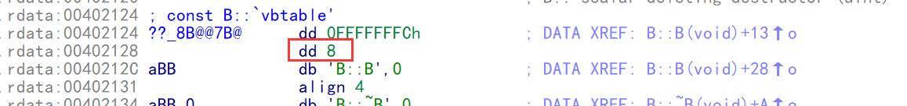
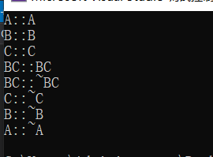
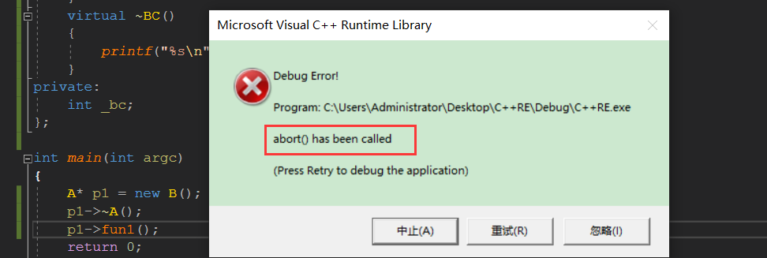
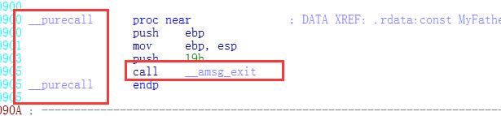

### 菱形继承

```c++
#include <stdio.h>
#include <string.h>

class A
{
public:
    A()
    {
        _a = 1;
        printf("%s\n", __FUNCTION__);
    }
    virtual ~A()
    {
        printf("%s\n", __FUNCTION__);
    }
public:
    int _a;
};

class B : public A
{
public:
    B()
    {
        _b = 2;
        printf("%s\n", __FUNCTION__);
    }
    virtual ~B()
    {
        printf("%s\n", __FUNCTION__);
    }
private:
    int _b;
};
class C : public A
{
public:
    C()
    {
        _c = 3;
        printf("%s\n", __FUNCTION__);
    }
    virtual ~C()
    {
        printf("%s\n", __FUNCTION__);
    }
private:
    int _c;
};

class BC : public B, public C
{
public:
    BC()
    {
        _bc = 4;
        printf("%s\n", __FUNCTION__);
    }
    virtual ~BC()
    {
        printf("%s\n", __FUNCTION__);
    }
private:
    int _bc;
};

int main(int argc)
{
    
    return 0;
}

```

#### 内存结构

**A内存结构：**

A::vtable

A::member


**B内存结构：**

B::vtable

A::member

B::member


**C内存结构：**

C::vtable

A::member

C::member


**BC内存结构：**

Bc::vtable

A::member

B::member

BC::vtable

A::member

C::member

BC::member

可以看出,在 BC 中A 的成员重复了 , 这样 BC访问  A 的成员无法访问


只能通过加作用域来访问,


而且如果A 存在函数 fun 的话  ,BC 如果调fun 话也不明确到底是 A,B,C 谁的fun,除非加作用域,   但是如果加作用域将无法实现多态,最主要的是,内存中成员重复,函数重复


如果上面A的信息如果不重复,将不存在我们所说的问题,,因此 C++ 提供了一种新的语法,虚继承


会将重复数据 A 抽出来,放到后面

**BC内存结构：**

Bc::vtable

B::member

BC::vtable

C::member

BC::member

pure_base:    //虚基类 A

A::vtable

A::member


但是这样将无法知道 抽出来的A信息放在哪,因此 不得不 在虚标下面加一个偏移表来位置信息


**虚继承过后的内存结构**

B::vtable

B::offset_table = {xxxxx, 8}

B::member

**pure_base:     //虚基类**

B::vtable         //虚表覆盖

A::member


C::vtable

C::offset_table = {xxxxx, 8}

C::member

**pure_base:     //虚基类**

C::vtable           //虚表覆盖

A::member


BC::vtable       //虚表覆盖

B::offset_table = {xxxxx, 24}

B::member

BC::vtable       //虚表覆盖

C::offset_table = {xxxxx, 12}

C::member

BC::member

**pure_base:     //虚基类**

BC::vtable         //虚表覆盖

A::member


派生类要覆盖虚表,首先要查偏移表,才能查到基类虚表的位置,才能覆盖,这代表偏移表的初始化的要遭遇虚表

### 虚继承

虚继承一般 就 cout 在用

#### 语法：

-   虚继承：为了防止派生类重复数据，对基类成员的寻址采取 this + 偏移的形式访问。
-   解决问题：专门解决C++菱形继承，从不用途径继承来得同一基类，会在子类中存在多份拷贝。这将存在两个问题：

-   -   浪费存储空间
    -   存在二义性：当调用时

**针对这种情况，C++ 提供虚基类（virtual base class）的方法，使得在继承间接共同基类时只保留一份成员。方法如下：**

```c++
class A    // 声明基类A
{
    // 代码
};
class B: virtual public A       // 声明类 B 是类 A 的公有派生类，A 是 B 的虚基类
{
    // 代码
};
class C: virtual public A       // 声明类 C 是类 A 的公有派生类，A 是 C 的虚基类
{
    // 代码
};
class BC: public B, public C    // 类 BC 中只有一份 A 的数据
{
    // 代码
};
```

【注意】虚基类并不是在声明基类时声明的，而是在声明派生类时，指定继承方式时声明的。因为一个基类可以在生成一个派生类时作为虚基类，而在生成另一个派生类时不作为虚基类。

问题：如何对虚基类进行初始化呢？

●如果在虚基类中定义了带参数的构造函数，而且没有定义默认构造函数，则在其所有派生类(包括直接派生或间接派生的派生类)中，通过构造函数的初始化列表对虚基类进行初始化。如下：

```c++
class A          // 声明基类 A
{
    A(int i);    // 声明一个带有参数的构造函数
};
class B: virtual public A    // A 是 B 的虚基类
{
    B(int n):A(n){ }         // B 类构造函数, 在初始化列表中对虚基类 A 进行初始化
};
class C: virtual public A    // A 是 C 的虚基类
{
    C(int n):A(n){ }         // C 类构造函数, 在初始化列表中对虚基类 A 进行初始化
};
class BC: public B, public C
{
    BC(int n):A(n),B(n),C(n){ }     // BC类构造函数, 在初始化列表中对所有基类进行初始化
};
```

-   【注意】在定义类 D 的构造函数时，与以往使用的方法有所不同。以往，在派生类的构造函数中只需负责对其直接基类初始化，再由其直接基类负责对间接基类初始化。现在，由于虚基类在派生类中只有一份数据成员，所以这份数据成员的初始化必须由派生类直接给出。如果不由最后的派生类直接对虚基类初始化，而由虚基类的直接派生类（如类 B 和类 C）对虚基类初始化，就有可能由于在类 B 和类 C 的构造函数中对虚基类给出不同的初始化参数而产生矛盾。**所以规定：在最后的派生类中不仅要负责对其直接基类进行初始化，还要负责对虚基类初始化。**


**问题：类 BC 的构造函数通过初始化表调了虚基类的构造函数 A，而类 B 和类 C 的构造函数也通过初始化表调用了虚基类的构造函数 A，这样虚基类的构造函数岂非被调用了 3 次？**

-   这点不必过虑，C++ 编译系统只执行最后的派生类对虚基类的构造函数的调用，而忽略虚基类的其他派生类（如类 B 和类 C）对虚基类的构造函数的调用，这就保证了虚基类的数据成员不会被多次初始化。
-   每个虚继承的子类都有一个**虚基类表指针**（占用一个指针的存储空间，4字节）和**虚基类表**（不占用类对象的存储空间）。虚基类表指针（virtual base table pointer）指向虚基类表（virtual table），虚表中记录了虚基类与本类的偏移地址，通过偏移地址，就找到了虚基类成员。


在这里我们可以**对比虚函数**的实现原理：

-   它们有相似之处，都利用了虚指针（均占用类的存储空间）和虚表（均不占用类的存储空间）。
-   虚基类依旧存在继承类中，占用存储空间；虚函数不占用存储空间。
-   虚基类表存储的是虚基类相对直接继承类的偏移；而虚函数表存储的是虚函数地址。


##### 1. 虚继承的构造顺序

-   构造虚基类
-   构造基类 -> 不够造基类的基类
-   构造成员类
-   构造派生类


**构造基类 -> 不够造基类的基类是如何实现的？**

-   **构造的时候传递一个参数进构造，根据参数决定调用基类构造和不调用基类的构造。**


**以菱形继承沙发床为例子**

```c++
class CBase {
public:
  CBase() {
    m_Color = 1;
    puts("CBase");
  }
  virtual ~CBase() {
    puts("~CBase");
  }
private:
  int m_Color;
};

class CBed :virtual public CBase {
public:
  CBed() {
    m_nWidth = 2;
    puts("CBed");
  }
  virtual ~CBed() {
    puts("~CBed");
  }

  virtual void fun1() {
  }
private:
  int m_nWidth;
};

class CSofa :virtual public CBase {
public:
  CSofa() {
    m_nHeight = 3;
    puts("CSofa");
  }
  virtual ~CSofa() {
    puts("~CSofa");
  }

  virtual void fun1() {
  }
private:
  int m_nHeight;
};


class CSofaBed :public CSofa, public CBed {
public:
  CSofaBed(){
    m_nWeight = 4;
    puts("CSofaBed");
  }
  virtual ~CSofaBed() {
    puts("~CSofaBed");
  }
private:
  int m_nWeight;
};

//构造顺序
1. 先构造Base类，在进入base类的构造前，先将偏移表填入到内存位置
2. 通过内存位置实现 Base的代码实现
3. 构造CSofa类的构造，其中传入一个参数进去，判断是否已经调用过构造了，调用过了则传入1，不构造基类的基类
4. 构造CBed的构造。如上
5. 构造派生类CSofaBed的构造。
```

-   注意：

-   -   在大多数编译器中，为了防止重复构造基类的基类，办法是实现函数，一个调用基类构造，一个不调用，但是在VS中，是以传入的标志来判断是否已经进行了基类的基类的构造。
    -   最先开始进行偏移表的填充，然后才是基类的基类的构造。然后才是正常的顺序，识别的时候通常识别构造顺序即可。


##### 2. 虚继承的内存结构

```c++
虚继承内存结构：
Base1::virtual
Base1::offset_table = {0， 20}
Base1::membe
Base2::virtual
Base2::offset_table = {0， 12}
Base2::member
Derived::member	//派生类成员
virtual Base::virtual
virtual Base::mem
```

偏移表：

1.  派生类填充
2.  时机：填充虚表之前

##### 3.课堂案例

```c++
#include <stdio.h>
#include <string.h>

class A
{
public:
    A()
    {
        _a = 1;
        printf("%s\n", __FUNCTION__);
    }
    virtual ~A()
    {
        printf("%s\n", __FUNCTION__);
    }
    virtual void fun1() = 0;
public:
    int _a;
};

class B :virtual public A
{
public:
    B()
    {
        _b = 2;
        printf("%s\n", __FUNCTION__);
    }
    virtual ~B()
    {
        printf("%s\n", __FUNCTION__);
    }
private:
    int _b;
};
class C :virtual public A
{
public:
    C()
    {
        _c = 3;
        printf("%s\n", __FUNCTION__);
    }
    virtual ~C()
    {
        printf("%s\n", __FUNCTION__);
    }
private:
    int _c;
};

class BC : public B, public C
{
public:
    BC()
    {
        _bc = 4;
        printf("%s\n", __FUNCTION__);
    }
    virtual ~BC()
    {
        printf("%s\n", __FUNCTION__);
    }
private:
    int _bc;
};

int main(int argc)
{
    BC bc;
    bc._a = 5;
    return 0;
}

```

此时B的虚表不能填到A的虚表,因为 fun1 只能用B的指针才能调,,因此必须在首地址处重新构建一个虚表 ,但是如果B没有虚函数就不会有,但是偏移表一定会存在

xor     eax, ebp

mov     [ebp+var_4], eax

push    1

lea     ecx, [ebp+b]    ; this

call    ??0B@@QAE@XZ    ; B::B(void)    ;B的构造

lea     ecx, [ebp+b]    ; this

call    ??_DB@@QAEXXZ   ; B::`vbase destructor(void)

mov     ecx, [ebp+var_4]

xor     eax, eax

??0B@@QAE@XZ    proc near       

this = ecx

​	push    ebp

​	mov     ebp, esp

​	push    this

​	cmp     [ebp+arg_0], 0

​	push    esi

​	mov     esi, this

​	mov     [ebp+var_4], esi

​	jz      short loc_40104F

​	lea     this, [esi+0Ch] ; this

​	**mov     dword ptr [esi+4], offset ??_8B@@7B@ ; const B::`vbtable'    填写偏移表**

​	call    ??0A@@QAE@XZ    ; A::A(void)      ;基类的构造,可以看到填写偏移表在基类之前

loc_40104F:                           

​	mov     eax, [esi+4]

​	**mov     dword ptr [esi], offset ??_7B@@6B0@@ ; const B::`vftable'{for `B'}     填写虚表**

​	push    offset aBB      ; "B::B"

​	push    offset _Format  ; "%s\n"

​	mov     eax, [eax+4]

​	**mov     dword ptr [eax+esi+4], offset ??_7B@@6BA@@@ ; const B::`vftable'{for `A'}    A的虚表**

​	mov     dword ptr [esi+8], 2

​	call    _printf

​	add     esp, 8

​	mov     eax, esi

​	pop     esi

​	mov     esp, ebp

​	pop     ebp

​	retn    4

??0B@@QAE@XZ    endp




```c++
#include <stdio.h>
#include <string.h>

class A
{
public:
    A()
    {
        _a = 1;
        printf("%s\n", __FUNCTION__);
    }
    virtual ~A()
    {
        printf("%s\n", __FUNCTION__);
    }
   
public:
    int _a;
};

class B :virtual public A
{
public:
    B()
    {
        _b = 2;
        printf("%s\n", __FUNCTION__);
    }
    virtual ~B()
    {
        printf("%s\n", __FUNCTION__);
    }
    virtual void fun1() {
    }
private:
    int _b;
};
class C :virtual public A
{
public:
    C()
    {
        _c = 3;
        printf("%s\n", __FUNCTION__);
    }
    virtual ~C()
    {
        printf("%s\n", __FUNCTION__);
    }
private:
    int _c;
};

class BC : public B, public C
{
public:
    BC()
    {
        _bc = 4;
        printf("%s\n", __FUNCTION__);
    }
    virtual ~BC()
    {
        printf("%s\n", __FUNCTION__);
    }
private:
    int _bc;
};

int main(int argc)
{
    BC bc;   //构造BC的时候 构造B 时,不需要构造虚基类A
    B b;     //构造B 时,需要构造虚基类A
    return 0;
}

```

先构造虚基类,在一次构造父类,父类不能再构造虚基类



```
push    1     ;因为如果 B被继承,那么构造B的派生类的时候,在构造B的事务将不能构造 B的虚基类,因此会传一个参数,1代表构造B的时候不够再虚基类,如果是0,说明 构造B的时候需要构造B的虚基类A
lea     ecx, [ebp+bc]   ; this
call    ??0BC@@QAE@XZ   ; BC::BC(void)
lea     ecx, [ebp+bc]   ; this
call    ??_DBC@@QAEXXZ  ; BC::`vbase destructor(void)
mov     ecx, [ebp+var_4]
xor     eax, eax
??0BC@@QAE@XZ   proc near             
	push    ebp
	mov     ebp, esp
	push    this
	push    esi
	mov     esi, this
	mov     [ebp+var_4], esi
判断是0还是1,决定是否调基类构造和填偏移表
	cmp     [ebp+arg_0], 0
	jz      short loc_4010B6
	lea     this, [esi+18h] ; this
       ;构造偏移表
	mov     dword ptr [esi+4], offset ??_8BC@@7BB@@@ ; const BC::`vbtable'{for `B'}
	mov     dword ptr [esi+0Ch], offset ??_8BC@@7BC@@@ ; const BC::`vbtable'{for `C'}
	call    ??0A@@QAE@XZ    ; A::A(void)    基类A的构造  

loc_4010B6:                             ; CODE XREF: BC::BC(void)+E↑j
	push    0       ; 传0,代表构造B的时候不构造虚基类A
	mov     this, esi       ; this
	call    ??0B@@QAE@XZ    ; B::B(void)
	push    0       ; 传0,代表构造C的时候不构造虚基类A
	lea     this, [esi+0Ch] ; this
	call    ??0C@@QAE@XZ    ; C::C(void)
	mov     eax, [esi+4]
	mov     dword ptr [esi], offset ??_7BC@@6BB@@@ ; const BC::`vftable'{for `B'}
	push    offset aBcBc    ; "BC::BC"
	push    offset _Format  ; "%s\n"
	mov     eax, [eax+4]
         ;重新覆盖偏移表
	mov     dword ptr [eax+esi+4], offset ??_7BC@@6BA@@@ ; const BC::`vftable'{for `A'}
	mov     dword ptr [esi+14h], 4
	call    _printf
	add     esp, 8
	mov     eax, esi
	pop     esi
	mov     esp, ebp
	pop     ebp
	retn    4
??0BC@@QAE@XZ   endp
```

可以看到,是否有通过标志来判断是否调用构造,可以看该函数是否有虚继承


release版就算开了内联也会填写偏移表,因此this指针是通过便宜表获得的

```c++
#include <stdio.h>
#include <string.h>

class A
{
public:
    A()
    {
        _a = 1;
        printf("%s\n", __FUNCTION__);
    }
    virtual ~A()
    {
        printf("%s\n", __FUNCTION__);
    }
public:
    int _a;
};

class B :virtual public A
{
public:
    B()
    {
        _b = 2;
        printf("%s\n", __FUNCTION__);
    }
    virtual ~B()
    {
        printf("%s\n", __FUNCTION__);
    }
    virtual void fun1() {
    }
private:
    int _b;
};
class C :virtual public A
{
public:
    C()
    {
        _c = 3;
        printf("%s\n", __FUNCTION__);
    }
    virtual ~C()
    {
        printf("%s\n", __FUNCTION__);
    }
private:
    int _c;
};

class BC : public B, public C
{
public:
    BC()
    {
        _bc = 4;
        printf("%s\n", __FUNCTION__);
    }
    virtual ~BC()
    {
        printf("%s\n", __FUNCTION__);
    }
private:
    int _bc;
};

int main(int argc)
{
    BC bc;
    C* p1 = &bc;
    A * p2 = p1;
    p2->fun1();
    return 0;
}

```

```
xor     eax, ebp
mov     [ebp+var_10], eax
push    eax
lea     eax, [ebp+var_C]
mov     large fs:0, eax
push    1
lea     ecx, [ebp+bc]   ; this
call    ??0BC@@QAE@XZ   ; BC::BC(void)
mov     eax, dword ptr [ebp+bc.baseclass_0.gap8]
lea     ecx, [ebp+bc.baseclass_0.gap8]
mov     [ebp+var_4], 0
mov     eax, [eax+4]       ;拿到偏移表
add     ecx, eax
mov     eax, [ecx]
call    dword ptr [eax+4]
lea     ecx, [ebp+bc]   ; this
call    ??_DBC@@QAEXXZ  ; BC::`vbase destructor(void)
xor     eax, eax
```

### 识别特征

-   识别要点：

-   -   构造顺序 (先构造虚基类,在一次构造父类,父类不能再构造虚基类)
    -   内存结构：多一个虚基类表。
    -   偏移表
    -   根据标志决定是否调用基类构造


注意：填偏移表比填虚表早，偏移表在没进构造的时候就填了。


## 抽象类

```c++
// Test.cpp : 此文件包含 "main" 函数。程序执行将在此处开始并结束。
//

#include <stdio.h>
#include <memory.h>
#include <string.h>
#include <typeinfo>
#include <iostream>

/*
虚继承:

A内存结构：
A::vtable
A::member

B内存结构：
B::vtable
A::member
B::member

C内存结构：
C::vtable
A::member
C::member

BC内存结构：
Bc::vtable
A::member
B::member
BC::vtable
A::member
C::member
BC::member

虚继承
B::vtable
B::offset_table = {xxxxx, 8}
B::member
pure_base:
B::vtable
A::member

C::vtable
C::offset_table = {xxxxx, 8}
C::member
pure_base:
C::vtable
A::member


BC::vtable
B::offset_table = {xxxxx, 20}
B::member
BC::vtable
C::offset_table = {xxxxx, 12}
C::member
BC::member

pure_base:
BC::vtable
A::member

特征：
1)偏移表
2)根据标志决定是否调用基类构造
*/

class A
{
public:
  A()
  {
    _a = 1;
    printf("%s\n", __FUNCTION__);
  }
  virtual ~A()
  {
    printf("%s\n", __FUNCTION__);
  }
  
  virtual void fun1() = 0;
public:
  int _a;
};

class B :virtual public A
{
public:
  B()
  {
    _b = 2;
    printf("%s\n", __FUNCTION__);
  }
  virtual ~B()
  {
    printf("%s\n", __FUNCTION__);
  }

  virtual void fun1() {
  }
private:
  int _b;
};
class C :virtual public A
{
public:
  C()
  {
    _c = 3;
    printf("%s\n", __FUNCTION__);
  }
  virtual ~C()
  {
    printf("%s\n", __FUNCTION__);
  }
private:
  int _c;
};

class BC : public B, public C
{
public:
  BC()
  {
    _bc = 4;
    printf("%s\n", __FUNCTION__);
  }
  virtual ~BC()
  {
    printf("%s\n", __FUNCTION__);
  }
private:
  int _bc;
};


int main(int argc) {

  A *p1 = new B();
  p1->~A();
  p1->fun1();

  return 0;
}
```



#### 语法


-   类的继承与派生是一个从抽象到具体的过程。抽象类等同于虚基类，既然是抽象事物，就不存在实体。如平常所说的东西，它就不能被实例化。将某一物品描述为东西，等同于没有描述。
-   纯虚函数：没有实现的虚函数，只能被继承，没有自己的实现。所以派生自他的类必须实现自己虚函数。
-   纯虚函数是为了子类实现，自己不能实现。但是反汇编代码中其实实现了，只不过里面调用了提示错误的API.就是为了当你错误调用时报错提示：不能创建xxx对象的实例等。
-   如果强制将父类对象的指针转换为子类对象的指针，如下所示：

CDervie*pDervie=（CDervie*）＆base；//base为父类对象，CDervie继承自base

-   -   这条语句虽然可以编译通过，但是存在潜在的危险。例如，如果说：“张三长得像张三他爹”，张三和他爹都能接受；如果说：“张三他爹长得像张三”，虽然也可以，但是不招人喜欢，可能会给你的社会交际带来潜在的危险。

#### 2.识别纯虚函数

##### 1. 核心

-   _purecall：识别_purecall 的参考引用，代表纯调用，没有实现，对应函数来自导入表（IDA中，导入函数名为粉色标识）。
-   

##### 2. 特征

-   **纯虚函数的反汇编：为了子类实现，自己不能实现。但是反汇编代码中其实实现了，只不过里面调用了提示错误的API.就是为了当你错误调用时报错提示：不能创建xxx对象的实例等。**
-   **Debug下反汇编：**

-   -   纯虚函数内部：在子类构造的时候父类会构造，父类构造自己的时候会填写虚表指针，直接找父类的虚表指针即可，然后定位虚表中的第二项（第一项是父类的虚析构,第二项才是我们的）。

[

-   -   纯虚函数在低版本就是19h,并且调用__amsg_exit,且如果弄了签名,则是__purecall