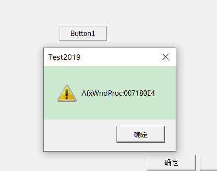
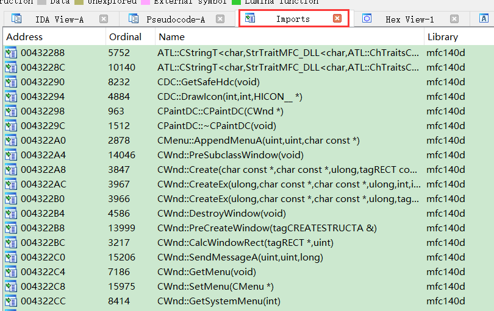
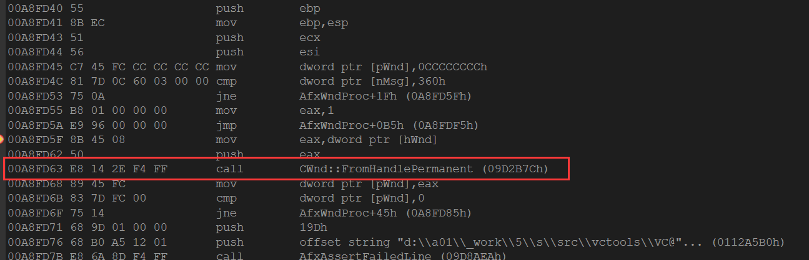
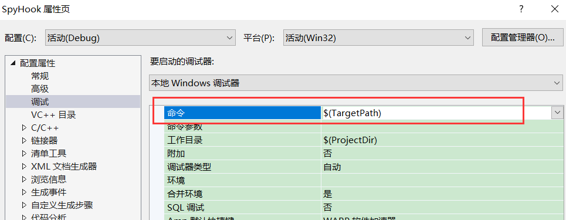

MFC程序双击控件编译器做了3件事

1.  加声明
2.  加实现
3.  加宏

注意: 在宏里面前辈别乱加和乱删注释,可能会用来扫描代码定位,删了或加了可能导致 编译器添加代码失败


新建一个MFC 程序



在逆向分析中,我们其实是要找按钮代码在哪,那怎么快读定位到代码呢,如果从 winmain开始看需要的时间很长


放到IDA中,可以看到很多函数被认出来了,因为被导入了


mfc140d  =>  mfc    mfc库      140 编译器版本     d   debug版

因此他导入的库会有很多版本

通过搜索,dll有以下8种

 u   unicode      m  多线程

debug版:  

mfc140d.dll

mfc140ud.dll

mfcm140d.dll

mfcm140ud.dll

release版:

mfc140.dll

mfc140u.dll

mfcm140.dll

mfcm140u.dll

此外还有静态链接的 lib 库 ,也有8种情况

静态链接能够是别来只能通过sig文件,sig需要做8个版本,但是如果有其他版本,其他版本也需要做, IDA高版本都对便器的每个版本都做了sig文件,但不全,而且基本只做了release版,因为debug版不常见

但是我们写的类,sig文件不可能识别出来,但是IDA帮我们排除掉了框架代码,我们只需要找无符号的


### 辅助逆向工具

辅助逆向工具一般有2种 

1.  静态分析工具

读可执行文件数据,把里面所有信息全部显示出来

静态是通过特征来找数据,但是特征容易被抹除

1.  动态分析工具

软件运行起来,从内存中获取数据,然后显示出来

#### 动态分析工具

##### 获取RTTI表信息

软件在内存中的信息就是表  

RTTI 表   只要拿到RTTI表,那他所有那他所有的继承层次和类名就都知道了,并且可以知道对象在内存中的地址

RTTI 表 放在全局数据区 (如果是静态版就是在常量区[RTTi表是有格式的],动态版也可以在常量区搜,但是可能会有失误,因此我们需要一种更靠谱的方法)

RTTI表 是 通过   GetRuntimeClass  函数获取的    因此我们只需要找到这个函数,那么我们可以调这个函数让他自己去拿,因此需要在内存中定位到这个函数地址

GetRuntimeClass   在虚表当中,因此就简化为获取虚表

要拿到一个表的虚表,需要拿到这个类的对象,即 this指针

​        从昨天的知识点我们可以知道 对象的this指针在 HashMap 表中,但是 HashMap 得有 key,key就是窗口句柄

 	而窗口句柄可以通过api获得


​         那么我们现在主要就是获取 HashMap ,但是即使我们知道 HashMap  地址,也不一定知道怎么操作,哈希表操作数据结构,不同版本还会不一样,但是不管怎么样,都要先获取HashMap 地址


调AfxWndProc之前一定会查找,因此通过调用堆栈,我们就可以找到查表的位置  ,可以知道是通过函数CWnd::FromHandlePermanent(hWnd) 可以拿到  HashMap

HashMap 是放在 tls 里面

如果 我们能拿到  FromHandlePermanent  函数地址,那么我们就不需要关心  HashMap 是什么数据结构,我们只需要提供窗口句柄,他自己会把对象地址给我们,这样就屏蔽了版本的差异性

而且 FromHandlePermanent   这个 函数是静态的,这样我们就不用辛辛苦苦的去找 this 指针,直接调就可以了,现在我们的关键就是拿到这个函数地址


如果用的是动态库,那么他就会有一个dll,这个dll在老版本中是导出的(因此直接获取这个导出函数就可以了),在新版本当中也是导出的,但是是序号导出的,因此不通用

但是我们还有一种很巧妙的手法,我们可以写一个mfcdll,用的mfc单本跟要分析的mfc程序版本一样,然后把 这个mfcdll注入到程序进程,于是这个 包含FromHandlePermanent函数的 dll 不会加载2次,但引用计数 +1 ,这样就共享了这个dll,我们就可以在我们的mfcdll 种直接调用 FromHandlePermanent   函数 ,因为用的是同一个dll,所以函数地址是一样的,但是这样方法并不实用,因此如果对方是静态库,那么就没法使用

因此怎么稳定的拿到 各个版本的 FromHandlePermanent 函数地址是关键

这个函数不好定位,我们可以换一种思路,如果有函数调用这个函数,我们获取调用  FromHandlePermanent  的函数地址也可以

通过调试可以知道  AfxWndProc 要通过  FromHandlePermanent  去查找表,而且这个函数拿到很简单,因为 MFC所有的窗口过程函数都是它,我们只需要 API   GetWindwoLong 就可以了.


查看反汇编代码



那我们就可以知道   FromHandlePermanent  函数地址 就是  00A8FD63 + 偏移 (142EF4FF) + 指令长度(5)

我们可以知道,源码在各个版本基本是不变的,唯一能改变它的就只有编译选项了,但是,不论它是什么编译选项的汇编,他都是第一个被调的函数,因此我们可以改进一下通过 二进制汇编代码来搜索他

但是debug 和release  的汇编代码时候不一样的,因为debug 版有跳表

因此我们思路是 :

1.  1.  注入代码到分析进程
    2.  获取窗口过程函数地址 (AfxWndProc)
    3.  扫描特征
    4.  找到   CWnd::FromHandlePermanent(hWnd) 函数

不行把所有版本汇编代码看一遍,找到通用的特征码, 实在找不到通用的,可以用 switch  case做区分

因为我们进程之后和 对方进程 不一样 所以  知道 FromHandlePermanent 地址 和 句柄 也没办法调,因为进程不是同一个,因此得注入代码,信息都拿到之后再回来传给我们


#### 实现工具

UI一般做的会跟 spy++ 很像

根据api 获取目标句柄,就能获取到目标进程id,就可以注入代码了,就可以拿窗口句柄拿过程函数了

我们可以借助 spy 看一下我们获取的 结果是否正确,还可以参考spy++一些函数的实现

很多功能我们实现不了,spy++可以实现,我们可以参考spy++的实现,可以通过IDA 分析 spy++代码,因此spy++需要拖动获取窗口坐标得到窗口句柄,因此他一定会调用 WindowFromPoint (在常量区搜Point 即可,因此坐标一定跟Point相关)函数,在查找参考引用,就可以知道哪些函数调用了,每个函数用F5看一下,就可以大概知道怎么实现的,调用了那些api


不可以远程线程注入: 因为 远程线程注入可能会被当病毒, 其次 HashMap  是放在 tls 中,我们线程没有,因此拿不到 ,所以我们的保证我们注入的代码是在主线程中运行

```c++
有时候因为并不知道目标程序是unicode的还是Ascii的,所以就需要判断一下再决定调用GetWindowLongA版还是W版
通过IsWindowUnicode这个API来判断,参数就是HWND;
    WNDPROC WndProc;
    //获取过程函数
    if (IsWindowUnicode(hWnd)) {
        printf("Is Unicode\n");
        WndProc = (WNDPROC)GetWindowLongPtrA(hWnd,GWLP_WNDPROC);
    }else{
        printf("Not Unicode\n");
        WndProc = (WNDPROC)GetWindowLongPtrW(hWnd, GWLP_WNDPROC);
    }
```

有问题的做法

```c++
// MFCSpy.cpp : 此文件包含 "main" 函数。程序执行将在此处开始并结束。

#include <stdio.h>
#include <windows.h>

#pragma comment(lib, "./Debug/SpyHook.lib")

__declspec(dllimport) HHOOK g_Hook;
__declspec(dllimport) HWND g_hWnd;
__declspec(dllimport) DWORD g_dwTid;


void SetHook() {
  char szBuf[260];
  g_hWnd = FindWindowA(NULL, "MFCTest");  //获取窗口句柄
  wsprintfA(szBuf, "hWnd:%p\n", g_hWnd);  //格式化字符串
  OutputDebugStringA(szBuf);              //打印窗口句柄
  ::MessageBoxA(NULL, szBuf, NULL, MB_OK);
  if (g_hWnd == NULL) {
    return;
  }

  g_dwTid = GetWindowThreadProcessId(g_hWnd, NULL);  //获取进程id
  wsprintfA(szBuf, "dwTid:%p\n", g_dwTid);
  OutputDebugStringA(szBuf);                        //打印窗口进程
  ::MessageBoxA(NULL, szBuf, NULL, MB_OK);

  //手动加载dll
  HMODULE hModule = GetModuleHandleA("SpyHook");
  HOOKPROC SpyGetWndProc = (HOOKPROC)GetProcAddress(hModule, "_SpyGetWndProc@12");

  g_Hook = SetWindowsHookExA(WH_CALLWNDPROC, SpyGetWndProc, hModule, 0);  //给窗口过程函数下钩子,0代表全局钩子,具体进程的就是局部钩子
  wsprintfA(szBuf, "g_Hook:%p\n", g_Hook);
  OutputDebugStringA(szBuf);
  ::MessageBoxA(NULL, szBuf, NULL, MB_OK);
}


int main()
{
  SetHook();
  system("pause");
  return 0;
}

```

```c++
// dllmain.cpp : 定义 DLL 应用程序的入口点。
#include "framework.h"
#include <Windows.h>

//建立共享段
#pragma data_seg("MyData")
__declspec(dllexport) HHOOK g_Hook;
__declspec(dllexport) HMODULE g_hModule;
__declspec(dllexport) HWND g_hWnd = NULL;
__declspec(dllexport) DWORD g_dwTid;
#pragma data_seg() // 共享空间的结束
#pragma comment(linker, "/SECTION:MyData,RWS") // 设置为可共享的属性


extern "C" __declspec(dllexport) LRESULT CALLBACK SpyGetWndProc(int nCode,
  WPARAM wParam,  LPARAM lParam  ) {

  HWND hWnd = (HWND)lParam;

  DWORD dwTid = GetWindowThreadProcessId(hWnd, NULL);  //获取窗口 进程id

  if (dwTid == g_dwTid) {   //判断当前进程id跟我们要注入的进程id是否一样
    OutputDebugStringA("dwTid == g_dwTid");

    if (g_hWnd == hWnd) {
      OutputDebugStringA("g_hWnd == hWnd");

      //char szBuf[260];
      ////获取过程函数
      //WNDPROC WndProc = NULL;
      //if (IsWindowUnicode(hWnd)) {   //判断是 unicode 还是 ascii
      //  WndProc = (WNDPROC)GetWindowLongW(hWnd, GWLP_WNDPROC);  //获取窗口过程函数地址
      //}
      //else {
      //  WndProc = (WNDPROC)GetWindowLongA(hWnd, GWLP_WNDPROC); //获取窗口过程函数地址
      //}

      //wsprintf(szBuf, "WndProc:%p\n", WndProc);
      //OutputDebugString(szBuf);
      UnhookWindowsHookEx(g_Hook);   //找到了我们要的信息,就可以卸载钩子
    }
  }
 


  return CallNextHookEx(g_Hook, nCode, wParam, lParam);
}


BOOL APIENTRY DllMain( HMODULE hModule,
                       DWORD  ul_reason_for_call,
                       LPVOID lpReserved
                     )
{
    g_hModule = hModule;
    switch (ul_reason_for_call)
    {
    case DLL_PROCESS_ATTACH:
      break;
    case DLL_THREAD_ATTACH:
    case DLL_THREAD_DETACH:
    case DLL_PROCESS_DETACH:
        break;
    }
    return TRUE;
}


```

调试dll的时候   命令行要选择目标程序(我们要注入的程序),再运行我们要注入的程序(先运行) 和 用来注入的程序就可以了,这样就可以在目标进程中调试了


#### 功能示例

-   由于`Win10`的注入可能有些问题,所以选择`MFC`程序编写,然后注入自己,这样来完成代码的简单功能示例

```c++
HHOOK g_hHook;
HMODULE g_hModule;
HWND g_hWnd;
DWORD g_dwTid;

//定义函数指针
typedef   CWnd* (__stdcall* FUNTYPE)(HWND hWnd);   
//钩子回调
extern "C" __declspec(dllexport)  LRESULT CALLBACK SpyGetWndProc(int nCode, WPARAM 
                                              wParam, LPARAM lParam) {
	char szBuf[260];
	//获取参数
	PCWPSTRUCT lpInfo = (PCWPSTRUCT)lParam;
	//获取窗口句柄
	HWND hWnd = lpInfo->hwnd;
	if (g_hWnd == hWnd) {  //判断当前窗口句柄跟我们需要找的是否是同一个窗口
		WNDPROC WndProc = NULL;
		//获取过程函数
		if (IsWindowUnicode(hWnd)) {  //判断是否是unicode
			WndProc = (WNDPROC)GetWindowLongPtrA(hWnd, GWLP_WNDPROC);
		}
		else {
			WndProc = (WNDPROC)GetWindowLongPtrW(hWnd, GWLP_WNDPROC);
		}

		wsprintf(szBuf, "WndProc:%p", WndProc);
		OutputDebugStringA(szBuf);


		//搜索特征
		unsigned char* pCode = (unsigned char*)WndProc;  //注意,这里是无符号
		if (*pCode == 0xe9) { //先取一次内容,看看是不是跳表 0xE9 表示 jmp
			//跳表的话要额外的取一次内容,然后加上首地址,再加上5个字节的指令长度.
			pCode = pCode + *(int*)(pCode + 1) + 5;//(pCode+1)是取偏移,然后再转int*取内容
		}

		//FromHandlePermanent的函数指针
		FUNTYPE  pfnFromHandlePermanent = NULL;
		//然后开始搜索特征,也就是一直往下找call
		for (int i = 0; i < 200; i++) {   //200是控制一下循环次数,防止死循环
			if (*pCode == 0xe8) {//call的指令是e8
				break; //找到第一个call 就break掉
			}
			pCode++;
		}

		//获取函数地址
		pfnFromHandlePermanent = (FUNTYPE)(pCode + *(int*)(pCode + 1) + 5);

		//调用函数
		CWnd* pWnd = pfnFromHandlePermanent(hWnd); //这样就拿到CWnd了,
		//直接调用GetRuntimeClass,来获取CRuntimeClass
		CRuntimeClass* pRuntimeClass = pWnd->GetRuntimeClass(); 
        /*
        如果是注入代码的话在对方进程中是没有CWnd这个类的,但是用void*也是一样的而且也不能		直接调GetRuntimeClass(),但是它是CObject的第一个虚函数,所以就可以通过虚表来完成
	((FUNTYPE*)(*(int*)pWnd))[0](NULL);
		//也就是取虚表强转成数组指针,然后取第0项拿出函数地址调用,并且注入的话CRuntimeClass	结构体也是没有的,得自己定义,可以直接从MFC里抄过来
		*/
		//输出类名
		wsprintf(szBuf, "ClassName:%s", pRuntimeClass->m_lpszClassName);
		OutputDebugStringA(szBuf);
		//这样可以循环输出类名
		while (pRuntimeClass != NULL) {
			/*
			循环输出类名的话存在一个问题, 
			它有一个条件宏,也就是MFC是静态链接的话,pBaseClass指针指向基类
			但是它是动态的话,则需要调函数了
			#ifdef _AFXDLL
				CRuntimeClass* (PASCAL* m_pfnGetBaseClass)();
			#else
				CRuntimeClass* m_pBaseClass;
			#endif
			所以它拿基类实际上有两种方法,要看是静态链接,还是动态链接了
			如果是动态的话就要强转成m_pfnGetBaseClass函数指针后再调了
			至于如何得知它的动态还是静态,则需要遍历模块列表,但是这样太麻烦了
			可以直接看函数地址,如果是静态链接的话pfnFromHandlePermanent函数地址是在主模块,
			所以就判断这个函数地址是不是在主模块,在就是静态链接,不在就是动态
			动态: pRuntimeClass = pRuntimeClass->m_pfnGetBaseClass();
			静态: pRuntimeClass = pRuntimeClass->m_pBaseClass();
			*/
			pRuntimeClass = pRuntimeClass->m_pfnGetBaseClass();
          /*
          这里麻烦的地方就在于要把虚表里所有的函数地址都显示出来,但是不同的编译器版本虚表 
      是不一样的 而且这个特征码,不同的编译器会产生不同的代码,所以特征码也需要考虑多个版 
      本....
          */
            
		}

        //pWnd->GetMessageMap(); 获取消息映射表地址,但是只有派生类可以用,但是不影响我们只需要强制调虚表第几项就可以,那么他的整个消息处理在哪个函数就都清楚了
        
		//取消钩子
		UnhookWindowsHookEx(g_hHook);
	}
	return CallNextHookEx(g_hHook, nCode, wParam, lParam);
}
//HOOK函数
void SetHook(HWND hWnd) {

	g_hWnd = hWnd;
	//先给目标程序发个消息,判断它是不是MFC程序,给窗口发0x360消息,只有mfc程序才会返回ture
	if (!::SendMessage(hWnd, 0x360, NULL, NULL)) {
		AfxMessageBox("非MFC程序");
	}
	char szBuf[260];
	wsprintfA(szBuf, "hWnd %p", g_hWnd);
	OutputDebugStringA(szBuf);
	//获取目标进程的进程ID
	g_dwTid = GetWindowThreadProcessId(g_hWnd, NULL);
	//设置钩子,增加目标进程ID参数,只HOOK目标进程
	g_hHook = SetWindowsHookExA(WH_CALLWNDPROC, SpyGetWndProc, NULL, 
                                ::GetCurrentThreadId());
}

void CMySpyDlg::OnBnClickedButton1()
{
    //先HOOK自己了,做个测试...
	SetHook(GetSafeHwnd());
}
```

难点:

1.  要把虚表里所有的函数地址都显示出来,但是不同的编译器版本虚表 是不一样的,这就需要我们不断的更新
2.  不同的编译器会产生不同的代码,所以特征码也需要考个版本的情况....


-    如果只显示消息不显示虚表的话就不需要考虑虚表版本问题 

-   -   因为`GetRuntimeClass`和`GetMessageMap` ,`VC6`到2019它的虚表下标都是一样的,并不代表以后还是一样的

-    而且这个动态版工具无视壳的存在 

-   -   因为是直接从内存里获取的,就算有壳`HashMap`也得存在,它只要能运行起来,就能获取到数据.
    -   如果是静态版工具的话,一个压缩壳就废了,特征就被加密了,运行起来才会解密


#### 课堂源码

### 作业

实现 MFCSpy