## 64位CPU种类

1.  AMD64 CPU
2.  Intel   X64CPU

​         2组cpu的指令有所差别,会对我们的开发有影响, 如果出现有的指令存在 只有足足cpu支持,我们就最好不要用,因为我们也不确定程序将来会运行在什么平台,因此最好使用2组cpu都支持的指令

### 手册

========================= Intel x64 CPU =========================：

《10th Generation Intel Core Processor throughput and latency》：

记录每条指令的运行速度，供编译器作者阅读

《10th generation Intel Core Throughput and Latency README》：

《64-ia-32-architectures-optimization-manual》：

优化手册，供编译器作者阅读


《Intel® 64 and IA-32 Architectures Software Developer’s Manual》：

第一卷：CPU架构

第二卷：CPU指令

第三卷：操作系统开发

第四卷：操作系统相关

========================= AMD64 CPU =========================：

《1_ Application Programming》：应用程序开发

《2_ System Programming》：系统程序开发

《3_ General Purpose and System Instructions》：指令

《4_ 128-bit and 256 bit media instructions》：多媒体指令

《5_ 64-Bit Media and x87 Floating-Point Instructions》：多媒体指令

《Software Optimization Guide for AMD64 Processors》：软件优化向导

有时候需要看优化手册,不看优化手册有时候会搞不懂编译器为啥要用这条指令


x64已经没有指令周期了,只有延时和吞吐量

## 

## 64位与32位的区别

### 1. 64位程序与32位程序的区别

#### （1）程序与CPU

-   32位与64位程序，是指经过编译后的可执行文件，例如像Windows上的exe文件，而最初编写的源码并没有32位和64位之说。
-   不是所有的程序需要区分32位和64位，对于原生语言例如C语言编写的程序需要区分64位与32位，但是对于像Java这样的语言，就不需要这样了，因为Java编写的程序是在JVM(Java虚拟机）上运行的，JVM屏蔽了具体的硬件细节。
-   32位的程序就是将源码用32位的编译器编译的，64位的程序就是将源码用64位的编译器编译的。
-   32位与64位的程序的本质区别在于：两者最终在处理器上运行的指令是不一样的。

#### （2）程序与操作系统

-   应用程序只接触逻辑地址，并不接触真实的物理地址。32位的程序理论上可以申请利用4GB的地址空间，64位的程序则可以申请利用大于4GB 的地址空间，这也是64位程序的一个巨大优势。
-   应用程序的运行是需要操作系统作为支撑的，这些程序在运行时常常需要进行一些系统调用，还有各种库函数等。
-   这些可执行文件能否顺利运行有着两个最重要的地方：A.动态链接库。B.系统API。
-   对于Windows系统而言，64位的系统往往具有32位系统的库，因此在64位系统上能够运行32位的程序，但是反过来就不行了，因为32位系统一般没有64位系统的库。
-   32位升级到64位不是简单的重新编译发布一下就可以了。举个例子，在32位C语言环境里一个指针可以放入一个int型的变量中，但在64位里就不行了了，因为64位程序里的指针为64位，这样的话程序肯定就爆了，因此对于某些程序如果想要升级到64位，则需要修改源码，这个工作是相当繁琐的。

### 2. 64位CPU与32位CPU的区别

-   这两者的指令集合、操作数位数、寄存器名称和个数等等都不相同：

-   -   比如一条mov eax，1指令，可能在32bCPU上对应的机器指令是0x1201；在64位机器上就是0x123401。
    -   64位CPU里的寄存器数量也多于32位CPU。
    -   64位CPU里的寄存器是64位的，这样CPU每次处理的数据量也就更大，32位CPU寄存器是32位的。
    -   两者CPU的地址：

-   -   -   32位CPU的地址总线不一定是32位的，还有可能是48位的，地址范围是`232= 0x00000000~0xffffffff`：每个地址都可以使用）。
        -   64位的CPU地址总线也不一定是64位，往往都是48位`264 → （实际248）= 0~256T`。
        -   一般cpu每一位对应一条线,连到内存条,正常应该是64根,但是AMD公司觉得没必要,正常情况下用不到那么大的内存,因此砍掉了16跟,只剩下48根,但是物理线 做了52跟,以后有需要可以直接加

-   -   -   -   `0xXXXX0000`00000000~0xXXXXffff`ffffffff`：intel 高16位必须是第48位符号扩展，64-48的部分在intel CPU中为无效地址，不可编码。
            -   （1）R3(用户)的128T空间范围`0x000 00000`00000000 ~ 0x0000 7fff`ffffffff`，
            -   （2）R0(系统)的128T空间范围`0xffff 8000`00000000 ~ 0xffff ffff`ffffffff`。	
            -   如果不这样会带来一个问题  该16位虽然没用,但是还是会参与运算,那计算结果就会出问题
            -   因此高16要变成第47位的符号拓展 ,即 当第47位为 1 ,高16位全部为1为,即 FFFF,否则为 0000

​                                  因此  0x0000 8000 0000 0000  ,  0xFFFF 7000 0000 0000  等是一个无效地址,即无编码地址,不存在的                                      地址

-   -   现在对于主流的处理器，64位的CPU是能够兼容32位指令架构的。

-   64位CPU支持的物理内存大小 ：2^52 -> 4P -> 4096T。

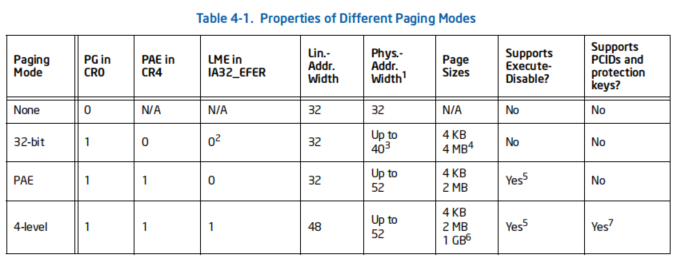

-   从上面可以看到64位CPU的运算能力理论上比32位CPU强很多。现在32位的CPU一般是X86架构的，从80386开始就是32位的CPU，也对应他的32位指令集。后来发展出64位CPU，从X86扩展出64位的指令集，一般我们就叫做X64，也叫AMD64架构，因为最早是AMD推出64位CPU的。

#### **64 位 CPU 的**三种**运行模式：**

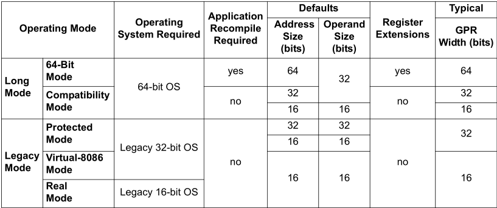

1.  兼容模式 

​     实模式。在此模式下，可以跑 16 位程序。微软的操作系统禁用此模式。 

​     兼容模式，也叫做长模式。用于模拟执行 32 位程序。 

\2. 长常模式，即 64 位模式。CPU 火力全开。 

#### AMD 和 Intel 关于 64 位汇编的历史：

-   AMD 原本是美国为了反垄断弄出的一个 Intel 的竞争公司（子公司），没想到 AMD 却在 64 位指令集上打败了 Intel。这是为什么呢？Intel 的技术无疑是比 AMD 要厉害许多的，但是在开发 64 位指令集（IA64 CPU 的指令集，即“安腾”CPU 的指令集）的时候，想到现有的 32 位指令集由于当初设计失败导致的种种缺点，Intel 决定全盘放弃之前的设计，推出一套全新的指令集。这套全新的指令集速度上会有质的飞跃，但是它不会去兼容旧的指令集。也就是说，之前的所有 32 位程序，都必须用新的编译器重新编译一遍，才可以在 Intel 的 64 位 CPU 上跑起来。这无疑是很大的成本，因此，Intel 的指令集不被市场欢迎。如今，IA64 CPU 只应用于服务器主机上（服务器主机追求性能，为了性能的提升，可以接受重新编译所有软件）。 
-   与此同时，AMD 率先推出了兼容原来的 32 位指令的 64 位指令集，因此 AMD 的 64 位 CPU 迅速占领了市场。Intel 随后意识到了自己的失败，然后也推出了一套兼容原来的 32 位指令的 64 位指令集，ia32e 。 
-   由于 Intel 的原因，（它觉得自己才是最牛逼的，AMD 只是一个小弟，）它（故意）让自己的 64 位指令集和 AMD 的指令集不完全兼容，这也就导致了如今 64 位汇编的现状：编译器编译 64 位程序的时候，由于不知道程序将来会在 Intel CPU 上还是 AMD CPU 上跑，所以会刻意只用那些能同时兼容两个 CPU 的汇编指令来翻译源代码，弃用那些不同时兼容两个 CPU 的汇编指令（例如 push reg32）。编译器的 
-   这种行为，导致了我们初看 64 位汇编代码会感觉很古怪。不过现在我们明白了这段历史，也就不会对这个现象再感到疑惑了。现在的 x64 是一种统称：任何兼容/类似AMD 64 标准的指令集，都被统称为 x64，其中包括：AMD 64，IA32e，Intel64 等。
-   详见本课课堂资料：Intel x64 CPU手册、AMD64 CPU手册。


### 3.64位**操作系统**与32位**操作系统**的区别

-   （1）32位的操作系统是专门为32位CPU设计的，同样64位的操作系统是为64位的CPU设计的。
-   （2）64位的CPU能够兼容32位指令架构，因此在64位CPU上也可以安装32位操作系统。
-   （3）32位的win7可以支持4G的逻辑地址空间，但其中用户能够分到的只有大约是3G多，还有一部分是分给系统内核了，64位的win系统，理论上寻址范围能够达到264。在这里多说一句，操作系统负责逻辑地址到物理地址的映射，因此32位的操作系统只能利用最大4G的物理内存。

### 4.**总结**

#### 4.1 64位与32位的区别

-   （1）32位CPU只能安装32位的操作系统，而32位操作系统只能运行32位的程序。
-   （2）64位CPU可以运行32位或者64位的操作系统，64位操作系统可以运行32位或64位程序。
-   （4）64位版本的程序占用的内存空间更大，因为它的指针是64位的，但同时它又可以申请更多的逻辑地址空间。
-   （5）32位的编译器也可以编译出64位的程序，这也是第一个64位的程序产生的基础，具体的实现无需深究。
-   （6）2006年之后的CPU都是64位CPU。

#### 4.2 64位的优势

-   （1）更大的内存：`232`→ `248`。
-   （2）更快的速度：寄存器有扩展，有新指令......。
-   （3）兼容32位与64位。

## x64汇编 基础知识

### 1.x64汇编寄存器

#### （1）浮点寄存器

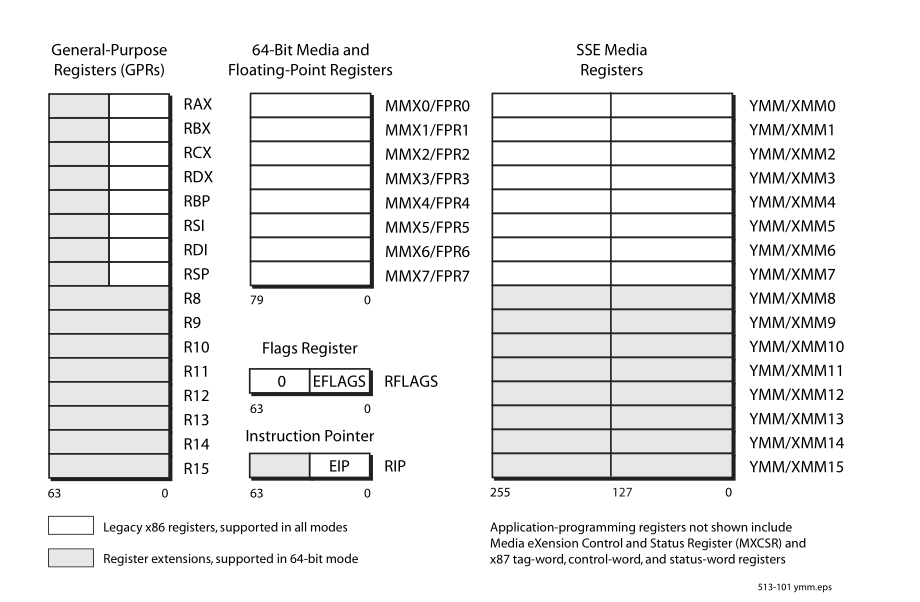

-   最明显的变化是有了 xmm 寄存器， xmm 寄存器的长度是 256 位。xmm 寄存器实际上完全代替了 FPR（浮点寄存器）的作用，使用 xmm 寄存器做浮点运算，速度飞快，因为它容量大，可以同时计算多个浮点数。 
-   **XMM寄存器+8个：**XMM8~XMM15
-   通用寄存器进行了拓展,并且新增了8个通用寄存器
-   原先的x87 指令集为了兼容仍然保留了下来,但是不再做其他处理
-   标志寄存器从32位拓展成了64位,但是高32位目前用不到,因此为0
-   RIP 执行32位用 eip ,64位用 rip

#### （2）其它寄存器：段、标志

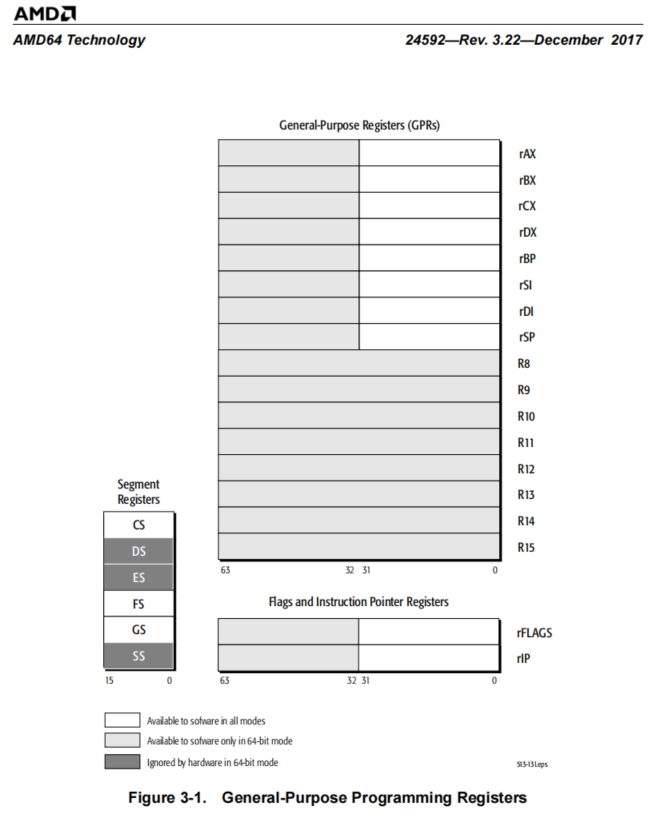

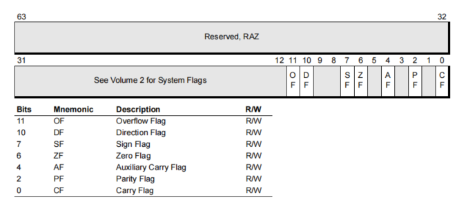


-   **标志寄存器：**RIP、RFLAGS、CF~OF
-   **段寄存器：**在 64 位汇编中，因为兼容性的原因，没有被取消，只能使用CS、FS、GS。 

####  （3）通用寄存器：

-   通用寄存器进行了拓展,并且新增了8个通用寄存器
-   RAX、RBX、RCX、RDX、RBP、RSI、RDI、RSP、R8~R15 

##### 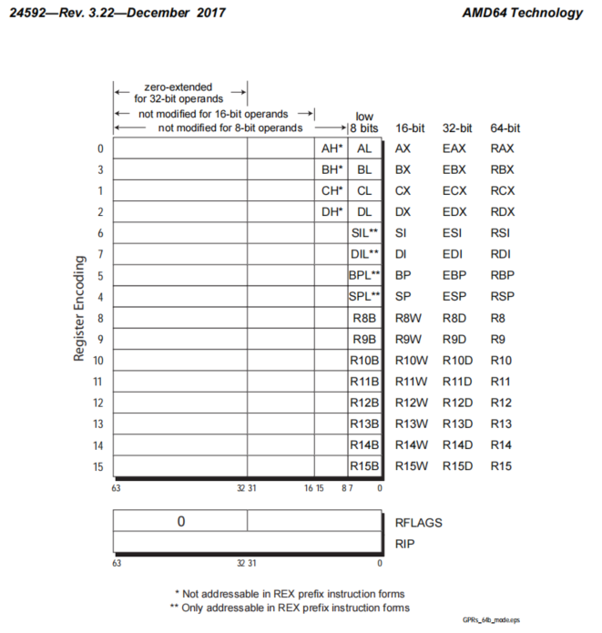

-   **X64 寄存器访问--后缀访问低位： b（低8位）、w（16位）、d（低32位），例：** r8b、r9w、r10d、r11

// 提示： **操作数为低8位、16位，传送不影响高位；操作数为低32位，高位被扩展；**

zero-extended for 32-bit operands

not modified for 8-bit operands

not modified for 16-bit operands

======================================================================

mov r8b,0 ; 不影响高位

mov r8w,0 ; 不影响高位

mov eax,0 ; 影响高位，mov eax,0（000~111） = mov rax,0（0000~1111），前者指令更短，解析更优

但是这样会给我们阅读代码带来麻烦      

例如  mov  eax,5

我们无法确定这个数 是 32 位还是 64位,得看后面怎么才能确定

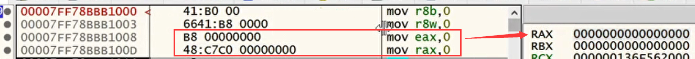

### 2.x64汇编 指令集

-   32位原有指令集就能够满足常规使用。只是增加了少量的拓展指令
-   新增的指令基本都在多媒体指令里面

### 3.x64 调用约定

​    增加了8个通用寄存器,因此对调用约定影响很大,此次以前的c调用约定将会被淘汰

-   64 位汇编与32位汇编的最大区别：就是函数调用方式的变化。x64 体系结构利用机会清除了现有 Win32 调用约定（如 __stdcall、__cdecl、__fastcall、_thiscall 等）的混乱。在设计调用约定时，因为现在寄存器增加，所以在 x64 中为了提升效率，我们选择多用寄存器传参。
-   减少调用约定行为还为可调试性带来了好处。需要了解的有关 x64 调用约定的主要内容是：它与 x86 fastcall 约定的相似之处。使用 x64 约定，会将前 4 个整数参数（从左至右）传入指定的 64 位寄存器：
-   使用四个是因为经过调查,一般函数传参不会超过4个

-   -   **（1）整数参数：**

-   -   -   前 4 个参数依序传入RCX、RDX、R8、R9。
        -   前 4 个以外的整数参数将使用栈传参。该指针被视为整数参数，因此始终位于 RCX 寄存器内。当传参需要用到栈的时候（代表参数大于 4 个了），考虑到不定参变参函数的情况，统一由函数的调用者负责平栈。据观察，我们常用的函数，它们的参数大多数都是小于等于 4 个的，比如 MessageBox()。在我们自己写的程序中，如果想让程序效率最优化，要让函数的参数少于等于 4 个。

-   -   **（2）浮点参数：**前 4 个参数依序传入 XMM0、XMM1、XMM2、XMM3，后续的浮点参数将放置到线程堆栈上。
    -   **（3）浮点参数整形混合：**传参使用对应位置的相应的寄存器,例如   int    float  float   int  传参将用  rcx     XMM1   r8     XMM3

-   更进一步探究调用约定，即使参数可以传入寄存器，编译器仍然可以通过消耗 RSP 寄存器在堆栈上为其预留空间。至少，每个函数必须在堆栈上预留 32 个字节（4 个 64 位值）。该空间允许将传入函数的寄存器轻松地复制到已知的堆栈位置。不要求被调用函数将输入寄存器参数溢出至堆栈，但需要时，堆栈空间预留确保它可以这样做。当然，如果要传递 4 个以上的整数参数，则必须预留相应的额外堆栈空间。
-   例如：

```c++
int Add(int a,int b,int c,int d,int e)
{
    return a+b+c+d+e;
}

==========================================
Add(2,3,4,5,6);
000000013FBD2DF1  mov         dword ptr [rsp+20h],6  
000000013FBD2DF9  mov         r9d,5  
000000013FBD2DFF  mov         r8d,4   //前四个参数寄存器传参
000000013FBD2E05  mov         edx,3  
000000013FBD2E0A  mov         ecx,2  
000000013FBD2E0F  call        Add (13FBD100Fh)
    
==========================================
Add(int(rcx),float(xmm1),int(r8),float(xmm3));	// 整型和浮点混合，寄存器的顺序固定
```

另外有一个细节，由于 push reg32 指令不兼容intel（AMD 和 Intel 对此指令的解释不一样），所以编译器会避免使用 push reg32 指令，而是使用类似 mov [rsp + 28h], reg 这种形式来把参数入栈。 换句话说，64 位的程序中，废除了之前的所有调用约定，而是使用一个统一的调用约定，暂命名为“寄存器快速调用约定”。 

●使用 masm 编译器编译的 64 位汇编代码，不支持很多常用的伪指令，可用的有：sizeof 关键字，local 关键字（定义局部变量）；不可用的有：if...else 等跳转语句（要自己 cmp 然后 jz）。

●注意：64位汇编环境push只在函数开始用作保存环境，不会作传参使用。


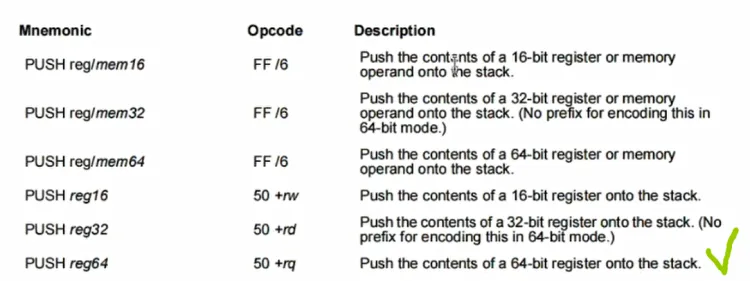


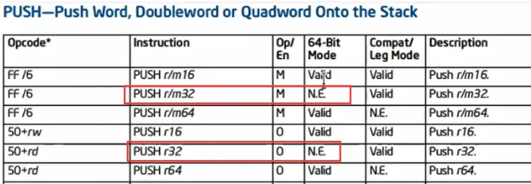

Intel push reg（N.E表无编码not encode）


 x64汇编开发环境 

 1.编译器的选择 

 （1）ml64.exe 

●对应于不同的x64汇编工具，开发环境也有所不同。最普遍的要算微软的MASM（微软的 masm编译器只单独更新到 6.15，已不再单独发布编译器，而是和VS一起打包打包），在x64环境中，相应的编译器已经更名为ml64.exe，随visualStudio 2013一起发布。因此，如直接安装VS2013既可。运行时，只需打开相应的64位命令行窗口，便可以用ml64进行编译了。

●m164.exe路径：D:\Microsoft\Microsoft Visual Studio\2019\Community\VC\Tools\MSVC\14.29.30037\bin\Hostx64\x64\ml64.exe

 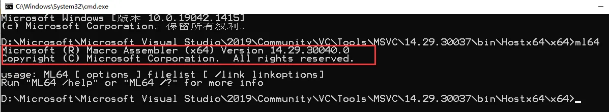 

 使用方法一：配置环境变量 

把 ml64 所在路径配置到  path   :  D:\Microsoft\Microsoft Visual Studio\2019\Community\VC\Tools\MSVC\14.29.30037\bin\Hostx64\x64

 使用方法二：VS脚本--x64 Native Tools Command Prompt for VS 2019 


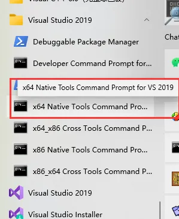

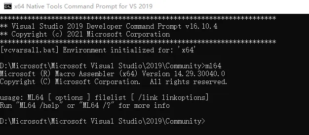


●使用帮助：ml /?

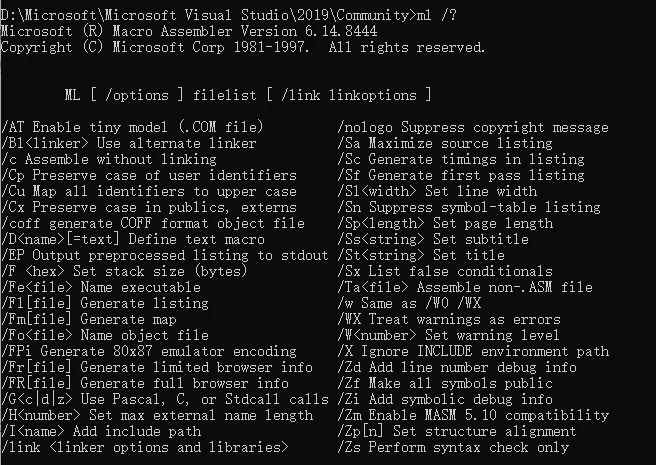


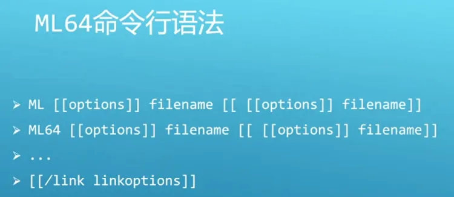


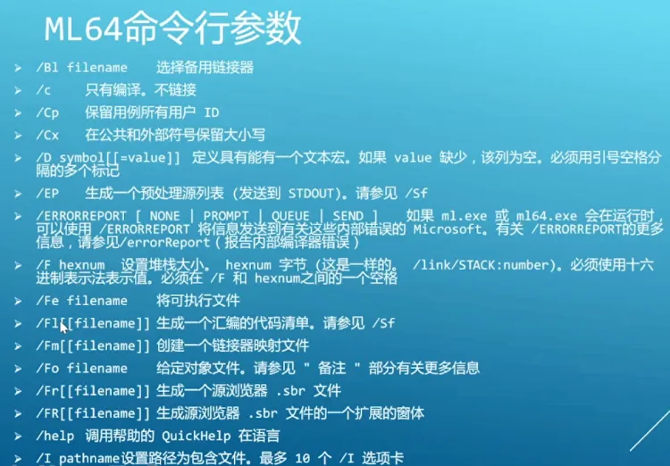


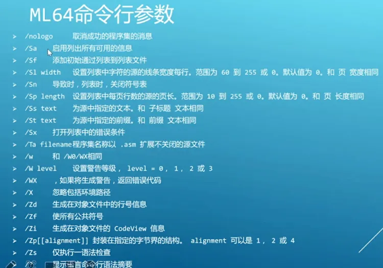

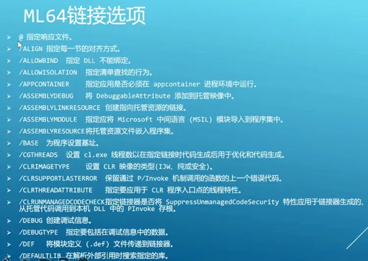

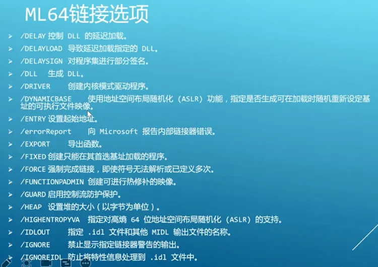

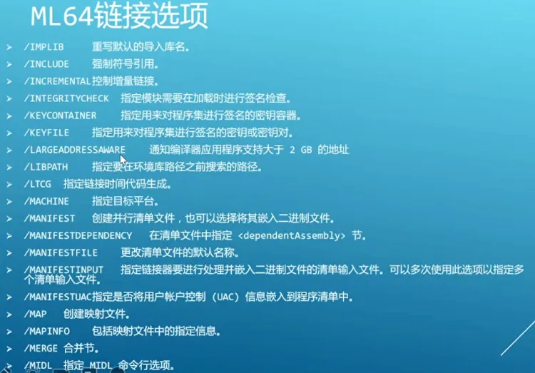


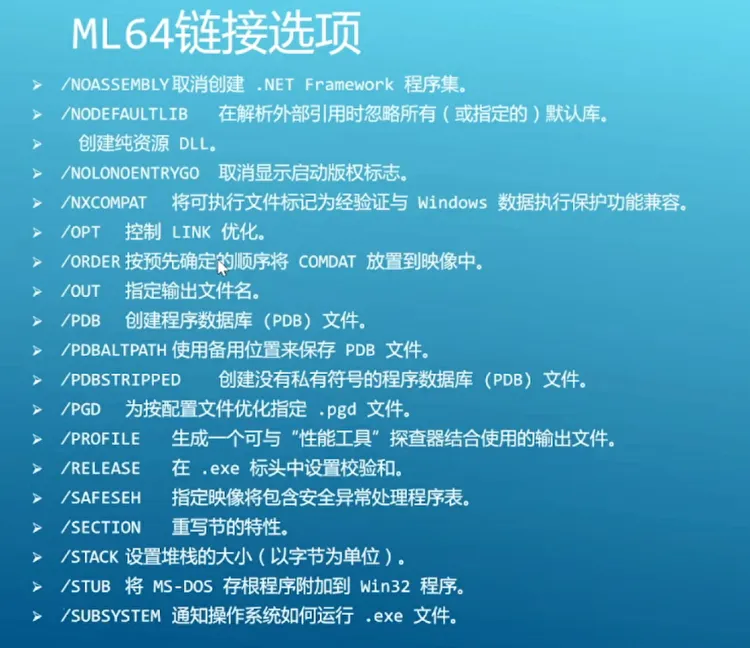

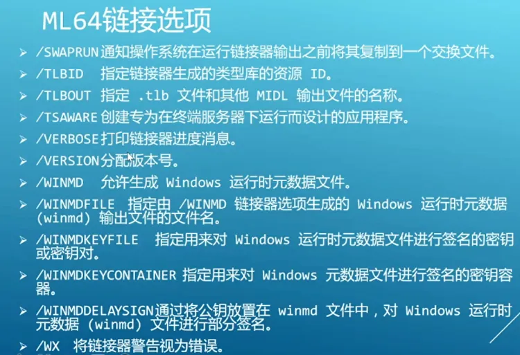


最简单的编译链接脚本： 

```
编译：ml64 /c Hello.asm 
链接：link /ENTRY:START /SUBSYSTEM:WINDOWS /OUT:Hello.exe Hello.obj 
```

#### 2）GoASM

-   第二个推荐的编译器是GoASM（实际上是 IDE），共包含三个文件:GoASM编译器、GoLINK链接器和GoRC资源编译器，且自带了Include目录，它的最大好外是小。它的地位类似于之前 32 位汇编时使用的 RadASM 环境。使用 GoASM 会感觉非常方便，但是因为我们是在研究逆向，所以必须使用微软的原生编译器，因为所有通过 VC，VS 编译出来的 64 位程序所使用的编译器都是 masm。 

## x64汇编程序

除了基本的伪指令,其他的伪指令都删了,并且不支持内联了

伪指令查询  :   https://docs.microsoft.com/en-us/previous-versions/visualstudio/visual-studio-2012/8t163bt0(v=vs.110)

### 1.编写Hello.asm

64位汇编代码中间传参基本没有push指令,对于逆向来说,很难看出函数参数数量了,因为还可能存在流程优化,而且平栈都是最后统一平

```assembly
; 宏
NULL EQU 0
MB_OK EQU 0

OPTION CASEMAP:none   ;大小写敏感

;包含库
includelib user32.lib
includelib kernel32.lib
includelib libcmt.lib 

.const  ; 常量区
TEXT db "Hello x64!", 0
TTILE db "51ASM", 0
FILE_NAME db "51asm.txt", 0
FILE_NAME2 db "51asm2.txt", 0
FMT1 db "%d %d %d %d %d", 0

; 函数声明
extern MessageBoxA:proc
extern ExitProcess:proc
extern CreateFileA:proc

.code   ; 代码区
START proc

    ;必须保证栈顶模16
    push rbx  ;保存环境，对齐

    // 8(对齐) + 20(预留) + 18(变量) +8 (对齐)
    sub rsp, 48h ;影子空间、预留栈空间：抬栈技巧=低4位为8h ,如果前面有push必须加上抬栈的值

    ; MessageBoxA弹窗：x64调用约定（rcx，rdx，r8，r9）
    mov rcx, NULL           ; 参数1：消息框没有窗口
    mov rdx, offset TEXT    ; 参数2：文本
    mov r8, offset TTILE    ; 参数3：标题
    mov r9d, MB_OK          ; 参数4：按钮
    call MessageBoxA

    mov dword ptr [rsp + 38h], 1    ; 局部变量1：4字节
    mov dword ptr [rsp + 3ch], 2    ; 局部变量2：4字节

    ; CreateFileA创建文件1
    mov  rcx, offset FILE_NAME      ; 参数1
    mov  edx, 0                     ; 参数2
    mov  r8d, 0                     ; 参数3
    mov  r9, 0                      ; 参数4
    ;[rsp + 0h]  到  [rsp + 20h] 32字节空间是影子空间 
    mov  dword ptr [rsp + 20h], 1   ; 参数5：打开方式
    mov  dword ptr [rsp + 28h], 80h ; 参数6：正常模式
    mov  qword ptr [rsp + 30h], 0   ; 参数7：模板
    call CreateFileA

    ; CreateFileA创建文件2
    mov  rcx, offset FILE_NAME2     ; 参数1
    mov  edx, 0                     ; 参数2
    mov  r8d, 0                     ; 参数3
    mov  r9, 0                      ; 参数4
    mov  dword ptr [rsp + 20h], 1   ; 参数5：打开方式
    mov  dword ptr [rsp + 28h], 80h ; 参数6：正常模式
    mov  qword ptr [rsp + 30h], 0   ; 参数7：模板
    call CreateFileA

    
    mov dword ptr [rsp + 38h], 1    ; 局部变量1：4字节  有时候很难看出是参数还是变量,只能通过后面使用情况判断
    mov dword ptr [rsp + 3ch], 2    ; 局部变量2：4字节  这里很明显可以看出是变量,栈地址不在16对齐上


     ;使用库函数,必须初始化,入口函数没初始化使用c库就会出问题,64位汇编入口函数包括stl都没有初始化
     ;正常一个控制台程序得初始化函数,入口代码得写,即得写main函数
     mov  rcx, offset FMT1
     mov  edx, 2
     mov  r8d, 3
     mov  r9d, 4
     mov  qword ptr [rsp+20h], 5
     mov  qword ptr [rsp+28h], 6
     call printf


    ; ExitProcess退出进程
    mov  ecx, 0
    call ExitProcess

    add rsp, 38h    ; 平栈

    pop rbp         ;恢复环境
    ret
START endp

end
```

要使用库函数必须    `link /subsystem:windows/entry:**mainCRTStartup** Hello.obj user32.dll`

因此还得找  **mainCRTStartup** 的静态库,不然后C库函数都会出问题,只能通过 vs2019   64位程序的库目录一个个去找,实在找不到就只能磁盘搜索,例如通过 notepadd 搜索看一下那个文件里面有这个符号,找到库后,链接进来就行了

#### 代码说明：

（1）如果不包含 includelib user32.lib：

1.自行声明；

2.链接时命令行手工指定 dll 文件：`link /subsystem:windows/entry:START Hello.obj user32.dll`

（2）x64汇编必须保证栈顶模16，即x8h（抬栈技巧=低4位为8h）。

（3）函数的入口为什么要抬栈 48h（sub rsp, 48h）：

-   -   这是一个规定，若此函数内部有对其它函数的调用，则必须 sub rsp, 20h，给其它函数的参数预留出一个保存空间（专业术语叫做“申请参数预留空间”，这个工作必须由函数的调用者来做；4 个 8 字节参数，就是 20h）。这样一来，当从这个函数内部 call 另一个函数的时候，返回地址会入栈，在进入子函数的一瞬间，这时候的栈空间是这个情况： 


-   -   在这个时刻，子函数可以选择将 rcx，rdx，r8，r9 的全部或者其中几个保存在这 20h 的预留空间中，从而多出几个可以共子函数功能代码使用的寄存器（为什么是**可以选择**？因为这个行为会降低函数的运行效率，追求效率的话不建议执行这个动作）。保存参数至预留空间的操作代码（正规的写法，即写在函数的最开头，写在 sub rsp, x8h（申请参数预留空间动作）之前；这种正规的写法，被使用在 VS 系列编译器生成的 debug 版本汇编代码中；图中的情况，[rsp]的 8 字节（并没有在代码中使用），保存着返回地址）：

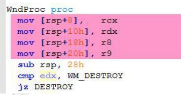

-   函数的入口抬栈 28h（sub rsp, 28h），为什么要额外再抬 8h？这是出于 SSE（多媒体指令）的考虑，因为 SSE 使用了 xmm寄存器，它的长度是 128 位（实际长度 256 位）。32 位寄存器时代，栈要对齐 4；64 位对齐 8；128 位对齐 16。这里额外抬了 8h，就是为了在返回地址（8h 长度）入栈之后，整个栈的地址是 xxx8h，而非 xxx0h。xxx8h 的栈顶，配合操作系统 API 的管理（约定）之后，最终会是对齐 16。 

-   -   系统 API 为了统一管理，有一个约定，函数开头都是 sub rsp, 8h。所以，我们为了配合系统 API 的管理（约定），也要 sub rsp, 8h，这样才能做到真正的对齐 16。 这样才能做到，在函数开头的 sub rsp, 8h 指令之后，执行到真正的功能代码（例如 xmm 指令）的时候，栈是对齐 16 的。 

-   简单来说，我们自己写函数时，只要函数中会调用操作系统 API，我们的函数开头的 sub 就也要配合操作系统 API 的统一管理（约定），sub rsp, x8h。即使函数中不会调系统 API，而是掉用我们自己写的函数，为了规范代码风格，也建议 sub rsp, x8h。只要这个值模 8 就可以，也就是 sub rsp, 28h，sub rsp, 38h 或者 sub rsp, 48h 都可以，多申请的 8 字节无用区域，可以看做是用于存储局部变量（像 debug 版本一样，多申请局部变量空间，可以不去使用），或者是在子函数的参数大于 4 的时候用于传第 5 个参数和它之后的参数（第 5 个参数的地址必须固定是 rsp + 20h，即紧紧挨着参数预留空间之后；局部变量的空间必须位于第 5 个参数的之后（高地处），第 5，6，7 个参数的传参”中对 CreateWindow()函数的调用。下图是函数在执行完 sub rsp, 28h这句代码之后的时刻的栈情况（*图 Ref1*）：


-   **若栈不对齐 16 的话，会出现什么情况（附调试过程）**：例如把 sub rsp, 28h 变为 sub rsp, 20h，尽管可以编译、链接成功，但是双击 exe 文件并不会弹出 MessageBox 窗口（也不会有错误提示框被弹出）。使用 x64dbg 调试，RIP 运行到 call MessageBox 这一行： 

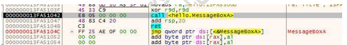

-   按 F8 步过的话，并不会弹出 MessageBox 窗口，而是进入了 lpk.dll 的模块：

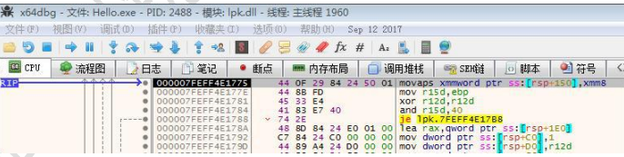

-   这是触发了关于 xmm8 寄存器的异常处理。只要把 sub rsp, 20h 改回 sub rsp, 28h，就不会有这个问题了。

### 2.编译x64汇编程序

-   VS不支持x64程序内联汇编，即__asm{}语法，方法有二：

-   -   （1）联合编译：

-   ```c++
    
    C代码
    #include <stdio.h>
    
    extern "C" int MyPrintf(...);  //  extern "C" 防止名称粉碎
    
    int main()
    {
      MyPrintf(1, 2, 3, 4);
      return 0;
    }
    
    
    
    汇编代码
    MyPrintf proc , args:VARARG   ;表示变参 参数名必须要
        mov [rsp+8], rcx
        mov [rsp+10h], rdx
        mov [rsp+18h], r8
        mov [rsp+20h], r9
    
        ;rsp
        ret
    MyPrintf endp
    
    
    可以汇编生成的obj文件加到  C工程 里面一起编译
    或者c生成的obj 文件加到 汇编工程里面一起编译就可以了  链接时候把2个 obj 文件都加进去
    
    
    
    ```

-   

（2）二进制代码强转指针：

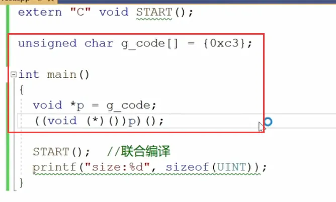


 3.调试x64汇编程序 

●WinDbg 去程序入口点指令：g $exentry。 

●虽然我们一般是用 x64dbg 来调试 64 位汇编程序（因为界面更友好），但 WinDbg 的功能无疑是更强大的，之前常用的 OD 不支持调试 64 位程序。

●用x64找入口点可以先找退出,在  在 _exit 或 exit  或 ...exit.. 下断点 


 作业 

●使用64位汇编完成SDK对话框程序

```assembly
OPTION CASEMAP:none	;忽略大小写

include resource.inc
includelib user32.lib
includelib kernel32.lib
includelib libcmt.lib

.const 
MSG db "Hello x64",0
TITLE_ db "51asm",0
CLASS_NAME db "Hello x64",0
.data
g_hIns  dq 0

extern ExitProcess:proto
extern MessageBoxA:proto
extern RegisterClassA:proto
extern LoadIconA:proto
extern LoadCursorA:proto
extern CreateWindowExA:proto
extern ShowWindow:proto
extern UpdateWindow:proto
extern GetMessageA:proto 
extern TranslateMessage:proto
extern DispatchMessageA:proto 
extern DefWindowProcA:proto 
extern GetLastError:proto
extern PostQuitMessage:proto 
extern DialogBoxParamA:proto 
extern EndDialog:proto
.code
AboudProc proc hwnd:DWORD , uMsg:DWORD , wParam:DWORD , lParam:DWORD
    sub rsp,100h
    ;保存参数
    mov [rbp-8],rcx
    mov [rbp-10h],rdx
    mov [rbp-18h],r8
    mov [rbp-20h],r9    
    cmp qword ptr [rbp-10h],WM_INITDIALOG
    jz RETRUN_TRUE
    cmp qword ptr [rbp-10h],WM_COMMAND
    jnz RETURN_FALSE
    cmp dword ptr[rbp-18h],IDOK
    jz DIALOG_END
    cmp dword ptr[rbp-18h],IDCANCEL
    jnz RETURN_FALSE
DIALOG_END:
    mov rcx,[rbp-8]
    mov rdx,[rbp-18h]
    call EndDialog   
   
RETRUN_TRUE:
    mov rax,1
    add rsp,100h
    ret
RETURN_FALSE:    
    mov rax,-1
    add rsp,100h
    ret
AboudProc endp

WndProc proc hwnd:DWORD , uMsg:DWORD , wParam:DWORD , lParam:DWORD 
    ;push rpb
    ;mov rbp,rsp    编译后就有
    sub rsp,100h
    ;保存参数
    mov [rbp-8],rcx
    mov [rbp-10h],rdx
    mov [rbp-18h],r8
    mov [rbp-20h],r9    

    cmp qword ptr [rbp-10h],WM_COMMAND
    jz COMMAND
    cmp qword ptr [rbp-10h],WM_CREATE
    jz CREATE
    cmp qword ptr [rbp-10h],WM_DESTROY
    jz DESTORY
    jmp DEFAULT
CREATE:
    jmp FUN_END
COMMAND:
    cmp dword ptr [rbp-18h],IDM_ABOUT
    jnz FUN_END
        mov rcx,g_hIns
        mov rdx,IDD_ABOUTBOX
        mov r8,0
        mov r9,offset AboudProc
        mov qword ptr[rsp+20h],0
        call DialogBoxParamA
    jmp FUN_END
DESTORY:
    mov rcx,0
    call PostQuitMessage
    jmp FUN_END
DEFAULT:
    ;调用默认
    mov rcx,[rbp-8h]
    mov rdx,[rbp-10h]
    mov r8,[rbp-18h]
    mov r9,[rbp-20h]
    call DefWindowProcA
    add rsp,100h
    ret 
FUN_END:
    add rsp,100h
    ret
WndProc endp

START:
wWinMain proc ; HINSTANCE hInstance,HINSTANCE hPrevInstance, LPSTR lpCmdLine, int nCmdShow     
    ;保存局部变量
    push rbp
    mov rbp,rsp
    mov qword ptr[rbp-8],rcx

    mov g_hIns,rcx

    sub rsp,100h
    
    ;设计注册窗口类
    mov qword ptr[rsp+20h], 3   ;CS_HREDRAW | CS_VREDRAW;
    mov rax,offset WndProc      
    mov qword ptr[rsp+28h],rax  ;lpfnWndProc
    mov qword ptr[rsp+30h],0    ;cbClsExtra cbWndExtra
    mov rax,[rbp-8]
    mov qword ptr[rsp+38h],rax  ;hInstance

    mov rcx,[rbp-8]                
    mov rdx,IDI_PROJECT1                   
    call LoadIconA
    mov qword ptr[rsp+40h],rax  ;hIcon

    mov rcx,0
    mov rdx,IDC_ARROW
    call LoadCursorA
    mov qword ptr[rsp+48h],rax  ;hCursor

    mov qword ptr[rsp+50h],COLOR_WINDOW+1    ;hbrBackground
    mov qword ptr[rsp+58h],IDC_PROJECT1    ;lpszMenuName
    mov rax,offset CLASS_NAME
    mov qword ptr[rsp+60h],rax  ;lpszClassName

    lea rcx,[rsp+20h]
    call RegisterClassA
    mov rbx,rax

    ;创建窗口实例
    xor rcx,rcx
    mov rdx,offset CLASS_NAME
    mov r8,offset TITLE_
    mov r9,WS_OVERLAPPEDWINDOW
    mov dword ptr[rsp+20h],CW_USEDEFAULT
    mov dword ptr[rsp+28h],0
    mov dword ptr[rsp+30h],CW_USEDEFAULT
    mov dword ptr[rsp+38h],0
    mov qword ptr[rsp+40h],0        ;hWndParent
    mov qword ptr[rsp+48h],0        ;hMenu
    mov rax,[rbp-8]    
    mov qword ptr[rsp+50h],rax      ;hInstance
    mov qword ptr[rsp+58h],0
    call CreateWindowExA

    mov qword ptr [rbp-10],rax      ;hwnd
    cmp qword ptr[rbp-10],0
    jz EXIT

    ;显示更新窗口
    mov rcx,qword ptr[rbp-10]
    mov rdx,SW_SHOW
    call ShowWindow
    mov rcx,qword ptr[rbp-10]
    call UpdateWindow

    ;消息循环
MSG_LOOP:
    lea rcx,[rsp+20h]
    mov rdx,0
    mov r8,0
    mov r9,0
    call GetMessageA
    cmp rax,0
    jz EXIT
    lea rcx,[rsp+20h]
    call TranslateMessage
    lea rcx,[rsp+20h]
    call DispatchMessageA
    jmp MSG_LOOP

;    mov rcx,0   ;或者xor rcx，rcx
;    mov rdx,offset MSG
;    mov r8,offset TITLE_
;    mov r9d,0
;    call MessageBoxA

EXIT:
    ;mov ecx,0
    ;call ExitProcess
    
    add rsp,100h
    pop rbp
    ret
wWinMain endp

end
```

