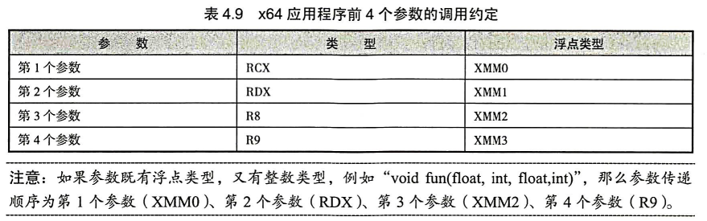
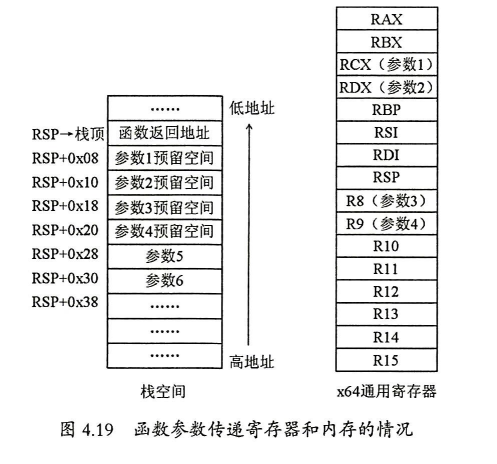
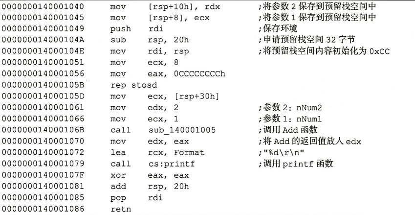
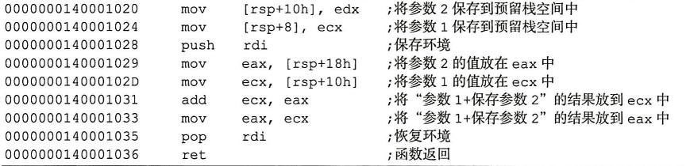
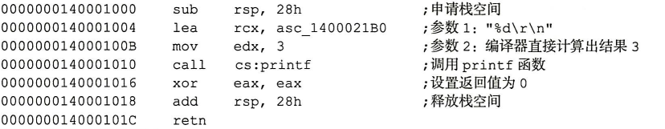
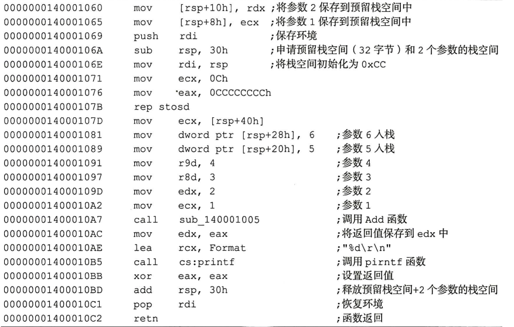
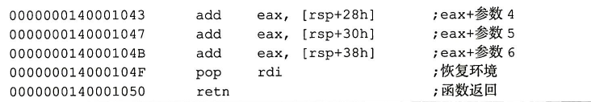
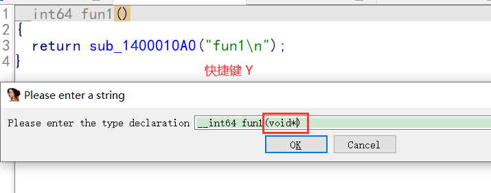

## x64调用约定

x86应用程序的函数调用有stdcall、_cdecl、Fastcall等方式，但x64应用程序只有1种寄存器快速调用约定。前4个参数使用寄存器传递，如果参数超过4个，多余的参数就放在栈里，人栈顺序为从右到左，由函数调用方平衡栈空间。前4个参数存放的寄存器是固定的，分别是第1个参数RCX、第2个参数 RDX、第3个参数R8、第4个参数R9，其他参数从右往左依次入栈。任何大于8字节或者不是1字节、2字节、4字节、8字节的参数必须由引用来传递（地址传递)。所有浮点参数的传递都是使用XMM寄存器完成的，它们在XMMO、XMM1、XMM2和 XMM3中传递，如表4.9所示。



函数的前4个参数虽然使用寄存器来传递，但是栈仍然为这4个参数预留了空间( 32字节),为方便描述，这里称之为预留栈空间。在x64环境里，前4个参数使用寄存器传递，因此在函数内部这4个寄存器就不能使用了，相当于函数少了4个可用的通用寄存器。当函数功能比较复杂时，这可能导致寄存器不够用。为了避免这个问题，可以使用预留栈空间，方法是函数调用者多申请32字节的栈空间，当函数寄存器不够用时，可以把寄存器的值保存到刚才申请的栈空间中。预留栈空间由函数调用者提前申请。由函数调用者负责平衡栈空间。

函数调用后，寄存器和内存的情况如图4.19所示。



## 传参(函数调用约定)  

https://docs.microsoft.com/zh-cn/cpp/build/x64-calling-convention?view=msvc-170

所有传参如果要push,必须要抬栈之前,而且只有一次 push 机会

### 参数全部为整形

#### 参数数量小于4个

```cpp
int Add (int nNum1, int nNum2)
{
	return nNuml + nNum2 ;
}

int main ()
{
    printf ( "%d\r\n", Add (1,2) ) ;
    return 0;
}
```

##### DEBUG

###### main()



###### Add()



在本实例中，两个参数通过寄存器进行传递，第1个参数为ECX、第2个参数为EDX，但在栈中仍为它们预留了4个参数大小的空间，申请了32字节(20h = 32d =4个参数×8字节)的预留栈空间。

这个例子中使用的是 Debug 版的汇编代码。当程序被编译成Release版时，函数参数的传递并无本质区别。当开启内联函数扩展编译优化选项时，函数可能会进行内联扩展优化，编译器会在编译时将可计算结果的变量转换成常量，代码如下。




#### 参数数量大于四个

```cpp
#include <stdio.h>
int Add(int nNum1,int nNum2,int nNum3,int nNum4,int nNum5,int nNum6)
{
    return nNum1 + nNum2 + nNum3 + nNum4 + nNum5 + nNum6;
}

int main()
{
    printf("%d\r\n", Add(1, 2, 3, 4, 5, 6));
    return 0;
}
```

##### DEBUG

###### main()



因为调试是可能对 前面参数取地址,因此必须拷贝到栈预留空间

###### Add()




-   从本例中可以看出，如果参数多于4个，前4个参数通过寄存器传递，从第5个参数开始使用栈传递，指令为“mov dword ptr [rsp+20h], 5”。由于栈为前4个参数预留了大小相同的栈空间，申请了32字节(20h = 32d=4个参数×8字节)的预留栈空间，第5个参数从栈的[rsp+20h]处开始保存。参数使用的栈空间由函数调用者负责平衡。


### 参数全部为浮点

printf 不支持 float  ,   %f 和   %lf 都是  double , printf 输出 float 是, 会发送隐式转换,转成double

```c++
#include <stdio.h>

double Add(float a, double b, float c, double d, float e, float f) {
    return a + b + c + d + e + f;
}
int main()
{
    printf("add2 %f\n", Add(1.0f, 2.0, 3.0f, 4.0, 5.0f, 6.0f));
    return 0;
}
```

```
RELEASE
main
前四个参数走多媒体寄存器 xmm0 ~ xmm3
sub     rsp, 38h
movss   xmm1, cs:dword_140002234       //第5个参数
movss   xmm0, cs:dword_140002238      //第6个参数
movsd   xmm3, cs:qword_140002228     //第4个参数
movss   xmm2, cs:dword_140002230      //第3个参数
movss   dword ptr [rsp+28h], xmm0      //把第6个参数的放到栈里面,先把 参数6放寄存器，然后通过寄存器                                                                                放入栈里，再把参数1放到寄存器里  
movss   xmm0, cs:dword_14000221C    //第1参数
movss   dword ptr [rsp+20h], xmm1      //把第5个参数的放到栈里面
movsd   xmm1, cs:qword_140002220    //第2参数
call    sub_140001000
movaps  xmm1, xmm0            //将 返回值 xmm0  给 xmm1 做为参数,因此是第二个参数  ,所以要用xmm1      lea     rcx, aAdd2F     ; "add2 %f\n"
movq    rdx, xmm0
call    sub_140001110
xor     eax, eax
add     rsp, 38h
retn
add
cvtss2sd xmm0, xmm0      //参数1 转类型,float 转 double
addsd   xmm0, xmm1
xorps   xmm1, xmm1
cvtss2sd xmm1, xmm2    
movss   xmm2, dword ptr [rsp+30h] 
addsd   xmm0, xmm1
movss   xmm1, dword ptr [rsp+28h]
cvtps2pd xmm1, xmm1
addsd   xmm0, xmm3
cvtps2pd xmm2, xmm2
addsd   xmm0, xmm1
addsd   xmm0, xmm2
retn
参数为整型浮点混合
前四个参数  整形 用 通用寄存器  ,浮点用多媒体寄存器,后面后参数都是入栈
```

```c++
#include <stdio.h>

double Add(int a, double b, int c, float d, int e, int f) {
    return a + b + c + d + e + f;
}
int main()
{
    printf("add2 %f\n", Add(1, 2, 3, 4, 5, 6));
    return 0;
}
```

```
RELEASE
main
sub     rsp, 38h
movss   xmm3, cs:dword_140002228       //第4个参数
mov     r8d, 3                                                   //第3参数
movsd   xmm1, cs:qword_140002220      //第2参数
mov     dword ptr [rsp+28h], 6                  //第6参数
mov     dword ptr [rsp+20h], 5                  //第5参数
lea     ecx, [r8-2]                                             //第1参数
call    sub_140001000
movaps  xmm1, xmm0
lea     rcx, aAdd2F     ; "add2 %f\n"
movq    rdx, xmm0
call    sub_140001100
xor     eax, eax
add     rsp, 38h
retn
add
xorps   xmm0, xmm0
xorps   xmm2, xmm2
cvtsi2sd xmm0, ecx
cvtss2sd xmm2, xmm3
addsd   xmm0, xmm1
xorps   xmm1, xmm1
cvtsi2sd xmm1, r8d
addsd   xmm0, xmm1
xorps   xmm1, xmm1
cvtsi2sd xmm1, dword ptr [rsp+28h]
addsd   xmm0, xmm2
xorps   xmm2, xmm2
cvtsi2sd xmm2, dword ptr [rsp+30h]
addsd   xmm0, xmm1
addsd   xmm0, xmm2
retn
```

### 参数是变参 

如果有浮点参数,将会走 通用寄存器,不会走多媒体寄存器传参

先把浮点数的值给多媒体寄存器  ,再通过多媒体寄存器给通用寄存器

```c++
#include <stdio.h>
#include <varargs.h>

void Show(int args, ...) {
    va_list argList;
    va_start(argList); //argList = rsp
    va_arg(argList, int);
    for (int i = 0; i < args; i++) {
        printf("%d ", va_arg(argList, int));  //*(int*)rsp  rsp+=4
    }
    va_end(argList);
}

int main()
{
    Show(4, 1, 2, 3,4);   //第一个参数 是 变参参数个数
    return 0;
}
```

```
RELEASE
main
sub     rsp, 38h
mov     edx, 1               //第2个参数
mov     dword ptr [rsp+20h], 4       //第5个参数
lea     r9d, [rdx+2]      //第4个参数
lea     r8d, [rdx+1]      //第3个参数
lea     ecx, [rdx+3]       //第1个参数
call    sub_140001000
xor     eax, eax
add     rsp, 38h
retn
show
	 test    ecx, ecx
	 jle     short locret_140001051
        //参数转入栈顶  从 8开始 因为 前面是返回地址 ,对于变参函数来说,入口一定会有这四行代码
	 mov     [rsp+8], ecx
	 mov     [rsp+10h], rdx
	 mov     [rsp+18h], r8
	mov     [rsp+20h], r9
	 push    rbx
	 push    rdi
	 sub     rsp, 28h
lea     rbx, [rsp+40h]    //  va_start     这里是40 是因为 10 ( 2个push ) + 28 (sub) +  8 (对其)
                                        //  rbx  就是  argList  表示参数栈顶
	 xor     edi, edi
	 nop     dword ptr [rax+00h]
	 nop     dword ptr [rax+rax+00000000h]
loc_140001030:          //循环取内容              
	 mov     edx, [rbx+8]     ;取栈顶内容
	 lea     rbx, [rbx+8]
	 lea     rcx, unk_140002210
	 call    sub_140001100
	 inc     edi
	 cmp     edi, [rsp+40h]
	 jl      short loc_140001030
	 add     rsp, 28h
	 pop     rdi
	 pop     rbx
locret_140001051:                      
	 retn
```

### 参数是结构体

传结构会有一个栈顶的拷贝,然后传结构的地址

#### 结构体大小为 4字节

通过寄存器传参

```cpp
struct s {
    int i;

};
//结构体 不超过8个字节  寄存器传参
void Show1(struct s a) {
    printf("%p  %d\n",&a, a.i );
}

上面就类似于
void Show1(int a) {
    int n = a;
    printf("%p  %d\n",&n, n );
}
```

#### 结构体大小不大于8字节

把成员当作  longlong ，在通过寄存器传值 ,内部通过移位来获取高32位 和 低 32位的值

```c++
#include <stdio.h>

struct s {
    int i;
    int j;
};
//结构体 不超过8个字节  寄存器传参
void Show1(struct s a) {
    printf("%d %d\n", a.i, a.j);
}


int main()
{
   struct s a1 = {1, 2};
   Show1(a1);
   return 0;
}
```

```
DEBUG
main
mov     dword ptr [rbp+8], 1      //rbp+8 结构体首地址  放入第1个参数
mov     dword ptr [rbp+0Ch], 2   // 放入第2个参数
mov     rcx, [rbp+8]    ; a                //这里是mov ,所以不是取地址,他直接 把 2个成员 当 longlong,通过寄存								       器传值
call    j_?Show1@@YAXUs@@@Z ; Show1(s
show
mov     [rsp-8+arg_0], rcx
push    rbp
push    rdi
sub     rsp, 0E8h
lea     rbp, [rsp+20h]
lea     rcx, __EF9F97DB_64RETest@cpp ; JMC_flag
call    j___CheckForDebuggerJustMyCode
mov     r8d, [rbp+0E4h]
mov     edx, [rbp+0E0h]
lea     rcx, _Format    ; "%d %d\n"
call    j_printf
lea     rsp, [rbp+0C8h]
pop     rdi
pop     rbp
retn

RELEASE
main
sub     rsp, 28h
mov     dword ptr [rsp+30h], 1
mov     dword ptr [rsp+34h], 2
mov     rcx, [rsp+30h]     //这里是mov ,所以不是取地址  lea,他直接 把 2个成员 当 longlong,通过寄存								       器传值
call    sub_140001000
xor     eax, eax
add     rsp, 28h
retn
show
mov     r8, rcx
mov     edx, ecx
shr     r8, 20h            // 内部通过移位来获取高32位 和 低 32 位的值 ,第32位是第一个成员(小尾)
lea     rcx, aDD        ; "%d %d\n"
jmp     sub_1400010C0
```

#### 结构体大小超过8字节

官网说过,一个参数绝对不会用 2 个 寄存器传递

```c++
#include <stdio.h>

struct s {
    int i;
    int j;
    int k;
};
//结构体 不超过8个字节  寄存器传参
void Show(struct s a) {
    printf("%d %d %d\n", a.i, a.j, a.k);
}

int main()
{
   struct s a = {1, 2,3};
   Show(a);
   return 0;
}

```

```
RELEASE
main
sub     rsp, 38h
lea     rcx, [rsp+20h]                         //结构体首地址作为参数
mov     dword ptr [rsp+20h], 1    //结构体首成员1    因为前面没有使用r8,r9,所以这里不可能为参数,只能是局                                                                 部变量
mov     dword ptr [rsp+24h], 2    //结构体首成员2    因为这里是24,所以不可能为参数
mov     dword ptr [rsp+28h], 3    //结构体首成员3
call    sub_140001000                    //show
xor     eax, eax
add     rsp, 38h
retn
show
这里汇编代码是有问题的,因为 这里的地址 跟 传进来的地址是同一个地址,修改形参会影响实参
这里之所以敢这样是因为编译器发现我们并没有修改形参
mov     r9d, [rcx+8]
mov     r8d, [rcx+4]
mov     edx, [rcx]
lea     rcx, aDDD       ; "%d %d %d\n"
jmp     sub_1400010C0
```

#### 结构体大小超过8字节2

```c++
#include <stdio.h>

struct s {
    int i;
    int j;
    int k;
};

void Show(struct s a) {
    a.i = 100;
    printf("%d %d %d\n", a.i, a.j, a.k);
}

int main()
{
    struct s a = { 1, 2, 3 };
    scanf_s("%d", &a.i);
    Show(a);
    printf("%d\n", a.i);
    return 0;
}
```

```
main
sub     rsp, 48h
lea     rdx, [rsp+20h]
mov     dword ptr [rsp+20h], 1      //结构体首地址
lea     rcx, aD_0       ; "%d"
mov     dword ptr [rsp+24h], 2
mov     dword ptr [rsp+28h], 3
call    scanf_s
movsd   xmm0, qword ptr [rsp+20h]       //先把结构体地址给xmm0
lea     rcx, [rsp+30h]          //传参用的结构体地址是    rsp+30h
mov     eax, [rsp+28h]
movsd   qword ptr [rsp+30h], xmm0     //再把xmm0的值给 rsp+30h  这样就相当于栈拷贝
mov     [rsp+38h], eax
call    ?Show@@YAXUs@@@Z ; Show(s)
mov     edx, [rsp+20h]      //传参用的结构体地址是    rsp+20h
lea     rcx, aD         ; "%d\n"
call    printf
xor     eax, eax
add     rsp, 48h
retn
show
mov     r9d, [rcx+8]
mov     edx, 64h ; 'd'
mov     r8d, [rcx+4]
lea     rcx, _Format    ; "%d %d %d\n"
jmp     printf
```

```c++
#include <stdio.h>


class CObect {
public:
    void fun1() {
        printf("fun1\n");
    }
};
int main()
{
  
    CObect obj;
    obj.fun1();
    return 0;
}
```

```
sub     rsp, 28h
lea     rcx, [rsp+30h]  ; this      //this指针当第一个参数
call    ?fun1@CObect@@QEAAXXZ ; CObect::fun1(void)
xor     eax, eax
add     rsp, 28h
retn

lea     rcx, _Format    ; "fun1\n"
jmp     printf
```

### 聚合体(__m64)  可以当做结构体

```c++
#include <stdio.h>
#include <xmmintrin.h>

void Show(__m64 a) {
    printf("%d %d\n", a.m64_u32[0], a.m64_u32[1]);
}
int main()
{
  
    __m64 m1;
    m1.m64_u32[0] = 1;
    m1.m64_u32[1] = 2;
    Show(m1);
    return 0;
}
```

```
sub     rsp, 28h
mov     dword ptr [rsp+30h], 1
mov     dword ptr [rsp+34h], 2
mov     rcx, [rsp+30h]  ; a
call    ?Show@@YAXT__m64@@@Z ; Show(__m64)
xor     eax, eax
add     rsp, 28h
retn


?Show@@YAXT__m64@@@Z proc near
mov     r8, rcx
mov     edx, ecx
shr     r8, 20h
lea     rcx, _Format    ; "%d %d\n"
jmp     printf
?Show@@YAXT__m64@@@Z endp
```

## 返回值

低于 8字节 用   rax 或者  xmm0  ,结构体的话 如果成员是float,返回还是用  rax 

超过8字节   返回地址

```c++
#include <stdio.h>


struct s1 {
    int i;
    int j;
};
struct s2 {
    int i;
    int j;
    int k;
};

int Get1() {
    return 10;
}

long long Get2() {
    return 0x1234567812345678LL;
}

float Get3() {
    return 10;
}

struct s1 Get4() {
    struct s1 a = { 1, 2 };
    return a;
}
struct s2 Get5() {
    struct s2 a = { 1, 2,3 };
    return a;
}


struct s2 Get6(struct s2 a) {
    printf("%d %d %d\n", a.i, a.j, a.k);
    struct s2 n = { 1, 2, 3 };
    return n;
}

int main()
{
  
    
    printf("%d\n", Get1());
    printf("%lld\n", Get2());
    printf("%lf\n", Get3());
    printf("%d\n", Get4().j);
    printf("%d\n", Get5().k);
    struct s2 n1 = {10, 20, 30};
    printf("%d\n", Get6(n1).k);
    return 0;
}
```

```
main
sub     rsp, 48h
call    ?Get1@@YAHXZ    ; Get1(void)
mov     edx, eax
lea     rcx, aD         ; "%d\n"
call    printf
call    ?Get2@@YA_JXZ   ; Get2(void)
mov     rdx, rax
lea     rcx, aLld       ; "%lld\n"
call    printf
call    ?Get3@@YAMXZ    ; Get3(void)
xorps   xmm1, xmm1
lea     rcx, aLf        ; "%lf\n"
cvtss2sd xmm1, xmm0
movq    rdx, xmm1
call    printf
call    ?Get4@@YA?AUs1@@XZ ; Get4(void)
shr     rax, 20h
lea     rcx, aD         ; "%d\n"
mov     edx, eax
call    printf
lea     rcx, [rsp+48h+result] ; result    ;定义一个局部变量
call    ?Get5@@YA?AUs2@@XZ ; Get5(void)
lea     rcx, aD         ; "%d\n"
movsd   xmm0, qword ptr [rax]
mov     edx, [rax+8]
movsd   [rsp+48h+var_18], xmm0
call    printf
lea     rdx, [rsp+48h+result]
mov     [rsp+48h+result.i], 0Ah
lea     rcx, [rsp+48h+var_18]
mov     [rsp+48h+result.j], 14h
mov     [rsp+48h+result.k], 1Eh
call    ?Get6@@YA?AUs2@@U1@@Z ; Get6(s2)
lea     rcx, aD         ; "%d\n"
mov     edx, [rax+8]
call    printf
xor     eax, eax
add     rsp, 48h
retn
```

#### 返回值是不超过4节整形

直接通过 eax 返回

mov     eax, 0Ah

retn

#### 返回值是不超过8字节整形

直接通过 rax 返回

mov     rax, 1234567812345678h

retn

#### 返回值是浮点

通过浮点寄存器  xmm0  返回

movss   xmm0, cs:__real@41200000

retn

#### 返回值是结构体(大小不超过8字节)

通过寄存器   rax  返回 

mov     rax, 200000001h

retn

#### 返回值是对象 (大小超过8字节)

定一个局部变量,放入结构体地址 ,在函数里面操作参数,并且将结构体地址作为返回值

mov     dword ptr [rcx], 1

mov     rax, rcx       //将结构体地址作为返回值

mov     dword ptr [rcx+4], 2

mov     dword ptr [rcx+8], 3

retn

#### 第一个参数也是结构体

跟构造函数很像

```
lea     rdx, [rsp+20h]                            //第二个参数
mov     dword ptr [rsp+20h], 0Ah     //结构体地址
lea     rcx, [rsp+30h]                             //第一个参数给的是返回值
mov     dword ptr [rsp+24h], 14h
mov     dword ptr [rsp+28h], 1Eh
call    ?Get6@@YA?AUs2@@U1@@Z ; Get6(s2)
lea     rcx, aD         ; "%d\n"
mov     edx, [rax+8]
call    printf


push    rbx
sub     rsp, 20h
mov     r9d, [rdx+8]
mov     rbx, rcx
mov     r8d, [rdx+4]
lea     rcx, _Format    ; "%d %d %d\n"
mov     edx, [rdx]
call    printf
mov     rax, rbx
mov     dword ptr [rbx], 1
mov     dword ptr [rbx+4], 2
mov     dword ptr [rbx+8], 3
add     rsp, 20h
pop     rbx
retn
```

## F5功能

```c++
#include <stdio.h>


class CObect {
public:
    void fun1() {
        printf("fun1\n");
    }
};
int main()
{
  
    CObect obj;
    obj.fun1();
    return 0;
}
```

__int64 fun1()

{

  return sub_1400010A0("fun1\n");

}

可以看到少了参数,因此在64位程序  ida  F5 功能参数数量经常是错误的, 32为 参数数量基本都是对的

解决办法:  按快捷键 然后 把  void * 放进去,就可以了

 

参数错了,说明中间代码也极有可能错误,少一个参数,代码就乱了


## 跨函数调用   setjmp/longjmp

函数的实现代码 只能用 会变来实现

功能类似goto   只不过 goto 不能跨函数 , 这个可以   

以前没有 try  catch 的功能,所有使是 setjmp/longjmp 来实现    这是一个标准的函数,现在可以用  try catch 替代,所以不建议使用

1.  setjmp         保存寄存器环境
2.  longjmp      恢复寄存器环境

```c++
#include <stdio.h>
#include <xmmintrin.h>
#include <setjmp.h>   //头文件


jmp_buf mark;   //寄存器环境


void Show(__m64 a) {
    longjmp(mark, 3);    //执行这行代码就会跳转到  setjmp 所在的地址,并且返回设定的返回值
    printf("%d %d\n", a.m64_u32[0], a.m64_u32[1]);
}

int main()
{
  
    __m64 m1;
    m1.m64_u32[0] = 1;
    m1.m64_u32[1] = 2;

    int ret = setjmp(mark);   //跳回地址 执行完longjmp就会跳到此处代码
    
    if (ret != 3) {           //这里如果 不加判断返回值 就会 递归
        Show(m1);             //等于3说明这个函数已经执行过了
    }

    return 0;
}
```

注意,使用   setjmp/longjmp  说明 放弃了寄存器 里面保存的值,即,使用 该函数,并不会保存和恢复之前寄存器里面的值


## 作业

##### 常规作业

##### 逆向俄罗斯方块

[📎Game.zip](./Game.zip)

参考答案

[📎CppTetris-master.zip](./CppTetris-master.zip)