## 取模

取模的正负数取决于被除数,跟除数没关系

### 除数是2的整数次幂

等于取 被除数的低  n-1位

  x >= 0


​       x % 2^n =  x & (2^n - 1)

​       x % 2^n = (x + 0) & 7 (x - 0)


​     

  x < 0 补码

   \1.   x % 2^n = (x  + (2^n - 1) & (2^n - 1)) - (2^n - 1)

   

   \2.    x & (2^n - 1)  - 1 | ~(2^n - 1) + 1


​    x % -8  = (x + 7) & 7 (x - 7)

```c++
#include <stdio.h>

int main(int argc, char* argv[], char* env[])
{
    
    printf("%d", (unsigned int)argc % 8);
    printf("%d\n", argc % 8);
    printf("%lld\n", (unsigned long long)argc % 8);
    printf("%lldn", (long long)argc % 256);

    return 0;
}
```

```
 push    rbx
	 sub     rsp, 20h
	 movsxd  rbx, ecx
	 lea     rcx, _Format    ; "%d"
	 mov     edx, ebx
	 and     edx, 7        取低3位  2^3 = 8
	 call    printf

	 mov     edx, ebx
	 and     edx, 80000007h     ;&7  最高位给1 是为了判断正负数
	 jge     short loc_14000109B
         ;负数          x & (2^n - 1)  - 1 | ~(2^n - 1) + 1
	 dec     edx     ; -1 
	 or      edx, 0FFFFFFF8h    ;   |~2^(n-1)
	 inc     edx
loc_14000109B:                          
	 lea     rcx, aD         ; "%d\n"
	 call    printf

	 mov     rdx, rbx
	 lea     rcx, aLld       ; "%lld\n"
         and     edx, 7          取低3位  2^3 = 8 
	 call    printf

	 mov     rax, rbx
	 lea     rcx, aLldn      ; "%lldn"
;    (x  + (2^n - 1) & (2^n - 1)) - (2^n - 1)     (2^n - 1)  = 255
	 cqo       rdx 符号位扩展  各个位要么全1 ,要么全0   
	 movzx   edx, dl      保留低8位   即 255    相当于   rdx >> 56
	 add     rax, rdx       +255
	 movzx   eax, al       符号位扩展 取低8位   即 255   相当于  &255 
	 sub     rax, rdx         -255   
	 mov     rdx, rax
	 call    printf

	 xor     eax, eax
	 add     rsp, 20h
	 pop     rbx
	 retn
```

### 除数是非2的整数次幂

​     商 = 被除数 / 除数

​     余数 = 被除数 % 除数 = 被除数 - 商 * 除数 


​     余数 = x % -7 = x - x / -7 * -7    =    x - x / 7 * 7  


```c++
#include <stdio.h>

int main(int argc, char* argv[], char* env[])
{
    
    printf("%d", (unsigned int)argc % 7);
    printf("%d\n", argc % 7);
    printf("%lld\n", (unsigned long long)argc % 7);
    printf("%lldn", (long long)argc % 7);

    return 0;
}
```

```
push    rbx
sub     rsp, 20h
movsxd  rbx, ecx

mov     eax, 24924925h
mul     ebx
mov     eax, ebx
lea     rcx, _Format    ; "%d"
sub     eax, edx
shr     eax, 1
add     eax, edx
mov     edx, ebx
shr     eax, 2
imul    eax, 7   
sub     edx, eax
call    printf
mov     eax, 92492493h
lea     rcx, aD         ; "%d\n"
imul    ebx
add     edx, ebx
sar     edx, 2
mov     eax, edx
shr     eax, 1Fh
add     edx, eax
imul    eax, edx, 7
mov     edx, ebx
sub     edx, eax
call    printf
mov     rax, 2492492492492493h
lea     rcx, aLld       ; "%lld\n"
mul     rbx
mov     rax, rbx
sub     rax, rdx
shr     rax, 1
add     rax, rdx
mov     rdx, rbx
shr     rax, 2
imul    rax, 7
sub     rdx, rax
call    printf
mov     rax, 4924924924924925h
lea     rcx, aLldn      ; "%lldn"
imul    rbx
sar     rdx, 1
mov     rax, rdx
shr     rax, 3Fh
add     rdx, rax
imul    rax, rdx, 7
sub     rbx, rax
mov     rdx, rbx
call    printf
xor     eax, eax
add     rsp, 20h


```

## 分支

逆向的还原速度取决于分支的还原速度,因为程序中大部分逻辑靠分支完成

### if

-   if 语句是分支结构的重要组成部分。if 语句的功能是对表达式的结果进行判定，根据表达式结果的真假跳转到对应的语句块执行。其中，“真”表示表达式结果非0，“假”表示表达式结果为0，示例如下。因为逻辑问题，编译器生成的汇编代码会对表达式的结果进行取反操作。

```c++
int main(int argc)
{
    if(argc > 1)
    {
        printf("argc > 1\r\n");
    }
  return 0;
}
    
```

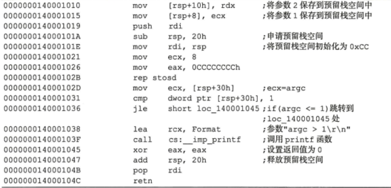

#### 特征识别

首先会有一个jxx指令用于向下跳转，且跳转的目的if_end中没有jmp指令。根据以上特征，把jxx指令取反后，即可还原if 语句的代码，如图所示。

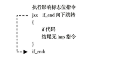

#### 图形识别

-   在逆向分析工具中，为了方便地表示跳转的位置，使用虚线箭头表示条件跳转jxx，使用实线箭头表示无条件跳转jmp。if语句中有一个jxx跳转，因此会有一个向下的虚线箭头，看到此图形即可判断其为if语句，虚线箭头之间的代码为if代码。IDA 中的if语句图形如图4.21所示。x64dhg中的f语句图形如图4.22所示。
-   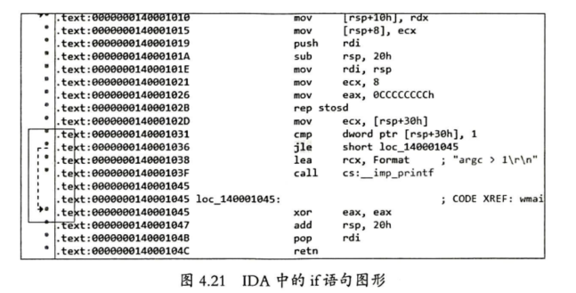

#### 代码块识别

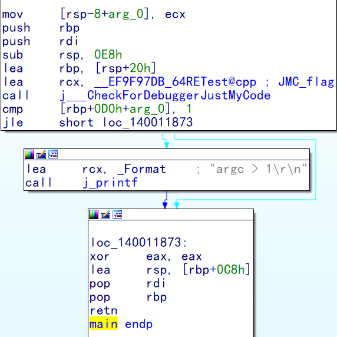

#### 补充

如果if 里面嵌套 if  那么 虚线里面包含虚线

### if...else

-   if...elseif...else = if...else{if...else}
-   if……eles语句比if语句多出了一个“else”，当if表达式结果为真时跳过else分支语句块，当if表达式结果为假时跳转到else分支语句块中，示例如下。


```c++
int main(int argc)
{
    if(argc == 1)
    {
        printf("argc == 1\r\n");
    }
    else
    {
        printf("argc != 1\r\n");
    }
  return 0;
}
```

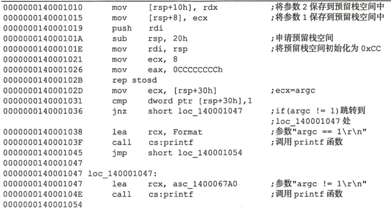

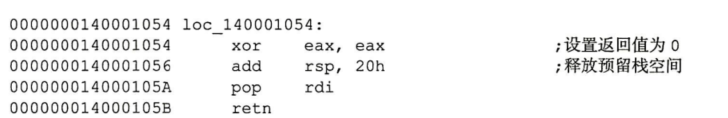

#### 特征识别

-   首先会有一个jxx指令用于向下跳转，且跳转的目的else中有jmp指令。else代码的结尾没有jmp指令，else的代码也会执行if_else_end 的代码。根据以上特征，把jxx指令取反后，即可还原if……-else语句的代码，如图4.23所示。

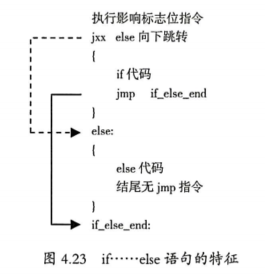

#### 图形识别

-   因为if语句中有一个jxx指令用于向下跳转，所以会有一个向下的虚线箭头;又因为else语句中有jmp 跳转，所以虚线箭头中会有一个向下的实线箭头。看到此图形即可判断其为if……else语句，虚线箭头之间的代码为if代码，实线箭头之间的代码为else代码。

#### 代码块识别

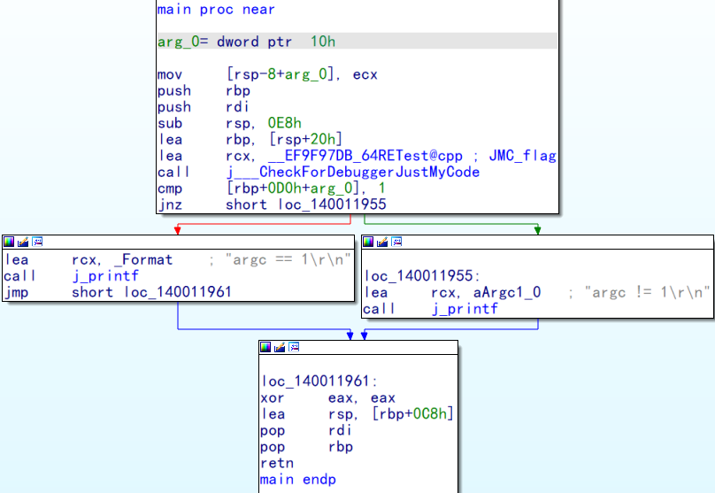

### if...else if...else

-   在if……else语句的“else”之后再嵌套if语句，就形成了一个多分支结构if...elseif...else = if...else{if...else}：

```c++
int main(int argc)
{
    if(argc > 2)
    {
        printf("argc > 2\r\n");
    }
    else if (argc == 2)
    {
         printf("argc ==  2\r\n");
    }
    else
    {
        printf("argc <= 1\r\n");
    }
  return 0;
}
```

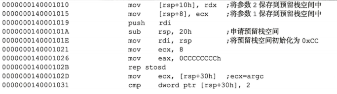

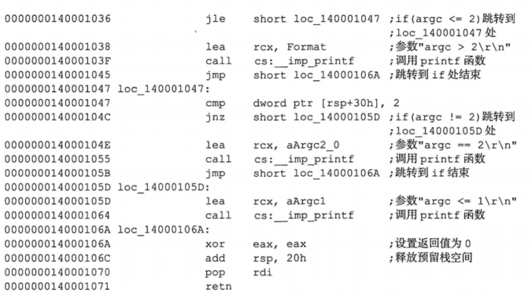

#### 特征识别

-   首先会有一个jxx指令用于向下跳转，且跳转的目的else if 中有jmp指令。else if的跳转目的else中有jmp指令，且else代码的结尾没有jmp指令，所有 jmp 的目标地址一致。根据以上特征，把jxx 指令取反，即可还原if……else if……else语句的代码，如图4.24所示。


#### 图形识别

因为if语句中有一个jxx指令用于向下跳转，所以会有一个向下的虚线箭头;又因为else_if 中有jmp跳转，所以虚线箭头中会有一个向下的实线箭头。在else if代码中有一个jxx跳转和一个jmp跳转，因此有一个虚线箭头和一个实线箭头，它们相互交叉。看到此图形即可判断其为if……else if…else语句，第1个虚线箭头之间的代码为if 代码，第2个虚线箭头之间的代码为else if代码，最后一个实线箭头之间的代码为else代码。如果第2个虚线箭头和最后一个实线箭头的跳转目标地址一致，就是没有else，那么该语句就是一个if……else if 控制语句。

#### 代码块识别

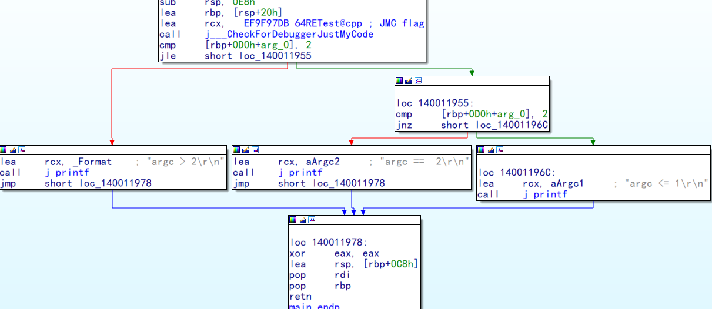

平行代表结束点一样


### 多条件表达式

 (必须连续多次多次判断)多个且条件跳转目的一样  ,多个或 ,条件条件不一样 

#### 德摩根定律:

1.   (!a) && (!b) = !(a || b) 
2.    (!a || !b) = !(a && b)

#### 且   && 

```c++
#include <stdio.h>

int main(int argc)
{
    if (argc > 100 && argc <  200)
    {
        printf("if\r\n");
    }
   
    return 0;
}
```

条件A  &&  条件B  就相当于   先判断 条件A 成立,再判断 条件B 成立  就相当于

if (条件A   &&  条件B)
=>
if (条件A )
{
         if(条件B  )
{
 }
}

 图形识别 


虚线里面嵌套虚线,而且虚线跳转的目的一样


 代码块识别 

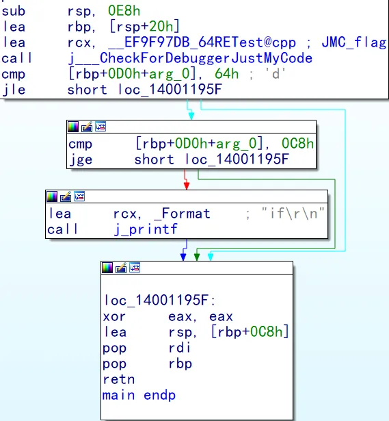


 或 ||  

```c++
#include <stdio.h>

int main(int argc)
{
    if (argc < 100 || argc >  200)
    {
        printf("if\r\n");
    }
   
    
    return 0;
}
```

条件A  ||  条件B  就相当于   先判断 条件A 是否成立,成立就进入  ,不成里 else if (跳件B),就相当于

if (条件A ||  条件B)
=>
if (条件A )
{
       代码1
}  else  
{
         if(条件B  )
{
       代码2
 }
}
代码1 和 代码2 的代码一样  ,但是编译器不会生成这种图形,因为  代码 重复了

 图形识别 

多个判断条件中间没有代码就是 || 

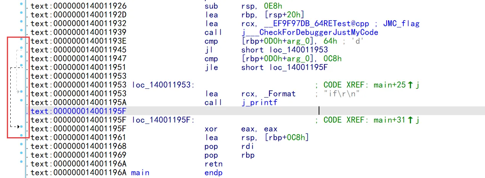

还原方法  前面的跳转条件取反,最后一个不取反,


第一个条件满足 会直接跳到  else 里面的代码里面    ,就是用 goto 模拟的

 代码块识别 

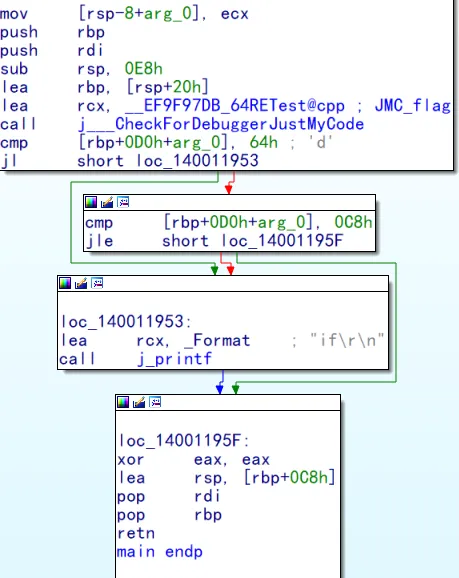


 且和或混合 

```c++
#include <stdio.h>

int main(int argc)
{
    if (argc < 100 && argc > 200 || argc == 200)
    {
        printf("if\r\n");
    }
    return 0;
}
```

#### 图形识别

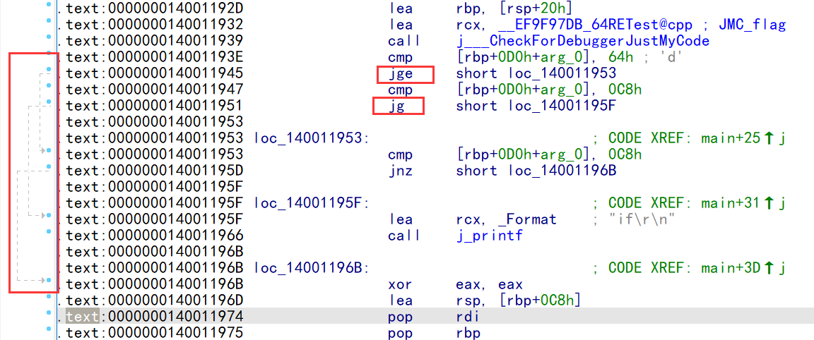

#### 代码块识别

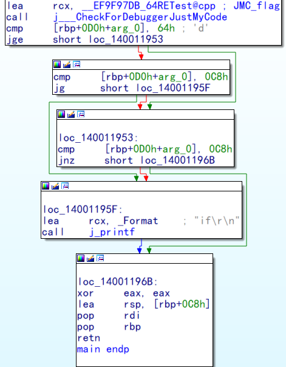