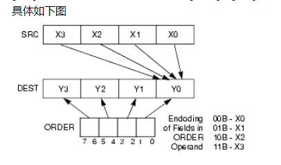
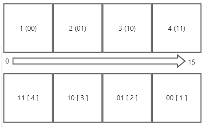

### intel分支预测功能

CPU碰到分支会模拟代码执行一遍,会预测可能执行的分支,从而进行优化

但是存在漏洞,而且无法修复,会导致内存数据残留,因为有的else代码是不会走的但是通过代码混淆,可以让试着走一下 else 但实际上走的是 if ,这样内存就有代码存留,就用被 shellcode 利用


启用会关闭分支预测功能,这样会极大的降低 cpu性能,因为取消分支预测会产生大量的jmp,就会大量的断流水线

### 三目运算

64位中,三目运算符优化主要靠  cmove 指令 和 set 指令优化,不32位少了很多

早期流水线分成3个部分:   取指令   译码    执行 分以由一个硬件执行    

但是多条流水线的的代码不能同时执行 

指令的周期有长有短,因为第一条指令没执行完,第二条指令就要等,这就是同步

条件执行指令是为了解决断流水线问题


#### setxx 指令

经过     cmp  /  test / sub / add 等处理(影响标志)之后, 后面出现了   setxx   r8  指令  (设置8位寄存器的值为0或1) 

|      | 有符号 | 无符号 |
| ---- | ------ | ------ |
| 大于 | Greate | Above  |
| 小于 | Less   | Blow   |

cmp  eax,100

setge  cl

上式意思是   eax  跟100比较     如果大于等于(g   e)100 ,   cl=1   否则 cl = 0

setge  =>  set   +  g (Greate) + e (Equal)


xor  ecx ,ecx

cmp  eax,100

setge  cl

dec  ecx 


上式意思是   eax  跟100比较     如果大于等于(g   e)100 ,   ecx = 0   否则 ecx  = -1


\#include <stdio.h>

int main(int argc, char* argv[])

{

​    printf("%d\r\n", argc >= 1 ? 1 : 2);     **//2个结果的差值不能超过1**

​    return 0;

}


反汇编代码:

sub     rsp, 28h

xor     edx, edx

**cmp     ecx, 1**

lea     rcx, _Format    ; "%d\r\n"

**setl    dl      ; l 小于  如果  ecx  <1 ,dl就是 1 否则就是 0**

inc     edx     ; +1 dex = 2  或   1

call    printf

xor     eax, eax

add     rsp, 28h

retn

#### cmovxx   条件执行指令  

经过     cmp  /  test / sub / add 等处理(影响标志)之后, 后面出现了  cmovxx   reg32 , reg32

A>= 100 ? 32 : 48


mov  eax , 32

mov  ecx , 48

cmp  A,100

cmovl  eax,ecx


上式意思是   ,eax = 32  ,ecx = 48 ,比较 A 和 100 的大小  ,如果小于 ,就把  eax = ecx  否则  值不变

\#include <stdio.h>

int main(int argc, char* argv[])

{

​    printf("%d\r\n", argc >= 100 ? 32 : 48);

​    return 0;

}

反汇编代码

sub     rsp, 28h

**cmp     ecx, 64h ; 'd'**

mov     edx, 30h ; '0'

mov     eax, 20h ; ' '

lea     rcx, _Format    ; "%d\r\n"

**cmovge  edx, eax        如果  ecx >= 64h  那么  edx = 20h 否则 这条指令不执行;**

call    printf

xor     eax, eax

add     rsp, 28h

retn

注意:   条件执行指令不能取代   if  ...  else ...  因为如果 else 里面的代码过多(超过3条),用条件执行指令效率反而变低了,因此一般只用于 3目运算这类简单的 条件判断运算


### 数组

#### 寻址公式: 

1.   一维寻址公式： ary + index * sizeof(type)
2.    二维寻址公式： ary1 + index * sizeof(type[]) + index * sizeof(type)

我们可以以为二维寻址公式 中  成员是数组   ,即2次一维寻址

例如:

  int ary[3][4]   =    ary + i * sizeof(int[4]) + j * sizeof(int)


难点在于   寻址公式中 当下标是常数,可以提前算好,所以就可能优化成  ary + imm(立即数),此时就无法知道是几维数组,这种情况下,通常解释为一维数组,但是如果 下标是变量,他用了2次一维寻址,我们就可以知道这是二维数组


数组最常见的寻址公式汇编代码是

  => ary + imm

  => [rbx*8+rbx] (比例因子寻址,但是系数只能是 1  2 8)      imul (64位比较多)      shl(32位比较多)


#### 一维数组

初始化为常量通过 多媒体寄存器,没16字节就用一个 多媒体寄存器,剩余的就用  mov

```c++
#include <stdio.h>


int main(int argc, char* argv[])
{
    int ary[] = { 1, 2, 3, 4, 5, 6};
    printf("%d", ary[argc]);
}
 
```

sub     rsp, 48h

movdqa  xmm0, cs:__xmm@00000004000000030000000200000001   ;内存数据是小尾,因为低位放在低地址

movsxd  rax, ecx

lea     rcx, _Format    ; "%d"

**;采用多媒体指令进行初始化,这样一次可以优化16字节**

**movdqu  [rsp+48h+var_28], xmm0**

**;剩下的没办法用一个多媒体寄存器,值每次mov 四字节进行初始化**

**mov     [rsp+48h+var_18], 5**

**mov     [rsp+48h+var_14], 6**

mov     edx, dword ptr [rsp+48h+var_28 +rax*4]  ;寻址公式

call    printf

xor     eax, eax

add     rsp, 48h

retn

如果初数化为变量,那就只能一次次 mov


#### 二维数组

```c++
#include <stdio.h>


int main(int argc, char* argv[])
{
    int ary[2][4] = { 1, 2, 3, 4, 5, 6,7,8};
    printf("%d", ary[argc][argc]);
    return 0;
}
```

sub     rsp, 48h

movdqa  xmm0, cs:__xmm@00000004000000030000000200000001

movdqa  xmm1, cs:__xmm@00000008000000070000000600000005

movsxd  rax, ecx

movdqu  [rsp+48h+var_28], xmm0

movdqu  [rsp+48h+var_18], xmm1

**lea     rcx, [rax+rax\*4]       第一次寻址公式**

**mov     edx, dword ptr [rsp+rcx\*4+48h+var_28]         第二次寻址公式**

lea     rcx, _Format    ; "%d"

call    printf

xor     eax, eax

add     rsp, 48h

retn


上面 看着像 一维数组寻址是因为   下标相同 ,可以提取公因式

ary +   argc * 5 * 4  =  ary +  argc * 4 * 4  +   argc  * 4

​                                    =  ary +  argc * 16  +   argc  * 4

这样优化的原因是   16 无法同通过 比例因子寻址得到


#### 通过循环给数组赋值

##### 赋值为常量

```c++
#include <stdio.h>


int main(int argc, char* argv[])
{
    int ary[100];
    for (int i = 0; i < 100; i++) {
        ary[i] = 1;
    }

 
    for (int i = 0; i < 100; i++) {
        printf("%d", ary[i]);
    }
 
}
```

```
push    rbx
	sub     rsp, 1B0h
	movdqa  xmm0, cs:__xmm@00000001000000010000000100000001
	lea     rax, [rsp+1B8h+var_198]      ;数组首地址
	mov     ecx, 3
	nop     dword ptr [rax+rax+00h]

loc_140001090:       
      ;一次给28个成员赋值           
	movups  xmmword ptr [rax], xmm0
	movups  xmmword ptr [rax+10h], xmm0
	movups  xmmword ptr [rax+20h], xmm0
	movups  xmmword ptr [rax+30h], xmm0
	movups  xmmword ptr [rax+40h], xmm0
	movups  xmmword ptr [rax+50h], xmm0
	movups  xmmword ptr [rax+60h], xmm0
	lea     rax, [rax+80h]
	movups  xmmword ptr [rax-10h], xmm0    在给四个成员赋值,相当于一次循环 赋值 32个成员
	sub     rcx, 1     初始值是3,因此循环3次
	jnz     short loc_140001090

        ;四次复制之后就给96个成员赋值了,还剩四个成员无法再通过循环赋值,所以后面再赋值
	movups  xmmword ptr [rax], xmm0
	xor     ebx, ebx
	nop     dword ptr [rax+00h]
	db      66h, 66h
	nop     word ptr [rax+rax+00000000h]

loc_1400010D0:                          ; CODE XREF: main+77↓j
	mov     edx, [rsp+rbx*4+1B8h+var_198]
	lea     rcx, _Format    ; "%d"
	call    printf
	inc     rbx
	cmp     rbx, 64h ; 'd'
	jl      short loc_1400010D0
	xor     eax, eax
	add     rsp, 1B0h
	pop     rbx
	retn
```

##### 赋值为变量

此时要想降低循环次数用 多媒体寄存器 ,那么xmm0 的值需要跟着变,因此就用到了并行运算

并行运算就是把  xmm0 种的四个int 同时进行 相加

```c++
#include <stdio.h>


int main(int argc, char* argv[])
{
    int ary[100];
    for (int i = 0; i < 100; i++) {
        ary[i] = i;
    }

    for (int i = 0; i < 100; i++) {
        printf("%d", ary[i]);
    }
 
}
```

```
push    rbx
	sub     rsp, 1B0h
	movdqa  xmm2, cs:__xmm@00000003000000020000000100000000
	lea     r8, [rsp+1B8h+var_178]
	xor     ebx, ebx
	mov     eax, ebx
	lea     edx, [rbx+8]
	nop     dword ptr [rax]

loc_140001090:
	lea     ecx, [rdx-4]        ecx 从 4开始
	movd    xmm0, eax          ; eax 就是 i   就是把 i  的 值给 xmm0  
	pshufd  xmm0, xmm0, 0     ;把 xmm0 低4字节的值,分别给  xmm0 ,15-11,11-7,7-3,3-0 字节   此时                                                                       xmm0就是  四个 int 0
	lea     r8, [r8+40h]
	paddd   xmm0, xmm2     ; xmm0 四个 int 分别对应加  xmm2  的四个 int 
	movd    xmm1, ecx           ; xmm1 = 4 
	movdqu  xmmword ptr [r8-60h], xmm0    ；把结果放回数组
	lea     ecx, [rdx+4]             ； ecx  +=  4
	add     eax, 10h     
	pshufd  xmm1, xmm1, 0    ; 把xmm1 最低位的四字节的，分别给四个int  00 00 00  00 所以 xmm1的                                                                  值此时为 四个  int 4
	paddd   xmm1, xmm2          ; xmm1 四个 int （4,4,4,4）分别对应加  xmm2  的四个 int （0, 1 ,2 ,3）
	movd    xmm0, edx
	movdqu  xmmword ptr [r8-50h], xmm1    ；数组首地址 + 16   把结果放回数组
	add     edx, 10h
	movd    xmm1, ecx
	pshufd  xmm0, xmm0, 0
	pshufd  xmm1, xmm1, 0
	paddd   xmm0, xmm2
	paddd   xmm1, xmm2
	movdqu  xmmword ptr [r8-40h], xmm0
	movdqu  xmmword ptr [r8-30h], xmm1
	cmp     edx, 68h ; 'h'
	jl      short loc_140001090
	cmp     eax, 64h ; 'd'
	jge     short loc_140001110
	movsxd  rcx, eax
	lea     rdx, [rsp+1B8h+var_198]
	lea     rdx, [rdx+rcx*4]
loc_140001102:                         
	mov     [rdx], eax
	lea     rdx, [rdx+4]
	inc     eax
	cmp     eax, 64h ; 'd'
	jl      short loc_140001102
	nop
loc_140001110:                        				
	mov     edx, [rsp+rbx*4+1B8h+var_198]
	lea     rcx, _Format    ; "%d"
	call    printf
	inc     rbx
	cmp     rbx, 64h ; 'd'
	jl      short loc_140001110
	xor     eax, eax
	add     rsp, 1B0h
	pop     rbx
	retn
```

###### pshufd 指令

pshufd xmm1,xmm2,imm8
pshufd有三个操作数，从左往右，第一个操作数是目的操作数保存结果，第二个操作数是源操作数，第三个操作数是一个8位立即数，指定以怎样的顺序将源操作数中数据保存到目的操作数。
imm8中每2位选择源操作数的一个双字(共4个)，00选择第一个，01选择第二个，10选择第三个，11选择第四个。利用imm8位模式选择好源操作数的双字后，其每2位的位段决定着这些双字如何在目的操作数中排列。[0-1]位选择的双字放在目的操作数的[0-31]，[2-3]选择的放在[32-63]，[4-5]选择的放在[64,95]，[6-7]选择的放在[96-127]中。



例如:

```c++
_MM_ALIGN16 int a[4] = {1,2,3,4}; //要变成2,4,3,1的顺序

_asm
{
	movdqa xmm0,[a];
	pshufd xmm0,xmm0,0x2D; // 0010 1101   
}
```

0x2d 就是  00(0  0 - 3 的4字节  1  )  10 (2    8-11的四字节 3 )  11 (3  12-15 的四字节 4 )   01  (1   4-7 的四字节 2) 
将从源操作数选择的双字 从左到右，由高到底依次存放在目的操作数
00 选择 1，放在[96-127]      (12-15 的四字节 )
10 选择 3, 放在[64-95]          (8-11的四字节 )
11 选择 4, 放在[32-63]          (4-7的四字节 )
01 选择 2, 放在[0-31]            (0-3的四字节 )

_MM_ALIGN16 int a[4] = {1,2,3,4}; //要变成4,3,2,1的顺序

_asm

{

​	movdqa xmm0,[a];

​	pshufd xmm0,xmm0,0x1B;    // 00 01  10  11

}

00 选择 1，放在[96-127]       (12-15 的四字节 )

10 选择 2, 放在[64-95]        (8-11的四字节 )

11 选择 3, 放在[32-63]        (4-7的四字节 )

01 选择 4, 放在[0-31]         (0-3的四字节 )  



#### 数组通过循环求和

```c++
#include <stdio.h>


int main(int argc, char* argv[])
{
    int ary[100];
    for (int i = 0; i < 100; i++) {
        ary[i] = i;
    }

    for (int i = 0; i < 100; i++) {
        ary[i] += i;
    }

 
    for (int i = 0; i < 100; i++) {
        printf("%d", ary[i]);
    }
 
}
```

```
 push    rbx
	 sub     rsp, 1B0h
	 movdqa  xmm4, cs:__xmm@00000003000000020000000100000000
	 lea     r8, [rsp+1B8h+var_178]
	 xor     ebx, ebx
	 mov     r10d, 8
	 mov     eax, ebx
	 mov     edx, r10d
	 nop     dword ptr [rax+00h]
	 nop     word ptr [rax+rax+00000000h]
loc_1400010A0:                          ; CODE XREF: main+8F↓j
	 lea     ecx, [rdx-4]
	 movd    xmm0, eax
	 pshufd  xmm0, xmm0, 0
	 lea     r8, [r8+40h]
	 paddd   xmm0, xmm4
	 movd    xmm1, ecx
	 movdqu  xmmword ptr [r8-60h], xmm0
	 lea     ecx, [rdx+4]
	 add     eax, 10h
	 pshufd  xmm1, xmm1, 0
	 paddd   xmm1, xmm4
	 movd    xmm0, edx
	 movdqu  xmmword ptr [r8-50h], xmm1
	 add     edx, 10h
	 movd    xmm1, ecx
	 pshufd  xmm0, xmm0, 0
	 pshufd  xmm1, xmm1, 0
	 paddd   xmm0, xmm4
	 paddd   xmm1, xmm4
	 movdqu  xmmword ptr [r8-40h], xmm0
	 movdqu  xmmword ptr [r8-30h], xmm1
	 cmp     edx, 68h ; 'h'
	 jl      short loc_1400010A0
	 cmp     eax, 64h ; 'd'
	 jge     short loc_14000111F
	 movsxd  rcx, eax
	 lea     rdx, [rsp+1B8h+var_198]
	 lea     rdx, [rdx+rcx*4]
loc_140001112:                          ; CODE XREF: main+AD↓j
	 mov     [rdx], eax
	 lea     rdx, [rdx+4]
	 inc     eax
	 cmp     eax, 64h ; 'd'
	 jl      short loc_140001112
loc_14000111F:                         
	 mov     r9d, ebx
	 lea     r11, [rsp+1B8h+var_178]
	 nop     word ptr [rax+rax+00000000h]
loc_140001130:                          
	 movdqu  xmm0, xmmword ptr [r11-20h]
	 lea     eax, [r10-4]
	 movd    xmm1, r9d
	 lea     edx, [r10+5]
	 pshufd  xmm1, xmm1, 0
	 lea     r8d, [r10+4]
         ；多一次加法
	 paddd   xmm1, xmm0
	 movd    xmm2, r10d
	 paddd   xmm1, xmm4
	 pshufd  xmm2, xmm2, 0
	 movdqu  xmmword ptr [r11-20h], xmm1
	 lea     ecx, [r10+6]
	 add     r9d, 10h
	 movdqu  xmm0, xmmword ptr [r11-10h]
	 lea     r11, [r11+40h]
	 movd    xmm1, eax
	 lea     eax, [r10+7]
	 pshufd  xmm1, xmm1, 0
	 add     r10d, 10h
	 movd    xmm3, r8d
         ；多一次加法
	 paddd   xmm1, xmm0
	 paddd   xmm1, xmm4
	 movdqu  xmmword ptr [r11-50h], xmm1
	 movd    xmm1, eax
	 movdqu  xmm0, xmmword ptr [r11-40h]
	 paddd   xmm2, xmm0
	 movd    xmm0, edx
	 punpckldq xmm3, xmm0
	 paddd   xmm2, xmm4
	 movdqu  xmmword ptr [r11-40h], xmm2
	 movd    xmm2, ecx
	 punpckldq xmm2, xmm1
	 punpcklqdq xmm3, xmm2
	 movdqu  xmm0, xmmword ptr [r11-30h]
	 paddd   xmm3, xmm0
	 movdqu  xmmword ptr [r11-30h], xmm3
	 cmp     r10d, 68h ; 'h'
	 jl      loc_140001130
	 movsxd  rax, r9d
	 cmp     rax, 64h ; 'd'
	 jge     short loc_140001210
	 nop     dword ptr [rax+00000000h]
loc_1400011F0:
	 add     [rsp+rax*4+1B8h+var_198], r9d
	 inc     r9d
	 inc     rax
	 cmp     rax, 64h ; 'd'
	 jl      short loc_1400011F0
	 nop     dword ptr [rax+00h]
	 db      66h, 66h
	 nop     word ptr [rax+rax+00000000h]
loc_140001210:
							
	 mov     edx, [rsp+rbx*4+1B8h+var_198]
	 lea     rcx, _Format    ; "%d"
	 call    printf
	 inc     rbx
	 cmp     rbx, 64h ; 'd'
	 jl      short loc_140001210
	 xor     eax, eax
	 add     rsp, 1B0h
	 pop     rbx
	 retn

```

```c++
#include <stdio.h>


int main(int argc, char* argv[])
{
    int ary[100];
    for (int i = 0; i < 100; i++) {
        ary[i] = i;
    }

    int sum = 0;
    for (int i = 0; i < 100; i++) {
        sum += ary[i];
    }
    printf("%d", sum);
 
    for (int i = 0; i < 100; i++) {
        printf("%d", ary[i]);
    }
 
}


```

```
 push    rbx
	 sub     rsp, 1B0h
	 movdqa  xmm2, cs:__xmm@00000003000000020000000100000000
	 lea     r8, [rsp+1B8h+var_188]
	 xor     ebx, ebx
	 mov     eax, ebx
	 lea     edx, [rbx+8]
	 nop     dword ptr [rax]

loc_140001090:                          ; CODE XREF: main+7F↓j
	 lea     ecx, [rdx-4]
	 movd    xmm0, eax
	 pshufd  xmm0, xmm0, 0
	 lea     r8, [r8+40h]
	 paddd   xmm0, xmm2
	 movd    xmm1, ecx
	 movdqu  xmmword ptr [r8-50h], xmm0
	 lea     ecx, [rdx+4]
	 add     eax, 10h
	 pshufd  xmm1, xmm1, 0
	 paddd   xmm1, xmm2
	 movd    xmm0, edx
	 movdqu  xmmword ptr [r8-40h], xmm1
	 add     edx, 10h
	 movd    xmm1, ecx
	 pshufd  xmm0, xmm0, 0
	 pshufd  xmm1, xmm1, 0
	 paddd   xmm0, xmm2
	 paddd   xmm1, xmm2
	 movdqu  xmmword ptr [r8-30h], xmm0
	 movdqu  xmmword ptr [r8-20h], xmm1
	 cmp     edx, 68h ; 'h'
	 jl      short loc_140001090
	 cmp     eax, 64h ; 'd'
	 jge     short loc_14000110F
	 movsxd  rcx, eax
	 lea     rdx, [rsp+1B8h+var_198]
	 lea     rdx, [rdx+rcx*4]

loc_140001102:                          ; CODE XREF: main+9D↓j
	 mov     [rdx], eax
	 lea     rdx, [rdx+4]
	 inc     eax
	 cmp     eax, 64h ; 'd'
	 jl      short loc_140001102

loc_14000110F:                          ; CODE XREF: main+84↑j
	 xorps   xmm2, xmm2
	 xorps   xmm1, xmm1
	 mov     rax, rbx
	 nop     dword ptr [rax+rax+00000000h]

loc_140001120:                          ; CODE XREF: main+CC↓j
	 movdqu  xmm0, [rsp+rax*4+1B8h+var_198]
	 paddd   xmm2, xmm0
	 movdqu  xmm0, [rsp+rax*4+1B8h+var_188]
	 add     rax, 8
	 paddd   xmm1, xmm0
	 cmp     rax, 60h ; '`'
	 jl      short loc_140001120
	 paddd   xmm1, xmm2
	 mov     ecx, ebx
	 movdqa  xmm0, xmm1
	 mov     r8d, ebx
	 psrldq  xmm0, 8
	 mov     eax, 60h ; '`'
	 paddd   xmm1, xmm0
	 movdqa  xmm0, xmm1
	 psrldq  xmm0, 4
	 paddd   xmm1, xmm0
	 movd    edx, xmm1
	 nop     word ptr [rax+rax+00h]

loc_140001170:                          ; CODE XREF: main+111↓j
	 add     ecx, dword ptr [rsp+rax*4+1B8h+var_198]
	 add     r8d, dword ptr [rsp+rax*4+1B8h+var_198+4]
	 add     rax, 2
	 cmp     rax, 63h ; 'c'
	 jl      short loc_140001170
	 cmp     rax, 64h ; 'd'
	 jge     short loc_14000118D
	 add     edx, dword ptr [rsp+rax*4+1B8h+var_198]

loc_14000118D:                          ; CODE XREF: main+117↑j
	 lea     eax, [r8+rcx]
	 add     edx, eax
	 lea     rcx, _Format    ; "%d"
	 call    printf
	 nop

loc_1400011A0:                          ; CODE XREF: main+147↓j
	 mov     edx, dword ptr [rsp+rbx*4+1B8h+var_198]
	 lea     rcx, _Format    ; "%d"
	 call    printf
	 inc     rbx
	 cmp     rbx, 64h ; 'd'
	 jl      short loc_1400011A0
	 xor     eax, eax
	 add     rsp, 1B0h
	 pop     rbx
	 retn
```

##### psrldq   指令

psrldq   xmm1 , imm8        表示将   xmm1   向右位移  imm 个字节 

pslldq和psrldq执行逻辑左或右移双dqword目的操作数，移动位数由源操作数指定。目的操作数必须为SSE寄存器，源操作数应为8位立即数。