### 结构体

跟32为没啥区别 只是 指针变成了 8个字节

通过结构体 + 偏移访问成员      base + offset

```c++
#include <stdio.h>

struct Point {

    Point* p;
    int x;
    int y;

};
int main(int argc, char* argv[])
{
 

    Point pt = { nullptr,1,2 };
    scanf_s("%p%d%d\r\n", &pt.p,&pt.x,&pt.y);
    return 0;
}

```

```
sub     rsp, 38h
lea     r9, [rsp+2Ch]
mov     qword ptr [rsp+20h], 0
lea     r8, [rsp+28h]
mov     dword ptr [rsp+28h], 1     ;指针变成8字节,因此下一个成员偏移从8开始
lea     rdx, [rsp+20h]
mov     dword ptr [rsp+2Ch], 2
lea     rcx, aPDD       ; "%p%d%d\r\n"
call    sub_1400010B0
xor     eax, eax
add     rsp, 38h
retn
```

### 成员函数

在32位逆向中,成员函数通过调用约定识别   thiscall

但是在 64 位逆向中 ,调用约定统一了,因此不能通过调用约定识别成员函数,但是还是通过rcx 传地指针

同理,构造析构也不能通过调用约定识别

只能通过虚表来识别,通过虚表定位出是构造还是析构函数,然后才能识别初始成员函数

```c++
#include <stdio.h>

struct Point {

    Point* p;
    int x;
    int y;

    Point() {
        printf("%s\r\n", __FUNCTION__);
    }
    ~Point() {
        printf("%s\r\n", __FUNCTION__);
    }

    void fun() {
        printf("%s\r\n", __FUNCTION__);
    }


};
int main(int argc, char* argv[])
{
 

    Point obj;
    obj.fun();
    return 0;
}

```

```
ub     rsp, 38h
lea     rcx, [rsp+20h]
call    sub_140001000
lea     rcx, [rsp+20h]
call    sub_140001050
lea     rcx, [rsp+20h]
call    sub_140001030
xor     eax, eax
add     rsp, 38h
retn

sub_140001000 proc near
push    rbx
sub     rsp, 20h
mov     rbx, rcx
lea     rdx, aPointPoint ; "Point::Point"
lea     rcx, aS         ; "%s\r\n"
call    sub_140001110
mov     rax, rbx         返回this指针,但是还是没法他是构造函数,可能是返回结构体
add     rsp, 20h
pop     rbx
retn
sub_140001000 endp
```

###  虚函数

跟32位太大区别,唯一变化的是  地址有4字节改成了 8字节

```c++
#include <stdio.h>

struct Point {

    Point* p;
    int x;
    int y;

    Point() {
        printf("%s\r\n", __FUNCTION__);
    }
    ~Point() {
        printf("%s\r\n", __FUNCTION__);
    }

    void fun() {
        printf("%s\r\n", __FUNCTION__);
    }

    virtual int GetX() {
        printf("%s", __FUNCTION__);
        return x;
    };

    virtual int GetY() {
        printf("%s", __FUNCTION__);
        return y;
    }
};
int main(int argc, char* argv[])
{
 

    Point obj;
    printf("x=%d  y=%d \r\n", obj.GetX(),obj.GetY());
    return 0;
}

```

```
push    rbx
sub     rsp, 40h
lea     rcx, [rsp+20h]
call    sub_140001000    ;构造函数
lea     rcx, [rsp+20h]
call    sub_140001080     ;GetX();
lea     rcx, [rsp+20h]
mov     ebx, eax
call    sub_140001050     ;GetY();
mov     edx, eax
lea     rcx, aXDYD      ; "x=%d  y=%d \r\n"
mov     r8d, ebx
call    sub_140001170     ;输出函数
lea     rcx, [rsp+20h]
call    sub_140001030    ;析构函数
xor     eax, eax
add     rsp, 40h
pop     rbx
retn
```

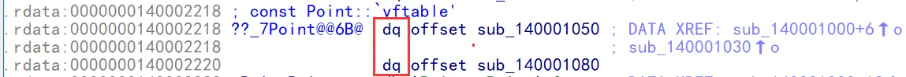

```
sub_140001000 proc near
push    rbx
sub     rsp, 20h
lea     rax, ??_7Point@@6B@ ; const Point::`vftable'        填充虚表,系表地址改为8字节,虚表每一项是dq,													            也是8字节
mov     rbx, rcx
mov     [rcx], rax
lea     rdx, aPointPoint ; "Point::Point"
lea     rcx, aS         ; "%s\r\n"
call    sub_140001170
mov     rax, rbx
add     rsp, 20h
pop     rbx
retn
sub_140001000 endp
```

### 单重继承

像32位一样,通过构造函数识别   是否会在构造函数里面调用基类的构造

```c++
#include <stdio.h>

class Point {

public:

    Point() {
        printf("%s\r\n", __FUNCTION__);
    }
    ~Point() {
        printf("%s\r\n", __FUNCTION__);
    }

    void fun() {
        printf("%s\r\n", __FUNCTION__);
    }

    virtual int GetX() {
        printf("%s\r\n", __FUNCTION__);
        return x;
    };

    virtual int GetY() {
        printf("%s\r\n", __FUNCTION__);
        return y;
    }
private:
    int x;
    int y;
};

class Point3D : public Point {
public:
    Point3D() {
        printf("%s\r\n", __FUNCTION__);
    }
    ~Point3D() {
        printf("%s\r\n", __FUNCTION__);
    }
 
    virtual int GetZ() {
        printf("%s\r\n", __FUNCTION__);
        return z;
    }

    int z;
};

int main(int argc, char* argv[])
{
 

    Point3D obj;
    printf("x=%d  y=%d  z=%d \r\n", obj.GetX(),obj.GetY(), obj.GetZ());
    return 0;
}


```

```
mov     [rsp+arg_0], rbx
push    rdi
sub     rsp, 40h
;Point3D构造
lea     rcx, [rsp+20h]
call    sub_140001000

lea     rcx, [rsp+20h]
call    sub_140001130
lea     rcx, [rsp+20h]
mov     edi, eax
call    sub_140001100
lea     rcx, [rsp+20h]
mov     ebx, eax
call    sub_1400010D0
mov     edx, eax
lea     rcx, aXDYDZD    ; "x=%d  y=%d  z=%d \r\n"
mov     r9d, edi
mov     r8d, ebx
call    sub_140001240
lea     rcx, [rsp+20h]
call    sub_140001070
mov     rbx, [rsp+50h]
xor     eax, eax
add     rsp, 40h
pop     rdi
retn
push    rbx
sub     rsp, 20h
mov     rbx, rcx
call    sub_140001040      ;调用基类构造
lea     rax, ??_7Point3D@@6B@ ; const Point3D::`vftable'    ;回填虚表  
lea     rdx, aPoint3dPoint3d ; "Point3D::Point3D"
mov     [rbx], rax
lea     rcx, aS         ; "%s\r\n"
call    sub_140001240
mov     rax, rbx
add     rsp, 20h
pop     rbx
retn
基类的构造
sub_140001040 proc near
push    rbx
sub     rsp, 20h
lea     rax, ??_7Point@@6B@ ; const Point::`vftable'     ;回填虚表
mov     rbx, rcx
mov     [rcx], rax
lea     rdx, aPointPoint ; "Point::Point"
lea     rcx, aS         ; "%s\r\n"
call    sub_140001240
mov     rax, rbx
add     rsp, 20h
pop     rbx
retn
sub_140001040 endp
```

### 多重继承

跟 32为差不多 ,通过 构造或者析构函数识别 ,看基类构造里面填写虚表之前是否调用其他基类构造,一直到没有基类构造为止

```c++
#include <stdio.h>

class Point {

public:

    Point() {
        printf("%s\r\n", __FUNCTION__);
    }
    ~Point() {
        printf("%s\r\n", __FUNCTION__);
    }

    void fun() {
        printf("%s\r\n", __FUNCTION__);
    }

    virtual int GetX() {
        printf("%s\r\n", __FUNCTION__);
        return x;
    };

    virtual int GetY() {
        printf("%s\r\n", __FUNCTION__);
        return y;
    }
private:
    int x;
    int y;
};

class Point3D : public Point {
public:
    Point3D() {
        printf("%s\r\n", __FUNCTION__);
    }
    ~Point3D() {
        printf("%s\r\n", __FUNCTION__);
    }
 
    virtual int GetZ() {
        printf("%s\r\n", __FUNCTION__);
        return z;
    }

    int z;
};

class Point4D : public Point3D {
public:
    Point4D() {
        printf("%s\r\n", __FUNCTION__);
    }
    ~Point4D() {
        printf("%s\r\n", __FUNCTION__);
    }
};

int main(int argc, char* argv[])
{
 

    Point4D obj;
    printf("x=%d  y=%d  z=%d \r\n", obj.GetX(),obj.GetY(), obj.GetZ());
    return 0;
}


```

```
mov     [rsp+arg_0], rbx
push    rdi
sub     rsp, 40h
;构造函数
lea     rcx, [rsp+20h]
call    sub_140001040
lea     rcx, [rsp+20h]
call    sub_1400011B0
lea     rcx, [rsp+20h]
mov     edi, eax
call    sub_140001180
lea     rcx, [rsp+20h]
mov     ebx, eax
call    sub_140001150
mov     edx, eax
lea     rcx, aXDYDZD    ; "x=%d  y=%d  z=%d \r\n"
mov     r9d, edi
mov     r8d, ebx
call    sub_1400012C0
lea     rcx, [rsp+20h]
call    sub_1400010F0
mov     rbx, [rsp+50h]
xor     eax, eax
add     rsp, 40h
pop     rdi
retn
main endp
```

### 虚继承

通过偏移表   识别 ,而且构造带参数 ,判断是否需要构造虚函数

```c++
#include <stdio.h>

class Point {

public:

    Point() {
        printf("%s\r\n", __FUNCTION__);
    }
    ~Point() {
        printf("%s\r\n", __FUNCTION__);
    }

    void fun() {
        printf("%s\r\n", __FUNCTION__);
    }

    virtual int GetX() {
        printf("%s\r\n", __FUNCTION__);
        return x;
    };

    virtual int GetY() {
        printf("%s\r\n", __FUNCTION__);
        return y;
    }
private:
    int x;
    int y;
};

class Point3D :virtual  public Point {
public:
    Point3D() {
        printf("%s\r\n", __FUNCTION__);
    }
    ~Point3D() {
        printf("%s\r\n", __FUNCTION__);
    }
 
    virtual int GetZ() {
        printf("%s\r\n", __FUNCTION__);
        return z;
    }
    int z;
};

int main(int argc, char* argv[])
{
 
    Point3D obj;
    printf("x=%d  y=%d  z=%d \r\n", obj.GetX(),obj.GetY(), obj.GetZ());
    return 0;
}


```

```
mov     [rsp+arg_0], rbx
mov     [rsp+arg_8], rsi
push    rdi
sub     rsp, 50h
mov     edx, 1      ;构造带参数,判断是否需要构造基类
lea     rcx, [rsp+20h]
call    sub_140001000
mov     rdi, [rsp+28h]
lea     rcx, [rsp+20h]
call    sub_140001170
movsxd  rcx, dword ptr [rdi+4]
mov     esi, eax
lea     rax, [rsp+28h]
add     rcx, rax
call    sub_140001140
movsxd  rcx, dword ptr [rdi+4]
mov     ebx, eax
lea     rax, [rsp+28h]
add     rcx, rax
call    sub_140001110
mov     edx, eax
lea     rcx, aXDYDZD    ; "x=%d  y=%d  z=%d \r\n"
mov     r9d, esi
mov     r8d, ebx
call    sub_1400012A0
lea     rcx, [rsp+20h]
call    sub_1400010F0
mov     rbx, [rsp+60h]
xor     eax, eax
mov     rsi, [rsp+68h]
add     rsp, 50h
pop     rdi
retn
sub_140001000   proc near              					
	 push    rbx
	 sub     rsp, 20h
	 mov     rbx, rcx
	 test    edx, edx
	 jz      short loc_140001021
	 lea     rax, dword_140002298
	 mov     [rcx+8], rax
	 add     rcx, 18h
	 call    sub_140001060
loc_140001021:                         
	 lea     rax, ??_7Point3D@@6B@ ; const Point3D::`vftable'     虚表
	 mov     [rbx], rax
	 lea     rdx, aPoint3dPoint3d ; "Point3D::Point3D"
	 mov     rax, [rbx+8]   
	 movsxd  rcx, dword ptr [rax+4]
	 lea     rax, ??_7Point3D@@6B@_0 ; const Point3D::`vftable'         偏移表
	 mov     [rcx+rbx+8], rax               偏移表现在是在  +  8的位置
	 lea     rcx, aS         ; "%s\r\n"
	 call    sub_1400012A0
	 mov     rax, rbx
	 add     rsp, 20h
	 pop     rbx
	 retn
sub_140001000   endp
```

### 抽象类   __purecall

查看构造函数里面,基类的构造的虚表有没有纯虚函数的调用

```c++
#include <stdio.h>

class Point {

public:

    Point() {
        printf("%s\r\n", __FUNCTION__);
    }
    ~Point() {
        printf("%s\r\n", __FUNCTION__);
    }


    virtual int GetX() = 0;

    virtual int GetY() {
        printf("%s\r\n", __FUNCTION__);
        return y;
    }
private:
    int x;
    int y;
};

class Point3D : public Point {
public:
    Point3D() {
        printf("%s\r\n", __FUNCTION__);
    }
    ~Point3D() {
        printf("%s\r\n", __FUNCTION__);
    }


    virtual int GetX() {
        printf("%s\r\n", __FUNCTION__);
        return z;
    }

    int z;
};

int main(int argc, char* argv[])
{
 

    Point3D obj;
    printf("x=%d  y=%d\r\n", obj.GetX(),obj.GetY());
    return 0;
}


```

```
push    rbx
sub     rsp, 40h
lea     rcx, [rsp+20h]
call    sub_140001000
lea     rcx, [rsp+20h]
call    sub_140001100
lea     rcx, [rsp+20h]
mov     ebx, eax
call    sub_1400010D0
mov     edx, eax
lea     rcx, aXDYD      ; "x=%d  y=%d\r\n"
mov     r8d, ebx
call    sub_1400011F0
lea     rcx, [rsp+20h]
call    sub_140001070
xor     eax, eax
add     rsp, 40h
pop     rbx
retn
sub_140001000 proc near
push    rbx
sub     rsp, 20h
mov     rbx, rcx
call    sub_140001040    基类的构造
lea     rax, ??_7Point3D@@6B@ ; const Point3D::`vftable'
lea     rdx, aPoint3dPoint3d ; "Point3D::Point3D"
mov     [rbx], rax
lea     rcx, aS         ; "%s\r\n"
call    sub_1400011F0
mov     rax, rbx
add     rsp, 20h
pop     rbx
retn
sub_140001000 endp
sub_140001040 proc near
push    rbx
sub     rsp, 20h
lea     rax, ??_7Point@@6B@ ; const Point::`vftable'       虚表
mov     rbx, rcx
mov     [rcx], rax
lea     rdx, aPointPoint ; "Point::Point"
lea     rcx, aS         ; "%s\r\n"
call    sub_1400011F0
mov     rax, rbx
add     rsp, 20h
pop     rbx
retn
sub_140001040 endp
```

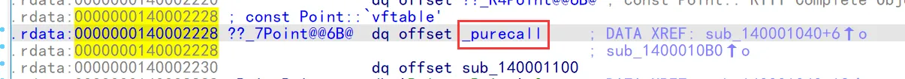

### 异常     

####  try  catch

```c++
#include <stdio.h>


class Point {

public:

    Point() {
        printf("%s\r\n", __FUNCTION__);
    }
    ~Point() {
        printf("%s\r\n", __FUNCTION__);
    }
private:
    int x;
    int y;
};


int main(int argc, char* argv[])
{

    try {
        printf("try1 begin\n");
        if (argc == 1) {
            throw 1;  
        }
        if (argc == 2) {
            throw 3.5f;
        }
        if (argc == 3) {
            throw Point();
        }
        printf("try1 end\n");
    }
    catch (int e) {
        printf("catch int %d\n", e);
    }
    catch (float e) {
        printf("catch float %f\n", e);
    }
    catch (Point e) {
        printf("catch Point\n");
    }
    catch (...) {
        printf("catch All\n");
    }
    return 0;
}


```

```
push    rbx
	 sub     rsp, 40h
	 mov     ebx, ecx
	 lea     rcx, aTry1Begin ; "try1 begin\n"
	 call    sub_140001150
	 cmp     ebx, 1
	 jz      short loc_1400010FE
	 cmp     ebx, 2
	 jz      short loc_140001113
	 cmp     ebx, 3
	 jz      short loc_140001132
	 lea     rcx, aTry1End   ; "try1 end\n"
	 call    sub_140001150
	 nop

loc_1400010F0:                          ; CODE XREF: main+38↓j
							 ; main+3A↓j ...
	 xor     eax, eax
	 add     rsp, 40h
	 pop     rbx
	 retn
; ---------------------------------------------------------------------------
	 jmp     short loc_1400010F0
; ---------------------------------------------------------------------------
	 jmp     short loc_1400010F0
; ---------------------------------------------------------------------------
	 jmp     short loc_1400010F0
; ---------------------------------------------------------------------------

loc_1400010FE:                          ; CODE XREF: main+17↑j
	 mov     [rsp+48h+pExceptionObject], ebx
	 lea     rdx, __TI1H     ; pThrowInfo
	 lea     rcx, [rsp+48h+pExceptionObject] ; pExceptionObject
	 call    _CxxThrowException
; ---------------------------------------------------------------------------

loc_140001113:                          ; CODE XREF: main+1C↑j
	 movss   xmm0, cs:dword_1400022B4
	 movss   [rsp+48h+var_24], xmm0
	 lea     rdx, __TI1M     ; pThrowInfo
	 lea     rcx, [rsp+48h+var_24] ; pExceptionObject
	 call    _CxxThrowException
; ---------------------------------------------------------------------------
loc_140001132:                          ; CODE XREF: main+21↑j
	 lea     rcx, [rsp+48h+var_18]
	 call    sub_140001000
	 lea     rdx, __TI1?AVPoint@@ ; pThrowInfo
	 lea     rcx, [rsp+48h+var_18] ; pExceptionObject
	 call    _CxxThrowException
; ---------------------------------------------------------------------------
	 align 2
	 db 0CCh
; } // starts at 1400010C0
```

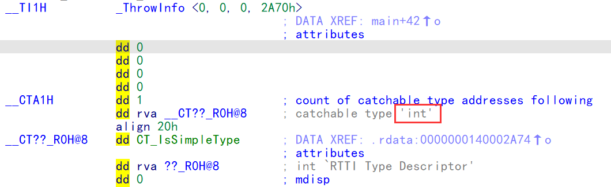

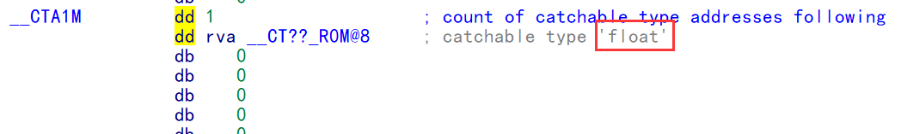

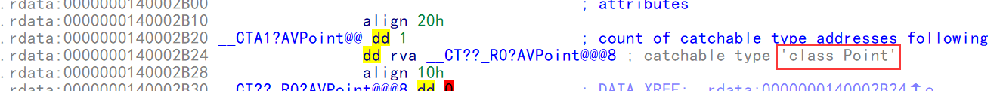


上面没显出正真类型是因为64位记录的是 rva ,把结构体成员类型改成 rva就可以了

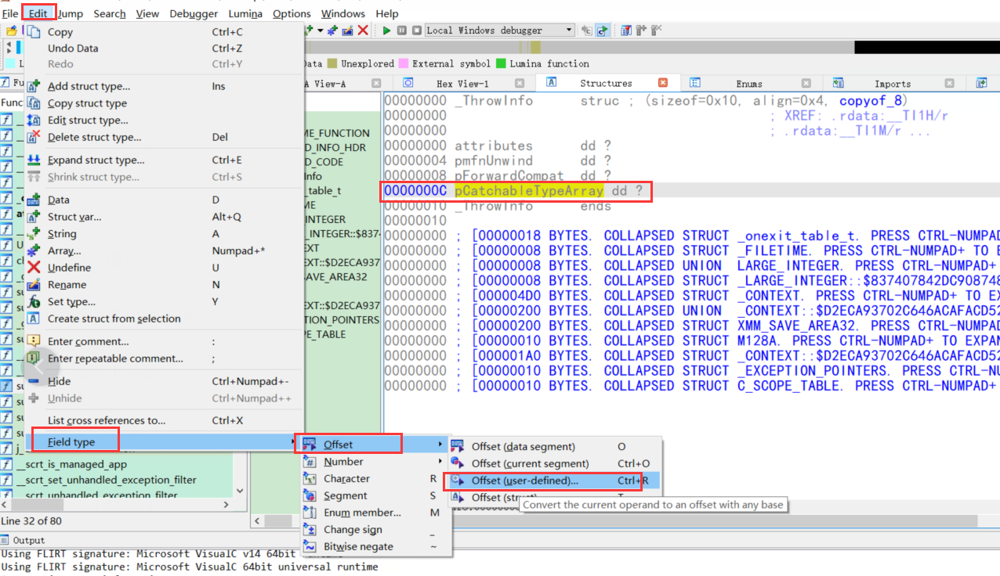

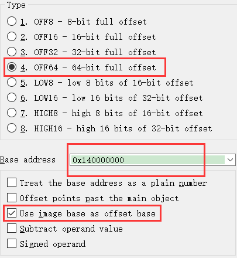


#### SEH(弃用)

64位不再使用  SEH  ,效率太低了,因为不断的要注册和取消异常

#### 3代异常处理

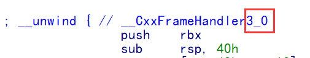


跟32位,没啥区别,多了一个    RUNTIME_FUNCTION  表

https://docs.microsoft.com/zh-cn/cpp/build/exception-handling-x64?view=msvc-170

选项  /d2FH4-    关闭四代异常

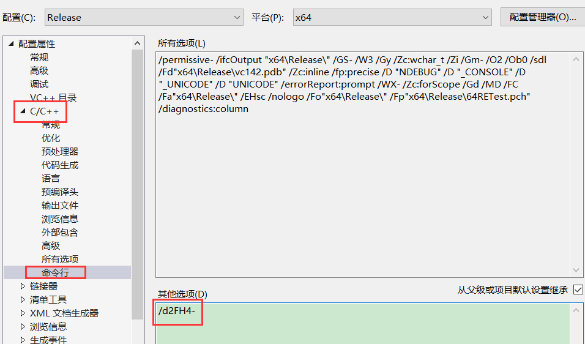

异常表不再是由函数入口来注册,函数出口来取消注册,而是统一做了一个表,这个表放了所有的函数异常处理

为此编译器特地加了一个 .pdata 节 来存放这个表

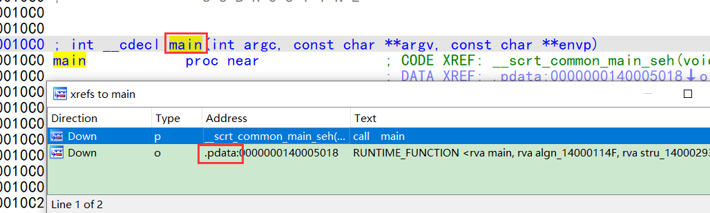

说明存在异常处理

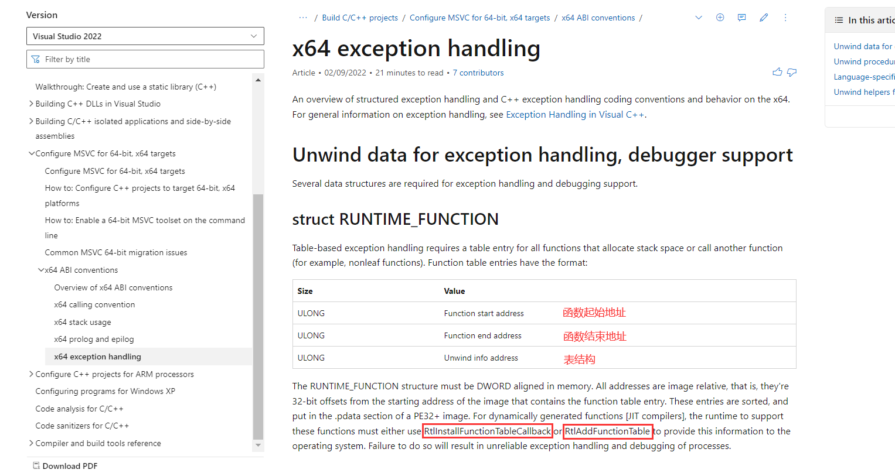

  RUNTIME_FUNCTION

   {

​    ULONG	函数起始地址（RVA)

​    ULONG	函数结束地址（RVA)

​    ULONG	展开信息地址（RVA)

   }


当函数产生异常时,会先计算出 rva ,然后遍历一场信息表,看是否命中在 里面,如果在里面,就说明有异常表

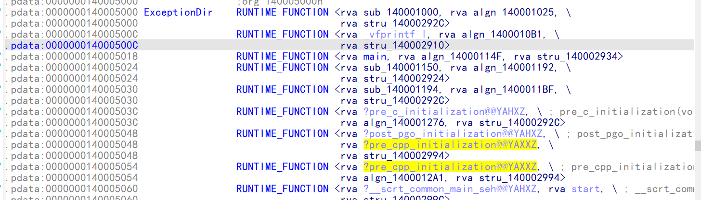


如果出现异常,RUNTIME_FUNCTION 中  就是出现一个指向    UNWIND_INFO   的结构体

大小	值
UBYTE：3	Version
UBYTE：5	Flags
UBYTE	    prolog 的大小
UBYTE	    展开代码的计数
UBYTE：4	帧寄存器
UBYTE：4	帧寄存器偏移（比例）
USHORT * n	展开代码数组
变量	    可以采用下面的形式 (1) 或 (2)


(1) 异常处理程序
大小	值
ULONG	异常处理程序的地址
变量	特定于语言的处理程序数据（可选）

(2) 链式展开信息
大小	值
ULONG	函数起始地址
ULONG	函数结束地址
ULONG	展开信息地址


参数是   _s_FuncInfo  结构体的地址

```c++
typedef const struct _s_FuncInfo
{
	unsigned int		magicNumber:29;		// Identifies version of compiler
	unsigned int		bbtFlags:3;			// flags that may be set by BBT processing
	__ehstate_t			maxState;			// Highest state number plus one (thus
											// number of entries in unwind map)
#if _EH_RELATIVE_FUNCINFO    64位
	int					dispUnwindMap;		// Image relative offset of the unwind map
	unsigned int		nTryBlocks;			// Number of 'try' blocks in this function
	int					dispTryBlockMap;	// Image relative offset of the handler map
	unsigned int		nIPMapEntries;		// # entries in the IP-to-state map. NYI (reserved)
	int					dispIPtoStateMap;	// Image relative offset of the IP to state map
	int					dispUwindHelp;		// Displacement of unwind helpers from base
	int					dispESTypeList;		// Image relative list of types for exception specifications
#else    32位
	UnwindMapEntry*		pUnwindMap;			// Where the unwind map is
	unsigned int		nTryBlocks;			// Number of 'try' blocks in this function
	TryBlockMapEntry*	pTryBlockMap;		// Where the handler map is
	unsigned int		nIPMapEntries;		// # entries in the IP-to-state map. NYI (reserved)
	void*				pIPtoStateMap;		// An IP to state map.  NYI (reserved).
	ESTypeList*			pESTypeList;		// List of types for exception specifications
#endif
	int					EHFlags;			// Flags for some features.
} FuncInfo;

可以看到 64为比32位多了一表,并且都是rva,而不是指针了
```

接下来只需要和 32位一样 跟着表就可以到  异常信息的表了


try cath 的作用范围   _s_FuncInfo   中的   dispIPtoStateMap  表来决定

dispIPtoStateMap   每一项有2个成员    异常地址      异常编号      

1.   如果异常编号为 -1 ,代表所有异常结束  
2.  如果一个 try  不包含另一个 try , 那可能第一个try 开始可能就是上一个的结束
3.  如果  try1  嵌套   try2   dispIPtoStateMap  表中那么 第二次计进入  try1 代表    try2  结束

#### 4代异常处理  (默认)

选项  /d2FH4   使用四代异常(默认开启)

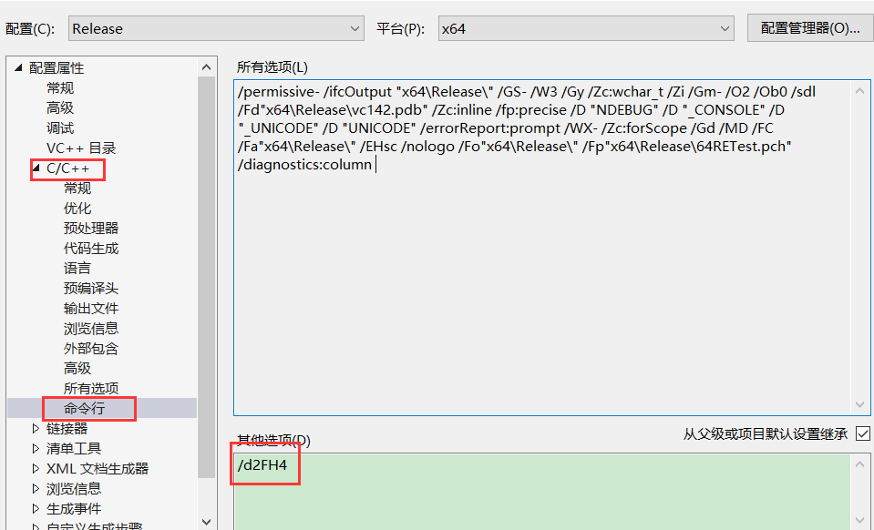

使用第四代异常原因 :  因为当我们软件有了异常处理以后编译器要生成大量的异常表来表达异常结构,这就导致软件变大,因此使用第四代异常可以极大的减小异常表大小(大概减小64%)

减小方法:   

1.   所有结构体成员使用压缩算法 :  用标志位来决定rav 有几个字节(变参),每一个rva都是相对上一个rva的值,这样偏移就变小了 
2.   所有结构体成员可变 :    一个结构可以有一个成员,也可以有2个成员,具体几个成员不确定


异常解析的结构体和代码 在   ehdata4.h   和    ehdata4_export.h 中有


##### 分析表

找表 :  main韩式参考引用 找  ,pada 节

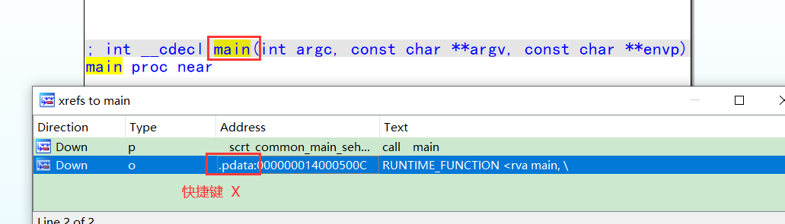

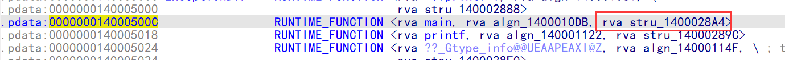

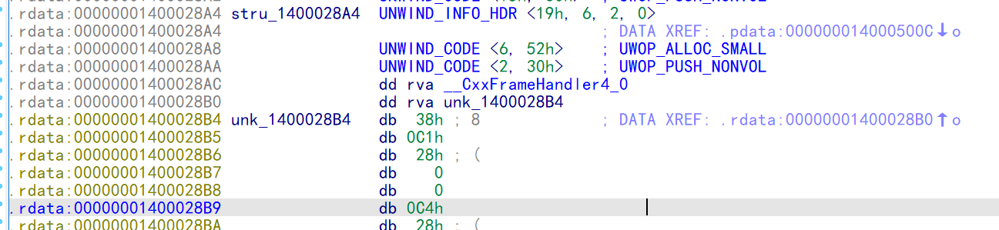

因为结构体成员不固定,所以结构体成员没法自己定义

```c++
struct FuncInfo4
{
    FuncInfoHeader      header;      //共用体,决定哪些成员存在,1字节,用位段来表示
    uint32_t            bbtFlags;            // flags that may be set by BBT processing

    int32_t             dispUnwindMap;       // Image relative offset of the unwind map
    int32_t             dispTryBlockMap;     // Image relative offset of the handler map
    int32_t             dispIPtoStateMap;    // Image relative offset of the IP to state map
    uint32_t            dispFrame;           // displacement of address of function frame wrt establisher frame, only used for catch funclets

    FuncInfo4()
    {
        header.value = 0;
        bbtFlags = 0;
        dispUnwindMap = 0;
        dispTryBlockMap = 0;
        dispIPtoStateMap = 0;
        dispFrame = 0;
    }

};
```

```c++
用位来表示 结构体有哪些成员  1 代表有 0代表没有
struct FuncInfoHeader
{
    union
    {
#pragma warning(push)
#pragma warning(disable: 4201) // nonstandard extension used: nameless struct/union
        struct
        {
            uint8_t isCatch        : 1;  // 1 if this represents a catch funclet, 0 otherwise
            uint8_t isSeparated    : 1;  // 1 if this function has separated code segments, 0 otherwise
            uint8_t BBT            : 1;  // Flags set by Basic Block Transformations
            uint8_t UnwindMap      : 1;  // Existence of Unwind Map RVA
            uint8_t TryBlockMap    : 1;  // Existence of Try Block Map RVA
            uint8_t EHs            : 1;  // EHs flag set
            uint8_t NoExcept       : 1;  // NoExcept flag set
            uint8_t reserved       : 1;
        };
#pragma warning(pop)
        uint8_t value;
    };

    FuncInfoHeader()
    {
        value = 0;
    }
};
```

 IDA种定义位段: 

1  IDA 认为位段就是枚举

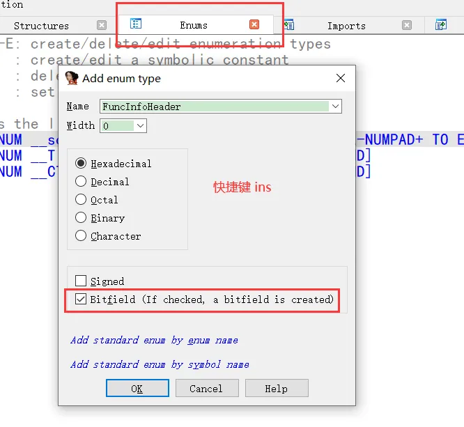


2添加成员

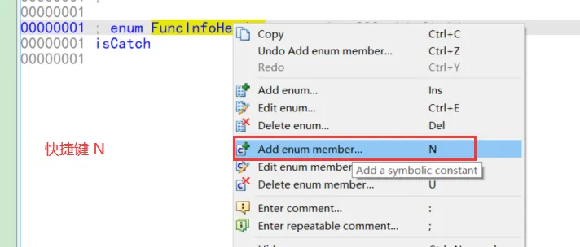


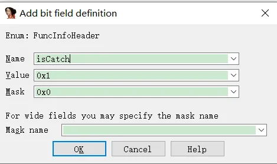


3编辑枚举大小

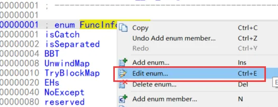


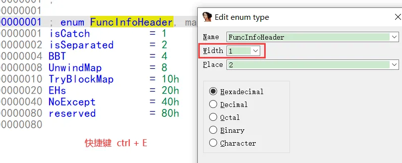


4把地址定义为枚举

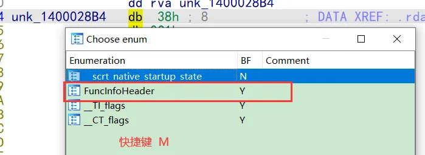


5如果有问题 

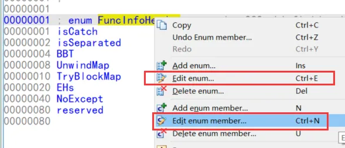


2个的 place 都改为1 试试

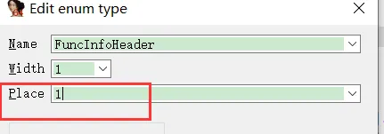


 解析表 

可以看出结构体有3个成员

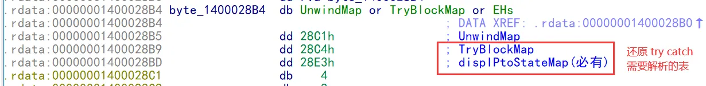


```c++
  TryBlockMap4(const FuncInfo4 *pFuncInfo, uintptr_t imageBase)
    {
        if (pFuncInfo->dispTryBlockMap != 0)
        {
            _buffer = imageRelToByteBuffer(imageBase, pFuncInfo->dispTryBlockMap);
            _numTryBlocks = ReadUnsigned(&_buffer);    //得到 TryBlockMap 数量
            // Set reset position after count field
            _bufferStart = _buffer;
            DecompTryBlock();   //解析 TryBlockMap
        }
        else
        {
            _numTryBlocks = 0;
        }
    }
```

```c++
inline uint32_t ReadUnsigned(uint8_t ** pbEncoding)
{
    uint32_t lengthBits = **pbEncoding & 0x0F;   //第一个字截取内容 & 0x0f,取低四位
    //拿低四位分别去查下面2个表
    size_t negLength = s_negLengthTab[lengthBits];  
    uint32_t shift = s_shiftTab[lengthBits];        

    //运算得到一个结果  取新地址 (地址 -  negLength - 4) 的 内容
    uint32_t result = *(reinterpret_cast<uint32_t *>(*pbEncoding - negLength - 4)); 
    //右移  shift  位
    result >>= shift;
    *pbEncoding -= negLength;   

    return result;
}

inline constexpr int8_t s_negLengthTab[16] =
{
    -1,    // 0
    -2,    // 1
    -1,    // 2
    -3,    // 3

    -1,    // 4
    -2,    // 5
    -1,    // 6
    -4,    // 7

    -1,    // 8
    -2,    // 9
    -1,    // 10
    -3,    // 11

    -1,    // 12
    -2,    // 13
    -1,    // 14
    -5,    // 15
};

inline constexpr uint8_t s_shiftTab[16] =
{
    32 - 7 * 1,    // 0
    32 - 7 * 2,    // 1
    32 - 7 * 1,    // 2
    32 - 7 * 3,    // 3

    32 - 7 * 1,    // 4
    32 - 7 * 2,    // 5
    32 - 7 * 1,    // 6
    32 - 7 * 4,    // 7

    32 - 7 * 1,    // 8
    32 - 7 * 2,    // 9
    32 - 7 * 1,    // 10
    32 - 7 * 3,    // 11

    32 - 7 * 1,    // 12
    32 - 7 * 2,    // 13
    32 - 7 * 1,    // 14
    0,             // 15
};

```

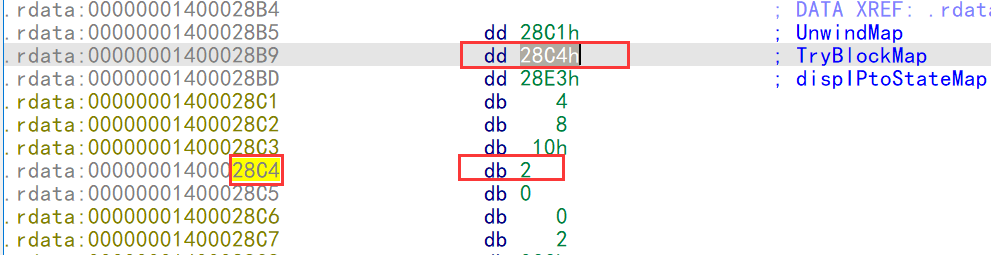

接下来就是解析   TryBlockMapEntry4  成员了

```c++
struct TryBlockMapEntry4 {
    __ehstate_t    tryLow;             // Lowest state index of try
    __ehstate_t    tryHigh;            // Highest state index of try
    __ehstate_t    catchHigh;          // Highest state index of any associated catch
    int32_t        dispHandlerArray;   // Image relative offset of list of handlers for this try
};
```

```c++
    void DecompTryBlock()
    {
        _tryBlock.tryLow = ReadUnsigned(&_buffer);
        _tryBlock.tryHigh = ReadUnsigned(&_buffer);
        _tryBlock.catchHigh = ReadUnsigned(&_buffer);
        _tryBlock.dispHandlerArray = ReadInt(&_buffer);
    }
```

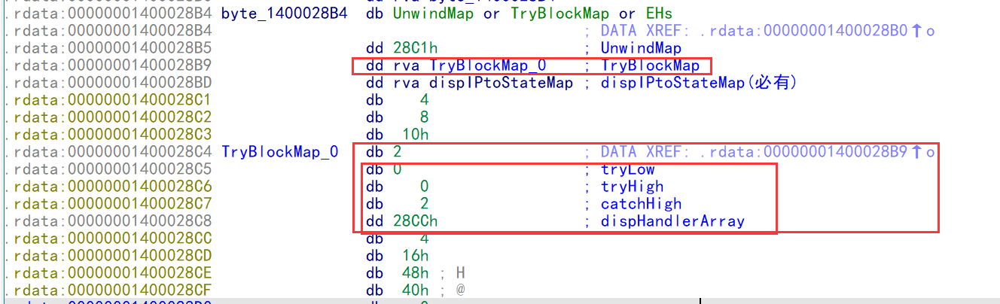

得到各自在IDA中的之后 , 在分别通过   ReadUnsigned()  算法得到真正的值

例如

个数就等于(_numTryBlocks)         ReadUnsigned  ( FuncInfoHeader. TryBlockMap)   =   1  ;

```c++

inline uint32_t ReadUnsigned(uint8_t ** pbEncoding)  
{
    // pbEncoding = 偏移为 0x 28B9  *pbEncoding  = 偏移为 0x 28C4   **pbEncoding  =  0x2002
    uint32_t lengthBits = **pbEncoding & 0x0F;   //第一个字截取内容 & 0x0f,取低四位     结果是2
    //拿低四位分别去查下面2个表
    size_t negLength = s_negLengthTab[lengthBits];          结果为 - 1
    uint32_t shift = s_shiftTab[lengthBits];                              结果为 25

    //运算得到一个结果  取新地址 (地址 -  negLength - 4) 的 内容   
    uint32_t result = *(reinterpret_cast<uint32_t *>(*pbEncoding - negLength - 4));                将当前地址 -3位置取dd,注意小尾   上图结果就是   从 偏移为0x28C1取四字节  0x4  0x8   0x10  0x2 ,因为小尾 所以是  
0x02  0x10  0x08  0x04  每一个8位  即  00000010 00001010  00001000 00000100
    //右移  shift  位
    result >>= shift;                 右移25位,取高7位  即  0000 001 结果为  1   
    *pbEncoding -= negLength;         然后地址 +1 ,去下一个成员的的
    return result;
}
```

```c++
struct HandlerType4 {
    HandlerTypeHeader header;
    uint32_t          adjectives;                              // Handler Type adjectives (bitfield)
    int32_t           dispType;                                // Image relative offset of the corresponding type descriptor
    uint32_t          dispCatchObj;                            // Displacement of catch object from base
    int32_t           dispOfHandler;                           // Image relative offset of 'catch' code
    uintptr_t         continuationAddress[MAX_CONT_ADDRESSES]; // Continuation address(es) of catch funclet

    void reset()
    {
        header.value = 0;
        adjectives = 0;
        dispType = 0;
        dispCatchObj = 0;
        dispOfHandler = 0;
        memset(continuationAddress, 0, sizeof(continuationAddress));
    }

    HandlerType4()
    {
        reset();
    }
};
```

```c++
struct HandlerTypeHeader
{
    // See contAddr for description of these values
    enum contType
    {
        NONE = 0b00,
        ONE = 0b01,
        TWO = 0b10,
        RESERVED = 0b11
    };
    union
    {
#pragma warning(push)
#pragma warning(disable: 4201) // nonstandard extension used: nameless struct/union
        struct
        {
            uint8_t adjectives   : 1; // Existence of Handler Type adjectives (bitfield)
            uint8_t dispType     : 1; // Existence of Image relative offset of the corresponding type descriptor
            uint8_t dispCatchObj : 1; // Existence of Displacement of catch object from base
            uint8_t contIsRVA    : 1; // Continuation addresses are RVAs rather than function relative, used for separated code
            uint8_t contAddr     : 2; // 1.   00: no continuation address in metadata, use what the catch funclet returns
                                      // 2.   01: one function-relative continuation address
                                      // 3.   10: two function-relative continuation addresses
                                      // 4.   11: reserved
            uint8_t unused       : 2;
        };
#pragma warning(pop)
        uint8_t value;
    };
};
```

解析流程跟   解析 TryBlockMap4 一样