### 像IDA中假如自定义枚举

通过加载文件这3个枚举加入 IDA

```c++
//需要添加到 IDA 的 3个枚举
enum FuncInfoHeader
{
	isCatch = 0x1,
	isSeparated = 0x2, 
	BBT = 0x4, 
	UnwindMap = 0x8, 
	TryBlockMap = 0x10, 
	EHs = 0x20,
	NoExcept = 0x40,
	reserved = 0x80,
};

enum HandlerTypeHeader
{
	adjectives = 0x1,
	dispType = 0x2, 
	dispCatchObj = 0x4, 
	contIsRVA = 0x8, 
	contAddr1 = 0x10, 
	contAddr2 = 0x20,
	unused1 = 0x40,
	unused2 = 0x80,
};

enum contType
{
	NONE = 0,
	ONE = 1,
	TWO = 2,
	RESERVED = 3
};
```

导入之后,把枚举加入 iad


### 课堂示例

```c++
#include <stdio.h>


int main(int argc, char* argv[])
{
    try {
        printf("try1 begin\n");
        if (argc == 1) {
            throw 1;  //14001024 - 1400000 = 1024
        }
        if (argc == 2) {
            throw 3.5f;
        }
        if (argc == 3) {
            throw 'a';
        }

        try {
            printf("try2 begin\n");
            if (argc == 1) {
                throw "asdf";
            }
            printf("try2 end\n");
        }
        catch (...) {
            printf("catch all\n");
        }

        printf("try1 end\n");

    }
    catch (int e) {
        printf("catch int %d\n", e);
    }
    catch (float e) {
        printf("catch float %f\n", e);
    }
    catch (...) {
        printf("catch all\n");
    }

    return 0;
}


```

#### 还原步骤:

##### 先找到  runtime_funciton 结构体

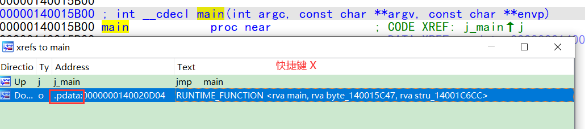

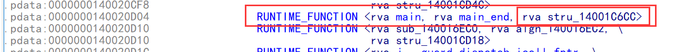

最后一项是指向 unwind_info的结构体

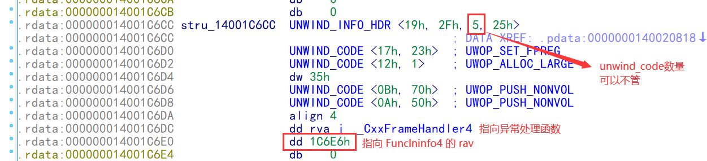

把值设为 rva

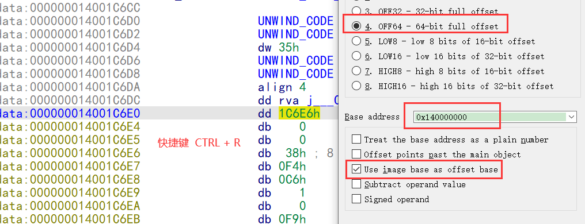

点击偏移到  Funclninfo4 结构体,把第一个字节定义为我们之前添加的枚举类型

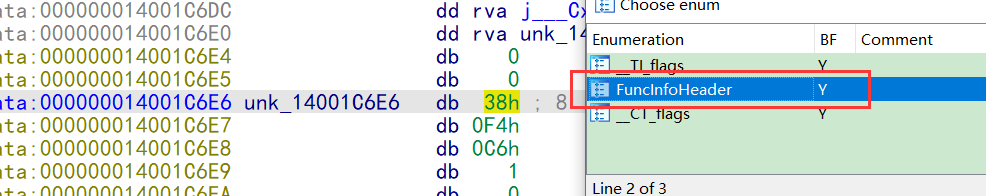

根据  枚举显示存在的项分别设置成  rva  ,自己也可以改一下标号名字

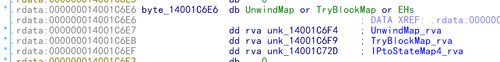

对我们逆向来说 ,主要解析     TryBlockMap  和   IPtoStateMap4  这两个表就可以了


##### 解析   TryBlockMap    判断几个try

TryBlockMap

```c++
struct TryBlockMapEntry4 {
    __ehstate_t    tryLow;             // Lowest state index of try
    __ehstate_t    tryHigh;            // Highest state index of try
    __ehstate_t    catchHigh;          // Highest state index of any associated catch
    int32_t        dispHandlerArray;   // Image relative offset of list of handlers for this try
};

```

解析方法

```c++
if (pFuncInfo->dispTryBlockMap != 0)
{
    _buffer = imageRelToByteBuffer(imageBase, pFuncInfo->dispTryBlockMap);
    _numTryBlocks = ReadUnsigned(&_buffer);
    // Set reset position after count field
    _bufferStart = _buffer;
    DecompTryBlock();
}

```

解密算法

```c++
inline uint32_t ReadUnsigned(uint8_t ** pbEncoding)
{
    uint32_t lengthBits = **pbEncoding & 0x0F;
    size_t negLength = s_negLengthTab[lengthBits];
    uint32_t shift = s_shiftTab[lengthBits];
    uint32_t result = *(reinterpret_cast<uint32_t *>(*pbEncoding - negLength - 4));

    result >>= shift;
    *pbEncoding -= negLength;

    return result;
}


1byte    0,2,4,6,8,10,12,14     拿最后1个字节右移 1 位
2byte    1, 5, 9, 13            拿最后2个字节右移 2 位
3byte    3,11                   拿最后3个字节右移 3 位
4byte    7,                     拿最后4个字节右移 4 位
5byte    15


inline constexpr int8_t s_negLengthTab[16] =
{
    -1,    // 0
    -2,    // 1
    -1,    // 2
    -3,    // 3

    -1,    // 4
    -2,    // 5
    -1,    // 6
    -4,    // 7

    -1,    // 8
    -2,    // 9
    -1,    // 10
    -3,    // 11

    -1,    // 12
    -2,    // 13
    -1,    // 14
    -5,    // 15
};

inline constexpr uint8_t s_shiftTab[16] =
{
    32 - 7 * 1,    // 0
    32 - 7 * 2,    // 1
    32 - 7 * 1,    // 2
    32 - 7 * 3,    // 3

    32 - 7 * 1,    // 4
    32 - 7 * 2,    // 5
    32 - 7 * 1,    // 6
    32 - 7 * 4,    // 7

    32 - 7 * 1,    // 8
    32 - 7 * 2,    // 9
    32 - 7 * 1,    // 10
    32 - 7 * 3,    // 11

    32 - 7 * 1,    // 12
    32 - 7 * 2,    // 13
    32 - 7 * 1,    // 14
    0,             // 15
};
```

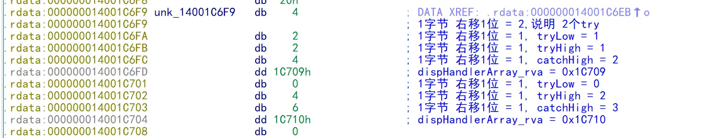


可以看到 有2个 try    其中  1  - 1  是嵌套在  0 -2 里面

 解析dispHandlerArray  判断几个 catch 

```c++
struct HandlerType4 {
    HandlerTypeHeader header;
    uint32_t          adjectives;                              // Handler Type adjectives (bitfield)
    int32_t           dispType;                                // Image relative offset of the corresponding type descriptor
    uint32_t          dispCatchObj;                            // Displacement of catch object from base
    int32_t           dispOfHandler;                           // Image relative offset of 'catch' code
    uintptr_t         continuationAddress[MAX_CONT_ADDRESSES]; // Continuation address(es) of catch funclet

    void reset()
    {
        header.value = 0;
        adjectives = 0;
        dispType = 0;
        dispCatchObj = 0;
        dispOfHandler = 0;
        memset(continuationAddress, 0, sizeof(continuationAddress));
    }

    HandlerType4()
    {
        reset();
    }
};
```

```c++
struct HandlerTypeHeader
{
    // See contAddr for description of these values
    enum contType
    {
        NONE = 0b00,
        ONE = 0b01,
        TWO = 0b10,
        RESERVED = 0b11
    };
    union
    {
#pragma warning(push)
#pragma warning(disable: 4201) // nonstandard extension used: nameless struct/union
        struct
        {
            uint8_t adjectives   : 1; // Existence of Handler Type adjectives (bitfield)
            uint8_t dispType     : 1; // Existence of Image relative offset of the corresponding type descriptor
            uint8_t dispCatchObj : 1; // Existence of Displacement of catch object from base
            uint8_t contIsRVA    : 1; // Continuation addresses are RVAs rather than function relative, used for separated code
            uint8_t contAddr     : 2; // 1.   00: no continuation address in metadata, use what the catch funclet returns
                                      // 2.   01: one function-relative continuation address
                                      // 3.   10: two function-relative continuation addresses
                                      // 4.   11: reserved
            uint8_t unused       : 2;
        };
#pragma warning(pop)
        uint8_t value;
    };
};
```

```c++
if (tryMap->dispHandlerArray != 0)
{
    _buffer = imageRelToByteBuffer(_imageBase, tryMap->dispHandlerArray);
    _numHandlers = ReadUnsigned(&_buffer);
    _bufferStart = _buffer;
    DecompHandler();
}

  void DecompHandler()
    {
        _handler.reset();
        _handler.header.value = _buffer[0];
        ++_buffer;

        if (_handler.header.adjectives) {
            _handler.adjectives = ReadUnsigned(&_buffer);
        }

        if (_handler.header.dispType) {
            _handler.dispType = ReadInt(&_buffer);
        }

        if (_handler.header.dispCatchObj) {
            _handler.dispCatchObj = ReadUnsigned(&_buffer);
        }

        _handler.dispOfHandler = ReadInt(&_buffer);

        if (_handler.header.contIsRVA)
        {
            if (_handler.header.contAddr == HandlerTypeHeader::contType::ONE) {
                _handler.continuationAddress[0] = ReadInt(&_buffer);
            }
            else if (_handler.header.contAddr == HandlerTypeHeader::contType::TWO) {
                _handler.continuationAddress[0] = ReadInt(&_buffer);
                _handler.continuationAddress[1] = ReadInt(&_buffer);
            }
            else {
                // no encoded cont addresses or unknown
            }
        }
        else
        {
            if (_handler.header.contAddr == HandlerTypeHeader::contType::ONE) {
                _handler.continuationAddress[0] = _functionStart + ReadUnsigned(&_buffer);
            }
            else if (_handler.header.contAddr == HandlerTypeHeader::contType::TWO) {
                _handler.continuationAddress[0] = _functionStart + ReadUnsigned(&_buffer);
                _handler.continuationAddress[1] = _functionStart + ReadUnsigned(&_buffer);
            }
            else {
                // no encoded cont addresses or unknown
            }
        }
    }
```

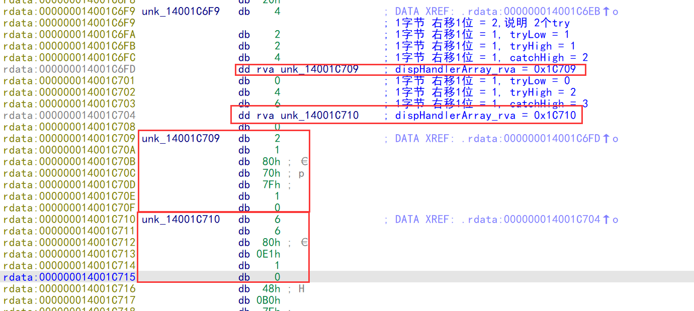

设为枚举


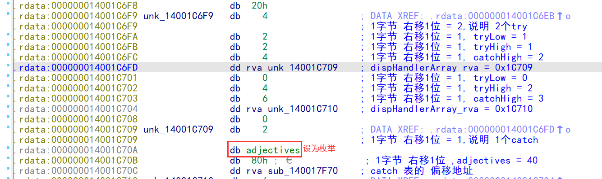

同理可以解析第二个

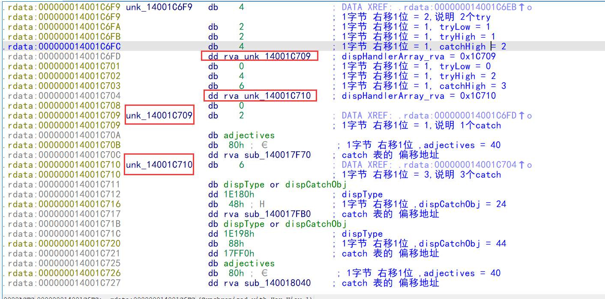


##### 解析 IPtoStateMap4  得到 try 范围

```c++
  IPtoStateMap4(const FuncInfo4 *pFuncInfo, uintptr_t imageBase, uint32_t funcStart) :
        _imageBase(imageBase), _funcStart(funcStart)
{
    if (pFuncInfo->dispIPtoStateMap)
    {
        uint8_t *buffer = imageRelToByteBuffer(imageBase, pFuncInfo->dispIPtoStateMap);
        _numEntries = ReadUnsigned(&buffer);
        _bufferStart = buffer;
    }
    else
    {
        _numEntries = 0;
    }
}
```

```c++
struct IPtoStateMapEntry4 {
    int32_t     Ip;     // Image relative offset of IP
    __ehstate_t State;
};

```

```c++
IPtoStateMapEntry4 decompIP2State(uint8_t ** currOffset, uint32_t prevIp)
{
    IPtoStateMapEntry4 IPEntry;
    IPEntry.Ip = _funcStart + prevIp + ReadUnsigned(currOffset);
    // States are encoded +1 so as to not encode a negative
    IPEntry.State = ReadUnsigned(currOffset) - 1;

    return IPEntry;
}
```

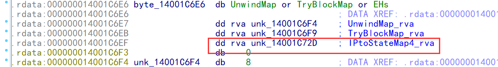

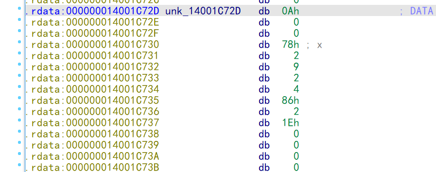


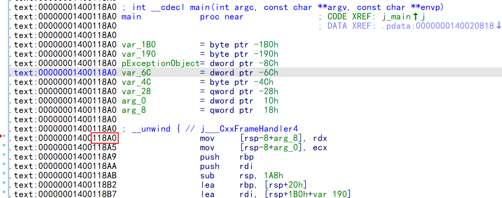

每一项的 ip 都需要加上前一项的 ,   ip_rva + 模块基址 就表示 catch 的地址


### IDA 7.7 以后新增了对第四代异常的解析,但不完整