## 内核

何为内核？（rootkit) 

类比仙侠小说来说:   3环就是人间    内核就是仙界

### windows内核需要掌握的知识点

1.  .驱动开发：因为需要通过驱动进入0环

WDK(Windows Driver Kit)

WDM WDF  KMDF   NT驱动（内核驱动)

1.  系统原理：进行攻防必须得懂

主要要掌握系统原理

### 保护模式

之前 8086  即 16位 cpu 是实模式,人人平等(权限是一样的)

-   因为权限一样因此容易出问题  :  软件安全问题
-   因为所有软件权限一样,当恶意软件破坏系统或电脑是没法处理

因此 设计了保护模式  从 80386  即 32位 cpu  以后才有的 ,就有了权限的概念

在计算机中主要要保护**硬件**  

因此出现了两种权限

1.  用户权限 :   运行应用程序   -> 不能访问硬件
2.  系统权限 :   运行操作系统    -> 可以访问硬件

但是如果应用程序需要访问硬件,例如访问硬盘读数据 ,那么只能通过调用接口 来找操作系统 来访问硬件,这个接口就被称为系统调用(API).

内核研究的就是怎么让应用程序,绕过接口直接访问硬件

关于系统开发在 intel cpu手册第3卷  要学会使用手册,因为最新的技术都需要查手册


####  CPU运行模式：

1.Real Mode  实模式（CPU 通电进入的模式) BIOS代码  兼容16位操作系统和应用程序

2.Protected Mode 保护模式  32位操作系统  权限

3.Virtual-8086 Mode 虚拟8086模式    模拟8086的环境 =》 运行16位程序


#### 4种权限（ring0 ring1 ring2 ring3） 

1.  ring0   -> 运行系统代码
2.  ring3  ->  运行应用程序代码

权限等级越多,越难管理,因此虽然发明了 4种权限,但实际只用了2种


#### 保护模式提供的功能：

1.权限管理

2.内存隔离   (正常情况各程序运行不受其他程序影响,即 A 程序 崩溃不影响B程序)

3.任务管理（Task)    进程线程切换(CPU没有线程进程的概念,这些都看做任务)

4.系统调用     操作系统怎么安全的向应用程序提供 API的机制

5.中断管理    操作系统跟硬件交互的机制

.........


#### 进入0环的方法

1.  系统级别的漏洞:  如果运行在0环的操作系统有bug或漏洞,那么我们就可以利用这个api在0环运行程序
2.  驱动接口


#### 驱动

Operator System(OS)操作系统  =>  驱动接口（xxxx.sys)   => 硬件（产家)

一般生产操作系统的厂家不生产硬件,因此操作系统怎么知道如何和硬件之间的进行通信呢,但是硬件厂家知道怎么操作硬件,因此操作系统会定义一套接口给硬件厂家, 这些接口用来驱动硬件,这些接口让厂家来实现他的代码,这些接口就是 驱动接口( xxx.sys),这些接口如果运行在 3环是不可以的,因为3环无法操作硬件,所以这部分代码必须运行在 0 环 . 因此操作系统就像一个主模块 exe  ,而驱动就像一个个 dll,因此操作系统可以将 驱动当作自己的一部分


例如:  操作系统想操作键盘   只需要实现 kbdclass.sys ,这样厂家就可以做 这样一个驱动程序,让操作系统去加载他,这样就具备了操作硬件的功能 , 因此   kbdclass.sys 中的代码就变成了 0 环权限再运行,地址在高2G的内存

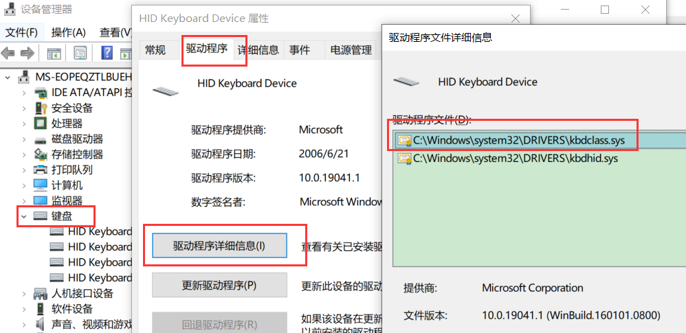

硬件驱动程基本都在 drivers 文件夹中


应用程序内存空间                       00000000~0x7FFFFFFF            

系统（内核）内存空间               0x80000000~0xFFFFFFFF

系统内存可以访问应用程序内存,应用程序内存不可以访问系统内存


##### 驱动种类

内核驱动.sys

硬件驱动.sys


##### 驱动安全问题

这样操作系统就可以支持各种硬件,把硬件插上去不认识装一个厂家驱动就可以,这样可以产生各种机器硬件

但是有一个致命缺陷,那就是驱动的安全问题

操作系统自然会启动一个驱动框架给厂家编写驱动,这样可以能病毒作者使用框架写一个病毒的 .sys(不操作硬件 ) 或者恶意软件的 .sys 这样操作系统加在这个框架代码就进入0环了, 这样就给了一个我们光明正大进入0环的方法


Operator System(OS)操作系统  =>  虚拟硬件（虚拟光驱.sys 不操硬件 内核驱动  )   => 硬件（产家)

驱动开发框架中大力支持内核驱动 =>  Operator System(OS)操作系统  =>  病毒（病毒.sys 不操硬件 ring0)   => 硬件（产家)


因为驱动不能取消,因此到了今天仍然没有办法解决这个问题,但是随着系统的升级,缓解了这个问题


驱动开发:  仅开发硬件的驱动

 Windows内核:    Windows内核（OS内核代码) -> 通过驱动进入内核  => 内核中进行安全攻防

#### 内核位置

内核在C盘里面     C:\Windows\System32\ntoskrnl.exe

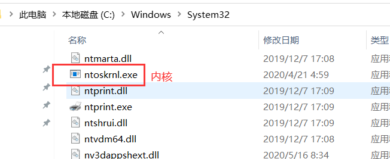


### 驱动开发

https://docs.microsoft.com/zh-cn/windows-hardware/drivers/download-the-wdk

#### 框架

WDK(Windows Driver Kit)                驱动开发包

WDM(即插即用,把驱动集成在硬件里面)    WDF(C++的开发框架)     KMDF(内核模式的驱 即  NT驱动  内核驱动)

#### 安装

##### 低版本

2010年以前驱动是一个独立的开发包,2010以后,微软把 wdk 当做 vs的一个插件了,但是被喷了,就推出了 EWDK

WDK 版本越高,就可以用越新的API

建议下载一个老版本的,一个新版本的,因为老版本有一个离线的文档

低版本:


安装:  

点击下载的 ios文件

再点击 如图exe

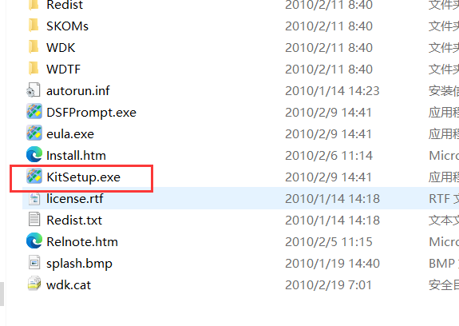

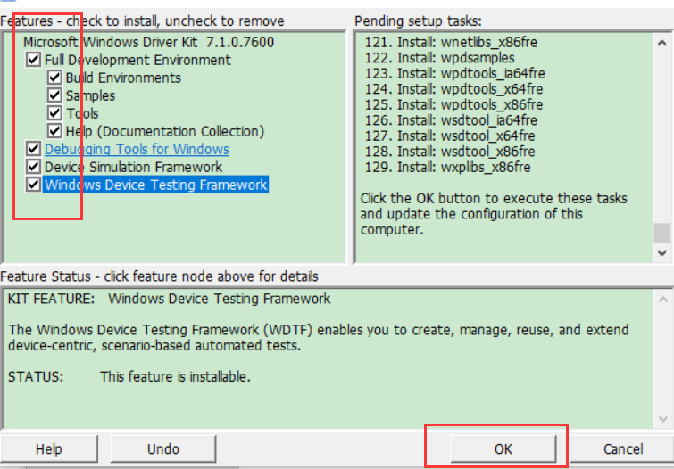

打勾是安装,不打勾是卸载


win7的话就只能用不超过 win7的 api

安装好:

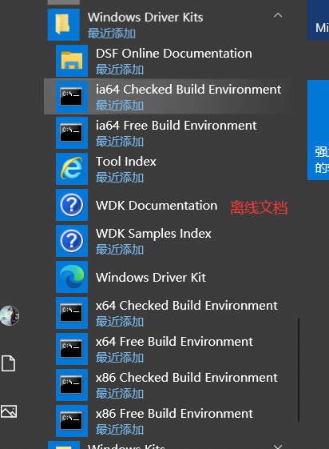


##### 高版本

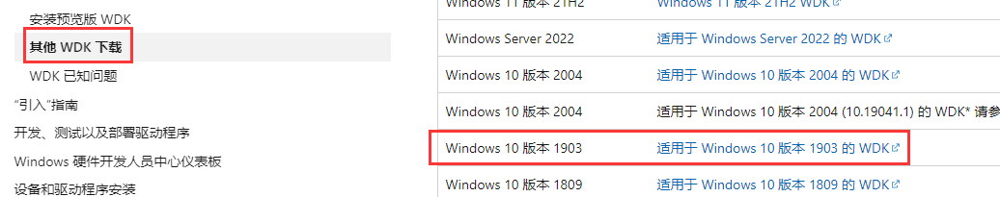

1.  高版本需要先装 vs, win11可以用vs2022,    1903的装 vs2019 就可以了
2.  然后安装对应版本的 SDk  ; 先正常情况下装完需要重启,不重启也可以用,而且也可以在 vs中装

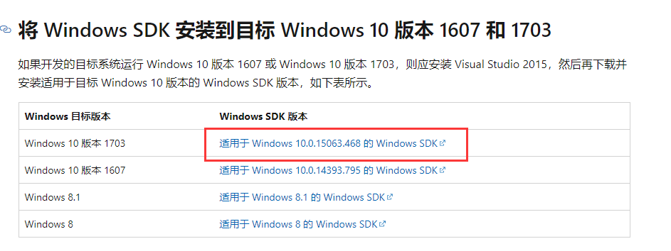

如果版本低了可以安装最新版本的,高版本可以取代低版本的


vs中安装SDK

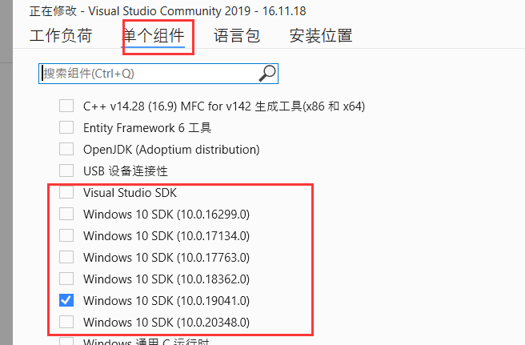


1.  安装 WDK 插件  : 要等 SDK 装完

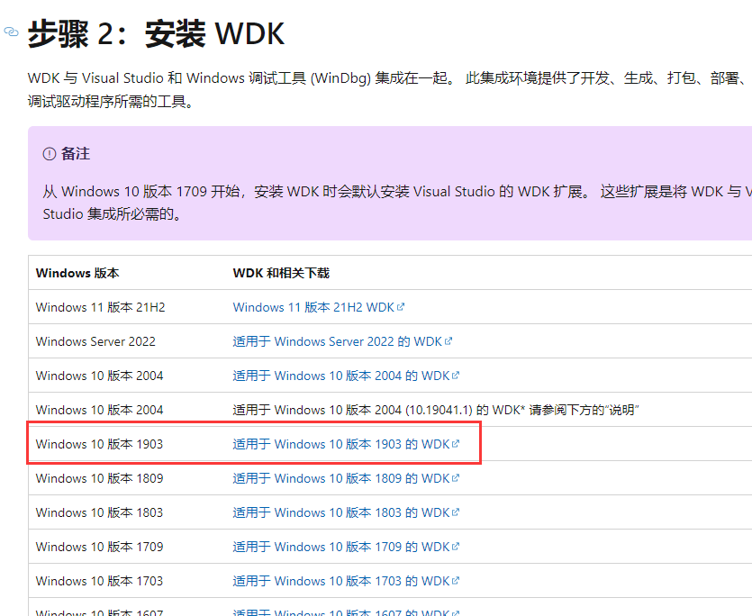

注意:  安装完 WDK 之后会自动安装 vs 的插件 ,在这过程中不能中断,否则这个插件再也装不上,而且无法卸载,只能重装系统


安装完了之后 用vs 创建项目就会多一个驱动的选项


#### 使用

##### 低版本

###### 搭建框架


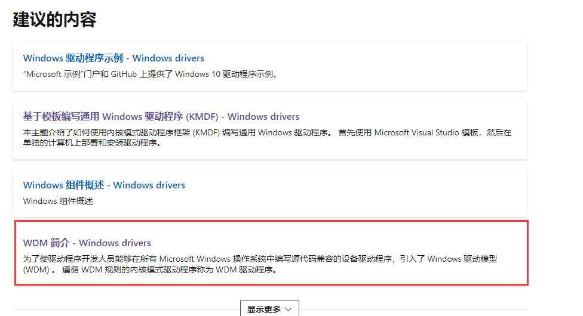

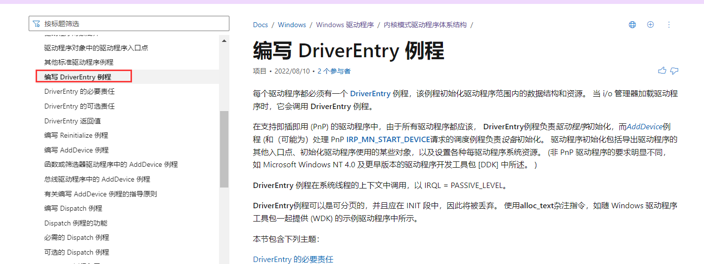

或者看离线的

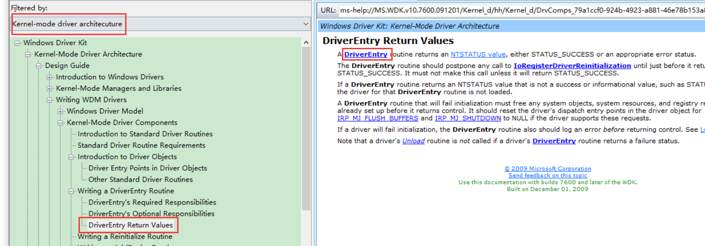


一个简单的框架

```c
#include <Ntddk.h>    //什么框架就包含什么头文件


/*驱动卸载函数*/
VOID Unload(__in struct _DRIVER_OBJECT* DriverObject)
{
  
}

/*驱动入口函数*/
NTSTATUS DriverEntry(
  __in struct _DRIVER_OBJECT* DriverObject,
  __in PUNICODE_STRING  RegistryPath)
{

  DriverObject->DriverUnload = Unload;
  return STATUS_SUCCESS;
}

--------------------------------------- -----------
#include <Ntddk.h>   //nt内核驱动    什么框架就包含什么头文件


/*驱动卸载函数*/
VOID Unload(__in struct _DRIVER_OBJECT* DriverObject)
{
  //系统提供的内核api ,打印日志
  DbgPrint("[51asm] Unload! DriverObject:%p\n", DriverObject);
}

/*驱动入口函数*/
NTSTATUS DriverEntry(
  __in struct _DRIVER_OBJECT* DriverObject,
  __in PUNICODE_STRING  RegistryPath)
{

  DriverObject->DriverUnload = Unload;

  //系统提供的内核api ,打印日志
  DbgPrint("[51asm] Hello WDK! DriverObject:%p RegistryPath:%wZ\n", DriverObject, RegistryPath);
  return STATUS_SUCCESS;
}


```

```c
#include <Ntddk.h>   //nt内核驱动    什么框架就包含什么头文件


/*驱动卸载函数*/
VOID Unload(__in struct _DRIVER_OBJECT* DriverObject)
{
  //系统提供的内核api ,打印日志
  DbgPrint("[51asm] Unload! DriverObject:%p\n", DriverObject);
}

/*驱动入口函数*/
NTSTATUS DriverEntry(
  __in struct _DRIVER_OBJECT* DriverObject,
  __in PUNICODE_STRING  RegistryPath)
{

  DriverObject->DriverUnload = Unload;

  //系统提供的内核api ,打印日志
  DbgPrint("[51asm] Hello WDK! DriverObject:%p RegistryPath:%wZ\n", DriverObject, RegistryPath);
  return STATUS_SUCCESS;
}

```

###### 编译链接

框架提供了一系列的编译脚本


编译脚本

```
TARGETNAME=hello    ;编译出来的驱动名字
TARGETTYPE=DRIVER   ;编译出来的文件类型

SOURCES=hello.c     ;源文件
```

路径最好不要有中文


这样就生成了x86的驱动,也是PE格式,跟dll差不多

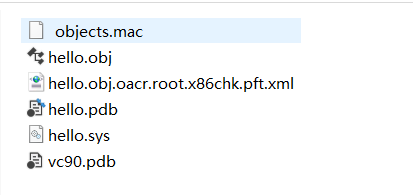

因为驱动也是操作系统的一部分,驱动崩了整个系统也崩了,可能会损坏硬件,所以不要在真机测试,在虚拟机中测试,

因为可能破坏硬件,所以写驱动代码得十分严谨

###### 测试


点安装,就会把驱动装入系统,点启动,入口代码就被执行了,点停止,卸载代码就被执行了,点击卸载,驱动就被从系统卸载,而且可以看出,运行内存地址在 高 2G (系统内存地址),内核里面的地址也是虚拟地址,但是可以操作实际地址

驱动加载工具就是调一个api    是3环的api

安装    CreateService   

启动    StartService


驱动对于操作系统来说就是一个服务


##### 高版本 VS

###### 新建项目

必须选择内核模式的空工程

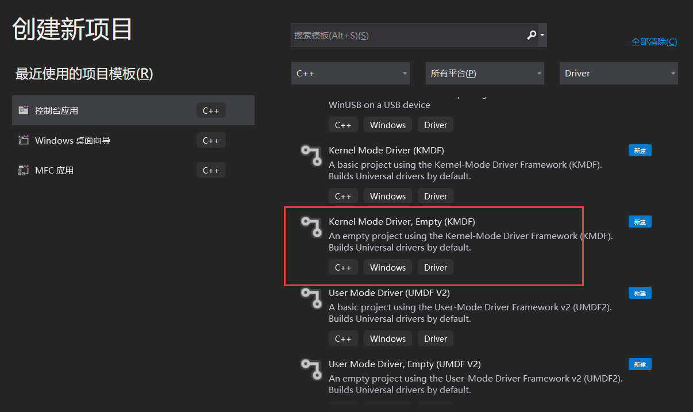

###### 编写代码

```c
#include <Ntddk.h>   //nt内核驱动    什么框架就包含什么头文件


/*驱动卸载函数*/
VOID Unload(__in struct _DRIVER_OBJECT* DriverObject)
{
  //系统提供的内核api ,打印日志
  DbgPrint("[51asm] Unload! DriverObject:%p\n", DriverObject);
}

/*驱动入口函数*/
NTSTATUS DriverEntry(
  __in struct _DRIVER_OBJECT* DriverObject,
  __in PUNICODE_STRING  RegistryPath)
{

  DriverObject->DriverUnload = Unload;

  //系统提供的内核api ,打印日志
  DbgPrint("[51asm] Hello WDK! DriverObject:%p RegistryPath:%wZ\n", DriverObject, RegistryPath);
  return STATUS_SUCCESS;
}
```

###### 编译链接

点击生成解决方案就可以了

如果生成失败,那可能是选项没配置对


此时还报错


说明  SDK版本问题,按要求安装版本

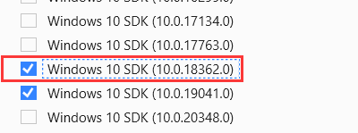

安装之后重新编译

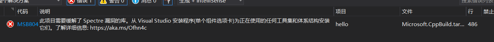

提示  Spectre 缓解库没装(修复分支预测的漏洞),可以直接禁用,也可以直接去安装库


继续生成解决方案


提示有一个签名文件有问题,目前我们没用到,可以关掉

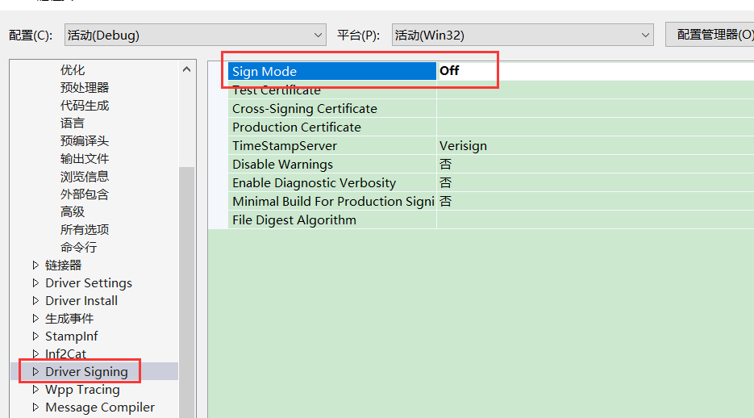

继续还是报错


删除 .inf  文件     驱动编译会产生一个inf文件,安装驱动的时候点击这个.inf 文件就行了

再重新生成解决方案就可以了


###### 测试

放到 xp  系统测试可以看到没问题了

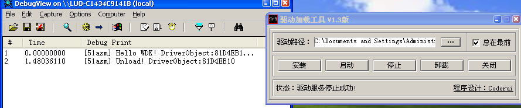

#### 注意

驱动里面不能瞎写代码

例如:

```c
#include <Ntddk.h>
//nt内核驱动

/*驱动卸载函数*/
VOID Unload(__in struct _DRIVER_OBJECT* DriverObject)
{
  DbgPrint("[51asm] Unload! DriverObject:%p\n", DriverObject);
}

/*驱动入口函数*/
NTSTATUS DriverEntry(
  __in struct _DRIVER_OBJECT* DriverObject,
  __in PUNICODE_STRING  RegistryPath)
{

 char* p = NULL;
 *p = 1;             //此时会造成 C005
    
  DriverObject->DriverUnload = Unload;

  DbgPrint("[51asm] Hello WDK! DriverObject:%p RegistryPath:%wZ\n", DriverObject, RegistryPath);

  return STATUS_SUCCESS;
}


```

3环程序 C005崩了 由系统处理, 但是系统崩了就会蓝屏重启

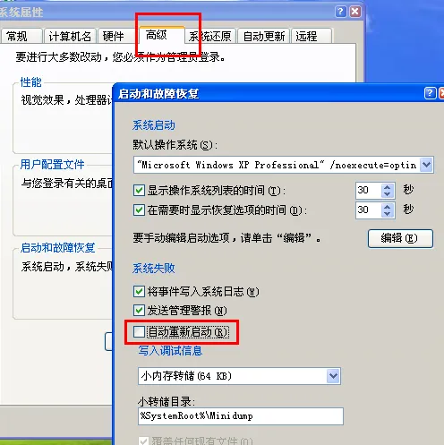

取消电脑蓝屏重启


有时候驱动会导致蓝屏而且开机启动,这样重启了还是会蓝屏,此时需要 进入安全模式(启动一直按F8) 卸载该驱动


