把昨天的程序改用 c++ 编译，改成 .cpp ，发现编译报错

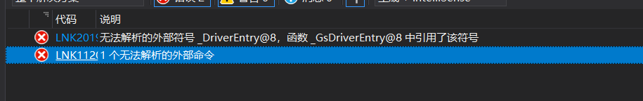

原因是名称粉碎，因此可以直接   extern “C”声明一下这个函数   或者用 头文件（推荐）

因为 在头文件中 可以把 头文件一起包含进去

```cpp
#pragma once
extern "C" {
#include <Ntddk.h>

 /*驱动入口函数*/
NTSTATUS DriverEntry(__in struct _DRIVER_OBJECT* DriverObject,
        __in PUNICODE_STRING  RegistryPath);

/*驱动卸载函数*/
VOID Unload(__in struct _DRIVER_OBJECT* DriverObject);

}
```

### api

在驱动编程里面也可以面向对象编程，可以用class ，但是有很多功能是禁止的  ，例如 try  catch  这是3环的机制，内核处理的方法不一样， malloc  ， printf ，scanf，new  等 基本的库函数 和 3环 的 api都不行  因为 内核有一套独立的内核空间，必须用微软提供的独立的内核api去申请 .操作系统会提供一套独立的 内核专用的 内核 api

Reference 里面就是所有的api

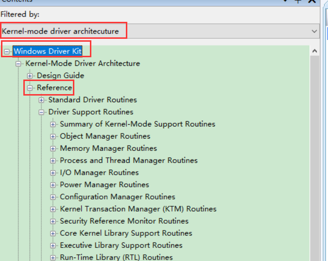

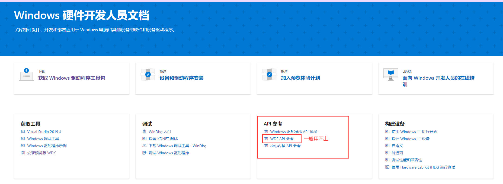


### WDM（NT）驱动框架

我们前面写的算一个一个驱动程序 （有打印功能），但不具备交互性，即不能跟驱动沟通

那么怎么让驱动具备交互性呢（跟3环程序作交互）

内核驱动一般不做界面功能，有3环程序来做，因为内核不能中出bug

因此 内核驱动开发有一个原则，驱动里面3环能解决的问题就在3环解决，驱动里面只做内核才能做的事


1.  想要跟3环做交互，那就要按操作系统的设计来做这个框架
2.  如果不需要跟3环程序交互，可能不需要 按 操作系统的设计来
3.  卸载函数必须有，不然装上了就无法卸载 （因为有些驱动可能是系统一定要用的，防止被误卸载了）如果是开机启动，重启也无法卸载，除非进安全模式


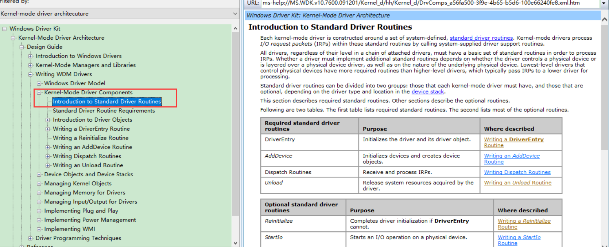

#### 步骤

1.  实现驱动入口函数 DriverEntry
2.  创建设备
3.  注册派函数
4.  注册卸载函数  Unload 


系统  =》 驱动接口  =》 硬件

因为将来的硬件我们也知道有什么，所以驱动接口必须支持现在的硬件，还要支持将来的硬件，因此驱动接口的设计就十分重要，必须抽象

驱动接口 => 抽象 =》 硬件共同的特点 => 文件

应用程序 =》 文件API => 系统 => 驱动操作接口(open read write close) Dispatch Routines =》 硬件

写驱动就是想操作系统提供    open read write close 的接口，就是文件指针，这些函数就是派遣函数

设备对象 DEVICE_OBJECT     存放   open read write close 的接口

绑定

驱动对象 DRIVER_OBJECT   虚拟出来的，当操作系统加载驱动的时候，就会创建一个驱动对象来描述加载的驱动的所有信息   DriverObject 

3环程序只需要 操作设备对象 ，设备对象自然会跟驱动对象绑定

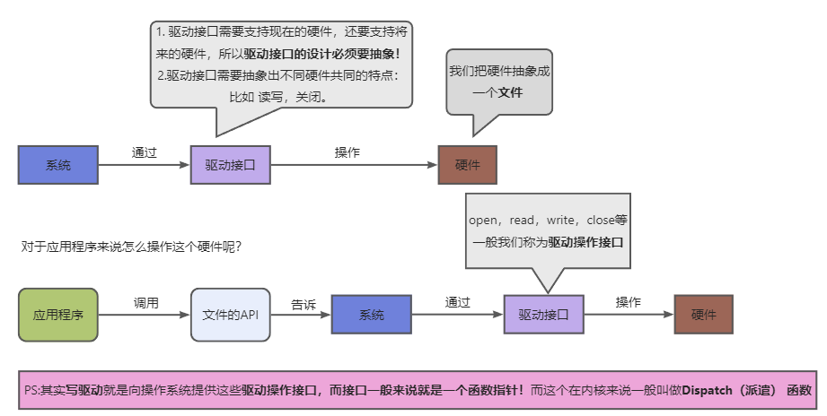

#### 实现

##### 实现驱动入口函数 DriverEntry

```c
/*驱动入口函数*/
NTSTATUS DriverEntry(
    __in struct _DRIVER_OBJECT* DriverObject,
    __in PUNICODE_STRING  RegistryPath)
{

    return STATUS_SUCCESS;
}
```

##### 添加设备

操作系统会提供内核API 实现王操作系统添加一个设备

ms-help://MS.WDK.v10.7600.091201/Kernel_r/hh/Kernel_r/k104_1e38a631-7e65-4b4b-8d51-3150a8073511.xml.htm

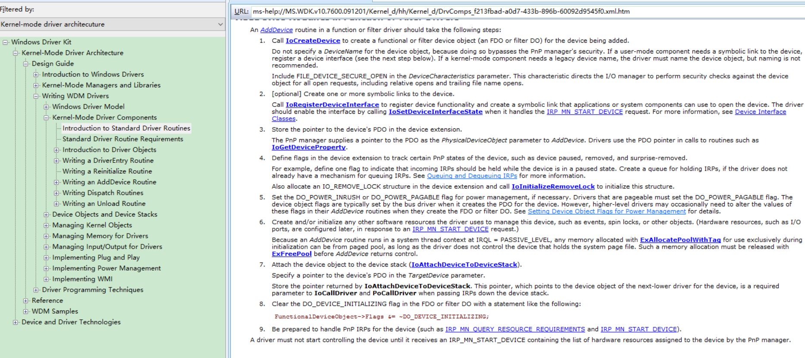

最常用的就是   IoCreateDevice

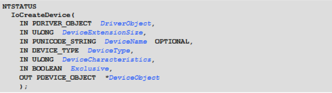

参数：  

1.  驱动对象  (一个驱动可以创建多个设备对象，他就会挂链表)
2.  设备口拓展大小  （驱动对象结构体有一个空指针成员，可以用来存放用户申请的地址，对结构体进行拓展，用来取代全局变量），一般定义一个结构体，也可以不用
3.  设备名字 （在内核中基本不用 3环的字符串格式char* 即不是'\0'结尾的字符串，而是用   UNICODE_STRING 结构体），名字有要求 前面必须要有  \Device\   。而且必须唯一，不可以与其他设备相同
4.  设备种类，不能为NULL
5.  是否独占   一般是false   true表示独占：该软件使用时，其他软件无法使用
6.  返回的设备对象


不用char* 是因容易字符串一处造成漏洞

内核中有些库函数还是可以用的  如： strlen   strcpy但不推荐，因为不是 "\0" 结尾

windows整个操作系统是由C语言 + 汇编写的，但他整个设计用的是面向对象的思想的

内核里面基本返回值统一，这样调 api 可以统一检查 ，通过宏 NT_SUCCESS 检查

驱动卸载下次在安装将创建不了，因为名称被占用了，因此需要在upload 中 删除对象设备

```c
#define DEVICE_NAME  L"\\Device\\CR42"

UNICODE_STRING ustrDevName;
  //ustrDevName.Length = 8;
  //ustrDevName.MaximumLength = 10;
  //ustrDevName.Buffer = L"CR42";
  RtlInitUnicodeString(&ustrDevName, DEVICE_NAME);  //该函数就是实现上面3 行代码

  PDEVICE_OBJECT pDevObj = NULL;
  NTSTATUS Status = IoCreateDevice(DriverObject,
                                   sizeof(MyDeviceExt), 
                                  &ustrDevName, 
                                  FILE_DEVICE_UNKNOWN,  //不知道的设备类型
                                  FILE_DEVICE_SECURE_OPEN, 
                                  FALSE, //独占
                                  &pDevObj);
  if (!NT_SUCCESS(Status)) {    //检查错误
    DbgPrint("[51asm] IoCreateDevice Status:%p\n", Status);
    return Status;     //失败返回 状态码
  }

```

##### 注册派遣函数

驱动对象最后一项是一个函数指针数组，我们驱动有什么功能就填什么功能，而且通过宏说明了每个下标分别放什么功能


一般对一内核驱动来说 必须提供 打开   关闭  控制  3个功能 

这些函数就是派遣函数，也可以称回调函数

```c
NTSTATUS DispatchCreate(
  _In_ struct _DEVICE_OBJECT* DeviceObject,
  _Inout_ struct _IRP* Irp
);

NTSTATUS DispatchClose(
  _In_ struct _DEVICE_OBJECT* DeviceObject,
  _Inout_ struct _IRP* Irp
);

NTSTATUS DispatchRead(
  _In_ struct _DEVICE_OBJECT* DeviceObject,
  _Inout_ struct _IRP* Irp
);

NTSTATUS DispatchWrite(
  _In_ struct _DEVICE_OBJECT* DeviceObject,
  _Inout_ struct _IRP* Irp
);

NTSTATUS DispatchControl(
  _In_ struct _DEVICE_OBJECT* DeviceObject,
  _Inout_ struct _IRP* Irp
);


/*
IRP  I/O Request Packet
*/
NTSTATUS DispatchCreate(_DEVICE_OBJECT* DeviceObject, _IRP* Irp)
{
  //表示参数暂时不用，不说明一下的话参数没用没报错  
  UNREFERENCED_PARAMETER(DeviceObject);
  UNREFERENCED_PARAMETER(Irp);
 
  DbgPrint("[51asm] %s\n", __FUNCTION__);
 
  return STATUS_SUCCESS;
}

NTSTATUS DispatchClose(_DEVICE_OBJECT* DeviceObject, _IRP* Irp)
{
  //表示参数暂时不用，不说明一下的话参数没用没报错  
  UNREFERENCED_PARAMETER(DeviceObject);
  UNREFERENCED_PARAMETER(Irp);
    
  DbgPrint("[51asm] %s\n", __FUNCTION__);
 
  return STATUS_SUCCESS;
}

NTSTATUS DispatchRead(_DEVICE_OBJECT* DeviceObject, _IRP* Irp)
{
  //表示参数暂时不用，不说明一下的话参数没用没报错    
  UNREFERENCED_PARAMETER(DeviceObject);
  UNREFERENCED_PARAMETER(Irp);
    
  DbgPrint("[51asm] %s\n", __FUNCTION__);
 
  return STATUS_SUCCESS;
}


NTSTATUS DispatchWrite(_DEVICE_OBJECT* DeviceObject, _IRP* Irp)
{
  //表示参数暂时不用，不说明一下的话参数没用没报错    
  UNREFERENCED_PARAMETER(DeviceObject);
  UNREFERENCED_PARAMETER(Irp);
    
  DbgPrint("[51asm] %s\n", __FUNCTION__);
 
  return STATUS_SUCCESS;
}

NTSTATUS DispatchControl(_DEVICE_OBJECT* DeviceObject, _IRP* Irp)
{
  //表示参数暂时不用，不说明一下的话参数没用没报错    
  UNREFERENCED_PARAMETER(DeviceObject);
  UNREFERENCED_PARAMETER(Irp);
    
  DbgPrint("[51asm] %s\n", __FUNCTION__);
 
  return STATUS_SUCCESS;
}


//3.注册派遣函数
DriverObject->MajorFunction[IRP_MJ_CREATE] = &DispatchCreate;     //打开
DriverObject->MajorFunction[IRP_MJ_CLOSE] = &DispatchClose;       //关闭
DriverObject->MajorFunction[IRP_MJ_READ] = &DispatchRead;         //读
DriverObject->MajorFunction[IRP_MJ_WRITE] = &DispatchWrite;       //写
DriverObject->MajorFunction[IRP_MJ_DEVICE_CONTROL] = &DispatchControl;  //控制

```

##### 注册卸载函数

```c
VOID Unload(__in struct _DRIVER_OBJECT* DriverObject)
{
  DbgPrint("[51asm] Unload! DriverObject:%p\n", DriverObject);

  //删除设备
  if (DriverObject->DeviceObject != NULL)
    IoDeleteDevice(DriverObject->DeviceObject);
}
```

##### 简单框架完成

Hello.h

```c++
#pragma once

extern "C" {

#include <Ntddk.h>

struct MyDeviceExt {
  int nVirtualReg;
};

#define DEVICE_NAME  L"\\Device\\CR42"
#define SYMBOL_NAME L"\\DosDevices\\CR42Virtual"

  /*驱动入口函数*/
NTSTATUS DriverEntry(__in struct _DRIVER_OBJECT* DriverObject,
  __in PUNICODE_STRING  RegistryPath);


VOID Unload(__in struct _DRIVER_OBJECT* DriverObject);

NTSTATUS DispatchCreate(
  _In_ struct _DEVICE_OBJECT* DeviceObject,
  _Inout_ struct _IRP* Irp
);

NTSTATUS DispatchClose(
  _In_ struct _DEVICE_OBJECT* DeviceObject,
  _Inout_ struct _IRP* Irp
);

NTSTATUS DispatchRead(
  _In_ struct _DEVICE_OBJECT* DeviceObject,
  _Inout_ struct _IRP* Irp
);

NTSTATUS DispatchWrite(
  _In_ struct _DEVICE_OBJECT* DeviceObject,
  _Inout_ struct _IRP* Irp
);

NTSTATUS DispatchControl(
  _In_ struct _DEVICE_OBJECT* DeviceObject,
  _Inout_ struct _IRP* Irp
);

}
```

Hello.cpp

```c++
#include "Hello.h"


/*驱动卸载函数 clean_up*/
VOID Unload(__in struct _DRIVER_OBJECT* DriverObject)
{
  DbgPrint("[51asm] Unload! DriverObject:%p\n", DriverObject);

  //删除设备
  if (DriverObject->DeviceObject != NULL)
    IoDeleteDevice(DriverObject->DeviceObject);
}

/*1.驱动入口函数*/
 NTSTATUS DriverEntry(
  __in struct _DRIVER_OBJECT* DriverObject,
  __in PUNICODE_STRING  RegistryPath)
{
  DbgPrint("[51asm] Hello WDK! DriverObject:%p RegistryPath:%wZ\n", 
            DriverObject, RegistryPath);

  //2.创建设备
  UNICODE_STRING ustrDevName;
  //ustrDevName.Length = 8;
  //ustrDevName.MaximumLength = 10;
  //ustrDevName.Buffer = L"CR42";
  RtlInitUnicodeString(&ustrDevName, DEVICE_NAME);

  PDEVICE_OBJECT pDevObj = NULL;
  NTSTATUS Status = IoCreateDevice(DriverObject,
                                   sizeof(MyDeviceExt), 
                                  &ustrDevName, 
                                  FILE_DEVICE_UNKNOWN,  //不知道的设备类型
                                  FILE_DEVICE_SECURE_OPEN, 
                                  FALSE, //独占
                                  &pDevObj);
  if (!NT_SUCCESS(Status)) {
    DbgPrint("[51asm] IoCreateDevice Status:%p\n", Status);
    return Status;
  }

  //3.注册派遣函数
  DriverObject->MajorFunction[IRP_MJ_CREATE] = &DispatchCreate;
  DriverObject->MajorFunction[IRP_MJ_CLOSE] = &DispatchClose;
  DriverObject->MajorFunction[IRP_MJ_READ] = &DispatchRead;
  DriverObject->MajorFunction[IRP_MJ_WRITE] = &DispatchWrite;
  DriverObject->MajorFunction[IRP_MJ_DEVICE_CONTROL] = &DispatchControl;


  //4.注册卸载函数
  DriverObject->DriverUnload = Unload;

  return STATUS_SUCCESS;
}

/*
IRP  I/O Request Packet
*/
NTSTATUS DispatchCreate(_DEVICE_OBJECT* DeviceObject, _IRP* Irp)
{
  UNREFERENCED_PARAMETER(DeviceObject);
  UNREFERENCED_PARAMETER(Irp);

  DbgPrint("[51asm] %s\n", __FUNCTION__);


  return STATUS_SUCCESS;
}

NTSTATUS DispatchClose(_DEVICE_OBJECT* DeviceObject, _IRP* Irp)
{
  UNREFERENCED_PARAMETER(DeviceObject);
  UNREFERENCED_PARAMETER(Irp);
  DbgPrint("[51asm] %s\n", __FUNCTION__);

  return STATUS_SUCCESS;
}

NTSTATUS DispatchRead(_DEVICE_OBJECT* DeviceObject, _IRP* Irp)
{
  UNREFERENCED_PARAMETER(DeviceObject);
  UNREFERENCED_PARAMETER(Irp);
  DbgPrint("[51asm] %s\n", __FUNCTION__);

  return STATUS_SUCCESS;
}


NTSTATUS DispatchWrite(_DEVICE_OBJECT* DeviceObject, _IRP* Irp)
{
  UNREFERENCED_PARAMETER(DeviceObject);
  UNREFERENCED_PARAMETER(Irp);
  DbgPrint("[51asm] %s\n", __FUNCTION__);


  return STATUS_SUCCESS;
}

NTSTATUS DispatchControl(_DEVICE_OBJECT* DeviceObject, _IRP* Irp)
{
  UNREFERENCED_PARAMETER(DeviceObject);
  UNREFERENCED_PARAMETER(Irp);
  DbgPrint("[51asm] %s\n", __FUNCTION__);


  return STATUS_SUCCESS;
}

```

当设备被打开时，就会找到  DispatchCreate 函数并进行调用   里面一般都是通过 内联汇编代码 跟硬件进行交互


 3环程序跟驱动进行通讯 

CreateFile()                ReadFile()                 WriteFile()               CloseHandle()           DeviceIoControl()

分别会对应调到上面的四个函数 

DispatchCreate()     DispatchRead()       DispatchWrite()     DispatchClose()        DispatchControl()

 实现虚拟硬件 

因为要在要xp上运行，所以编译成静态库 ，


然后再 PE中 把  MajorSubsystemVersion 项 改成 4 就可以了

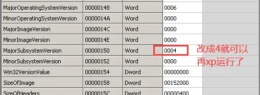

```c++
#include <stdio.h>
#include <Windows.h>
#include <stdlib.h>

struct MyDeviceExt {
    int nVirtualReg;
};

//显示错误信息  FormatMessage
void DisplayErrorText()
{
    LPVOID lpMsgBuf;
    FormatMessage(
        FORMAT_MESSAGE_ALLOCATE_BUFFER |
        FORMAT_MESSAGE_FROM_SYSTEM |
        FORMAT_MESSAGE_IGNORE_INSERTS,
        NULL,
        GetLastError(),
        MAKELANGID(LANG_NEUTRAL, SUBLANG_DEFAULT), // Default language
        (LPTSTR)&lpMsgBuf,
        0,
        NULL
    );
    printf((LPCTSTR)lpMsgBuf);
    // Free the buffer.
    LocalFree(lpMsgBuf);
}

int main()
{
    HANDLE hFile = CreateFile("\\Device\\CR42",     
        GENERIC_ALL,
        0,
        NULL,
        OPEN_EXISTING,  //驱动只能打开已存在
        FILE_ATTRIBUTE_NORMAL,
        NULL);
    if (hFile == INVALID_HANDLE_VALUE)
    {
        DisplayErrorText();
    }
    else {
        printf("hFile = %p\n", hFile);
    }

    CloseHandle(hFile);
    system("pause");
    return 0;
}
```

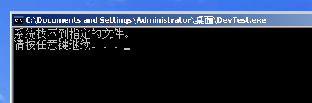

运行可以看到找不到路径 ，这是权限问题

每个设备有2个 名字，其中一个名字叫  NT Device Names  还有一个叫   MS-DOS Device Names

NT Device Names  只能在内核中打开 ，3环中无法打开

MS-DOS Device Names(符号链接) ， 如果要想设被3环访问，必须创建一个 符号链接，就相当于路径的一个别名。如果不想被3环访问，可以没有，而且 符号名和设备名也是唯一的，卸载的时候也要删除

```c
#define SYMBOL_NAME L"\\DosDevices\\CR42Virtual"

//MS-DOS Device Names  创建符号链接
UNICODE_STRING ustrSymbolName;
RtlInitUnicodeString(&ustrSymbolName, SYMBOL_NAME);

Status = IoCreateSymbolicLink(&ustrSymbolName, &ustrDevName);
if (!NT_SUCCESS(Status)) {
   DbgPrint("[51asm] IoCreateSymbolicLink Status:%p\n", Status);

if (pDevObj != NULL)
  IoDeleteDevice(pDevObj);

  return Status;
}
DbgPrint("[51asm] IoCreateSymbolicLink %wZ OK\n", &ustrSymbolName);


//删除符号链接
UNICODE_STRING ustrSymbolName;
RtlInitUnicodeString(&ustrSymbolName, SYMBOL_NAME);
IoDeleteSymbolicLink(&ustrSymbolName);

```

```c
#include <stdio.h>
#include <Windows.h>
#include <stdlib.h>

struct MyDeviceExt {
    int nVirtualReg;
};

//显示错误信息  FormatMessage
void DisplayErrorText()
{
    LPVOID lpMsgBuf;
    FormatMessage(
        FORMAT_MESSAGE_ALLOCATE_BUFFER |
        FORMAT_MESSAGE_FROM_SYSTEM |
        FORMAT_MESSAGE_IGNORE_INSERTS,
        NULL,
        GetLastError(),
        MAKELANGID(LANG_NEUTRAL, SUBLANG_DEFAULT), // Default language
        (LPTSTR)&lpMsgBuf,
        0,
        NULL
    );
    printf((LPCTSTR)lpMsgBuf);
    // Free the buffer.
    LocalFree(lpMsgBuf);
}

int main()
{
    HANDLE hFile = CreateFile("\\\\?\\CR42VirtualRegister",   // ？= DosDevices
        GENERIC_ALL,
        0,
        NULL,
        OPEN_EXISTING,  //驱动只能打开已存在
        FILE_ATTRIBUTE_NORMAL,
        NULL);
    if (hFile == INVALID_HANDLE_VALUE)
    {
        DisplayErrorText();
    }
    else {
        printf("hFile = %p\n", hFile);
    }


    CloseHandle(hFile);

    system("pause");
    return 0;
}
```

##### 测试


这样3环程序可以指挥驱动程序干活了

##### 完善

调用四个函数

```c
#include <stdio.h>
#include <Windows.h>
#include <stdlib.h>

struct MyDeviceExt {
    int nVirtualReg;
};

void DisplayErrorText()
{
    LPVOID lpMsgBuf;
    FormatMessage(
        FORMAT_MESSAGE_ALLOCATE_BUFFER |
        FORMAT_MESSAGE_FROM_SYSTEM |
        FORMAT_MESSAGE_IGNORE_INSERTS,
        NULL,
        GetLastError(),
        MAKELANGID(LANG_NEUTRAL, SUBLANG_DEFAULT), // Default language
        (LPTSTR)&lpMsgBuf,
        0,
        NULL
    );

    printf((LPCTSTR)lpMsgBuf);
    LocalFree(lpMsgBuf);
}

int main()
{
    HANDLE hFile = CreateFile("\\\\?\\CR42Virtual",
        GENERIC_ALL,
        0,
        NULL,
        OPEN_EXISTING,
        FILE_ATTRIBUTE_NORMAL,
        NULL);
    if (hFile == INVALID_HANDLE_VALUE)
    {
        DisplayErrorText();
    }
    else {
        printf("hFile = %p\n", hFile);
    }


    char szBuf[100] = {0};
    DWORD dwBytes = 0;
    ReadFile(hFile, szBuf, sizeof(szBuf), &dwBytes, NULL);
    printf("ReadFile dwBytes = %d  szBuf:%s\n", dwBytes, szBuf);


    WriteFile(hFile, szBuf, sizeof(szBuf), &dwBytes, NULL);
    printf("WriteFile dwBytes = %d szBuf:%s\n", dwBytes, szBuf);

     //控制
    //DeviceIoControl(hFile, 100, szBuf, sizeof(szBuf), szBuf, sizeof(szBuf), &dwBytes, NULL);
    
    CloseHandle(hFile);

    system("pause");
    return 0;
}
```

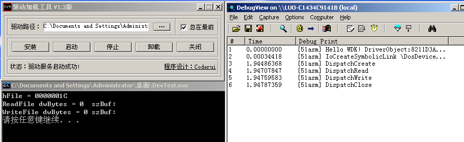

#### 实现驱动模拟寄存器

##### 驱动程序

用一个变量来当作寄存器保存值 ，如果要读寄存器的值，把返变量的值 ，如果要写寄存器的值，就修改变量的值

实现的难点就是参数的传递  ， 内核如何收到3环的数据 

3环如果调用WriteFile函数 和 ReadFile 函数时 ，就会把对应的信息打包成一个 Irp  结构体传递给 内核

IRP    I/O  Request Packet    读写请求包

我们必须完成这个请求，如果不完成请求，函数可能会卡死在那

例如网卡驱动。假如有人发起读请求，读取从别的电脑发送过来的网络数据，这时候给不了，因为没数据发过来，那这个时候要把请求挂起来，也要把线程挂起来，直到收到数据包为止

```c
#pragma once

extern "C" {

#include <Ntddk.h>

    struct MyDeviceExt {
        int nVirtualReg;   //用来当作寄存器的值
    };

#define DEVICE_NAME  L"\\Device\\CR42"
#define SYMBOL_NAME L"\\DosDevices\\CR42VirtualRegister"

    /*驱动入口函数*/
    NTSTATUS DriverEntry(__in struct _DRIVER_OBJECT* DriverObject,
        __in PUNICODE_STRING  RegistryPath);


    VOID Unload(__in struct _DRIVER_OBJECT* DriverObject);

    NTSTATUS DispatchCreate(
        _In_ struct _DEVICE_OBJECT* DeviceObject,
        _Inout_ struct _IRP* Irp
    );

    NTSTATUS DispatchClose(
        _In_ struct _DEVICE_OBJECT* DeviceObject,
        _Inout_ struct _IRP* Irp
    );

    NTSTATUS DispatchRead(
        _In_ struct _DEVICE_OBJECT* DeviceObject,
        _Inout_ struct _IRP* Irp
    );

    NTSTATUS DispatchWrite(
        _In_ struct _DEVICE_OBJECT* DeviceObject,
        _Inout_ struct _IRP* Irp
    );

    NTSTATUS DispatchControl(
        _In_ struct _DEVICE_OBJECT* DeviceObject,
        _Inout_ struct _IRP* Irp
    );

}
```

```c
#include "Hello.h"


/*驱动卸载函数 clean_up*/
VOID Unload(__in struct _DRIVER_OBJECT* DriverObject)
{
    DbgPrint("[51asm] Unload! DriverObject:%p\n", DriverObject);

    //删除符号链接
    UNICODE_STRING ustrSymbolName;
    RtlInitUnicodeString(&ustrSymbolName, SYMBOL_NAME);
    IoDeleteSymbolicLink(&ustrSymbolName);

    //删除设备
    if (DriverObject->DeviceObject != NULL)
        IoDeleteDevice(DriverObject->DeviceObject);
}

/*1.驱动入口函数*/
NTSTATUS DriverEntry(
    __in struct _DRIVER_OBJECT* DriverObject,
    __in PUNICODE_STRING  RegistryPath)
{
    DbgPrint("[51asm] Hello WDK! DriverObject:%p RegistryPath:%wZ\n",
        DriverObject, RegistryPath);

    //2.创建设备
    UNICODE_STRING ustrDevName;
    //ustrDevName.Length = 8;
    //ustrDevName.MaximumLength = 10;
    //ustrDevName.Buffer = L"CR42";
    RtlInitUnicodeString(&ustrDevName, DEVICE_NAME);  //等于上面的3行代码


    PDEVICE_OBJECT pDevObj = NULL;
    NTSTATUS Status = IoCreateDevice(DriverObject,
        sizeof(MyDeviceExt),
        &ustrDevName,
        FILE_DEVICE_UNKNOWN,  //不知道的设备类型
        FILE_DEVICE_SECURE_OPEN,
        FALSE, //独占
        &pDevObj);
    if (!NT_SUCCESS(Status)) {
        DbgPrint("[51asm] IoCreateDevice Status:%p\n", Status);
        return Status;
    }

    //初始化寄存器变量
    RtlZeroMemory(pDevObj->DeviceExtension, sizeof(MyDeviceExt));
    MyDeviceExt* pDevExt = (MyDeviceExt*)pDevObj->DeviceExtension;
    pDevExt->nVirtualReg = 0;

    //MS-DOS Device Names  创建符号链接
    UNICODE_STRING ustrSymbolName;
    RtlInitUnicodeString(&ustrSymbolName, SYMBOL_NAME);
    Status = IoCreateSymbolicLink(&ustrSymbolName, &ustrDevName);
    if (!NT_SUCCESS(Status)) {
        DbgPrint("[51asm] IoCreateSymbolicLink Status:%p\n", Status);

        if (pDevObj != NULL)
            IoDeleteDevice(pDevObj);

        return Status;
    }
    DbgPrint("[51asm] IoCreateSymbolicLink %wZ OK\n", &ustrSymbolName);


    //3.注册派遣函数
    DriverObject->MajorFunction[IRP_MJ_CREATE] = &DispatchCreate;
    DriverObject->MajorFunction[IRP_MJ_CLOSE] = &DispatchClose;
    DriverObject->MajorFunction[IRP_MJ_READ] = &DispatchRead;
    DriverObject->MajorFunction[IRP_MJ_WRITE] = &DispatchWrite;
    DriverObject->MajorFunction[IRP_MJ_DEVICE_CONTROL] = &DispatchControl;


    //4.注册卸载函数
    DriverObject->DriverUnload = Unload;

    return STATUS_SUCCESS;
}


NTSTATUS DispatchCreate(_DEVICE_OBJECT* DeviceObject, _IRP* Irp)
{
    UNREFERENCED_PARAMETER(DeviceObject);
    UNREFERENCED_PARAMETER(Irp);
    DbgPrint("[51asm] %s\n", __FUNCTION__);

    //完成请求  如果没完成 3环的程序就会挂起
    Irp->IoStatus.Status = STATUS_SUCCESS;   //状态，成功 
    Irp->IoStatus.Information = 0; //成功操作的字节数,非读写一般是0 就算是读写文件 dwBytes的返回值

    //第二个参数线程的优先级，内核一般时 IO_NO_INCREMENT 不提升优先级
    IoCompleteRequest(Irp, IO_NO_INCREMENT);  

    return STATUS_SUCCESS;
}

NTSTATUS DispatchClose(_DEVICE_OBJECT* DeviceObject, _IRP* Irp)
{
    UNREFERENCED_PARAMETER(DeviceObject);
    UNREFERENCED_PARAMETER(Irp);
    DbgPrint("[51asm] %s\n", __FUNCTION__);


    //完成请求  如果没完成 3环的程序就会挂起
    Irp->IoStatus.Status = STATUS_SUCCESS;   //状态，成功 
    Irp->IoStatus.Information = 0; //成功操作的字节数,非读写一般是0 就算是读写文件 dwBytes的返回值

    //第二个参数线程的优先级，内核一般时 IO_NO_INCREMENT 不提升优先级
    IoCompleteRequest(Irp, IO_NO_INCREMENT);

    return STATUS_SUCCESS;
}

NTSTATUS DispatchRead(_DEVICE_OBJECT* DeviceObject, _IRP* Irp)
{
    UNREFERENCED_PARAMETER(DeviceObject);
    UNREFERENCED_PARAMETER(Irp);
    DbgPrint("[51asm] %s\n", __FUNCTION__);

   

    //获取用户的缓冲区
    PVOID pBuffer = Irp->UserBuffer;   //就是用户参数的 缓冲地址

     //获取当前IRP堆栈
    PIO_STACK_LOCATION pIrpStack = IoGetCurrentIrpStackLocation(Irp);
    ULONG nLength = pIrpStack->Parameters.Read.Length;    //就是用户参数的 缓冲大小  read表示读操作
    DbgPrint("[51asm] %s pBuffer:%p nLength:%d\n", __FUNCTION__, pBuffer, nLength);


    MyDeviceExt* pDevExt = (MyDeviceExt*)DeviceObject->DeviceExtension;
    if (nLength > sizeof(pDevExt->nVirtualReg)) {  //检查缓冲区大小，防溢出
        nLength = sizeof(pDevExt->nVirtualReg);
    }
        
    //拷贝信息  就等于  memcoy
    RtlCopyMemory(pBuffer, &pDevExt->nVirtualReg, nLength);  //把寄存器数据数据传入用缓冲区


    //完成请求  如果没完成 3环的程序就会挂起
    Irp->IoStatus.Status = STATUS_SUCCESS;   //状态，成功 
    Irp->IoStatus.Information = nLength; //成功操作的字节数,非读写一般是0 就算是读写文件 dwBytes的返回值

    //第二个参数线程的优先级，内核一般时 IO_NO_INCREMENT 不提升优先级
    IoCompleteRequest(Irp, IO_NO_INCREMENT);

    return STATUS_SUCCESS;
}


NTSTATUS DispatchWrite(_DEVICE_OBJECT* DeviceObject, _IRP* Irp)
{
    UNREFERENCED_PARAMETER(DeviceObject);
    UNREFERENCED_PARAMETER(Irp);
    DbgPrint("[51asm] %s\n", __FUNCTION__);

     //获取用户的缓冲区
    PVOID pBuffer = Irp->UserBuffer;   //就是用户参数的 缓冲地址

    //获取当前IRP堆栈
    PIO_STACK_LOCATION pIrpStack = IoGetCurrentIrpStackLocation(Irp);
    ULONG nLength = pIrpStack->Parameters.Write.Length;    //就是用户参数的 缓冲大小  Write表示写操作
    
    DbgPrint("[51asm] %s pBuffer:%p nLength:%d\n", __FUNCTION__, pBuffer, nLength);


    MyDeviceExt* pDevExt = (MyDeviceExt*)DeviceObject->DeviceExtension;
    if (nLength > sizeof(pDevExt->nVirtualReg)) {     //检查缓冲区大小，防溢出
        nLength = sizeof(pDevExt->nVirtualReg);  
    }
       
    RtlCopyMemory(&pDevExt->nVirtualReg, pBuffer, nLength);  //将用户数据拷贝进内核的缓冲区


    //完成请求  如果没完成 3环的程序就会挂起
    Irp->IoStatus.Status = STATUS_SUCCESS;   //状态，成功 
    Irp->IoStatus.Information = nLength; //成功操作的字节数,非读写一般是0 就算是读写文件 dwBytes的返回值

    //第二个参数线程的优先级，内核一般时 IO_NO_INCREMENT 不提升优先级
    IoCompleteRequest(Irp, IO_NO_INCREMENT);

    return STATUS_SUCCESS;
}

NTSTATUS DispatchControl(_DEVICE_OBJECT* DeviceObject, _IRP* Irp)
{
    UNREFERENCED_PARAMETER(DeviceObject);
    UNREFERENCED_PARAMETER(Irp);
    DbgPrint("[51asm] %s\n", __FUNCTION__);

    //完成请求  如果没完成 3环的程序就会挂起
    Irp->IoStatus.Status = STATUS_SUCCESS;   //状态，成功 
    Irp->IoStatus.Information = 0; //成功操作的字节数,非读写一般是0 就算是读写文件 dwBytes的返回值

    //第二个参数线程的优先级，内核一般时 IO_NO_INCREMENT 不提升优先级
    IoCompleteRequest(Irp, IO_NO_INCREMENT);

    return STATUS_SUCCESS;
}

```

##### 测试程序

```c
#include <stdio.h>
#include <Windows.h>
#include <stdlib.h>

struct MyDeviceExt {
    int nVirtualReg;
};

void DisplayErrorText()
{
    LPVOID lpMsgBuf;
    FormatMessage(
        FORMAT_MESSAGE_ALLOCATE_BUFFER |
        FORMAT_MESSAGE_FROM_SYSTEM |
        FORMAT_MESSAGE_IGNORE_INSERTS,
        NULL,
        GetLastError(),
        MAKELANGID(LANG_NEUTRAL, SUBLANG_DEFAULT), // Default language
        (LPTSTR)&lpMsgBuf,
        0,
        NULL
    );

    printf((LPCTSTR)lpMsgBuf);
    LocalFree(lpMsgBuf);
}

int main()
{
    HANDLE hFile = CreateFile("\\\\?\\CR42VirtualRegister",
        GENERIC_ALL,
        0,
        NULL,
        OPEN_EXISTING,
        FILE_ATTRIBUTE_NORMAL,
        NULL);
    if (hFile == INVALID_HANDLE_VALUE)
    {
        DisplayErrorText();
    }
    else {
        printf("hFile = %p\n", hFile);
    }


    MyDeviceExt DevExt = { 0 };
    DWORD dwBytes = 0;
    DevExt.nVirtualReg = 100;
    if (!WriteFile(hFile, &DevExt, 100, &dwBytes, NULL))  //往寄存器里面写值
    {
        DisplayErrorText();
    }
    else
    {
        printf("WriteFile dwBytes = %d  VirtualReg:%d\n", dwBytes, DevExt.nVirtualReg);
    }

    DevExt.nVirtualReg = -1;
    if (!ReadFile(hFile, &DevExt, sizeof(DevExt), &dwBytes, NULL))  //从寄存器里面读值
    {
        DisplayErrorText();
    }
    else
    {
        printf("ReadFile dwBytes = %d  VirtualReg:%d\n", dwBytes, DevExt.nVirtualReg);
    }

    //控制
    //DeviceIoControl(hFile, 100, szBuf, sizeof(szBuf), szBuf, sizeof(szBuf), &dwBytes, NULL);

    CloseHandle(hFile);

    system("pause");
    return 0;
}
```

##### 测试

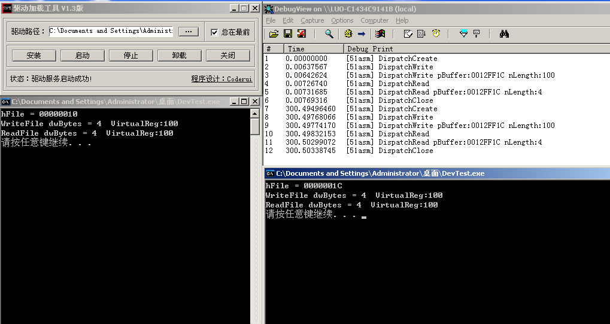

因为不是独占，所以多个函数可以同时调用，注意，多函数同时访问存在同步问题

##### 漏洞

例如：


```c++
    MyDeviceExt DevExt = { 0 };
    DWORD dwBytes = 0;
    DevExt.nVirtualReg = 100;
    if (!WriteFile(hFile, &DevExt, 10000, &dwBytes, NULL))  //往寄存器里面写值
    {
        DisplayErrorText();
    }
    else
    {
        printf("WriteFile dwBytes = %d  VirtualReg:%d\n", dwBytes, DevExt.nVirtualReg);
    }
```

```c
NTSTATUS DispatchWrite(_DEVICE_OBJECT* DeviceObject, _IRP* Irp)
{
    UNREFERENCED_PARAMETER(DeviceObject);
    UNREFERENCED_PARAMETER(Irp);
    DbgPrint("[51asm] %s\n", __FUNCTION__);

    //获取用户的缓冲区
    PVOID pBuffer = Irp->UserBuffer;   //就是用户参数的 缓冲地址

    //获取当前IRP堆栈
    PIO_STACK_LOCATION pIrpStack = IoGetCurrentIrpStackLocation(Irp);
    ULONG nLength = pIrpStack->Parameters.Write.Length;    //就是用户参数的 缓冲大小  Write表示写操作
    
    DbgPrint("[51asm] %s pBuffer:%p nLength:%d\n", __FUNCTION__, pBuffer, nLength);

    MyDeviceExt* pDevExt = (MyDeviceExt*)DeviceObject->DeviceExtension;
       
    RtlCopyMemory(&pDevExt->nVirtualReg, pBuffer, nLength);  //将用户数据拷贝进内核的缓冲区

    //完成请求  如果没完成 3环的程序就会挂起
    Irp->IoStatus.Status = STATUS_SUCCESS;   //状态，成功 
    Irp->IoStatus.Information = nLength; //成功操作的字节数,非读写一般是0 就算是读写文件 dwBytes的返回值

    //第二个参数线程的优先级，内核一般时 IO_NO_INCREMENT 不提升优先级
    IoCompleteRequest(Irp, IO_NO_INCREMENT);

    return STATUS_SUCCESS;
}
```

上面的代码会导致系统蓝屏  因为上面 3成程序 给驱动的缓冲区只有4字节 ，但是大小却指定了 10000，由于没有长度检查 ，这样 驱动去访问那 10000 个字节  就会 c005   ，

RtlCopyMemory(&pDevExt->nVirtualReg, pBuffer, nLength);    中  nLength 大小由3环程序控制


由于是往内核写数据，因为长度出错，导致代码溢出了，因此需要对长度检查

### WinObj

可以找遍历电脑上已经安装的所有设备

https://docs.microsoft.com/zh-cn/sysinternals/downloads/winobj