### 控制

昨天我已经实现了  打开，关闭 ，读写功能，或许会有疑问，已经有了读写功能，为什么还要控制功能呢，那是因为读写传递的参数较少，有时候并不能满足需要，例如当设备或者功能较多时，我们无法知道应该操作哪个设备或者哪个功能 

 

例如昨天的代码 ,我们再结构体里面再添加2个成员,那个我们进行读写时,无法确定操作哪个成员,因为缺少参数

struct MyDeviceExt {

  int nVirtualReg;

  int nVirtualReg2;

  int nVirtualReg3;

};


//读操作

   DevExt.nVirtualReg = -1;

​    if (!ReadFile(hFile, &DevExt, sizeof(DevExt), &dwBytes, NULL))  //从寄存器里面读值

​    {

​        DisplayErrorText();

​    }

​    else

​    {

​        printf("ReadFile dwBytes = %d  VirtualReg:%d\n", dwBytes, DevExt.nVirtualReg);

​    }


如果我们把 DevExt 当做序号传递,可以解决无法知道访问哪个成员的问题,但是如果进程访问,例如A进程写

B进程读 就会出问题


因此我们希望   ReadFile 能够多传一个参数,这样问题就简单了,但是如果结构体是数组没那么一个参数将不够用,因此五门无法确定要用到定义的参数个数


解决办法 是 我们可以传一个 int cod ,  void*   buff , int len  ,void*可以转换成任何结构体指针,code 表示要进行的操作,这个就叫做控制


控制和读写没什么特别大的区别,就多了3个参数

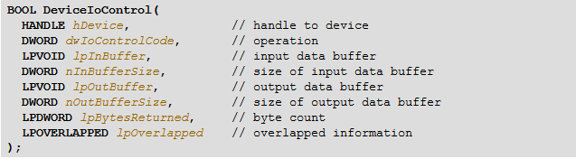

跟读写相比 就多了 第 2,3,4个参数, 操作码    缓冲区   缓冲区大小

#### 完成控制功能

##### 定义控制码

控制码是有规范的

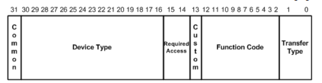

一共32位   0-1 是类型 2 - 12才是真正的控制吗  14-15 是设备访问权限 16-30 是设备类型

可以看到定义控制码很麻烦,因此微软给出了一个宏来辅助用户定义

\#define IOCTL_*Device*_*Function* CTL_CODE(***DeviceType\*****,** ***Function\*****,** ***Method\*****,** ***Access\***)

我么只需要把四个成员填进去就行了

1.  设备类型
2.  控制码 (不能低于800,前面的被微软用了)
3.  通讯方式    METHOD_BUFFERED
4.  访问权限 (读 或 写 或 打开.....)

一般我们自己会在定义一个红包裹这个宏

  这样我们就可以定义宏了

```c
#define IOCTL_GET_REG1 CTL_CODE(FILE_DEVICE_UNKNOWN, 0x800, METHOD_BUFFERED, FILE_ANY_ACCESS)

#define IOCTL_GET_REG2 CTL_CODE(FILE_DEVICE_UNKNOWN, 0x800, METHOD_BUFFERED, FILE_ANY_ACCESS)
```

但是定义吗我么后面可能会越来越多,后面如果改起来就很麻烦,例如 要修改设备类型,所以一般我们会再套一个宏

```c
//定义控制码
#define MY_CODE_BASE 0x800
#define MY_CTL_CODE(code) CTL_CODE(FILE_DEVICE_UNKNOWN, MY_CODE_BASE + code, METHOD_BUFFERED, FILE_ANY_ACCESS)
#define IOCTL_GET_REG1 MY_CTL_CODE(0)
#define IOCTL_GET_REG2 MY_CTL_CODE(1)
#define IOCTL_GET_REG3 MY_CTL_CODE(2)
#define IOCTL_SET_REG1 MY_CTL_CODE(3)
#define IOCTL_SET_REG2 MY_CTL_CODE(4)
#define IOCTL_SET_REG3 MY_CTL_CODE(5)

这样如果要改信息只需要修改 宏 MY_CTL_CODE  就可以了 
```

##### 实现控制函数 

驱动代码

```c++
--------------Hello.h-----------------
#pragma once

extern "C" {

#include <Ntddk.h>

    struct MyDeviceExt {
        int nVirtualReg;
        int nVirtualReg2;
        int nVirtualReg3;
    };


    #define DEVICE_NAME  L"\\Device\\CR42"
    #define SYMBOL_NAME L"\\DosDevices\\CR42VirtualRegister"

        //定义控制码
    #define MY_CODE_BASE 0x800
    #define MY_CTL_CODE(code) CTL_CODE(FILE_DEVICE_UNKNOWN, MY_CODE_BASE + code, METHOD_BUFFERED, FILE_ANY_ACCESS)
    #define IOCTL_GET_REG1 MY_CTL_CODE(0)
    #define IOCTL_GET_REG2 MY_CTL_CODE(1)
    #define IOCTL_GET_REG3 MY_CTL_CODE(2)
    #define IOCTL_SET_REG1 MY_CTL_CODE(3)
    #define IOCTL_SET_REG2 MY_CTL_CODE(4)
    #define IOCTL_SET_REG3 MY_CTL_CODE(5)


    /*驱动入口函数*/
    NTSTATUS DriverEntry(__in struct _DRIVER_OBJECT* DriverObject,
        __in PUNICODE_STRING  RegistryPath);


    VOID Unload(__in struct _DRIVER_OBJECT* DriverObject);

    NTSTATUS DispatchCreate(
        _In_ struct _DEVICE_OBJECT* DeviceObject,
        _Inout_ struct _IRP* Irp
    );

    NTSTATUS DispatchClose(
        _In_ struct _DEVICE_OBJECT* DeviceObject,
        _Inout_ struct _IRP* Irp
    );

    NTSTATUS DispatchRead(
        _In_ struct _DEVICE_OBJECT* DeviceObject,
        _Inout_ struct _IRP* Irp
    );

    NTSTATUS DispatchWrite(
        _In_ struct _DEVICE_OBJECT* DeviceObject,
        _Inout_ struct _IRP* Irp
    );

    NTSTATUS DispatchControl(
        _In_ struct _DEVICE_OBJECT* DeviceObject,
        _Inout_ struct _IRP* Irp
    );

}


--------------Hello.cpp-----------------
#include "Hello.h"


MyDeviceExt g_Registers;


/*驱动卸载函数 clean_up*/
VOID Unload(__in struct _DRIVER_OBJECT* DriverObject)
{
    DbgPrint("[51asm] Unload! DriverObject:%p\n", DriverObject);

    //删除符号链接
    UNICODE_STRING ustrSymbolName;
    RtlInitUnicodeString(&ustrSymbolName, SYMBOL_NAME);
    IoDeleteSymbolicLink(&ustrSymbolName);

    //删除设备
    if (DriverObject->DeviceObject != NULL)
        IoDeleteDevice(DriverObject->DeviceObject);
}

/*1.驱动入口函数*/
NTSTATUS DriverEntry(
    __in struct _DRIVER_OBJECT* DriverObject,
    __in PUNICODE_STRING  RegistryPath)
{
    DbgPrint("[51asm] Hello WDK! DriverObject:%p RegistryPath:%wZ\n",
        DriverObject, RegistryPath);

    //2.创建设备
    UNICODE_STRING ustrDevName;
    RtlInitUnicodeString(&ustrDevName, DEVICE_NAME);  //等于上面的3行代码


    PDEVICE_OBJECT pDevObj = NULL;
    NTSTATUS Status = IoCreateDevice(DriverObject,
        0,
        &ustrDevName,
        FILE_DEVICE_UNKNOWN,  //不知道的设备类型
        FILE_DEVICE_SECURE_OPEN,
        FALSE, //独占
        &pDevObj);
    if (!NT_SUCCESS(Status)) {
        DbgPrint("[51asm] IoCreateDevice Status:%p\n", Status);
        return Status;
    }


    //MS-DOS Device Names  创建符号链接
    UNICODE_STRING ustrSymbolName;
    RtlInitUnicodeString(&ustrSymbolName, SYMBOL_NAME);
    Status = IoCreateSymbolicLink(&ustrSymbolName, &ustrDevName);
    if (!NT_SUCCESS(Status)) {
        DbgPrint("[51asm] IoCreateSymbolicLink Status:%p\n", Status);

        if (pDevObj != NULL)
            IoDeleteDevice(pDevObj);

        return Status;
    }
    DbgPrint("[51asm] IoCreateSymbolicLink %wZ OK\n", &ustrSymbolName);

    //3.注册派遣函数
    DriverObject->MajorFunction[IRP_MJ_CREATE] = &DispatchCreate;
    DriverObject->MajorFunction[IRP_MJ_CLOSE] = &DispatchClose;
    DriverObject->MajorFunction[IRP_MJ_READ] = &DispatchRead;
    DriverObject->MajorFunction[IRP_MJ_WRITE] = &DispatchWrite;
    DriverObject->MajorFunction[IRP_MJ_DEVICE_CONTROL] = &DispatchControl;


    //4.注册卸载函数
    DriverObject->DriverUnload = Unload;

    return STATUS_SUCCESS;
}


NTSTATUS DispatchCreate(_DEVICE_OBJECT* DeviceObject, _IRP* Irp)
{
    UNREFERENCED_PARAMETER(DeviceObject);
    UNREFERENCED_PARAMETER(Irp);
    DbgPrint("[51asm] %s\n", __FUNCTION__);

    //完成请求  如果没完成 3环的程序就会挂起
    Irp->IoStatus.Status = STATUS_SUCCESS;   //状态，成功 
    Irp->IoStatus.Information = 0; //成功操作的字节数,非读写一般是0 就算是读写文件 dwBytes的返回值

    //第二个参数线程的优先级，内核一般时 IO_NO_INCREMENT 不提升优先级
    IoCompleteRequest(Irp, IO_NO_INCREMENT);  

    return STATUS_SUCCESS;
}

NTSTATUS DispatchClose(_DEVICE_OBJECT* DeviceObject, _IRP* Irp)
{
    UNREFERENCED_PARAMETER(DeviceObject);
    UNREFERENCED_PARAMETER(Irp);
    DbgPrint("[51asm] %s\n", __FUNCTION__);


    //完成请求  如果没完成 3环的程序就会挂起
    Irp->IoStatus.Status = STATUS_SUCCESS;   //状态，成功 
    Irp->IoStatus.Information = 0; //成功操作的字节数,非读写一般是0 就算是读写文件 dwBytes的返回值

    //第二个参数线程的优先级，内核一般时 IO_NO_INCREMENT 不提升优先级
    IoCompleteRequest(Irp, IO_NO_INCREMENT);

    return STATUS_SUCCESS;
}

NTSTATUS DispatchRead(_DEVICE_OBJECT* DeviceObject, _IRP* Irp)
{
    UNREFERENCED_PARAMETER(DeviceObject);
    UNREFERENCED_PARAMETER(Irp);
    DbgPrint("[51asm] %s\n", __FUNCTION__);

    //获取用户的缓冲区
    PVOID pBuffer = Irp->UserBuffer;   //就是用户参数的 缓冲地址

     //获取当前IRP堆栈
    PIO_STACK_LOCATION pIrpStack = IoGetCurrentIrpStackLocation(Irp);
    ULONG nLength = pIrpStack->Parameters.Read.Length;    //就是用户参数的 缓冲大小  read表示读操作
    DbgPrint("[51asm] %s pBuffer:%p nLength:%d\n", __FUNCTION__, pBuffer, nLength);

 
    if (nLength > sizeof(g_Registers.nVirtualReg)) {  //判断用户缓冲区大小是否足够
        nLength = sizeof(g_Registers.nVirtualReg);
    }
        
    //拷贝信息  就等于  memcoy
    RtlCopyMemory(pBuffer,&g_Registers.nVirtualReg, nLength);  //把寄存器数据数据传入用缓冲区

    //完成请求  如果没完成 3环的程序就会挂起
    Irp->IoStatus.Status = STATUS_SUCCESS;   //状态，成功 
    Irp->IoStatus.Information = nLength; //成功操作的字节数,非读写一般是0 就算是读写文件 dwBytes的返回值

    //第二个参数线程的优先级，内核一般时 IO_NO_INCREMENT 不提升优先级
    IoCompleteRequest(Irp, IO_NO_INCREMENT);

    return STATUS_SUCCESS;
}


NTSTATUS DispatchWrite(_DEVICE_OBJECT* DeviceObject, _IRP* Irp)
{
    UNREFERENCED_PARAMETER(DeviceObject);
    UNREFERENCED_PARAMETER(Irp);
    DbgPrint("[51asm] %s\n", __FUNCTION__);

    //获取用户的缓冲区
    PVOID pBuffer = Irp->UserBuffer;   //就是用户参数的 缓冲地址

    //获取当前IRP堆栈
    PIO_STACK_LOCATION pIrpStack = IoGetCurrentIrpStackLocation(Irp);
    ULONG nLength = pIrpStack->Parameters.Write.Length;    //就是用户参数的 缓冲大小  Write表示写操作
    
    DbgPrint("[51asm] %s pBuffer:%p nLength:%d\n", __FUNCTION__, pBuffer, nLength);

    if (nLength > sizeof(g_Registers.nVirtualReg)) {
        nLength = sizeof(g_Registers.nVirtualReg);
    }
       
    RtlCopyMemory(&g_Registers.nVirtualReg, pBuffer, nLength);  //将用户数据拷贝进内核的缓冲区


    //完成请求  如果没完成 3环的程序就会挂起
    Irp->IoStatus.Status = STATUS_SUCCESS;   //状态，成功 
    Irp->IoStatus.Information = nLength; //成功操作的字节数,非读写一般是0 就算是读写文件 dwBytes的返回值

    //第二个参数线程的优先级，内核一般时 IO_NO_INCREMENT 不提升优先级
    IoCompleteRequest(Irp, IO_NO_INCREMENT);

    return STATUS_SUCCESS;
}

NTSTATUS DispatchControl(_DEVICE_OBJECT* DeviceObject, _IRP* Irp)
{
    UNREFERENCED_PARAMETER(DeviceObject);
    UNREFERENCED_PARAMETER(Irp);
    DbgPrint("[51asm] %s\n", __FUNCTION__);


    //获取当前IRP堆栈
    PIO_STACK_LOCATION pIrpStack = IoGetCurrentIrpStackLocation(Irp);

    //获取用户的缓冲区
    PVOID pOutBuffer = Irp->UserBuffer;  //获取用户输出缓冲区
    ULONG nOutLength = pIrpStack->Parameters.DeviceIoControl.OutputBufferLength;   //获取用户输出缓冲区大小

    PVOID pInputBuffer = pIrpStack->Parameters.DeviceIoControl.Type3InputBuffer;  //获取用户输入缓冲区
    ULONG nInputLength = pIrpStack->Parameters.DeviceIoControl.InputBufferLength;  //获取用户输入缓冲区大小

    ULONG nIoControlCode = pIrpStack->Parameters.DeviceIoControl.IoControlCode;    //获取操作码

    //DbgPrint("[51asm] %s nIoControlCode:%p pInputBuffer:%p nInputLength:%d pOutBuffer:%p nOutLength:%d\n", __FUNCTION__,  nIoControlCode, pBuffer, nLength);

    DbgPrint("[51asm] %s nIoControlCode:%p pInputBuffer:%p nInputLength:%d pOutBuffer:%p nOutLength:%d\n"
        , __FUNCTION__, nIoControlCode, pOutBuffer, nOutLength, pInputBuffer, nInputLength);


    ULONG nSize = 0;
    if (nOutLength!=4)
    {
        nOutLength = 4;
    }
    if (nInputLength != 4)
    {
        nInputLength = 4;
    }

    KeEnterCriticalRegion();
    switch (nIoControlCode) {
    case IOCTL_GET_REG1:
        RtlCopyMemory(pOutBuffer, &g_Registers.nVirtualReg, nOutLength);
        nSize = nOutLength;

        DbgPrint("[51asm] %s IOCTL_GET_REG1 value:%d\n", __FUNCTION__, g_Registers.nVirtualReg);
        break;
    case IOCTL_GET_REG2:
        RtlCopyMemory(pOutBuffer, &g_Registers.nVirtualReg2, nOutLength);
        nSize = nOutLength;

        DbgPrint("[51asm] %s IOCTL_GET_REG2 value:%d\n", __FUNCTION__, g_Registers.nVirtualReg2);
        break;
    case IOCTL_GET_REG3:
        RtlCopyMemory(pOutBuffer, &g_Registers.nVirtualReg3, nOutLength);
        nSize = nOutLength;

        DbgPrint("[51asm] %s IOCTL_GET_REG2 value:%d\n", __FUNCTION__, g_Registers.nVirtualReg3);
        break;
    case IOCTL_SET_REG1:
        RtlCopyMemory(&g_Registers.nVirtualReg, pInputBuffer, nInputLength);
        nSize = nInputLength;

        DbgPrint("[51asm] %s IOCTL_SET_REG1 value:%d\n", __FUNCTION__, g_Registers.nVirtualReg);
        break;
    case IOCTL_SET_REG2:
        RtlCopyMemory(&g_Registers.nVirtualReg2, pInputBuffer, nInputLength);
        nSize = nInputLength;

        DbgPrint("[51asm] %s IOCTL_SET_REG2 value:%d\n", __FUNCTION__, g_Registers.nVirtualReg2);
        break;
    case IOCTL_SET_REG3:
        RtlCopyMemory(&g_Registers.nVirtualReg3, pInputBuffer, nInputLength);
        nSize = nInputLength;

        DbgPrint("[51asm] %s IOCTL_SET_REG3 value:%d\n", __FUNCTION__, g_Registers.nVirtualReg3);
        break;
    }
    KeLeaveCriticalRegion();

    Irp->IoStatus.Status = STATUS_SUCCESS;
    Irp->IoStatus.Information = nSize;
    IoCompleteRequest(Irp, IO_NO_INCREMENT);

    return STATUS_SUCCESS;
}

```

测试代码

```c++
#include <stdio.h>
#include <Windows.h>
#include <stdlib.h>
#include <winioctl.h>

struct MyDeviceExt {
    int nVirtualReg;
    int nVirtualReg2;
    int nVirtualReg3;
};

//定义控制码
#define MY_CODE_BASE 0x800
#define MY_CTL_CODE(code) CTL_CODE(FILE_DEVICE_UNKNOWN, MY_CODE_BASE + code, METHOD_BUFFERED, FILE_ANY_ACCESS)
#define IOCTL_GET_REG1 MY_CTL_CODE(0)
#define IOCTL_GET_REG2 MY_CTL_CODE(1)
#define IOCTL_GET_REG3 MY_CTL_CODE(2)
#define IOCTL_SET_REG1 MY_CTL_CODE(3)
#define IOCTL_SET_REG2 MY_CTL_CODE(4)
#define IOCTL_SET_REG3 MY_CTL_CODE(5)


void DisplayErrorText()
{
    LPVOID lpMsgBuf;
    FormatMessage(
        FORMAT_MESSAGE_ALLOCATE_BUFFER |
        FORMAT_MESSAGE_FROM_SYSTEM |
        FORMAT_MESSAGE_IGNORE_INSERTS,
        NULL,
        GetLastError(),
        MAKELANGID(LANG_NEUTRAL, SUBLANG_DEFAULT), // Default language
        (LPTSTR)&lpMsgBuf,
        0,
        NULL
    );

    printf((LPCTSTR)lpMsgBuf);

    // Free the buffer.
    LocalFree(lpMsgBuf);
}

int main()
{
    HANDLE hFile = CreateFile("\\\\?\\CR42VirtualRegister",
        GENERIC_ALL,
        0,
        NULL,
        OPEN_EXISTING,
        FILE_ATTRIBUTE_NORMAL,
        NULL);
    if (hFile == INVALID_HANDLE_VALUE)
    {
        DisplayErrorText();
    }
    else {
        printf("hFile = %p\n", hFile);
    }


    MyDeviceExt DevExt = { 0 };
    DWORD dwBytes = 0;
    DevExt.nVirtualReg = 100;
    if (!WriteFile(hFile, &DevExt, 10000, &dwBytes, NULL))
    {
        DisplayErrorText();
    }
    else
    {
        printf("WriteFile dwBytes = %d  VirtualReg:%d\n", dwBytes, DevExt.nVirtualReg);
    }


    DevExt.nVirtualReg = 2;
    if (!ReadFile(hFile, &DevExt, sizeof(DevExt), &dwBytes, NULL))
    {
        DisplayErrorText();
    }
    else
    {
        printf("ReadFile dwBytes = %d  VirtualReg:%d\n", dwBytes, DevExt.nVirtualReg);
    }


    //向内核传递数据,不需要接收数据,所以给空
    int nReg = 123;
    DeviceIoControl(hFile, IOCTL_SET_REG1, &nReg, sizeof(nReg), NULL, 0, &dwBytes, NULL);
    printf("DeviceIoControl dwBytes = %d  nReg:%d\n", dwBytes, nReg);

    //从内核获取数据,不需要传递数据,所以给空
    DeviceIoControl(hFile, IOCTL_GET_REG1, NULL, 0, &nReg, sizeof(nReg), &dwBytes, NULL);
    printf("DeviceIoControl dwBytes = %d  nReg:%d\n", dwBytes, nReg);

    CloseHandle(hFile);

    system("pause");
    return 0;
}
```

##### 测试

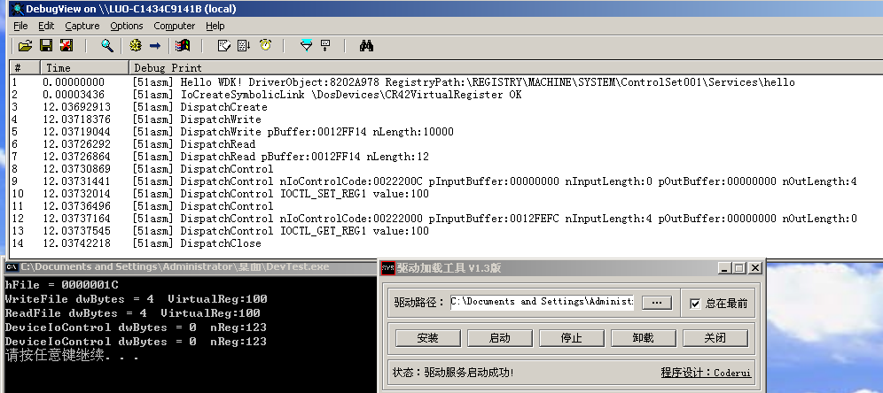

一般在做内核驱动的时候给个控制和打开,关闭就可以,读和写可以实现也可以不实现


##### 解决同步问题

可以通过临界区解决

```c++
 KeEnterCriticalRegion();   //进去临界区

  //需要同步的代码
 KeLeaveCriticalRegion();  //退出临界区
```

```c++
  KeEnterCriticalRegion();
  switch(nIoControlCode) {
  case IOCTL_GET_REG1:
    RtlCopyMemory(pBuffer, &g_Registers.nVirtualReg, nLength);
    nSize = nLength;
    DbgPrint("[51asm] %s IOCTL_GET_REG1 value:%d\n", __FUNCTION__, g_Registers.nVirtualReg);
    break;
  case IOCTL_GET_REG2:
    RtlCopyMemory(pBuffer, &g_Registers.nVirtualReg2, nLength);
    nSize = nLength;
    DbgPrint("[51asm] %s IOCTL_GET_REG2 value:%d\n", __FUNCTION__, g_Registers.nVirtualReg2);
    break;
  case IOCTL_GET_REG3:
    RtlCopyMemory(pBuffer, &g_Registers.nVirtualReg3, nLength);
    nSize = nLength;
    DbgPrint("[51asm] %s IOCTL_GET_REG2 value:%d\n", __FUNCTION__, g_Registers.nVirtualReg3);
    break;
  case IOCTL_SET_REG1:
    RtlCopyMemory(&g_Registers.nVirtualReg, pBuffer, nLength);
    DbgPrint("[51asm] %s IOCTL_SET_REG1 value:%d\n", __FUNCTION__, g_Registers.nVirtualReg);
    nSize = nLength;
    break;
  case IOCTL_SET_REG2:
    RtlCopyMemory(&g_Registers.nVirtualReg2, pBuffer, nLength);
    DbgPrint("[51asm] %s IOCTL_SET_REG2 value:%d\n", __FUNCTION__, g_Registers.nVirtualReg2);
    nSize = nLength;
    break;
  case IOCTL_SET_REG3:
    RtlCopyMemory(&g_Registers.nVirtualReg3, pBuffer, nLength);
    DbgPrint("[51asm] %s IOCTL_SET_REG3 value:%d\n", __FUNCTION__, g_Registers.nVirtualReg3);
    nSize = nLength;
    break;
  }
  KeLeaveCriticalRegion();
```

PsGetCurrentProcessId() ;    //获取当前进程id

**注意: 上面的代码存在问题 ,set功能会导致蓝屏**

### 安全问题

我们的回调函数可能在任何一个进程,线程中运行

0~2G 不共享

2G~4G 共享

内核中不推荐直接访问用户空间地址(线程上下文相关)

3环的地址和大小是不可信任的


#### 问题

1.  线程上下文问题:     简单来说就是  回调函数可能被操作系统的线程执行了,这个时候访问用户空间地址是,进程和线程已经切了,切了之后这个3环的地址可能在对方进程是一个无效的地址,于是就会蓝屏
2.  安全问题 :内核驱动去3环缓冲区读数据 , 如果有以下代码

void *p = malloc();

free(p);

ReadFile(p);

   驱动访问 *p 地址就会蓝屏,因此很容易被人攻击

#### 通讯方式

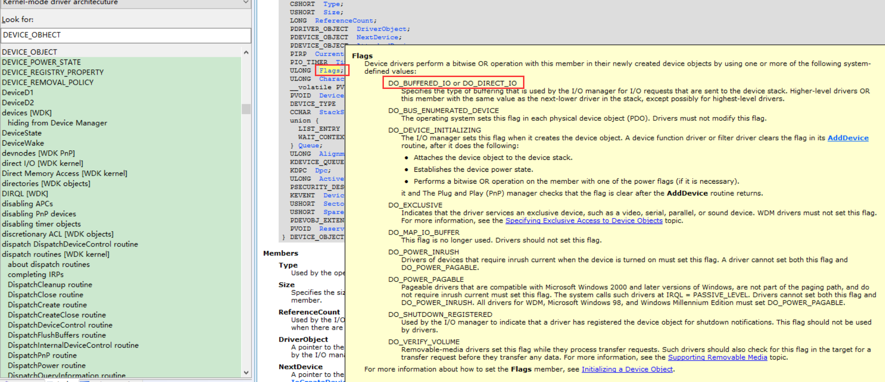

1.  其它方式（直接访问用户地址)  : 不推荐,很容易蓝屏
2.  缓冲区方式  (常用)

在创建设备时设置

  //设置设备的缓冲区通讯方式   控制是在操作码里面设置的

 pDevObj->Flags |= DO_BUFFERED_IO; //缓冲区通讯方式

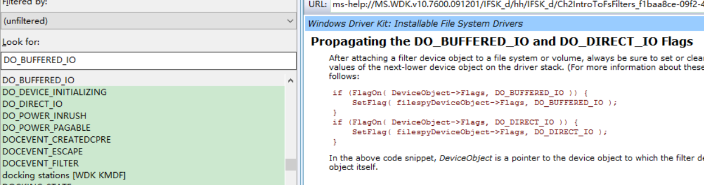

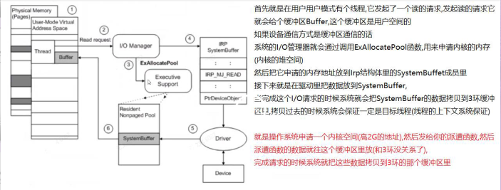

1.  直接方式

  //设置设备的缓冲区通讯方式  控制是在操作码里面设置的

pDevObj->Flags |= DO_DIRECT_IO;   //直接方式

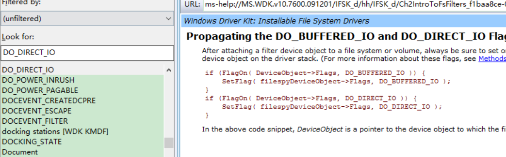

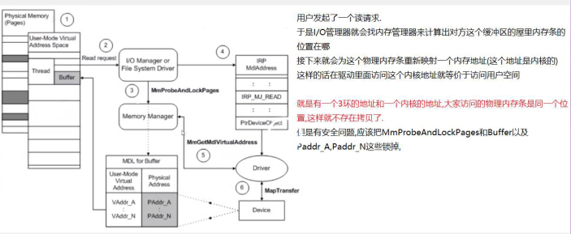


直接或者缓冲只能设置一个,不能同时设两个

控制输入和输出共用一个缓冲区,是因为 系统先把输入缓冲区的数据读进来,此时输入缓冲区就没用了,刚好可以用来作输出缓冲区.

```c++
--------------------Hello.h------------------

#pragma once
extern "C" {
#include <Ntddk.h>

    struct MyDeviceExt {
        int nVirtualReg;
        int nVirtualReg2;
        int nVirtualReg3;
    };

    #define DEVICE_NAME  L"\\Device\\CR42"
    #define SYMBOL_NAME L"\\DosDevices\\CR42VirtualRegister"

    //定义控制码
    #define MY_CODE_BASE 0x800
    #define MY_CTL_CODE(code) CTL_CODE(FILE_DEVICE_UNKNOWN, MY_CODE_BASE + code, METHOD_BUFFERED, FILE_ANY_ACCESS)
    #define IOCTL_GET_REG1 MY_CTL_CODE(0)
    #define IOCTL_GET_REG2 MY_CTL_CODE(1)
    #define IOCTL_GET_REG3 MY_CTL_CODE(2)
    #define IOCTL_SET_REG1 MY_CTL_CODE(3)
    #define IOCTL_SET_REG2 MY_CTL_CODE(4)
    #define IOCTL_SET_REG3 MY_CTL_CODE(5)


    /*驱动入口函数*/
    NTSTATUS DriverEntry(__in struct _DRIVER_OBJECT* DriverObject,
        __in PUNICODE_STRING  RegistryPath);


    VOID Unload(__in struct _DRIVER_OBJECT* DriverObject);

    NTSTATUS DispatchCreate(
        _In_ struct _DEVICE_OBJECT* DeviceObject,
        _Inout_ struct _IRP* Irp
    );

    NTSTATUS DispatchClose(
        _In_ struct _DEVICE_OBJECT* DeviceObject,
        _Inout_ struct _IRP* Irp
    );

    NTSTATUS DispatchRead(
        _In_ struct _DEVICE_OBJECT* DeviceObject,
        _Inout_ struct _IRP* Irp
    );

    NTSTATUS DispatchWrite(
        _In_ struct _DEVICE_OBJECT* DeviceObject,
        _Inout_ struct _IRP* Irp
    );

    NTSTATUS DispatchControl(
        _In_ struct _DEVICE_OBJECT* DeviceObject,
        _Inout_ struct _IRP* Irp
    );

}

--------------------Hello.cpp------------------

#include "Hello.h"

MyDeviceExt g_Registers;

/*驱动卸载函数 clean_up*/
VOID Unload(__in struct _DRIVER_OBJECT* DriverObject)
{
    DbgPrint("[51asm] Unload! DriverObject:%p\n", DriverObject);

    //删除符号链接
    UNICODE_STRING ustrSymbolName;
    RtlInitUnicodeString(&ustrSymbolName, SYMBOL_NAME);
    IoDeleteSymbolicLink(&ustrSymbolName);

    //删除设备
    if (DriverObject->DeviceObject != NULL)
        IoDeleteDevice(DriverObject->DeviceObject);
}

/*1.驱动入口函数*/
NTSTATUS DriverEntry(
    __in struct _DRIVER_OBJECT* DriverObject,
    __in PUNICODE_STRING  RegistryPath)
{
    DbgPrint("[51asm] Hello WDK! DriverObject:%p RegistryPath:%wZ\n",
        DriverObject, RegistryPath);

    //2.创建设备
    UNICODE_STRING ustrDevName;
    RtlInitUnicodeString(&ustrDevName, DEVICE_NAME);  //等于上面的3行代码

    PDEVICE_OBJECT pDevObj = NULL;
    NTSTATUS Status = IoCreateDevice(DriverObject,
        0,
        &ustrDevName,
        FILE_DEVICE_UNKNOWN,  //不知道的设备类型
        FILE_DEVICE_SECURE_OPEN,
        FALSE, //独占
        &pDevObj);
    if (!NT_SUCCESS(Status)) {
        DbgPrint("[51asm] IoCreateDevice Status:%p\n", Status);
        return Status;
    }
    //设置设备的缓冲区通讯方式
    pDevObj->Flags |= DO_BUFFERED_IO; //缓冲区通讯方式 (这里只能设置读和写的)
    //pDevObj->Flags |= DO_DIRECT_IO;   //直接方式


    //MS-DOS Device Names  创建符号链接
    UNICODE_STRING ustrSymbolName;
    RtlInitUnicodeString(&ustrSymbolName, SYMBOL_NAME);
    Status = IoCreateSymbolicLink(&ustrSymbolName, &ustrDevName);
    if (!NT_SUCCESS(Status)) {
        DbgPrint("[51asm] IoCreateSymbolicLink Status:%p\n", Status);

        if (pDevObj != NULL)
            IoDeleteDevice(pDevObj);

        return Status;
    }
    DbgPrint("[51asm] IoCreateSymbolicLink %wZ OK\n", &ustrSymbolName);

    //3.注册派遣函数
    DriverObject->MajorFunction[IRP_MJ_CREATE] = &DispatchCreate;
    DriverObject->MajorFunction[IRP_MJ_CLOSE] = &DispatchClose;
    DriverObject->MajorFunction[IRP_MJ_READ] = &DispatchRead;
    DriverObject->MajorFunction[IRP_MJ_WRITE] = &DispatchWrite;
    DriverObject->MajorFunction[IRP_MJ_DEVICE_CONTROL] = &DispatchControl;


    //4.注册卸载函数
    DriverObject->DriverUnload = Unload;

    return STATUS_SUCCESS;
}


NTSTATUS DispatchCreate(_DEVICE_OBJECT* DeviceObject, _IRP* Irp)
{
    UNREFERENCED_PARAMETER(DeviceObject);
    UNREFERENCED_PARAMETER(Irp);
    DbgPrint("[51asm] %s\n", __FUNCTION__);

    //完成请求  如果没完成 3环的程序就会挂起
    Irp->IoStatus.Status = STATUS_SUCCESS;   //状态，成功 
    Irp->IoStatus.Information = 0; //成功操作的字节数,非读写一般是0 就算是读写文件 dwBytes的返回值

    //第二个参数线程的优先级，内核一般时 IO_NO_INCREMENT 不提升优先级
    IoCompleteRequest(Irp, IO_NO_INCREMENT);  

    return STATUS_SUCCESS;
}

NTSTATUS DispatchClose(_DEVICE_OBJECT* DeviceObject, _IRP* Irp)
{
    UNREFERENCED_PARAMETER(DeviceObject);
    UNREFERENCED_PARAMETER(Irp);
    DbgPrint("[51asm] %s\n", __FUNCTION__);

    //完成请求  如果没完成 3环的程序就会挂起
    Irp->IoStatus.Status = STATUS_SUCCESS;   //状态，成功 
    Irp->IoStatus.Information = 0; //成功操作的字节数,非读写一般是0 就算是读写文件 dwBytes的返回值

    //第二个参数线程的优先级，内核一般时 IO_NO_INCREMENT 不提升优先级
    IoCompleteRequest(Irp, IO_NO_INCREMENT);

    return STATUS_SUCCESS;
}

NTSTATUS DispatchRead(_DEVICE_OBJECT* DeviceObject, _IRP* Irp)
{
    UNREFERENCED_PARAMETER(DeviceObject);
    DbgPrint("[51asm] %s\n", __FUNCTION__);

    //获取用户的缓冲区
    //PVOID pBuffer = Irp->UserBuffer;   //就是用户参数的 缓冲地址
    PVOID pBuffer = Irp->AssociatedIrp.SystemBuffer;  //因为设置了缓冲区通讯方式,用户缓冲区数据从系统申请的缓冲区读

     //获取当前IRP堆栈
    PIO_STACK_LOCATION pIrpStack = IoGetCurrentIrpStackLocation(Irp);
    ULONG nLength = pIrpStack->Parameters.Read.Length;    //就是用户参数的 缓冲大小  read表示读操作
   
    DbgPrint("[51asm] %s pBuffer:%p nLength:%d\n", __FUNCTION__, pBuffer, nLength);
    DbgPrint("[51asm] %s UserBuffer:%p pBuffer:%p nLength:%d\n", __FUNCTION__, Irp->UserBuffer, pBuffer, nLength);
 
    if (nLength > sizeof(g_Registers.nVirtualReg)) {  //判断用户缓冲区大小是否足够
        nLength = sizeof(g_Registers.nVirtualReg);
    }
        
    //拷贝信息  就等于  memcoy
    RtlCopyMemory(pBuffer,&g_Registers.nVirtualReg, nLength);  //把寄存器数据数据传入用缓冲区

    //完成请求  如果没完成 3环的程序就会挂起
    Irp->IoStatus.Status = STATUS_SUCCESS;   //状态，成功 
    Irp->IoStatus.Information = nLength; //成功操作的字节数,非读写一般是0 就算是读写文件 dwBytes的返回值

    //第二个参数线程的优先级，内核一般时 IO_NO_INCREMENT 不提升优先级
    IoCompleteRequest(Irp, IO_NO_INCREMENT);

    return STATUS_SUCCESS;
}


NTSTATUS DispatchWrite(_DEVICE_OBJECT* DeviceObject, _IRP* Irp)
{
    UNREFERENCED_PARAMETER(DeviceObject);
    DbgPrint("[51asm] %s\n", __FUNCTION__);

    //获取用户的缓冲区
    //PVOID pBuffer = Irp->UserBuffer;   //就是用户参数的 缓冲地址
    PVOID pBuffer = Irp->AssociatedIrp.SystemBuffer;  //因为设置了缓冲区通讯方式,用户缓冲区数据从系统申请的缓冲区读

    //获取当前IRP堆栈
    PIO_STACK_LOCATION pIrpStack = IoGetCurrentIrpStackLocation(Irp);
    ULONG nLength = pIrpStack->Parameters.Write.Length;    //就是用户参数的 缓冲大小  Write表示写操作
    
   
    DbgPrint("[51asm] %s pBuffer:%p nLength:%d\n", __FUNCTION__, pBuffer, nLength);
    DbgPrint("[51asm] %s UserBuffer:%p pBuffer:%p nLength:%d\n",__FUNCTION__, Irp->UserBuffer, pBuffer, nLength);

    if (nLength > sizeof(g_Registers.nVirtualReg)) {
        nLength = sizeof(g_Registers.nVirtualReg);
    }
       
    RtlCopyMemory(&g_Registers.nVirtualReg, pBuffer, nLength);  //将用户数据拷贝进内核的缓冲区


    //完成请求  如果没完成 3环的程序就会挂起
    Irp->IoStatus.Status = STATUS_SUCCESS;   //状态，成功 
    Irp->IoStatus.Information = nLength; //成功操作的字节数,非读写一般是0 就算是读写文件 dwBytes的返回值

    //第二个参数线程的优先级，内核一般时 IO_NO_INCREMENT 不提升优先级
    IoCompleteRequest(Irp, IO_NO_INCREMENT);

    return STATUS_SUCCESS;
}

NTSTATUS DispatchControl(_DEVICE_OBJECT* DeviceObject, _IRP* Irp)
{
    UNREFERENCED_PARAMETER(DeviceObject);
    DbgPrint("[51asm] %s\n", __FUNCTION__);

    //获取当前IRP堆栈
    PIO_STACK_LOCATION pIrpStack = IoGetCurrentIrpStackLocation(Irp);

#if 0
    //获取用户的缓冲区
    PVOID pOutBuffer = Irp->UserBuffer;  //获取用户输出缓冲区
    ULONG nOutLength = pIrpStack->Parameters.DeviceIoControl.OutputBufferLength;   //获取用户输出缓冲区大小

    PVOID pInputBuffer = pIrpStack->Parameters.DeviceIoControl.Type3InputBuffer;  //获取用户输入缓冲区
    ULONG nInputLength = pIrpStack->Parameters.DeviceIoControl.InputBufferLength;  //获取用户输入缓冲区大小
#endif // 0


    //获取用户的缓冲区
    PVOID pBuffer = Irp->AssociatedIrp.SystemBuffer;  //因为设置了缓冲区通讯方式,用户缓冲区数据从系统申请的缓冲区读
    ULONG nLength = pIrpStack->Parameters.DeviceIoControl.InputBufferLength;
    ULONG nIoControlCode = pIrpStack->Parameters.DeviceIoControl.IoControlCode;    //获取操作码

    DbgPrint("[51asm] %s nIoControlCode:%p pBuffer:%p nLength:%d\n", __FUNCTION__,
        nIoControlCode, pBuffer, nLength);

    ULONG nSize = 0;
    if (nLength != 4)
    {
        nLength = 4;
    }
   
    KeEnterCriticalRegion();
    switch (nIoControlCode) {
    case IOCTL_GET_REG1:
        RtlCopyMemory(pBuffer, &g_Registers.nVirtualReg, nLength);
        nSize = nLength;

        DbgPrint("[51asm] %s IOCTL_GET_REG1 value:%d\n", __FUNCTION__, g_Registers.nVirtualReg);
        break;
    case IOCTL_GET_REG2:
        RtlCopyMemory(pBuffer, &g_Registers.nVirtualReg2, nLength);
        nSize = nLength;

        DbgPrint("[51asm] %s IOCTL_GET_REG2 value:%d\n", __FUNCTION__, g_Registers.nVirtualReg2);
        break;
    case IOCTL_GET_REG3:
        RtlCopyMemory(pBuffer, &g_Registers.nVirtualReg3, nLength);
        nSize = nLength;

        DbgPrint("[51asm] %s IOCTL_GET_REG2 value:%d\n", __FUNCTION__, g_Registers.nVirtualReg3);
        break;
    case IOCTL_SET_REG1:
        RtlCopyMemory(&g_Registers.nVirtualReg, pBuffer, nLength);
        nSize = nLength;

        DbgPrint("[51asm] %s IOCTL_SET_REG1 value:%d\n", __FUNCTION__, g_Registers.nVirtualReg);
        break;
    case IOCTL_SET_REG2:
        RtlCopyMemory(&g_Registers.nVirtualReg2, pBuffer, nLength);
        nSize = nLength;

        DbgPrint("[51asm] %s IOCTL_SET_REG2 value:%d\n", __FUNCTION__, g_Registers.nVirtualReg2);
        break;
    case IOCTL_SET_REG3:
        RtlCopyMemory(&g_Registers.nVirtualReg3, pBuffer, nLength);
        nSize = nLength;

        DbgPrint("[51asm] %s IOCTL_SET_REG3 value:%d\n", __FUNCTION__, g_Registers.nVirtualReg3);
        break;
    }
    KeLeaveCriticalRegion();

    Irp->IoStatus.Status = STATUS_SUCCESS;
    Irp->IoStatus.Information = nSize;
    IoCompleteRequest(Irp, IO_NO_INCREMENT);

    return STATUS_SUCCESS;
}

```

```c++
#include <stdio.h>
#include <Windows.h>
#include <stdlib.h>
#include <winioctl.h>

struct MyDeviceExt {
    int nVirtualReg;
    int nVirtualReg2;
    int nVirtualReg3;
};

//定义控制码
#define MY_CODE_BASE 0x800
#define MY_CTL_CODE(code) CTL_CODE(FILE_DEVICE_UNKNOWN, MY_CODE_BASE + code, METHOD_BUFFERED, FILE_ANY_ACCESS)
#define IOCTL_GET_REG1 MY_CTL_CODE(0)
#define IOCTL_GET_REG2 MY_CTL_CODE(1)
#define IOCTL_GET_REG3 MY_CTL_CODE(2)
#define IOCTL_SET_REG1 MY_CTL_CODE(3)
#define IOCTL_SET_REG2 MY_CTL_CODE(4)
#define IOCTL_SET_REG3 MY_CTL_CODE(5)


void DisplayErrorText()
{
    LPVOID lpMsgBuf;
    FormatMessage(
        FORMAT_MESSAGE_ALLOCATE_BUFFER |
        FORMAT_MESSAGE_FROM_SYSTEM |
        FORMAT_MESSAGE_IGNORE_INSERTS,
        NULL,
        GetLastError(),
        MAKELANGID(LANG_NEUTRAL, SUBLANG_DEFAULT), // Default language
        (LPTSTR)&lpMsgBuf,
        0,
        NULL
    );

    printf((LPCTSTR)lpMsgBuf);

    // Free the buffer.
    LocalFree(lpMsgBuf);
}

int main()
{
    HANDLE hFile = CreateFile("\\\\?\\CR42VirtualRegister",
        GENERIC_ALL,
        0,
        NULL,
        OPEN_EXISTING,
        FILE_ATTRIBUTE_NORMAL,
        NULL);
    if (hFile == INVALID_HANDLE_VALUE)
    {
        DisplayErrorText();
    }
    else {
        printf("hFile = %p\n", hFile);
    }

    MyDeviceExt DevExt = { 0 };
    DWORD dwBytes = 0;
    DevExt.nVirtualReg = 100;
    if (!WriteFile(hFile, &DevExt, 10000, &dwBytes, NULL))
    {
        DisplayErrorText();
    }
    else
    {
        printf("WriteFile dwBytes = %d  VirtualReg:%d\n", dwBytes, DevExt.nVirtualReg);
    }

    DevExt.nVirtualReg = 2;
    if (!ReadFile(hFile, &DevExt, sizeof(DevExt), &dwBytes, NULL))
    {
        DisplayErrorText();
    }
    else
    {
        printf("ReadFile dwBytes = %d  VirtualReg:%d\n", dwBytes, DevExt.nVirtualReg);
    }
    int nReg = 123;
    DeviceIoControl(hFile, IOCTL_SET_REG1, &nReg, sizeof(nReg), NULL, 0, &dwBytes, NULL);
    printf("DeviceIoControl dwBytes = %d  nReg:%d\n", dwBytes, nReg);

    nReg = 0;
    DeviceIoControl(hFile, IOCTL_GET_REG1, NULL, 0, &nReg, sizeof(nReg), &dwBytes, NULL);
    printf("DeviceIoControl dwBytes = %d  nReg:%d\n", dwBytes, nReg);

    CloseHandle(hFile);

    system("pause");
    return 0;
}
```

但这种方式他有缺点,就是效率比较低,特别对于一个硬件设备来说,他在大量传输数据的时候他会有卡顿,因为数据量很大,每次返回数据有2次拷贝

内存共享可以极大的提交效率,但同时也会带来安全问题(0环和3环同时操作一个缓冲区)

因此可以通过直接方式通讯,应发跟通讯方式没啥区别,只不过获取缓冲区的方式不同,但注意要进行地址判断,防止地址为空,一般直接方式只会在硬件上看到,应为硬件比较简单

控制码里第3个参数它还有别的取值,对于直接方式,它有两个取值,两个挑一个用

METHOD_IN_DIRECT      1  ;直接方式 输入缓冲区

METHOD_OUT_DIRECT     2  ;直接方式 输出缓冲区

如果选择输出缓冲区直接,那么输出缓冲区就用Mdl,输入缓冲区就用SystemBuffer了;

输入缓冲区直接的话,输入缓冲区就用Mdl,输出就用SystemBuffer;反正只能选择一个


输入从Mdl拿

PVOID pInputBuffer = 

​	MmGetSystemAddressForMdlSafe(Irp->MdlAddress,NormalPagePriority);

输出从SystemBuffer拿

​         PVOID pOutBuffer = Irp->AssociatedIrp.SystemBuffer;


### 内核的堆空间

内核的堆空间和3环的堆空间是分开的,不允许用户堆空间去操作内核的堆空间

#### 内核申请堆空间    

ExAllocatePool (不让用了)

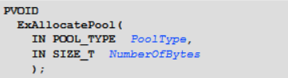

参数:

1.  内存分页池类型
2.  大小

或者

ExAllocatePoolWithTag

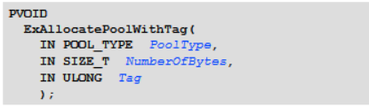

参数:

1.  内存分页池类型
2.  大小
3.  标记 (四个字符)

跟上一个相比多一个参数: 标记

防止内存泄露,因为我们驱动卸载以后可以通过这个标记去找内存,如果找到了就存在内存泄漏,如果没找到就不存在

标记大小是四个字符, 例如:  '1234'  (注意单引号),意思是这里的最低一个字节用 sacii 码4取代.,倒数第二个用ascii码 3 取代.........     即在内存中 是   0x34  0x33  0x32  0x31 因为内存中的值小尾方式保存,因此通常会倒过来写 '4321',这样在内存中就是顺序排列


#### 内存分页池

1.  NonPagedPool  非分页内存池  
2.  PagedPool     分页内存池

我们申请内存时必须告诉系统从那哪个内存池里面申请内存,不管哪个池分配都是一个分页

NonPagedPool   相当于买房子      PagedPool 相当于租房子

当申请分页内存时,如果操作系统没有内存,就会把内存里面的数丢到磁盘中,把控件腾出来给系统用,当系统用完之后,再从磁盘把你数据还回来,这个过程需要时间.在window里面一般叫做虚拟内存(把硬盘当内存用),默认是开的

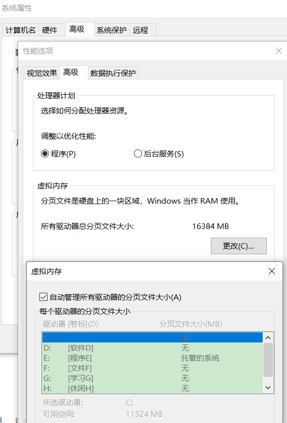


非分页内存是系统没内存用就没内存用,除非内存自己没用了,否则系统没法使用

因为我们申请内存时一般都是申请分页内存,如果代码很重要(实时性要求很高),需要一直再用,就可以考虑用非分页内存池.如果我们把非分页内存申请完,系统将会死机

系统的代码都是在非分页内存池中,一般正常的驱动代码都是在分页内存池

3环只能申请分页内存，不能申请非分页内存


**自己写的函数(就那些Read,Write....)代码,默认都是非分页内存池中**

##### 申请分页内存

通过3环的一个宏来解决

**#param alloc_text("PAGENAME",FUN1)**

其中PAGENAME是节的名称,PAGE就是把代码放到分页内存池,FUN1是函数名称

\#pragma alloc_text("PAGE", DispatchRead);这意思就是把DispatchRead函数放到分页内存里

它可以用逗号分隔,写多个函数,但是不推荐,一般还是一个函数写一行这样的,方便修改

\#pragma alloc_text( "PAGE", DispatchCreate)

\#pragma alloc_text( "PAGE", DispatchClose)

\#pragma alloc_text( "PAGE", DispatchWrite)

\#pragma alloc_text( "PAGE", DispatchRead)

\#pragma alloc_text( "PAGE", DispatchControl)

\#pragma alloc_text( "PAGE", Unload)

\#pragma alloc_text( "INIT", DriverEntry)

-    操作系统会定义节来把函数放到对应的节里
-   

-   -    放到`.text`就非分页内存 
    -    放到`PAGE`就是分页内存 
    -    `.INIT`节是放一些只执行一次的代码 ,用完之后内存就会被释放

```plain
因为内核的内存是很宝贵的,而DriverEntry这个函数执行完之后就没用了,它就入口执行一次,所以就把他放
到.INIT节里,就是一次性的
简单来说就是驱动加载完后这个节的内存全部会被释放掉,也就是DriverEntry执行完后INIT整个节内存就被
释放了.
Unload是不能放到这个节里的,因为可能执行卸载函数的时候这个内存已经被释放了,所以就释放的时候就崩了
```

-   到此这个框架就完成了,要实现功能的话就写控制代码就好了 


### 完整源码

#### 内核驱动

```c++
#pragma once

extern "C" {

#include <Ntddk.h>

    struct MyDeviceExt {
        int nVirtualReg;
        int nVirtualReg2;
        int nVirtualReg3;
    };

    #define DEVICE_NAME  L"\\Device\\CR42"
    #define SYMBOL_NAME L"\\DosDevices\\CR42VirtualRegister"

        //定义控制码
    #define MY_CODE_BASE 0x800
    #define MY_CTL_CODE(code) CTL_CODE(FILE_DEVICE_UNKNOWN, MY_CODE_BASE + code, METHOD_BUFFERED, FILE_ANY_ACCESS)
    #define IOCTL_GET_REG1 MY_CTL_CODE(0)
    #define IOCTL_GET_REG2 MY_CTL_CODE(1)
    #define IOCTL_GET_REG3 MY_CTL_CODE(2)
    #define IOCTL_SET_REG1 MY_CTL_CODE(3)
    #define IOCTL_SET_REG2 MY_CTL_CODE(4)
    #define IOCTL_SET_REG3 MY_CTL_CODE(5)


    /*驱动入口函数*/
    NTSTATUS DriverEntry(__in struct _DRIVER_OBJECT* DriverObject,
        __in PUNICODE_STRING  RegistryPath);


    VOID Unload(__in struct _DRIVER_OBJECT* DriverObject);

    NTSTATUS DispatchCreate(
        _In_ struct _DEVICE_OBJECT* DeviceObject,
        _Inout_ struct _IRP* Irp
    );

    NTSTATUS DispatchClose(
        _In_ struct _DEVICE_OBJECT* DeviceObject,
        _Inout_ struct _IRP* Irp
    );

    NTSTATUS DispatchRead(
        _In_ struct _DEVICE_OBJECT* DeviceObject,
        _Inout_ struct _IRP* Irp
    );

    NTSTATUS DispatchWrite(
        _In_ struct _DEVICE_OBJECT* DeviceObject,
        _Inout_ struct _IRP* Irp
    );

    NTSTATUS DispatchControl(
        _In_ struct _DEVICE_OBJECT* DeviceObject,
        _Inout_ struct _IRP* Irp
    );

#pragma alloc_text( "PAGE", DispatchCreate)
#pragma alloc_text( "PAGE", DispatchClose)
#pragma alloc_text( "PAGE", DispatchWrite)
#pragma alloc_text( "PAGE", DispatchRead)
#pragma alloc_text( "PAGE", DispatchControl)
#pragma alloc_text( "PAGE", Unload)
#pragma alloc_text( "INIT", DriverEntry)

}
```

```c++
#include "Hello.h"


MyDeviceExt g_Registers;


/*驱动卸载函数 clean_up*/
VOID Unload(__in struct _DRIVER_OBJECT* DriverObject)
{
    DbgPrint("[51asm] Unload! DriverObject:%p\n", DriverObject);

    //删除符号链接
    UNICODE_STRING ustrSymbolName;
    RtlInitUnicodeString(&ustrSymbolName, SYMBOL_NAME);
    IoDeleteSymbolicLink(&ustrSymbolName);

    //删除设备
    if (DriverObject->DeviceObject != NULL)
        IoDeleteDevice(DriverObject->DeviceObject);
}

/*1.驱动入口函数*/
NTSTATUS DriverEntry(
    __in struct _DRIVER_OBJECT* DriverObject,
    __in PUNICODE_STRING  RegistryPath)
{
    DbgPrint("[51asm] Hello WDK! DriverObject:%p RegistryPath:%wZ\n",
        DriverObject, RegistryPath);

    //2.创建设备
    UNICODE_STRING ustrDevName;
    RtlInitUnicodeString(&ustrDevName, DEVICE_NAME);  //等于上面的3行代码

    PDEVICE_OBJECT pDevObj = NULL;
    NTSTATUS Status = IoCreateDevice(DriverObject,
        0,
        &ustrDevName,
        FILE_DEVICE_UNKNOWN,  //不知道的设备类型
        FILE_DEVICE_SECURE_OPEN,
        FALSE, //独占
        &pDevObj);
    if (!NT_SUCCESS(Status)) {
        DbgPrint("[51asm] IoCreateDevice Status:%p\n", Status);
        return Status;
    }
    //设置设备的缓冲区通讯方式
    pDevObj->Flags |= DO_BUFFERED_IO; //缓冲区通讯方式
    //pDevObj->Flags |= DO_DIRECT_IO;   //直接方式


    //MS-DOS Device Names  创建符号链接
    UNICODE_STRING ustrSymbolName;
    RtlInitUnicodeString(&ustrSymbolName, SYMBOL_NAME);
    Status = IoCreateSymbolicLink(&ustrSymbolName, &ustrDevName);
    if (!NT_SUCCESS(Status)) {
        DbgPrint("[51asm] IoCreateSymbolicLink Status:%p\n", Status);

        if (pDevObj != NULL)
            IoDeleteDevice(pDevObj);

        return Status;
    }
    DbgPrint("[51asm] IoCreateSymbolicLink %wZ OK\n", &ustrSymbolName);


    //3.注册派遣函数
    DriverObject->MajorFunction[IRP_MJ_CREATE] = &DispatchCreate;
    DriverObject->MajorFunction[IRP_MJ_CLOSE] = &DispatchClose;
    DriverObject->MajorFunction[IRP_MJ_READ] = &DispatchRead;
    DriverObject->MajorFunction[IRP_MJ_WRITE] = &DispatchWrite;
    DriverObject->MajorFunction[IRP_MJ_DEVICE_CONTROL] = &DispatchControl;


    //4.注册卸载函数
    DriverObject->DriverUnload = Unload;

    return STATUS_SUCCESS;
}


NTSTATUS DispatchCreate(_DEVICE_OBJECT* DeviceObject, _IRP* Irp)
{
    UNREFERENCED_PARAMETER(DeviceObject);
    UNREFERENCED_PARAMETER(Irp);
    DbgPrint("[51asm] %s\n", __FUNCTION__);

    //完成请求  如果没完成 3环的程序就会挂起
    Irp->IoStatus.Status = STATUS_SUCCESS;   //状态，成功 
    Irp->IoStatus.Information = 0; //成功操作的字节数,非读写一般是0 就算是读写文件 dwBytes的返回值

    //第二个参数线程的优先级，内核一般时 IO_NO_INCREMENT 不提升优先级
    IoCompleteRequest(Irp, IO_NO_INCREMENT);  

    return STATUS_SUCCESS;
}

NTSTATUS DispatchClose(_DEVICE_OBJECT* DeviceObject, _IRP* Irp)
{
    UNREFERENCED_PARAMETER(DeviceObject);
    UNREFERENCED_PARAMETER(Irp);
    DbgPrint("[51asm] %s\n", __FUNCTION__);


    //完成请求  如果没完成 3环的程序就会挂起
    Irp->IoStatus.Status = STATUS_SUCCESS;   //状态，成功 
    Irp->IoStatus.Information = 0; //成功操作的字节数,非读写一般是0 就算是读写文件 dwBytes的返回值

    //第二个参数线程的优先级，内核一般时 IO_NO_INCREMENT 不提升优先级
    IoCompleteRequest(Irp, IO_NO_INCREMENT);

    return STATUS_SUCCESS;
}

NTSTATUS DispatchRead(_DEVICE_OBJECT* DeviceObject, _IRP* Irp)
{
    UNREFERENCED_PARAMETER(DeviceObject);
    UNREFERENCED_PARAMETER(Irp);
    DbgPrint("[51asm] %s\n", __FUNCTION__);

    //获取用户的缓冲区
    //PVOID pBuffer = Irp->UserBuffer;   //就是用户参数的 缓冲地址
    PVOID pBuffer = Irp->AssociatedIrp.SystemBuffer;  //因为设置了缓冲区通讯方式,用户缓冲区数据从系统申请的缓冲区读
    //PVOID pBuffer = MmGetSystemAddressForMdlSafe(Irp->MdlAddress, NormalPagePriority);  //设置了直接通讯方式获取用户缓冲区

     //获取当前IRP堆栈
    PIO_STACK_LOCATION pIrpStack = IoGetCurrentIrpStackLocation(Irp);
    ULONG nLength = pIrpStack->Parameters.Read.Length;    //就是用户参数的 缓冲大小  read表示读操作
   
    DbgPrint("[51asm] %s pBuffer:%p nLength:%d\n", __FUNCTION__, pBuffer, nLength);
    DbgPrint("[51asm] %s UserBuffer:%p pBuffer:%p nLength:%d\n", __FUNCTION__, Irp->UserBuffer, pBuffer, nLength);
 
    if (nLength > sizeof(g_Registers.nVirtualReg)) {  //判断用户缓冲区大小是否足够
        nLength = sizeof(g_Registers.nVirtualReg);
    }
        
    //拷贝信息  就等于  memcoy
    RtlCopyMemory(pBuffer,&g_Registers.nVirtualReg, nLength);  //把寄存器数据数据传入用缓冲区

    //完成请求  如果没完成 3环的程序就会挂起
    Irp->IoStatus.Status = STATUS_SUCCESS;   //状态，成功 
    Irp->IoStatus.Information = nLength; //成功操作的字节数,非读写一般是0 就算是读写文件 dwBytes的返回值

    //第二个参数线程的优先级，内核一般时 IO_NO_INCREMENT 不提升优先级
    IoCompleteRequest(Irp, IO_NO_INCREMENT);

    return STATUS_SUCCESS;
}


NTSTATUS DispatchWrite(_DEVICE_OBJECT* DeviceObject, _IRP* Irp)
{
    UNREFERENCED_PARAMETER(DeviceObject);
    UNREFERENCED_PARAMETER(Irp);
    DbgPrint("[51asm] %s\n", __FUNCTION__);

    //获取用户的缓冲区
    //PVOID pBuffer = Irp->UserBuffer;   //就是用户参数的 缓冲地址
    PVOID pBuffer = Irp->AssociatedIrp.SystemBuffer;  //因为设置了缓冲区通讯方式,用户缓冲区数据从系统申请的缓冲区读
    //PVOID pBuffer = MmGetSystemAddressForMdlSafe(Irp->MdlAddress, NormalPagePriority);  //设置了直接通讯方式获取用户缓冲区
   
     //获取当前IRP堆栈
    PIO_STACK_LOCATION pIrpStack = IoGetCurrentIrpStackLocation(Irp);
    ULONG nLength = pIrpStack->Parameters.Write.Length;    //就是用户参数的 缓冲大小  Write表示写操作
    
   
    DbgPrint("[51asm] %s pBuffer:%p nLength:%d\n", __FUNCTION__, pBuffer, nLength);
    DbgPrint("[51asm] %s UserBuffer:%p pBuffer:%p nLength:%d\n",__FUNCTION__, Irp->UserBuffer, pBuffer, nLength);

    if (nLength > sizeof(g_Registers.nVirtualReg)) {
        nLength = sizeof(g_Registers.nVirtualReg);
    }
       
    RtlCopyMemory(&g_Registers.nVirtualReg, pBuffer, nLength);  //将用户数据拷贝进内核的缓冲区


    //完成请求  如果没完成 3环的程序就会挂起
    Irp->IoStatus.Status = STATUS_SUCCESS;   //状态，成功 
    Irp->IoStatus.Information = nLength; //成功操作的字节数,非读写一般是0 就算是读写文件 dwBytes的返回值

    //第二个参数线程的优先级，内核一般时 IO_NO_INCREMENT 不提升优先级
    IoCompleteRequest(Irp, IO_NO_INCREMENT);

    return STATUS_SUCCESS;
}

NTSTATUS DispatchControl(_DEVICE_OBJECT* DeviceObject, _IRP* Irp)
{
    UNREFERENCED_PARAMETER(DeviceObject);
    UNREFERENCED_PARAMETER(Irp);
    DbgPrint("[51asm] %s\n", __FUNCTION__);


    //获取当前IRP堆栈
    PIO_STACK_LOCATION pIrpStack = IoGetCurrentIrpStackLocation(Irp);

#if 0
    //获取用户的缓冲区
    PVOID pOutBuffer = Irp->UserBuffer;  //获取用户输出缓冲区
    ULONG nOutLength = pIrpStack->Parameters.DeviceIoControl.OutputBufferLength;   //获取用户输出缓冲区大小

    PVOID pInputBuffer = pIrpStack->Parameters.DeviceIoControl.Type3InputBuffer;  //获取用户输入缓冲区
    ULONG nInputLength = pIrpStack->Parameters.DeviceIoControl.InputBufferLength;  //获取用户输入缓冲区大小
#endif // 0


    //获取用户的缓冲区
    PVOID pBuffer = Irp->AssociatedIrp.SystemBuffer;  //因为设置了缓冲区通讯方式,用户缓冲区数据从系统申请的缓冲区读
    ULONG nLength = pIrpStack->Parameters.DeviceIoControl.InputBufferLength;
    ULONG nIoControlCode = pIrpStack->Parameters.DeviceIoControl.IoControlCode;    //获取操作码


    DbgPrint("[51asm] %s nIoControlCode:%p pBuffer:%p nLength:%d\n", __FUNCTION__,
        nIoControlCode, pBuffer, nLength);


    ULONG nSize = 0;
    if (nLength != 4)
    {
        nLength = 4;
    }
   
    KeEnterCriticalRegion();
    switch (nIoControlCode) {
    case IOCTL_GET_REG1:
        RtlCopyMemory(pBuffer, &g_Registers.nVirtualReg, nLength);
        nSize = nLength;

        DbgPrint("[51asm] %s IOCTL_GET_REG1 value:%d\n", __FUNCTION__, g_Registers.nVirtualReg);
        break;
    case IOCTL_GET_REG2:
        RtlCopyMemory(pBuffer, &g_Registers.nVirtualReg2, nLength);
        nSize = nLength;

        DbgPrint("[51asm] %s IOCTL_GET_REG2 value:%d\n", __FUNCTION__, g_Registers.nVirtualReg2);
        break;
    case IOCTL_GET_REG3:
        RtlCopyMemory(pBuffer, &g_Registers.nVirtualReg3, nLength);
        nSize = nLength;

        DbgPrint("[51asm] %s IOCTL_GET_REG2 value:%d\n", __FUNCTION__, g_Registers.nVirtualReg3);
        break;
    case IOCTL_SET_REG1:
        RtlCopyMemory(&g_Registers.nVirtualReg, pBuffer, nLength);
        nSize = nLength;

        DbgPrint("[51asm] %s IOCTL_SET_REG1 value:%d\n", __FUNCTION__, g_Registers.nVirtualReg);
        break;
    case IOCTL_SET_REG2:
        RtlCopyMemory(&g_Registers.nVirtualReg2, pBuffer, nLength);
        nSize = nLength;

        DbgPrint("[51asm] %s IOCTL_SET_REG2 value:%d\n", __FUNCTION__, g_Registers.nVirtualReg2);
        break;
    case IOCTL_SET_REG3:
        RtlCopyMemory(&g_Registers.nVirtualReg3, pBuffer, nLength);
        nSize = nLength;

        DbgPrint("[51asm] %s IOCTL_SET_REG3 value:%d\n", __FUNCTION__, g_Registers.nVirtualReg3);
        break;
    }
    KeLeaveCriticalRegion();

    Irp->IoStatus.Status = STATUS_SUCCESS;
    Irp->IoStatus.Information = nSize;
    IoCompleteRequest(Irp, IO_NO_INCREMENT);

    return STATUS_SUCCESS;
}

```

#### 3环程序

```c++
#include <stdio.h>
#include <Windows.h>
#include <stdlib.h>
#include <winioctl.h>

struct MyDeviceExt {
    int nVirtualReg;
    int nVirtualReg2;
    int nVirtualReg3;
};

//定义控制码
#define MY_CODE_BASE 0x800
#define MY_CTL_CODE(code) CTL_CODE(FILE_DEVICE_UNKNOWN, MY_CODE_BASE + code, METHOD_BUFFERED, FILE_ANY_ACCESS)
#define IOCTL_GET_REG1 MY_CTL_CODE(0)
#define IOCTL_GET_REG2 MY_CTL_CODE(1)
#define IOCTL_GET_REG3 MY_CTL_CODE(2)
#define IOCTL_SET_REG1 MY_CTL_CODE(3)
#define IOCTL_SET_REG2 MY_CTL_CODE(4)
#define IOCTL_SET_REG3 MY_CTL_CODE(5)


void DisplayErrorText()
{
    LPVOID lpMsgBuf;
    FormatMessage(
        FORMAT_MESSAGE_ALLOCATE_BUFFER |
        FORMAT_MESSAGE_FROM_SYSTEM |
        FORMAT_MESSAGE_IGNORE_INSERTS,
        NULL,
        GetLastError(),
        MAKELANGID(LANG_NEUTRAL, SUBLANG_DEFAULT), // Default language
        (LPTSTR)&lpMsgBuf,
        0,
        NULL
    );

    printf((LPCTSTR)lpMsgBuf);

    // Free the buffer.
    LocalFree(lpMsgBuf);
}

int main()
{
    HANDLE hFile = CreateFile("\\\\?\\CR42VirtualRegister",
        GENERIC_ALL,
        0,
        NULL,
        OPEN_EXISTING,
        FILE_ATTRIBUTE_NORMAL,
        NULL);
    if (hFile == INVALID_HANDLE_VALUE)
    {
        DisplayErrorText();
    }
    else {
        printf("hFile = %p\n", hFile);
    }

    MyDeviceExt DevExt = { 0 };
    DWORD dwBytes = 0;
    DevExt.nVirtualReg = 100;
    if (!WriteFile(hFile, &DevExt, 10000, &dwBytes, NULL))
    {
        DisplayErrorText();
    }
    else
    {
        printf("WriteFile dwBytes = %d  VirtualReg:%d\n", dwBytes, DevExt.nVirtualReg);
    }

    DevExt.nVirtualReg = 2;
    if (!ReadFile(hFile, &DevExt, sizeof(DevExt), &dwBytes, NULL))
    {
        DisplayErrorText();
    }
    else
    {
        printf("ReadFile dwBytes = %d  VirtualReg:%d\n", dwBytes, DevExt.nVirtualReg);
    }
    int nReg = 123;
    DeviceIoControl(hFile, IOCTL_SET_REG1, &nReg, sizeof(nReg), NULL, 0, &dwBytes, NULL);
    printf("DeviceIoControl dwBytes = %d  nReg:%d\n", dwBytes, nReg);

    nReg = 0;
    DeviceIoControl(hFile, IOCTL_GET_REG1, NULL, 0, &nReg, sizeof(nReg), &dwBytes, NULL);
    printf("DeviceIoControl dwBytes = %d  nReg:%d\n", dwBytes, nReg);

    CloseHandle(hFile);

    system("pause");
    return 0;
}
```

