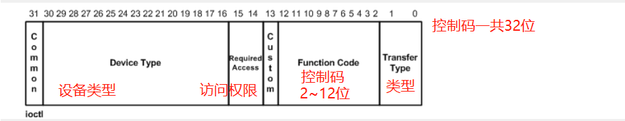
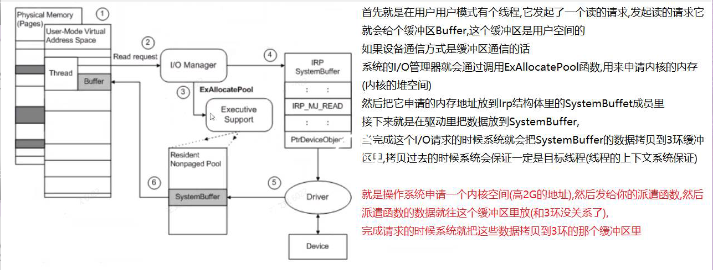
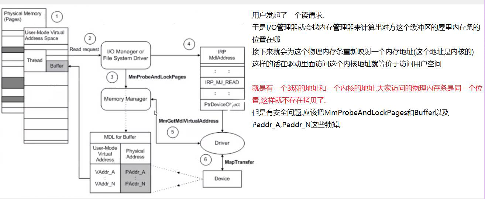
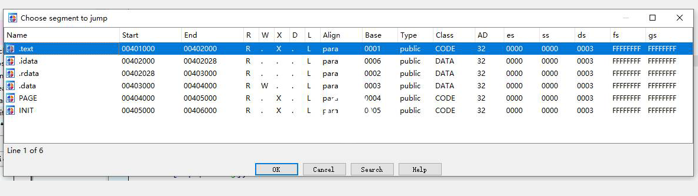

## 控制函数


-    既然有了读写函数了,那为什么还会有控制函数? 

-   读写这两个函数是有缺陷的.
    比如昨天使用的那个虚拟寄存器结构体.如果在这个寄存器里再加两个成员的话,读写这两个函数就不知道该操作那
    个成员了就是Write不知道写那个成员,Read也不知道读那个成员了.也就是它缺参数;
    以读取为例不知道要怎么告诉驱动读取哪个寄存器;读取传递的结构体参数是一个保存数据的缓冲区,它并不能传递
    数据
    而且还需要考虑多个用户同时读写的问题,A用户写了,B用户读取了这就会导致同步问题.
    其实目的就是希望ReadFile和WriteFile有更多的参数,有多个参数的话,问题就解决了.
    但是有个问题:一个参数是肯定不够用的,如果结构体是数组的话,多定义几个参数也没有什么用.
    所以就考虑使用void*参数和一个长度Len;这个void*可以转换成任何结构体指针;
    而且一般还会多给一个编码参数,这个编码表示要做什么(读,写等),所以大概就是
    ReadFile(hFile,int code ,void* buffer,int len,&Dev,sizoef(Dev),@dwBytes,NULL);
    其中code表示操作, buffer和len表示用户传递了什么数据,读取的数据放在Dev和sizeof(Dev)里;这个就叫
    控制的作用

    3环控制API解析
    BOOL DeviceIoControl(  
      HANDLE hDevice,          //文件句柄
      DWORD dwIoControlCode,   //操作码(什么操作)
      LPVOID lpInBuffer,       //输入缓冲区   
      DWORD nInBufferSize,     //输入缓冲区大小   
      LPVOID lpOutBuffer,      //输出缓冲区  (下面的参数和Read或者Write就一样了,只是增加了上面这3个参数)
      DWORD nOutBufferSize,    //输出缓冲区大小   
      LPDWORD lpBytesReturned, //成功字节数   
      LPOVERLAPPED lpOverlapped // NULL  
      );

-   编写控制函数的第一步就是要定义控制码(也就是定义一套自己的控制码) 

-   -   控制码从3环的`API`可以看出它是一个整型;而且控制码是有规范的,不能胡乱定义.
    -   
    -   这么定义控制码是很麻烦的,所以微软提供了一个宏来完成控制码的定义

-   示例:
    #define IOCTL_GET_REG1 CTL_CODE(DeviceType, Function, Method, Access) 只需要填写上这
    四个参数就行了
    DeviceType:(DeviceType)设备类型;内核驱动就写FILE_DEVICE_UNKNOWN就行了
    Function:(FunctionCode)控制码;可以定义自己的控制码,但是要大于0x800;(0x800以下被微软保留使用
    了)
    Method:(TransferType);通信方式
    Access:(RequiredAccess)访问权限;就是读写的权限,一般给所有权限FILE_ANY_ACCESS;

-   定义好以后就是这样
    #define IOCTL_GET_REG1 \
    CTL_CODE(FILE_DEVICE_UNKNOWN,0x800,METHOD_NEITHER,FILE_ANY_ACCESS)
    #define IOCTL_GET_REG2 \
    CTL_CODE(FILE_DEVICE_UNKNOWN,0x801,METHOD_NEITHER,FILE_ANY_ACCESS)
    控制码会越来越多,所以一般我们还会再套一个宏,方便后期的修改.
    #define MY_CTL_CODE(code) CTL_CODE(FILE_DEVICE_UNKNOWN,0x800,METHOD_NEITHER,FILE_ANY_ACCESS)
    #define IOCTL_GET_REG1 MY_CTL_CODE(0x801)
    #define IOCTL_GET_REG2 MY_CTL_CODE(0x802)

-   或者再多加一个宏
    #define MY_CODE_BASE 0x800
    #define MY_CTL_CODE(code) \
    	    CTL_CODE(FILE_DEVICE_UNKNOWN,MY_CODE_BASE + code,METHOD_NEITHER,FILE_ANY_ACCESS)
    #define IOCTL_GET_REG1 MY_CTL_CODE(0)
    #define IOCTL_GET_REG2 MY_CTL_CODE(1)

-   

-   -   -   控制码不按格式定义的话,驱动可能收不到,或者收到后直接系统蓝屏

-   -    有了控制码以后就可以在控制函数里进行判断了 

-   在控制函数里用控制码来判断操作,同时还要获取一下那两个额外的参数;也就是控制函数里会有两个缓冲区,两个长
    度

-   ```C
    struct {
        ULONG OutputBufferLength;//输出缓冲区的大小
        ULONG POINTER_ALIGNMENT InputBufferLength;//输入缓冲区的大小
        ULONG POINTER_ALIGNMENT IoControlCode;//控制码
        PVOID Type3InputBuffer;//输入缓冲区的地址(它是3环程序的地址)
    } DeviceIoControl;
    所以就要分别获取一下输入和输出的缓冲区以及它们各自的长度.获取完所有数据后就可以用控制码来判断了,不同
    的控制码做不同的操作
    
    //控制函数
    NTSTATUS DispatchControl(_DEVICE_OBJECT* DeviceObject, _IRP* Irp)
    {
        UNREFERENCED_PARAMETER(DeviceObject);
        UNREFERENCED_PARAMETER(Irp);
        DbgPrint("[WANG] %s\n", __FUNCTION__);
    
        //获取当前IRP堆栈(就是长度信息放在这里,通过函数来获取)
        PIO_STACK_LOCATION pIrpStack = IoGetCurrentIrpStackLocation(Irp);
        //获取用户的缓冲区 (3环程序的地址)
        PVOID pOutBuffer = Irp->UserBuffer;
        //输出缓冲区大小
        ULONG nOutLength = pIrpStack->Parameters.DeviceIoControl.OutputBufferLength;
    
        //输入缓冲区大小
        ULONG nInputLength = pIrpStack->Parameters.DeviceIoControl.InputBufferLength;
        //获取输入缓冲区(输入缓冲区地址就是3环程序的地址)
        PVOID pInputBuffer = pIrpStack->Parameters.DeviceIoControl.Type3InputBuffer;
        //控制码
        ULONG nIoControlCode = pIrpStack->Parameters.DeviceIoControl.IoControlCode;
    	
    	ULONG nSize = 0;
    	if(nOutLength != 4)
    		nOutLength = 4;
    	if(nInputLength != 4)
    		nInputLength = 4;
        switch (nIoControlCode)
        {
        case IOCTL_GET_REG1://把数据拷贝到输出缓冲区
            DbgPrint("[WANG] %s IOCTL_GET_REG1 \n", __FUNCTION__);
            RtlCopyMemory(pOutBuffer, &g_Registers.nVirtualReg, nOutLength);
            nSize = nOutLength;
            break;
        case IOCTL_GET_REG2:
            DbgPrint("[WANG] %s IOCTL_GET_REG2 \n", __FUNCTION__);
            RtlCopyMemory(pOutBuffer, &g_Registers.nVirtualReg2, nOutLength);
            nSize = nOutLength;
            break;
        case IOCTL_GET_REG3:
            DbgPrint("[WANG] %s IOCTL_GET_REG3 \n", __FUNCTION__);
            RtlCopyMemory(pOutBuffer, &g_Registers.nVirtualReg3, nOutLength);
            nSize = nOutLength;
            break;
        case IOCTL_SET_REG1: //从输入缓冲区里把数据拷贝出来
            DbgPrint("[WANG] %s IOCTL_GET_REG1 \n", __FUNCTION__);
            RtlCopyMemory(&g_Registers.nVirtualReg,pInputBuffer, nInputLength);
            nSize = nInputLength;
            break;
        case IOCTL_SET_REG2:
            DbgPrint("[WANG] %s IOCTL_GET_REG2 \n", __FUNCTION__);
          RtlCopyMemory(&g_Registers.nVirtualReg2, pInputBuffer, nInputLength);
            nSize = nInputLength;
          break;
        case IOCTL_SET_REG3:
            DbgPrint("[WANG] %s IOCTL_GET_REG3 \n", __FUNCTION__);
            RtlCopyMemory(&g_Registers.nVirtualReg3, pInputBuffer, nInputLength);
            nSize = nInputLength;
            break;
        }
        //Irp返回给3环程序的数据,所有请求都得写,
        Irp->IoStatus.Status = STATUS_SUCCESS; //请求状态 要给成功
        //成功操作的字节数
      Irp->IoStatus.Information = nSize;//把大小返回给用户
        //完成请求 第二个参数是挂起线程的优先级
        IoCompleteRequest(Irp, IO_NO_INCREMENT);
        return STATUS_SUCCESS;
    }
    ```

-   

如果要返回数据给用户,就拿输出缓冲区,这是只是Get,也就是用户获取.如果是修改的话就在写3个宏SET,用来赋
值Set是不需要给3环传递数据的,它要修改的话就直接从它输入缓冲区里拿数据修改就行了

-   -   这样驱动这边就差不多了,然后在3环用控制`API`来和控制函数进行通信,并传递控制码和缓冲区信息

-   通过控制API来和驱动的控制函数通信;但是控制码的宏要拷贝到3环程序里,要不然它不认识
    直接编译的话是会报错的,因为3环不认识CTL_CODE这个宏,但是3环是有的,只是要包含头文件
    #include <winioctl.h>

-   //Set的话就要给值了
    int nReg = 123;//用这个变量来保存读取的虚拟寄存器信息
    //要往驱动传递数据了,所以用输入缓冲区,如果需要接收驱动返回的结果就把输出缓冲区写上,没有就给NULL
    DeviceIoControl(hFile, IOCTL_SET_REG1, &nReg, sizeof(nReg),NULL, 0, &dwBytes, 
                    NULL);
    //不需要给驱动传递数据,所以把输入缓冲区直接给NULL,Get要接收了,所以输出缓冲区得给上
    DeviceIoControl(hFile, IOCTL_GET_REG1, NULL, 0, &nReg, sizeof(nReg), &dwBytes, 
                    NULL);

-   -   一般写一个内核驱动的话就三个函数,打开关闭和控制;这样就可以进行通信了 

-   

-   ### 同步问题

-   

-   -    在驱动里操作全局变量也是会有同步问题的 
    -    可以直接用临界区来搞定 

-   KeEnterCriticalRegion();//进入临界区
     //这里就是操作全局变量,对象的代码
    KeLeaveCriticalRegion();//退出临界区

-   //可以获取一下进程ID,来测试一下
    PsGetCurrentProcessId();//获取进行ID

-   -   -   必须上个同步,要不然有两个线程同时操作就完了

-   

-   ### 安全问题

-   

-   -    回调函数是有可能在任何一个进程,任何一个线程运行的,那么就有可能控制函数里的输入数据缓冲区地址是一样的.... 

-   -   -   这就无法区分出来这个地址是那个进程的了

-   -    在内核驱动里访问一个3环的地址是不可靠的 

-   -   -    内核不推荐直接访问用户空间地址,因为用户空间地址和线程上下文相关(可能读的时候线程切换了,地址就失效了) 
        -    也存在安全问题; 

    -   内核驱动去3环缓冲区里读数据,如果3环缓冲区这个地址是申请的堆空间地址,并且有可能已经释放了,这就导致读的地址
        是一个无效地址,驱动就会崩溃,系统蓝屏

    -   -   -   所以3环地址和大小这些的都是不可信任的 

    -   -    安全问题一般也成为缓冲区通信方式 

    -   缓冲区通信方式有两种:
        1.其他方式(直接访问用户地址,就是上面所使用的方法,不推荐这种方法)
        2.缓冲区方式

    -   通过设备来设置通信方式 

    -   创建完设备后就可以设置设备的通信方式了
        在设备对象里有个成员是Flags,这个成员用一个DO_XXX的宏来填,可以查看文档
        DO_BUFFERED_IO;缓冲区通信方式
        DO_DIRECT_IO;直接方式
        只能设置一个,还有一些是硬件的,用不到.
        pDevObj->Flags |= DO_BUFFERED_IO; //设备通信方式设位缓冲区通讯方式,注意要用或等于

    -   -   `DO_BUFFERED_IO`缓冲区通信方式图示
        -   

    -   -   -   这是内核驱动里最常用的一种通信方式了

    -   -    这么设置后回调函数就要改了,3环程序不用改 

    -   $之前写的获取用户的缓冲区Irp->UserBuffer;这个就不能用了,已经没这个地址了;地址应该从SystemBuffer里获取了$
        PVOID pOutBuffer = Irp->AssociatedIrp.SystemBuffer;//SystemBuffer在AssociatedIrp结构体里
        至于数据往系统的缓冲区里拷贝的话,那是绝对安全的

    -   读取的话就是完成请求的时候数据已经在SystemBuffer里了,然后系统自动把SystemBuffer的数据拷贝到3环的
        Buffer里;
        如果是写请求的话,系统在第三步申请完缓冲区以后会把Buffer的数据拷贝到SystemBuffer来,读取就从这里读;
        而且系统绝对不会释放这个内存的,除非没内存了.

    -   -   -   但是经过测试后发现这个缓冲区通信方式和控制函数没有关系,也就是除了控制函数,其他函数都会受影响 

    -   -   -   -   因为控制有两个缓冲区,系统只用一个`SystemBuffer`搞不定...

    -   -    所以控制有一套独立的通信方式 

    -   控制在控制码里设置它的通信方式,也就是控制码宏的第三个参数
        示例宏
        #define IOCTL_GET_REG1 CTL_CODE(DeviceType, Function, Method, Access);
        Method:(TransferType);通信方式,它有四个选项
        METHOD_BUFFERED       0  ;缓冲区通信方式
        METHOD_IN_DIRECT      1  ;直接方式
        METHOD_OUT_DIRECT     2  ;直接方式
        METHOD_NEITHER        3
        修改为缓冲区通信方式的话,控制函数的代码也就要修改了
        输入缓冲区在SystemBuffer里;输出缓冲区也在SystemBuffer里
        //获取用户的缓冲区
        PVOID pOutBuffer = Irp->AssociatedIrp.SystemBuffer;
        //获取输入缓冲区
        PVOID pInputBuffer = Irp->AssociatedIrp.SystemBuffer;

    -   $发起控制请求的时候会传递输入缓冲区和输出缓冲区,输出缓冲区用来返回数据,输入缓冲区用来传递数据
        操作系统在申请缓冲区SystemBuffer的时候是先把输入缓冲区的数据拷贝过来,然后驱动从SystemBuffer里获
        取数据当SystemBuffer里的数据被驱动拿走后,这个缓冲区就没用了,所以操作系统就再次使用了这个缓冲区,也
        就是再把数据放到
        SystemBuffer,让系统再拷贝给3环,这样就省了一个缓冲区...也就是把数据从缓冲区拿走后,系统就再把它当作
        输出缓冲区用了$
        而且3环的那个宏,也得改成缓冲区通信方式,要不然系统不会申请空间的

    -   -   -   这种方式是最简单的,但是它有缺点,就是效率比较低,因为每次返回数据的时候有两次拷贝 

    -   -   -   -   对于硬件设备来说可能会大量传输数据,这时候就会有卡顿

    -   -    它还有第三种方式就是`DO_DIRECT_IO`直接方式
        -   

    -   -   -   这里映射的信息会放到`Irp`的`MdlAddress`结构体里

        -     struct _MDL {
                struct _MDL *Next;
                CSHORT Size;
                CSHORT MdlFlags;
                struct _EPROCESS *Process;
                PVOID MappedSystemVa;//映射的系统地址
                PVOID StartVa;
                ULONG ByteCount;
                ULONG ByteOffset;
            } MDL, *PMDL;
            直接用这个地址是不安全的.所以推荐调用MmGetMdlVirtualAddress函数来获取这个虚拟地址,这个是获取3环
            的
            PVOID pBuf = MmGetMdlVirtualAddress(Irp->MdlAddress);
            其实这个函数就是基址+偏移...
            #define MmGetMdlVirtualAddress(Mdl)\
            ((PVOID) ((PCHAR) ((Mdl)->StartVa) + (Mdl)->ByteOffset))

        -   但是它没有锁内存,所以不安全.推荐使用MmGetSystemAddressForMdl这个是获取0环的,
            PVOID pBuf = MmGetSystemAddressForMdl(Irp->MdlAddress);
            这个函数内部会锁内存.比较安全;
            也可以使用MmGetSystemAddressForMdlSafe函数,只是会多传递一个参数.不太方便
            但是使用前两个函数编译器可能会认为不是安全的,就会编译不通过,所以最好还是使用最后一个
            MmGetSystemAddressForMdlSafe函数,它第二个参数是优先级;有3个取值,一般写正常就行
            LowPagePriority 低 ; NormalPagePriority正常; HighPagePriority高

        -   就这么写
            PVOID pBuf = MmGetSystemAddressForMdlSafe(Irp->MdlAddress, NormalPagePriority);

        -   -   -   这些都是修改驱动的`Read`和`Write`的,对3环程序是没有影响的

        -   -    但是使用直接方式通信的话,在控制函数里就会很尴尬了,因为有两个缓冲区了,控制函数就不知道两个缓冲区是否都要映射,而且也无法复用了 

        -   控制码里第3个参数它还有别的取值,对于直接方式,它有两个取值,两个挑一个用
            METHOD_IN_DIRECT      1  ;直接方式 输入缓冲区
            METHOD_OUT_DIRECT     2  ;直接方式 输出缓冲区
            如果选择输出缓冲区直接,那么输出缓冲区就用Mdl,输入缓冲区就用SystemBuffer了;
            输入缓冲区直接的话,输入缓冲区就用Mdl,输出就用SystemBuffer;反正只能选择一个

        -   输入从Mdl拿
            PVOID pInputBuffer = 
            	MmGetSystemAddressForMdlSafe(Irp->MdlAddress,NormalPagePriority);
            输出从SystemBuffer拿
            PVOID pOutBuffer = Irp->AssociatedIrp.SystemBuffer;

        -   -   -   同时还要修改3环程序,因为修改宏

        -   -    在控制函数里使用直接通讯方式的话还是会存在问题 

        -   也就是Mdl可能没有地址,它没有映射.
            所以在做映射的时候要先判断一下Mdl是不是NULL的,不等于NULL才能映射
            //获取输入缓冲区
            PVOID pInputBuffer = NULL;
            if(Irp->MdlAddress!=NULL){ //不等于NULL在做映射
                PVOID pInputBuffer = 
                	MmGetSystemAddressForMdlSafe(Irp->MdlAddress,NormalPagePriority);
            }

        -   -   对效率要求不是很高的话,使用缓冲区通讯方式是最简单方便的,基本上内核驱动都是缓冲区通信,而直接方式一般硬件驱动用的比较多 
            -    使用缓冲区通讯的话控制函数代码就好写很多了,内核驱动写控制函数就好了 

        -   ```c
            不管输入输出都是从SystemBuffer里拿,所以压根就不需要区分,只需要给个Buffer和Length和控制码,就完了.
            
            最终控制函数的代码就是:
            NTSTATUS DispatchControl(_DEVICE_OBJECT* DeviceObject, _IRP* Irp)
            {
                UNREFERENCED_PARAMETER(DeviceObject);
                UNREFERENCED_PARAMETER(Irp);
                DbgPrint("[WANG] %s\n", __FUNCTION__);
            
                //获取当前IRP堆栈(就是长度信息放在这里,通过函数来获取)
                PIO_STACK_LOCATION pIrpStack = IoGetCurrentIrpStackLocation(Irp);
                //获取缓冲区
                PVOID pBuffer = Irp->AssociatedIrp.SystemBuffer;
                //输出缓冲区大小
                ULONG nLength = pIrpStack->Parameters.DeviceIoControl.OutputBufferLength;
                //控制码
                ULONG nIoControlCode = pIrpStack->Parameters.DeviceIoControl.IoControlCode;
            
                ULONG nSize = nLength;
                if (nLength >= 4) {
                    nLength = 4;
                }
                switch (nIoControlCode)
                {
                case IOCTL_GET_REG1:
                    RtlCopyMemory(pBuffer, &g_Registers.nVirtualReg, nLength);
                    nSize = nLength;
                    break;
                case IOCTL_GET_REG2:
                    RtlCopyMemory(pBuffer, &g_Registers.nVirtualReg2, nLength);
                    nSize = nLength;
                    break;
                case IOCTL_GET_REG3:
                    RtlCopyMemory(pBuffer, &g_Registers.nVirtualReg3, nLength);
                    nSize = nLength;
                    break;
                case IOCTL_SET_REG1:
                    RtlCopyMemory(&g_Registers.nVirtualReg, pBuffer, nLength);
                    nSize = nLength;
                    break;
                case IOCTL_SET_REG2:
                    RtlCopyMemory(&g_Registers.nVirtualReg2, pBuffer, nLength);
                    nSize = nLength;
                    break;
                case IOCTL_SET_REG3:
                    RtlCopyMemory(&g_Registers.nVirtualReg3, pBuffer, nLength);
                    nSize = nLength;
                    break;
                }
                //Irp返回给3环程序的数据,所有请求都得写,
                Irp->IoStatus.Status = STATUS_SUCCESS; //请求状态 要给成功
                //成功操作的字节数
                Irp->IoStatus.Information = nSize;//把大小返回给用户
                //完成请求 第二个参数是挂起线程的优先级
                IoCompleteRequest(Irp, IO_NO_INCREMENT);
                return STATUS_SUCCESS;
            }
            而用户代码几乎不用做任何修改,只是把宏的通信方式修改成和0环驱动一样的缓冲区通信就行了
            ```

        -   


## 堆空间


-    申请内核的堆空间是用内核`API`来完成 

PVOID ExAllocatePool(
    IN POOL_TYPE  PoolType,//内存分页池类型
    IN SIZE_T  NumberOfBytes//大小
);
或者用
PVOID ExAllocatePoolWithTag( //这个可以给内存加一个标记
    IN POOL_TYPE  PoolType,//内存分页池类型
    IN SIZE_T  NumberOfBytes,//大小
    IN ULONG  Tag //标记;四个字节,
);
驱动产生了内存泄漏的话问题是很严重的,第二个函数里的标记就是给内存里加个标记,可以通过标记找这个内存;
比如把驱动卸载了,然后去内存里找,如果没有标记,就说明没有泄露,有标记就说明有写了
目前只能用ExAllocatePoolWithTag函数了
ExAllocatePoolWithTag(NonPagedPool, 100, '1234');
这个标记在内存里就是0x34333231,内存是小尾方式的,就是这么排序的.所以这个Tag一定要倒着写,在内存里才
是正这的,就是写成'4321',内存里就是0x31323334,找的时候就方便了

PoolType参数解析:
typedef enum _POOL_TYPE {
  NonPagedPool,
  PagedPool,
  NonPagedPoolMustSucceed,
  DontUseThisType,
  NonPagedPoolCacheAligned,
  PagedPoolCacheAligned,
  NonPagedPoolCacheAlignedMustS
} POOL_TYPE;

$它有这么多取值,但是主要是NonPagedPool和PagedPool这两个
NonPagedPool:非分页内存池
PagedPool:内存分页池
也就是申请内存堆空间的时候要告诉系统要从那个池里面分配内存
分页内存池就好比租房,非分页内存池就好比买房
假设向系统申请了一个分页内存池,好比租了个房,但是突然可能房东就不租了.换成计算机就是申请的分页内存,但
是系统没内存用了,就会把申请的内存放到磁盘上,然后把内存腾出来给系统用,等系统不用的时候在把磁盘换回来
在系统里就是虚拟内存,默认是开启的.
更形象的比喻就是:坐公交车,分页内存就是碰到老人就让座,非分页内存就是不让座.$

在申请内存的时候就应该申请分页内存,除非觉得自己的代码比系统分量还重,那么就申请非分页内存
千万不要乱申请非分页内存,多申请的话系统可能会卡死...
$所以申请内存一定要从分页内存里面申请,代码很重要一直要用的话可以考虑非分页内存$
系统的代码都是在非分页内存池中,一般正常的驱动代码都是在分页内存池

-   -   **自己写的函数(就那些Read,Write....)代码,默认都是非分页内存池中**

-    将自己的代码放到分页内存池中 

通过3环的一个宏来解决
#param alloc_text("PAGENAME",FUN1)
其中PAGENAME是节的名称,PAGE就是把代码放到分页内存池,FUN1是函数名称
#pragma alloc_text("PAGE", DispatchRead);这意思就是把DispatchRead函数放到分页内存里
它可以用逗号分隔,写多个函数,但是不推荐,一般还是一个函数写一行这样的
#pragma alloc_text("PAGE", DispatchCreate)
#pragma alloc_text("PAGE", DispatchClose)   
#pragma alloc_text("PAGE", DispatchControl)
#pragma alloc_text("PAGE", DispatchRead)
#pragma alloc_text("PAGE", DispatchWrite)
#pragma alloc_text("PAGE", DispatchClose)

-   操作系统会定义节来把函数放到对应的节里
-   

-   -    放到`.text`就非分页内存 
    -    放到`PAGE`就是分页内存 
    -    `.INIT`节是放一些只执行一次的代码 

-   因为内核的内存是很宝贵的,而DriverEntry这个函数执行完之后就没用了,它就入口执行一次,所以就把他放
    到.INIT节里,就是一次性的
    简单来说就是驱动加载完后这个节的内存全部会被释放掉,也就是DriverEntry执行完后INIT整个节内存就被
    释放了.
    Unload是不能放到这个节里的,因为可能执行卸载函数的时候这个内存已经被释放了,所以就释放的时候就崩了

-   到此这个框架就完成了,要实现功能的话就写控制代码就好了 