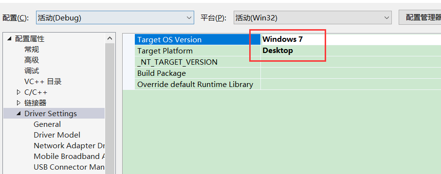
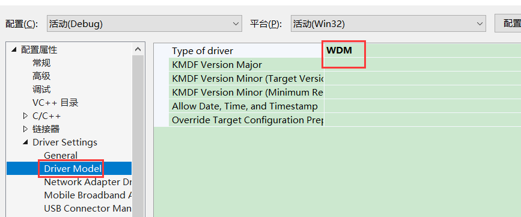
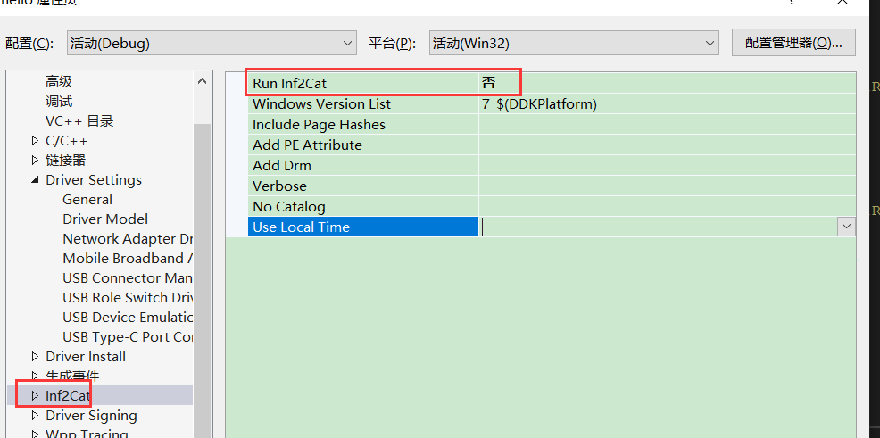
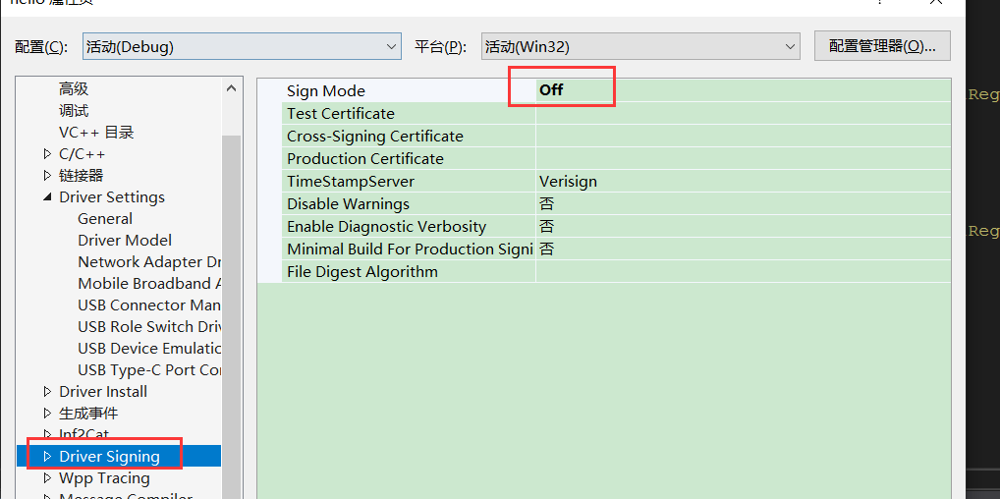
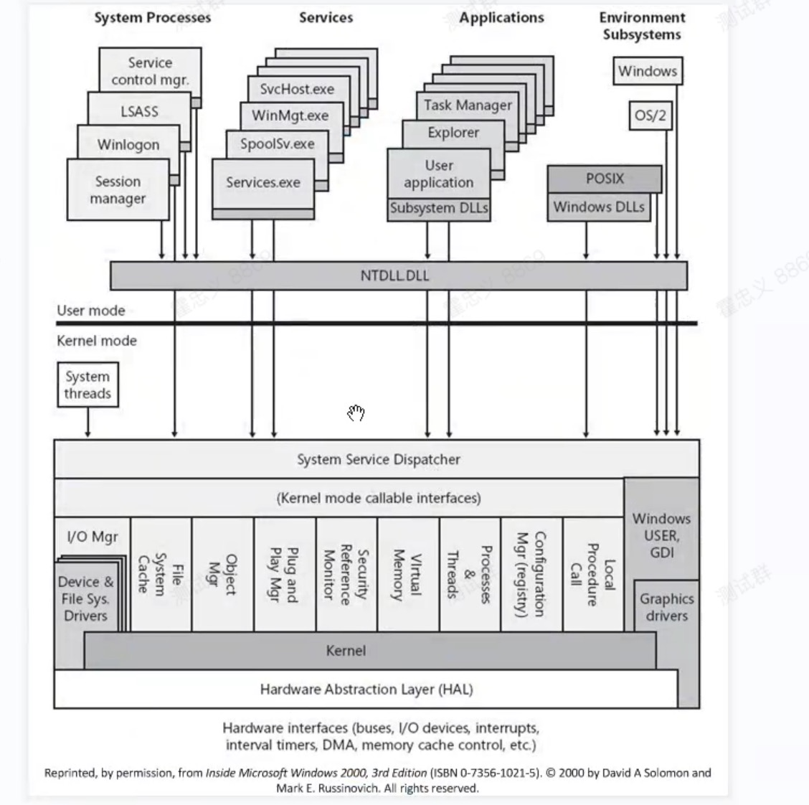

### 驱动框架简化

```c++
--------------------------Drv.h--------------------------------
#pragma once

extern "C" {

#include <Ntddk.h>
#include <stddef.h>

#define DEVICE_NAME  L"\\Device\\51asm"
#define SYMBOL_NAME L"\\DosDevices\\51asm"

//定义控制码
#define MY_CODE_BASE 0x800
#define MY_CTL_CODE(code) CTL_CODE(FILE_DEVICE_UNKNOWN, MY_CODE_BASE + code, METHOD_BUFFERED, FILE_ANY_ACCESS)
#define IOCTL_GET_REG1 MY_CTL_CODE(0)
#define IOCTL_GET_REG2 MY_CTL_CODE(1)
#define IOCTL_GET_REG3 MY_CTL_CODE(2)
#define IOCTL_SET_REG1 MY_CTL_CODE(3)
#define IOCTL_SET_REG2 MY_CTL_CODE(4)
#define IOCTL_SET_REG3 MY_CTL_CODE(5)
//......


NTSTATUS DriverEntry(__in struct _DRIVER_OBJECT* DriverObject,
  __in PUNICODE_STRING  RegistryPath);


VOID Unload(__in struct _DRIVER_OBJECT* DriverObject);

NTSTATUS DispatchCreate(
  _In_ struct _DEVICE_OBJECT* DeviceObject,
  _Inout_ struct _IRP* Irp
);

NTSTATUS DispatchClose(
  _In_ struct _DEVICE_OBJECT* DeviceObject,
  _Inout_ struct _IRP* Irp
);


NTSTATUS DispatchControl(
  _In_ struct _DEVICE_OBJECT* DeviceObject,
  _Inout_ struct _IRP* Irp
);


#pragma alloc_text( "INIT", DriverEntry)
#pragma alloc_text( "PAGE", Unload)
#pragma alloc_text( "PAGE", DispatchCreate)
#pragma alloc_text( "PAGE", DispatchClose)
#pragma alloc_text( "PAGE", DispatchControl)

}


--------------------------Drv.cpp--------------------------------
#include "Drv.h"


/*驱动卸载函数 clean_up*/
VOID Unload(__in struct _DRIVER_OBJECT* DriverObject)
{
  DbgPrint("[51asm] Unload! DriverObject:%p\n", DriverObject);


  //删除符号链接
  UNICODE_STRING ustrSymbolName;
  RtlInitUnicodeString(&ustrSymbolName, SYMBOL_NAME);
  IoDeleteSymbolicLink(&ustrSymbolName);

  //删除设备
  if (DriverObject->DeviceObject != NULL)
    IoDeleteDevice(DriverObject->DeviceObject);
}


/*1.驱动入口函数*/
 NTSTATUS DriverEntry(
  __in struct _DRIVER_OBJECT* DriverObject,
  __in PUNICODE_STRING  RegistryPath)
{
   UNREFERENCED_PARAMETER(RegistryPath);

  DbgPrint("[51asm] DriverEntry DriverObject:%p\n", DriverObject);

  //CheckAddr();

  //2.创建设备
  UNICODE_STRING ustrDevName;
  RtlInitUnicodeString(&ustrDevName, DEVICE_NAME);

  PDEVICE_OBJECT pDevObj = NULL;
  NTSTATUS Status = IoCreateDevice(DriverObject,
                                  0, 
                                  &ustrDevName, 
                                  FILE_DEVICE_UNKNOWN,
                                  FILE_DEVICE_SECURE_OPEN, 
                                  FALSE, //独占
                                  &pDevObj);
  if (!NT_SUCCESS(Status)) {
    DbgPrint("[51asm] IoCreateDevice Error Status:%p\n", Status);
    return Status;
  }
  DbgPrint("[51asm] IoCreateDevice OK pDevObj:%p\n", pDevObj);

  //设置设备的缓冲区通讯方式
  pDevObj->Flags |= DO_BUFFERED_IO; //缓冲区通讯方式


  //创建符号链接
  UNICODE_STRING ustrSymbolName;
  RtlInitUnicodeString(&ustrSymbolName, SYMBOL_NAME);
  Status = IoCreateSymbolicLink(&ustrSymbolName, &ustrDevName);
  if (!NT_SUCCESS(Status)) {
    DbgPrint("[51asm] IoCreateSymbolicLink Error Status:%p\n", Status);
    if (pDevObj != NULL)
      IoDeleteDevice(pDevObj);

    return Status;
  }
  DbgPrint("[51asm] IoCreateSymbolicLink %wZ OK\n", &ustrSymbolName);


  //3.注册派遣函数
  DriverObject->MajorFunction[IRP_MJ_CREATE] = &DispatchCreate;
  DriverObject->MajorFunction[IRP_MJ_CLOSE] = &DispatchClose;
  DriverObject->MajorFunction[IRP_MJ_DEVICE_CONTROL] = &DispatchControl;


  //4.注册卸载函数
  DriverObject->DriverUnload = Unload;

  return STATUS_SUCCESS;
}

/*
IRP  I/O Request Packet
*/
NTSTATUS DispatchCreate(_DEVICE_OBJECT* DeviceObject, _IRP* Irp)
{
  UNREFERENCED_PARAMETER(DeviceObject);
  UNREFERENCED_PARAMETER(Irp);

  /* __asm {in, out} in al, 60h*/
  DbgPrint("[51asm] %s pid:%d\n", __FUNCTION__, PsGetCurrentProcessId());

  //完成请求
  Irp->IoStatus.Status = STATUS_SUCCESS;
  Irp->IoStatus.Information = 0; //成功操作的字节数
  IoCompleteRequest(Irp, IO_NO_INCREMENT);

  return STATUS_SUCCESS;
}

NTSTATUS DispatchClose(_DEVICE_OBJECT* DeviceObject, _IRP* Irp)
{
  UNREFERENCED_PARAMETER(DeviceObject);

  DbgPrint("[51asm] %s\n", __FUNCTION__);

  Irp->IoStatus.Status = STATUS_SUCCESS;
  Irp->IoStatus.Information = 0; 
  IoCompleteRequest(Irp, IO_NO_INCREMENT);

  return STATUS_SUCCESS;
}

NTSTATUS DispatchControl(_DEVICE_OBJECT* DeviceObject, _IRP* Irp)
{
  UNREFERENCED_PARAMETER(DeviceObject);

 //获取当前IRP堆栈
  PIO_STACK_LOCATION pIrpStack = IoGetCurrentIrpStackLocation(Irp);

  //获取用户的缓冲区
  PVOID pBuffer = Irp->AssociatedIrp.SystemBuffer;
  ULONG nLength = pIrpStack->Parameters.DeviceIoControl.OutputBufferLength;
  ULONG nIoControlCode = pIrpStack->Parameters.DeviceIoControl.IoControlCode;

  DbgPrint("[51asm] %s nIoControlCode:%p pInputBuffer:%p nInputLength:%d pOutBuffer:%p nOutLength:%d\n", __FUNCTION__,
    nIoControlCode, pBuffer, nLength);


  ULONG nSize = 0;
  switch(nIoControlCode) {
  case IOCTL_GET_REG1:
    break;
  case IOCTL_GET_REG2:
    break;
  default:
    break;
  }

  Irp->IoStatus.Status = STATUS_SUCCESS;
  Irp->IoStatus.Information = nSize;
  IoCompleteRequest(Irp, IO_NO_INCREMENT);
  return STATUS_SUCCESS;
}

```

#### 设置









### 驱动的安装和卸载

驱动一般不会让用户来安装和卸载,一单是用户点击的时候自动安装和卸载

#### 一般的步骤

1.  安装
2.  使用
3.  卸载

#### 安装

驱动安装方法要根据类型来决定

**驱动安装有好几种办法,要看是什么驱动** 

驱动有三种类型安装方式也有所不同:

1.NT驱动   => 服务的方式安装

2.WDM驱动  => inf文件安装

3.WDF驱动  => inf文件安装   


NT驱动就是之前手动写的那种

WDM驱动是那种即插即用的,插上就安装,拔掉就卸载

WDF驱动是新一代的,是以面向对象的编程,在NT或者WDM里都是注册回调来处理事件,WDF类似于通过C++虚函数来完成回调函数的响应,纯面向对象的


一般内核都是NT驱动,WDM和WDF更适合硬件驱动

WDM和NT驱动最大的区别就在于动态添加设备

WDM方式是通过AddDevice函数来添加设备的而NT是在DriverEntry直接就创建了,不管设备存在不存在

 **驱动对于操作系统来说是一个服务,系统认为驱动就是服务** 

-   3环服务程序的入口是`**ServiceMain**`
-   服务程序也不可以双击运行,需要一套`API`来安装启动卸载,所以驱动要创建服务就用对应的`API`,可以像安装启动3环的服务程序一样,来启动驱动
-    驱动创建的服务在任务管理器里是看不见的,它是内核服务 

 服务的第一步就是创建,使用`**CreateService**`来完成 

```c
CreateService函数的重要参数
	hSCManager            //服务管理器的句柄
	lpszDriverName,       //驱动程序在注册表中的名字 (唯一的,这个名字将会写在注册表里)
	lpszDriverName,       //注册表驱动程序的DisplayName值,这个和上面的写一样就行了
	SERVICE_ALL_ACCESS    //加载驱动程序的访问权限
	SERVICE_KERNEL_DRIVER //表示加载的服务的驱动程序
	SERVICE_DEMAND_START  //注册表驱动程序的Start值 ;启动方式
	SERVICE_ERROR_IGNORE  //注册表驱动程序的ErrorControl值 ;错误方式
	szDriverImagePath     //注册表驱动程序的ImagePath值
        
	ERROR_IO_PENDING      //服务错误码:服务
	ERROR_SERVICE_EXISTS  //服务错误码:服务已经存在了

    //创建服务
    SC_HANDLE hService =  CreateService(hSCManager,
                  pszDrvName, pszDrvName,//两个名称
                  SERVICE_ALL_ACCESS,//访问权限:所有
                  SERVICE_KERNEL_DRIVER,//驱动类型:内核驱动
                  SERVICE_DEMAND_START,//启动方式:手动启动
                  SERVICE_ERROR_IGNORE,//错误方式:正常
                  pszDrvPath,//驱动路径:二进制的路径,不能写相对路径
                  //这几个都是远程启动的参数,用户名密码啥的不用直接给NULL
                  NULL, NULL, NULL, NULL, NULL
    );
服务关闭是用CloseServiceHandle
```

1.  服务管理器的句柄是通过`**OpenSCManager**`来打开服务管理器

SC_HANDLE OpenSCManager(  
  LPCTSTR lpMachineName,   // 服务器地址
  LPCTSTR lpDatabaseName,  // 数据库名称(服务可以远程安装,所以这两个参数是远程所用的,没有直接给NULL)
  DWORD dwDesiredAccess    // 访问权限 SC_MANAGER_ALL_ACCESS 直接给所有权限
  );

-   打开的服务句柄不用的话就要关闭,使用`**CloseServiceHandle**`来关闭服务句柄 

2.   服务路径是不能写相对路径的,所以要把相对路径转为绝对路径用,使用`**GetFullPathName**`来转换 

DWORD GetFullPathName(  
 LPCTSTR lpFileName,   // 文件名
  DWORD nBufferLength, // 缓冲区大小
  LPTSTR lpBuffer,     // 路径缓冲区(传出参数)
  LPTSTR *lpFilePart   // 传出参数,可以给NULL
);

再次创建服务的时候,服务可能已经存在了,所以单判断服务句柄是否为`NULL`,可能是有问题的 

服务已经存在了是不能算为错误的,所以要通过GetLastError来判断一下
判断是不是 ERROR_SERVICE_EXISTS不是已经存在,才是错误

3.服务已经创建过的话就直接把它打开,使用`**OpenService**`

```
SC_HANDLE OpenService(  
  SC_HANDLE hSCManager,  // 服务管理器句柄
  LPCTSTR lpServiceName, //服务名称
  DWORD dwDesiredAccess  // 权限,可以直接给所有SERVICE_ALL_ACCESS
);
```

-   打开也有可能失败,所以还得判断一层.打开失败就直接return,但是句柄还得关,所以推荐使用goto语法,直接跳到关闭句柄的位置去关闭,然后返回
-    创建服务就是向注册表里写入了 

-   -   `HKEY_LOCAL_MACHINE->SYSTEM->CurrentControlSet->Services`里添加了一项
    -   这一项的每个值就是上面创建所填的信息

4.创建完毕/打开完毕后就是启动,启动是通过`**StartService**`来完成 

BOOL StartService(  
 SC_HANDLE hService,             // 服务句柄
  DWORD dwNumServiceArgs,        // 服务参数 就是给ServiceMain要不要传递参数 没有就给NULL
  LPCTSTR* lpServiceArgVectors   // NULL
);

```c++
//安装驱动
int Install(const char* pszDrvName, const char* pszDrvPath) {
    SC_HANDLE hSCManager = NULL;    //服务管理器句柄
    SC_HANDLE hService = NULL;      //服务句柄
    char szBinPath[MAX_PATH];       //路径缓冲区
    szBinPath[0] = '\0';            //路径初始化一下
    int nResult = 0;                //返回值
    //相对路径转绝对路径
    if (GetFullPathName(pszDrvPath, sizeof(szBinPath), szBinPath, NULL) == 0) {
        ShowErrorMsg("GetFullPathName");
        nResult = -1;
        goto FAILD;
    }
    printf("[+]GetFullPathName %s\n", szBinPath);
    //打开服务管理器
    hSCManager = OpenSCManager(NULL, NULL, SC_MANAGER_ALL_ACCESS);
    if (hSCManager == NULL) {   //检查
        ShowErrorMsg("OpenSCManager");
        nResult = -2;
        goto FAILD;
    }
    printf("[+]OpenSCManager SUCCESS hSCM = %p\n", hSCManager);
    //创建服务
    hService = CreateService(hSCManager,
        pszDrvName, pszDrvName, //两个名称
        SERVICE_ALL_ACCESS,     //访问权限:所有
        SERVICE_KERNEL_DRIVER,  //驱动类型:内核驱动
        SERVICE_DEMAND_START,   //启动方式:手动启动(一般不建议自动启动)
        SERVICE_ERROR_IGNORE,   //错误方式:正常
        szBinPath,              //驱动路径:二进制的路径,不能写相对路径
        NULL, NULL, NULL, NULL, NULL  //这几个都是远程启动的参数,用户名密码啥的不用直接给NULL
    );
    if (hService == NULL) {     //检查
        if (GetLastError() != ERROR_SERVICE_EXISTS) {  //判断错误原因是否是已存在
            ShowErrorMsg("CreateService");
            nResult = -3;
            goto FAILD;
        }
        else {
            //如果已存在就直接打开服务
            hService = OpenService(hSCManager, pszDrvName, SERVICE_ALL_ACCESS);
            if (hService == NULL) {
                ShowErrorMsg("OpenService");
                nResult = -4;
                goto FAILD;
            }
            printf("[+]OpenService SUCCESS hService = %p\n", hService);
        }
    }
    else {
        printf("[+]CreateService SUCCESS hService = %p\n", hService);
    }
    //启动服务
    if (StartService(hService, NULL, NULL)) {
        printf("[+]StartService SUCCESS\n");
    }
    else {
        ShowErrorMsg("StartService");
    }
FAILD:
    //关闭句柄,一般先关服务,在关SCM
    if (hService != NULL) {
        CloseServiceHandle(hService);
    }
    if (hSCManager != NULL) {
        CloseServiceHandle(hSCManager);
    }
    return nResult;
}
```

#### 卸载

驱动卸载就是服务卸载,只有一个函数`**DeleteService**` 

BOOL DeleteService(  
  SC_HANDLE hService   // 服务句柄
 );
服务关闭需要服务句柄,所以还需要在打开一次,就是上面的流程再来一次,只是不用在创建了也不需要启动了,直接打
开然后关闭;
至于不把服务句柄改为全局的是因为如果打开不关闭的话就会资源浪费

删除服务之前要先停止服务,停止服务是没有`API`的,没有Stop这样的,但是它有一个控制的`API`**,ControlService**

BOOL ControlService(  
  SC_HANDLE hService,               // 服务句柄
  DWORD dwControl,                  // 控制码,选择SERVICE_CONTROL_STOP停止
  LPSERVICE_STATUS lpServiceStatus  // 服务之前状态
 );

-   停止失败也得通过`**GetLastError()**`来判断,因为可能服务压根就没启动,没启动停止的话就不算失败,或者停止失败不管了,失败也删除
-    至此驱动加载卸载就完成了,然后就可以使用了 

```c++
//卸载驱动
void Unload(const char* pszDrvName) {
    SC_HANDLE hSCManager = NULL;    //服务管理器句柄
    SC_HANDLE hService = NULL;    //服务句柄
    //因此句柄肯定存在,所以打开服务管理器就可以了
    hSCManager = OpenSCManager(NULL, NULL, SC_MANAGER_ALL_ACCESS);
    if (hSCManager == NULL) {
        ShowErrorMsg("OpenSCManager");
        goto FAILD;
    }
    printf("[+]OpenSCManager SUCCESS hSCM = %p\n", hSCManager);
    hService = OpenService(hSCManager, pszDrvName, SERVICE_ALL_ACCESS);
    if (hService == NULL) {
        ShowErrorMsg("OpenService");
        goto FAILD;
    }
   
    //删除之前必须先停止服务
    SERVICE_STATUS Status;//服务状态
    ControlService(hService, SERVICE_CONTROL_STOP, &Status);    //停止服务
    //删除服务
    if (DeleteService(hService)) {
        printf("[+]DeleteService SUCCESS\n");
    }
    else {
        ShowErrorMsg("DeleteService");
    }
FAILD:
    //关闭句柄,一般先关服务,在关SCM
    if (hService != NULL) {
        CloseServiceHandle(hService);
    }
    if (hSCManager != NULL) {
        CloseServiceHandle(hSCManager);
    }
}
```

#### 完整源码DrvInstall

```c++
#include <stdio.h>
#include <Windows.h>
#include <stdlib.h>
#include <winioctl.h>
#include <winsvc.h>

#define DRV_NAME "51asm"         //设备名 
#define DRV_PATH ".\\Drv.sys"    //设备路径(当前路径)
#define DEV_NAME "\\\\?\\51asm"  //符号名


//控制码
#define MY_CODE_BASE 0x800
#define MY_CTL_CODE(code) \
	CTL_CODE(FILE_DEVICE_UNKNOWN, MY_CODE_BASE + code, METHOD_BUFFERED, FILE_ANY_ACCESS)
#define IOCTL_GET_REG1 MY_CTL_CODE(0)
#define IOCTL_SET_REG1 MY_CTL_CODE(2)

//错误信息
void ShowErrorMsg(const char* pszName)
{
    LPVOID lpMsgBuf;
    FormatMessage(
        FORMAT_MESSAGE_ALLOCATE_BUFFER |
        FORMAT_MESSAGE_FROM_SYSTEM |
        FORMAT_MESSAGE_IGNORE_INSERTS,
        NULL,
        GetLastError(),
        MAKELANGID(LANG_NEUTRAL, SUBLANG_DEFAULT), // Default language
        (LPTSTR)&lpMsgBuf,
        0,
        NULL
    );
    printf("[-]%s :%s\n", pszName, (LPCTSTR)lpMsgBuf);
    // Free the buffer.
    LocalFree(lpMsgBuf);
}
//安装驱动
int Install(const char* pszDrvName, const char* pszDrvPath) {
    SC_HANDLE hSCManager = NULL;    //服务管理器句柄
    SC_HANDLE hService = NULL;      //服务句柄
    char szBinPath[MAX_PATH];       //路径缓冲区
    szBinPath[0] = '\0';            //路径初始化一下
    int nResult = 0;                //返回值
    //相对路径转绝对路径
    if (GetFullPathName(pszDrvPath, sizeof(szBinPath), szBinPath, NULL) == 0) {
        ShowErrorMsg("GetFullPathName");
        nResult = -1;
        goto FAILD;
    }
    printf("[+]GetFullPathName %s\n", szBinPath);
    //打开服务管理器
    hSCManager = OpenSCManager(NULL, NULL, SC_MANAGER_ALL_ACCESS);
    if (hSCManager == NULL) {   //检查
        ShowErrorMsg("OpenSCManager");
        nResult = -2;
        goto FAILD;
    }
    printf("[+]OpenSCManager SUCCESS hSCM = %p\n", hSCManager);
    //创建服务
    hService = CreateService(hSCManager,
        pszDrvName, pszDrvName, //两个名称
        SERVICE_ALL_ACCESS,     //访问权限:所有
        SERVICE_KERNEL_DRIVER,  //驱动类型:内核驱动
        SERVICE_DEMAND_START,   //启动方式:手动启动(一般不建议自动启动)
        SERVICE_ERROR_IGNORE,   //错误方式:正常
        szBinPath,              //驱动路径:二进制的路径,不能写相对路径
        NULL, NULL, NULL, NULL, NULL  //这几个都是远程启动的参数,用户名密码啥的不用直接给NULL
    );
    if (hService == NULL) {     //检查
        if (GetLastError() != ERROR_SERVICE_EXISTS) {  //判断错误原因是否是已存在
            ShowErrorMsg("CreateService");
            nResult = -3;
            goto FAILD;
        }
        else {
            //如果已存在就直接打开服务
            hService = OpenService(hSCManager, pszDrvName, SERVICE_ALL_ACCESS);
            if (hService == NULL) {
                ShowErrorMsg("OpenService");
                nResult = -4;
                goto FAILD;
            }
            printf("[+]OpenService SUCCESS hService = %p\n", hService);
        }
    }
    else {
        printf("[+]CreateService SUCCESS hService = %p\n", hService);
    }
    //启动服务
    if (StartService(hService, NULL, NULL)) {
        printf("[+]StartService SUCCESS\n");
    }
    else {
        ShowErrorMsg("StartService");
    }
FAILD:
    //关闭句柄,一般先关服务,在关SCM
    if (hService != NULL) {
        CloseServiceHandle(hService);
    }
    if (hSCManager != NULL) {
        CloseServiceHandle(hSCManager);
    }
    return nResult;
}
//卸载驱动
void Unload(const char* pszDrvName) {
    SC_HANDLE hSCManager = NULL;    //服务管理器句柄
    SC_HANDLE hService = NULL;    //服务句柄
    //因此句柄肯定存在,所以打开服务管理器就可以了
    hSCManager = OpenSCManager(NULL, NULL, SC_MANAGER_ALL_ACCESS);
    if (hSCManager == NULL) {
        ShowErrorMsg("OpenSCManager");
        goto FAILD;
    }
    printf("[+]OpenSCManager SUCCESS hSCM = %p\n", hSCManager);
    hService = OpenService(hSCManager, pszDrvName, SERVICE_ALL_ACCESS);
    if (hService == NULL) {
        ShowErrorMsg("OpenService");
        goto FAILD;
    }
   
    //删除之前必须先停止服务
    SERVICE_STATUS Status;//服务状态
    ControlService(hService, SERVICE_CONTROL_STOP, &Status);    //停止服务
    //删除服务
    if (DeleteService(hService)) {
        printf("[+]DeleteService SUCCESS\n");
    }
    else {
        ShowErrorMsg("DeleteService");
    }
FAILD:
    //关闭句柄,一般先关服务,在关SCM
    if (hService != NULL) {
        CloseServiceHandle(hService);
    }
    if (hSCManager != NULL) {
        CloseServiceHandle(hSCManager);
    }
}
int main()
{
    HANDLE hFile = INVALID_HANDLE_VALUE;   //文件句柄
    int nReg = 0; //参数
    DWORD dwBytes = 0;//成功字节数
    /**安装**/
    int nRet = 0;
    nRet = Install(DRV_NAME, DRV_PATH);
    if (nRet != 0) {
        return nRet;
    }
    /**使用**/
    //打开文件
    hFile = CreateFile(
        DEV_NAME,
        GENERIC_ALL,
        0,
        NULL,
        OPEN_EXISTING,//驱动只能打开已存在的,不能创建新的
        FILE_ATTRIBUTE_NORMAL, NULL
    );
    //判断是否打开成功
    if (hFile == INVALID_HANDLE_VALUE) {
        ShowErrorMsg("CreateFile"); //显示错误信息
        goto FAILE;
    }
    else {
        printf("hFile = %p\n", hFile);
    }
    //调用驱动控制函数
    DeviceIoControl(hFile, IOCTL_SET_REG1, &nReg, sizeof(nReg), NULL, 0, &dwBytes, NULL);
    //关闭文件
    if (hFile != NULL) {
        CloseHandle(hFile);
    }
FAILE:
    /***卸载***/
    Unload(DRV_NAME);
    system("pause");
    return 0;
}
```

### 内核 API 介绍

操作系统架构图



-   Configuration就是配置管理器，配置管理就是注册表。然后进程线程管理。然后虚拟内存管理、安全管理。然后还有对象管理文件系统。那这每个管理他都会提供一些内核API给你操作这些模块的功能。
-   当然我们本身的内核驱动也属于这个内核当中的一个模块。

####  内核`API`分类

对象管理器(ObXxx)

内存管理器(MmXxx)

进程线程管理器(PsXxx)

I/O管理器(IoXxx)

电源管理器(PoXxx) ;这个是硬件的,所以一般用的少

配置管理器(CmXxx)

核心层API(KeXxx)

执行层API(ExXxx)

运行库(Rtl)

ZwXXX

NtXXX


#### 内核内存检测`API`

在内核当中,只要内存访问`C05`了就直接蓝屏了,所以在内核当中每访问任何一个内存地址都必须严格的检测 

在3环的时候经常是if(p == NULL)这样的.

但是在内核当中不可以这样操作,因为 0 也算一个地址,而且0地址在malloc里是可以被申请到的

也就是在内核当中0地址1地址2地址等都可以让它有效

至于如何得知这个地址是否有效,就要通过内核提供的API来检测了


​        但是有时候用内存检测`API`去检测是否有效,也是有可能出错的,因为微软有的的api写的有漏洞,但是有总比没有好 

-    地址分为用户地址和内核地址 

这两个地址的检测是不一样的,3环有3环的检测,0环有0环的检测
用户地址范围:0x00000000 ~ 0x7FFFFFFF 或者 0x00000000 ~ 0xBFFFFFFF
内核地址范围:0x80000000 ~ 0xFFFFFFFF 或者 0xBFFFFFFF ~ 0xFFFFFFFF
不一定高2G是内核的空间,是可以通过系统的设置,可以设置3环地址的是3个G,内核是一个G,也可以设置成两边都是
2G,正常开机是2G共享(3环),2G不共享(内核).

##### 内核地址检测`MmIsAddressValid` 

BOOLEAN MmIsAddressValid(
    IN PVOID  VirtualAddress
);

3环地址检测`ProbeForRead`和`ProbeForWrite`

```C++
//检查这个3环的地址能不能读or能不能写,这两个函数智能检测3环地址,不能检测内核地址

    //检查是否可读
VOID ProbeForRead(
    IN CONST VOID  *Address,
    IN SIZE_T  Length,
    IN ULONG  Alignment
);


//检查是否可写
VOID ProbeForWrite(
    IN CONST VOID  *Address,
    IN SIZE_T  Length,
    IN ULONG  Alignment
);

这函数也没有返回值,得用一个非标准的try来catch
    就是 
char *p = NULL; //3环地址
__try {
    //如果访问这个p空指针的话,就回产生异常
    ...
    ProbeForWrite(Buffer, BufferSize, BufferAlignment);

    } __except (EXCEPTION_EXECUTE_HANDLER) {
    /* Error handling code. */
}
```

 所以在写内核驱动的时候一般都是先`__try`,避免访问3环出错


#### 对象管理器(`Obxxx`)

##### 什么是对象:

比如在3环使用的句柄,调一些API都得传递句柄,而每个句柄对应的就是一个内核对象

所以在内核里面一般都是操作对象而不是操作句柄.可以直接操作对象;

比如打开文件就是一个文件句柄,这个句柄就对应内核的一个文件对象

在内核里既可以操作句柄也可以操作对象;打开两个一般是两个句柄,但可能就一个对象

##### 操作对象注意点

对象是由操作系统来创建的 

每个内核对象都有一个引用计数器,如果引用计数不对,就直接蓝屏了 

-   用就引用计数+1
-   不用就引用计数-1

通过`API`来操作对象的引用计数 

如果一个对象不增加引用计数直接使用的话,就会直接蓝屏,而且可能找不到bug

**ObReferenceObject           增加对象引用计数**

**ObDereferenceObject       减少对象引用计数**

 它也提供了通过句柄获取对象的函数`**ObReferenceObjectByHandle**`

注意:  操作驱动对象不需要引用计数 +1


#### 内存管理器(`Mmxxx`)

之前也有用过内存管理的一些`API` 

比如:MmGetSystemAddressForMdlSafe()  //获取Mdl的地址
以及上面所说的 MmIsAddressValid()     检查内存地址
都是由内存管理器所负责的

比较常用的是`**MmMapIoSpace**`,用来直接操作物理内存条 

```c++
PVOID MmMapIoSpace(
    IN PHYSICAL_ADDRESS  PhysicalAddress,  //物理地址
    IN SIZE_T  NumberOfBytes,              //大小
    IN MEMORY_CACHING_TYPE  CacheType
);

只要把物理地址传递给它,它就会传出一个虚拟地址,操作这个虚拟地址就等价于操作物理内存条了
但是物理地址可能是超过虚拟内存大小比如虚拟内存一个进程是0~4G,但是可能内存条装了32G,所以物理内存条的地址一般都是64位的,所以物理地址是用一个结构体来描述的 PHYSICAL_ADDRESS

struct {
    ULONG LowPart;
    LONG HighPart;
} DUMMYSTRUCTNAME;
```

#### 进程线程管理(`Psxxx`)

一些常用`API` 

PsGetCurrentProcessId ;获取当前进程ID
PsGetCurrentThreadId  ;获取当前线程ID


 在内核里拿ID也没啥意义,都是获取对象,获取对象后就拿到它所有信息了 

PsGetCurrentProcess      获取当前进程对象
PsGetCurrentThread       获取当前线程对象
PsGetVersion             获取系统版本;有时候内核驱动要和系统版本匹配,所以就获取一下看看

#### I/O管理器(`IoXxx`)

 创建设备删除设备啥的都是`I/O`管理器来负责的 

 驱动通讯相关都是由它来负责 

IoCreateDevice;     创建设备
IoAttachDevice;     替换设备,可以把别的驱动替换成自己的

#### 配置管理器(`CmXxx`)

配置就是注册表(注册表属于系统配置)

它的函数很少,基本上没啥可用的,不是重点


#### 核心层`API`(`Kexxx`)

在内核设计里有一层是核心层   有一层是执行层,主要代码就在这两层里 

 同步对象之类(临界区,信号量事件对象等)的就在这里,还有定时器 

KeWaitForSingleObject     等待同步对象,在3环里等待的是句柄,这里等待的是对象
KeBugCheck;               调用这个函数就蓝屏...;它还有个EX版本,可以写更多参数

#### 执行层`API`(`ExXxx`)

堆空间的管理就在这里 

ExAllocatePool    申请堆空间
ExFreePool        释放堆空间

它里面也有一些同步对象,比如延迟锁,原子锁之类的 

包括上面的`ProbeForWrite`也属于这里 


#### 运行库(`Rtl`)

它里面包含了字符串函数,内存操作以及数据结构 

链表操作:
InitializeListHead;   初始化链表
IsListEmpty;          判断链表是否为空
PushEntryList;        压一个链表项
PopEntryList;         弹出链表项
RemoveEntryList;      删除一个链表

##### 链表使用示例 

-    内核的链表不能使用`STL`,但是链表的数据结构又是不确定的,所以它用C语言来实现了`STL`的功能 
-   链表和数据类型是没有关系的,它只要维护好前驱后继就行了 

```c++
首先先定义一个结构体
typedef struct _LIST_ENTRY {
	struct _LIST_ENTRY  *Flink;
	struct _LIST_ENTRY  *Blink;
} LIST_ENTRY, *PLIST_ENTRY;

这个结构体只有前驱和后记,没有数据成员

insert(_LIST_ENTRY);
remove(_LIST_ENTRY)

所以提供的插入删除等方法就对这个结构体操作就行了
要加数据的话,就定义自己的结构体,将这个结构体作为成员来操作
```

双向循环链表

```c++
#include <stddef.h>

struct Point {
  int x;
  int y;
  LIST_ENTRY entry;  //链表结构体作为数据成员
};

Point head;   //定义链表头

void List() {
  InitializeListHead(&head.entry);  //初始化链表头

     
  //申请一个链表节点
  Point *pNode = (Point*)ExAllocatePoolWithTag(PagedPool, sizeof(Point),  '1234');
  RtlZeroMemory(pNode, sizeof(Point));  //初始化链表节点
  pNode->x = 1;
  pNode->y = 1;
  DbgPrint("[51asm] pNode:%p\n", pNode);
  InsertTailList(&head.entry, &pNode->entry);   //往尾部插入节点
  DbgPrint("[51asm] Flink:%p Blink:%p\n", head.entry.Flink, head.entry.Blink);

  //申请一个链表节点
  pNode = (Point*)ExAllocatePoolWithTag(PagedPool, sizeof(Point), '1234');
  RtlZeroMemory(pNode, sizeof(Point));  //初始化链表节点
  pNode->x = 2;
  pNode->y = 2;
  DbgPrint("[51asm] pNode:%p\n", pNode);
  InsertTailList(&head.entry, &pNode->entry);   //往尾部插入节点
  DbgPrint("[51asm] Flink:%p Blink:%p\n", pNode->entry.Flink, pNode->entry.Blink);

  //遍历
  LIST_ENTRY* pHead = &head.entry;
  LIST_ENTRY* pBegin = &head.entry;
  while (pHead != NULL) {
    pNode = (Point*)((char*)pHead - offsetof(struct Point, entry));   //强转
    DbgPrint("[51asm] x=%d y=%d\n", pNode->x, pNode->y);              //显示内容
    pHead = pHead->Blink;   //指向下一项
    if (pHead == pBegin)
    {
       break;
    }
  }

  //释放链表
  pHead = &head.entry;
  pBegin = &head.entry;
  while (pHead != NULL)
  {
    pNode = (Point*)((char*)pHead - offsetof(struct Point, entry));   //强转
    pHead = pHead->Blink;    //指向下一项
    ExFreePool(pNode);      //释放节点
    if (pHead == pBegin)
    {
      break;
    }
  }
}


```

上面的代码有bug,没解决


#### `ZwXXX`

`Zw`意思就是跟3环`API`一致功能的函数 

-   比如3环有个`CreateFile`,那么内核相对应的就是`ZwCreateFile`
-   功能等价,但是效果不一样,`Zw`参数更多,3环打不开的,内核就能打开

ZwEnumerateKey;	         遍历注册表
ZwOpenFile;              打开文件
ZwQueryInfomationFile;   查询文件信息
ZwUnlockFile;            解锁文件
ZwUnloadDriver;	         解锁驱动
ZwOpenProcess;           打开进程
ZwTerminateProcess;      结束进程

-   但是不提供`UI`的 

#### `NtXXX`

 `Nt`是比`Zw`更底层的`API` 

  有`Zwxxx`就有`Ntxxx` 

比如有   ZwCreateFile  就有个    NtCreateFile

3环调   CreateFile   最终在内核里调的还是    NtCreateFile

而  ZWCreatefile  最终还是调   NtCreateFile

##### `Zw`和`Nt`的区别 

例如 ZwCreateFile,它会对参数做检查而 NtCreateFile 是不检查的

所以选择调NtCreateFile很多参数要自己检查,要不然就调ZwCreateFile...

很多参数自己也不知道怎么检查,所以还是调用Zw好一些

`Nt`才是真正的实现代码,而`Zw`只是做一些检测


### `ARK`

病毒或者恶意软件都叫做Rookit; 病毒通过内核驱动去干活

如果要做保护就是用驱动进内核去检测内核里有没有恶意代码

所以一般叫做Anti Rookit,缩写就是ARK

检测恶意代码的工具一般叫做ARK工具

常见的ARK工具有PCHunter 火绒剑   WinAST OpenArk

### 

### 

### 作业:ARK工具

##### 1）实现遍历文件功能

##### 2）实现遍历注册表功能

[ARK.ZIP](./ark.zip)

