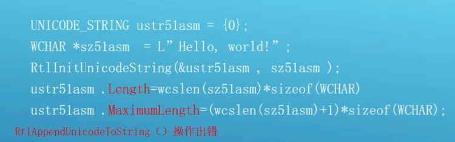
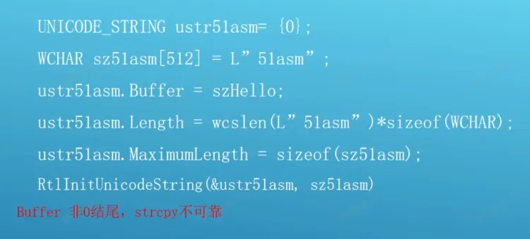
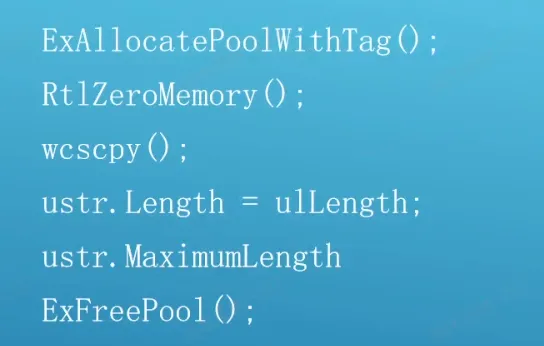
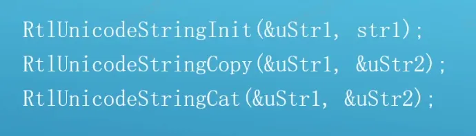
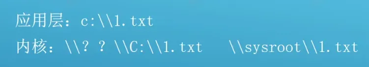
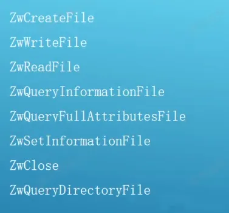
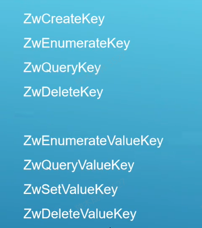
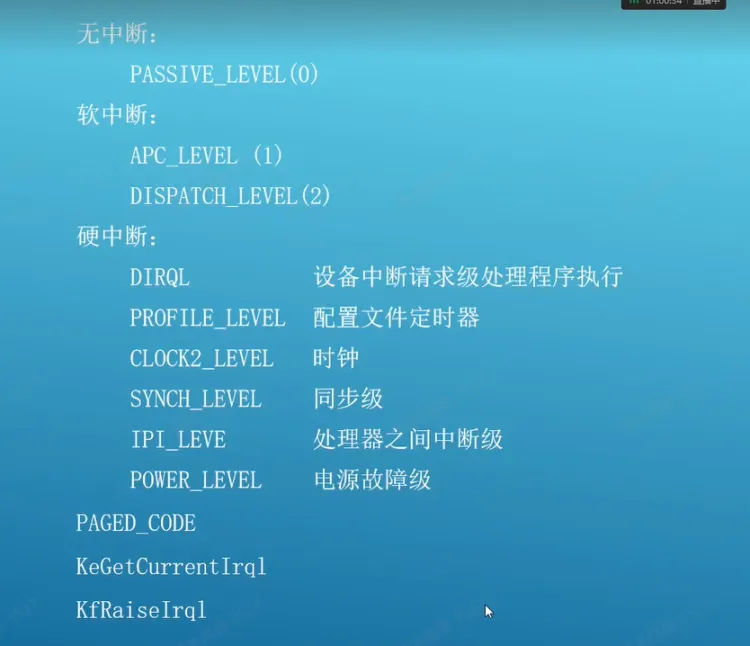
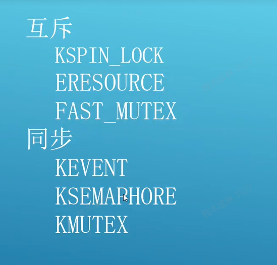

3环用的 c盘,d盘......等是符号链接,并不是路径

RtlInitUnicodeString 只适用于常量初始化,而不适用于变量


在写内核驱动是,任何警告都当作错误

不要随便修改错误等级

### 字符串操作

RtlInitUnicodeString(&uStrl, strl);           //字符串初始化
RtlCopyUnicodeString(&uStrl, &uStr2);         //字符串拷贝
RtlAppendUnicodeToString(&uStrl, strl);       //字符串追加
RtlAppendUnicodeStringToString(&uStrl, &uStr2);      //字符串拼接
RtlCompareUnicodeString(&uStrl, &uStr2,TRUE/FALSE);  //字符串比较
RtlAnsiStringToUnicodeString(&uStrl, &uStr2,TRUE/FALSE);  //字符串转化
RtlFreeUnicodeString(&uStrl)                  //字符串释放


内核中经常 用 UNICODE_STRING   和  ANSI_STRING 来定义字符串,区别是参数缓冲区 是 UCHAR* 还是  PCHAR*,但是  ANSI_STRING  用的比较少,基本都是用  UNICODE_STRING   

```c++
我们字符串初始化是用   RtlInitUnicodeString(&usstrName, L"init");  //只适合初始化常量
具体步骤是

usstrName.Buffer = L"init";
USHORT nLen = (USHORT)wcslen(L"init");
usstrName.Length = nLen;
usstrName.MaximumLength = nLen + 1;

但是上面代码是有问题的,会蓝屏,因为  wcslen 求得字符长度,而 Length 和  MaximumLength 是要填缓冲区大小,因此

usstrName.Buffer = L"init";
USHORT nLen = (USHORT)wcslen(L"init");
usstrName.Length = nLen * sizeof(WCHAR);
usstrName.MaximumLength = (nLen + 1) * sizeof(WCHAR);
等价于
RtlInitUnicodeString(&usstrName, L"init");  
```

内核字符串并不是 '\0' 结尾,如果是传指针 

```c++
void String(WCHAR p) {

    UNICODE_STRING usstrName;

    usstrName.Buffer = L"init";
    USHORT nLen = (USHORT)wcslen(p));
    usstrName.Length = nLen;
    usstrName.MaximumLength = nLen + 1;

}
那么上面代码将会崩,因此要用一个api RtlStringCbCat 保证缓冲区大小,这时候就要自己初始化,不能用  RtlInitUnicodeString
```

RtlAppendUnicodeToString 注意事项

 RtlAppendUnicodeToString(&usstrName, L"Hello");  //字符串在常量区,不能直接修改
可以申请空间拷贝一下

#### 申请空间

##### 栈空间

```c++
WCHAR szBuf[260] = L"init";
usstrName.Buffer = szBuf;
USHORT nLen = (USHORT)wcslen(szBuf);
usstrName.Length = nLen * sizeof(WCHAR);
usstrName.MaximumLength = sizeof(szBuf);  这里大小是 260 * 2   

//字符串在常量区,不能直接修改,缓冲区不够大也可能拼不上
RtlAppendUnicodeToString(&usstrName, L"Hello"); 

DbgPrint("[51asm] %s  usstrName:%wZ\n", __FUNCTION__ ,&usstrName);
```

##### 堆空间

```c++
usstrName.Buffer = (PWCHAR)ExAllocatePoolWithTag(PagedPool,0x1000,'4321');
RtlStringCbCopyW(usstrName.Buffer, 0x1000, L"Init");
USHORT nLen = (USHORT)wcslen(usstrName.Buffer);
usstrName.Length = nLen * sizeof(WCHAR);
usstrName.MaximumLength = 0x1000;
RtlAppendUnicodeToString(&usstrName, L"Hello");  //字符串在常量区,不能直接修改,缓冲区不够大也可能拼不上

DbgPrint("[51asm] %s  usstrName:%wZ\n", __FUNCTION__, &usstrName);

//释放空间
ExFreePool(usstrName.Buffer);
usstrName.Buffer = NULL;
usstrName.Length = 0;
usstrName.MaximumLength = 0;
```

 常见错误和注意事项 

 常量初数化 




 栈初始化 




 堆初始化 




 溢出检测 




 文件操作 

 文件的表示 




 文件操作API 




 示例 

```c++
void File() {

    HANDLE hFile = NULL;
    OBJECT_ATTRIBUTES oa = { 0 };
    IO_STATUS_BLOCK isb = {0};
    UNICODE_STRING  ustrPath;     //文件路径
    //RtlInitUnicodeString(&ustrPath, L"\\??\\c:\\test.txt");
    RtlInitUnicodeString(&ustrPath, L"\\sysroot\\test.txt");  // sysroot 表示系统目录,跟上面效果一样
    
    //初数化 oa
    InitializeObjectAttributes(&oa,
        &ustrPath,    //文件路径
        OBJ_KERNEL_HANDLE|OBJ_CASE_INSENSITIVE,    
        //句柄属性,3环还是唯一的,是否继承,一般是内核句柄   OBJ_CASE_INSENSITIVE 
        NULL,    //根目录,不需要
        NULL
    
    );  //初始化OA

    NTSTATUS States = ZwOpenFile( 
        &hFile,          //文件句柄
        GENERIC_ALL,     //访问权限
        &oa,             //对象属性 (oa) 
        &isb,            //I/O状态
        0,               //是否共享(一般不共享)
        0
    );

    DbgPrint("[51asm] %s  hFile:%p  States;%p\n", __FUNCTION__, hFile, States);
    if (NT_SUCCESS(States)) {    //注意成功不一定是 0 ,微软随时可能改这个值,因此不要用常量来判断
        ZwClose(hFile);   //关闭文件句柄
    }
}
```

### 注册表操作

http://wjhsh.net/qintangtao-p-3083825.html

注册表实际是放系统的一些设置,因此注册表其实本身也是一个文件,注册表里面有5个目录,但是他的数据库目录里面并没有这么多文件,很多目录都是假的

#### 注册表的表示

\\Registry\\Machine

\\Registry\\User


其他3个目录都是者2个目录的子目录的映射

3环打开的注册表句柄 在 内核中也是可以使用的,但是不推荐,这是一种非常危险的行为,因为3环可能伪造句柄的结构体,传给内核后,内核访问这个句柄就可能被用户攻击

#### 注册表API



#### 示例

主要是路径问题

```c++
NTSTATUS status;
ULONG data = 0xFF;

status = RtlWriteRegistryValue(RTL_REGISTRY_ABSOLUTE,
                             (PWCSTR)L"\\Registry\\Machine\\System\\KeyName",
                               (PWCSTR)L"ValueName",
                               REG_DWORD,
                               &data,
                               sizeof(ULONG));
```

```c++
//
// Get the frame location from the registry key
// HKLM\SOFTWARE\MyCompany\MyApp.
// For example: "FrameLocation"="X:\\MyApp\\Frames"
// 
HANDLE              handleRegKey = NULL;
for (int n = 0; n < 1; n++) 
{
    NTSTATUS           status = NULL;
    NICODE_STRING      RegistryKeyName;
    OBJECT_ATTRIBUTES  ObjectAttributes;

    RtlInitUnicodeString(&RegistryKeyName, L"\\Registry\\Machine\\Software\\MyCompany\\MyApp");
    InitializeObjectAttributes(&ObjectAttributes, 
                               &RegistryKeyName,
                               OBJ_CASE_INSENSITIVE | OBJ_KERNEL_HANDLE,
                               NULL,    // handle
                               NULL);
    status = ZwOpenKey(&handleRegKey, KEY_READ, &ObjectAttributes);

    // If the driver cannot open the key, the driver cannot continue. 
    // In this situation, the driver was probably set up incorrectly 
    // and worst case, the driver cannot stream.
    if( NT_SUCCESS(status) == FALSE ) 
    {
        break;
    }
    // The driver obtained the registry key.
    PKEY_VALUE_FULL_INFORMATION  pKeyInfo = NULL;
    UNICODE_STRING               ValueName;
    ULONG                        ulKeyInfoSize = 0;
    ULONG                        ulKeyInfoSizeNeeded = 0;

    // The driver requires the following value.
    RtlInitUnicodeString(&ValueName, L"FrameLocation");

    // Determine the required size of keyInfo.
    status = ZwQueryValueKey( handleRegKey,
                              &ValueName,
                              KeyValueFullInformation,
                              pKeyInfo,
                              ulKeyInfoSize,
                              &ulKeyInfoSizeNeeded );

    // The driver expects one of the following errors.
    if( (status == STATUS_BUFFER_TOO_SMALL) || (status == STATUS_BUFFER_OVERFLOW) )
    {
        // Allocate the memory required for the key.
        ulKeyInfoSize = ulKeyInfoSizeNeeded;
        pKeyInfo = (PKEY_VALUE_FULL_INFORMATION) ExAllocatePoolWithTag( NonPagedPool, ulKeyInfoSizeNeeded, g_ulTag);
        if( NULL == pKeyInfo )
        {
            break;
        }
        RtlZeroMemory( pKeyInfo, ulKeyInfoSize );

        // Get the key data.
        status = ZwQueryValueKey( handleRegKey,
                                  &ValueName,
                                  KeyValueFullInformation,
                                  pKeyInfo,
                                  ulKeyInfoSize,
                                  &ulKeyInfoSizeNeeded );
        if( (status != STATUS_SUCCESS) || (ulKeyInfoSizeNeeded != ulKeyInfoSize) || (NULL == pKeyInfo) )
        {
            break;
        }

        // Fill in the frame location if it has not been filled in already.
        if ( NULL == m_szwFramePath )
        {
            m_ulFramePathLength = pKeyInfo->DataLength;
            ULONG_PTR   pSrc = NULL;

            pSrc = (ULONG_PTR) ( (PBYTE) pKeyInfo + pKeyInfo->DataOffset);

            m_szwFramePath = (LPWSTR) ExAllocatePoolWithTag( NonPagedPool, m_ulFramePathLength, g_ulTag);
            if ( NULL == m_szwFramePath )
            {
                m_ulFramePathLength = 0;
                break;
            }

            // Copy the frame path.
            RtlCopyMemory(m_szwFramePath, (PVOID) pSrc, m_ulFramePathLength);
                }
        // The driver is done with the pKeyInfo.
        xFreePoolWithTag(pKeyInfo, g_ulTag);

    } // if( (status == STATUS_BUFFER_TOO_SMALL) || (status == STATUS_BUFFER_OVERFLOW) )
} // Get the Frame location from the registry key.

// All done with the registry.
if (NULL != handleRegKey)
{
    ZwClose(handleRegKey);
}
```

 线程操作 

线程在内核中是很重要的

内核代码一定会有一个线程来执行,因此 IRQL 就很重要

每个一个线程都会运行在  IRQL  级别, ,线程级别是0 - 31 共32个级别

级别高的线程可以把级别低的线程打断,抢走它的时间片,这样可以处理一下紧急的事我们称为抢占式线程切换

如果软件被抢占的次数过多,操作系统会为该软件分配更多的时间片来弥补

 线程中断请求级别(IRQL) 




软件 : 只有0 - 2 级,因此软件可以达到的最高等级是2  (派发级别)

PASSIVE_LEVEL(0)           被动级别
APC_LEVEL(1)                   APC级别(异步过程调用:  如果线程被切到时间片,如果你希望干点活,那么就可以注册一个apc函数,他有一个apc队列,在切到时间片时,他会全部执行一遍,执行的时间无法确定 )
DISPATCH_LEVEL(2)       派发级别 (一般都是系统进程)

硬件: 3-21 级 
DIRQL                      设备中断请求级处理程序执行
PROFILE_LEVEL     配置文件定时器
CLOCK2_LEVEL     时钟
SYNCH_LEVEL       同步级
IPI_LEVE                   处理器之间中断级
POWER_LEVEL      电源故障级
PAGED_CODE
KeGetCurrentIrql
KfRaiseIrql

 示例 

```c++
void Thread()
{
    KIRQL irql = 0;   
    DbgPrint("[51asm] %s  irql:%d\n", __FUNCTION__, KeGetCurrentIrql()); //获取当前线程级别

    KeRaiseIrql(DISPATCH_LEVEL,&irql);  //提高线程级别
    DbgPrint("[51asm] %s  irql:%d\n", __FUNCTION__, KeGetCurrentIrql());

    KeLowerIrql(PASSIVE_LEVEL);  //降低线程级别
    DbgPrint("[51asm] %s  irql:%d\n", __FUNCTION__, KeGetCurrentIrql());
}
```

提升线程级别可以让时间片到了可以继续跑,因为切换时间片的线程也是  DISPATCH_LEVEL ,同级别的线程无法打断对方,提升级别影响很大,这可能也是内核蓝屏的主要原因之一

#### 线程不同级别的问题

每一个内核api 都一个 IRQL 级别要求,级别不对就有可能蓝屏

PASSIVE_LEVEL(0)           被动级别           可以访问分页内存和 I/O  操作


APC_LEVEL(1)                   APC级别          可以访问分页内存和  不可以 I/O  操作


读写文件我们最终是要找硬盘驱动去读写,而硬盘驱动的级别是 APC_LEVEL ,因为无法打断线程,因此无法进行读写操作  


DISPATCH_LEVEL(2)       派发级别         不可以访问分页内存和  不可以 I/O  操作


分页内存可能会发现缺页异常,如果线程处于派发级别,那么系统就没办法打断进程,把缺页内存从硬盘搬回内存,就会蓝屏,因此要使用派发级别必须保证内存是非分页的

那么我们如何保证我们调用的api的时候   IRQL  级别没问题呢?

1.  查API ,看清楚每一个 API 所需的级别

2.  在函数开始插入一行代码检测  IRQL 的级别是否有问题  ,release版没效果

    PAGED_CODE();   //断言宏

    #### 创建线程

    

    PsCreateSystemThread   可以创建一个系统级别的线程,用法跟3环差不多

    KeGetCurrentIrql

    KfRaiseIrql

    ObReferenceObjectByHandle

    KeWaitForSingleobject(0bj,Executive,KernelMode, FALSE, NULL);

    ObDereference(&Obj);

    #### 多线程同步

    之前同步我们都是用的事件对象，只是效率比较低，因为需要等待

    ##### 同步对象

    

    ###### 自旋锁

```c++
SpingLock    //内核才能用，3环不能用  
类似于原子锁，但是不切换线程,不会让时间片，只能用于功能很简单的代码


KeInitializeSpinLock    //初始化自旋锁
KeAcquireSpinLock       //获取自旋锁
KeReleaseSpinLock       //释放自旋锁

不提供给3环时防止用户拿到自旋锁不释放，很容易造成恶意软件
```

### RING0和RING3的的通讯

3环程序发出一个 I/O 请求，驱动收到这个请求后去通知，因为是服务的形式

但是如果我们写的是一个杀毒软件，就会碰到一种极端的情况，例如在内核中扫描到一个恶意软件，无法通知用户（因为是3环向内核发请求，内核无法主动向3环发请求),因此我们得自己实现这个功能，一般的杀毒软件都是突然在3环弹一个提示界面，这种我们称为主动防御

内核 =》 通知 =》 用户层

1.  早期的时候用户创建一个全局变量，把地址传给驱动，驱动对地址写入，RING3 死循环读取变量，如果读到控制码，如果读到某个值，就向3环发一个控制码，告诉发生了什么事

但是这样是有问题的，驱动是无法直接访问3环内存的，可能会蓝屏，因此全局变量还得创建一个内存映射，而且全局变量的访问不安全

1.  RING3 创建一个事件对象，把事件对象句柄传递给驱动，内核因为可以操作3环句柄 （ZwSetEvent）=》WaitSigleObject =》 控制码  

​     这种明显比上面更好，3环可以一直等待信号就行了，这样线程就不需要死循环运行，大部分时候处于挂起状   态，但是这种还是很危险，因为可以伪造句柄，驱动就有被攻击的可能性

1.  驱动创建一个3环可以访问的事件对象 =》  RING3 打开事件对象  =》 ZwSetEvent =》 WaitSigleObject =》 控制码  
2.  

#### 内核主动通知用户层方法通讯

```c++
内核:
PKEVENT  pobj = IoCreateNotificationEvent(L"\\BaseNameObjects\\51asm");  
KeSetEvent();


3环：
HANDLE hEvent = OpenEvent(L"\\Clobal\\51asm");
WaitForSingleObject(hEvent)
```

### 内核数据结构

InitializeListHead              //链表
RtlInitializeGenericTableAvl    //AVL树

### 内核驱动漏洞与攻击和预防

#### 1.不要使用MmIsAddressValid函数

首先，他只能判断一个字节地址的有效性 ：

经常发生的错误:

**if (MmIsAdressValid(Buffer){**

​        **memcmp(Buffer , buffer2 , len);     //该操作可能跨分页,只能检测第一个分页的**

**}**

攻击者只需要传递第一个字节在有效页，而第二个字节在无效页的内存就会导致系统崩溃，例如0x7000是有效页，0x8000是无效页，攻击者传入0x7fff同时 MmIsAddressValid 对于 page out 的页面不能准确的判断，所以攻击者可以利用你的判断失误来绕过你的保护

#### 2.一定要保证在try_execpt内完成你所有对于用户态内存的任何操作

经常发生的错误:

**try{**

​            **ProbeForRead(Buffer, Len , Alig);**

**}__except(EXECUTE_HANDLER_EXCEPTION){**

​            **...**

**}**

**if (memcmp(Buffer , Buffer2 , Len)   .....     //操作缓冲区的代码并不在 try_execpt里面**


ProbeForRead 只能帮你检查在 probe 的那一刻，buffer 地址是在用户态地址范围内，仅此而已 理解了这个函数的实现后，你就会明白，它并不能帮你鉴别这个 Buffer 是否有效，因此一定要对 Buffer 做 Probe 操作，并且一定要在异常捕获中完成你所有对内存的操作

#### 3.缓存长度为0的问题

缓存长度为0的问题：

内存校验函数 ProbeForRead 和 ProbeForWrite 函数都有一个很悲剧的特性，就是当 ProbeForXXX 的参数 Length 为空时，这两个函数都不会做任何工作，不要小看这个特性，连微软自己都多次在这个地方栽过跟头

所以即使当你 ProbeForRead 验证了参数，一样要当心 Length 为0时的情况

经常发生的错误：

**__try{**

**ProbeForRead(String1 , Length , sizeof(WCHAR);   //当Length 是0是就不会检测** 

**if (wscnicmp(String1 , String2 , wcslen(String2))**

**{**

**....**

**}**

**}__except(EXECUTE_HANDLER_EXCEPTION){**

**....**

**}**


很明显，当 Length = 0 时，这样的函数会导致系统崩溃，因为 wscnicmp 至少会读取一个字节，而 String1由于 Length = 0 彻底绕过了 ProbeForXXX 的检查,对于 字 符 串 型 数 据 ， 使 用 Rtl*String 可 以 避 免 这 样 的 问 题 ， 例 如     RtlCopyUnicodeString

需要注意的时，对于长度为空的缓存不能随意放行，因为系统可能接受为空的缓存参数做特殊用途

例如对于 ObjectAttributes->ObjectName 的 Length，如果为空，系统会以对应的参数打开 ObjectAttributes->RootDirectory 的句柄， 攻击者可以先以低权限得到一个受保护对象的句柄，再以长度为空的缓存，将句柄填入 RootDirectory 来获取高权限的句柄

#### 4.缓存指针为空的问题

不要使用诸如下面的代码来判断用户态参数：

**if (UserBuffer ==NULL) {** 

**goto bypass_request;**

**}**

Windows 操作系统是允许用户态申请一个地址为0的内存的，攻击者可以利用这个特性来绕过检查或保护

#### 5.缓存对齐的问题

ProbeForRead 的第三个参数 Alig 即对齐，如果没有正确地传递这个函数，也会导致问题，例如对于ObjectAttributes ，系统默认按1来对齐，如果在对其参数处理中使用 sizeof(ULONG)来对齐，就会对本来可以使用的参数引发异常，绕过保护或检查

#### 6.不正确的内核函数调用引发的问题

多种情况的不正确内核函数调用会引发问题


**(1).ObReferenceObjectByHandle 未指定类型**
对于用户态句柄使用 ObRefenceObjectByHandle，不指定类型仍可以获得对应的
对象地址，但如果你直接访问这个对象，就会引发漏洞
常见的错误：
**HookZwSetInformationFile:
****ObReferenceObjectByHandle(FileHandle , Access , NULL(ObjectType) ,...&fileobject);
****if (wscnicmp(fileobject->FileName....)**
攻击者可以传入非文件类型的句柄，而没有校验就使用这个句柄所在对象导致了悲剧，因此给ObRefenceObjectByHandle 指定对象类型是很有必要的


**(2).不正确的 ZwXXX 函数调用**
首先，不能将任何用户态内存通过调用 ZwXXX 函数传递给内核用户态内存未经过校验，传递给 ZwXXX 会让系统忽略内存检查（因为调用时上个模式已经是内核模式），同时，即使你进行了校验，传递这样的内存给系统也可以引发崩溃（例如内存页在调用时突然无效），即使你在外部有异常捕获，也可能造成内核内存泄露、对象泄露，甚至权限提升等严重问题
常见的错误:
**__try{
**	**ProbeForRead(ObjectAttrbutes , sizeof(OBJECT_ATTRIBUTES) , 1);
**	**ProbeForRead(ObjectAttributes->ObjectName , sizeof(UNICODE_STRING),1);
**	**ProbeForRead(ObjectAttributes->ObjectName->Buffer , ObjectAttributes-ObjectName->Length , sizeof(WCHAR));
**	**ZwOpenKey(&hkey , ObjectAttributes....)**
          **//未校验全部参数就传递给 Zw 函数,ObjectAttributes 还有多个域
**	 **//即使全部校验了也不能传递给 Zw 函数，例如内存如果是无效的用户态内存，最后会被我们驱动的异常捕获，但是内核函数的数据回收很可能没有进行**

**}**


**(3).不要接受任何用户输入的内核对象给内核函数**

接受用户输入的内核对象意味着可以轻易构造内核任意地址写入漏洞，不要在设备控制中接受任何用户输入的内核对象并将其传递给内核函数

常见的错误:

**if (IoControlCode == IOCTL_RELEASE_MUTEX)**

**{**

**KeReleaseMutex((MY_EVT_INFO)(Irp->AssociatedIrp->SystemBuffer)-EventMutex);**

**}**

用户态程序只需要传递一个精心构造的 Mutex(可以位于用户态内存!),就可以做到任意地址写入，提升权限

#### 7.给驱动提供的功能性接口必须小心

例如可以对注册表、文件、内核内存、进程线程等操作的功能性接口，一定要非常小心，如果不能完全杜绝存在被恶意利用的可能，一定要限制设备控制的调用者，禁止一切非受信进程的调用，常见的错误例如此前API 的漏洞，金山网盾的漏洞，腾讯的 QQ 医生漏洞等等

驱动本身就会提供很多控制码,如果我们给软件驱动发一个控制码,让他把软件删了,那可能不作处理的话就被删了,如果我们知道了驱动所有控制码以及功能,就能让驱动做我们想做的事

预防方式:

1.  独占模式
2.  检测回调函数的进程和线程(保证是自己,这样别人发控制码我们可以无视)

#### 8.设备控制尽量使用 BUFFERED IO

对于 UserBuffer 必须非常小心地 Probe,同时注意 Buffer 中指针、字符串引发的严重问题，如果可能，尽量禁止程序调用自己的驱动设备控制中，可以的话尽量使用 BUFFERED IO，使用 BUFFERED IO 时一定要注意仅使用 SystemBuffer (参考超级巡警曾出现的漏洞）

如果不能使用 BUFFERED IO，对于 UserBuffer 一定要做 ProbeForRead 和  Try_except 的完整校验

即使使用 Buffered IO，Buffer 中的指针也可能引发内核 DOS 或提权，如果BUFFER 中还有指针，必须像对待非 BUFFERED IO 的 UserBuffer 那样仔细地校验，同时对于字符串使用也要非常小心，杜绝使用 strcpy 这样的会引发堆栈溢出或内存复写的函数

不过分影响产品功能的前提下，尽一切可能限制对驱动的调用！

例如在打开设备时检查是否保护进程，至少要检查是否 Admin 用户，如果可以的话尽量禁止非 Admin 用户打开设备，同时，如果是服务进程或常驻进程使用的驱动设备，可以在 IoCreateDevice 时对 Exclusive 参数传 TRUE,来杜绝其他进程打开设备

#### 9. 使用内核校验器和 Fuzz 工具

测试需要保证使用内核校验器来校验驱动，例如 Windows 7下校验器的 SecurityCheck 功能就可以检查驱动是否传递了错误的内存、句柄给内核函数360出品的驱动必须通过内核校验器的检查对于挂钩内核函数的驱动，可以使用 BSOD HOOK 一类的 FUZZ 工具，来检查内核函数的缺陷和漏洞