## 操作系统原理

要了解操作系统,需

1.  先了解硬件,看cpu手册就可以了,里面有关于硬件的介绍
2.  操作系统源码,需要逆向,尤其是新版本的操作系统


### 系统逆向方式

操作系统代码分为两部分:   用户层     内核层(system32种  ntoskml.exe)

1.  静态分析:  使用IDA,他会自动从微软下载pdb
2.  动态分析:  驱动调试

### 驱动调试

要逆向操作系统,就得懂驱动调试

工具:  windDbg


### WinDbg

只要装了SDK或者 WDK 就会有 windbg

WDK和 SDK 都是在对应的 Debuggers  文件夹中

也可以自己去微软官网去下   

https://docs.microsoft.com/zh-cn/windows-hardware/drivers/debugger/getting-started-with-windbg


用WinDbg无法调试正在运行的系统,因为不能自己调试自己,操作系统运行WinDbug,所以需要进行双机调试

#### 双击调试

A机器 (系统以调试运行)  =>     串口(通信 类似于发包)  =>    B机器(Windbg)            B机器去调A机器  

因现在有虚拟机,所以很少用到双机调试,因为用虚拟机可以模拟双机调试,用真机去跟虚拟机做通讯


现在问题是怎么让操作系统以调试的方式运行

##### XP

xp系统通过根目录下隐藏的配置文件    boot.ini  来配置的

1.  配置系统文件boot.init

    ```
    [boot loader]
    timeout=30
    default=multi(0)disk(0)rdisk(0)partition(1)\WINDOWS
    [operating systems]
    multi(0)disk(0)rdisk(0)partition(1)\WINDOWS="Microsoft Windows XP Professional" /noexecute=optin /fastdetect    //不要修改默认的,不然改错了进不了系统
    //新增配置
    multi(0)disk(0)rdisk(0)partition(1)\WINDOWS="Debug Entry" /noexecute=alwaysoff /fastdetect /debug /debugport=com1 /baudrate=115200
    
    
    /3G          表示用户内存空间的 3G 内核为1G
    /debug       操作系统以内核调试方式打开
    /debugport   调试端口,一般com (或者com1 或者com_1，看版本),串口1 
    /baudrate    波特粒 一般用115200
    ```

    配置好了之后重启电脑就可以了,就会出现 启用调试程序选项

    请选择要启动的操作系统:

    MICROSOFT WINDOWS XP PROFESSIONAL

    DEBUG ENTRY[启用调试程序]

    使用 1 键和 键来移动高亮显示条到所要的操作系统,

    按ENTER键做个选择.

    正在数秒,归零后高亮显示条所在的操作系统将自动启动.剩下的秒数:25

    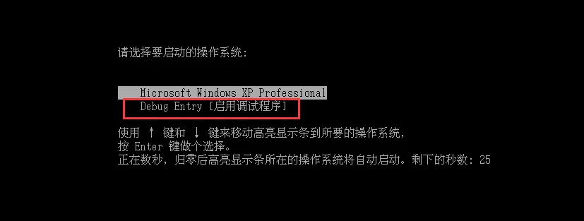

    

    但是目前等不到调试器连接,需要我们添加串口

    2.配置虚拟机

    

    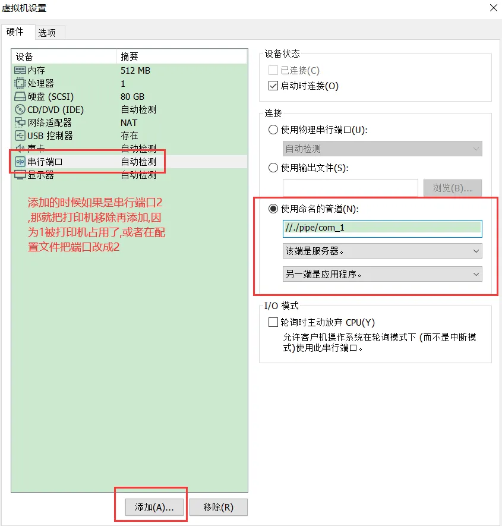

    

    3.用WinDbg连接

    //./pipe/com_1

    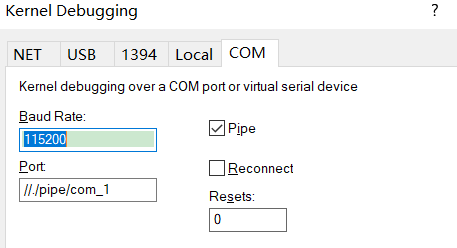

    每次点击链接太麻烦了，可以加上命令行参数  在 .exe后面加  

      -b -k com:port=//./pipe/com_1,baud=115200,pipe

    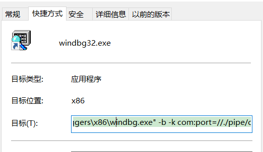

    WinDbg 显示寄存器会有问题，需要在 github上 下载一个补丁，一个dll，放到根目录下即可  而且打完补丁需要通过命令 **!WingDbg.regfix** 激活 

    

    ##### WIN7

    用户不懂  boot.ini   瞎改，可能导致系统无法开机，因此win7就不让用户修改配置文件了，而是提供了一个工具 BCDEDIT

    1.  以管理员权限运行cmd   输入  bcdedit

    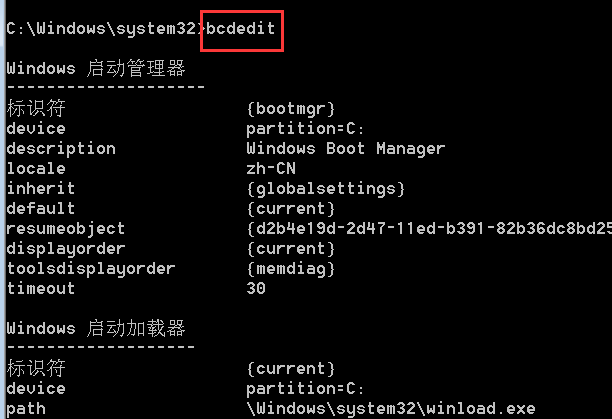

    帮助

    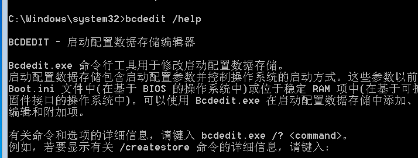

    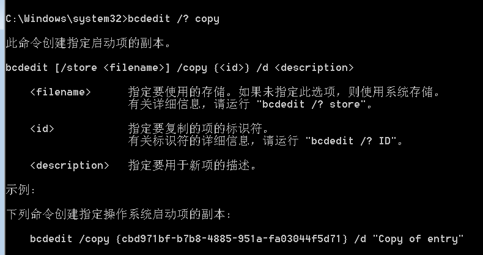

    1.  我们可以拷贝一个当前的启动项

        bcdedit  /copy {current}  /d "Debug Entry"

        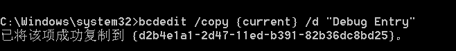

        3.开启调试模式

        bcdedit /debug {d2b4e1a1-2d47-11ed-b391-82b36dc8bd25} on

        {d2b4e1a1-2d47-11ed-b391-82b36dc8bd25}  复制时的uuid

        此时我们可以看到 debug ，模式开启来了

        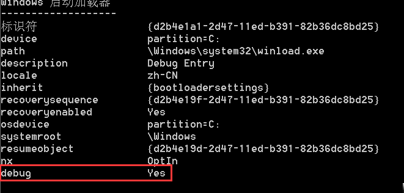

        1.  配置管道

        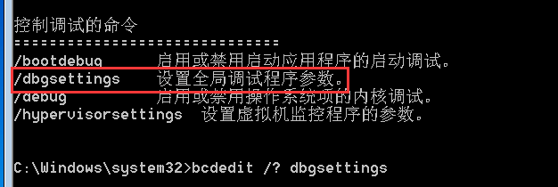

        

        ```cpp
        bcdedit /dbgsettings SERIAL DEBUGPORT:1 BAUDRATE:115200
        ```

        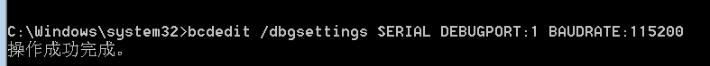

        这样就配好了，重启系统就可以看到 启用调试程序了

        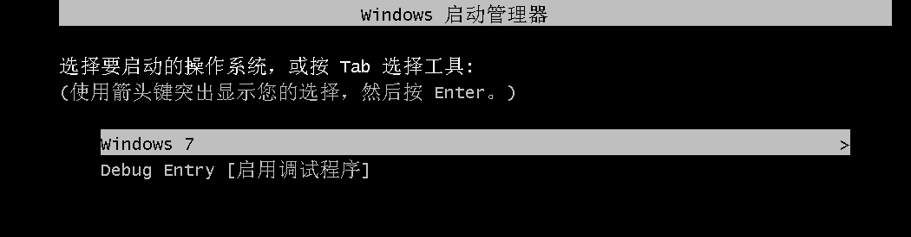

        1.  在虚拟机设置串口

        ```cpp
        //./pipe/com_1
        ```

        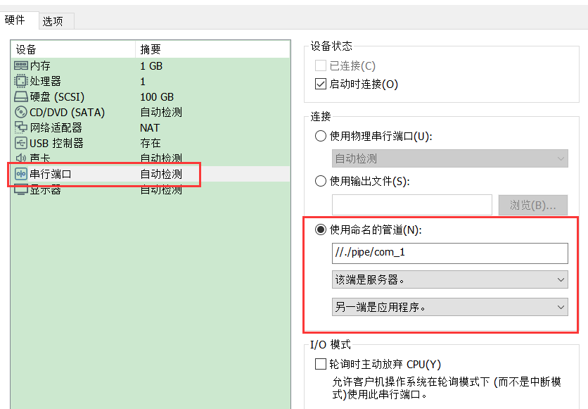

        

        ##### WIN8，10，11

        配置方式跟win7一样，但是win10不能开机计入调试模式

        

        ##### 配置快照

        在WinBbg上下个断点在做快照，如果不下断点再做快照，还原快照时，调试器可能连不上

        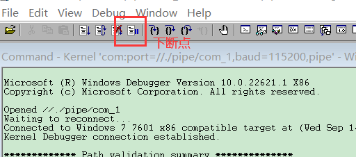

        

        打开虚拟机进入调试模式， 直接 g 命令让系统运行，等虚拟机上粘贴复制等功能能用了，就在WinDbg下断点，然后就可以拍快照了

        

        

        ##### 符号命令

        下载pdb 文件，没有pdb 文件，看到的都是一堆汇编代码，连函数名都没有

        .reload
        .reload /f *   //遍历当前所有模块，从服务器下载pdb文件

        下载方式：

        1.  离线下载：  下载一些离线包（不推荐，因为windows系统在不断更新，更新之后离线的文件可能没法用了）

        2.  在线下载

            在线下载方式：
            .reload


            symchk
            //在  symchk.exe打开cmd，输入下面命令
            symchk /r c:\windows\system32 /s   srv*\\manysymbols\windows 
            //srv*\\manysymbols\windows     保存pdb文件路径  
            例如：  SRV*g:\symbol*http://msdl.microsoft.com/download/symbols  
                    g:\symbol  本地文件路径
            他就会扫描system32下的所有dll和exe，去下载对应的pdb

            symchk /r c:\windows\system32 /s SRV*g:\symbol*http://msdl.microsoft.com/download/symbols
            symchk /r c:\windows\SysWOW64 /s SRV*g:\symbol*http://msdl.microsoft.com/download/symbols

##### 进程

.attach pid   		    附加进程
.detach       		    取消附加
!process 0 0  		    列出系统进程信息  (必须要有符号)
!process 0 7     		列出系统进程的详细信息
!process EPROCESS 7     //列出进程的详细信息
.process/p EPROCESS     //进入该进程上下文   可以强制切进程和线程

##### 线程

3环用的
~* 				显示所有线程
~.				显示引起异常的线程
~*kb			显示所有线程的栈

0环用的    
.thread ETHREAD     //进入该线程上下文
!thread ETHREAD		//查看线程结构

##### 反汇编命令

u       查看当前代码运行位置通过当前eip反汇编
uf      反汇编整个函数，直到 retn

寄存器命令

r      查看和修改所有寄存器的值

##### 断点命令

对驱动下断点最好的方式就是在驱动内联汇编    __asm  int 3;这样驱动加载就会产生断点异常，被调试器收到，pbd就被加载了，甚至源码都可以出来，因为在可执行文件中保存了 pdb的位置，但是内联汇编不太好，因此微软提供了一个断点API      **DbgBreakPoint();** 调这个api就会产生一个断点，但是发布的时候由于异常没人处理，就会蓝屏，因此微软提供了一个宏来解决  **KdBreakPoint();** 在release将不会产生断点，还提供了一个打印日志的宏  **KdPrint()**

bp address	
bp model!func	        符号断点
bu model!func	        符号断点
bm model!fu*c	        正则符号断点
ba w4/r4/e4/i4 address	内存断点
bp /p eprocess address/func	进程断点
bp /t ethread address/func	线程断点
ba /p /t            	进程线程断点
bl 
bc                  清除断点
be                  有效
bd	                无效

##### 内存命令

db		以一个字节显示值和ASSCll字符
dw		显示2字节的值
dd		显示4字节的值
dq		显示8字节的值
dp		显示指针长度的值（32等同于dd,64等同于dq)
dD		显示double实数（8字节）的值
df		显示float实数（4字节）的值
da		显示asscii值
du		显示unicode值
ds		显示ANSI_STRING值
dS		显示UNICODE_STRING的值

 内存块命令 

dd address L1    L几代表显示多少项

dxy      //取多少字节解释为什么类型

x:       d:4字节；q:8字节；p:32位4字节，64位8字节

y:       p:DWORD或者QWORD a:ASSCII u:UNICODE

 


##### 修改内存命令

```cpp
eb/ed/eD/ef/ep/eq/ew
ed address value
ea/eu
eza/ezu
```

##### 堆栈命令

```cpp
kv	3个参数   调用约定
kb	3个参数
kp	全部参数   //根据pdb来解析，没有pdb就相当于kv
```

##### 搜索命令（用的不多）

```cpp
S指令对内存区别进行查找，可用于查找数字，字符串，但不支持模糊查找。
s -d  @desp L100 8187bc40,从esp指向的内存地址0x100个字节内查找DWORD 8187bc40.

查找字符串  s -a 0012ff40  L20 "Hello"
s sa 和 s -su 显示内存可打印的ASCII 和Unicode字符串
#指令可以查询汇编指令模式，
# "call" 00400000  L1000查找call 指令。
```

##### 源码命令

```cpp
.open指令打一个源文件，可以打开一个全路径的文件，也可以通过函数地址来打开并定位到源文件中函数的位置，如.open-a myapp!main,
open j:\aydriver\aydriver.c
1sf指定一个源文件为当前误文件，使用Ise可显示当前指定的源文件1s可是示源件名称。
如1sf mydriver.c,isf j:\mydriver\mydriver.
clsc显示当前源文件
ls显示当前源文件的代码，如1s 200显示第200行
l 用于设置源文件选项
lsp 设置源文件行在调试时显示范围比如，显示当前行的前50,后50,1sp 100但通常使用Windbg时，可以直接用Ctrl+0来打开并查看源文件
```

##### 蓝屏命令

```cpp
!analyze -v   智能分析蓝屏原因
```

##### 其他命令

```cpp
lm    查看当前载入的模块
!peb  查看当前进程环境块（PEB)
x     查看模块的符号，如x mydriver!*FastIo*,显示所有与*FastIo*匹配的符号列表
dt    查看类型数据，还可用于查看模块类型的符号列表，如dt dgguarder!_IMAGE_DOS_HEADER 00400000 从 00400000处查看_IMAGE_DOS_HEADER类型的数据
```

##### 总结 


| Windbg常用命令              |                                                              |                                                              |
| --------------------------- | ------------------------------------------------------------ | ------------------------------------------------------------ |
| !WinDbg.regfix              | 首次启动激活寄存器窗口数据                                   |                                                              |
| 符号命令                    | .reload                                                      |                                                              |
| .reload /f*                 |                                                              |                                                              |
| 进程                        | .attach pid                                                  | 附加进程.detach取消附加                                      |
| !process 0 0                | 列出系统进程信息                                             |                                                              |
| !process 0 7                | 列出系统进程的详细信息，慎用                                 |                                                              |
| !process EPROCESS 7         | 列出进程的详细信息                                           |                                                              |
| .process /p EPROCESS        | 进入该进程上下文                                             |                                                              |
| 线程                        | ~*                                                           | 显示所有线程                                                 |
| ~.                          | 显示引起异常的线程                                           |                                                              |
| ~* kb                       | 显示所有线程的栈                                             |                                                              |
| .thread ETHREAD             | 进入该线程上下文                                             |                                                              |
| !thread ETHREAD             | 查看线程结构                                                 |                                                              |
| 反汇编命令                  | u                                                            | 查看当前代码运行位置通过当前eip反汇编                        |
| uf                          | 反汇编整个函数，直到 retn                                    |                                                              |
| 断点                        | bp address                                                   |                                                              |
| bp model!func               | 符号断点                                                     |                                                              |
| bu model!func               | 符号断点                                                     |                                                              |
| bm model!fu*c               | 正则符号断点                                                 |                                                              |
| ba w4/r4/e4/i4 address      | 内存断点                                                     |                                                              |
| bp /p eprocess address/func | 进程断点                                                     |                                                              |
| bp /t ethread address/func  | 线程断点                                                     |                                                              |
| ba /p /t                    | 进程线程断点                                                 |                                                              |
| bl / bc/ be/bd              |                                                              |                                                              |
| 条件断点                    | bp Address " j (Condition)'OptionalCommands'; 'gc'" bp `:143~".if (poi(MyVar)>5) {.echo MyVar Too Big} .else {.echoMyVar Acceptable; gc} " bp mydriver!myFunction ".if (@eax & Ox0` ffffffff)= Ox0`c0004321.else {gc}" |                                                              |
| 跟踪命令                    | T                                                            | 指令单步执行，在源码调试状态下，可指源码的一行，根据不同的选项也可以为一行ASM指令; |
| TA                          | 单步跟踪到指定地址，如果没有参数将运行到断点处。             |                                                              |
| TB                          | 执行到分支指令，分支指令包括calls,returns,jumps,countedloops,and while loops |                                                              |
| TC                          | 执行到Call指令                                               |                                                              |
| WT Trace and Watch Data     | 一条强大指令,对执行流程做分析                                |                                                              |
| 内存命令                    | db                                                           | 以一个字节显示值和ASSCII字符                                 |
| dw                          | 显示2字节的值                                                |                                                              |
| dd                          | 显示4字节的值                                                |                                                              |
| dq                          | 显示8字节的值                                                |                                                              |
| dp                          | 显示指针长度的值(32等同于dd,64等同于dq )                     |                                                              |
| dD                          | 显示double实数(8字节)的值                                    |                                                              |
| df                          | 显示float实数(4字节)的值                                     |                                                              |
| da                          | 显示asscii值                                                 |                                                              |
| du                          | 显示unicode值                                                |                                                              |
| ds                          | 显示ANSI STRING值                                            |                                                              |
| dS                          | 显示UNICODE_STRING的值                                       |                                                              |
| 内存块命令                  | dd address L1                                                |                                                              |
| dxy                         |                                                              |                                                              |
| x                           | 搜索模块 d:4字节;q:8字节; p:32位4字节，64位8字节             |                                                              |
| y                           | p:DWORD或者QWORD a:ASSCII u: UNICODE                         |                                                              |
| 修改内存                    | eb/ed/eD/ef/ep/eq/ew                                         |                                                              |
| ed address value            |                                                              |                                                              |
| ea/eu                       |                                                              |                                                              |
| eza/ezu                     |                                                              |                                                              |
| 堆栈命令                    | kv                                                           | 3个参数调用约定                                              |
| kb                          | 3个参数                                                      |                                                              |
| kp                          | 全部参数                                                     |                                                              |
| 蓝屏命令                    | !analyze -v                                                  | 默认没开                                                     |

