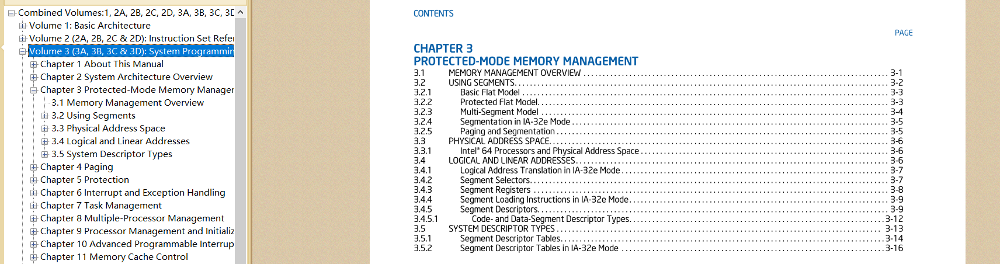
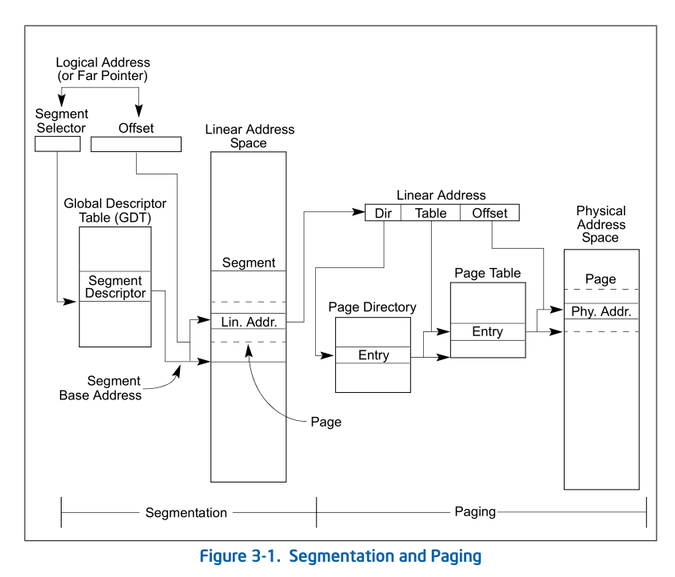
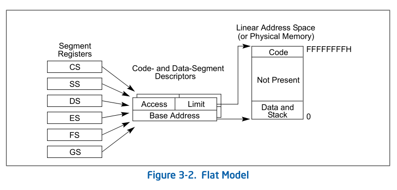
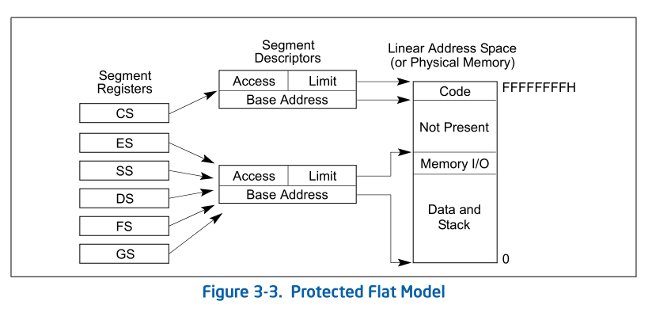
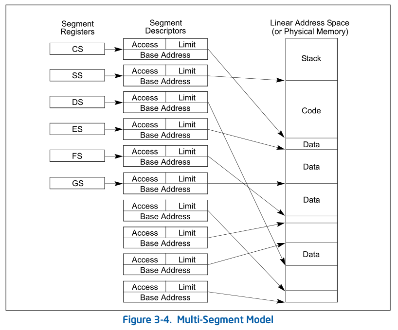
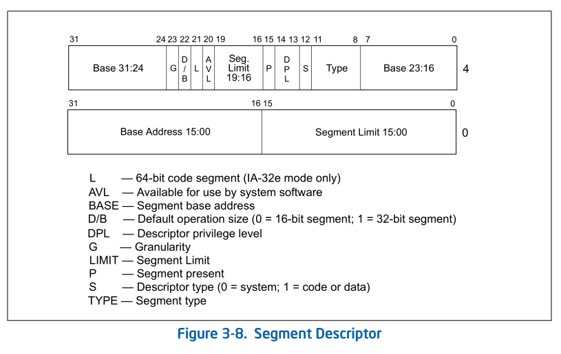
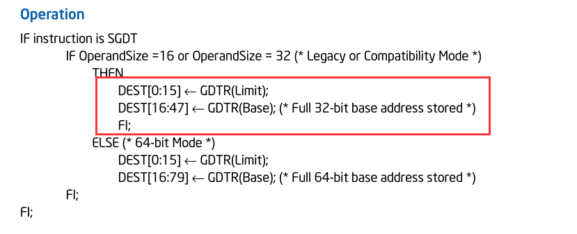

### 内存管理

内存是操作系统很核心的一个功能，软件很多崩溃原因或者安全问题都是内存造成的

#### 内存安全问题

解决方法：

##### 内存权限

1.  R      读
2.  W     写
3.   E      执行

##### 内存隔离   

各用各的内存，互不干扰，内存隔离是以任务为单位的

CPU没有进程和线程的概念，只有 任务(Task),进程 和线程是操作系统提出来的,是为了方便管理任务，线程是轻量化进程，创建线程可以理解为创建了一个进程，只不过内存是共享的，除了栈不共享，创建线程会有一个独立的栈空间，CPU是不管内存是否共享的，他只负责操作内存


因此我们在访问一个内存的时候去检测有没有内存权限，内存隔离的机制，这个机制该有谁来做呢

例如：  mov [00401000h], 1  

00401000h 这块内存是否可以写该由谁来检测呢，如果有操作系统来做，那么效率太低，因此只能由硬件来做，因为代码执行是由cpu来做的，他可以执行的时候顺便检测一下，但是只由硬件来做他无法知道内存权限，不知道是否可读可写，这个只有系统知道，因为进程是系统创建的，知道哪里可以读，哪里可以写，所以系统负责定义访问权限，因此**内存管理需要硬件和系统一起负责**

所以系统获得作者需要研究CPU手册，来研究明白怎么把定义的访问权限告诉CPU

硬件  检测访问权限  <= 告诉CPU <= 系统  定义访问权限


### CPU手册

关于系统相关的在第3卷




为了完成内存管理的概念,提出了地址空间的概念

1.  logical address    （逻辑地址)
2.  linear address        (线性地址)  主要为了完成内存隔离问题
3.  Physical Address（物理地址)  物理内存条的地址 0x00000000~0xFFFFFFFF
4.  virtual address      (虚拟地址) 段偏移


直接用物理地址是有问题的,这就代表每个代码的内存地址必须不一样,因为得隔离,而且不同电脑的内存大小是不一样的那么我怎么保证我们的代码在执行的时候不会受到硬件的干扰呢,因此我们需要去抽象出一个地址空间




 逻辑地址
首先最上面就是逻辑地址。其实逻辑地址就等价于程序里面的地址、但是你说什么时候用的逻辑地址呢？我什么时候用的逻辑地址呢？其实你一直在用逻辑地址。
我们随便右键一个程序，
CPU看地址的时候是看逻辑地址的，就是这个CS段偏移。你们平时所说的虚拟地址实际上是段偏移了。
每个进程的cs 都是一样的，这我们后面再谈。
至少对CPU来说是用逻辑地址的，你们代码也好。数据也好。都是逻辑地址。
内存管理图中这个逻辑地址他说通过一个叫分段管理。那么他就就可以把它转成一个线性地址。然后这个线性地址，这里面是一个叫页的管理，叫页映射、页管理，他叫分页管理。就可以得到一个物理地址。
这是CPU内存访问一段内存的处理流程。
分页管理是可以不要的，如果不要的话、那么逻辑地址通过分段管理就直接得到了物理地址。
线性地址有什么用？他这个抽象的概念。为什么有线性地址的概念呢？现在就是主要为了完成这个内存隔离的问题。其实你可以认为我不能因为你开不开分页。它是一个抽象出来的概念。线性地址在32位里面里面固定四个g 。不管你物理内存条有没有四个g 、他固定四个g。即我的线性地址一定是4个g.  


逻辑地址(cs:778e1e53)  =>  分段管理 => 线性地址 => 分页管理(可以不要) => 物理地址

如果不要

逻辑地址(cs:778e1e53)  =>  分段管理(查表) => 物理地址

#### 分段管理

分段管理就是查表,CPU先拿地址去查表,查出该内存的权限,如果可以就去访问,如果不可以不能访问,所以这个表就称为分段表

##### 分段表

描述内存的权限不能一个字节一个字节的描述,而是一段段描述的

例如:

00401000~00402000     1000~2000  R      即表示  虚拟地址00401000~00402000这 1000字节的内存都是可读的  物理内存地址是 1000~2000

00402000~00403000      2000~3000  W   即表示  虚拟地址00402000~00403000这 1000字节的内存都是可写的   物理内存地址是 2000~3000

###### 分段表创建时间

这个分段表是由 操作系统创建进程时候做的,然后给cpu这个进程有哪些内存,cpu执行指令的时候就会自己去查这个表

这个表由操作系统在开机的时候就做好,简单的来说就是cpu通电就得做这个表,做完交给cpu,才能进入保护模式,没有分段表进不了保护模式,也就是说cpu进入保护模式之前操作系统作者必须把这个表做好,才能进的去,否则对cpu来说,所有内存都是不可访问的


###### 分段表存放地址

cpu需要知道分段表去哪拿,操作系统也要知道

1.  最简单的方法就是固定一个地址    例如存放在 地址 1000 处

但是这种方式不灵活,维护性差

1.   cpu用寄存器来存放地址   GDTR  LDTR

 这样不仅cpu好拿,而且寄存器好给,加的寄存器只有内核权限可以看见,3环权限看不见,这样标存放的地址就比较自由,所以cpu访问任务一个内存地址不管是执行代码还是读写数据他的第一步就是拿到这个地址然后从寄存器里拿表,查表有没有权限,有权限从这个表拿到物理地址去访问,当然相对的访问内存的效率就下降了


###### 分段表访问

对于操作系统作者来说,他第一步得了解这个表的格式,段怎么使用



没有开分页的话线性地址就等于物理地址

从上图可以看出分页表存放了3个信息

1.  Base Address(段基址)   
2.  Limit(段界限) 
3.  Access(访问权限)

但是我们可以发现一个问题,那就是没有物理地址  ,其实  段基址就是物理地址 或许你就会问,虚拟地址呢,怎么知道逻辑地址对应表里的哪一项   

逻辑地址地址当做表的下标,这样查询速度更快,而且少了四字节,如果直接把逻辑地址当做表的下标那么这个表可能非常大,因此他是

CS段寄存器(16位)当做表下标 ,段偏移当做物理内存偏移

例如 :    

```
ds = 2;
mov al,ds:[100]

在分页表中下表为2的 数据为  
1000     1000      R

于是CPU 读取出数据之后 判断权限为  r  是可读的
于是就去访问 物理地址  1000 + 100 = 1100  拿出一个字节的值给 al
虚拟地址就是 100 (偏移),在CPU的理解里面,虚拟地址就是 一个段的便宜


ds为了查出物理地址的段基址
100是虚拟地址和物理地址的段偏移
物理地址 = 段基址 + 段偏移
逻辑地址 = DS + 段偏移

对于CPU来说 每个内存地址都是逻辑地址
```

我们判断一个虚拟内存能否访问其实就是在物理内存中能否找出跟他一样的大的段就可以了,所以可以理解为虚拟的空间和真实的空间我们只需要描述他段的映射就可以了,这就是分段

所以我们只需要知道虚拟地址对应的物理内存条的首地址在哪,因为 虚拟地址偏移量100 就对应了物理地址偏移量的100,因此虚拟地址的偏移量就对应了物理地址的偏移量是一致的,因此我们这个表只需要描述 虚拟地址和物理地址段基址的映射情况就够了



每个段寄存器映射的段都是不一样的



如果有2个段寄存器指向的段基址是一样的 那就是内存共享

2个逻辑地址不一样,但映射的物理地址是一样的,是因为下标不一样,但是不同的下标查出来的表的值是一样的,内存共享就是这么做了

寄存器的值给的值一样代表查的表项是同一个,这个内存共享不一样(内存共享查的表项是不一样的),这种我们称为多段合一

###### 分段表格式



整个表 64位

段基址   对于32位cpu来说最大4个g   所以需要32位  由上图  Base Address 15:00 (16位)  Base 31:24(8位)  Base 32:16(8位)  3块用位运算拼成,刚好32位,这样设计是因为历史遗留问题,这个表在16位cpu是就开始设计,那时候这个表是4个字节,现在32位cpu,发现表不够用,需要扩展四个字节,但是原来的第四个字节的格式不能修改,否则不兼容16位,因此只能往高位补,因此虽然很影响效率,但是为了兼容只能这样,而且原来界限只有16位,现在不够,因此高位又补了4位  

###### 段描述

因为要表达这个表信息需要用位段描述,结构体无法直接描述

```
struct SegmentDescriptor {
  unsigned limit1 : 16;   //段界限 (低16位)
  unsigned base1 : 16;    //段基址 (低16位)
  unsigned base2 : 8;     //段基址 (第17-24位)
  unsigned type : 4;      //内存权限 
  unsigned s : 1;         //描述符类型 (0 = 系统段; 1 = 存储段)
  unsigned dpl: 2;        //描述符特权级 ring0~ring3  
  unsigned p : 1;         //存在位 0 段不在 1存在 (删除标志),可以判断是否有效
  unsigned limit2 : 4;    //段界限 (第17-20位) (分开是为了兼容16位)
  unsigned avl : 1;       //软件可利用位 (保留给系统软件)
  unsigned l : 1;         //64段标志,32位是0
  unsigned db : 1;        //0 =》 16位或者  1 => 32位段 (兼容16位)
  unsigned g : 1;         //粒度位  1=》 4K    0 => byte
  unsigned base3 : 8;     //段基址 (第25-32位)
};  

内存属性并不是按位描述的     如果内存被人操作过 就会加 accessed 属性,例如分页内存,这个标志可以作为内存有没有用的参考标志

expand-down  地址方向是往上还是往下  例如 段基址 1000,偏移100,真正地址是 900 还是 11000   是为了兼容堆栈段

MmIsAddressValid 函数的实现就是通过  检查  存在位(p) 是否为0实现的

base(32bit)  limit(20bit  为什么20位是为了模4)  4G  0x00000~0xFFFFF
一个段的大小最大是 2^20 即 1m

假设 有一个代码段大小位 2G  ,数据段大小为 1G ,这个表该如何做呢
按之前的方法 , 数据段要 1024项 ,代码段要2048项才能描述,这样效率会比较低
因此他需要保证任何一个内存大小,一定要一项才能映射,这样才不用遍历,直接下标寻址,因为如果一次查表无法解决,那效率就很低,因为表示在内存里面,因此最完美的方法是   limit 给 32位,这样他的范围就是4G,但是如果 limit 给 32位 ,表项就得扩展,因此现在要考虑的是如何用20位 来表示 4G ,解决办法就是加入单位的概念,用更大的单位来表示 ,例如 1吨 = 1000KG ,粒密度(g) 就是起这个作用的,如果 值为1 ,段界限的值就是 1 = 4Kb ,为0 的话 就是 1 = 1b  
这样  (2^20-1) * 4KB =>  0xFFFFF000  这样没法办法到4G 少 0xFFF
因此 CPU 算 limit =  limit * 4K + 0xFFF;   
但是如果要描述 
0x00000000 ~  0x00000FFF 我们只需要 g = 1 , limit = 0     
0x00000000 ~  0x00000100 我们只需要 g = 0 , limit = 100
这样只要我们定义一个超过4K的段,这个段的大小一定是4K的倍数,这是因为我们测试出来从硬盘里面读写数据,一次读写 4KB 是最高效的
```


###### 寄存器操作

这个表地址是放在寄存器 gdtr 中,那是否就意味着我们拿到这个表的结果就是内存管理是我们说了算,而不是微软说了算,我们可以帮微软做内存管理,即我们只要拿到这个表并且可以读写那么所谓内存安全问题都废了,而且操作系统是无法解决的,因为我们是直接跟cpu打交道,而不是操作系统,这个表的地址在内核当中,因此3环得到这个地址也没办法操作

操作寄存器CPU提供了2条指令

sgdt   =>读   strore 存储

lgdt   =>写   load    加载



这个寄存器是 48 (16 + 32) 位,因为是变长,所以这个表给出了首地址和大小

我们运行可以发现有多个表,那是因为有多核CPU ,每一个核就有一个表,因此可以通过这个知道自己代码在哪一个核上跑

我们要拿到系统的所有表,首先我们得知道CPU数几核,并且怎么拿到每一核指定的表,及我们线程在哪一核上跑,就拿到哪一核的表,哪一核的寄存器

解决办法

1.  3环

 SetProcessAffinityMask(GetCurrentProcess(),shift);    //设定我们的线程在哪一核上跑,通过位来表示

32位系统 最多支持32核 的CPU

获取系统所有分段表

```c++
#include <stdio.h>
#include <stdlib.h>
#include <windows.h>

#pragma pack(1) 
struct GDTR {
  unsigned short limit;  //结束的偏移  SegmentDescriptor表的数量 = (limit + 1 ) /8
  unsigned int base;     //基址
};


int main()
{
  GDTR gdtr = {0};

  SYSTEM_INFO si = {0};
  GetSystemInfo(&si);  //获取系统的信息
  printf("dwNumberOfProcessors:%d\n", si.dwNumberOfProcessors); //输出处理器的数量

  //掩码Affinity  0000 0000 0000 0100
  int shift = 1;
  for (int i = 1; i <= si.dwNumberOfProcessors; i++) {
    SetProcessAffinityMask(GetCurrentProcess(),shift); //设定我们的线程在哪一核上跑,通过位来表示
    __asm {
      sgdt gdtr;    //获取值 因为大小是48位,因此不能用mov
     // lgdt gdtr;  //修改值 , 只能内核改,3环无法修改
    }
    printf("base:%p limit:%p\n", gdtr.base, gdtr.limit);
    shift <<= 1;
  }
 
  system("pause");

  return 0;
}
```

64位操作系统中地址是假的,32位是真的


1.  0环 Drv.h

```c++
#pragma once

extern "C" {

#include <Ntddk.h>
#include <stddef.h>

#define DEVICE_NAME  L"\\Device\\51asm"
#define SYMBOL_NAME L"\\DosDevices\\51asm"

//定义控制码
#define MY_CODE_BASE 0x800
#define MY_CTL_CODE(code) CTL_CODE(FILE_DEVICE_UNKNOWN, MY_CODE_BASE + code, METHOD_BUFFERED, FILE_ANY_ACCESS)
#define IOCTL_GET_REG1 MY_CTL_CODE(0)
#define IOCTL_GET_REG2 MY_CTL_CODE(1)
#define IOCTL_GET_REG3 MY_CTL_CODE(2)
#define IOCTL_SET_REG1 MY_CTL_CODE(3)
#define IOCTL_SET_REG2 MY_CTL_CODE(4)
#define IOCTL_SET_REG3 MY_CTL_CODE(5)
//......


NTSTATUS DriverEntry(__in struct _DRIVER_OBJECT* DriverObject,
  __in PUNICODE_STRING  RegistryPath);


VOID Unload(__in struct _DRIVER_OBJECT* DriverObject);

NTSTATUS DispatchCreate(
  _In_ struct _DEVICE_OBJECT* DeviceObject,
  _Inout_ struct _IRP* Irp
);

NTSTATUS DispatchClose(
  _In_ struct _DEVICE_OBJECT* DeviceObject,
  _Inout_ struct _IRP* Irp
);


NTSTATUS DispatchControl(
  _In_ struct _DEVICE_OBJECT* DeviceObject,
  _Inout_ struct _IRP* Irp
);


#pragma alloc_text( "INIT", DriverEntry)
#pragma alloc_text( "PAGE", Unload)
#pragma alloc_text( "PAGE", DispatchCreate)
#pragma alloc_text( "PAGE", DispatchClose)
#pragma alloc_text( "PAGE", DispatchControl)

}
```

Drv.cpp

```c++
#include "Drv.h"
#include <Ntstrsafe.h>


#pragma pack(1)
struct GDTR {
  unsigned short limit;
  unsigned int base;
};


/*驱动卸载函数 clean_up*/
VOID Unload(__in struct _DRIVER_OBJECT* DriverObject)
{
  KdPrint(("[51asm] Unload! DriverObject:%p\n", DriverObject));

  //删除符号链接
  UNICODE_STRING ustrSymbolName;
  RtlInitUnicodeString(&ustrSymbolName, SYMBOL_NAME);
  IoDeleteSymbolicLink(&ustrSymbolName);

  //删除设备
  if (DriverObject->DeviceObject != NULL)
    IoDeleteDevice(DriverObject->DeviceObject);
}


/*1.驱动入口函数*/
 NTSTATUS DriverEntry(
  __in struct _DRIVER_OBJECT* DriverObject,
  __in PUNICODE_STRING  RegistryPath)
{
   UNREFERENCED_PARAMETER(RegistryPath);

    
   KAFFINITY  mask = KeQueryActiveProcessors();   //获取cpu核心数
   KdPrint(("mask:%x\n", mask));
   //掩码Affinity  0000 0000 0000 0100
   KAFFINITY   shift = 1;
   GDTR gdtr = {0};
   while(mask) {
     KeSetSystemAffinityThread(shift);   //指定线程运行内核
     __asm {
       sgdt gdtr;
       // lgdt gdtr;
     }
     KdPrint(("base:%p limit:%p\n", (void*)gdtr.base, (void*)gdtr.limit));
     shift <<= 1;
     mask >>= 1;
   }

  KdPrint(("[51asm] DriverEntry DriverObject:%p\n", DriverObject));

  //2.创建设备
  UNICODE_STRING ustrDevName;
  RtlInitUnicodeString(&ustrDevName, DEVICE_NAME);

  PDEVICE_OBJECT pDevObj = NULL;
  NTSTATUS Status = IoCreateDevice(DriverObject,
                                  0, 
                                  &ustrDevName, 
                                  FILE_DEVICE_UNKNOWN,
                                  FILE_DEVICE_SECURE_OPEN, 
                                  FALSE, //独占
                                  &pDevObj);
  if (!NT_SUCCESS(Status)) {
    DbgPrint("[51asm] IoCreateDevice Error Status:%p\n", Status);
    return Status;
  }
  KdPrint(("[51asm] IoCreateDevice OK pDevObj:%p\n", pDevObj));

  //设置设备的缓冲区通讯方式
  pDevObj->Flags |= DO_BUFFERED_IO; //缓冲区通讯方式


  //创建符号链接
  UNICODE_STRING ustrSymbolName;
  RtlInitUnicodeString(&ustrSymbolName, SYMBOL_NAME);
  Status = IoCreateSymbolicLink(&ustrSymbolName, &ustrDevName);
  if (!NT_SUCCESS(Status)) {
    KdPrint(("[51asm] IoCreateSymbolicLink Error Status:%p\n", Status));
    if (pDevObj != NULL)
      IoDeleteDevice(pDevObj);

    return Status;
  }
  KdPrint(("[51asm] IoCreateSymbolicLink %wZ OK\n", &ustrSymbolName));


  //3.注册派遣函数
  DriverObject->MajorFunction[IRP_MJ_CREATE] = &DispatchCreate;
  DriverObject->MajorFunction[IRP_MJ_CLOSE] = &DispatchClose;
  DriverObject->MajorFunction[IRP_MJ_DEVICE_CONTROL] = &DispatchControl;


  //4.注册卸载函数
  DriverObject->DriverUnload = Unload;

  return STATUS_SUCCESS;
}

/*
IRP  I/O Request Packet
*/
NTSTATUS DispatchCreate(_DEVICE_OBJECT* DeviceObject, _IRP* Irp)
{
  UNREFERENCED_PARAMETER(DeviceObject);
  UNREFERENCED_PARAMETER(Irp);

  /* __asm {in, out} in al, 60h*/
  KdPrint(("[51asm] %s pid:%d\n", __FUNCTION__, PsGetCurrentProcessId()));

  //完成请求
  Irp->IoStatus.Status = STATUS_SUCCESS;
  Irp->IoStatus.Information = 0; //成功操作的字节数
  IoCompleteRequest(Irp, IO_NO_INCREMENT);

  return STATUS_SUCCESS;
}

NTSTATUS DispatchClose(_DEVICE_OBJECT* DeviceObject, _IRP* Irp)
{
  UNREFERENCED_PARAMETER(DeviceObject);

  KdPrint(("[51asm] %s\n", __FUNCTION__));

  Irp->IoStatus.Status = STATUS_SUCCESS;
  Irp->IoStatus.Information = 0; 
  IoCompleteRequest(Irp, IO_NO_INCREMENT);

  return STATUS_SUCCESS;


}

NTSTATUS DispatchControl(_DEVICE_OBJECT* DeviceObject, _IRP* Irp)
{
  UNREFERENCED_PARAMETER(DeviceObject);

 //获取当前IRP堆栈
  PIO_STACK_LOCATION pIrpStack = IoGetCurrentIrpStackLocation(Irp);

  //获取用户的缓冲区
  PVOID pBuffer = Irp->AssociatedIrp.SystemBuffer;
  ULONG nLength = pIrpStack->Parameters.DeviceIoControl.OutputBufferLength;
  ULONG nIoControlCode = pIrpStack->Parameters.DeviceIoControl.IoControlCode;

  KdPrint(("[51asm] %s nIoControlCode:%p pInputBuffer:%p nInputLength:%d pOutBuffer:%p nOutLength:%d\n", __FUNCTION__,
    nIoControlCode, pBuffer, nLength));


  ULONG nSize = 0;
  switch(nIoControlCode) {
  case IOCTL_GET_REG1:
    break;
  case IOCTL_GET_REG2:
    break;
  default:
    break;
  }

  Irp->IoStatus.Status = STATUS_SUCCESS;
  Irp->IoStatus.Information = nSize;
  IoCompleteRequest(Irp, IO_NO_INCREMENT);
  return STATUS_SUCCESS;
}

```

如果把所有这个表给抹了,都不会蓝屏,CPU会崩了直接断电