### 权限问题

ring0~ring3 权限

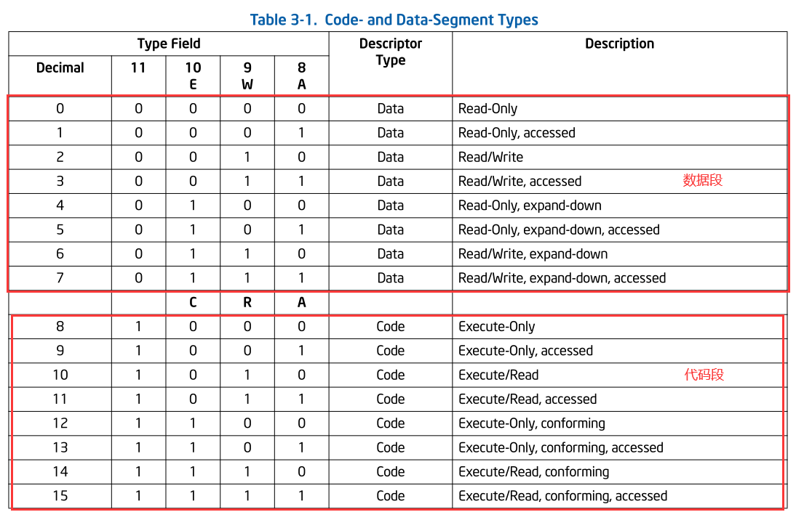

我们可以认为一个软件有 代码段 + 数据段 组成, 有时候还有堆栈段,但是堆栈段从本质上来说也是数据

数据段的权限一般只有 读 或 写,没有执行的权限    Read,Read/Write

代码段只有 读 或者 执行 的权限,没有写的权限       Execute, Execute/Read

我们想让数据段去执行断码是不可以的,没有这个权限,所以我们不可以把代码写到栈里面去执行,cpu是这么设计的


### 内存隔离

Process1 =>  段描述符表1    =>  GDTR(LIMIT) 

Process2 =>  段描述符表2    =>  GDTR(LIMIT)  

切换进程就是切换    GDTR   ,我们要访问A进程 就把   GDTR 切换成A进程的,如果要访问B进程 就把   GDTR 切换成B进程的


-   GDTR本身就会影射一块物理内存, 这样 A,B进程分别映射不同的一块物理内存,这样就隔离了
-   如果每个进程 都给一个 段描述表(GDTR)   大概一个进程极限大概需要 0.5m的空间来存放  GDTR 表,但是不是每一个表都需要这么大,所以 GDTR 中种的 limit 就是控制 表的大小的

#### 段选择子

-   我们给每个进程规定了 4G 的线性空间,叫线性地址(虚拟的),在者4个G里面 高2G会共享,低2G可能只会用一点点
-   那我们怎么做到内存共享呢,让段描述表指向同一个位置,这就代码 A 进程的 段描述表 和B进程的 段描述表 将会有一半是一样的表项,还不能不填,这样会造成很大的浪费,那么如何节省这个空间呢
-   我们可以高2G 不隔离, 低2G隔离,这样我们可以把  段描述表 分成2个  一个  是 高2G 大家共用的一个表,一个低2G 各自自己的表,这样表的打小就减少一般,即共享的定义成全局变量,不共享的定义成局部变量,但这样查表就变成了2个,CPU怎么知道表地址在哪,所以 解决办法就是在增加一个寄存器 , 一个寄存器保存共享表的地址,一个寄存器保存各自进程表的地址,切换成就只要切换  各自进程表的地址就可以了 
-   GTDR (全局)  和  LDTR (本地) 2个寄存器就是分别保存 共享表 和 各自表的地址  
-   既然有2个表就会造成一个问题   我们查表会用到寄存器 CS   和  DS  那他们 是哪一个表的下标呢

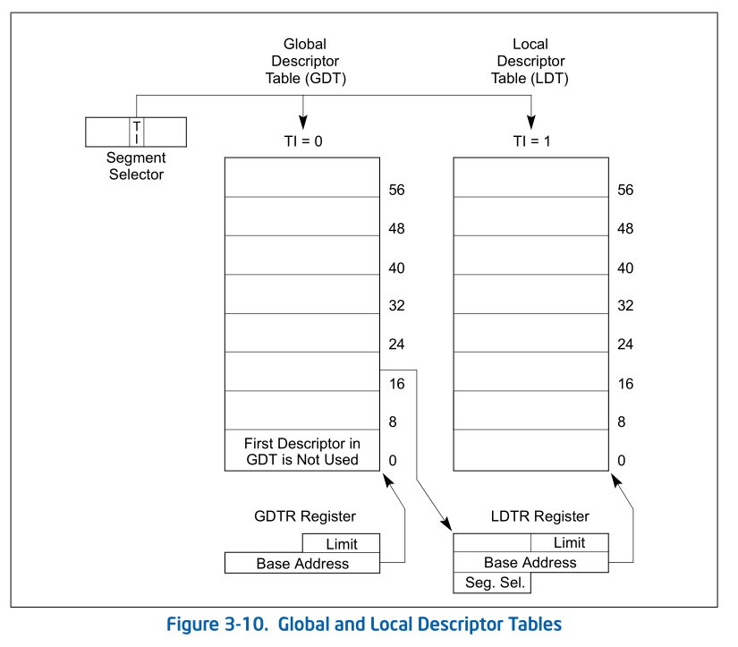

-   解决办法就是 CS中 拿出一个标志来判断是访问哪一个表,这样 CS 就不能叫下标了 ,所以改名叫  

Segment Seletor(段选择子) 


-   RPL 就是请求特权级 (0~3 环)   他跟 段描述表中的  DPL (描述符特权级)  相同才能操作
-   DPL (描述符特权级)      ring3     rpl = 3   ring0 = 0
-   CPL(当前特权级)    当前CPU 所处的特权级是几环 
-   所以我们发起一个内存访问的时候 ,拿  RPL  和 CPL 作比较,比匹配的话就不需要去查表
-   从上图可以看出,寄存器的格式为  

-   -      0~2 位     2字节:     RPL 请求特权级
    -      3 位          1字节 :     TI 访问哪一个表  0是 GTDR    1是  LTDR
    -      4-15         13字节:    Index 下标

#### CPU访问内存的完整流程

例如CPU访问  778E1E53   处的代码      段寄存器 CS 的值为 23  

1.  23:778E1E53         这样CPU就得到逻辑地址
2.  接着CPU 把 CS的值当做 段选择子去拆   

​           23 =>  =>  0000 0000 0010 0011     => 0000000000100   0   11  

​           =>  Index = 4      TI => 0   RPL => 3

1.  因为  TI = 0 ,所以CPU要去拿  GTDR    表 ,并且要拿到表的大小
2.  我们在根据 GTDR 的值 去获取对应下标的值     GTDR   +    Index  *  8 
3.  拿到段描述符后就可以去检测了,上按上节课的格式进行解析

-   首先检查 P 位,看段是否存在
-   接下来检测 dpl 看特权级是否正确
-   再检测 type 内存权限,看是否能读
-   再看 偏移是否越界  即查看 778E1E53    的值是否超过   limit 的大小 ,检测是否越界之前还得先看  g 粒密度

1.  检测没问题了就可以访问了,要访问地址就得取出物理地址 ,  base32  +   778E1E53    => 物理地址,就可以访问该物理地址的数据了

所以 

-   ring3 段寄存器  RPL = 3  TI = 1
-   ring0 段寄存器  RPL = 0  TI = 0

因此当我们3环切到0环权限的时候操作系统改一下 CS 就可以了

3环和0环想要共享数据,段寄存一致就可以了


#### Windows系统

-   想要在3环断下来 只需要在3环程序触发异常就可以,因为 windbg可以调3环程序  可以在3环通过 __asm  int  3 创造异常,主要在系统运行3环程序,就可以断下来了
-   某个段寄存器给0的话  表示弃用，所以微软段描述的第一项总是不用用来设置一个无效的段寄存器值

ring0:  gs = 0   fs=30    **es = 23  ds=23**       cs = 8     ss = 10

ring3:  gs = 0   fs=3b    **es = 23  ds=23**       cs = 1b   ss = 23    所有段寄存器低2位肯定是 3 ，不然特权等级不对

我们可以看到  es (附加) 和   ds (数据) 2个段是共享的 ，  fs (teb) ， cs (代码)， ss(栈)  是隔离的

#### 虚拟内存

微软没有使用ldtr  => 弃用


逻辑地址  =》 分段  =》 线性地址(物理地址)

逻辑地址  =》 分段  =》 线性地址  =》 分页 =》  物理地址

1.  我们线性地址有4个G,但是在 当时那个年代,电脑真正的内存可能 1G都没有

-   所以就会有一个问题:   当一个程序运行需要 2G以上内存时(例如游戏)就跑不动,所以当时就提出了虚拟内存的概念,就是把硬盘当做内存使用

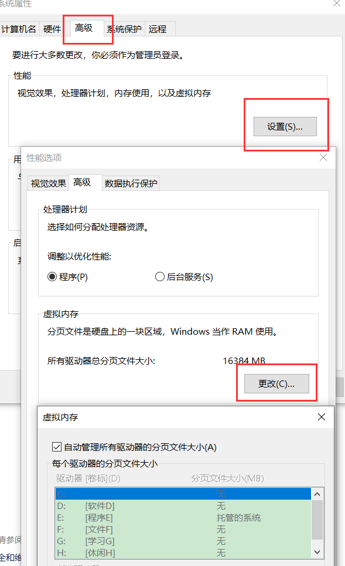

-   虽然运行程序 需要2G内存,但是并不是2G内存并不是现在都要用,  我们可以把当前正在用的内存放在内存里面,剩下的可以先放到磁盘里面,一般系统会建一个文件管理,要用到的再从磁盘读回来
-   现在内存在高,都会默认开启分配一个虚拟内存的功能,可以关闭,但是很容易导致程序跑不起来
-   实现虚拟内存最难得一点就是 判断那些内存现在没用  第2点就是怎么快速交换,所以早期虚拟内存是很普及,因为,交换效率很低,太卡了,但是如果硬件来解决交换的问题

-   -   即cpu给每个内存访问的时候加个标识,就可以知道哪些内存没有被访问,即暂时没用
    -   还有就是怎么实现快速叫唤呢?原来的分段就不能用了,比如我们定义了一个段  0~1G ,我们发现这1个G的内存没用,我们就把这1个G的内存放磁盘上,待会要用的时候再搬回来,这样就会有一个问题,太多了没办法一次搬完,需要拆分多次. 所以我们要高效的访问硬盘,所以就提出了页的概念, 页就是硬盘能最高效访问数据时的单次的大小,最开始是4K,但是后面内存大了 也可以是 2m 或者 4m,但是一定是 4k的倍数
    -   因为硬盘是以扇区为单位存储数据  一个扇区是 512bytes,  即从硬盘上读1字节数据和512字节数据速度上是一样 

-   简单来说我们这么做就是要 把段定长
-   分页是为了支持虚拟内存功能
-   操作系统要用虚拟内存功能就多了一项分页管理,不用就没有
-   操作系统要支持虚拟内存功能,那么我们的内存寻址就是    

-   -   逻辑地址  =》 分段  =》 线性地址  =》 分页 =》  物理地址
    -   分页也同样具备内存权限 和内存隔离的功能

-   但是微软任务,分段 管理成 线性地址在通过 分页管理 有点多余,因为有2套内存管理,那么能不能  直接 

​          逻辑地址  =>  分页  =>   物理地址   ,这样更加高效,这样不用转2次

-    但是CPU并不承认上面的想法(不要段表),因为没有段表CPU会直接断电,那微软是如何绕过这个机制呢

-   -   第一步,把LDTR 废掉,内存不隔离,只留一个  GTDR   这样cpu可以查表,让他全部从  GDTR 中查
    -   我们可以用 dg   0  100 命令 (windbg 提供的直接查看 段描述符表的指令  0  100 是段选择子)

-   ```
    0008 00000000 ffffffff Code RE Ac 0 Bg Pg P  Nl 00000c9b
    0010 00000000 ffffffff Data RW Ac 0 Bg Pg P  Nl 00000c93
    0018 00000000 ffffffff Code RE Ac 3 Bg Pg P  Nl 00000cfb
    0020 00000000 ffffffff Data RW Ac 3 Bg Pg P  Nl 00000cf3
    
    
    ring0:  0~4G RE    BASE = 0
    ring0:  0~4G RW    BASE = 0
    ring3:  0~4G RE    BASE = 0
    ring3:  0~4G RW    BASE = 0
    
    cs:0x778E1E5C  = 0 + 0x778E1E5C = 0x778E1E5C
    
    逻辑地址偏移 = 线性地址  （不包含 fs  , fs的base 不是 0 即 逻辑地址 != 线性地址)
    
    1.微软不用LDTR表不代表其它操作系统不用
    2.GDT系统描述符,它不止内存管理,还有其他功能
    
    微软只是通过一些特殊的设计让他避免了分段
       
        
    ```

-   

-   微软把分段关了,不然就要开启分页,否则,内存权限,内存隔离就都没了

### 怎么用intel提供的功能完成分页内存管理

微软并没有用分段功能所以分页是微软的重点,他就靠分页功能完成内存管理

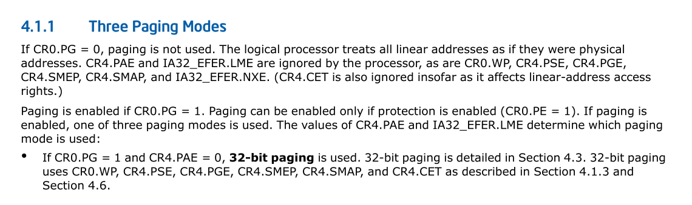

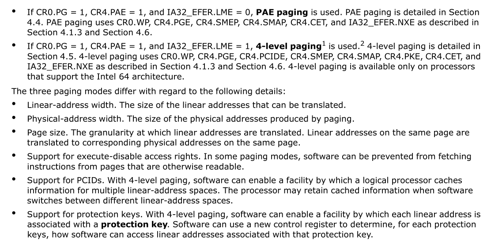

#### 开分页

微软给了一些控制寄存器	  

CR0     CR1     CR2   CR3    CR4

除了CR0 其他的暂时用不到,只有0环有权限问题,3环是不能操作的

CR0      PG =  0 关闭分页功能    PG = 1 开启分页功能

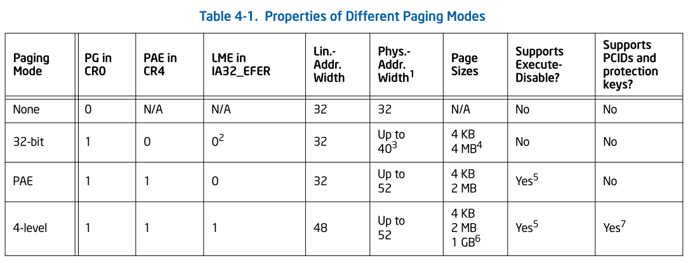

-   PG   PAE     PSE 3位的组合将决定了不同的方法
-   以下表格 X 表示 标志位不重要,不需要去看

| PG(是否开启分页) | PAE(物理地址扩展) | PSE(是否开启大分页支持) | PS (决定是大分页还是小分页) | LA (线性地址) | PA(物理地址) | PageSize(分页大小) |
| ---------------- | ----------------- | ----------------------- | --------------------------- | ------------- | ------------ | ------------------ |
| 0                | X                 | X                       | X                           | 32            | 32           | X                  |
| 1                | 0                 | 0                       | X                           | 32            | 32           | 4K                 |
| 1                | 0                 | 1                       | 0                           | 32            | 32           | 4K                 |
| 1                | 0                 | 1                       | 1                           | 32            | 32           | 4M                 |
| 1                | 1                 | 1                       | 0                           | 32            | 36           | 4K                 |
| 1                | 1                 | 1                       | 1                           | 32            | 36           | 2M                 |

-   PG         是否开启分页                     0不开启   1开启
-   PAE       是否开物理地址扩展        0不开启   1开启
-   PSE       是否开启大分页支持         0不支持   1支持
-   PS          是否为大分页                      0不是       1是    
-   这个表随着年代的发展,不断的在加,不断的在改

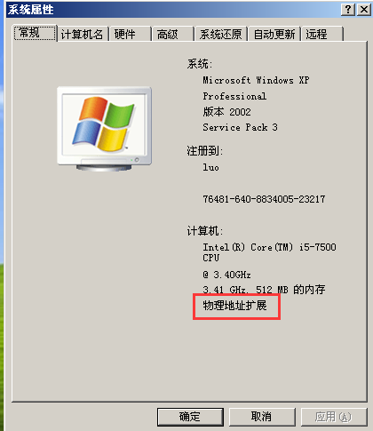

关闭物理地址拓展不能直接改寄存器,因为这样代表的设计变了,但是系统不知道,那么系统就崩了

关闭要通过启动项来改

multi(0)disk(0)rdisk(0)partition(1)\WINDOWS="Debug Entry nopae" /noexecute=alwaysoff /nopae /fastdetect /debug /debugport=com /baudrate=115200


关闭之后在进入 该启动项进行调试


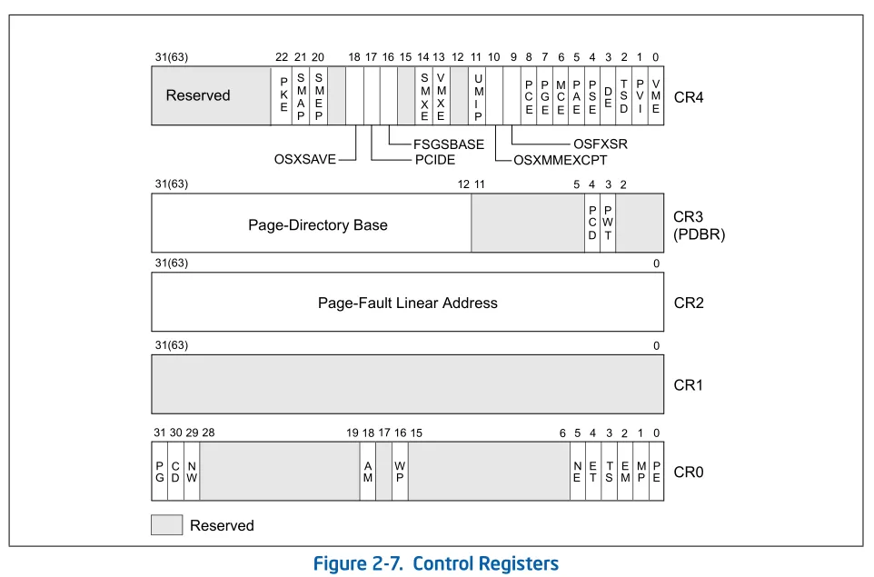


 CR0      

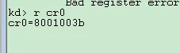


8000003b =>1000 0000  0000 0000  0011  1011

PE         第0位    0 实模式          1保护模式

PG        第31位  0不开启分页     1开启分页

  CR4 

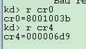


000006d9 => 0000 0000  0000  0000  0000 0110 1101  1001

PSE       第4位    0不支持开启大分页        1支持开启大分页 

PAE       第5位    0不开启物理地址扩展    1开启物理地址扩展


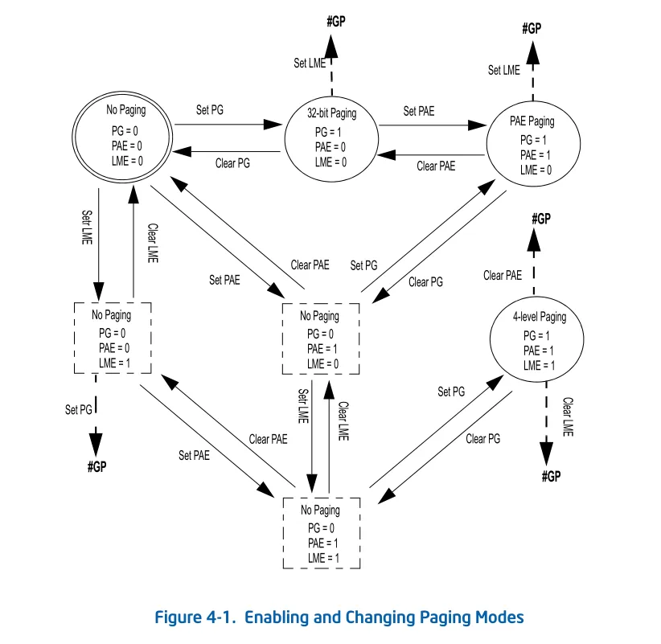


 分页要解决的问题 

 权限问题 

ring0~ring3权限

代码段  Execute, Execute/Read

数据段  Read,Read/Write

堆栈段  Read,Read/Write


每一页的大小已经固定了,所以不需要 limit 了

所以只需要表   物理地址  +  权限就够了

4K的页,低12位一定是0  ,首地址必定是 4K的倍数 ,那这样 我们用高20位就可以了

即     高20位放物理地址  低 12位放权限

要映射4G内存  ,那么表就 需要  4G /  4K =  1M 项

那所以分页表总大小是  4M   ,而且 4M必须连续,因为他是把它当数组下标访问,不连续就没法当下标访问


 4K 分页情况 

 内存隔离 

每个进程都有一个分页表

所以创建一个进程首先就要给 4M 的内存来做表

一个进程不一定要用到4G的内存,但是表我们还是要给 4G,因为要保证内存连续,因此要怎么降低表大小呢

微软设计出了一个新的数据结构用来放表

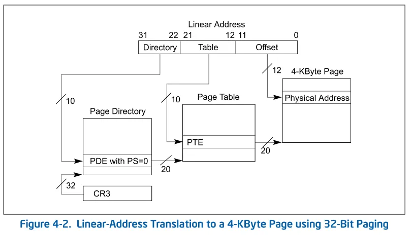

分页格式表


举个例子: 假设有个数组,下标是四位    0x1111  (表示线性地址) 那么下标 的取值是 0~15

ary[16] = {1,2,3,4,5....}; 

我们查表就是拿下标  0~15 去下标访问

数组不是必须得一次性给,我们可以先给8项,不够的话再给 8项

ary[8] = {1,2,3,4,5,6,7,8}; 

ary[8] = {9,10,11,12,13,14,15,16}; 

但是这样下标不连续,没办法直接下标寻址,那么要怎解决呢

那就是把四位的下标  拆成 2位 +2位

其中2位 用来表示 第一个数组的下标   ,另外2位用来表示另一个数组的下标

ary[8] = {1,2,3,4,5,6,7,8};      0~3

ary[8] = {9,10,11,12,13,14,15,16};   0~3

=>

ary1[4] = {ary2,0,0,0};    0~3   (0x11)

ary2[4] = {1,2,3,4}; 0~3   (0x11)

这样我们要访问 2 就可以试  0x00 01

拿2位(0x00) 在  ary 里面 拿到  ary2 的 地址 , 在拿2位(0x01) 从ary2 拿到2的地址  

通过上面设计,我们可以发现数组可以不连续了,而且下标也能用了(拆成2分)

如果4项不够了,我们还可以加一个数组

ary1[4] = {ary2,ary3,0,0};    0~3   (0x11)

=>

ary2[4] = {1,2,3,4};     0~3   (0x11)

ary3[4] = {5,6,7,8};     0~3   (0x11)

-我们要访问6   可以 0x0101 

拿2位(0x01) 在  ary 里面 拿到  ary3 的 地址 , 在拿2位(0x01) 从ary3 拿到6的地址  

不够的话就可以按照这种格式继续加

ary1[4] = {ary2, ary3, ary4, ary4};   0~3

=>

ary2[4] = {1, 2, 3, 4};            0~3

ary3[4] = {5, 6, 7, 8};            0~3   

ary4[4] = {9, 10, 11, 12};     0~3

ary5[4] = {13, 14, 15, 16};   0~3

这样我们只需要一开始给   ary1 这个数组就可以了,这个数组很小,剩下的后面慢慢给就行了

但是有一个问题,如果表填满了,大小反而变大了,因为多了   ary1 (数组地址表),但这样情况很少,大部分进程其实都用不到,所以大部分进程还是减少了很多空间

 页目录表和页表  

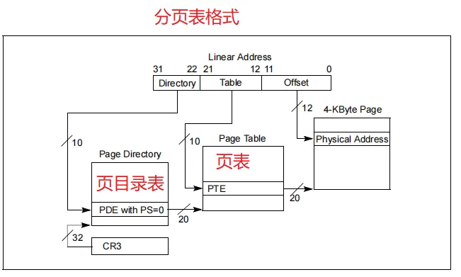


再结合上图,可以可以看到有2个表  

offset   就是记录页内便宜的

例如:  

线性地址   为 0x00401123   =   0x00401000  +   0x123 

那分页表只需要只需要描述 ,线性地址的页首地址在物理的那个页首地址就可以了 ,我们的页首地址 + 12位的偏移就可以算出 物理地址了


就是LA(线性地址)和PA(物理地址)都是以页为单位管理的,没有必要描述LA的内存偏移,只需要描述LA的页首地址

在PA的那个页首地址,而这个偏移就等价于物理地址+偏移.所以就可以认为任何一个线性地址的低12位作为偏移,它必然也等于物理地址的偏移.

线性地址的低12位  = 物理地址的低12bit

比如有一个内存地址是804e3a42,那么这个内存的物理地址的低12位必然是a42

在表里只描述页首地址的映射就可以了 

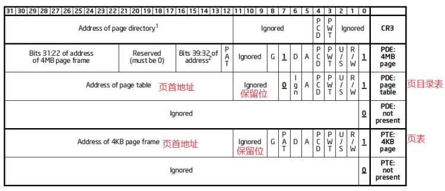


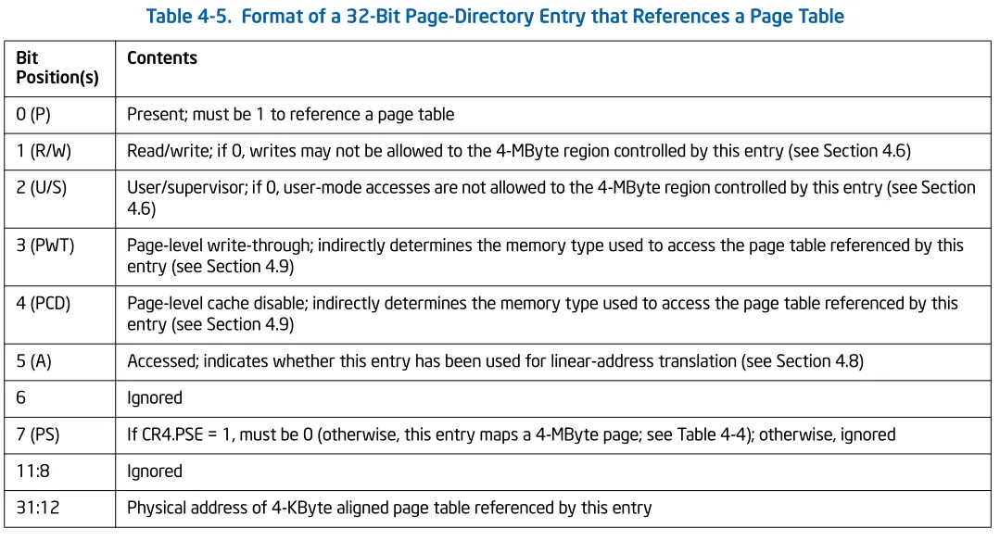

分页目录表各位的作用


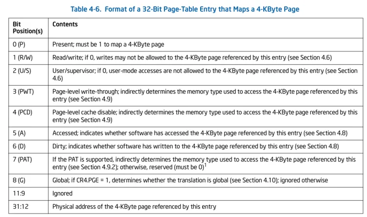

分页表各位的作用


可以看  页目录表 和页表的格式都是一样的

 P            第0位   是否存在    0无效               1无效

R/W       第1位   内存权限    0  Read/excutable    1   Read/write/excutable  (这也是window系统任何一个地址都可以执行代码,任何一个内存都可以写,因为分页功能没有标志位来设置只读不能执行的权限,他只有2种权限)

调试器的内存断点,不可以把一个内存设为只写不能读,他的设计就是 把 P 设为 0,拒接访问,然后CPU访问就会产生异常(没有内存读断点,设不了,因为要设读断点,内存要改为不可读,可内存没这个属性)

U/S        第3位   用户和系统(ring0 或 ring3)   

第12~31 物理页首地址(脂肪20位原因是 低12都是0)  

剩下位目前没什么用

 6页目录表 

(PDT))   Page Directory Table

页目标表每一个项我们称为   PDE    Page Directory Entry

分页目录表的地址 就保存在 寄存器 CR3 中  同理 多核CPU中 每一核都有一个 CR3 寄存器

 6页表 

(PT) Page Table

页表每一个项我们称为  PTE     Page Table Entry


 CPU查表流程 

例如:   代码段    地址是     0x8003f010   那么CPU是如何将线性地址转换成物理地址

1r  cs    查分段表   代码段 CS = 0x000000008   

2dg 8   选择子是8 ,CPU 就会去查 描述符表低8项   

Sel          Base            Limit       Type                  1    ze   an   es   ng    Flags

0008      0000000     ffffffff      Code RE Ac     0    Bg   Pg    P   N1    00000c9b

3检查后,拿到 base  0000000     +  0x8003f010   =  0x8003f010   

4r cr0   查看是否开启了分页 

cr0 = 80000011

5r  cr3   从上面cr0最高位位1 ,说明开启了分页,就是获取2个表了

cr3 = 00039000    cr3指向的是物理地址,假如他是虚拟地址,那我们得先查表才能得到物理地址,那表的地址我们不知道,所以矛盾,所以表地址只能是物理地址

6!dd 39000 查看物理地址,如果读取失败那可能是这个表还没做好(至少需要开机到log页面) ,在去动脉钙化总读物理地址可以用函数 MmMapIoSpace      即  MOV EAX, CR3;   MmMapIoSpace(eax) ,可以用 mov 指令是因为 CR3是 32位的不想  GDTR

7拿到地址后 低12位保持不变 把中间拆成2个10位   8003f 

​    8003f   =》  1000 000000   0000111111  所以  这20位中的的高10位 是 页目录表下标  PDE index = 0x200

   低 10 位是  分页表下标    PTE index =  0x3F

8!dd 39000 + 0x200 * 4  获取分页目录标   0003B163

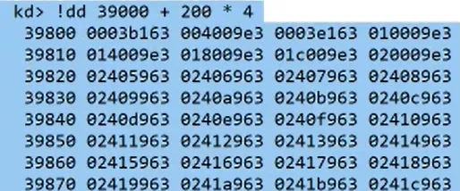


9看一下p位是否为 1，是否有存在页表  ，可以到到最低为1，存在

10!dd 003B0000 + 0x3F * 4    获取分页表信息 ，高20位拿到物理地址   003B0000 

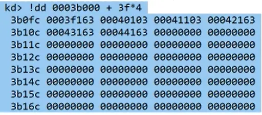


最低四位是 3=》 0011    p 1 有分页   r/w  1  可读可写可执行    u/s 0  0环

11所以我们可以得到物理首地址    0003f000 +     010  =》 3f010


可以验证，我i们查表是没问题的


 !pte 

给一个虚拟地址，让调试器告诉我们页目录表项 和 页表项 在哪

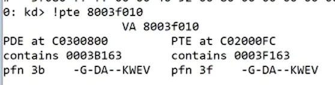


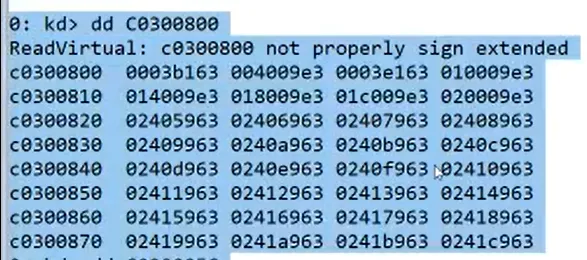


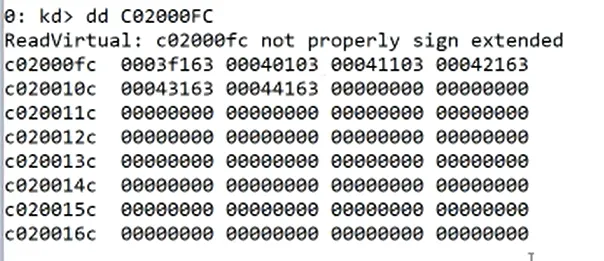


可以看到跟上面我们查的结果是一样的

**内存隔离问题,分页问题**

# 32位内核08 - 内存隔离问题,分页问题


-    昨天解决了权限问题,软件权限有`ring0 ~ ring3`,但是还有内存权限 
-   内存权限就是昨天表里的GDT表里的Type字段解释;
    它分为代码段和数据段的权限,那么就可以认为一个软件是由代码段+数据段组成
    一般还会有一个堆栈段,但是堆栈从本质来讲放的也是数据

-    数据段权限 

-   -   只读 `Read`

-   -   可读可写 `Read / Write`

-   -   数据段是没有可执行权限的,因为数据段是不可执行代码的;这么设计是合理的

-    代码段权限 

-   -   可执行 `Execute`

-   -   可读可执行 `Execute / Read`

-   -   代码段要么可执行,也么可读可执行


## 内存隔离问题


-    解决内存隔离问题也可以通过昨天的段描述符表,也就是让每个进程拥有自己的段描述符表,这样每个进程用自己的表,互不干扰 

段描述符表是从GDTR来的,但是GDTR只有一个,所以切换进程的时候就要把GDTR改成要切换的那个进程的
要切换到A进程就把GDTR改为A进程的表,要切换到B进程也同理

GDTR本身就会映射一块物理内存,所以A进程映射自己的物理空间,B也映射自己的物理空间
但是这个段描述符表也挺大的,大概一个进程要0.5M(512K)的内存.所以在GDTR里就设计了LIMIT就解决了这个问
题(不是所有进程都需要这么大的空间的);
那么这样的话A进程可以给1K,B进程可以给2K这样.但是不可以给这么小...

因为在内存设计里,给每个进程规定了4G的空间,这个叫线性地址(虚拟的),但是这个4G里高2G是要共享的.低2G它
可能就用一点点.而要做到内存共享的话就要把段描述符表指向同一个位置.
这就代表A进程的段描述符表和B进程的段描述符表将会有一半是一样的表项,而且还不能不填.这就造成了浪费..
要节省这个空间的话可以选择把两个进程的表写成一个表,但是就会有内存隔离问题
那么就把高2G不隔离了,低2G隔离,英特尔提供了解决方法

首先把段描述符表分为两部分,一部分是进程共用的,一部分呢是进程不共用的,这样表大小就减少了一倍
这样的话表的地址就变成两个了,CPU通过LDTR寄存器来获取第二个表的位置

GDTR寄存器表示进程共用的表的地址,LDTR表示进程不共用的表的地址,那么切进程的时候就切LDTR寄存器就可以
了

L和G就是一个本地,一个全局
昨天遍历的就是所有进程共享的

-   `LDTR`和`GDTR`结构一模一样 

-    查表(既然有两个表那么查表的话就会有问题) 

之前查表是用 cs ds es这些段寄存器来做下标的,但是现在有了两个表,就不知道cs是GDTR表的下标还是LDTR表
的下标了.

思路很简单,就是从cs里取出一位做一个标识,到底是访问那个表 cs(TI = 0) or cs(TI = 1)
那么这个cs就不能叫下标了,它改名叫段选择子(Segment Seletor)

TI = 0 访问GDT
TI = 1 访问LDT
段寄存器一般只有0环才能修改,3环不让修改

段选择子格式
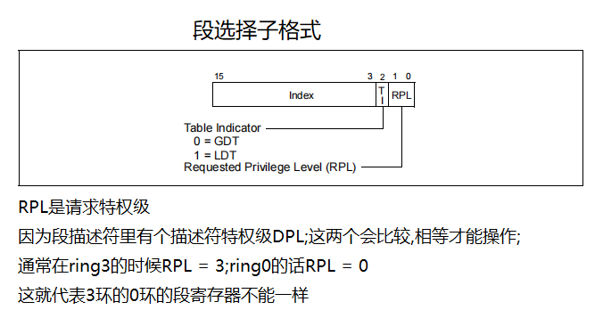

其实还有一个叫CPL,就是当前特权级,意思就是当前CPU所处的特权级是几环
所以当发起一个内存访问的时候
一般拿RPL和CPL做比较,如果这两个都不匹配了就没必要查表了

段选择子的13位是表示下标,TI是1位,RPL是两位

-    CPU访问一段内存的完整流程 

假设当前EIP是778E1E53;cs = 23
先读代码,也就是要读内存,于是就拿到了地址:0x778E1E53,当然地址还不够,还要拿到它的段寄存器.
因为读的是代码,所以拿的就是代码段寄存器cs,

这样CPU就得到了逻辑地址 23:778E1E53;接下来CPU就会把段寄存器当作段选择子拆开
23 ==> 0000 0000 0010 0011 ; 转为段选择子格式==>0000000000100 0 11
这样就得到了它的下标是4,TI是0,RPL是3,也就是3环
TI = 0 就查全局的表

于是就开始读这个内存了,当前特权级和RPL也匹配,都是在3环
接下来CPU就会先拿到gdtr表(假设gdtr表地址是8003f000)
并且还要拿到表的大小(假设是3ff;那么它的范围就是0~3ff,但是算这个要+1,因为这个大小肯定是8的倍数,0也
得算进去).
下标是4,就是第4项,那么就是8003f000+4*8;这样就拿到了描述符;然后就要拆成段描述符做检测

就是CPU从这个地址读取数据,然后按段描述符格式做解析.
第一步会先检查P位. 检查段是否有效
然后检查特权级     检查特权级是否对应
再检查type.      检查内存属性
最后还要看偏移是否越界. 就是查看778E1E53有没有超过段的limit
但是要看limit的话还得看G字段(是字节还是4K)
检查都没问题了就可以访问了,要访问地址的话就要取出物理地址,物理地址的话首先要取出base32.
这样就拿到了物理地址的段首地址了;然后 + 778E1E53 去读数据就行了; (base32+778E1E53 => data)
所以基本上每个字段都用上了
这就是CPU访问物理内存条的全流程

所以3环的段寄存器的特点就是它的RPL肯定是3,而0环的段寄存器是RPL肯定是0

-   -   环和0环要共享数据的话只需要段寄存器一致就可以了

-    Windows段寄存器的设计 

用WinDbg调试系统
当它断在0环的时候发现 gs=0; fs=30; es=23; ds=23; cs=8; ss=10;
(附加段es和数据段ds在微软的设计上是不区分的)

0就是无效的段寄存器,微软在gdtr的第一项给的是无效的(都是0);这样的话某个段寄存器给0的话就表示弃用
所以微软的段描述符表的第一项总是0,用来设置一个无效的段寄存器值

通过观察上面的段寄存器,它们的值并没有低两位都是0.
其中es和ds是3环和0环共享的

当它断在3环的时候(在系统里开一个计算器,然后把进程强制切换到它{.process /i /p 进程对象}).
发现 gs=0; fs=3b; es=23; ds=23; cs=1b; ss=23
3环的段寄存器低两位肯定是3,如果不是就会造成特权级不匹配

所以就会发现在3环的程序里段寄存器低两位肯定是3;而ring3和ring0:fs,cs,ss是隔离的.
同时发现3环的ldtr是0,也就是没给表的地址,这就表示微软并没有使用ldtr而是把它弃用了

分页和虚拟内存 

一个逻辑地址通过分段变为线性地址,然后再通过分页变为物理地址
当然分页可以不开
所以也可能是:逻辑地址 => 分段 => 线性地址(物理地址)

而分页是什么,为什么要做分页:
线性地址是有4个G,但是那时候的电脑不一定真有4G内存,而2000年左右差不多电脑有1G内存
如果玩游戏的话,假设一个游戏需要2G内存,但是电脑只有1G内存,游戏就跑不动了,所以当时就提出了虚拟内存的概
念.(虚拟内存就是硬盘当内存用.这个可以自己在电脑上设置的.就是那个盘里拿出一些空间当内存用)
虽然游戏运行需要2G内存,但是这2G也不是都要用的.就可能现在用个1M或1G,那么剩下的数据就放到磁盘上.一般
系统会建一个文件(pagefile.sys),当它要访问的时候在拿回来

虚拟内存这个功能最早是微软发明的,当时它用软件实现的,实现虚拟内存的功能最难的一点就是判断那些内存现在
没用.第二点就是如何完成快速交换.所以早期虚拟内存并不是很普及,因为效率低,是在太卡了

如果硬件来完成这个事的话,就会很高效;
就是CPU给每个内存访问的时候加个标识.这样时时刻刻就能知道那些内存没用了.
至于实现快速交换,那么原来的分段就不能用了.
假设定义了一个段 0~1G,当发现这1G的内存没用,就会把它放到硬盘上,要用的时候在搬回来.但是这样的话有问
题,因为太大了太多了.
所以要高效访问硬盘.微软就提出了页的概念;一页肯定是硬盘比较适合比较高效的一个访问大小.最早设计一个页是
4K.但是后面内存大的时候一页可以是2M也可以是4M,(它肯定是4k的倍数).
4K这个结果得出是因为硬盘是以扇区为单位存储数据的一个扇区是512bytes;4K是4096刚好是512的倍数.

简单来说就是页是定长的,内存管理的时候页内存不要就整页放到磁盘上,要拿回来就一整页拿回来
所以分页是为了支持虚拟内存功能

操作系统作者要不要支持这个功能是可以自己选择的
要分页就是:逻辑地址  =》 分段  =》 线性地址  =》 分页 =》  物理地址
不分页就是:逻辑地址  =》 分段  =》 线性地址(物理地址)
就多了个分页管理.CPU肯定提供了这个功能,但是用不用在于操作系统作者了

而Windows也是支持这个功能的;但是支持了以后内存寻址就变成了
	逻辑地址  =》 分段  =》 线性地址  =》 分页 =》  物理地址
那么分页也同样要支持内存权限和内存隔离...
于是微软发现分段管理完权限转成线性地址还要再通过分页来管理,这就有两套内存管理了.有点多余了
它想要直接: 逻辑地址  =》 分页  =》 物理地址;这样来完成,把分段直接去掉.
但是不做段表CPU是不承认的,也就是操作系统如果不给GDTR的话分页就不用谈了,CPU直接就断电了.

所以不用分段是不行的.而微软则用方法,巧妙的绕过了这个机制

-   -   机制解释

-   第一步先把ldtr废掉了,不要内存隔离了只做一个全局的GDTR表,这样的话CPU可以查表了,全部都从GDTR里查.
    	在WinDbg里可以用 di命令,来直接看段描述符表:dg 0 100 ; 0 100就是段选择子

-   于是微软就做成了下面这样
    0008 00000000 ffffffff Code RE Ac 0 Bg Pg P  Nl 00000c9b
    0010 00000000 ffffffff Data RW Ac 0 Bg Pg P  Nl 00000c93
    0018 00000000 ffffffff Code RE Ac 3 Bg Pg P  Nl 00000cfb
    0020 00000000 ffffffff Data RW Ac 3 Bg Pg P  Nl 00000cf3
    也就是
    第一项: ring0 0~4G RE  BASE = 0
    第二项: ring0 0~4G RW  BASE = 0
    第三项: ring3 0~4G RE  BASE = 0
    第四项: ring3 0~4G RW  BASE = 0

-   对3环程序来说它的查表肯定会命中0018和0020这两项里,是一定具备权限的
    对0环程序来说查的就是0008和0010,也是具备权限的
    那么3环和0环的段寄存器就固定了,然后它的BASE都是0.

-   CPU去查这个表就已经没有权限问题了.
    假如要读取的地址是:cs:0x778E1E53,这个得到的BASE就是0;也就是0 + 0x778E1E53;
    通过上面那4个表项可以得知:
    任何一个逻辑地址通过查分段表就会得到一个线性地址.;所以逻辑地偏移 = 线性地址(不包含FS)
    也就是778E1E53通过英特尔这个表一查完得到的线性地址还是778E1E53.这就等价于废了
    微软就是通过这样来绕过这个机制的.

-   所以在微软操作系统里逻辑地址等于线性地址,但是不是绝对的;FS是个例外,代码段,数据段,堆栈段的BASE都是0

-   既然把分段关闭了,那么分页必然要开启.

-   -    开启分页功能 

-   微软主要靠分页功能来完成内存管理的.

-   微软提供了寄存器叫控制寄存器
    CR0 
    CR1 -- 保留
    CR2 
    CR3 
    CR4
    这些寄存器只有0环能访问

-   CR0里有一位叫PG位.
    	如果 PG = 1就表示开启分页,如果PG = 0就表示关闭分页 所以微软操作系统CR0中的PG位必然是1
    CR4中有一个PAE位和PSE位

-   有些位是给64位用的,暂时不用管
    它有一个表,用来解释这些字段,但是表罗列的是32位和64位混合的,所以有些位暂时用不到.就大概罗列一下

-   PG 	 PAG   PSE  PS   LA	   PA 	PageSize
     0    x		x   x    32    32      x     ;如果PG位为0,就说明没开启分页,就不用看了
     1    0     0   x    32    32      4k    ;PG开了PAE没开,只有两种情况,要么4K,要么4M
     1    0     1   0    32    32      4k    
     1    0     1   1    32    32      4M     
     1    1     1   0    32    32      4k    
     1    1     1   1    32    32      2M

-   PSE表示大分页支持:就是超过4K的; PS给0就是4K,PS给1就是4M
    如果大分页没开启的话,PS为就不重要了,写什么都是4K
    PAE是物理地址扩展 决定页的大小,所以在Intel手册里支持的分页大小有4K有4M还有2M

-   ## `4K`分页情况

-   

-   -    `4K`分页情况从上面罗列的情况来看只有两种 

-    PG   PAG   PSE  PS   LA   PA 	 PageSize
     1    0     0   x    32    32      4k    ;PG开了PAE没开,只有两种情况,要么4K,要么4M
     1    0     1   0    32    32      4k  

-   在XP里右键我的电脑就能看到物理地址扩展,看到这个就代码PAE是开着的,但是4K里它是不能开的,所以要先关闭它
    关闭的话不能直接改控制寄存器.要通过启动项来改,在启动项里加一个 /nopae.关闭后再启动就要选择nopae模式

-   要看它到底关了没就看CR0就行,但是还不清楚它在第几位.手册里有详细说明

-   -   -   `CR0`结构

-   

最低位是PE位(1bit);0就是实模式,1就是保护模式 ;没有开启保护模式分页就没有意义.
最高位是PG位(31bit)

CR4结构

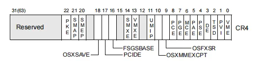


PAE在第5位(5bit)

PSE在第四位(4bit)

-   分页要解决的问题和分段是一样的,都是内存隔离和内存权限 

```plain
每一页的内存大小已经固定了,所以就不需要limit了,这就表示表可以做的更小,只要描述物理地址和权限就够了..
那么这个表的大小就是4个字节
因为物理地址要32位的,权限哪怕给1位这个表大小都是8个字节,但是4K的页有一个特点就是一定低12位是0.
所以就可以认为页的首地址必然是4K的倍数,这样的话只记录20位地址就可以了(CPU在读的时候补上3个0就行了),
然后权限就是12位的了,这个表就是4个字节了.
这个就叫分页表.
分页表要支持映射4G的内存,那么要映射4G的内存就需要1M项
表项计算:内存是4G就是2^32次方,表的每一项可以映射4K内存,所以/4096就得到项数了;再/1024就是1M
那么这个分页表就要4M,而且4M还是要连续的,那就是创建一个进程就要给4M来坐标,还必须是连续的
```

 

-   -   内存隔离

```plain
内存隔离就再来一张表,每个进程都有一个分页表,这样就内存隔离了,所以每创建一个进程就要4M的内存做表
而一个进程并不会用到4G内存,它可能只用了一个G,那么就算它只用1G,这个表还得给4M,这就很浪费,要降低表的
大小.
英特尔发明了一个新的数据结构,来作为分页表格式

假设有个数组,下标是4位,下标就等价于线性地址 0x1111(线性地址) ~ 0xffff 它的下标范围就是0~15
有个ary[16] ={0,1,2,3,4....};那么查表就拿0~15来下标访问
这个数组可以先给8项,不够得时候再加8项
ary[8] = {1,2,3,4,5....}
xxxx (其他内存)
ary[8] = {8,9,10,11,12....}
这时候这个下标就不能用了,内存不连续了,要解决这个问题就要把这两个数组作为不同的地址,不连续的

首先把0~15的下标拆分成 两位两位的,前两位作为第一个数组的下标,后两位作为第二个数组的下标,但是两位的话
最多只能0~3,这就只能表示4项了
那么就是 
ary1[4] = {ary2,0,0,0} 0~3
xxxx (其他内存)
ary2[4] = {1,2,3,4} 0~3
要访问2的话首先通过前两位下标拿到ary2的地址,然后通过后两位来确定2的位置 也就是下标为0x0001
就是拿前两位查ary1,得到第二个数组地址,再拿后俩位确定数值
通过这样的设计数组就可以不连续了,并且下标还可以用.拆成两份就够了
四项不够的话还可以再加一个数组
ary3[4] = {4,5,6,7} 0~3
然后把ary3的地址写到ary1里ary1[4] = {ary2,ary3,0,0};那么假设访问5的话下标就是0x0101
还不够的话就一直加,如果把ary填满的话,刚好就可以放0~15项,同时也可以不连续了
不连续的话就代表一开始只给写一个表啊,然后再往后加,填满了以后再往后加
但是如果都填满的话,这个表就比原来直接做表更大了,但是不会大很多.
而且进程基本上不会用到4G内存.所以就巧妙的减少了表的大小
```

-    分页表格式
    

```plain
页目录表叫Page Directory Table;缩写为PDT
页目录的每一项叫Page Directory Table;缩写为PDE
页表叫Page Table;缩写为PT 
页表的每一项叫Page Table Entry;缩写为PET 


虚拟地址等价于线性地址;假设有一个虚拟地址是0x00401123
假设映射的物理地址是0x1000,因为是以页为单位的,那么分页表只需要描述线性地址页首地址在物理地址的那个页
首地址,查到物理页的首地址后,再加上它的偏移就能算出物理地址了

就是LA(线性地址)和PA(物理地址)都是以页为单位管理的,没有必要描述LA的内存偏移,只需要描述LA的页首地址
在PA的那个页首地址,而这个偏移就等价于物理地址+偏移.
所以就可以认为任何一个线性地址的低12位作为偏移,它必然也等于物理地址的偏移.
线性地址的低12位  = 物理地址的低12bit
比如有一个内存地址是804e3a42,那么这个内存的物理地址的低12位必然是a42

在表里只描述页首地址的映射就可以了
```

 

-    页目录表和页表格式
    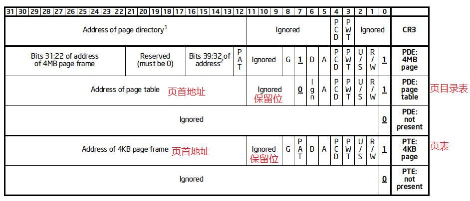

```plain
页目录表和页表基本上是一样的格式,只不过在某些标志位上可能有些差异.
最低位就是P位:就是存在位;0表示不存在,1表示存在
R/W(1bit):内存权限位;0表示可读可执行,1表示可读可写可执行;
		  这就是Windows操作系统任何一个地址都可以执行代码和写入的原因.当时调试器的内存断点其实就
		  是把P位给0了,让它无法访问了.因为无法把内存改为可写不可读
U/S(2bit):用户User和系统位System;就是0环和3环
Address of page table  (20bits):高20位就是物理页首地址
剩下的位暂时没啥用了
```

 

-    `CPU`通过`CR3`寄存器来得知页表和页目录表的地址 

-   -    `CR3`可以拿到页目录表地址,然后就可以查出物理地址了;(分页表格式图) 

-   -    同理`CR3`如果是多核CPU的话,每一核都有一个 

-    模拟`CPU`查表流程 

```plain
这个地址8003f010;CPU是如何从线性地址转换成物理地址的 
第一步先查分段表
	这是代码段,所以是CS.得到CS为00000008,也就是选择子,所以CPU就会查描述符表第8项,查到之后就获取
	到Base了,Base再加上8003f010   = 8003f010 
然后观察是否开启分页了
	查看CR0寄存器,看它的最高位是否是1;开了的话就有分页机制
查看CR3寄存器
	获取到页表首地址(00039000);CR3指向的是物理地址;(!dd可以查看物理地址)
	在驱动里的话要通过MmMapIoSpace函数映射一个物理地址
	MOV EAX, CR3;MmMapIoSpace(eax)
线性地址低12位保持不变,然后把中间拆成两个10位
	8003f 010 => 8003f =>   10 0000 0000 00 0011 1111 
	其中高10位是页目录表的下标.页目录表的索引就是 0x200
	页表项的索引就是 0x3f
然后开始查表
	!dd 39000 + 200 * 4;页目录表首地址 + 索引 * 4
	#   39800 0003b163 004009e3 0003e163 010009e3
    #   39810 014009e3 018009e3 01c009e3 020009e3
    #   39820 02405963 02406963 02407963 02408963
首先先看最低为是否有效
	有效说明存在页表,然后拿高20位补3个0就是页表首地址;0003b => 0003b000
在查看页表
	!dd 0003b000 + 3f * 4
    #   3b0fc 0003f163 00040103 00041103 00042163
    #   3b10c 00043163 00044163 00000000 00000000
    #   3b11c 00000000 00000000 00000000 00000000
这样就找到了物理页的首地址是0003f,然后再补上0 就是0003f000;
并且最低位是3也就是0011所以最低位就是1 ,表示内存是有效的,并且是可读可写可执行的,0是系统权限.
解析低3位就够了.
最后再加上偏移010,这样就得出它的物理地址是 3f000  + 010 = 3f010  
这就是CPU的查表流程.

验证的话就直接 !db 8003f010 先查看线性地址的数据,然后再!db  3f010 查看计算出来的物理地址,看这两
个地址所查出来的数据是否一致
也可以通过!pte来验证.
!pte的意思就是给一个虚拟地址,让调试器来告诉我它的页表项和页目录表项在哪里
!pte 8003f010;这样写,WinDbg就给出它的页表项和页目录表项地址了
```

 