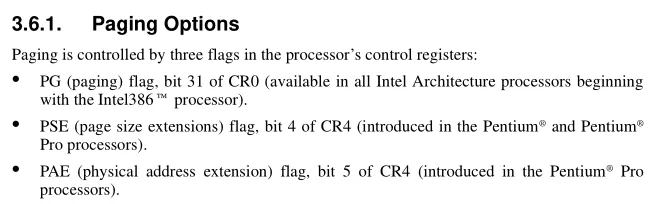


PG(CR0        31)       分页标志    1

PSE(CR4      4)          页大小扩展   1

PAE(CR4      5)          物理地址扩展  1

PS(PDE         7)         大分页     1

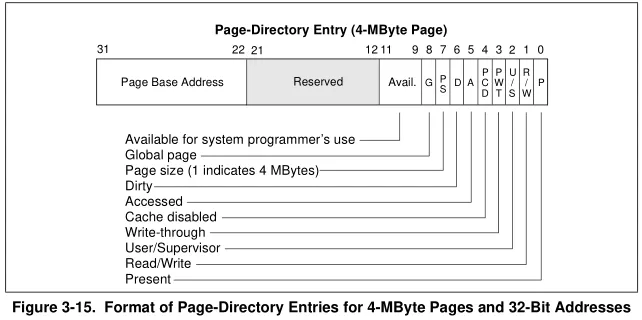


如何内存足够大一个页4M是合理的

如何我们把一个页设为4M对于做表来说跟之前相比,标的数量减少了,偏移也变了(4K的偏移最大是4096  ,而4M的偏移是 4M)


 4M页分页情况 

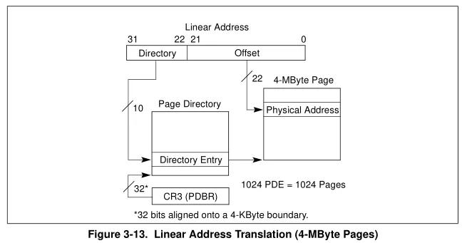


跟4K的相比   偏移变成了22位,没有了页表了,因为不需要了

低22位当偏移   高10位当做用户 页目录表下标,页目录表的每一个下标都可以当做4M的内存,一共 1024项

1024 * 4M = 1024 * 4 * 1024 * 1024  = 4G 刚好4G,因此只需要一个页目录表 (1024项) 就可以内存映射完,不需要页表

但是把所有页都弄成 4M 有点浪费,因为太大了,所以我们希望有一种折中的方案,即需要大的页就给大的页,不需要就给4K

完成这个设计就是 靠  PS 位 (0就是4K,1就是4M),他先查ps位,如果为0,那么就按4k的页去查页表,如果为1,他就不会去查页表,直接把页首地址+22位偏移当做物理地址,直接看最后一位是否大于8就可以,因为 ps位在第7位,最低字节的最高位

4M的页一般是给操作系统,3环地址一般给4K


windbg 和已通过  .formats  把一个16进制数字拆成二进制显示


 物理地址扩展 

当时CPU是32位,他能访问的最大内存是4G,但是在那个年代,内存的发展速度是高于CPU的,因此很多人的内存可能超过了4G,因此cpu需要想办法去支持超过 4个G 的内存

解决办法:

1发布64位的 CPU    

但是当时 64位 成本较高 而且对于大多少人来说可能都用不上,所以把cpu升级为64位在当时没必要

2加4根地址线     奔腾CPU  这样物理地址最大就变成了 2^36  = 64 G 了,但是寄存器还是32位


因此我们需要将32位线性地址转成为 36位的物理地址,那怎么转换是一个问题,在16位 转 20位 的年代是通过段寄存器补上了4位

我们只需要把页目录表的首地址改成24位就可以了(之前是20位),但是之前页表和页目录表容不下这四位,而且要兼容以前的的,所以只能扩展 ,四字节扩展成8字节 ,目前用不到的就保留

因为CPU换了,所以操作系统得要重写


一个分页 要么是 4K ,要么是 2M 要么是混用,微软是喜欢混用, 因此在 在 windows系统上,一个页是4K,这个说法是不准确的,但是有的时候说的是3环的内存空间,这是准确的


 4K查表 

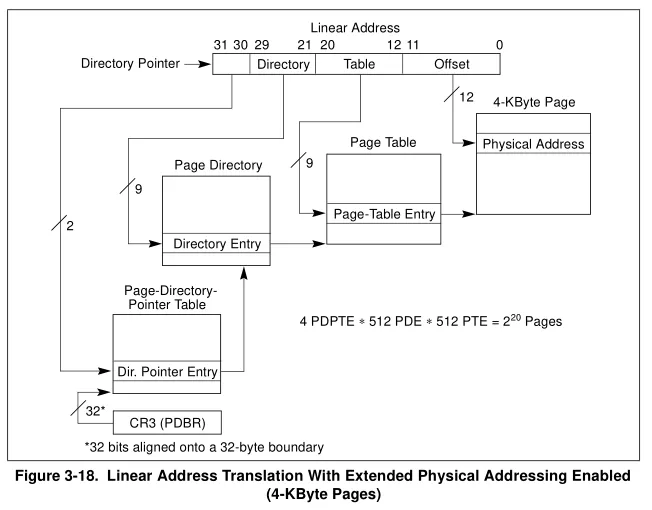


页目录表和页表解析


原先 :    

PDE(页目录表) 1024项     10位

PTE (页表)        1024项      10位

全部填满刚好 4G


现在:

PDE(页目录表)  512项     8字节     (因为原先4自己,变成8字节,所以每项大小增加了一倍,所以项数减少一倍)

PTE (页表)         512项     8字节     (因为原先4自己,变成8字节,所以每项大小增加了一倍,所以项数减少一倍)

所以此时只能 映射 1G 内存,但是一个进程需要4个G内存.因此需要4个页目录表

因此加了一个表    PDPTE  页目录指针表      2位

原来的下标是20位 ,所以刚好拆成

PDPTE  页目录指针表      2位

PDE       页目录表              9位

PTE       页表                       9 位


=>  从CR3 拿出    页目录指针表    再拿出  页目录表   再拿出  页表

例如:  我们查 虚拟地址  0x807d3c20  对应的物理地址   CR3 =  185000
先拆成    20 + 12位  =>    807d3   c20    所有  offser = c20
807d3    =>   10 000000011  111010011       
=>  PDPTE =  2
=>  PDE    =    3
=>  PTE   =      1d3

 kd> !dq 185000 + 2 * 8                      CR3+   PDPE *  8 #  185010 00000000`00188001 	00000000`00189001 #  185020 00000000`00000000 	00000000`00000000 #  185030 00000000`00000000 	00000000`00000000 #  185040 00000000`00000000 	00000000`00000000 #  185050 00000000`00000000 	00000000`00000000 #  185060 00000000`00000000 	00000000`00000000 #  185070 00000000`00000000 	00000000`00000000 #  185080 00000000`00000000 	00000000`00000000 取出24位(第12 -  35位),然后低12位再补3个0,就得到了页目录表的地址 0`00188000 ==> 页目录表的地址(36位的) 页目录表在第3项 !dq 00188000 + 0x3 * 8 kd> !dq 00188000 + 0x3 * 8             上面结果 取第35-12位(低12位补0)  *   PDE   *   8 #  188018 00000000`3cfc6863	 	00000000`00192063 #  188028 00000000`00193063 	00000000`3cf42863 #  188038 00000000`00000000 	00000000`001c2063 #  188048 00000000`001c3063 	00000000`001c4063 #  188058 00000000`001c5063 	00000000`001c6063 #  188068 00000000`001c7063 	00000000`001c8063 #  188078 00000000`001c9063 	00000000`001ca063 #  188088 00000000`001cb063 	00000000`001cc063 这样就查出了页表地址 取出24位(第12 -  35位),然后低12位再补3个0,就得到了页表的地址 03cfc6000 ==> 页表地址 (36位的) 页表在1d3项 !dq 3cfc6000 + 1d3 * 8  kd> !dq 3cfc6000 + 1d3 * 8             上面结果 取第35-12位(低12位补0)  *   PTE  *   8 #3cfc6e98 80000000`23f3d963 	80000000`23f3c963 #3cfc6ea8 80000000`23f3b963 	00000000`00000000 #3cfc6eb8 80000000`23d00963 	80000000`23f7f963 #3cfc6ec8 80000000`23f7e963 	00000000`00000000 #3cfc6ed8 80000000`23cc3963 	80000000`23b82963 #3cfc6ee8 80000000`23b81963 	00000000`00000000 #3cfc6ef8 80000000`23dc6963 	80000000`23dc5963 #3cfc6f08 80000000`23cc4963 	00000000`00000000 
上面结果       物理地址 =   上面结果 上面结果 取第35-12位(低12位补0)   +   offset
 取出24位(第12 -  35位),然后低12位再补3个0,这就是物理地址了,然后再加上之前的偏移 023f3d000 + C20 = 23f3dC20  

虚拟地址(va) = 807d3c20   
物理地址 (pa) = 23f3dC20  =  023f3d000+ c20  


 2M页查表 

用ps等于少了一张表

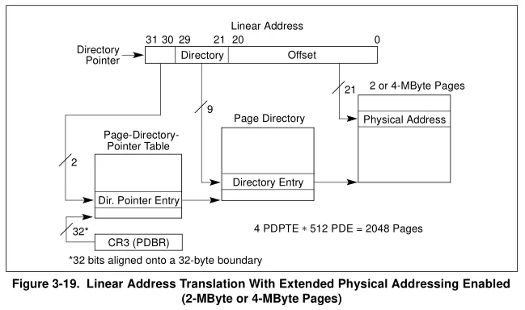


一般都是系统进程

1 r    CR3    和  r  CR4  查看cr3 和  cr4的值    CR3 = 00185000     CR4 = 000406f9

2!dq    00185000     以dq格式 查看该地址的值

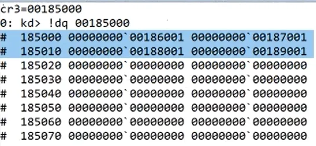


这里我们选择第三项

3 dq    0188000    以dq格式 查看该地址的值

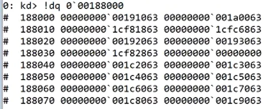


然后去找2M的页 ,最低的数字大于8就行

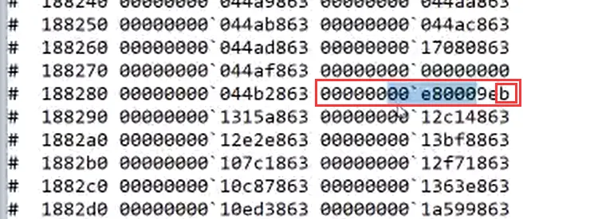


所以物理地址   00e800000  +    21位偏移 


通过虚拟地址或得物理地址:     

PHYSICAL_ADDRESS  MmGetPhysicalAddress(   IN PVOID  BaseAddress    );

  模拟MmGetPhysicalAddress函数   

就是把虚拟地址转换为物理地址但是用内核的API做的话有时候会被检测到,因此我们可以自己实,这样就可以绕过一些保护

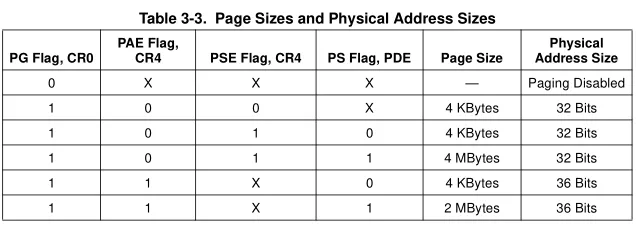


Drv.cpp

```
\#include "Drv.h"

                PhysicalAddress->QuadPart = (pPDT[PDEIndex].BaseAddress << 12) + 

                    ((unsigned)VirtualAddress & 0x1FFFFF);

                //基址左移12位拼成一个36位的物理地址,然后再加上虚拟地址的低21位偏移

            }

            else {//4K

                //4K的话还得查分页表

                pa.QuadPart = cr3 = pPDT[PDEIndex].BaseAddress;//用页目录表的地址

                lpBuffer = MmMapIoSpace(pa, 0x1000, MmNonCached);

                //得到页表下标

                int PTEIndex = (unsigned)VirtualAddress >> 12 & 0x1FF;

                PageTable* pPT = (PageTable*)lpBuffer;

                //判断是否有效

                if (pPT[PTEIndex].p == 0) {

                    return STATUS_UNSUCCESSFUL;

                }

                

                //4K的物理地址

                PhysicalAddress->QuadPart = (pPDT[PDEIndex].BaseAddress << 12) + 

                		((unsigned)VirtualAddress & 0x1FFFFF);

                //页表的BaseAddress左移12位得到一个36位的物理地址,再加上虚拟地址的低12位偏移

            }

        }

        else {

            //32位地址,表项4个字节

        }

    }

    else {

        //没有开启分页

        return STATUS_UNSUCCESSFUL;

    }

    return STATUS_SUCCESS;

}

/*驱动卸载函数 clean_up*/

VOID Unload(__in struct _DRIVER_OBJECT* DriverObject)

{

  KdPrint(("[51asm] Unload! DriverObject:%p\n", DriverObject));

}

/*1.驱动入口函数*/

 NTSTATUS DriverEntry(

  __in struct _DRIVER_OBJECT* DriverObject,

  __in PUNICODE_STRING  RegistryPath)

{

   UNREFERENCED_PARAMETER(RegistryPath);

   PHYSICAL_ADDRESS pa = {0};

   MyGetPhysicalAddress((PVOID)0x807d3c20, &pa);  //调用获取地址函数

   DbgPrint("pa=%llx", pa.QuadPart);

  //4.注册卸载函数

  DriverObject->DriverUnload = Unload;

  return STATUS_SUCCESS;

}
```

**物理地址扩展情况**

上节课学习的是分页表4K的情况,也是最早的CPU 

○34位里有些位是0,64位里对应的位会是L,这是用来表达是64位CPU的

● 分页选项的标志 


 

● 把一个页设计为4M对做表是有影响的 


 

● 4M页的查表方法

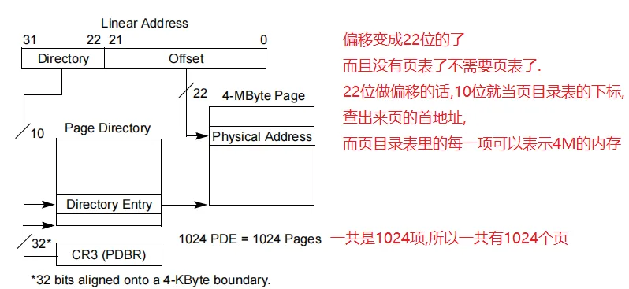


 

● 一般系统的进程系统就会给4M的页.3环的进程很少会给4M的页,只会给4K 


 


 物理地址扩展 


● 物理地址扩展的由来 


 


 4K页查表解析 


● CR3还是保持不变,和之前一样 

●

 解析

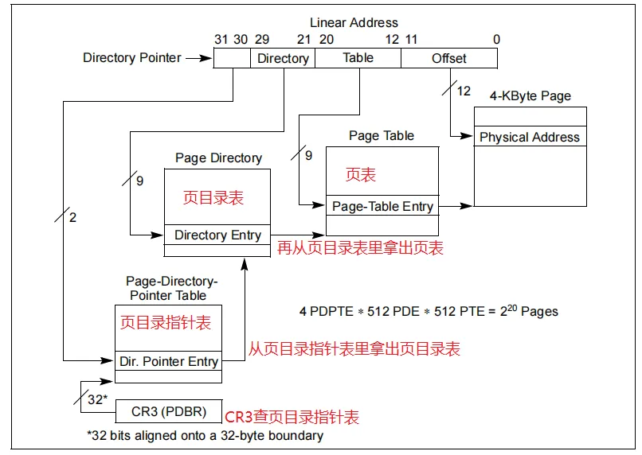


 

● 流程 


 


kd> !dq 00188000 + 0x3 * 8 188018 000000003cfc6863 0000000000192063 188028 0000000000193063 000000003cf42863 188038 0000000000000000 00000000001c2063 188048 00000000001c3063 00000000001c4063 188058 00000000001c5063 00000000001c6063 188068 00000000001c7063 00000000001c8063 188078 00000000001c9063 00000000001ca063 188088 00000000001cb063 00000000001cc063 这样就查出了页表地址


再取出24位,然后补3个0,就得到了页表的地址 03cfc6000 ==> 页表地址 (36位的) 页表在1d3项 !dq 3cfc6000 + 1d3 * 8 kd> !dq 3cfc6000 + 1d3 * 8 3cfc6e98 8000000023f3d963 8000000023f3c963 3cfc6ea8 8000000023f3b963 0000000000000000 3cfc6eb8 8000000023d00963 8000000023f7f963 3cfc6ec8 8000000023f7e963 0000000000000000 3cfc6ed8 8000000023cc3963 8000000023b82963 3cfc6ee8 8000000023b81963 0000000000000000 3cfc6ef8 8000000023dc6963 8000000023dc5963 3cfc6f08 8000000023cc4963 00000000`00000000 取出24位,这就是物理地址了,然后再加上之前的偏移


0`23f3d000 + C20 = 23f3dC20 最后校验就是 !db 23f3dC20 和 db 807d3C20 因为是36位地址,所以都要加上!来查数据,否则数据就不对


\- 页目录指针表格式


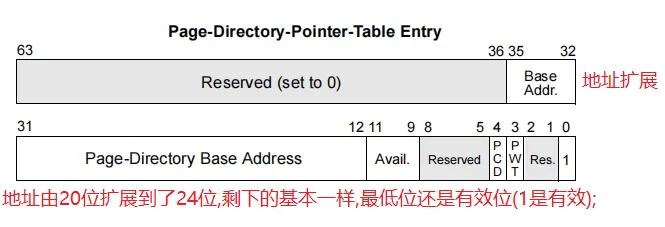


\- 页目录表页表格式(都是一样的,只是多了地址扩展)


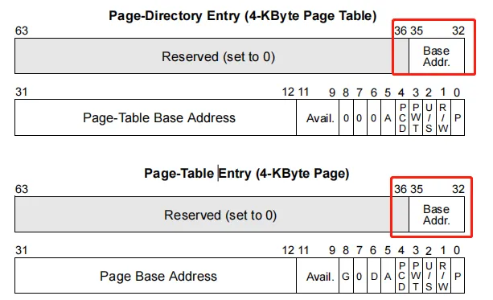


\### `2M`页查表解析


\- `2M`页没有页表了,偏移变成21位了


\- 上面查`4K`表的流程是有问题的,因为没有查看`PS`位


\- 在页目录表里要查看`PS`位,是0还是1,如果页目标表项是`4K`的话,就是0,是`2M`的话就是1


\- `2M`页一般只给系统进程,所以要切换到系统进程来做测试

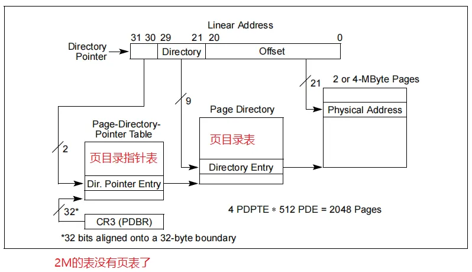


!process 0 0 找一个系统进程 .process /i /p 855d59e8 (对象ID) 这就切换过来了


然后查看这个进程的CR3,每个进程都有自己的CR3这样就隔离了 CR3 = 00185000 !dq 00185000  ;这就是页目录指针表,这里的每一项都会有512个表项,所以就可以 dq xxxxxxx L 512 在里面找到一个2M的页来查看.


\- `2M`表的页目录指针表和页目录表格式

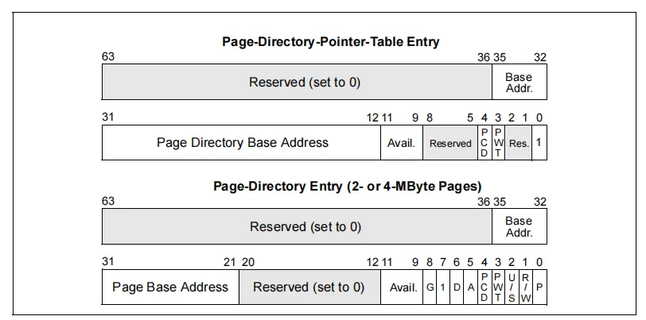


\- 至此32位系统的表格式就全部讲解完毕了,一共就五种情况


\###  `MmGetPhysicalAddress`代码实现


\- 输入一个地址,把它转换为物理地址


\- 它是可以通过内核`API`来完成`MmGetPhysicalAddress`


```c++
 //给一个虚拟地址,传出物理地址

  PHYSICAL_ADDRESS MmGetPhysicalAddress(

      IN PVOID  BaseAddress

  );

  //PHYSICAL_ADDRESS 这就是一个LONG LONG 分为高32位和低32位
```


 


●访问物理地址有两种方法


● 实现MmGetPhysicalAddress 


实现这个功能就可以不用操作系统的API了,可以通过硬件的一些方式直接操控所有进程的内存了,可以秒杀保护...

杀软都检测不到.调用API操作肯定是会被阻止的.所以自己实现就有这些好处.

从本质来说我们并不是和系统通讯,而是直接和CPU通讯

/***************************代码实现*******************************/

```
\#include <intrin.h>

//页目录指针表,页目录表,页表.这3个表格式都是一样的,只是有些字段用的不一样,所以直接定义一个表就行了

//但是得做两个,32位和64位

struct PageTable {

  unsigned int p   : 1; //P位,是否有效位

  unsigned int rw  : 1; 

  unsigned int us  : 1; 

  unsigned int pwt : 1; 

  unsigned int pcd : 1; 

  unsigned int a   : 1; //是否以访问

  unsigned int d   : 1; 

  unsigned int ps  : 1; //ps位

  unsigned int g   : 1; 

  unsigned int avl : 3; //低12位到此结束

  unsigned int BaseAddress : 24; //24位的页基址

  unsigned int res : 28; //打开PAE的页的28位高位保留位

  //12 + 24 + 28 = 64位 所以一共八个字节

};

NTSTATUS MyGetPhysicalAddress(IN PVOID  VirtualAddress, PHYSICAL_ADDRESS*  PhysicalAddress) 
{

    

    //获取CR0的值,使用内联汇编的话会出现不兼容的问题,因为64位不让内联汇编

    ULONG cr3 = __readcr3();//通过内部函数来解决,每个寄存器都有内部函数来获取值,

	//也有__writecr3

    ULONG cr0 = __readcr0();//cr0和cr4要包含<intrin.h>头文件

    ULONG cr4 = __readcr4();

    //判断cr0的最高位是不是1,就是是否开启分页

    if (cr0 & 0x80000000) {

        //然后再看PAE有没有开启 PAE是cr4第五位

        if (cr4 & 0x20) { //100000 PAE

            //36位物理地址,并且表项8个字节

            //获取页目录指针表地址,要访问物理地址了.cr3是物理地址

            PHYSICAL_ADDRESS pa;

            pa.QuadPart = cr3;

            //0x1000是映射大小;第三个参数是是否放到缓存里,MmNonCached是不放;

            PVOID lpBuffer = MmMapIoSpace(pa,0x1000,MmNonCached);

            /*

                它为分页表单独做了一个缓存叫做TLB

                意思就是读取的时候为了兼容把所有的表拆的很散,格式很乱

                所以CPU都会给这些表做缓存

                把内存里的表全部拼好放到缓存里,以后就只查询缓存.这样格式再乱也没关系了

                缓存就有个问题就是啥时候刷新...

                如果cr3改了,它就会更新了

            */

            //页目录指针表用高两位查,用虚拟地址的高两位查

            //直接右移30位,但是要注意符号位,所以清掉最高位 & 0x3,

            //但是强转位unsigned的话就不需要清了

            int PDPTIndex = (unsigned)VirtualAddress >> 30;

            //页目录指针表(直接把这个地址(物理内存)当作页目录指针表)

            PageTable* pPDPT = (PageTable*)lpBuffer;

            if (pPDPT[PDPTIndex].p == 0) { //判断P位

                return STATUS_UNSUCCESSFUL;

            }

            //获取页目录表地址

            pa.QuadPart = cr3 = pPDPT[PDPTIndex].BaseAddress;

            lpBuffer = MmMapIoSpace(pa, 0x1000, MmNonCached);

            //拿到地址后右移21位再与上9位,也就是高2位要清掉,得到页目录表的下标

            int PDEIndex = ((unsigned)VirtualAddress >> 21) & 0x1FF;

            //得到页目录表地址

            PageTable* pPDT = (PageTable*)lpBuffer;

            //判断是否有效

            if (pPDT[PDEIndex].p == 0) {

                return STATUS_UNSUCCESSFUL;

            }

            //判断PS位

            if (pPDT[PDEIndex].ps) {//2M

                //2M的话物理地址就可以直接给了

                PhysicalAddress->QuadPart = (pPDT[PDEIndex].BaseAddress << 12) + 

                    ((unsigned)VirtualAddress & 0x1FFFFF);

                //基址左移12位拼成一个36位的物理地址,然后再加上虚拟地址的低21位偏移

            }

            else {//4K

                //4K的话还得查分页表

                pa.QuadPart = cr3 = pPDT[PDEIndex].BaseAddress;//用页目录表的地址

                lpBuffer = MmMapIoSpace(pa, 0x1000, MmNonCached);

                //得到页表下标

                int PTEIndex = (unsigned)VirtualAddress >> 12 & 0x1FF;

                PageTable* pPT = (PageTable*)lpBuffer;

                //判断是否有效

                if (pPT[PTEIndex].p == 0) {

                    return STATUS_UNSUCCESSFUL;

                }

                

                //4K的物理地址

                PhysicalAddress->QuadPart = (pPDT[PDEIndex].BaseAddress << 12) + 

                		((unsigned)VirtualAddress & 0x1FFFFF);

                //页表的BaseAddress左移12位得到一个36位的物理地址,再加上虚拟地址的低12位偏移

            }

        }

        else {

            //32位地址,表项4个字节

        }

    }

    else {

        //没有开启分页

        return STATUS_UNSUCCESSFUL;

    }

    return STATUS_SUCCESS;

}
```

