### 16位CPU

-   因特尔在16位cpu就做了保护模式，并不是从32位开始的，因此会有很多历史残留问题，尤其是表格式，但是保护模式普及实在32位
-   实模式是没有内存管理的，但是存在段管理，但是他的段跟保护模式的段是不一样的，因为当时16位的cpu只能访问64k（2^16）的内存
-   但是内存发展比cpu更快，因此他加了四位，这样就可以访问 1M （2^20）的内存，尤其寄存器还是16位（ip寄存器），无法访问20位的物理地址，于是提出了用2个寄存器来表达地址，用2个16位寄存器
-    所以就加了四个段寄存器 cs   ss  es  ds 

-   -   cs：ip
    -   ss:   sp
    -   es:   [1000]
    -   ds:   [1000]

-   段+寄存器就来表示逻辑地址，因此一直以来CPU用的逻辑地址，ip从来都是一个便宜不是一个地址

### 32位CPU

-   寄存器变成了 32位 ，因此支持的最大内存是 4G（2^32）=>0xFFFFFFFF此时EIP 可以指向内存条的任何一个地址，所以不需要分段了
-   所在在保护模式下，也称为  Flat Model(平坦内存模型)，所以分段就没有用了，段寄存器也就没用了，但是为了兼容以前的16位的系统，所以段寄存不能删除
-   但是后面我们遇到了一个问题，在32位里面，我们需要给内存权限，内存权限应该有由操作系统提供，CPU来进行验证（因为cpu验证比较快）
-   操作系统告诉CPU内存权限的方法就是CPU提供一张表的格式，让操作系统去填，填完告诉CPU，这个表就叫做段描述表

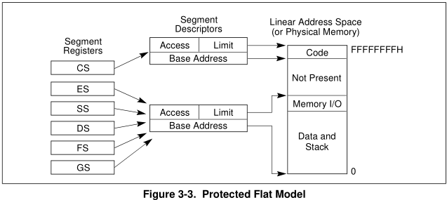

-   有了分段表，接下来就是怎么查表了，段寄存当作表的下标就可以重用寄存器，不造成浪费了，所以CS就成了查询段描述表的一个索引，所以  逻辑地址 =》 段描述符表 =》线性地址（不开分页物理地址），而逻辑地址就是  CS:EIP
-   段寄存器就变成了段选择子

-   -   1  要验证权限 
    -   2  段描述符表 变成了2个，一个全局  2G共享，一个局部  2G独立 ，2个表是为了节省表空间

-   这样就会产生一个问题我们拿段寄存器查表到底查哪一个，因此得在段寄存器内加一个标志，变成段选择子。通过段选择子去查找得到一个段基址 + 逻辑地址的偏移，就可以得到一个线性地址

-   -   段选择子：   13位下标 +   TI（0全局或1局部）  +RPL（特权等级）


-   -   因为段选择子的下标是 13位 =》 2^13 = 8192 =》描述符表的最大项数是  8192 ，再多的话13位下表表达不了

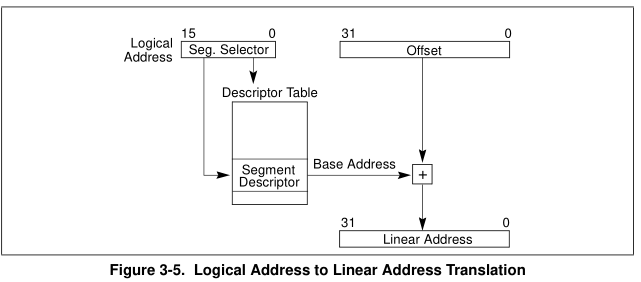

#### 段描述符

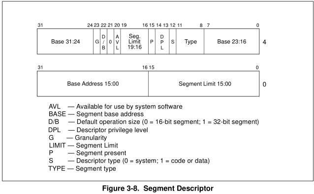

```cpp
struct SegmentDescriptor {
  unsigned limit1 : 16;   //段界限 (低16位)
  unsigned base1 : 16;    //段基址 (低16位)
  unsigned base2 : 8;     //段基址 (第17-24位)
  unsigned type : 4;      //内存权限（属性） 
  unsigned s : 1;         //描述符类型 (0 = 系统段; 1 = 存储段)
  unsigned dpl: 2;        //描述符特权级 ring0~ring3  
  unsigned p : 1;         //存在位 0 段不在 1存在 (删除标志),可以判断是否有效
  unsigned limit2 : 4;    //段界限 (第17-20位) (分开是为了兼容16位)
  unsigned avl : 1;       //软件可利用位 (保留给系统软件)
  unsigned l : 1;         //64段标志,32位是0
  unsigned db : 1;        //0 =》 16位或者  1 => 32位段 (兼容16位)
  unsigned g : 1;         //粒度位  1=》 4K    0 => byte
  unsigned base3 : 8;     //段基址 (第25-32位)
}; 
```

-   计算段界限和段基址需要通过位运算先把隔离的位拼在一起
-   当 G = 1时 ，段界限 =》   limit * 4k + 0fff
-   type   内存属性

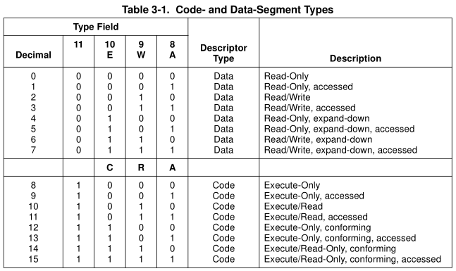

-   -   分为2类数据段   和   代码段

1.  1.   数据段 （一定可读，想要不可读只能 p = 0 ，内存断点的实现就是修改 p标志 让内存不可访问 产生异常）

-   -   A  =1 ，代表已访问
    -   W =1 ，代表可写
    -   E  = 1 ，向下扩展（一般用于堆栈段）

1.  1.    代码段（一定可执行 想要不可执行只能 p = 0）	      

-   -   A  = 1 ，代表已访问
    -   R  = 1 ，代表可读
    -   C  = 1 ，一致代码段 （把0环的一段代码共享给3环，即让3环可以执行0环的代码，通过 RPL 和 DPL的验证 ）

-   一致代码段：

假设在内核空间中   0x80000000  处放了一行代码  mov eax, ebx；            seletor = 30（在段描述符段选择子在30的位置）

3环是不能执行这行代码，因为cpu在做检测的时候由权限验证

多用户空间中怎么做到去执行这个代码呢

mov  cs，30；  

jmp   0；

=》 此时cpu就会 拿 cs 去查表，就会得到段基址  0x80000000 ，加上偏移得到线性地址，这样就可以跳到 

0x80000000  处，但是此时因为权限问题无法执行该处代码

在段描述表里面有一个这个状态 dpl  ，因此在3环空间中

CPL= 3 ，但是段寄存器的值是0 ，所以查表得时候CPU肯定会拒绝美因茨我们需要吧  RPL改成 3

即 =》 

mov  cs，33；  

jmp   0；

这样发起请求就没问题，但是还有DPL，CPU就会拿 RPL 和 DPL 作比较，发现权限不匹配，就会产生异常

但是我们有时候是需要 3环去共享0环的代码段的，例如：  API      CreateFile

我只只需要把一致代码段置1就可以了，这样就可以通过   RPL  和   DPL  的验证


#### 硬件寻址方式

##### 用户层修改段寄存器

cs       ds       es    ss

mov  ax,30;

mov ds,ax;

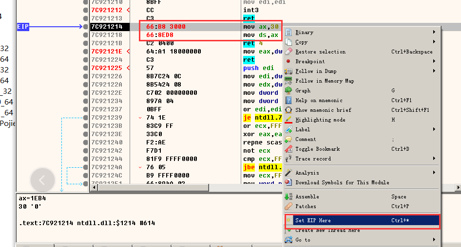

此时cpu拒绝了修改但并没有报异常

因为 ： 

1.  首先给的权限不对   30  低2位是0  ，得给3 因此 要 33

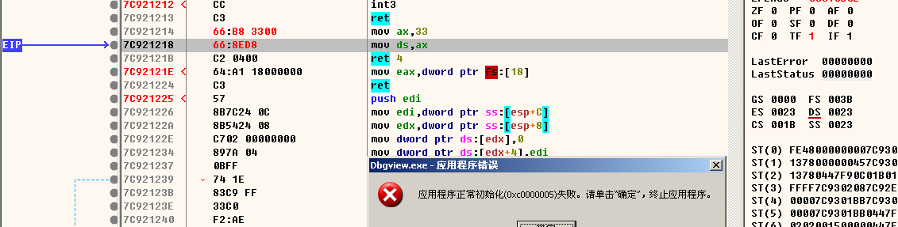

此时执行会 C005

我们试试原先的值

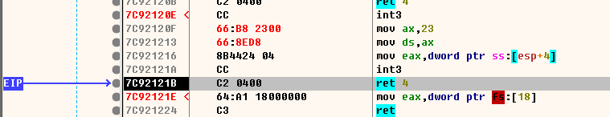

此时会发现正常通过了，那为啥给 0x23 就可以 ，0x33 就不行了呢，因此改段寄存器是cpu就会查表，无效的就不会让我们改，因此我们可以伪造一下或许就可以改了  （伪造参考下面的）


可能由于 ds，cs，gs一直在用，可能改不了，可以修  fs

##### 代码一致性

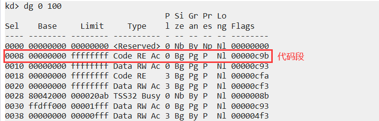

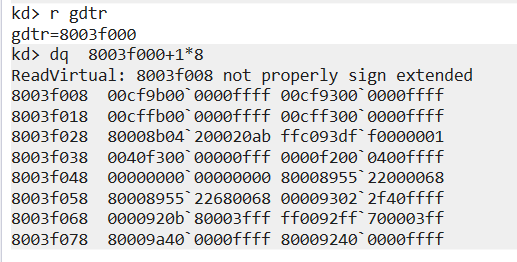

我们把这一项放到第9项去，并改成代码一致段


-   但有一个问题，CS不让直接改，因为在该的过程中代码就产生了变化，因此可以采用16位汇编跨段调用的方式
-   jmp  far    要改的值（1B）：地址 （EIP的值）
-   意思是 把 cs的值改成     要改的值  并且把   EIP 设为 地址
-   寄存器能改是有条件的，描述符表有这个值才行


##### 内核提权漏洞

-   把我们采用其他方式通信，当驱动发起一个控制吗，我们把缓冲区地址写成 gdtr 的值，这样我们就可以在段描述符表加一项，3环也可以拿到这个值，这样3环不加载驱动也会有内核的权限
-   因此驱动中要有肉让用户读写任意地址的机会， 就可以使用这个漏洞


##### 总结

-   3环的程序，每一进程的段寄存器是一样的是合理的，因为全局段描述表已做死了，写任何其他一个段选择子都是无效的，0环和3环 的cs 和 ss 值不是一样的 es 和 ds是一样的，因为 把3环的段选择子改成0环是不行的，因为有权限验证，就算改成功了也会C005，权限不匹配，当cpu计入内核权限就可以改了
-   内核空间根用户空间  代码段隔离（CS)、堆栈段隔离（SS)


#### 分页设计

-   分页设计是为了更快的内存交换，即支持虚拟内存，因intel的设计中，开了分页，页大小有5种
-   但从本质来说就2种，开启pae ，关闭pae

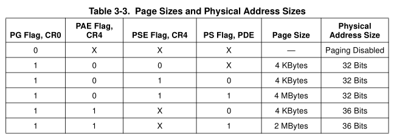

-   -   开启PAE   4K/2M        PS(PDE第7位)= 1         一项8个字节    物理地址36位    页地址 24位（12-35）
    -   关闭PAE   4K                PS(PDE第7位)= 0         一项4个字节    物理地址32位    页地址 20位（12-31）

-   在intel 中  大分页机制  PSE 肯定会开 ，因为  PSE 开了 PS才有意义
-   intel 为了节省表的大小，把这个表拆成了多级表，并且把线性地址变成了页表索引  通过查分页表得到物理地址

##### 4K页查表方式（开启PAE）

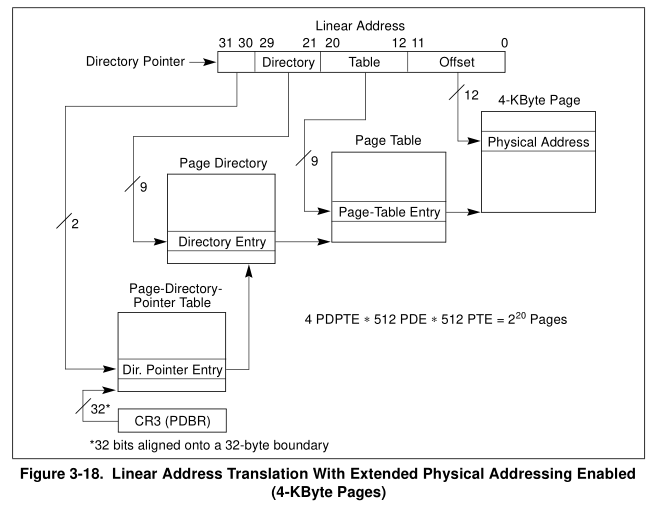

##### 4M页查表方式（开启PAE）

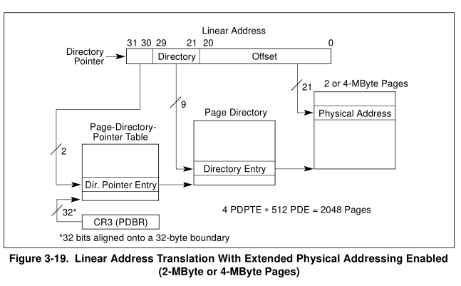

##### 4K页查表方式（不开启PAE）

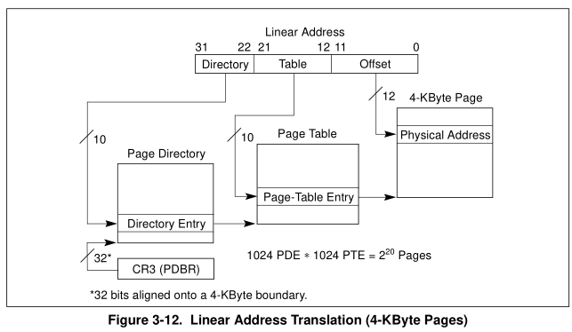

-   -   页目录表     1024      大小4k 
    -   页表             1024       大小1024 * 1024 * 4 = 4M
    -   2级表大小极限就是   4M（页表） +  4K  （页目录表）
    -   内存管理是以页为单位，效率更高 。 VirtualProtect 操作内存是以页为单位的

##### 4M分页查表（不开启PAE）

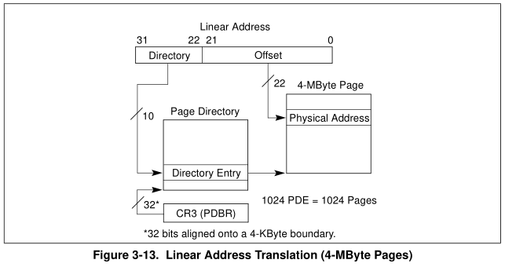

-   -   不要页表，主要页目录表
    -   偏移变成了22位
    -   4M太大，都用4M分页没必要，因此会混合使用

##### 备注 TLB

 分页机制会碰到高2G内存共享问题

共享方式：  每个进程页目录表的一半（高2G的）做成一样 

###### 缓存机制

-   页目录表这个表在内存中用的很频繁，所以提升查表效率，因此有了TLB（缓存）
-   每个进程的CR3 就是指向页目录表，我们可以把页目录表和页表全部拷到缓存里面去，因为缓存的访问效率很高（一级缓存，再cpu里面，很小，以k为单位），因此我们可以直接查缓存，当CR3切了，我们再缓存一次

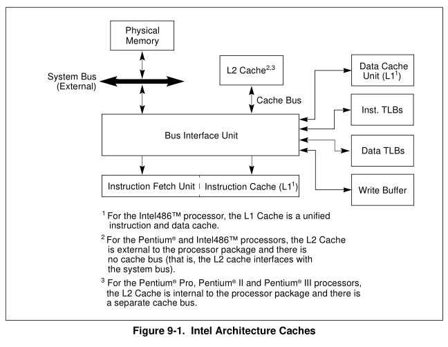

#### 页属性

##### 没开启APE

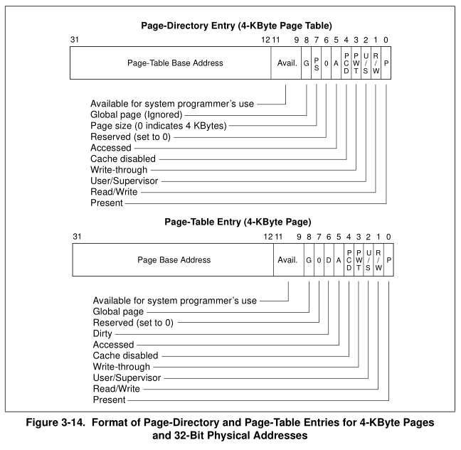

-   G    第8位    全局页和局部页 ，如果是全局页缓存时就不会重新缓存页目录表，而是用上一个进程的

-   -   例如 高2G 中的 G =1 ，低 2G中的 G=0 ,这样切进程时就只缓存低2g的,高2g不会缓存,直接用上一个进程的

-   PWT      第3位       写缓存, 改了缓存的数据是否要写入物理内存
-   PCD      第4位       内存的数据是否要更新到缓存


##### 开启PAE

因为每一个表改成了8字节,所以标项必须减半

###### 2级表

1.  页目录表     1024项     大小4k 
2.  页表             1024项    大小1024 * 1024 * 4 = 4M

2级表 大小极限是   4K + 1024 *4K  

###### 3级表

1.  页目录指针表  PDPT     4项        大小  =   4K (不应该是32字节,难道不足一页按一页算?)
2.  页目录表  PDE                512项    大小  =  4 *   4K   =  16K
3.  页表  PTE                         512项    大小  =  4 *  512  *  4K   =  8M

3级表 大小极限是   4K + 4 *4K  +  4 *  512  *  4K 


###### 表格式

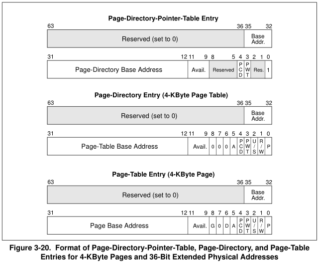


###### 内存申请

-   不管是2级表还是3级表都有一个很大的问题,那就是如果我们调用了 VirtualAlloc 他该怎么申请内存呢
-   操作系统不能访问物理地址,cpu才能访问,因此要想访问得映射一个线性地址,然后让CPU去访问线性地址就可以得到物理地址
-   申请内存都需要查表

-   -   2级表

-   -   -   第一步在页目录表里面找到一个没用的页,然后再页表插一项
        -   如果页表满了,就在页目录表加一个新的页表再放进去

-   -   3级表

-   -   -   同2级表的方式

-   为了快速级表,操作系统会位页目录表和页表映射一个线性地址地址,这样操作就方便了,而且这个表最好每个每个进程的位置都一样,这样位置就固定了,这两个地址我们就称为页目录表基址,和页表基址
-   那我们如何拿到这2个基址呢,如果给一个0地址  即:  !pte 0 他就会查这两个表  ,这样我们就得到了这两个基址,任何进程都一样  0代表 页目录表 和页表的下标都是 0  即 PDE =0     PTE = 0  

​       =>没开PAE        页目录表基址 = 0xC0000000      页表基址 = 0xC0300000

​       =>开了PAE        页目录表基址 = 0xC0000000      页表基址 =  0xC060000

-   0地址不能用是因为在0地址这一块没有映射
-   逻辑地址 => 分段表 => 线性地址 => 分页表 => 物理地址

-   -   微软设计里面.分段表的基址都是 base = 0,所以逻辑地址的偏移就变成了线性地址

-   页目录表也是页表的一项,因为页目录表也有一个物理地址,这个物理地址必然在页表的某一项映射了,所以页目录表也是众多页表中的一项,因此微软设计师在设计时候就是:

-   -    申请第1个页,页表首地址就是 C0000000 + 4M + 4K 
    -   申请第2个页,页表首地址就是 C0001000 + 4M + 4K
    -   申请第3个页,页表首地址就是 C0002000 + 4M + 4K
    -   .........

-   是连续排列的,那么查表的时候  假设 页目录标位置是   C0300000  ,那么 页目录表的线性地址  = C0300000  + PDE (index)*4
-   不开启PAE页目录表查表公式 

-   -   2级表：

​                    页目录表基址：  C0000000

​                   页目表查表公式：C0300000  + PDE index * 4

-   -   3级表

​                 页表基址：C0300000

​                 页表查表公式:     C0000000  + PDE index * 4K + PTE index * 4 


举例:  

00 0000 00001   00 0000 0001    0000 0000 0000

地址 0x401000       

=>   页目录表下标   PDE = 1     页表下标 PTE= 1

所以  

页目录表项所在位置为     C0300000 +  1 * 4  =  C03000004

页表项所在位置为             C0000000 +  1 * 0x1000 + 1*4  =  C00001004

-   开启PAE页目录表查表公式 

-   -   2级表：

​                    页目录表基址：  C0000000

​                   页目表查表公式：C0600000  + PDE index * 8

-   -   3级表

​                 页表基址：C0600000

​                页目表查表公式： C0600000  + PDPT* 4K + PDE * 8

​                 页表查表公式:     C0000000  +  PDPT * 0x200 * 4K + PDE * 4K  + PTE * 8

举例

gdtr =  80b95000

80b95   000 =>  10 0 0000 0101   1  1001 0101   0000 0000 0000    

=>

页目录指针表  PDPT = 2

页目录表  PDE  =  5

页表  PTE =  195

所以  

页目录表项所在位置为     0xC060000+  2 *  1000 +  5 * 8 =  C06002028

页表项所在位置为             C0000000 +  2 * 0x200   * 0x1000  + 5 * 0x1000  + 195 *  8  =  C0405CA8


结果可以用 !pte 80b95000  验证

-   内存连续的话可以直接内存访问,可以少一次内存访问,,表是做给CPU用的,微软自己不用,微软提前把这段连续保存好了,如果你要申请内存是不会给你的,因为他要放页表和页目录表

#### 分析32为 ntkrnlmp.exe 中  MmIsAddressValid的实现原理