我们研究内存管理最终目的是操作进程内存和代码注入


 操作进程内存 

●在3环里面操作进程的函数是     ReadPricessMemory        WriteProcessMemory但是用这些函数很容易被检测出来,但是如果通过操作物理内存的方式,那么就不容易检测

●因此我们要知道如何操作对方的物理内存,如我们能得到对方进程的页目录表就可以了,他的地址是物理地址

●页目录表是由操作系统管理,从数据结构来讲他属于进程中的一个属性,每个进程有一个页目录表,所以我们要知道每个进程的页目录表,我们要知道操作系统如何管理进程的

●如果逆向分析,我们可以通过加载符号来搜索相关   Swap 线程的函数

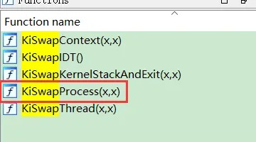


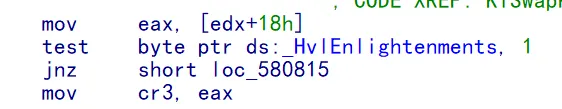


●切进程就是该CR3的值,那么CR3怎么来的呢  CR3应该是是放到一个结构体 + 18偏移的位置,可以逆向追踪,可以知道来自PROCESS 结构体

●PROCESS  来自于于全局变量

●微软开源了一份内核源码  WRK,可以编译可以用,可用于2个系统(Windows Research Kernel）,可以用于Windows2003  和  xp 64位  2个系统,这份源码可以帮助我们研究内核,但是不是完整的,大部分核心代码都有,没有代码的他提供了obj   ,下载链接   https://github.com/9176324/WRK.git   ,这份源码只能做参考,因为不同的系统源码是不一样的

●    可以通过 sourceinsight 快速的查看源码


 Source Insights使用教程 

1新建工程

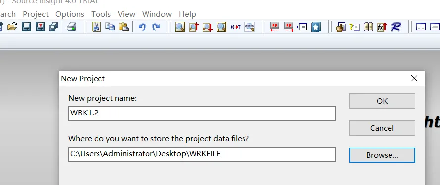


2选择源文件

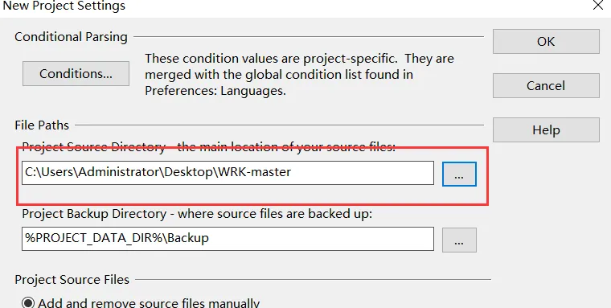


3添加文件

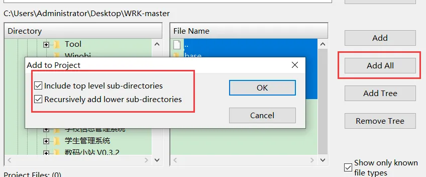


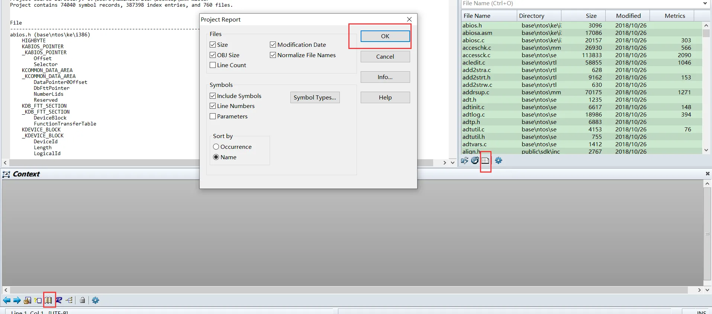

4.   弄好了之后保存工程在查看符号,这样就可以搜索查看函数源码了


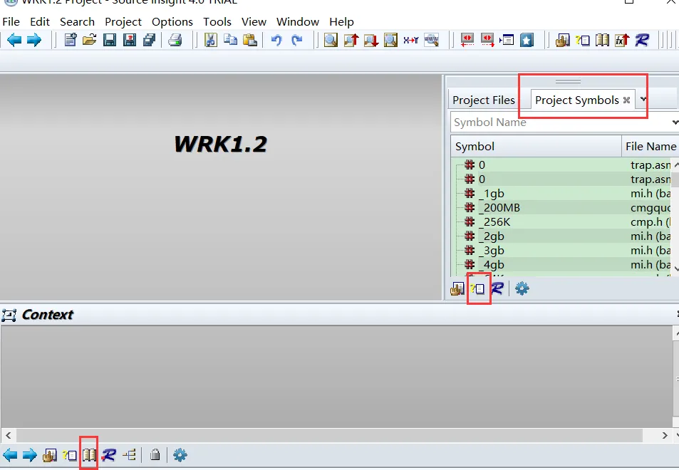


●例如查看  函数  MilsAddressValid

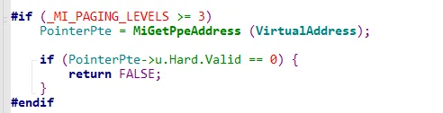


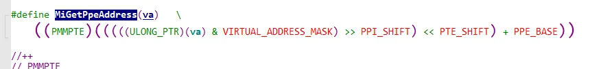


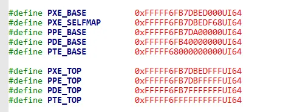


 重要节结构体 

结构体不同的版本是不一样的,因为这个结构体是非公开的,在windbg  中可以通过   dt  _eprocess 来查看结构体信息,新版本包含老版本的结构体

 进程对象  EPROCESS (执行层) 

内核分为核心层和执行层  


```c++
typedef struct _EPROCESS
 {
    KPROCESS Pcb;
    EX_PUSH_LOCK ProcessLock;      //EPROCESS成员保护锁(推锁)
    LARGE_INTEGER CreateTime;      //进程创建时间
    LARGE_INTEGER ExitTime;        //进程退出时间
    EX_RUNDOWN_REF RundownProtect; //进程结束保护锁
    HANDLE UniqueProcessId;        //进程ID
    LIST_ENTRY ActiveProcessLinks; //系统所有进程链表，可遍历所有进程
    SIZE_T QuotaUsage[PsQuotaTypes];  //进程内存使用量(数组：分页内存池，非分页内存池，文件内存)
    SIZE_T QuotaPeak[PsQuotaTypes];   //进程内存巅峰使用量(数组：分页内存池，非分页内存池，文件内存)
    SIZE_T CommitCharge;              //虚拟内存已提交的页面数量
    SIZE_T PeakVirtualSize;           //进程虚拟内存大小巅峰值
    SIZE_T VirtualSize;               //进程虚拟内存大小
    LIST_ENTRY SessionProcessLinks;
    PVOID DebugPort;                 //调试端口
    PVOID ExceptionPort;             //异常端口 
    PHANDLE_TABLE ObjectTable;       //进程所有对象句柄表
    EX_FAST_REF Token;               //令牌(病毒，漏洞)
    PFN_NUMBER WorkingSetPage;       //进程工作集页面
    KGUARDED_MUTEX AddressCreationLock;
    KSPIN_LOCK HyperSpaceLock;
    struct _ETHREAD *ForkInProgress;  //正在复制物理地址空间的哪个线程
    ULONG_PTR HardwareTrigger;        //记录硬件错误分析次数
    PMM_AVL_TABLE PhysicalVadRoot;   //进程物理VAD树的根节点 
    PVOID CloneRoot;
    PFN_NUMBER NumberOfPrivatePages;  //进程私有页数量
    PFN_NUMBER NumberOfLockedPages;   //进程被锁住的页面数量
    PVOID Win32Process;               //指示是否GUI进程
    struct _EJOB *Job;
    PVOID SectionObject;             //进程内存区对象
    PVOID SectionBaseAddress;        //内存区对象基地址
    PEPROCESS_QUOTA_BLOCK QuotaBlock; 
    PPAGEFAULT_HISTORY WorkingSetWatch;  //监控进程页面错误
    HANDLE Win32WindowStation;
    HANDLE InheritedFromUniqueProcessId;
    PVOID LdtInformation;               //进程局部描述符
    PVOID VadFreeHint;
    PVOID VdmObjects;
    PVOID DeviceMap;
    PVOID Spare0[3];                   //WRK未使用
    union {
        HARDWARE_PTE PageDirectoryPte;  //页目录的页表项
        ULONGLONG Filler;
    };
    PVOID Session;
    UCHAR ImageFileName[ 16 ];          //进程名称
    LIST_ENTRY JobLinks;
    PVOID LockedPagesList;
    LIST_ENTRY ThreadListHead;          //进程的所有线程
    PVOID SecurityPort;                 //与lsass进程跨进程通讯端口
    PVOID PaeTop;                       //用于支持PAE内存访问机制
    ULONG ActiveThreads;                //进程有多少个活动线程
    ACCESS_MASK GrantedAccess;          //进程访问权限
    ULONG DefaultHardErrorProcessing;   //默认的硬件错误处理
    NTSTATUS LastThreadExitStatus;      //最后一个线程的退出状态
    PPEB Peb;                           //进程环境块
    EX_FAST_REF PrefetchTrace;
    LARGE_INTEGER ReadOperationCount;
    LARGE_INTEGER WriteOperationCount;
    LARGE_INTEGER OtherOperationCount;
    LARGE_INTEGER ReadTransferCount;
    LARGE_INTEGER WriteTransferCount;
    LARGE_INTEGER OtherTransferCount;
    SIZE_T CommitChargeLimit;
    SIZE_T CommitChargePeak;
    PVOID AweInfo;
    SE_AUDIT_PROCESS_CREATION_INFO SeAuditProcessCreationInfo;  //进程映像全路径名
    MMSUPPORT Vm;
    ULONG Spares[2];
    ULONG ModifiedPageCount;   //进程已修改页面的数量
    ULONG JobStatus;
    union {
        ULONG Flags;
        struct {
            ULONG CreateReported            : 1;
            ULONG NoDebugInherit            : 1;
            ULONG ProcessExiting            : 1;
            ULONG ProcessDelete             : 1;
            ULONG Wow64SplitPages           : 1;
            ULONG VmDeleted                 : 1;
            ULONG OutswapEnabled            : 1;
            ULONG Outswapped                : 1;
            ULONG ForkFailed                : 1;
            ULONG Wow64VaSpace4Gb           : 1;
            ULONG AddressSpaceInitialized   : 2;
            ULONG SetTimerResolution        : 1;
            ULONG BreakOnTermination        : 1;
            ULONG SessionCreationUnderway   : 1;
            ULONG WriteWatch                : 1;
            ULONG ProcessInSession          : 1;
            ULONG OverrideAddressSpace      : 1;
            ULONG HasAddressSpace           : 1;
            ULONG LaunchPrefetched          : 1;
            ULONG InjectInpageErrors        : 1;
            ULONG VmTopDown                 : 1;
            ULONG ImageNotifyDone           : 1;
            ULONG PdeUpdateNeeded           : 1;    // NT32 only
            ULONG VdmAllowed                : 1;
            ULONG SmapAllowed               : 1;
            ULONG CreateFailed              : 1;
            ULONG DefaultIoPriority         : 3;
            ULONG Spare1                    : 1;
            ULONG Spare2                    : 1;
        };
    };
    NTSTATUS ExitStatus;
    USHORT NextPageColor;
    union {
        struct {
            UCHAR SubSystemMinorVersion;   //系统主版本号
            UCHAR SubSystemMajorVersion;   //系统次版本号
        };
        USHORT SubSystemVersion;
    };
    UCHAR PriorityClass;
    MM_AVL_TABLE VadRoot;    //用于管理该进程的虚拟地址空间(平衡二叉树)
    ULONG Cookie;
} EPROCESS, *PEPROCESS;
```

-   我们申请内存(malloc 或者 virtualAlloc),系统怎么知道哪块内存可以分配呢,内存的地址很大(4个G),怎么快速知道哪个页被分配了,哪个页没被分配,于是微软系统就做了一棵平衡二叉树,就是把所有页的分配情况做成一棵平衡二叉树,,这颗平衡二叉树里面记录了所有被分配的页,所以要分配页的时候,只要查这棵二叉树就可以快速知道存不存在,因此,我们主要遍历这个二叉树,就可以知道这个进程所有使用的内存

-   -   dt  _eprocess

-   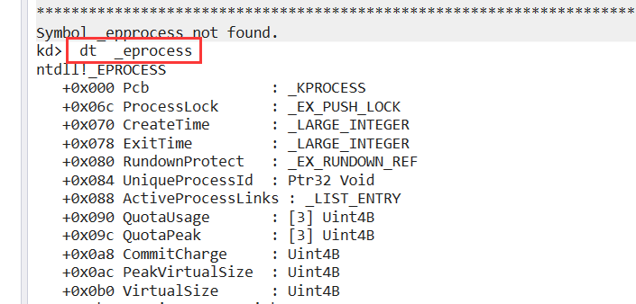

-   -   dt _MM_AVL_TABLE
    -   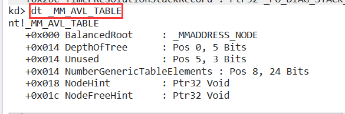
    -   dt _MMADDRESS_NODE
    -   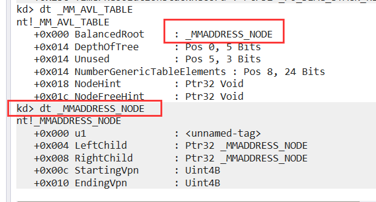

-   遍历计算器进程的内存使用情况

-   -   先遍历所有进程,找到计算机的进程     !process 0 0
    -   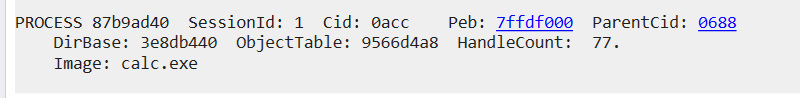
    -   获取计算器的进程信息,获取 VadRoot偏移  dt _eprocess 87b9ad40
    -   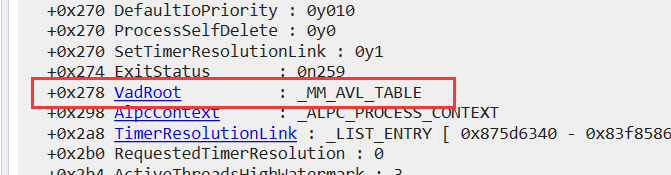
    -   遍历二叉树    !vad 87b9ad40+0x278 
    -   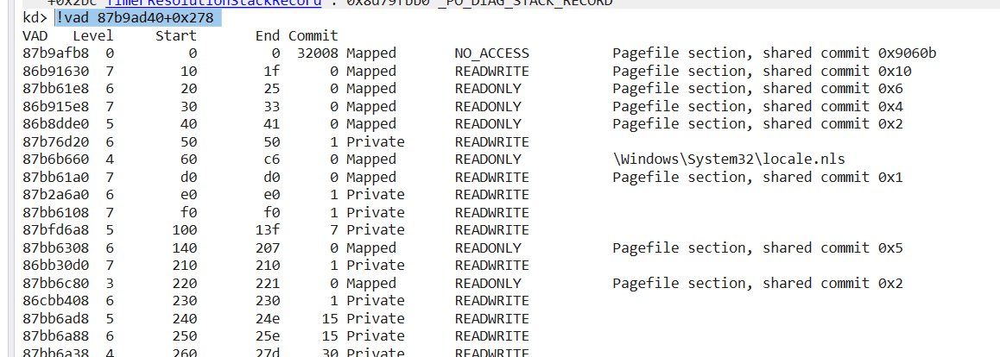
    -   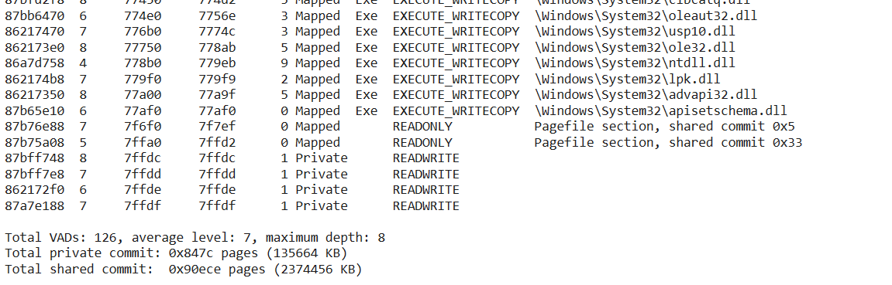
    -   遍历这棵树,可以找到所有隐藏的模块  Mapped 表示文件映射    private 都是 virtulAlloc申请的

#### 进程对象  KPROCESS (核心层)

```c++
typedef struct _KPROCESS
{
    DISPATCHER_HEADER Header;     //表明为分发器对象(同步机制)
    LIST_ENTRY ProfileListHead;       //用于参与性能分析
    ULONG_PTR DirectoryTableBase[2];  //数组,[0]为进程页目录表地址,[1]为超空间的页目录表地址
    KGDTENTRY LdtDescriptor;         //局部描述符表 
    KIDTENTRY Int21Descriptor;        //为了兼容dos程序, 通过int21调用dos系统功能
    USHORT IopmOffset;               //制定IOPM位置，控制用户模式的IO权限
    UCHAR Iopl;                       //进程的I/O优先级
    BOOLEAN Unused;                   //未使用
    volatile KAFFINITY ActiveProcessors;  //当前进程在哪些处理上运行
    ULONG KernelTime;                   //内核模式运行时间(有线程结束更新时间)
    ULONG UserTime;                     //用户模式运行时间(有线程结束更新时间)
    LIST_ENTRY ReadyListHead;          //记录了就绪但未加入全局就绪表的线程(双向链表)
    SINGLE_LIST_ENTRY SwapListEntry;      //进程被换出内存使用
    PVOID VdmTrapcHandler;                //指向ctrl + c中断的函数(用于虚拟dos机)
    LIST_ENTRY ThreadListHead;            //当前进程的所有线程(双向循环链表)
    KSPIN_LOCK ProcessLock;               //自选锁对象,保护数据成员
    KAFFINITY Affinity;                   //指定进程可以在那些处理器上运行
    union {
        struct {
            LONG AutoAlignment : 1;      //内存对其检查标志
            LONG DisableBoost : 1;       //线程优先级的提升和时限有关
            LONG DisableQuantum : 1;     //线程优先级的提升和时限有关
            LONG ReservedFlags : 29;     //保留
        };
        
        LONG ProcessFlags;
    };
    SCHAR BasePriority;                 //所有线程的基本优先级
    SCHAR QuantumReset;                 //所有线程的时限 (时间片)
    UCHAR State;                        //进程是否在内存中
    UCHAR ThreadSeed;                   //每个线程以此作为理想处理器
    UCHAR PowerState;                   //电源状态
    UCHAR IdealNode;                    //为一个进程选择优先的处理器节点
    BOOLEAN Visited;                    //WRK未使用
    union {
        KEXECUTE_OPTIONS Flags;
        UCHAR ExecuteOptions;          //设置进程内存的执行选项
    };
    ULONG_PTR StackCount;              //多少个线程的栈在内存中
    LIST_ENTRY ProcessListEntry;       //系统中所有具有活动线程的进程链表
} KPROCESS, *PKPROCESS, *PRKPROCESS;
```

#### 线程对象 ETHREAD (执行层)

```c++

typedef struct _ETHREAD {
    KTHREAD Tcb;
    LARGE_INTEGER CreateTime;      //线程创建时间
    union {
        LARGE_INTEGER ExitTime;    //线程退出时间
        LIST_ENTRY LpcReplyChain;
        LIST_ENTRY KeyedWaitChain;
    };
    union {
        NTSTATUS ExitStatus;    //线程退出状态
        PVOID OfsChain;         //WRK未使用
    };
    LIST_ENTRY PostBlockList;
    union {
        PTERMINATION_PORT TerminationPort;
        struct _ETHREAD *ReaperLink;
        PVOID KeyedWaitValue;
    };
    KSPIN_LOCK ActiveTimerListLock;
    LIST_ENTRY ActiveTimerListHead;   //当前线程的所有定时器
    CLIENT_ID Cid;                    //线程ID
    union {
        KSEMAPHORE LpcReplySemaphore;
        KSEMAPHORE KeyedWaitSemaphore;
    };
    union {
        PVOID LpcReplyMessage;          // -> Message that contains the reply
        PVOID LpcWaitingOnPort;
    };
    PPS_IMPERSONATION_INFORMATION ImpersonationInfo;
    LIST_ENTRY IrpList;
    ULONG_PTR TopLevelIrp;  // either NULL, an Irp or a flag defined in FsRtl.h
    struct _DEVICE_OBJECT *DeviceToVerify;
    PEPROCESS ThreadsProcess;        //当前线程所属进程
    PVOID StartAddress;              //系统dll的启动地址(来自Context的EIP）
    union {
        PVOID Win32StartAddress;     //线程回调函数地址(来自context的EAX)
        ULONG LpcReceivedMessageId;
    };
    LIST_ENTRY ThreadListEntry;
    EX_RUNDOWN_REF RundownProtect;   //线程停止保护锁
    EX_PUSH_LOCK ThreadLock;         //保护线程的数据成员
    ULONG LpcReplyMessageId;         //当前正等待对一个消息的应答
    ULONG ReadClusterSize;           //在一次I/O操作读取了多少个页面
    ACCESS_MASK GrantedAccess;       //线程的访问权限
    union {

        ULONG CrossThreadFlags;            //针对跨线程访问的标志
        struct {
            ULONG Terminated              : 1;   //线程已执行中止操作
            ULONG DeadThread              : 1;   //创建失败
            ULONG HideFromDebugger        : 1;   //该线程对于调试器不可见
            ULONG ActiveImpersonationInfo : 1;
            ULONG SystemThread            : 1;   //是一个系统线程
            ULONG HardErrorsAreDisabled   : 1;   //对于该现场，硬件错误无效
            ULONG BreakOnTermination      : 1;   //调试器在线程中止时停下该线程
            ULONG SkipCreationMsg         : 1;   //不向调试器发送创建线程消息(可以用于反调试)
            ULONG SkipTerminationMsg      : 1;   //不向调试器发送线程中止消息(可以用于反调试)
        };
    };
    union {
        ULONG SameThreadPassiveFlags;
        struct {
            ULONG ActiveExWorker : 1;
            ULONG ExWorkerCanWaitUser : 1;
            ULONG MemoryMaker : 1;
            ULONG KeyedEventInUse : 1;
        };
    };
    union {
        ULONG SameThreadApcFlags;
        struct {
            BOOLEAN LpcReceivedMsgIdValid : 1;
            BOOLEAN LpcExitThreadCalled   : 1;
            BOOLEAN AddressSpaceOwner     : 1;
            BOOLEAN OwnsProcessWorkingSetExclusive  : 1;
            BOOLEAN OwnsProcessWorkingSetShared     : 1;
            BOOLEAN OwnsSystemWorkingSetExclusive   : 1;
            BOOLEAN OwnsSystemWorkingSetShared      : 1;
            BOOLEAN OwnsSessionWorkingSetExclusive  : 1;
            BOOLEAN OwnsSessionWorkingSetShared     : 1;
            BOOLEAN ApcNeeded                       : 1;
        };
    };
    BOOLEAN ForwardClusterOnly;
    BOOLEAN DisablePageFaultClustering;
    UCHAR ActiveFaultCount;
#if defined (PERF_DATA)
    ULONG PerformanceCountLow;
    LONG PerformanceCountHigh;
#endif
} ETHREAD, *PETHREAD;

```

#### 线程对象 ETHREAD (核心层)

```c++

typedef struct _KTHREAD 
{
    DISPATCHER_HEADER Header;       //分发器对象
    LIST_ENTRY MutantListHead;      //指向该线程的互斥体对象链表
    PVOID InitialStack;             //内核原始栈的位置
    PVOID StackLimit;               //内核栈界限
    PVOID KernelStack;              //内核栈的开始位置
    KSPIN_LOCK ThreadLock;          //自旋锁，保护线程数据成员
    union {
        KAPC_STATE ApcState;        //指向APC信息(异步过程调用,有一个队列,记录了所有的注册函数)
        struct {
            UCHAR ApcStateFill[KAPC_STATE_ACTUAL_LENGTH];
            BOOLEAN ApcQueueable;             //是否可以插入APC
            volatile UCHAR NextProcessor;     //关于线程调度器的选择
            volatile UCHAR DeferredProcessor; //关于线程调度器的选择
            UCHAR AdjustReason;               //优先级调整原因
            SCHAR AdjustIncrement;            //优先级调整量
        };
    };
    KSPIN_LOCK ApcQueueLock;     //自旋锁,保护APC队列
    ULONG ContextSwitches;       //线程进行了多少次环境切换
    volatile UCHAR State;        //线程状态
    UCHAR NpxState;              //浮点寄存器状态
    BOOLEAN Alertable;           //说明一个线程是否可以被唤醒
    BOOLEAN WaitNext;            //线程马上要调用一个内核等待函数
    UCHAR WaitReason;            //线程等待理由
    SCHAR Priority;              //该线程动态优先级
    UCHAR EnableStackSwap;       //本线程栈是否允许换到外存中
    volatile UCHAR SwapBusy;     //当前线程是否在切换环境中
    BOOLEAN Alerted[MaximumMode];
    union {
        LIST_ENTRY WaitListEntry;
        SINGLE_LIST_ENTRY SwapListEntry;
    };
    PRKQUEUE Queue;      //队列分发器对象
    PVOID Teb;           //指向TEB,这就是3环的Teb
    union {
        KTIMER Timer;   //线程上的定时器(超时等待)
        struct {
            UCHAR TimerFill[KTIMER_ACTUAL_LENGTH];
            union {
                struct {
                    LONG AutoAlignment : 1;   //参考KPROCESS
                    LONG DisableBoost : 1;     //参考KPROCESS
                    LONG ReservedFlags : 30;
                };
                LONG ThreadFlags;
            };
        };
    };
    union {
        KWAIT_BLOCK WaitBlock[THREAD_WAIT_OBJECTS + 1];  //第4项用于可等待的定时器对象
        struct {
            UCHAR WaitBlockFill0[KWAIT_BLOCK_OFFSET_TO_BYTE0];
            BOOLEAN SystemAffinityActive;
        };
        struct {
            UCHAR WaitBlockFill1[KWAIT_BLOCK_OFFSET_TO_BYTE1];
            CCHAR PreviousMode;
        };
        struct {
            UCHAR WaitBlockFill2[KWAIT_BLOCK_OFFSET_TO_BYTE2];
            UCHAR ResourceIndex;
        };
        struct {
            UCHAR WaitBlockFill3[KWAIT_BLOCK_OFFSET_TO_BYTE3];
            UCHAR LargeStack;
        };
    };
    LIST_ENTRY QueueListEntry;
    PKTRAP_FRAME TrapFrame;     //切换线程，保存寄存器环境用
    PVOID CallbackStack;
    PVOID ServiceTable;         //该线程使用的SSDT表
    UCHAR ApcStateIndex;
    UCHAR IdealProcessor;       //该线程的理想处理器
    BOOLEAN Preempted;          //该线程是否被高优先级的线程抢占了
    BOOLEAN ProcessReadyQueue;
    BOOLEAN KernelStackResident;
    SCHAR BasePriority;
    SCHAR PriorityDecrement;
    CHAR Saturation;
    KAFFINITY UserAffinity;
    PKPROCESS Process;
    KAFFINITY Affinity;          //掩码,指定线程在哪一核上运行
    PKAPC_STATE ApcStatePointer[2];
    union {
        KAPC_STATE SavedApcState;
        struct {
            UCHAR SavedApcStateFill[KAPC_STATE_ACTUAL_LENGTH];
            CCHAR FreezeCount;
            CCHAR SuspendCount;
            UCHAR UserIdealProcessor;
            UCHAR CalloutActive;
            UCHAR OtherPlatformFill;
        };
    };
    PVOID Win32Thread;
    PVOID StackBase;
    union {
        KAPC SuspendApc;
        struct {
            UCHAR SuspendApcFill0[KAPC_OFFSET_TO_SPARE_BYTE0];
            SCHAR Quantum;
        };
        struct {
            UCHAR SuspendApcFill1[KAPC_OFFSET_TO_SPARE_BYTE1];
            UCHAR QuantumReset;
        };
        struct {
            UCHAR SuspendApcFill2[KAPC_OFFSET_TO_SPARE_LONG];
            ULONG KernelTime;
        };
        struct {
            UCHAR SuspendApcFill3[KAPC_OFFSET_TO_SYSTEMARGUMENT1];
            PVOID TlsArray;
        };
        struct {
            UCHAR SuspendApcFill4[KAPC_OFFSET_TO_SYSTEMARGUMENT2];
            PVOID BBTData;
        };
        struct {
            UCHAR SuspendApcFill5[KAPC_ACTUAL_LENGTH];
            UCHAR PowerState;
            ULONG UserTime;
        };
    };
    union {
        KSEMAPHORE SuspendSemaphore;
        struct {
            UCHAR SuspendSemaphorefill[KSEMAPHORE_ACTUAL_LENGTH];
            ULONG SListFaultCount;
        };
    };
    LIST_ENTRY ThreadListEntry;
    PVOID SListFaultAddress;
} KTHREAD, *PKTHREAD, *PRKTHREAD;
```

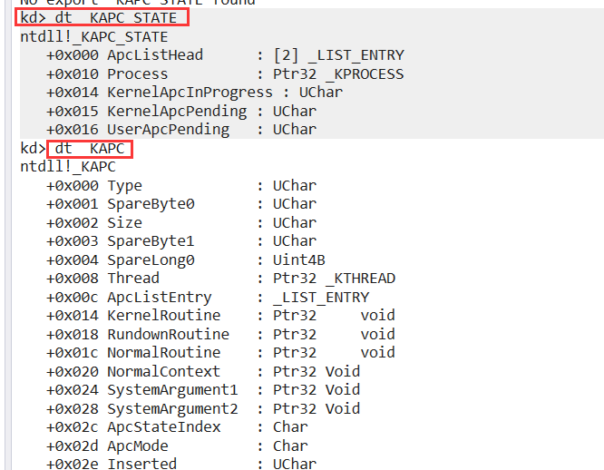

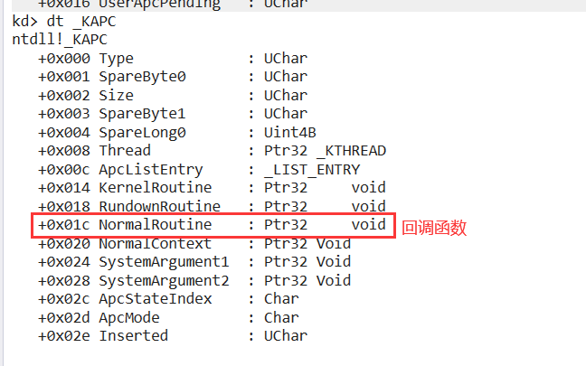


### 对源码进行编译调试

#### 编译

```c++
path G:\wrk-v1.2\tools\x86;%path% 

cl.exe

cd G:\wrk-v1.2\base\ntos

g:

nmake -nologo x86=

```

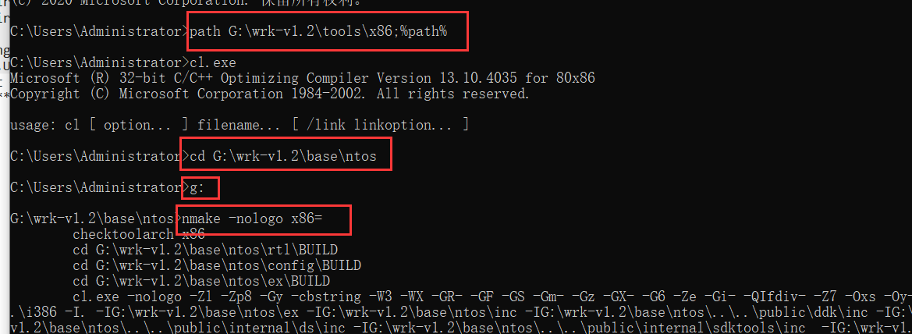


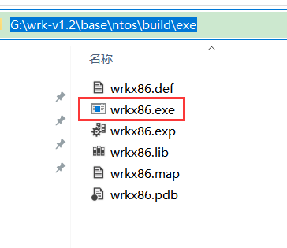

这个就等于 NTKernel.exe

#### 用法

先把文件拷到虚拟机里面,我们要把当前系统的内核替换掉,但是不能把系统原来的内核删了,因此只能在 boot.ini里面加一个开机选项

​	1. 把   wrkx86.exe 复制到/WINDOWS/system32/目录下

​         把 ..\wrk-v1.2\ws03sp1hals\x86\halacpim目录下的  halacpim.dll 复制到/WINDOWS/system32/目录下

​	2.编辑BOOT.ini

```
/kernel=wrkx86.exe /hal=halacpim.dll 

multi(0)disk(0)rdisk(0)partition(1)/WINDOWS="Windows Server 2003, Enterprise" /fastdetect /NoExecute=OptOut
    
multi(0)disk(0)rdisk(0)partition(1)/WINDOWS="WRK 1.2" /fastdetect /NoExecute=OptOut /kernel=wrkx86.exe /hal=halmacpi.dll  /debugport=com1 /baudrate=115200


```

​	3.配置双机调试

​	4.用windbg去连接 ,连接后记得  lm   看一下符号加载没有

​	5.要调试什么函数都可以可以 .例如我们要调    NtCreateProcess

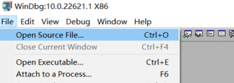

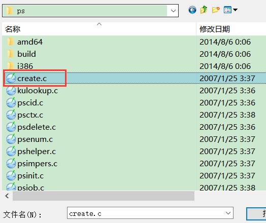

然后在文件里面搜索你要调试的函数,下断点 F9就可以了 ,或者通过命令  BP  NtCreateProcess  也可以

-    `WRK`源码还是有缺陷的,比如一些计算器,画图等3环软件就没有源码,而且它的源码不是很全,微软是不会提供的 

-   -   可以自己逆向获取,但是工作量太大了;可以下载`ReatOS`,用它和`WRK`结合起来分析

### 参考书籍

Windows内核原理和实现 潘爱民

Windows内核情景分析  毛德操


### 获取所有进程的页目录表地址

-   我们主需要获取一个进程的进程对象,就可以遍历所有进程
-   可以通过API  **PsGetCurrentProcess** 获取当前的进程对象
-   我们可以通过 wrk 查看  该函数的实现

```c++
#define _PsGetCurrentProcess() (CONTAINING_RECORD(((KeGetCurrentThread())->ApcState.Process),EPROCESS,Pcb))

拿到当前的一个线程,通过线程的 ApcState 拿到进程

NTAPI KeGetCurrentThread (VOID)
{
#if (_MSC_FULL_VER >= 13012035)
    return (struct _KTHREAD *) (ULONG_PTR) __readfsdword (FIELD_OFFSET (KPCR, PrcbData.CurrentThread));
#else
    __asm {  mov eax, fs:[0] KPCR.PrcbData.CurrentThread }
#endif
}

可以看到这里涉及到一个KPCR结构体也就是CPU控制块

CPU控制块: 操作系统需要实时交给CPU很多表信息,因此需要快速的去查一下表,因此微软做了一个KPCR结构体,里面放了CPU用到的所有表,这个表地址 放到了 fs:[0]  

或者直接在WinDbg里u一下这个函数的实现
kd> u PsGetCurrentProcess
nt!PsGetCurrentProcess:
	mov     eax,dword ptr fs:[00000124h];等价于_KPRCB结构体再+4的位置也就是当前线程
	mov     eax,dword ptr [eax+50h];拿到当前线程对象后再加50h就得到了进程对象结构体
	ret

也就是fs:[124]在_KPCR结构体最后一项还要加4的位置,0x120 PrcbData : _KPRCB(还要+4)
也就是_KPRCB结构体里的+0x004 CurrentThread    : Ptr32 _KTHREAD 成员
然后再+50h就是_KTHREAD里的+0x040 ApcState : _KAPC_STATE;这个结构体里再+10的位置
最终在_KAPC_STATE结构体里+10的位置得到了+0x010 Process : Ptr32 _KPROCESS

这里测试系统用的是Win732位.XP的话是eax+44h
```

-   `KPCR`结构体的部分成员  可以通过指令  dt   KPCR  查看
-   `KPCR`这个结构体基本上想拿什么东西都可以从这里拿 

```
kd> dt _KPCR
    
ntdll!_KPCR
+0x000 NtTib            : _NT_TIB ;记录了内核的栈信息
;........成员省略..........................
+0x020 Prcb             : Ptr32 _KPRCB;   最重要的成员 KPCRB结构体
;........成员省略..........................
+0x03c GDT              : Ptr32 _KGDTENTRY ;CPU要给GDTR的地址就从这里拿出来给过去
;........成员省略..........................
+0x120 PrcbData         : _KPRCB   
```

-   -   `KPCRB`结构体      可以通过指令  dt   KPCR  查看

-   ```c++
    这个结构体很大,结构体套结构体,所以只展示部分重要字段
    kd> dt _KPRCB
        
    ntdll!_KPRCB
    +0x000 MinorVersion     : Uint2B
    +0x002 MajorVersion     : Uint2B
    +0x004 CurrentThread    : Ptr32 _KTHREAD    保存了当前线程,指向一个_KTHREAD结构体也就等价 
                                                于指向_ETHREAD结构体
    +0x008 NextThread       : Ptr32 _KTHREAD;   指向下一个会被切换的线程
    +0x00c IdleThread       : Ptr32 _KTHREAD;   指向空闲的线程(如果没有下一个就走这个空闲的)
    ```

-   #### 以XP为例,遍历所有进程

-   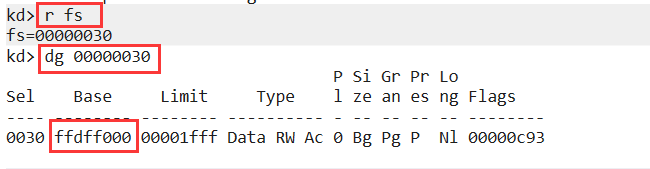

-   可以看到 fs的地址不是0  ,所以 _KPCR 结构体的首地址在  ffdff000

-   ```
    kd> dt _KPCR
    nt!_KPCR
       +0x000 NtTib            : _NT_TIB
       +0x01c SelfPcr          : Ptr32 _KPCR
       +0x020 Prcb             : Ptr32 _KPRCB
       +0x024 Irql             : UChar
       +0x028 IRR              : Uint4B
       +0x02c IrrActive        : Uint4B
       +0x030 IDR              : Uint4B
       +0x034 KdVersionBlock   : Ptr32 Void
       +0x038 IDT              : Ptr32 _KIDTENTRY
       +0x03c GDT              : Ptr32 _KGDTENTRY
       +0x040 TSS              : Ptr32 _KTSS
       +0x044 MajorVersion     : Uint2B
       +0x046 MinorVersion     : Uint2B
       +0x048 SetMember        : Uint4B
       +0x04c StallScaleFactor : Uint4B
       +0x050 DebugActive      : UChar
       +0x051 Number           : UChar
       +0x052 Spare0           : UChar
       +0x053 SecondLevelCacheAssociativity : UChar
       +0x054 VdmAlert         : Uint4B
       +0x058 KernelReserved   : [14] Uint4B
       +0x090 SecondLevelCacheSize : Uint4B
       +0x094 HalReserved      : [16] Uint4B
       +0x0d4 InterruptMode    : Uint4B
       +0x0d8 Spare1           : UChar
       +0x0dc KernelReserved2  : [17] Uint4B
       +0x120 PrcbData         : _KPRCB
    
    
    kd> dt _eprocess
    ntdll!_EPROCESS
       +0x000 Pcb              : _KPROCESS
       +0x06c ProcessLock      : _EX_PUSH_LOCK
       +0x070 CreateTime       : _LARGE_INTEGER
       +0x078 ExitTime         : _LARGE_INTEGER
       +0x080 RundownProtect   : _EX_RUNDOWN_REF
       +0x084 UniqueProcessId  : Ptr32 Void
       +0x088 ActiveProcessLinks : _LIST_ENTRY
       +0x090 QuotaUsage       : [3] Uint4B
       +0x09c QuotaPeak        : [3] Uint4B
       +0x0a8 CommitCharge     : Uint4B
       +0x0ac PeakVirtualSize  : Uint4B
       +0x0b0 VirtualSize      : Uint4B
       +0x0b4 SessionProcessLinks : _LIST_ENTRY
       +0x0bc DebugPort        : Ptr32 Void
       +0x0c0 ExceptionPort    : Ptr32 Void
       +0x0c4 ObjectTable      : Ptr32 _HANDLE_TABLE
       +0x0c8 Token            : _EX_FAST_REF
       +0x0cc WorkingSetLock   : _FAST_MUTEX
       +0x0ec WorkingSetPage   : Uint4B
       +0x0f0 AddressCreationLock : _FAST_MUTEX
       +0x110 HyperSpaceLock   : Uint4B
       +0x114 ForkInProgress   : Ptr32 _ETHREAD
       +0x118 HardwareTrigger  : Uint4B
       +0x11c VadRoot          : Ptr32 Void
       +0x120 VadHint          : Ptr32 Void
       +0x124 CloneRoot        : Ptr32 Void
       +0x128 NumberOfPrivatePages : Uint4B
       +0x12c NumberOfLockedPages : Uint4B
       +0x130 Win32Process     : Ptr32 Void
       +0x134 Job              : Ptr32 _EJOB
       +0x138 SectionObject    : Ptr32 Void
       +0x13c SectionBaseAddress : Ptr32 Void
       +0x140 QuotaBlock       : Ptr32 _EPROCESS_QUOTA_BLOCK
       +0x144 WorkingSetWatch  : Ptr32 _PAGEFAULT_HISTORY
       +0x148 Win32WindowStation : Ptr32 Void
       +0x14c InheritedFromUniqueProcessId : Ptr32 Void
       +0x150 LdtInformation   : Ptr32 Void
       +0x154 VadFreeHint      : Ptr32 Void
       +0x158 VdmObjects       : Ptr32 Void
       +0x15c DeviceMap        : Ptr32 Void
       +0x160 PhysicalVadList  : _LIST_ENTRY
       +0x168 PageDirectoryPte : _HARDWARE_PTE_X86
       +0x168 Filler           : Uint8B
       +0x170 Session          : Ptr32 Void
       +0x174 ImageFileName    : [16] UChar
       +0x184 JobLinks         : _LIST_ENTRY
       +0x18c LockedPagesList  : Ptr32 Void
       +0x190 ThreadListHead   : _LIST_ENTRY
       +0x198 SecurityPort     : Ptr32 Void
       +0x19c PaeTop           : Ptr32 Void
       +0x1a0 ActiveThreads    : Uint4B
       +0x1a4 GrantedAccess    : Uint4B
       +0x1a8 DefaultHardErrorProcessing : Uint4B
       +0x1ac LastThreadExitStatus : Int4B
       +0x1b0 Peb              : Ptr32 _PEB
       +0x1b4 PrefetchTrace    : _EX_FAST_REF
       +0x1b8 ReadOperationCount : _LARGE_INTEGER
       +0x1c0 WriteOperationCount : _LARGE_INTEGER
       +0x1c8 OtherOperationCount : _LARGE_INTEGER
       +0x1d0 ReadTransferCount : _LARGE_INTEGER
       +0x1d8 WriteTransferCount : _LARGE_INTEGER
       +0x1e0 OtherTransferCount : _LARGE_INTEGER
       +0x1e8 CommitChargeLimit : Uint4B
       +0x1ec CommitChargePeak : Uint4B
       +0x1f0 AweInfo          : Ptr32 Void
       +0x1f4 SeAuditProcessCreationInfo : _SE_AUDIT_PROCESS_CREATION_INFO
       +0x1f8 Vm               : _MMSUPPORT
       +0x238 LastFaultCount   : Uint4B
       +0x23c ModifiedPageCount : Uint4B
       +0x240 NumberOfVads     : Uint4B
       +0x244 JobStatus        : Uint4B
       +0x248 Flags            : Uint4B
       +0x248 CreateReported   : Pos 0, 1 Bit
       +0x248 NoDebugInherit   : Pos 1, 1 Bit
       +0x248 ProcessExiting   : Pos 2, 1 Bit
       +0x248 ProcessDelete    : Pos 3, 1 Bit
       +0x248 Wow64SplitPages  : Pos 4, 1 Bit
       +0x248 VmDeleted        : Pos 5, 1 Bit
       +0x248 OutswapEnabled   : Pos 6, 1 Bit
       +0x248 Outswapped       : Pos 7, 1 Bit
       +0x248 ForkFailed       : Pos 8, 1 Bit
       +0x248 HasPhysicalVad   : Pos 9, 1 Bit
       +0x248 AddressSpaceInitialized : Pos 10, 2 Bits
       +0x248 SetTimerResolution : Pos 12, 1 Bit
       +0x248 BreakOnTermination : Pos 13, 1 Bit
       +0x248 SessionCreationUnderway : Pos 14, 1 Bit
       +0x248 WriteWatch       : Pos 15, 1 Bit
       +0x248 ProcessInSession : Pos 16, 1 Bit
       +0x248 OverrideAddressSpace : Pos 17, 1 Bit
       +0x248 HasAddressSpace  : Pos 18, 1 Bit
       +0x248 LaunchPrefetched : Pos 19, 1 Bit
       +0x248 InjectInpageErrors : Pos 20, 1 Bit
       +0x248 VmTopDown        : Pos 21, 1 Bit
       +0x248 Unused3          : Pos 22, 1 Bit
       +0x248 Unused4          : Pos 23, 1 Bit
       +0x248 VdmAllowed       : Pos 24, 1 Bit
       +0x248 Unused           : Pos 25, 5 Bits
       +0x248 Unused1          : Pos 30, 1 Bit
       +0x248 Unused2          : Pos 31, 1 Bit
       +0x24c ExitStatus       : Int4B
       +0x250 NextPageColor    : Uint2B
       +0x252 SubSystemMinorVersion : UChar
       +0x253 SubSystemMajorVersion : UChar
       +0x252 SubSystemVersion : Uint2B
       +0x254 PriorityClass    : UChar
       +0x255 WorkingSetAcquiredUnsafe : UChar
       +0x258 Cookie           : Uint4B
    ```

-   ```c++
    
    //枚举进程页目录表
    void EnumProcessDir() {
        PEPROCESS Porcess = NULL;
        //获取进程对象
        __asm {
            mov eax, fs:[124h]    //ETHREAD; 先获取当前线程对象
            mov eax, [eax + 44h]  //EPROCESS;进程对象 在XP里是+44h (34+10)
            mov Porcess, eax;     //进程对象保存一下.
        }
    
        //链表在EPROCESS结构体偏移88的位置
        _LIST_ENTRY* head = (_LIST_ENTRY*)((char*)Porcess + 0x88);//链表头;
    	//这样就得到了第一个进程的结构体指针.
        _LIST_ENTRY* tail = head;//由于是双向循环链表所以再保存一下,相当于保存一下遍历的终点
    
        //如果头不等于尾就一直循环.
        do {
            Porcess = (PEPROCESS)((char*)head - 0x88); //获取到进程对象
            //进程ID在偏移0x84的位置
            ULONG UniqueProcessId = *(ULONG*)((char*)Porcess + 0x84); 
            //进程名在偏移0x174的位置
            CHAR* ImageFileName = (char*)Porcess + 0x174; 
            //获取页目录表的地址
            PVOID DirectoryTableBase = *(PVOID*)((char*)Porcess + 0x18);
            KdPrint(("UniqueProcessId:%d  ImageFileName:%s DirectoryTableBase:%p 
                     	\r\n", UniqueProcessId, ImageFileName, DirectoryTableBase));
    
            //下一个链表
            head = head->Blink; //当前节点等于它的后继节点
        } while (head != tail);
    
        /* 
            得到一个进程的页目录表地址, 要操作它的进程就简单了...
            知道某个进程的页目录表地址,就可以查它的表了,就能知道对方的线性地址映射到那个物理地址
            这样就能在自己线程里操作这个物理地址,等价于操作对方的进程
            流程就是:
            读写进程内存 => 虚拟地址  =>  页目录表地址 =>  物理地址  =>  当前进程操作物理地址
    
            操作物理地址的话可以把物理地址映射到自己的进程里,等价于强制和别的进程内存共享...
        */
    }
    ```

-   遍历的时候我们可以发现有一个无效的进程ID,因为他有头结点,头结点就是一个空的节点,一般都是全局变量

-   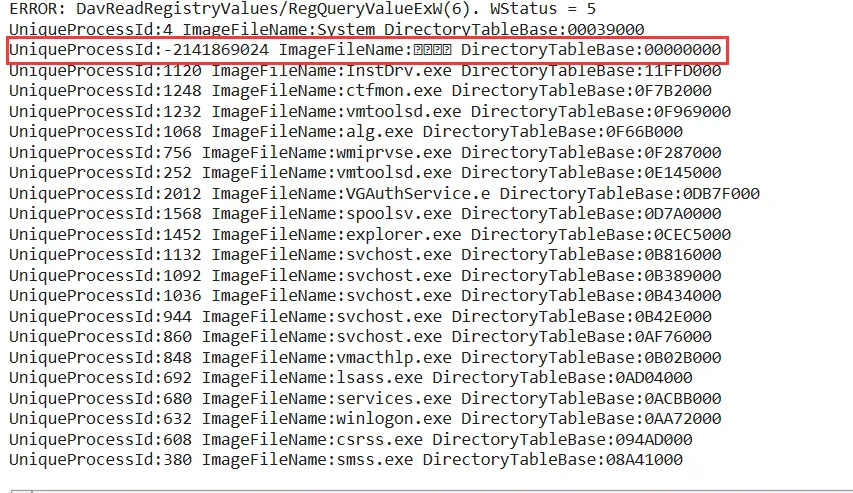

-   

-   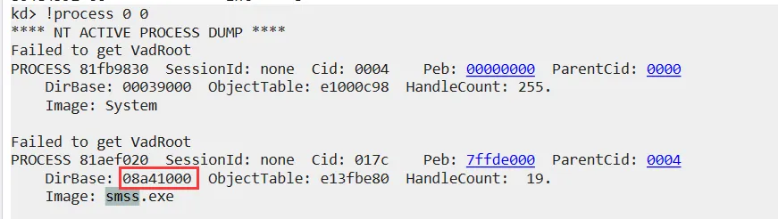

-   

### 获取所有进程的页目录表地址


-    只需要获取到一个进程的进程对象,就可以遍历所有进程了 

-    通过`API`可以获取到当前的进程对象`PsGetCurrentProcess` 

```
可以用WRK或者ReatOS看一下这个函数是如何实现的,就能知道进程结构体中的链表放在那里了
WRK版本
	#define PsGetCurrentProcess() _PsGetCurrentProcess()
	#define _PsGetCurrentProcess() (CONTAINING_RECORD(((KeGetCurrentThread())
	->ApcState.Process),EPROCESS,Pcb))
可以看到这里是先拿到当前线程,然后通过线程的APC状态拿到进程
这个线程来自于fs:[0]
NTAPI KeGetCurrentThread (VOID)
{
#if (_MSC_FULL_VER >= 13012035)
    return (struct _KTHREAD *) (ULONG_PTR) __readfsdword (FIELD_OFFSET (KPCR, PrcbData.CurrentThread));
#else
    __asm {  mov eax, fs:[0] KPCR.PrcbData.CurrentThread }
#endif
}

可以看到这里涉及到一个KPCR结构体也就是CPU控制块

或者直接在WinDbg里u一下这个函数的实现
kd> u PsGetCurrentProcess
nt!PsGetCurrentProcess:
	mov     eax,dword ptr fs:[00000124h];等价于_KPRCB结构体再+4的位置也就是当前线程
	mov     eax,dword ptr [eax+50h];拿到当前线程对象后再加50h就得到了进程对象结构体
	ret

也就是fs:[124]在_KPCR结构体最后一项还要加4的位置,0x120 PrcbData : _KPRCB(还要+4)
也就是_KPRCB结构体里的+0x004 CurrentThread    : Ptr32 _KTHREAD 成员
然后再+50h就是_KTHREAD里的+0x040 ApcState : _KAPC_STATE;这个结构体里再+10的位置
最终在_KAPC_STATE结构体里+10的位置得到了+0x010 Process : Ptr32 _KPROCESS

这里测试系统用的是Win732位.XP的话是eax+44h
```

`KPCR`-->`CPU`控制块 

操作系统作者要时时刻刻交给CPU很多表的信息.
动不动就切换进程切换线程就要快速的去查一些表,所以微软就做了一个KPCR结构体,里面放了CPU要用到的所有表
而这个表地址被放到fs里了
所以要想访问这个表就直接fs:[0]就可以访问了


-   -   `KPCR`结构体的部分成员

-   kd> dt _KPCR
    ntdll!_KPCR
       +0x000 NtTib            : _NT_TIB ;记录了内核的栈信息
       ;........成员省略..........................
       +0x020 Prcb             : Ptr32 _KPRCB;KPCRB结构体
       ;........成员省略..........................
       +0x03c GDT              : Ptr32 _KGDTENTRY ;CPU要给GDTR的地址就从这里拿出来给过去
       ;........成员省略..........................
       +0x120 PrcbData         : _KPRCB

-   -   -   `KPCRB`结构体

    -   这个结构体很大,结构体套结构体,所以只展示部分重要字段
        kd> dt _KPRCB
        ntdll!_KPRCB
           +0x000 MinorVersion     : Uint2B
           +0x002 MajorVersion     : Uint2B
           ;保存了当前线程,指向一个_KTHREAD结构体也就等价于指向_ETHREAD结构体
           +0x004 CurrentThread    : Ptr32 _KTHREAD 
           +0x008 NextThread       : Ptr32 _KTHREAD;指向下一个会被切换的线程
           +0x00c IdleThread       : Ptr32 _KTHREAD;指向空闲的线程(如果没有下一个就走这个空闲的)

    -   

    -   -   `KPCR`这个结构体基本上想拿什么东西都可以从这里拿 

    -   -    代码示例 

    -   ```c++
        //枚举进程页目录表
        void EnumProcessDir() {
            PEPROCESS Porcess = NULL;
            //获取进程对象
            __asm {
                mov eax, fs:[124h] //先获取当前线程对象
                mov eax, [eax + 44h] //EPROCESS;进程对象 在XP里是+44h
                mov Porcess, eax; //进程对象保存一下.
            }
        
            //链表在EPROCESS结构体偏移88的位置
            _LIST_ENTRY* head = (_LIST_ENTRY*)((char*)Porcess + 0x88);//链表头;
        	//这样就得到了第一个进程的结构体指针.
            _LIST_ENTRY* tail = head;//由于是双向循环链表所以再保存一下,相当于保存一下尾部吧
        
            //如果头不等于尾就一直循环.
            do {
                Porcess = (PEPROCESS)((char*)head - 0x88); //获取到进程对象
                //进程ID再0x84的位置
                ULONG UniqueProcessId = *(ULONG*)((char*)Porcess + 0x84); 
                //进程名在174的位置
                CHAR* ImageFileName = (char*)Porcess + 0x174; 
                //获取页目录表的地址
                PVOID DirectoryTableBase = *(PVOID*)((char*)Porcess + 0x18);
                KdPrint(("UniqueProcessId:%d  ImageFileName:%s DirectoryTableBase:%p 
                         	\r\n", UniqueProcessId, ImageFileName, DirectoryTableBase));
        
                //下一个链表
                head = head->Blink; //当前节点等于它的后继节点
            } while (head != tail);
        
            /* 
                得到一个进程的页目录表地址, 要操作它的进程就简单了...
                知道某个进程的页目录表地址,就可以查它的表了,就能知道对方的线性地址映射到那个物理地址
                这样就能在自己线程里操作这个物理地址,等价于操作对方的进程
                流程就是:
                读写进程内存 => 虚拟地址  =>  页目录表地址 =>  物理地址  =>  当前进程操作物理地址
        
                操作物理地址的话可以把物理地址映射到自己的进程里,等价于强制和别的进程内存共享...
            */
        }
        ```

    -   