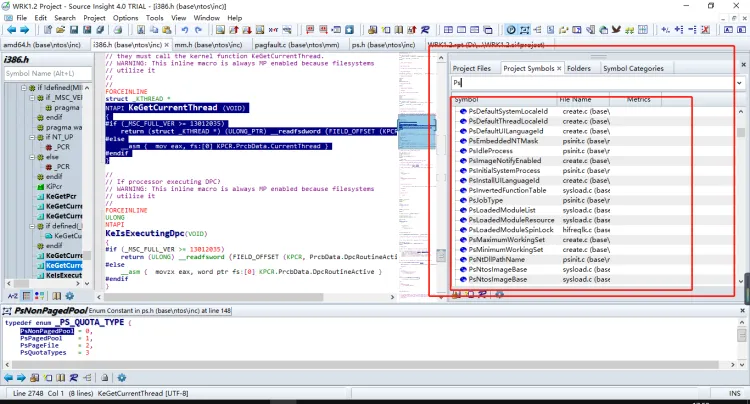

fs用来存放cpu常用的表,用寄存器比全局变量快

现在版本 fs给3环用  gs给0环用

CR3 是每个进程都有,切换进程的后操作系统就会切换 CR3 的值


-   在软件保护上还是游戏保护上,经常被人注入代码,读写内存,他们都有很多手法监控,,那进过我们所学知识,听过修改物理内存来实现,这样就可以过各种保护,因为没办法检测数据的正确性

#### 根据进程id获取进程对象	

```c++
PEPROCESS GetPorcessByPid(ULONG uPid) {


    PEPROCESS Porcess = NULL;
    //获取进程对象
    //__asm {
    //    mov eax, fs:[124h]    //ETHREAD; 先获取当前线程对象
    //    mov eax, [eax + 44h]  //EPROCESS;进程对象 在XP里是+44h (34+10)
    //    mov Porcess, eax;     //进程对象保存一下.
    //}
  Porcess = PsGetCurrentProcess();

  _LIST_ENTRY* head = (_LIST_ENTRY*)((char*)Porcess + 0x88);
  _LIST_ENTRY* tail = head;

  do {
    if (!MmIsAddressValid(head)) {     //判断内存是否有效
      break;
    }
    Porcess = (PEPROCESS)((char*)head - 0x88);    //获取到进程对象
    //CHAR* ImageFileName = (char*)Porcess + GetOffset(ImageFileOffset);
    if (!MmIsAddressValid(Porcess)) {   //判断内存是否有效
      break;
    }
    ULONG UniqueProcessId = *(ULONG*)((char*)Porcess + GetOffset(PidOffset));   //获取进程ID  
    //PVOID DirectoryTableBase = *(PVOID*)((char*)Porcess + 0x18);              //获取页目录表地址 
    //DbgPrint("UniqueProcessId:%d ImageFileName:%s DirectoryTableBase:%p\n", UniqueProcessId, ImageFileName, DirectoryTableBase);

    if (UniqueProcessId == uPid) {   //找到了我们要读数据的进程
      return Porcess;
    }


    head = head->Blink;
  } while (head != tail);

  return NULL;   	//空代表没有我们要读数据的进程
}
```

#### 获取表偏移

```c++
enum OFFSET_TYPE {ImageFileOffset, PidOffset};

ULONG GetOffset(OFFSET_TYPE Type) {
  ULONG uVersion = 0;
  PsGetVersion(NULL, NULL, &uVersion, NULL);      //获取内核版本
  switch(uVersion) {    //判断什么系统
  case 2600L:  { //xp3
    switch(Type) {
    case ImageFileOffset:    
      return 0x174;     //xp系统进程名偏移
    case PidOffset:
      return 0x84;
    }
  }
  }
  return 0;
}
```

## 读内存

-   首先要先根据指定的进程ID遍历进程,获取到它的页目录表 

-   -   但是遍历进程获取页目录表的偏移是不固定的.每个系统版本偏移都不一样;之前是先获取系统版本,然后再`switch`判断版本
    -   系统打补丁的话是不会影响结构体偏移的,只有内核版本改变才会影响偏移
    -   使用`PsGetVersion`来获取内核版本

-   ```c++
    BOOLEAN  PsGetVersion(
        PULONG  MajorVersion  OPTIONAL,
        PULONG  MinorVersion  OPTIONAL,
        PULONG  BuildNumber  OPTIONAL, //拿这个就行了,这个就是内核版本
        PUNICODE_STRING  CSDVersion  OPTIONAL
    );
    ```

-   获取到对应进程的`EPROCESS`后就可以映射并读取了 

-   -   映射可以使用`MmMapIoSpace`;映射这个物理地址就得到了页目录指针表了
    -   但是得到页目录指针表自己也不知道到底是2级表还是3级表,所以还要判断`CR4`寄存器(判断它有没有开启`PAE`)
    -   这种写起来必要麻烦,有更简单的方法.

-   ```c++
    ULONG OldCr3; //旧的CR3寄存器值
    
    ;把当前线程的CR3寄存器改成对方进程的CR3
    __asm {
        mov eax, cr3;
        mov OldCr3, eax;
        mov eax, DirectoryTableBase
        mov cr3, eax
    }
    
    也就是把当前进程的CR3改成对方进程的,这时候CPU去访问对应的地址,CPU就会去拿CR3,它就会按设置查表,查完
        后就得到物理地址了.这样就完成操作了;但是拷贝完数据后要立马还回去.
    
    ;拷贝完数据后再还回去
    __asm {
        mov eax, OldCr3
        mov cr3, eax
    }
    ;还回去后下面的代码就是正常的了,本进程的代码,要不然所有的代码也是对方进程的
    ```

-   换掉自己进程的`CR3`正常情况下是没有问题的,但是如果刚修改完本进程`CR3`后线程就切换了,这就会出问题了 

-   正常访问缺页异常会产生中断信号,但是已经把中断屏蔽了,所以就收不到了...
    于是只要访问到对方进程的地址,它的内存被交换到物理磁盘上就会崩溃,因为屏蔽了中断.....
    除非对方的地址是一个非分页内存,还要确保缓冲区也不是分页内存.

-   所以现在要解决分页内存问题.
    首先缓冲区要用自己的,不能用用户提供的缓冲区了,用户给的可能是分页内存.
    所以在拷贝数据的时候可以自己申请一个非分页内存,先从对方进程的地址拷贝数据到自己申请的非分页缓冲区内
    然后恢复中断了之后,再把非分页缓冲区的数据拷贝到用户提供的缓冲区里,这样就先解决了缓冲区分页问题.

-   对方的地址也有可能是分页内存,所以还要处理一下.
    直接算出它的物理地址,然后重新给它映射一个非分页内存.这就保证了它的地址是可靠的.
    使用MmMapIoSpace();{这个函数映射的是当前进程.但是它还是读CR3的,而CR3已经被修改了,那么这就代表它
    就会在对方页表里映射,并且映射的是非分页内存空间}
    但是还要算出物理地址,算物理地址的话可以使用MmGetPhysicalAddress();这个函数依然用的是CR3...
    所以就是先算出它这个地址的物理地址,然后给它映射一个非分页内存,拷贝的时候就从这个非分页内存中拷贝

-   使用API的话可能会被HOOOK.要想不被HOOK的话就得自己动手了.
    比如MmGetPhysicalAddress函数,可以用0xC060000+(pAddress) >> 12 * 8 这样就直接得到PTE了
    但是前面还得查一下页目录表.就可以取代这个函数了
    至于 MmMapIoSpace 函数就等价于 PTE = XXX ;就是自己改表,把物理地址填进去...

-   ```c++
    NTSTATUS MyReadProcessMemory(HANDLE ProcessId, PVOID pAddress,
      PVOID pBuffer, ULONG uLen) {
       NTSTATUS Status = STATUS_UNSUCCESSFUL;
    
         PEPROCESS Porcess = NULL;
        //获取进程对象
        __asm {
            mov eax, fs:[124h]    //ETHREAD; 先获取当前线程对象
            mov eax, [eax + 44h]  //EPROCESS;进程对象 在XP里是+44h (34+10)
            mov Porcess, eax;     //进程对象保存一下.
        }
      
      __try {   //防止代码异常
        PVOID pNoPageBuf = ExAllocatePool(NonPagedPool, uLen);   //申请一个非分页内存,这样就不会被交换到磁盘上,防止缺页异常
        if (pNoPageBuf == NULL) {   //判断内存是否申请成功
          return STATUS_UNSUCCESSFUL;
        }
    
    
        PEPROCESS Process = NULL;
        Process = GetPorcessByPid(ProcessId);
    
        //遍历进程
        if (Process == NULL)    //失败了要释放分页(要补充)
          return STATUS_UNSUCCESSFUL;
        DbgPrint("[%s] Process:%p\n", __FUNCTION__, Process);
    
    
        //获取页目录
        if (!MmIsAddressValid((char*)Process + 0x18)) {   //判断内存是否有效
          return STATUS_UNSUCCESSFUL;
        }
    
        PVOID DirectoryTableBase = *(PVOID*)((char*)Process + 0x18);   //获取页目录表
        DbgPrint("[%s] DirectoryTableBase:%p\n", __FUNCTION__, DirectoryTableBase);   //打印日志
    
    
    
        //时钟中断  : CPU上的一个硬件,每隔一段时间就给CPU发一个信号,CPU收到信号就会停止当前正在执行的代码,先处理这个信号
    	//,这样就会检查线程时间片使用用完了,需不需要切线程,如果屏蔽盖信号就不会切线程
    	
        __asm  {    //把自己进程的Cr3的值,改成对方进程的
          cli //屏蔽中断 早期的方法,有信号不管他,这样就收不到时钟中断的信号,只能0环才能用,只能屏蔽当前核的,所以在多核情况下不是那么稳定,因为其他核可能调该进程的其他线程
          mov eax, cr3
          mov OldCr3, eax
          mov eax, DirectoryTableBase
          mov cr3, eax
        }   //走到这里线程切换,切换到自己进程的另一个线程,那这个时候页目录表不变,只需要变堆栈段(ss)
    	    //,即CR3不需要变,但因为CR3被我们改了,所以就会出错
    	
    
    //分页内存问题  :
    //因为我们屏蔽了中断,但是如果我们访问到一个缺页的异常,因为我们访问的是分页内存,正常情况下访问一个缺页异常会产生一个中断信息,于是只要我们访问了这个地址他的内存被交换到物理磁盘上,那么将没人帮我们交换内存,因此要解决这个问题除非对面内存是一个非分页内存
    			
    			
       
        PHYSICAL_ADDRESS pa = MmGetPhysicalAddress(pAddress);      //根据CR3的值来通过虚拟地址获取物理地址,因此我们改了CR3的值,因此获取的就是我们目标进程的
    	//调内核函数就有可能被保护者 hook,因此我们也可以自己来实现上面函数,但是难点就是兼容性问题,但是因为这个函数参数没有指明进程,所以被hook其实影响也不大
    	 //0XC060000 + (pAddress) >> 12 * 8; PTE    //怕被hook可以自己来映射表
         //check     //需要检测地址是否有效
    
        //PTE = XXX;  可以取代下面的函数,自己改表把物理地址填进去
        PVOID  pNoPageAddr = MmMapIoSpace(pa, uLen, MmNonCached);    //映射物理地址,得到一个非分页内存 只能映射当前进程的 因此我们改了CR3的值,映射的是我们目标进程的
        //check     //需要检测地址是否有效
    
        //因为这里我们把CR3改成目标进程的,所以查表就相当于查目标进程,因此拷贝数据就是拷贝目标进程的
        //因为我们是操作我们进程,所以对方不好检测	
        RtlCopyMemory(pNoPageBuf, pNoPageAddr, uLen);                //把映射到内存的数据拷贝到我们缓冲区
    
        MmUnmapIoSpace(pNoPageAddr, uLen);    //取消映射
    
        __asm {    //还原自己进程的CR3的值
            mov eax, OldCr3
            mov cr3, eax
            sti //恢复中断   这样就可以收到时钟中断的信号
        }
    
        //静态链接的,因此不可能被hook
        RtlCopyMemory(pBuffer, pNoPageBuf, uLen);   //从我们申请的非分页内存拷到目的缓冲区
      }
      __except(1) {
        return STATUS_UNSUCCESSFUL;
      }
    
      return STATUS_SUCCESS;
    }
    ```

-   -   这样读取的话就完成了并且很稳定. 
    -   实现写内存之前还要改进一下屏蔽中断,上面通过 cli 和  sti 防止线程切换,但是在多核CPU上还有稳定性问题,更好的办法就是提升 Irql 等级 

-   可以提升IRQL级别到DISPATCH_LEVEL级别.把中断级别提升到DISPATCH_LEVEL级别就不存在切线程了.
    而且支持多核,它还是内核API,比cli指令稳定多了
    所以在老版本用cli,但是在新办法提升IRQL级别更稳定.

-   使用KeRaiseIrql()提升,操作完之后在用KeLowerIrql()降回去

-   -    并且修改`CR3`的内联汇编也可以用内部函数来完成,这也兼容性会更好点 

-   使用__readcr3和__writecr3来替换掉之前的内联汇编

-   但是如果是64位的话,类型转换还有点问题,因为 __writecr3的时候要把EPROCESS写进去,要强转一下.
    32位和64位强转位ULONG的话不兼容,所以要使用ULONG_PTR
    __writecr3((ULONG)DirectoryTableBase);

取消内联汇编,使用内部函数,可以一步提升,可以编译成64位

```c++
NTSTATUS MyReadProcessMemory(HANDLE ProcessId, PVOID pAddress,
  PVOID pBuffer, ULONG uLen) {
   NTSTATUS Status = STATUS_UNSUCCESSFUL;
  
  __try {   //防止代码异常
    PVOID pNoPageBuf = ExAllocatePool(NonPagedPool, uLen);   //申请一个非分页内存,这样就不会被交换到磁盘上,防止缺页异常
    if (pNoPageBuf == NULL) {   //判断内存是否申请成功
      return STATUS_UNSUCCESSFUL;
    }

    //未文档内核API(未公开):微软也需要遍历进程,内存,那么他也要封装函数,我们可以找到他们封装的函数暴力调用,因为未公开,所以不知道参数和用法
	//但是我们有wrk,可以在wrk查看参数和用法,他怎么用我们只要抄过来就可以,写内核经常用这一招解决兼容性和跨版本问题
	
    //动态获取内核api地址    函数如果没导出,可以支持一个导出了,而且调用未导出的函数的函数,那么就可以拿到导出函数的地址,然后往下扫特征,获取我们目标函数的地址
	//如果更极端函数没导其他导出函数调用,我们一层层往上找,找到公开或者导出的函数,在去扫特征码
    //MmGetSystemRoutineAddress();  //动态获取函数地址.通过函数名获取函数地址,没有导出的时候就可以用这个函数
    PEPROCESS Process = NULL;
    Status = PsLookupProcessByProcessId(ProcessId, &Process);   //获取进程对象
    if (!NT_SUCCESS(Status)) {    //失败了要释放分页(要补充)
      return Status;
    }
    // Process =  GetPorcessByPid(ProcessId)   //获取进程对象   

    //遍历进程
    if (Process == NULL)    //失败了要释放分页(要补充)
      return STATUS_UNSUCCESSFUL;
    DbgPrint("[%s] Process:%p\n", __FUNCTION__, Process);


    //获取页目录
    if (!MmIsAddressValid((char*)Process + 0x18)) {   //判断内存是否有效
      return STATUS_UNSUCCESSFUL;
    }

    PVOID DirectoryTableBase = *(PVOID*)((char*)Process + 0x18);   //获取页目录表
    DbgPrint("[%s] DirectoryTableBase:%p\n", __FUNCTION__, DirectoryTableBase);   //打印日志

    //MmMapIoSpace(); 
    ULONG_PTR OldCr3;
    KIRQL OldIrql;
    KeRaiseIrql(DISPATCH_LEVEL, &OldIrql); //保存Irql当前级别并提升Irql等级到 DISPATCH_LEVEL 
    
	OldCr3 = __readcr3();   //内部函数,获取 CR3的值
    __writecr3((ULONG_PTR)DirectoryTableBase);   //修改 CR3的值


//分页内存问题  : 因为我们屏蔽了中断,但是如果我们访问到一个缺页的异常,因为我们访问的是分页内存,正常情况下访问一个缺页异常会产生一个中断信息,于是只要我们访问了这个地址他的内存被交换到物理磁盘上,那么将没人帮我们交换内存,因此要解决这个问题除非对面内存是一个非分页内存
			
		
   
    PHYSICAL_ADDRESS pa = MmGetPhysicalAddress(pAddress);      //根据CR3的值来通过虚拟地址获取物理地址,因此我们改了CR3的值,因此获取的就是我们目标进程的
	//调内核函数就有可能被保护者 hook,因此我们也可以自己来实现上面函数,但是难点就是兼容性问题,但是因为这个函数参数没有指明进程,所以被hook其实影响也不大
	 //0XC060000 + (pAddress) >> 12 * 8; PTE    //怕被hook可以自己来映射表
    //check     //需要检测地址是否有效

    //PTE = XXX;  可以取代下面的函数,自己改表把物理地址填进去
    PVOID  pNoPageAddr = MmMapIoSpace(pa, uLen, MmNonCached);    //映射物理地址,得到一个非分页内存 只能映射当前进程的 因此我们改了CR3的值,映射的是我们目标进程的
    //check     //需要检测地址是否有效

    //因为这里我们把CR3改成目标进程的,所以查表就相当于查目标进程,因此拷贝数据就是拷贝目标进程的
    //因为我们是操作我们进程,所以对方不好检测	
    RtlCopyMemory(pNoPageBuf, pNoPageAddr, uLen);                //把映射到内存的数据拷贝到我们缓冲区

    MmUnmapIoSpace(pNoPageAddr, uLen);    //取消映射

    __writecr3(OldCr3);        //还原CR3的值
	
    KeLowerIrql(OldIrql);    //将Irql等级恢复到原来等级

    //静态链接的,因此不可能被hook
    RtlCopyMemory(pBuffer, pNoPageBuf, uLen);   //从我们申请的非分页内存拷到目的缓冲区

    if (Process) {
      ObDereferenceObject(Process);  //因为 Process 是对像,不用的时候引用计数需要 -1
    }
  }
  __except(1) {
    return STATUS_UNSUCCESSFUL;
  }

  return STATUS_SUCCESS;
}
```

-    获取进程对象,也可以换成函数来完成 

通过PsGetCurrentProcess();来完成,并且使用这个函数的话,偏移问题也解决了

遍历进程的话因为还是使用了偏移,就不兼容了,所以还得解决一下. 

可以找未文档化的内核API来操作.也就是未公开的.
因为微软肯定要遍历进程,所以就可以找到它封装的函数,自己调用.
但是找到未公开的函数不知道它的参数,也不知道它怎么传参的,怎么使用的,这时候就可以用WRK了,WRK怎么用,我就怎么用.
直接用Source源码浏览工具打开WRK的源码,然后输入Ps,也就是找Ps开头的函数.



进一步优化解决兼容性问题 ,提升通用性,削弱强度 要考虑被hook的问题

```c++
NTSTATUS MyReadProcessMemory2(HANDLE ProcessId, PVOID pAddress,
  PVOID pBuffer, ULONG uLen) {
	  
  NTSTATUS Status = STATUS_UNSUCCESSFUL;
  PVOID pNoPageBuf = NULL;

  PEPROCESS Process = NULL;
  Status = PsLookupProcessByProcessId(ProcessId, &Process);   //获取进程对象
  if (!NT_SUCCESS(Status)) {
    return Status;
  }


  //重载内核
  PRKAPC_STATE ApcState = (PRKAPC_STATE)ExAllocatePool(NonPagedPool, sizeof(KAPC_STATE));   //申请非分页内存
  KeStackAttachProcess(Process, ApcState);  //切换成指定进程,并保存当前进程环境 

  //MmCopyMemory 
  if(MmGetSystemRoutineAddress("MmCopyMemory") != NULl)
  {
	 PSIZE_T  NumberOfBytesTransferred = 0;
	 MmCopyMemory(ApcState,pBuffer,uLen, MM_COPY_MEMORY_VIRTUAL,&NumberOfBytesTransferred);  //这个函数  Win8.1 以后才能用  
  }
  else
  {
	  __try {
		pNoPageBuf = ExAllocatePool(NonPagedPool, uLen);   //申请非分页内存
		if (pNoPageBuf == NULL) { 
		  return STATUS_UNSUCCESSFUL;
		}

		PHYSICAL_ADDRESS pa = MmGetPhysicalAddress(pAddress);      //根据CR3的值来通过虚拟地址获取物理地址
		PVOID  pNoPageAddr = MmMapIoSpace(pa, uLen, MmNonCached);  //映射物理地址,得到一个非分页内存

		RtlCopyMemory(pNoPageBuf, pNoPageAddr, uLen);              //拷贝数据

		MmUnmapIoSpace(pNoPageAddr, uLen);                         //取消内存映射数据
	  }
	  __except(EXCEPTION_EXECUTE_HANDLER) {
		   return STATUS_UNSUCCESSFUL;
	  }
	 
	  KeUnstackDetachProcess(ApcState);       //切换回我们自己原来的进程
	  ExFreePool(ApcState);                   //释放分页内存

	  RtlCopyMemory(pBuffer, pNoPageBuf, uLen);     //从我们申请的非分页内存拷到目的缓冲区
	  ExFreePool(pNoPageBuf);                 //释放分页内存
  }
  return STATUS_SUCCESS;
}
```

## 写内存

-    写入最大的问题就是内存保护属性问题 

-   -   比如一个地址是代码段,那么对它写入的话肯定就会崩溃,没有写的属性,也没有权限....

-    如果要写入的地址是只读的话,那么就会直接蓝屏,因为写入之前已经提升了当前进程的`IRQL`级别为`DISPATCH_LEVEL` 了.所以直接就蓝屏了.. 
-    要保证提供的内存地址一定能写有两种方法 

可以把他页表的W位置为1,这样就能写入了.
还有另外一种方法.可以查看CPU手册.
CR0的第16位是写保护,也就是如果它的页属性是不可写的话,对它写就会产生异常.正常这一位一定是1.
但是如果这一位给0,意思就是虽然页属性不能写,但是写入的话CPU也不管
也就是说如果把这一位置为0任何的页就都能写入了,CPU不会检查了.
但是改了这个标志的话其他的进程也会受影响,因为它属于CR0么,是全局的,所以必须要保证线程不能切换,正好已经
做到了线程不切换.所以直接改它.

```c++
//开启写保护
void EnableWP() {
  ULONG_PTR cr0 = __readcr0();   //获取CR0的值
  cr0 |= 0x10000;                //第16位置1
  __writecr0(cr0);               //修改CR0的值
}

//关闭写保护
void DisableWP() {
  ULONG_PTR cr0 = __readcr0();    //获取CR0的值
  cr0 &= ~0x10000;                //第16位置0
  __writecr0(cr0);                //修改CR0的值
}


NTSTATUS MyWriteProcessMemory(HANDLE ProcessId, PVOID pAddress,
  PVOID pBuffer, ULONG uLen) {
  NTSTATUS Status = STATUS_UNSUCCESSFUL;
  PVOID pNoPageBuf = NULL;


  PEPROCESS Process = NULL;
  Status = PsLookupProcessByProcessId(ProcessId, &Process);   //获取指定进程对象
  if (!NT_SUCCESS(Status)) {
    return Status;
  }

  pNoPageBuf = ExAllocatePool(NonPagedPool, uLen);     //申请非分页内存
  if (pNoPageBuf == NULL) {
    return STATUS_UNSUCCESSFUL;
  }

  RtlCopyMemory(pNoPageBuf, pBuffer, uLen);       //拷贝数据

  PRKAPC_STATE ApcState = (PRKAPC_STATE)ExAllocatePool(NonPagedPool, sizeof(KAPC_STATE));   //申请非分页内存
  KeStackAttachProcess(Process, ApcState);       //切换成指定进程的信息,并保存当前进程环境 

  __try {
    PHYSICAL_ADDRESS pa = MmGetPhysicalAddress(pAddress);       //根据CR3的值来通过虚拟地址获取物理地址
    PVOID  pNoPageAddr = MmMapIoSpace(pa, uLen, MmNonCached);   //映射物理地址,得到一个非分页内存

    DisableWP();  //取消写保护
    RtlCopyMemory(pNoPageAddr, pNoPageBuf, uLen);      //把我们的数据拷到对方进程指定地址
	//CPU查 pNoPageAddr 属性是只读的,我们拷贝数据过去,会导致权限不对产生异常
	//,但是因为我能进程 DISPATCH_LEVEL 级别,没人能打断我们,所以直接蓝屏,因此可以先取消写保护,再开启
	
    EnableWP();    //开启写保护

    MmUnmapIoSpace(pNoPageAddr, uLen);    //取消内存映射
  }
  __except (EXCEPTION_EXECUTE_HANDLER) {
  }

  KeUnstackDetachProcess(ApcState);        //切换回我们自己原来的进程
  ExFreePool(ApcState);                    //释放非分页内存
  ExFreePool(pNoPageBuf);                  //释放非分页内存

  return STATUS_SUCCESS;
}
```

## 总结

-    这样就可以操作任何进程了,而且对方感知不到 
-    虽然用这种方法的话很难检测到,但是还是有方法能够检测的 

比如对方在EPROCESS里放了一个假的页目录表.
EPROCESS是从KPROCESS里拿的,KPROCESS里偏移为0x18的位置,也就是DirectoryTableBase这个成员
这里就是页目录表,但是它放了个假的...,那么既然是假的,我们把它放到CR3里再用那就错了.
    
但是它自己也不能跑了.所以它必须要保证它的线程在跑的时候页目录表是真的,于是它就找到切换线程的函数把他给HOOK了,如果它发现切换线程了,并且切换的是自己的进程,那么它就会把表还回去,CR3里面给的就是真实的表.他就等于 把  EPROCESS 里面的表废弃掉

切换进程的函数 KiSwapProcess   
切换线程的函数 KiSwapContext  ,切线城的时候可能会切进程,因为CR3得切,他只需要该jmp先判断 edx 是否是自己的  EPROCESS ,是的话 CR3的值就给真的,因此之前需要先把真的保存起来


这是一个保护思路.
要解决它的话,可以用WinDbg强制切换到对方线程,那么这时候它CR3里就是真的CR3了.它的代码在执行的时候肯定是真的,利用这一点就很容易找到它真实的CR3了,因为我们遍历链表时他是假的,但是CR3里面是真的,如果CR3里面也是假的,那么他的线程就不能跑

还有一种方法是把内存页设为无效,当访问到这个内存的时候就会抛出异常,按理说是系统先收异常,而保护方就会把系统接收异常的函数给HOOK了...在系统接收异常的函数里判断EPROCESS是不是自己的.
    
这个可以去AVL树里查,树里有这个内存地址的话,就可以把它内存属性改为有效.这样就可以了

-    对内核工具来说它调一个`API`的时候可以通过重载内核来保证这个`API`没有被`HOOK` 

-   -   重载内核就是文件里有个`Kernel.exe`,自己通过`LoadPe`把他加载进来,也就是自己调自己的...这样会导致内存暴涨...等价于内核里有多个内核..
    -   这样的好处就是保证了兼容性,同时也避免被人`HOOK`
    -   但是这个代码不好写,要加载PE,修复导入表啥的.至于为什么还要用重载内核,是因为有`WRK`,可以直接抄它的代码...
    -   重载内核一般都是攻击者做的....