!votp  页目录表地址  虚拟地址                   模拟手工计算物理地址过程


 线程切换 

详情请看CPU手册第6章

CPU种没有线程,进程的概念,只有TASK(任务)

●切换线程最大的问题就是寄存器环境问题,例如 A 任务切换到B任务

○保存A任务寄存器环境 (3环寄存器全部需要保存,CR0和CR4不需要,CR3需要保存)

○修改当前寄存器为B任务

●CR2寄存器的作用: 当CPU访问了一个分页,如果无效,产生页访问异常,他就会把页的地址的地方值 到CR2寄存器,那么操作系统作者就可以通过这个寄存器的值知道哪个页产生错误,以便快速去查

●CR0 和CR4是控制

●CR3 是页目录

●线程切换的越快,系统运行速度越快,不然大量时间再切环境,而不是跑代码

●正常情况下,操作系统自己可以完成保存和 修改寄存器环境

○如果直接系统自己切,例如esp ,那么4环就得准备四个栈,还有ss也一样,因此速度没有CPU快

○CPU其实很简单,可以弄一套硬件机制,可以秒切换线程和寄存器环境,然后提供一条指令

○寄存器信息切换时是保存到内存里面,不能保存到寄存器


 快速切换线程 

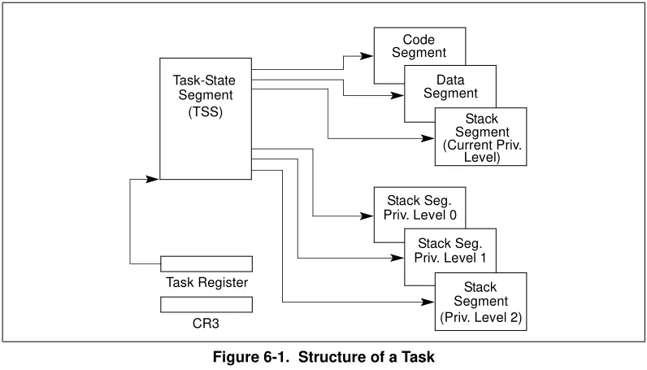


●又有了一个任务寄存器   TR ,指向一个任务状态段 (TSS  寄存器结构体),里面保存了寄存器信息

○The task’s current execution space, defined by the segment selectors in the segment

○registers (CS, DS, SS, ES, FS, and GS).

○The state of the general-purpose registers.

○The state of the EFLAGS register.

○The state of the EIP register.

○The state of control register CR3.

○ The state of the task register.

○ The state of the LDTR register.

○ The I/O map base address and I/O map (contained in the TSS).

○Stack pointers to the privilege 0, 1, and 2 stacks (contained in the TSS).

○Link to previously executed task (contained in the TSS).

 任务状态段 (TSS) 

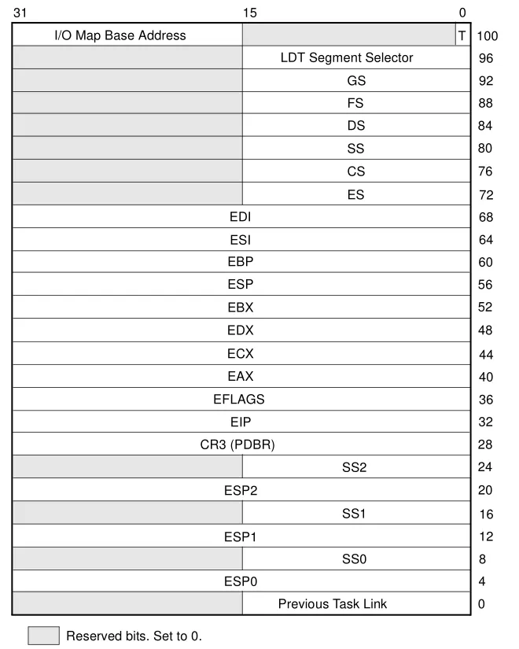


●整个结构体 大小是 104 字节

●tr 寄存器指向该结构体,所以tr寄存器是段选择子

●Previous Task Link 保存上一个任务的TR,这样就知道从哪一个人物且过来的 


\-

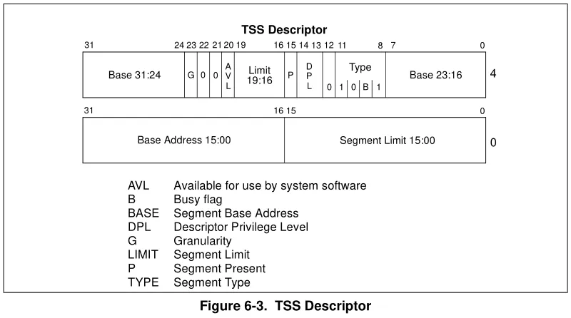

这个表放在GDTR 表里面,只有Base 有用,他的的都没用

  


●TR 去查 GTDR 表,可以得到一个描述符,描述符可以得到一个base,这个base 指向的就是 TSS 结构体

●不可能版本的 tr 都是 28,因为微软不用,但又不得不给,因为  任务状态段 (TSS) 的原因,因,我们创建了一个线程,他有时是在3环跑代码,调API在0环跑代码,他的权限会切来切去,栈也要跟着切来切去,所以CPU产生栈切换的时候他固定会从 TSS 里面 拿几环的ESP 和 SS,如果不给这个tr寄存器或者  TSS 结构体,那他权限切换就有问题,因此这个结构体必须得做,但是只需要做一个,因为他不用这个切线程,只是让 CPU可以从里面查数据

●微软切换线程的方法就是,切换线程时,把结构体里面的成员 ESP0 的值改了,tr不用改

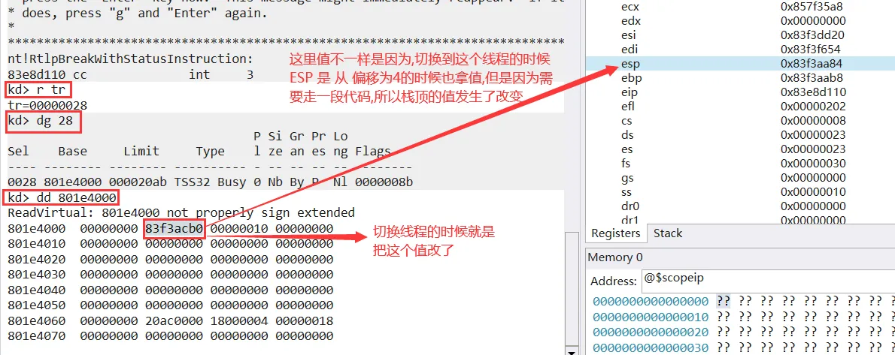


 CPU切换任务方法 

●LTR      读取TR寄存器信息

●STR      修改TR寄存器信息

●上面两条命了只是改寄存器,环境并没有切,所以通过改寄存器是无法切换线程的

●想要切换任务得到通过门(Gate)

●假设任务切换了,通过门可以到另一个线程,而且一条指令就可以了

 任务门(Gate) 

●解释起来其实就是函数指针,切换线程需要给线程的回调函数地址,所以里面通常描述一个函数地址

●叫门还不叫函数地址的原因是因为还需要描述 权限问题

●门也是一个描述符

●门可以放在3个地方   GDT, LDT 或者 IDT 都可以

 6切换方式 

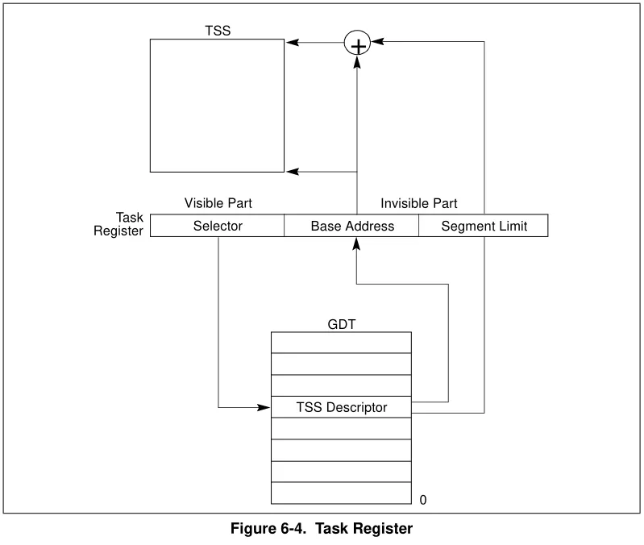


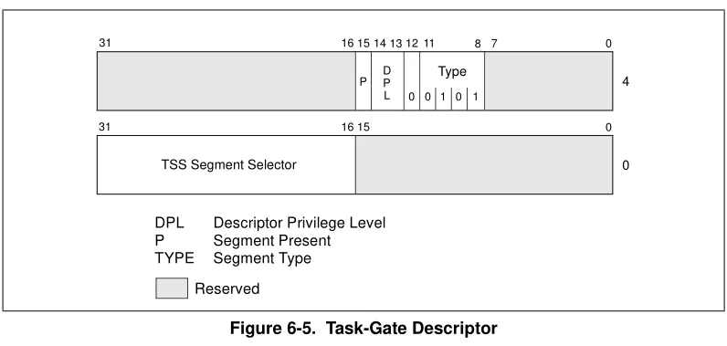

这里的16-31位的 就是 tr


●首先有一个段选择子,他本身就会从 GDT 里面 拿 TSS,这样就可以得到 TSS 结构体

●接下来 第一点需要在GDT 里面做一个 TSS的结构体 ,第二点 还需要在里面做一个任务门的描述符,上图灰色表示保留不用,只描述了一个段选择子

●假设我们在 GDT表

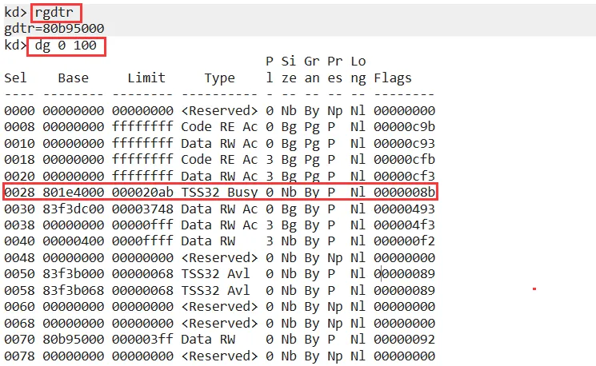


○我们已经做了一个 TSS,然后我们还得做一个任务门,把他的机构体地址填进去

○

假设我们刚才 TSS 做在50的位置,选择子是50 ,那么我们得弄一个描述符,里面的选择子是50 

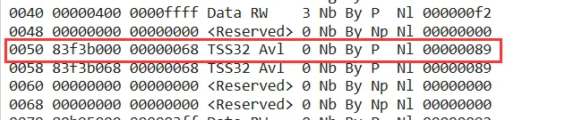


○我们切的时候 如果放在 GDT表 就是用 jmp 和call 来切  ,如果是 IDT 表 就得用 int指令来调

○我们现在打算切到  

○0050 83f3d000 00000068 TSS32 Avl  0 Nb By P  Nl 00000089
○0028 801e4000 000020ab TSS32 Busy 0 Nb By P  Nl 00000
○ 0058  50  Task Gate

​           Busy表示正在用的任务状态段

○切换就是    jmp 0058:0       或者     call  far ptr 0058:0      jmp 可能回不来,用call 回来就是   retf

○cpu就会当前的寄存器信息保存到 28的地址里面,接下来从 50读取到 地址   83f3d000 ,从这里面读取寄存器信息改到当前

○如果把上面做到中断表里面就是   int 28      int 指令回来用 iret 指令

○32位 int 后面的数字就是选择子,可以理解为表下标

●微软不用TSS的可能的原因: 放在GDT表里面的话 一共2 ^13 = 8192项,一个线程需要2项,就算整个表都给线程用,最多也就 4096 个,可能不够用(例如服务器),而且也不可能都给线程用

●不用TSS怎么切呢,自己建一个结构体自己保存,自己切不能不用TSS,因为里面的ESP 我们弄不了,栈是发生在权限交换的时候的那一瞬间,如果那一瞬间栈没改好就直接崩了,所以他要求在切换权限的瞬间,栈也要跟着切,走任何一行代码之前栈需要切好,如果栈没有切好EIP我们切过去了,因为EIP在环境里面,开始执行代码,如果mov ss,但是mov ss需要先走代码,所以微软也做了几个

 微软切换的方法 

●微软自己建了一个结构体,在  _KTHREAD  里面

●

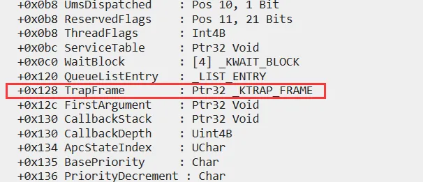


_KTRAP_FRAME 结构体

```c++
kd> dt _KTRAP_FRAME
nt!_KTRAP_FRAME
   +0x000 DbgEbp           : Uint4B
   +0x004 DbgEip           : Uint4B
   +0x008 DbgArgMark       : Uint4B
   +0x00c DbgArgPointer    : Uint4B
   +0x010 TempSegCs        : Uint2B
   +0x012 Logging          : UChar
   +0x013 Reserved         : UChar
   +0x014 TempEsp          : Uint4B
   +0x018 Dr0              : Uint4B
   +0x01c Dr1              : Uint4B
   +0x020 Dr2              : Uint4B
   +0x024 Dr3              : Uint4B
   +0x028 Dr6              : Uint4B
   +0x02c Dr7              : Uint4B
   +0x030 SegGs            : Uint4B
   +0x034 SegEs            : Uint4B
   +0x038 SegDs            : Uint4B
   +0x03c Edx              : Uint4B
   +0x040 Ecx              : Uint4B
   +0x044 Eax              : Uint4B
   +0x048 PreviousPreviousMode : Uint4B     //之前的特权级
   +0x04c ExceptionList    : Ptr32 _EXCEPTION_REGISTRATION_RECORD
   +0x050 SegFs            : Uint4B
   +0x054 Edi              : Uint4B
   +0x058 Esi              : Uint4B
   +0x05c Ebx              : Uint4B
   +0x060 Ebp              : Uint4B
   +0x064 ErrCode          : Uint4B
   +0x068 Eip              : Uint4B
   +0x06c SegCs            : Uint4B
   +0x070 EFlags           : Uint4B
   +0x074 HardwareEsp      : Uint4B
   +0x078 HardwareSegSs    : Uint4B
   +0x07c V86Es            : Uint4B
   +0x080 V86Ds            : Uint4B
   +0x084 V86Fs            : Uint4B
   +0x088 V86Gs            : Uint4B
```

-   可以看到他把调试寄存器(DR0~DR7)都保存了,但intel没有考虑到这个问题,这样会导致我们对A线程下一个硬件断点,结果线程一切,把B线程断下来了
-   而且微软保存了前一个线程特权级
-   我们可以通过 x nt!*swap*	搜索切换的函数可以找到切换线程的函数

​       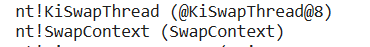

-    SwapContext 切换设备上下文,即寄存器环境  通过 uf  nt!SwapContext 指令可以查看实现函数,在反汇编窗口看更方便

-   -   函数最后调用了蓝屏函数,因为切换线程出问题了就蓝屏

-   KiSwapThread 才是完整的切线程函数,有时候我们在内核里面要对这个函数很敏感,如果有人 hook 了这个函数,那么系统线程切换有由人说了算,例如不给杀软任何时间片,那么杀软就相当于无法运行

-   -   hook 方式: 找到这个函数 改jmp,困难点是找到这个函数地址

#### 完整流程

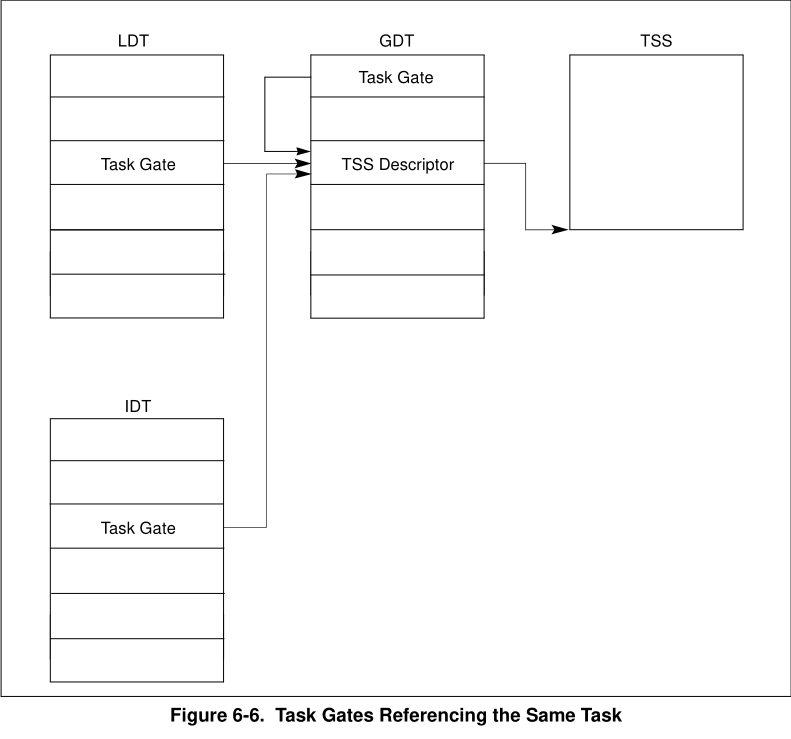

-   任务门(Task Gate)会自动从 TSS 拿栈描述符,拿到TSS,然后修改
-   用 IDT 和  LDT 都可以,后面流程是一样的 
-   GDT 中   任务门(Task Gate) 和 TSS 描述符(TSS Descriptor)都得有 

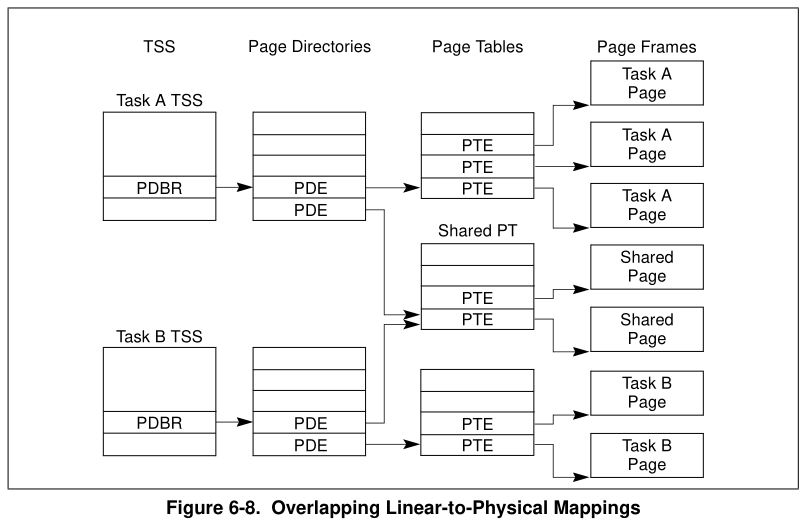

-   TSS最终还是要查页表,因为他也要走分页


## 中断

详情请看CPU手册第5章


-   轮询：比如说有一个,例如键盘,我们怎么知道他按了按键呢,就一直问他,按了没有,这样轮流去问每个硬件(内存除外,因为内存没有芯片,内存是你给他一个地址他就存),但是这样效率很低,最好的方法就是硬件用了就通知我们
-   而中断就是在通知的过程中如果正在操作的话就要打断它.- 比如正在走代码,突然键盘被按下了.这时候就要打断代码的执行,处理键盘操作.
-   其实是用cli指令,就能屏蔽掉这个键盘中断.
-   但是有些中断是不能屏蔽的,例如拔电源CPU需要通知我们

### 中断设计

1.  可屏蔽中断 : 可以通 cli 屏蔽的中断
2.  不可屏蔽中断 : 这种中断我们屏蔽也没有用

-   CPU会为中断设计2个引脚,一个引脚接收的就是可屏蔽中断,另一个引脚接受的就是不可屏蔽中断(NMI引脚)
-   有了中断,我们就不用去问硬件是否是用了,硬件使用了往CPU发个信号就可以了,一般会产生一个中断信号,CPU收到这个信号后,可能并不知道是谁发的,他只知道是哪个端口发的,只有操作知道怎么处理,所以操作系统得项CPU提供什么信号应该干什么
-   方法就是操作提供一张表,里面都是函数指针,CPU产生几号信号,就去查表里对应下标的函数指针进行调用,操作系统不提供这个表的话,CPU收到信号就会自杀,因为他不知道该怎么办,这个表就是中断表,又称为中断描述符表

### 中断表(IDT)

-   这个表的的地址就存放在寄存器  IDTR 中
-   这个表 48位,说明带了 limit 
-   因为寄存器是48位,因此不能用 mov 指令 

-   -   lidt      读取 IDTR  寄存器的值
    -   sidt     修改 IDTR  寄存器的值

-   访问方式那些跟GDT 一样, 就是可以 把GDT有关的全部改成 IDT 就行了, 寄存器也一样,指令也一样,表也一样,表的格式跟GDT表是一样的,区别就是 中断表里面只能放门,不能放代码段和数据段,但是格式解析是差不多的
-   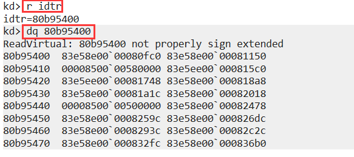
-   然后一项一项解析就可以了
-   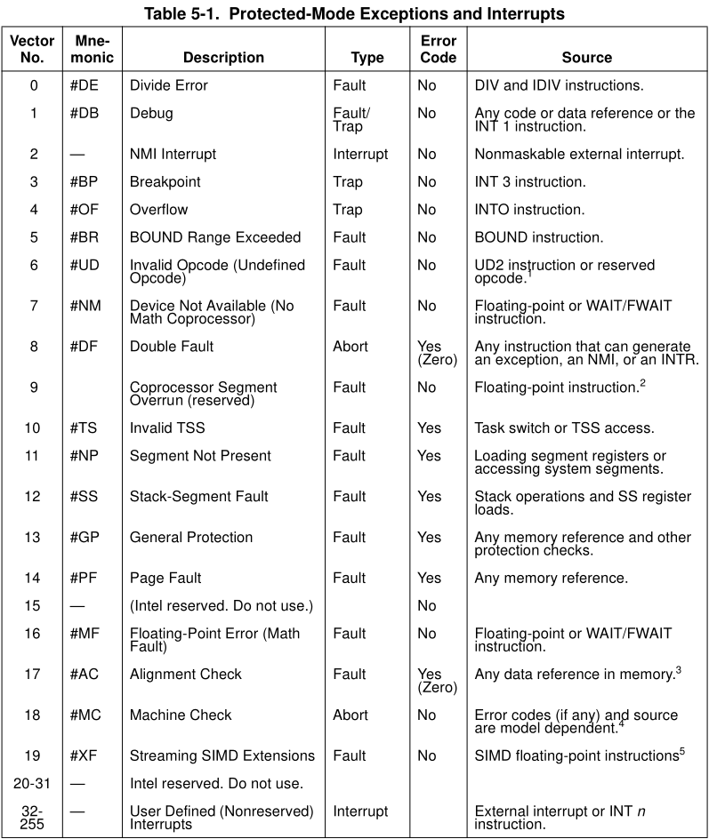
-   例如0,就调上面的第一项,找不到CPU就断电
-   0~19号不能处理硬件,例如CPU做除法,碰到除0异常,得通知系统,因此intel把指定产生的异常也当中断处理,因此由硬件产生的我们称为中断,软件产生的我们称为异常
-   例如我们把表的 第四项抹了,那么运行调试其实将无法正常工作,因为不会产生断点异常(但是抹除只是当前CPU的,如果多核CPU,其他核还是可以正常调试),不能直接改0,否则cpu会断电,可以通过该代码来实现,例如直接让函数 iretd   (不能用ret ,d表示返回要平栈) **eb  函数地址 cf    函数值行直接返回      !idt  3   可以得到 idt表下标为3的项的函数地址**


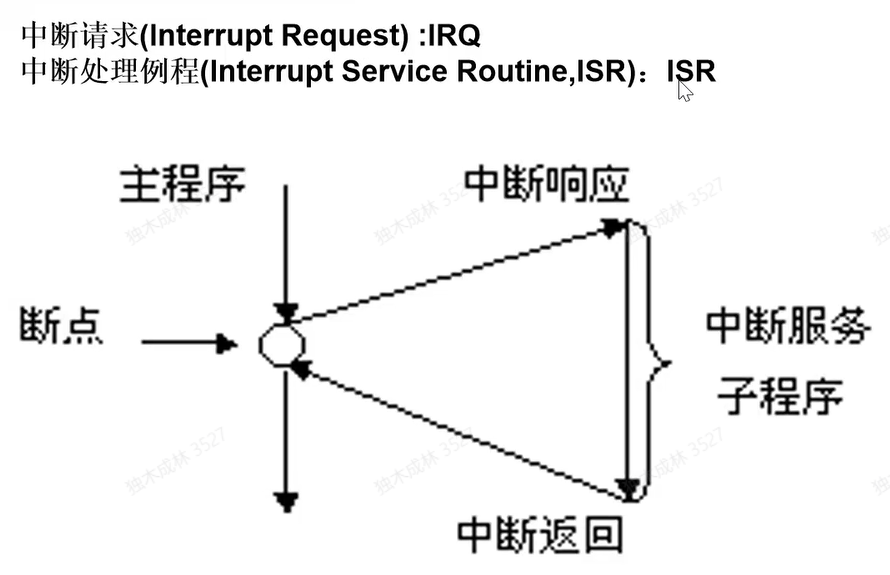

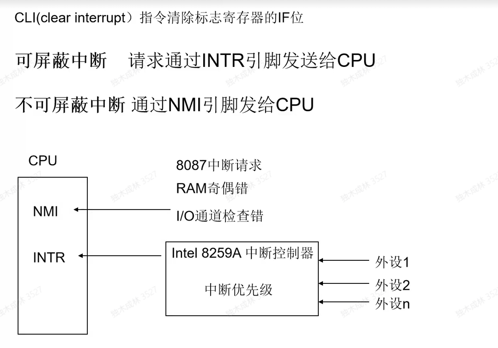

-   因为可能多个中断同时产生,是有中断控制器来处理,对中断进行排队
-   早期每一个端口插什么硬件都是固定的,但是吧硬件端口号固定不是太好,因为不断有新硬件产生,,也要去支持它,因此CPU增加了一个芯片APIC,他不断可以处理硬件端口号可以不固定的问题,还可以处理多核问题
-   可以通过 !idt -a 可以解析idt表,通过函数名称可以知道 该号中断是干什么用的

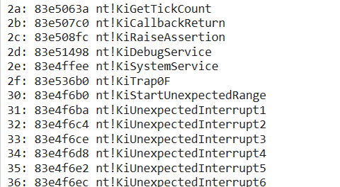

-   例如: KiGetTickCount   就是获取程序运行时间,如果改了这个函数,可以让时间变快
-   硬件中断最终还是调硬件驱动

#### 中断表格式

这个表地址在3环也可以拿,但是不能操作

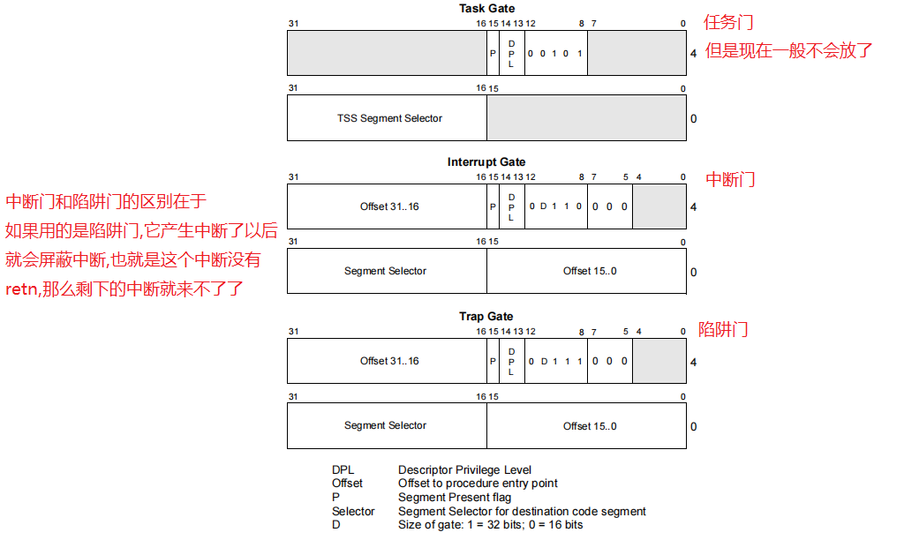

   Offset低16位+Offset高16位用于描述一个偏移
   Segment Selector 描述一个段选择子 一般描述的都是CS
   流程就是从Segment Selector拿出一个段选择子,然后从GDT表里查出段基址,然后加上offet的偏移当作一个函数地址.
    剩下的基本和GDT表中字段意义相同.
    中断表描述的函数地址CPU将全部以0环权限去运行


    随便在IDT表找一个来进行格式拆分,先遍历所有IDT表:!idt -a 
    然后随便找一项,比如找2a这个
    用idtr寄存器里的地址+2a*8; 比如idtr寄存器里值是807d4020,那么就是 dq 807d4020 + 2a *8  然后就拿到了它的描述符信息 83e8 ee00 0008 863a   再开始解析它的格式:
    offset就是先拿低16位,然后再拼上高16位,就是它的偏移83e8863a;这个其实就是函数地址.和它在idt表里2a  项的函数地址一样.
    cs = 0008 
    命令 dg 8 可以看 段基址,段基址肯定是0,是0环的代码段
    代码段段基址+偏移就是这个函数地址,所以它的地址是 0 +  83e8863a
    
    所以现在就只需要解析ee00 ==> 1110 1110 0000 0000
    后八位是保留的,所以不需要解析,只需要解析 1110 1110
    类型是1110 ,说明是中断门(陷阱门是1111)
    s = 0  ;   系统段
    dpl = 11 ; 说明3环可以用指令触发这个中断
    p  = 1 ;   有效

#### 示例: 屏蔽 int 3中断 (3号中断)

```c++
//门描述符
struct GateDes {
    unsigned offset1  : 16;		//偏移 低16位的那个
    unsigned selector : 16;		//代码段选择子(因为直立式函数地址,只能在代码段)
    unsigned res      : 8; 		//保留
    unsigned type     : 4; 		//类型
    unsigned s        : 1; 		//描述符类型(0为系统段,1为存储段)这位必然是0,因为他都是门,属于系统段
    unsigned dpl      : 2; 		//描述符特权级 通常这里都是0;只有int 3 是 3
    unsigned p        : 1; 		//存在位 0不存在 1 存在
    unsigned offset2  : 16;		//偏移 高十六位偏移
};


#pragma pack(1)
struct IDTR {
    unsigned short limit;
    unsigned int base;
};


//自己的中断处理函数
__declspec(naked) void Int3Gete() {
    /*
        可以抹掉之前的,但是有两种选择
        1.可以在自己的函数内调用一下之前的处理函数保证功能不变
        2.不调原来的,直接返回
            返回的话必须内联汇编 iretd,但是要考虑栈的问题,因为之前调它的时候可能有一堆push,
            所以这个函数只能用裸函数来写,编译完还得反汇编看看是不是自己要的代码效果
    */

    DbgPrint("Int3Gete");

    __asm {     //直接返回,就相当于系统不处理异常中断
        iretd
    }
}

//保存旧的门
GateDes g_OldGame;

void HookIDT() {
    //掩码
    KAFFINITY  mask = KeQueryActiveProcessors();
    DbgPrint("mask:%x\n", mask);

    KAFFINITY shift = 1;   //掩码.用于指定程序运行的cpu
    IDTR idt = { 0 };
    while (mask) {    //遍历 cpu,hook所有cpu的
        KeSetSystemAffinityThread(shift);    //指定程序运行的cpu
        __asm {
            sidt idt;    //读取idtr寄存器的值
        }
        DbgPrint("base:%p limit:%p\n", (void*)idt.base, (void*)idt.limit);

        //保存旧的IDT项
        GateDes* pGate = (GateDes*)idt.base;
        g_OldGame = pGate[3];

        //修改IDT第三项
        /*
            修改IDT表有好几种改法
            把IDT表里offset的高位和低位换成我们自己的函数地址,这就相当于HOOK了
            而拿出这个地址做修改就是inline hook(inline hook 就是在函数头改jmp)
            就好用性来说肯定是改offet更合适
            所以选择自己做一个描述符,把他原来的描述符替换掉.当然在驱动卸载的时候要恢复回来
        */

        //只需要改它的offset就行了
        pGate->offset1 = (ULONG)Int3Gete & 0xffff;//这里填的是低位 高位清0
        pGate->offset2 = (ULONG)Int3Gete  >> 16 ;//这里填的是高位.右移16位

        shift <<= 1;
        mask >>= 1;
    }
}

//恢复IDT表第3项
void UnHookIDT() {
    //掩码
    KAFFINITY  mask = KeQueryActiveProcessors();
    DbgPrint("mask:%x\n", mask);

    KAFFINITY shift = 1;
    IDTR idt = { 0 };
    while (mask) {
        KeSetSystemAffinityThread(shift);
        __asm {
            sidt idt;
        }
        DbgPrint("base:%p limit:%p\n", (void*)idt.base, (void*)idt.limit);
        //恢复第3项
        GateDes* pGate = (GateDes*)idt.base;
        pGate[3] = g_OldGame;
        shift <<= 1;
        mask >>= 1;
    }
}
```

-   屏蔽int  3 断点以后,用调试器调试程序,被调试的程序会直接运行,而且调试器没办法看到反汇编代码,因为程序系统断点断下来才能开始反汇编,现在来不了
-   要想断下来只能下硬件断点


#### `Hook`键盘硬件 

-   -   先找到键盘的中断号.键盘的中断号是93,然后流程和之前的还是一样的.只是要保存一下旧的处理函数,在自己的函数里调用一下,要不然键盘就失效了
    -   不同的版本中断号可能不一样
    -   同时还要注意卸载问题

-   卸载的时候可能会出问题,就是点击驱动卸载的时候,可能函数还没有执行完,也就是点击卸载了,模块从内核中就去掉了,但是函数还没执行完毕,当函数要返回的时候就会崩溃,找不到代码了.
        现在问题就是如何知道处理函数已经调用完毕了
        可以通过引用计数来完成,也就是进入函数之后引用计数就+1.但是要注意多线程同步问题,要加同步锁
        然后函数返回之前引用计数--
        在卸载的时候要等键盘的处理函数执行完毕再卸载.

-   -   -   为了避免栈不平衡的问题,`HOOK`的函数可以选择是用纯汇编写

    -   ```c++
        //门描述符
        struct GateDes {
            unsigned offset1  : 16;		//偏移 低16位的那个
            unsigned selector : 16;		//代码段选择子(因为直立式函数地址,只能在代码段)
            unsigned res      : 8; 		//保留
            unsigned type     : 4; 		//类型
            unsigned s        : 1; 		//描述符类型(0为系统段,1为存储段)这位必然是0,因为他都是门,属于系统段
            unsigned dpl      : 2; 		//描述符特权级 通常这里都是0;只有int 3 是 3
            unsigned p        : 1; 		//存在位 0不存在 1 存在
            unsigned offset2  : 16;		//偏移 高十六位偏移
        };
        
        
        #pragma pack(1)
        struct IDTR {
          unsigned short limit;
          unsigned int base;
        };
        
        
        void (*g_OldKeyboardProc)() = NULL;  //旧的处理键盘中断函数地址
        
        GateDes g_OldGate;   //原来的Gate表
        //New {xxxxxx ret}
        //Old
        
        
        int g_RefCount = 0;  //引用计数
        
        const char* psz = "KeyboardProc\n";
        
        __declspec(naked) void KeyboardProc() {
        
        /*
        __sam{
          lock inc dword ptr[g_RefCount]
          cli
          pushad
          pushf
          push  psz ;
          call DbgPrint;   //调函数会改寄存器环境所以需要保存
          add  esp, 4;
          popf
          popad
          sti
          iretd;
          lock dec dword ptr[g_RefCount]
        }
        */
        
          __asm {
          /*  int 3
            pushad
            pushf
            push psz
            call DbgPrint   //调函数改了寄存器环境
            add  esp, 4
            popf
            popad
            iretd*/
            in al, 60h  //扫描码
        
          }
        }
        
        
        
        void HookIDT() {
          KAFFINITY  mask = KeQueryActiveProcessors();
          DbgPrint("mask:%x\n", mask);
        
          KAFFINITY   shift = 1;
          IDTR idt = { 0 };
          while (mask) {
            KeSetSystemAffinityThread(shift);
            __asm {
              sidt idt;
            }
            DbgPrint("base:%p limit:%p\n", (void*)idt.base, (void*)idt.limit);
        
            //修改IDT
            GateDes *pGate = (GateDes*)idt.base;
            g_OldGate = pGate[0x93];  
            //保存原来的函数地址
            g_OldKeyboardProc = (void (*)())(g_OldGate.offset1 | (g_OldGate.offset2 << 16));
        
            pGate[0x93].offset1 = (ULONG)KeyboardProc & 0xffff;
            pGate[0x93].offset2 = (ULONG)KeyboardProc >> 16;
        
            shift <<= 1;
            mask >>= 1;
          }
        }
        
        void UnHookIDT() {
          KAFFINITY  mask = KeQueryActiveProcessors();
          DbgPrint("mask:%x\n", mask);
        
          KAFFINITY   shift = 1;
          IDTR idt = { 0 };
          while (mask) {
            KeSetSystemAffinityThread(shift);
            __asm {
              sidt idt;
            }
            DbgPrint("base:%p limit:%p\n", (void*)idt.base, (void*)idt.limit);
        
            //修改IDT
            GateDes* pGate = (GateDes*)idt.base;
            pGate[0x93] = g_OldGate;
        
            shift <<= 1;
            mask >>= 1;
          }
        }
        ```

    -   

-   -   ## 线程切换

    -   

    -   -    线程并不是`CPU`的概念,它是操作系统的概念.进程线程在CPU里统称为任务`Task` 

    -   -   -   对于`CPU`来说就是有一个任务,要把它切来切去,按`Windows`来说就是切换线程了

    -   -    切换任务有几个问题需要处理 

    -   由A任务切换到B任务
        1.保存A任务的寄存器环境(3环的全部要保存,0环需要保存CR3(页目录)寄存器,但是0环还有一个CR2寄存器)
          CR2就是产生页访问异常的时候,它会把这个页地址放到CR2寄存器里
        2.修改当前寄存器为B任务的

    -   正常情况下操作系统是可以自己完成保存环境和修改寄存器环境的,可以使用pushad..
        但是一个pushad是搞不定的,除了3环的0环还有寄存器需要切换.
        而且还有ESP.因为有4环权限,所以每个权限都得有一个单独的栈.ESP0,ESP1,ESP2,ESP
        同时SS堆栈段也要切换.不能用3环的SS去给其他环的权限用.

    -   切换线程可以跟硬件没关系,自己做就行了,但是速度可能没有CPU切的快.
        所以英特尔CPU提供了一套硬件的机制.让操作系统秒切换线程.
        就是执行一条指令,环境就保存好了,同时也切换了.

    -   -    快速切换环境(任务管理机制) 

    -   不用一个一个push了,由CPU自动帮你把寄存器都放到内存里.
        CPU提供了一个任务结构体.也提供了一个任务寄存器tr;任务寄存器指向了一个任务状态段(简称TSS).
        任务状态段就是寄存器结构体,指向了一个结构体.这个结构体里面保存了这些信息.

    -   -    任务状态段(寄存器结构体) 

    -   整个结构体104个字节.
        其中保存了以下信息:
        I/O MapBaseAddress记录对硬件IO端口的读写权限
        LDT Segment Selector;这里保存的只是段选择子
        段寄存器
        通用寄存器
        CR3
        SS0 ESP0
        SS1 ESP1
        SS2 ESP2

    -   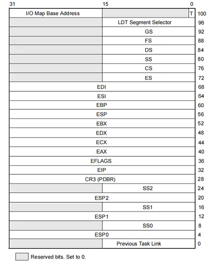

    -   

    -   ○TR寄存器指向这个结构体,所以TR寄存器就是段选择子

    -   ● TSS描述符(它是放在GDT表里的) 

    -   也就是先获取TR,得到一个数值
        拿这个数值去查GDT表,就可以得到描述符信息,而这个描述符信息里就有Base,这个Base指向的就是结构体.

    -   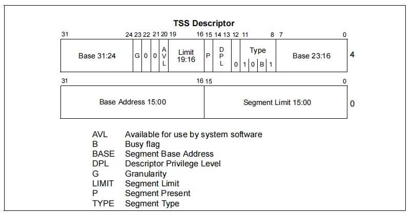

    -   其实微软并没有用TR这套机制,GDTR和分段微软也不想用,但是又不得不用.
        线程切换它并没有用CPU这一套,但是它又不得不给,因为SS和ESP...
        如果创建了一个线程是在3环跑代码,但是调用了API它又在0环跑代码,那么它的权限就会切来切去,同时栈也要跟着
        切来切去.所以CPU产生栈切换的时候它固定会从TSS里拿几环的SS和ESP..
        如果不给任务结构体的话,那权限切换就有问题.所以必须要提供..
        但是微软它做一个就够了,反正不用这套机制切换线程,所以就给个TR选择子,给个TTS结构体,让CPU能查到就行.

    -   -    切换任务 

    -   ltr读取;str修改这两条任务是修改寄存器的,但是环境并没有切换
        所以通过修改寄存器并不能切换线程.
        TSS描述符解析的话和段描述符是一样的,只是有点区别
        	1.类型的区别
        	2.S位必须为0,就是必须要是系统描述符

    -   

    -   切换线程用的是任务门的概念 

    -   任务门就类似于传送的概念.
        假设线程切换了,通过这个门就可以到另外一个任务了.
        但是门就是一个函数指针.切换线程了就要给线程的回调函数地址,所以门一般描述一个函数地址.至于为什么叫门是
        因为还要描述权限问题.
        门也是一个描述符.任务门放在GDT,LDT,IDT.也就是有3个表可以放,放那个都是可以的.
        假设任务门放在GDT表里,那么就要做一个描述符,做完以后填到GDT表里

    -   -   -   任务门描述符

    -   -   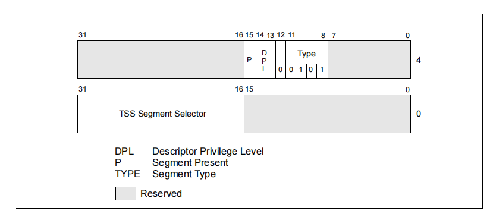

    -   要在GDT里做一个TSS的结构体,然后还要做一个任务门描述符
        其中灰色是不用的,所以这里只描述了一个TSS的段选择子.

    -   假设在GDT表里,TSS已经做了,然后再GDT表里还得做一个任务门.
        假设TS做在表里50的位置,那就是说还要做一个选择子,里面写上50

    -   -    切换的话用`jmp`或者`call`指令(放在`GDT`里用这俩,放在`IDT`里只能用int来切换) 

    -   在GDT表里先给了描述符
        0050 83f3d000 00000068 TSS32 Avl  0 Nb By P  Nl 00000089

    -   然后还有一个任务状态段
        0058  50  Task Gate ;类型是任务门.

    -   切换的话就jmp 00058:0;这样就切换了.

    -   假设当前的TR是0028 801e4000 000020ab TSS32 Busy 0 Nb By P  Nl 0000008b
        CPU会把当前的寄存器存到28这个地址来
        然后从任务门里获取任务状态段选择子50;得到描述符,然后从描述符里所写的83f3d000这个地址读取寄存器然后
        修改当前的.
        或者也可以 call far ptr 0058:0 ;返回的话就是 retf
        如果做在中断表的话就是 int 28 返回的话就是iret
        用jmp的话可能就回不来了...

    -   -    但是操作系统还是没有选择用`TSS`这种方式,因为可能表项不够用..它是放在`GDT`表里的,而且放一个描述符还要再放一个任务状态段.所以表项可能不够用 

    -   不用的话操作系统切换的话就是自己做一个表项,自己切换自己保存.但是自己切换也不能放弃TSS,因为TSS里面还有
        ESP
        因为ESP表示权限,它要在切换的一瞬间把权限也切换过去.所以操作系统压根做不到.

    -   它自己创建了一个结构体,在ETHREAD里,叫KTRAP_FRAME,在这个结构体里保存了寄存器信息.之前的特权级信息.
        以及错误码等等信息...新增了不少
        可以查看KiSwapThread函数,这个函数就是完整的切换线程函数.

    -   ## 中断和异常

    -   

    -   -    中断的概念 

    -   了解中断概念之前首先要了解轮询的概念
        轮询:比如说有个硬件,要知道它有没有按就要一直询问,询问它有没有被操作.问完一个问下一个这样.
        但是轮询的设计是很麻烦的,而且效率很低.我们希望的是有操作通知就行了.这样就很方便
        而中断就是在通知的过程中如果正在操作的话就要打断它.
        比如正在走代码,突然键盘被按下了.这时候就要打断代码的执行,处理键盘操作.
        其实是用cli指令,就能屏蔽掉这个键盘中断.

    -   

    -   在`intel`上中断分为两种 

    -   可屏蔽中断和不可屏蔽中断.
        cli能屏蔽的中断就是可屏蔽中断.
        不可屏蔽中断就是这个中断屏蔽也没用.

    -   CPU在引脚上会设计两个引脚
        一个接的就是可屏蔽中断,比如键盘鼠标之类的
        另一个接的就是不可屏蔽中断.一般这个引脚叫NMI,比如电源,内存条等.

    -   有了中断就不用在询问硬件了,如果键盘按了它就会给CPU发一个中断信号.
        CPU其实并不知道按了键盘之后要做什么.CPU可能都不知道这个硬件是键盘...
        对于CPU来说就是有个硬件发了个信号,从主板上的那个端口发的;它只知道这些
        这个信号要如何处理CPU是不知道的,但是操作系统知道如何处理它.但是操作系统收不到信号
        所以操作系统就要向CPU提供什么信号该做什么,也就是提供一张表给CPU.里面写上一堆函数指针.
        然后CPU产生几号信号(也成为几号中断)就调用表里的哪一项,它把中断号当作数组下标来查表.
        而且操作系统不能不提供这个表.这张表就叫做中断表

    -   中断请求叫做IRQ
        中断处理例程叫ISR

    -   中断表(也叫做中断描述符表),缩写叫`IDT` 

    -   CPU规定了0~19号下标的作用.也就是说0~19号就不能处理硬件了.
        硬件中断查中断描述符表没有问题,但是会有一个问题就是比如果CPU做除法的时候碰到一个除0异常,这时候就要通
        知系统,所以intel的设计里把指令的异常也用中断描述符表描述了.这就可以认为软件执行指令产生一个异常跟键
        盘按一个按键的处理流程没有任何区别.但是这就很难区分了.
        所以为了一起描述,这个表就叫做中断和异常表.
        也就是由硬件产生的要描述为中断;由软件产生的描述为异常
        在这个表里前几项就规定了异常处理.其中第1项就是除0异常.第2项是不可屏蔽中断,第14项是缺页异常
        从20项~31项是CPU保留的
        从32项到255项是用户自定义
        所以这个表的大小就是255,最多256个中断

    -   早期的操作系统上硬件的端口号都是固定的. 

    -   但是把硬件端口号固定了并不好,因为不断会有新硬件产生,而CPU也要支持新硬件,所以现在的CPU上都加了APIC芯
        片就是把硬件绑定到那个端口上都可以,而且它还可以处理多核(多核就是中断信号来了交给那一核都可以处理)

    -   APIC就是可编程,可以通过特殊的汇编指令来告诉芯片,那个硬件绑在那个端口,所以在现在的操作系统里那个硬件绑
        在那个端口上是不固定的(绑在那个端口意思就是几号中断)

    -   可以通过符号来判定那个硬件绑在几号中断
        !idt -a ;解析整个IDT表
        就有符号名称,符号名称就能说明这号中断是做啥用的

    -   中断表格式
        

    -   Offset低16位+Offset高16位用于描述一个偏移
        Segment Selector 描述一个段选择子 一般描述的都是CS
        流程就是从Segment Selector拿出一个段选择子,然后从GDT表里查出段基址,然后加上offet的偏移当作一个函
        数地址.
        剩下的基本和GDT表中字段意义相同.

    -   
        随便在IDT表找一个来进行格式拆分,先遍历所有IDT表:!idt -a 
        然后随便找一项,比如找2a这个
        用idtr寄存器里的地址+2a*8; 比如idtr寄存器里只是807d4020,那么就是 dq 807d4020 + 2a *8
        然后就拿到了它的描述符信息83e8 ee00 0008 863a
        再开始解析它的格式:
        offset就是先拿低16位,然后再拼上高16位,就是它的偏移83e8863a;这个其实就是函数地址.和它在idt表里2a
        项的函数地址一样.
        cs = 0008 
        代码段段基址+偏移就是这个函数地址,所以它的代码段基址肯定是0..

    -   所以现在就只需要解析ee00 ==> 1110 1110 0000 0000
        后八位是保留的,所以不需要解析,只需要解析 1110 1110
        类型是1110 ,说明是中断门(陷阱门是1111)
        s = 0 ;系统段
        dpl = 11 ; 说明3环可以用指令触发这个中断
        p  = 1 ;有效

    -   修改中断表里`int3`的项,让断点失效 

    -   ```
        //门描述符
        struct GateDes {
            unsigned offset1  : 16;//偏移 低16位的那个
            unsigned selector : 16;//代码段选择子
            unsigned res      : 8; //保留
            unsigned type     : 4; //类型
            unsigned s        : 1; //描述符类型(0为代码段,1为数据段)这位必然是0
            unsigned dpl      : 2; //描述符特权级 通常这里都是0;只有int 3 是 3
            unsigned p        : 1; //存在位 0不存在 1 存在
            unsigned offset2  : 16;//偏移 高十六位偏移
        };
        
        
        #pragma pack(1)
        struct IDTR {
            unsigned short limit;
            unsigned int base;
        };
        
        
        //自己的中断处理函数
        __declspec(naked) void Int3Gete() {
            /*
                可以抹掉之前的,但是有两种选择
                1.可以在自己的函数内调用一下之前的处理函数保证功能不变
                2.不调原来的,直接返回
                    返回的话必须内联汇编 iretd,但是要考虑栈的问题,因为之前调它的时候可能有一堆push,
                    所以这个函数只能用裸函数来写,编译完还得反汇编看看是不是自己要的代码效果
            */
        
            DbgPrint("Int3Gete");
        
            __asm {
                iretd
            }
        }
        
        //旧的门
        GateDes g_OldGame;
        void HookIDT() {
            //掩码
            KAFFINITY  mask = KeQueryActiveProcessors();
            DbgPrint("mask:%x\n", mask);
        
            KAFFINITY shift = 1;
            IDTR idt = { 0 };
            while (mask) {
                KeSetSystemAffinityThread(shift);
                __asm {
                    sidt idt;
                }
                DbgPrint("base:%p limit:%p\n", (void*)idt.base, (void*)idt.limit);
        
                //保存旧的IDT项
                GateDes* pGate = (GateDes*)idt.base;
                g_OldGame = pGate[3];
        
                //修改IDT第三项
                /*
                    修改IDT表有好几种改法
                    把IDT表里offset的高位和低位换成我们自己的函数地址,这就相当于HOOK了
                    而拿出这个地址做修改就是inline hook(inline hook 就是在函数头改jmp)
                    就好用性来说肯定是改offet更合适
                    所以选择自己做一个描述符,把他原来的描述符替换掉.当然在驱动卸载的时候要恢复回来
                */
        
                //只需要改它的offset就行了
                pGate->offset1 = (ULONG)Int3Gete & 0xffff;//这里填的是低位 高位清0
                pGate->offset2 = (ULONG)Int3Gete  >> 16 ;//这里填的是高位.右移16位
        
                shift <<= 1;
                mask >>= 1;
            }
        }
        
        //恢复IDT表第3项
        void UnHookIDT() {
            //掩码
            KAFFINITY  mask = KeQueryActiveProcessors();
            DbgPrint("mask:%x\n", mask);
        
            KAFFINITY shift = 1;
            IDTR idt = { 0 };
            while (mask) {
                KeSetSystemAffinityThread(shift);
                __asm {
                    sidt idt;
                }
                DbgPrint("base:%p limit:%p\n", (void*)idt.base, (void*)idt.limit);
                //恢复第3项
                GateDes* pGate = (GateDes*)idt.base;
                pGate[3] = g_OldGame;
                shift <<= 1;
                mask >>= 1;
            }
        }
        ```

    -   