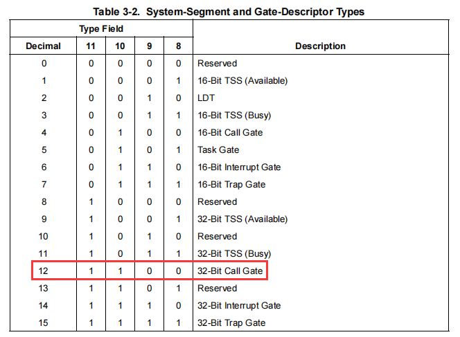
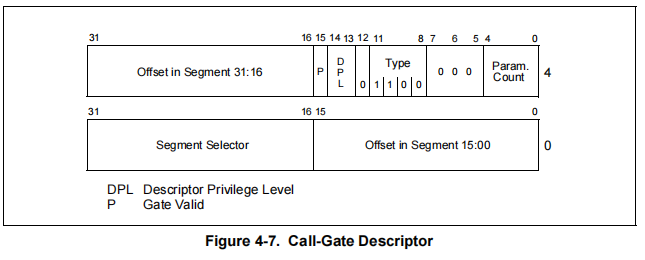
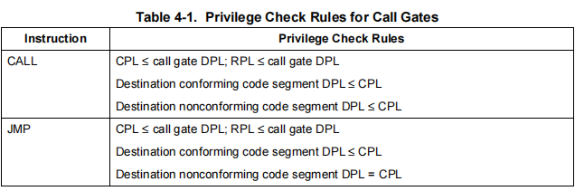
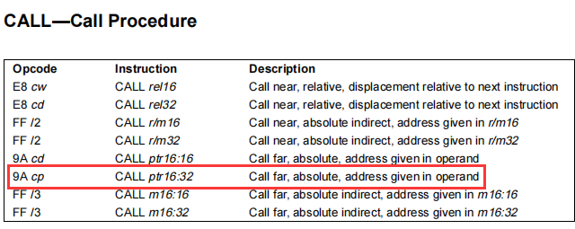
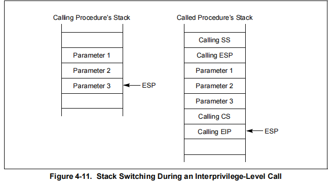

## 课前笔记

-   内核栈的大小已经固定,所以不允许申请定义大空间的变量
-   局部变量的的总大小不能超过 0x4096
-   全局变量可以不限大小,它不用栈空间


## 系统调用(system call)   sys call

-   系统调用就是调用系统的功能,但是对于开发者来说系统调用就是调API,但是从操作系统角度来说系统调用不是API,API不一定要进系统权限,但是对于3环开发者来说,他不需要关心,所有函数有都是API,他们也不需要去了解要不要进内核
-   所有我们说的这个系统调用就是必须要有0环权限才能做到
-   3环调用需要进0换的API有: VirtualAlloc (需要改页表)    CreateFile (操作磁盘[硬件]) ..... 等
-   正常流程:   用户层 => 系统调用 => 切换权限到ring0 => 执行系统调用  => 切换权限ring3
-    这里就涉及到权限切换  ring3  =>  切换 => ring0    权限的切换有CPU 负责 ,因为代码是由 CPU 执行的,CPU会提一些方案给操作系统

### 切换权限的方法

1.  中断  : 只要产生中断CPU自动进入0环权限
2.  异常  : 只要产生异常CPU自动进入0环权限 (自陷: 故意产生一条指令的异常,通常是 int 3 ) 
3.  门   :只要用了门就自动进入0环

1.  1.   调用门（GDT）  不是中断,所以不管 IF 标志位,没有屏蔽信号一说
    2.  中断门（IDT）EFLAG(IF = 0)(CLI)  : IF = 0 是 cli这条指令造成的,1表示不屏蔽中断  0表示屏蔽中断,cli 就是改这个标志位,但是只有0环可以改,3环改不了
    3.  陷阱门（IDT）:用的比较少,因为用中断门比用陷阱门好,因为中断门解决了重复中断(一个中断没处理完又来一个)的问题

-   们到底要提供什么呢: 我们进入0环,首先对CPU来说就是API的地址在哪,所以中断门也好,调用门也好,都是提供一个函数调用的地址

### 调用门实现自己的API

-   做系统调用不需要跟用户通信,只要在软件启动的时候安装这个系统调用
-   因为要实现系统调用,那么函数的实现代码一定会让他在分页内存中,因为API如果没人用放到磁盘上,马上会被换回来,API时时有人调


#### 门描述符



-   描述门格式



-   -   跟GDT相比 保留的 8位(0~7)中  5位(0~4)用于放参数数量,3位保留

-   做门就是做一个描述符,然后早GDT中找一个为空的把他填进去就可以了

#### 注册和卸载调用门

-   驱动安装的是调用注册调门函数,卸载时调用卸载注册门函数
-   在GDT中找空的可以通过  r   gdate  查看gdtr的值 然后dq gtdr的值查看,找到为空的一项(第0项不能用)
-   多核CPU每一核都得注册和卸载

```c++

//12 1 1 0 0 32-Bit Call Gate
//门描述符
struct GateDes {
  unsigned offset1 : 16;     //偏移低16位
  unsigned selector : 16;    //代码段选择子
  unsigned param : 5;        //参数数量
  unsigned res:3;            //保留
  unsigned type : 4;         //类型
  unsigned s : 1;            //描述符类型 (0 = 系统段; 1 = 存储段)
  unsigned dpl : 2;          //描述符特权级 ring0~ring3  
  unsigned p : 1;            //存在位   0 段不在    1 存在
  unsigned offset2 : 16;     //偏移高16位
};

#pragma pack(1)
struct DTR {
  unsigned short limit;
  unsigned int base;
};


//要调用的函数
void  syscall() {
  DbgPrint("[51asm] syscall\n");
}


//注册调用门
void RegisterGate() {
  struct GateDes gate;
  gate.offset1 = (unsigned)&syscall & 0xffff;    //函数地址的低16位
  gate.offset2 = (unsigned)&syscall >> 16;       //函数地址的高16位(无符号改为自动补0)
  gate.selector = 8;                                  //函数地址在0环的CS段
  gate.param = 0;                                     //参数数量
  gate.res = 0;                                       //保留
  gate.s = 0;                                         //系统段
  gate.type = 12;                                     //类型:12调用门
  gate.dpl = 3;                                       //0和3环都可以用                                     
  gate.p = 1;                                         //有效

  KAFFINITY  mask = KeQueryActiveProcessors();
  DbgPrint("mask:%x\n", mask);

  KAFFINITY   shift = 1;
  struct DTR gdt = { 0 };
  //多核的话每一核都得去改
  while (mask) {
    KeSetSystemAffinityThread(shift);
    __asm {
      sgdt gdt;    //获取寄存器GDTR 的值
    }
    DbgPrint("base:%p limit:%p\n", (void*)gdt.base, (void*)gdt.limit);

    //修改GDT
    struct GateDes* pGate = (struct GateDes*)gdt.base;
    pGate[9] = gate; //放在GDT表的第9项  3环的话选择子是0x4b,0环是48

    shift <<= 1;
    mask >>= 1;
  }
}


//卸载调用门
void UnRegisterGate() {
  KAFFINITY  mask = KeQueryActiveProcessors();
  DbgPrint("mask:%x\n", mask);

  KAFFINITY   shift = 1;
  struct DTR gdt = { 0 };
  //每一核都得卸载
  while (mask) {
    KeSetSystemAffinityThread(shift);
    __asm {
      sgdt gdt;
    }
    DbgPrint("base:%p limit:%p\n", (void*)gdt.base, (void*)gdt.limit);

    //修改GDT
    struct GateDes* pGate = (struct GateDes*)gdt.base;
    struct GateDes gate = {0};  //改回0
    pGate[9] = gate;   //3环的话选择子是0x4b,0环是48

    shift <<= 1;
    mask >>= 1;
  }
}

```

#### 3环使用调用门



-   因为JMP回不来,所以我们一般用CALL,把返回值压入栈里面,这样我们肺癌能 ret 回来
-   调用门只能用汇编来写

```c++
#include <stdio.h>
#include <stdlib.h>
int main()
{
  __asm {   
    call far 0x4b:0; //调用调用门,端的偏移不用写,在描述符里面有,所以这里随便写也没事 
  }
  return 0;
}
```

-   此时编译会提示没有     call 0x4b:0 这条指令,但是我们查CPU手册可以看到这条指令是存在



-   既然确定这条指令存在 我们可以直接用  call far  0x4b:0  的二进制字符   9a 00 00 00 00 4b 00 

```c++
#include <stdio.h>
#include <stdlib.h>
int main()
{
   __asm {
    
    _emit 9ah
    _emit 00h
    _emit 00h
    _emit 00h
    _emit 00h
    _emit 4bh
    _emit 00h
  }

  printf("call syscall ok\n");
  system("pause"); 
  return 0;
}
```

-   那怎么从0环回去3环呢, 我们权限已经切到0环,那么很多寄存器环境需要切,栈还得切,要把3环的栈换成0环的,栈要切换会涉及到2个寄存器 SS 和  ESP



-   微软会把3环的寄存器都保存到0环的栈里面,他会把参数拷贝到0换的栈里面
-   0环的SS 和ESP是从 TSS中来的,0环的CS 和EIP 是保存在了 门描述符里面
-   回去就是把  SS  ESP   CS  EIP 四个寄存器还原,不能用ret,因为对于CPU来是 ret 并不会切换特权等级,并且栈顶的返回值放到EIP, 所以要用 retf 返回,他会在切成3环执行代码之前,他会把栈里的四个寄存器还原
-   说明我们驱动里面的函数只能用裸函数去写,因为得控制寄存器环境,所以系统调用函数不可能用C来写

```c++
__declspec(naked) void  syscall() {
  __asm{
      //int 3;
  }  
    
  DbgPrint("[51asm] syscall\n");
    
  __asm{
      retf;
  }  
}
```

-   在0环和3环代码都下一个断点,这个我们可以从3环调到0环
-   3环没有能力改门的下标,但是还是存在缺陷
-   我们安装好驱动之后,运行3环代码.发现没有暂停,.调试发现在调 printf 时候 崩了,调试可以发现 fs 寄存器发生了改变 ,在操作系统里面 fs 有作用,但cpu 不负责切着个寄存器,所以得我们自己切,但是前面我们没做(WinDbg在调试的时候发现fs不对会改掉),所以一旦用到TEB,就会崩
-   所以函数的代码要改

```c++
__declspec(naked) void  syscall() {
  __asm{
      //int 3;
      push fs;
      mov ax,30h;
      mov fs,ax;
  }  
    
  DbgPrint("[51asm] syscall\n");
    
  __asm{
      pop fs;
      retf;
  }  
}
```

-   但是这个函数不能调,因为调的话调试器会把 fs的值改了,push的时候 fs的值就不对,pop之后 回到3环 他又 把 fs值改了,所以3环一旦用到 fs 就崩
-   fs 的保存恢复 都应该由系统调用完成,不应该有3环来完成,因为3环代码可以改,因此有被攻击的危险
-   我们研究函数调用在以后不管是反调试还是shellcode 漏洞方面都有应用
-   如果3环随意写调用用代码,会导致3环崩,0环没事,因此CPU查表没有这一项,,而且不是门因此不会让3环调,所以只能是 0x4b 
-   3环不能控制代码的流程,这就保证了3环只能用,不能控制0环 ,而且权限切换都是CPU完成的,当调用结束,环境恢复,3环就没权限了
-   现在还有大量API调用和传参问题了,0环和3环用的栈是不一样,传参0环自己会拷贝


#### 多API和传参

-   每个API都得提供调用门,因为从3环拷参数到0环需要在门描述符里面描述
-   参数数量是 5位 ,因此一个API最多 可以传 2^5 = 32 个参数,但是不同的APi参数可能是不一样的
-   因为传参,所以我们需要 保存和恢复 ebp

```c++
__declspec(naked) void  syscall() {
  __asm{
      //int 3;
      push fs;
      mov ax,30h;
      mov fs,ax;
  }  
    
  DbgPrint("[51asm] syscall\n");
    
  __asm{
      pop fs;
      retf;
  }  
}
__declspec(naked) void  syscall1(int  p1) {
  __asm{
      //int 3;
      push ebp;
      mov ebp,esp;
      push fs;
      mov ax,30h;
      mov fs,ax;
  }  
    
  DbgPrint("[51asm] syscall1 p1 = %d\n",p1);
    
  __asm{
      
      pop fs;
      mov esp,ebp;
      pop ebp;
      retf;
  }  
}

__declspec(naked) void  syscall2(int p1 ,int p2) {
  __asm{
       //int 3;
      push ebp;
      mov ebp,esp;
      push fs;
      mov ax,30h;
      mov fs,ax;
  }  
    
  DbgPrint("[51asm] syscall2 p1 = %d  p2 = %d\n",p1,p2);
    
  __asm{
      pop fs;
      mov esp,ebp;
      pop ebp;
      retf;
  }  
}
```

-   我们也要为  syscall1 和  syscall2 定义一个门,因为参数不一样,但是如果有1万个API,啊呢么就需要一万个门,但是gdtr表 最多只能放 8192项 ,明显不够用,那该如何解决呢
-   因为参数数量不同会导致我们要做很多门,但是如果三叔我们自己从3环拷贝到0环,这样门就可以固定,参数数量是0,但是数量该怎么解决呢,还有不同的API EIP 不一样.这个我们可以通过参数来解决

```c++
//参数 api序号   参数数量  
__declspec(naked) void SysCallProxy(int ApiNo ,int ParamCount) {
  __asm{
       //int 3;
      push ebp;
      mov ebp,esp;
      push fs;
      mov ax,30h;
      mov fs,ax;
  }  

  //拷贝参数  我们不知道3换的栈在哪,所以可以让3环通过寄存器edx传过来
  //这样我们就可以通过栈拷贝了
  mencpy(esp,edx,ParamCount*4)

  switch(ApiNo){
    case 0:  syscall();
      break;
    case 1:  syscall1();
      break;
    case 2:  syscall2();
      break;
  }
  DbgPrint("[51asm] SysCallProxy\n");
    
  __asm{
      pop fs;
      mov esp,ebp;
      pop ebp;
      retf;
  }  
}


 void  syscall() {
  DbgPrint("[51asm] syscall\n");
}
void  syscall1(int  p1) {  
  DbgPrint("[51asm] syscall1 p1 = %d\n",p1);
}

void  syscall2(int p1 ,int p2) {     
  DbgPrint("[51asm] syscall2 p1 = %d  p2 = %d\n",p1,p2);
}
```

-   通过上面的设计 系统调用代理函数,我们一个门就可以了,而且我们的API 就不必用汇编写了,因为我们可以通过汇编把参数处理好,函数正常ret就可以了,由代理函数 retf,这样就解决了参数转换的问题
-   但是上面那样写 switch 太多,因此 可以通过 表来解决,这样3换调用哪个api额外传一个参数就可以了,因为API调用很频繁,而且把参数入栈我们还需要拷贝,因此我们可以把参数通过寄存器传递,而且 ParamCount 也不需要用了,因为API几个字节3环知道,0环也知道,因为API是他提供的

##### 多API

-   下面先不考参数数情况,只考虑多函数

```c++
-----------3环----------------
#include <stdio.h>
#include <stdlib.h>
int main()
{
   __asm {
    mov eax,0;  //调用第0个api,想调第几个给对应的下标就可以了 
    _emit 9ah
    _emit 00h
    _emit 00h
    _emit 00h
    _emit 00h
    _emit 4bh
    _emit 00h
  }

  printf("call syscall ok\n");
  system("pause"); 
  return 0;
}

-----------0环----------------

typedef void (*SYSCALL)();  //定义函数指针
SYSCALL g_SysCallTable[] = {&syscall1,(SYSCALL)&syscall2, (SYSCALL)&syscall3 };  //系统服务表


__declspec(naked) void SysCallProxy(int ApiNo ,int ParamCount) {
  __asm{
       //int 3;

      push fs;
	  push ebx;
      mov bx,30h;
      mov fs,bx;

      //判断调用函数下标是否存在   length g_SysCallTable 求数组的项数
      cmp eax, length g_SysCallTable
      jae EXIT

      call dword ptr [g_SysCallTable + eax * 4]  //调用对应函数,如果函数是C调用约定,我们的帮他平栈,否则栈会不平衡,而我们也没办法帮他平,不知道要平多少,所以API要设计成 stdcall调用约定,

EXIT:
      pop ebx;
      pop fs;
      retf;
  }  
}

//因为没用到参数,所以不用考虑ebp的情况
```

-   这样加函数的话 级表就行了,代理函数不用改,这样维护性提升了一个档次,并且实现函数只需要正常写,门只需要一个

##### 传参

```c++
-----------3环----------------
#include <stdio.h>
#include <stdlib.h>
int main()
{
   __asm {
    mov eax,0;    //调用第0个api,想调第几个给对应的下标就可以了 
    mov edx,esp;  //把当前栈地址通过edx传给0环
    _emit 9ah
    _emit 00h
    _emit 00h
    _emit 00h
    _emit 00h
    _emit 4bh
    _emit 00h


    mov eax,1;    //调用第1个api,想调第几个给对应的下标就可以了 
    push 1;       //传参
    mov edx,esp;  //把当前栈地址通过edx传给0环
    _emit 9ah
    _emit 00h
    _emit 00h
    _emit 00h
    _emit 00h
    _emit 4bh
    _emit 00h 
    add esp 4 //平栈

    mov eax,1;    //调用第1个api,想调第几个给对应的下标就可以了 
    push 2;       //传参 第二个
    push 1;       //传参 第一个
    mov edx,esp;  //把当前栈地址通过edx传给0环
    _emit 9ah
    _emit 00h
    _emit 00h
    _emit 00h
    _emit 00h
    _emit 4bh
    _emit 00h 
    add esp 8 //平栈
  }

  printf("call syscall ok\n");
  system("pause"); 
  return 0;
}

-----------0环----------------

void __stdcall syscall1() {
  DbgPrint("[51asm] syscall1\n");
}

void __stdcall syscall2(int p1) {
  DbgPrint("[51asm] syscall2  p1:%d\n", p1);
}

void __stdcall syscall3(int p1, int p2) {
  DbgPrint("[51asm] syscall3 p1:%d p2:%d\n", p1, p2);
}


//系统服务表
typedef void (*SYSCALL)();
SYSCALL g_SysCallTable[] = {&syscall1,(SYSCALL)&syscall2, (SYSCALL)&syscall3 };

//函数参数大小表
unsigned char  g_SysCallParam[] = { 0, 4,  8 };

__declspec(naked) void SysCallProxy() {
  __asm {
    //int 3
    push ebp
    mov  ebp, esp
    //保存环境 
    push fs
    push ebx
    push ecx
    push esi
    push edi

    mov bx, 30h
    mov fs, bx

    cmp eax, length g_SysCallTable
    jae EXIT

    //从用户栈拷贝参数到内核栈
    movzx ecx, byte ptr g_SysCallParam[eax]  //获取参数总大小
    sub esp, ecx     //抬栈
    mov esi, edx
    mov edi, esp
    rep movsb 
    //调用函数
    call dword ptr [g_SysCallTable + eax * 4]

EXIT:
    //恢复环境 
    pop edi
    pop esi
    pop ecx
    pop ebx
    pop fs
    mov esp, ebp   //平栈
    pop ebp
    retf
  }
}
```

-   这样将来要加API加表就可以了，代表不用动

##### 优化

-   0环的代码我们已经优化好了，但是3换的代码使用太麻烦了，需要进行优化
-   这就是ntdll.dll 的功能，kernel32.dll的功能是检查参数
-   优化就是对重复代码进行封装，必须用裸函数

```c++
#include <stdio.h>
#include <stdlib.h>


__declspec(naked) void __stdcall CallGate() {
  __asm {
    //int 3
     lea edx, [esp + 8]   //多了一个返回值
    _emit 9ah
    _emit 00h
    _emit 00h
    _emit 00h
    _emit 00h
    _emit 4bh
    _emit 00h
    ret
  }
}

void (__stdcall* g_SysCall)() = &CallGate;   //加这个可以防止修改金0环的方式而导致后面大改，这样只需要修改 CallGate() 函数就可以了

//ntdll.dll
__declspec(naked) void __stdcall Syscall1() {
  __asm {
    mov eax, 0  //syscall1
    call g_SysCall
    retn
  }
}
__declspec(naked) void __stdcall Syscall2(int p1) {
  __asm {
    mov eax, 1  //syscall2
    call g_SysCall
    retn 4
  }
}

__declspec(naked) void __stdcall Syscall3(int p1, int p2) {
  __asm {
    mov eax, 2  //syscall3
    call g_SysCall
    retn 8
  }
}


int main()
{
  Syscall1();
  Syscall2(1);
  Syscall3(1, 2);
  printf("call syscall1 ok\n");

  system("pause");


  //内联汇编进内核  
  __asm {
    mov eax, 1  //syscall2
    call g_SysCall
    retn 4
  }

  return 0;
}
```

-   这样3环用的也很舒服，类的就是系统，如果有一万个API，那么代理函数也要写一万个，所以一般操作系统作者会给编译器加一个宏，让他自动生成代理函数，因为有规律
-   0环的两个表不一定要做成2个数组，做成结构体也可以
-   上面代码还有问提，例如参数是个指针，用户故意传一个空指针，这样就会导致蓝屏，因此在函数里需要先验证一下参事是否是有效的
-   如果攻击者知道我们系统调用的实现原理，他有可能不调 ntdll.dll，直接内联汇编进内核，这样调API进内核的出号就是调试器的API断点将失效，并且IDA逆向软件你将会看到导入表是空的，导出表是空的，因为这些系统调用可以直接内联汇编来调，直接进内核，不需要经过系统，反汇编代码如下：
-   
-   我们看到的汇编代码只有上面的3行，这就是加密
-   这种加密方式只有我们了解windwos 的系统调用怎么实现的才能模仿
-   windows 里面没有用调用门，调用门一般内核漏洞 shellcode 经常用，系统不用，攻击者可以用

#### 完整源码

##### 0环  内核驱动

```c++
#include <ntddk.h>

//12 1 1 0 0 32-Bit Call Gate
//门描述符
struct GateDes {
  unsigned offset1 : 16;     //偏移低16位
  unsigned selector : 16;    //代码段选择子
  unsigned param : 5;        //参数数量
  unsigned res:3;            //保留
  unsigned type : 4;         //类型
  unsigned s : 1;            //描述符类型 (0 = 系统段; 1 = 存储段)
  unsigned dpl : 2;          //描述符特权级 ring0~ring3  
  unsigned p : 1;            //存在位   0 段不在    1 存在
  unsigned offset2 : 16;     //偏移高16位
};

#pragma pack(1)
struct DTR {
  unsigned short limit;
  unsigned int base;
};

void __stdcall syscall1() {
  DbgPrint("[51asm] syscall1\n");
}

void __stdcall syscall2(int p1) {
  DbgPrint("[51asm] syscall2  p1:%d\n", p1);
}

void __stdcall syscall3(int p1, int p2) {
  DbgPrint("[51asm] syscall3 p1:%d p2:%d\n", p1, p2);
}


//系统服务表
typedef void (*SYSCALL)();
SYSCALL g_SysCallTable[] = {&syscall1,(SYSCALL)&syscall2, (SYSCALL)&syscall3 };

//函数参数大小表
unsigned char  g_SysCallParam[] = { 0, 4,  8 };

__declspec(naked) void SysCallProxy() {
  __asm {
    //int 3
    push ebp
    mov  ebp, esp
    //保存环境 
    push fs
    push ebx
    push ecx
    push esi
    push edi

    mov bx, 30h   //0环 fs的值
    mov fs, bx

    cmp eax, length g_SysCallTable
    jae EXIT

    //从用户栈拷贝参数到内核栈
    movzx ecx, byte ptr g_SysCallParam[eax]  //获取参数总大小
    sub esp, ecx     //抬栈
    mov esi, edx
    mov edi, esp
    rep movsb 
    //调用函数
    call dword ptr [g_SysCallTable + eax * 4]

EXIT:
    //恢复环境 
    pop edi
    pop esi
    pop ecx
    pop ebx
    pop fs
    mov esp, ebp   //平栈
    pop ebp
    retf
  }
}
    
//卸载调用门
void UnRegisterGate() {
  KAFFINITY  mask = KeQueryActiveProcessors();
  DbgPrint("mask:%x\n", mask);

  KAFFINITY   shift = 1;
  struct DTR gdt = { 0 };
  //每一核都得卸载
  while (mask) {
    KeSetSystemAffinityThread(shift);
    __asm {
      sgdt gdt;
    }
    DbgPrint("base:%p limit:%p\n", (void*)gdt.base, (void*)gdt.limit);

    //修改GDT
    struct GateDes* pGate = (struct GateDes*)gdt.base;
    struct GateDes gate = {0};  //改回0
    pGate[9] = gate;   //3环的话选择子是0x4b,0环是48

    shift <<= 1;
    mask >>= 1;
  }
}

//注册调用门
void RegisterGate() {
  struct GateDes gate;
  gate.offset1 = (unsigned)&SysCallProxy & 0xffff;    //函数地址的低16位
  gate.offset2 = (unsigned)&SysCallProxy >> 16;       //函数地址的高16位(无符号改为自动补0)
  gate.selector = 8;                                  //函数地址在0环的CS段
  gate.param = 0;                                     //参数数量
  gate.res = 0;                                       //保留
  gate.s = 0;                                         //系统段
  gate.type = 12;                                     //类型:12调用门
  gate.dpl = 3;                                       //0和3环都可以用               
  gate.p = 1;                                         //有效

  KAFFINITY  mask = KeQueryActiveProcessors();
  DbgPrint("mask:%x\n", mask);

  KAFFINITY   shift = 1;
  struct DTR gdt = { 0 };
  //多核的话每一核都得去改
  while (mask) {
    KeSetSystemAffinityThread(shift);
    __asm {
      sgdt gdt;    //获取寄存器GDTR 的值
    }
    DbgPrint("base:%p limit:%p\n", (void*)gdt.base, (void*)gdt.limit);

    //修改GDT
    struct GateDes* pGate = (struct GateDes*)gdt.base;
    pGate[9] = gate; //放在GDT表的第9项  3环的话选择子是0x4b,0环是48

    shift <<= 1;
    mask >>= 1;
  }
}


/*驱动卸载函数 clean_up*/
VOID Unload(__in struct _DRIVER_OBJECT* DriverObject)
{
  DbgPrint("[51asm] Unload! DriverObject:%p\n", DriverObject);

  UnRegisterGate();
}


/*1.驱动入口函数*/
NTSTATUS DriverEntry(
  __in struct _DRIVER_OBJECT* DriverObject,
  __in PUNICODE_STRING  RegistryPath)
{
  UNREFERENCED_PARAMETER(RegistryPath);

  DbgPrint("[51asm] DriverEntry DriverObject:%p\n", DriverObject);

  DriverObject->DriverUnload = Unload;    //注册卸载函数

  RegisterGate();   //注册调用门

  return STATUS_SUCCESS;
}
```

##### 3环 用户调用

```c++
#include <stdio.h>
#include <stdlib.h>


__declspec(naked) void __stdcall CallGate() {
  __asm {
    //int 3
     lea edx, [esp + 8]   //多了一个返回值
    _emit 9ah
    _emit 00h
    _emit 00h
    _emit 00h
    _emit 00h
    _emit 4bh
    _emit 00h
    ret
  }
}

void (__stdcall* g_SysCall)() = &CallGate;   //加这个可以防止修改金0环的方式而导致后面大改，这样只需要修改 CallGate() 函数就可以了

//ntdll.dll
__declspec(naked) void __stdcall Syscall1() {
  __asm {
    mov eax, 0  //syscall1
    call g_SysCall
    retn
  }
}
__declspec(naked) void __stdcall Syscall2(int p1) {
  __asm {
    mov eax, 1  //syscall2
    call g_SysCall
    retn 4
  }
}

__declspec(naked) void __stdcall Syscall3(int p1, int p2) {
  __asm {
    mov eax, 2  //syscall3
    call g_SysCall
    retn 8
  }
}


int main()
{
  Syscall1();
  Syscall2(1);
  Syscall3(1, 2);
  printf("call syscall1 ok\n");

  system("pause");

/*
  //内联汇编进内核  
  __asm {
    mov eax, 1  //syscall2
    call g_SysCall
    retn 4
  }
*/
    
  return 0;
}
```

系统调用

-   系统调用就是调用系统的功能,英文为`system call` 缩写 `sys call`,对于开发者来说系统调用就是调`API` 

-   -   但是从操作系统的角度来说,系统调用不是`API`,因为`API`并不一定要进内核,所以我们说的系统调用就是调这个`API`必须要用0环权限才能完成,这才叫系统调用

-   -   在3环下比如申请内存,创建文件这些`API`都得进内核

-    提供系统调用功能 

正常情况下是:
用户层发起系统调用 ==> 切换权限到ring0 ==> 执行系统调用 ==> 切换权限到ring3 
中间还有寄存器的环境要改变,大的过程就是这样

这里就涉及到如何权限切换:首先就是ring3如何切换到ring0
权限的切换是由CPU来提供,代码是由CPU执行的,而CPU并不知道有没有权限执行,是操作系统告诉CPU的;所以检测
者就是CPU,切换权限就是CPU来切换的,CPU会提供一些方案来告诉操作系统怎么切换
1.中断:只要产生中断,CPU自动进入0环权限
2.异常:产生异常也会自动进入0环权限
3.自陷:自陷就是故意产生异常,最简单的自陷就是int 3;这就是故意的就是为了切换权限,自陷也算异常
4.门:只要用了门就会自动进入0环权限;中断门(IDT),陷阱门(IDT),调用门(GDT)等
	 陷阱门用的比较少,中断门就是IF = 0 也就是CLI指令那种
	 一般都是调用门或者中断门这两种.
门提供的就是进入0环了,对于CPU来说就要知道去哪里执行代码,也就是API的地址在哪,中断门也好调用门也好提
供的都是系统调用的地址

做系统调用是不需要和3环通讯的,只要在软件启动的时候安装一下,然后最后卸载

-    自做`API` 

这个函数代码一定要是在分页内存中,因为API没人调的话给它交换到磁盘上是不合理的...
编写好提供的API后,就要做一个调用门了
可以在CPU手册里查看门描述符格式,按照格式来完成调用门;
描述符格式其实可以参考GDT表格式.但是它中间的保留位门描述符用了5位,用于参数数量,只保留了3位


```c++
//门描述符
struct GateDes {
    unsigned offset1  : 16; //偏移低16位
    unsigned selector : 16; //代码段选择子
    unsigned param    : 5; //参数数量
    unsigned res      : 3; //保留的3位
    unsigned type     : 4; //类型
    unsigned s        : 1; //描述符类型 (0 = 系统段; 1 = 存储段)
    unsigned dpl      : 2; //描述符特权级 ring0~ring3  
    unsigned p        : 1; //存在位   0 段不在    1 存在
    unsigned offset2  : 16;//偏移高16位
};

门的做法就是:做一项这样的描述符,然后在GDT表里找一项空的填进去
所以就写俩函数,注册门和卸载门
注册门函数里就做一个门,然后把它写到GDT表里就行了
卸载门函数就把对应项再置为0就行了
这样0环的API就写完了,可以开始编写3环的使用程序了

3环首先要检查CPL(当前特权级),RPL(描述符特权级),DPL(段寄存器的DPL)
3环使用的话就是call或者jmp,但是一般使用的都是call,因为jmp过去就回不来了
所以用call,把返回值压入栈里,这样才能return回来;
	-但是CPL要小于等于DPL,这是合理的.注册的时候DPL写的是3环,所以调用者是3环2环1环0环都可以
	-RPL要小于等于DPL也就是段寄存器里面的选择子的权限要小于等于DPL

因为只能用call和jmp,所以3环也只有内联汇编了,但是内联汇编的话 call 0x4b:0这条指令无法编译通过,所
以需要自己手动去写2进制的call指令去调用调用门
```

-   -   切换流程

-   虽然权限已经切换到0环了,但是栈也得切,要把3环的栈切换成0环的栈.切换栈的话就涉及到SS堆栈段和ESP.
    ESP要切换成ESP0.
    为了调用完毕能回到3环,把3环的寄存器都保存到0环的栈里了(SS ESP CS EIP),并且还把3环的参数也拷贝到0
    环栈里了.
    也就是它和3环call函数的时候是不一样的,3环call一个函数就压一个返回地址(EIP)就行了,而调用门则额外多
    压入了3个寄存器.
    至于0环的SS和ESP从TS里来的,0环的CS和EIP就从门描述符里拿,所以它只要从TS里拿一共SS和ESP就可以切换
    了.
    回去的话就把这四个寄存器还原就行了,不能用ret(ret对于CPU来说是特权级不切换,并且是把栈顶的返回写入
    EIP),现在是有四个寄存器都得还原,所以要用retf来返回.
    retf第一步就是把特权级切换成3环,接下来会把栈里的四个寄存器还原了.

-   所以0环所提供的API函数只能用裸函数写了,因为要控制寄存器环境.

-   -    至此门已经设计好了,3环除了调用它就没有别的操作了,但是它还是有缺陷的. 

-   通过调试时观察寄存器发现,当切换到0环的时候 eip,cs,esp,ss这些寄存器都改变了,这是对的,CPU是会切换
    在Windows操作系统里FS是有作用的,但是CPU不负责切换这个寄存器,所以FS得自己切
    使用WinDbg的时候因为要用dt命令!process命令,这些命令都会用到KPCR,而KPCR的值就是从FS里拿的,如果
    FS不对的话,所有的命令都会出错,所以WinDbg会检测,只要发现FS不对,它就会自己改掉
    但是从0环执行完毕,切换回去的时候WinDbg就不管了.
    也就是调试的时候进0环它会自动把FS改成30,回3环它会自动改成0,但是不是断点调试的话FS是不会动的

-   所以就要自己手动保存FS,而且需要注意的是不能下断点,下断点就会被WinDbg自己改了.就会造成保存失败.所以
    系统调用不能调也不可调.
    FS的保存和恢复都应该由系统调用来完成

-   

-   -    代码示例 

-   ```c++
    
    
    /*********************0环程序****************************************/
    #pragma pack(1)
    struct DTR {
        unsigned short limit;
        unsigned int base;
    };
    //提供的第一个API
    __declspec(naked) void Syscall1() {
    
        __asm {
            //int 3
            push fs //进入0环就把3环的fs压入栈里
    
            mov ax,30h
            mov fs,ax //然后把fs改成0环用的30h
            
        }
        DbgPrint("[WANG] Syscall1\n");
    
        __asm {
            pop fs //返回的时候再把fs弹出栈
            retf
        }
    }
    //卸载门
    void UnRegisterGate() {
        //卸载的时候就直接填0就行了
    
        KAFFINITY  mask = KeQueryActiveProcessors();
        DbgPrint("mask:%x\n", mask);
        KAFFINITY   shift = 1;
        struct DTR gdt = { 0 };
        while (mask) {
            KeSetSystemAffinityThread(shift);
            __asm {
                sgdt gdt;
            }
            DbgPrint("base:%p limit:%p\n", (void*)gdt.base, (void*)gdt.limit);
            //修改GDT
            struct GateDes* pGate = (struct GateDes*)gdt.base;
            struct GateDes gate = { 0 }; 
            pGate[9] = gate; //004B 
    
            shift <<= 1;
            mask >>= 1;
        }
    };
    //注册门
    void RegisterGate() {
        struct GateDes gate;
        //门要描述的就是那个API地址
        gate.offset1 = (unsigned)&Syscall1 & 0xffff;
        gate.offset2 = (unsigned)&Syscall1 >> 16;
        //再就是其他的一些成员了
        gate.selector = 8;//选择子,肯定要给0环的段,0环的段只有一个就是cs
        gate.param = 0;
        gate.res = 0;
        gate.s = 0;//描述符类型 0 = 系统段
        gate.type = 12; //类型;12就是调用门(32位系统的),
        gate.dpl = 3; //这个门3环可以用
        gate.p = 1; //有效
        //门做好后就要写到gdt表里
        KAFFINITY  mask = KeQueryActiveProcessors();
        DbgPrint("mask:%x\n", mask);
        KAFFINITY   shift = 1;
        struct DTR gdt = { 0 };
        while (mask) {
            KeSetSystemAffinityThread(shift);
            __asm {
                sgdt gdt;
            }
            DbgPrint("base:%p limit:%p\n", (void*)gdt.base, (void*)gdt.limit);
    
            //修改GDT
            struct GateDes* pGate = (struct GateDes*)gdt.base;
            pGate[9] = gate; //选择子给3环用的应该是0x4b 
            //每一核都改一下
            shift <<= 1;
            mask >>= 1;
        }
    };
    /*驱动卸载函数 clean_up*/
    VOID Unload(__in struct _DRIVER_OBJECT* DriverObject)
    {
        DbgPrint("[WANG] Unload! DriverObject:%p\n", DriverObject);
        //卸载门
        UnRegisterGate();
    }
    
    
    /*1.驱动入口函数*/
    NTSTATUS DriverEntry(
        __in struct _DRIVER_OBJECT* DriverObject,
        __in PUNICODE_STRING  RegistryPath)
    {
        UNREFERENCED_PARAMETER(RegistryPath);
        DbgPrint("[WANG] DriverEntry DriverObject:%p\n", DriverObject);
        //注册门
        RegisterGate();
        DriverObject->DriverUnload = Unload;
        return STATUS_SUCCESS;
    }
    
    /*********************3环程序*****************************************/
    int main()
    {
    
        __asm {
            //第一个参数选择段描述符的选择子,第二个参数写段的偏移,但是不用写,因为偏移在描述符里已经有
            //了所以写0也行
            //call 0x4b:0;//调用调用门;这么写编译器不会编译通过的,得自己手写2进制了
            _emit 9ah
            _emit 00h
            _emit 00h
            _emit 00h
            _emit 00h
            _emit 4bh
            _emit 00h //自己写2进制的call指令 ,这些代码是固定的.
    
        }
    
        printf("call syscall1 ok\n");
        system("pause");
        return 0;
    }
    ```

-   -    还要考虑有大量的`API`时的情况,以及传递参数的问题 

-   每个API都需要提供一个调用门,要从3环拷贝参数到0环需要在描述符里描述数量,一个参数4个字节是固定了,描述符
    里数量给的是5位,也就是32个参数.
    不同的API数量也是不一样的,因为带了参数,所以0环提供的API里就得保存ebp.
    而且还得为这个API写一个调用门,但是如果数量太多的话,GDT表就不够用了.

-   

-   -   -   大量`API`时的解决方法

    -   ```
        因为参数数量不同,所以导致要做很多个门,解决方法就是自己拷贝,自己从3环的栈拷贝到0环.
        自己拷贝的话,门就可以写固定的了,参数数量直接写0
        但是门写固定的话调用API就无法区分了,所以要多两个参数,也就是API的下标和参数数量
        
        
        增加一个API代理函数,传递这两个参数,门的话就写这个函数的地址,这么设计的话门只需要一个就够了,而且提供
        的API也不需要用汇编写了,可以通过汇编把参数处理好,然后它正常返回到代理函数里.代理函数里再retf
        这个函数就叫系统调用代理函数.来解决参数转换问题
        
        在这个函数里就通过API下标这个参数来判断调用那个函数,其他API需要参数的话就可以自己通过参数数量来拷贝
        参数,但是拷贝的话不知道3环的栈在哪里,因为已经被切走了.
        所以可以在3环程序里先把它的栈保存到一个寄存器里.这样0环这个代理函数里就能用了
        $但是这么写的话如果函数过多的话,switch也得写很多,所以还是很麻烦.
        为了解决它可以增加一个函数指针表,利用传递的API下标直接调用表里对应的项$
        //定义一个函数指针
        typedef void(*SYSCALL)();
        //再写一个函数数组用于决定调那个函数
        SYSCALL g_SysCallTable[] = { &Syscall1,(SYSCALL)&Syscall2 };
        //直接调用就行了
        g_SysCallTable[apiNum]();
        $这样3环想调那个API的话额外传递一个参数就行了,而且apiNum这个参数可以通过寄存器来传递.$
        也就是3环想调那个API直接用寄存器说明就行了,比如:mov eax,0 //调用第0个API,0就是API编号
        0环调用的话就直接call dword ptr [g_SysCallTable + eax * 4]
        这样加API就直接加g_SysCallTable这个表就行了,而且API也可以正常写了,不用裸函数了,门也只需要一个了
        eax做返回值,也不需要保存了.
        
        $但是还要注意的是提供的API必须要是__stdcall约定的,这样在代理函数里调用API就不需要平栈了$
        ```

    -   

-   -   参数问题解决

-   首先3环在传递API编号的时候可以顺便把3环的栈通过寄存器传递给0环
    这样0环就可以通过寄存器知道3环的栈在哪里了;但是API有几个参数还是不知道.
    可以在做一个表,就是参数信息表,因为0环它自己提供的API,它知道每个API有几个字节的参数,所以提供参数信息
    表,每一项就是对应API的参数字节信息.
    然后3环已经把它的栈通过寄存器传递过来了,这样就可以按照字节数拷贝到0环的栈里,这样调用参数问题就可以了

-   

-   -   虽然0环和3环的代码已经写完了,但是3环调`API`还是用的是汇编,这样就很不通用了,所以3环得封装一个函数来方便调用,这就是`Windows`里面`Ntdll.dll`的功能,而`kernel32`就是检查参数的 

-   -    代码示例 

-   ```c++
    /**********************************0环************************/
    //提供的第一个API
    void __stdcall Syscall1() {
    
    
        DbgPrint("[WANG] Syscall1\n");
    }
    //提供的第二个API
    void __stdcall Syscall2(int p1) {
    
        DbgPrint("[WANG] Syscall2 p1:%d\n",p1);
    }
    
    //提供的第三个API
    void __stdcall Syscall3(int p1,int p2) {
    
        DbgPrint("[WANG] Syscall3 p1:%d p2:%d\n", p1, p2);
    }
    
    //定义一个函数指针
    typedef void(*SYSCALL)();
    //再写一个函数数组用于决定调那个函数 (它叫系统服务表)
    SYSCALL g_SysCallTable[] = { &Syscall1,(SYSCALL)&Syscall2 ,(SYSCALL)&Syscall3 };
    //参数信息表
    unsigned char g_SysCallParam[] = { 0,4,8 };
    
    //代理函数,这个代理函数就写在门里.
    __declspec(naked) void SysCallProxy() {
        //这里的代码是固定的,
        __asm {
            //int 3
            push ebp
            mov ebp,esp
    
            push fs //进入0环就把3环的fs压入栈里
            push ebx
            push ecx
            push esi
            push edi 
    
            mov bx, 30h
            mov fs, bx //然后把fs改成0环用的30h
    
            //判断一下传过来的下标是否正确
            cmp eax ,length g_SysCallTable //对比一下eax和数组下标
            jae EXIT //大于数组下标就直接退出 ;使用jae避免负数的情况
    
            //从用户栈拷贝参数到内核栈,
            movzx ecx,byte ptr g_SysCallParam[eax]//获取API的参数字节
            sub esp,ecx //抬0环的栈
            mov esi,edx
            mov edi,esp
            rep movsb //然后从3环的栈里拷贝到0环的栈里
    
            //根据API下标参数判断调用那个API;eax里就是3环传递的API下标
            call dword ptr [g_SysCallTable + eax * 4]
    
    EXIT:
            pop edi
            pop esi
            pop ecx
            pop ebx
            pop fs
            mov esp,ebp
            pop ebp
    
            retf
        }
    }
    /*注册卸载还是一样的,没有改动*/
    
    /*************************3环代码*********************************/
    //调用的代理函数
    __declspec(naked) void __stdcall CallGate() {
        //相同的就写一个就行了
        __asm {
            //把3环的栈通过edx传递给0环//用edx来保存3环的栈,而且edx是不会切换的,这样0环代理函数就
            //能用3环的栈了
            lea edx, [esp + 8]//多了一个返回值入栈,所以要+8
            _emit 9ah
            _emit 00h
            _emit 00h
            _emit 00h
            _emit 00h
            _emit 4bh
            _emit 00h //自己写2进制的call指令
            ret
        }
    
    }
    
    //以后进0环的方式可能会改变,为了避免代码大改,所以可以用函数指针,下面这些函数调用的时候就调g_SysCall就行了
    void(__stdcall* g_SysCall)() = &CallGate;
    
    
    //封装的第一个函数
    __declspec(naked) void __stdcall SysCall1() {
        __asm {
            mov eax, 0//调用第0个API syscall1
            call g_SysCall //调用代理函数
            ret
        }
    }
    //第2个API的封装
    __declspec(naked) void __stdcall SysCall2(int p1) {
        __asm {
            mov eax, 1//调用第1个API syscall2
            //push 1    //传递一个参数 封装了就不用push了,参数已经在栈里了
            call g_SysCall //调用代理函数
            ret 4
        }
    }
    //第3个API的封装
    __declspec(naked) void __stdcall SysCall3(int p1,int p2) {
        __asm {
            mov eax, 2//调用第3个API syscall3
            //push 2    //传递第二个参数
            //push 1    //传递第一个参数
            call g_SysCall //调用代理函数
            retn 8
        }
    }
    int main()
    {
        SysCall1();
        printf("call syscall1 ok\n");
        SysCall2(1);
        printf("call syscall2 ok\n");
        SysCall3(1,2);
        printf("call syscall3 ok\n");
    
        system("pause");
        return 0;
    }
    ```

-   