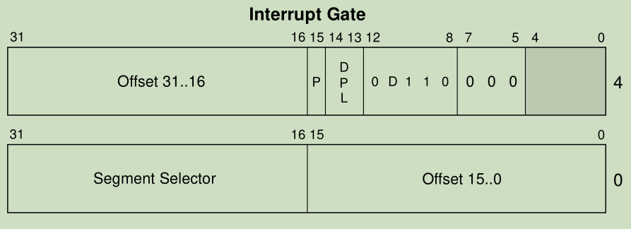
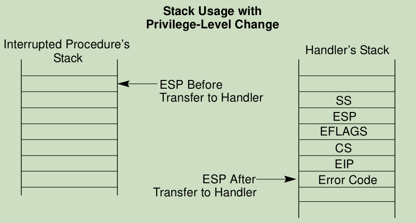
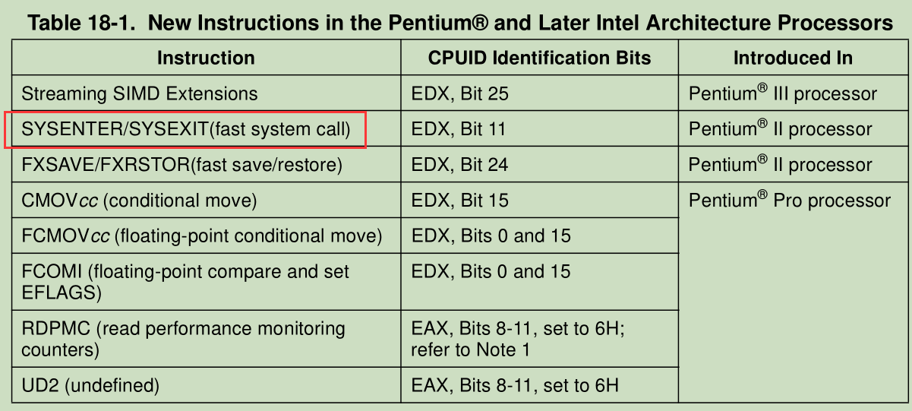

## 中断门实现系统调用



-   我们这个们的时候类型改为14就行了,而且不具备拷贝参数的功能,其他的跟调用们是一样的
-   按CPU手册,中断门必须在IDT表 32项之后,前面32项CPU自己要用
-    在windbg可以通过  !idt  -a   查收看所有的idt表 ,但可以发现微软不用,就填一个默认的,基本很少留空 

### 驱动  0环代码 

-   因为使用中断门,所以要用 idt表
-   retr 不用了.以为 idt表用的是 iretd (d代表返回时把栈平了)

```c++
#include <ntddk.h>


//门描述符
struct GateDes {
  unsigned offset1 : 16;     //偏移低16位
  unsigned selector : 16;    //代码段选择子
  unsigned res:8;            //保留
  unsigned type : 4;         //类型
  unsigned s : 1;            //描述符类型 (0 = 系统段; 1 = 存储段)
  unsigned dpl : 2;          //描述符特权级 ring0~ring3  
  unsigned p : 1;            //存在位   0 段不在    1 存在
  unsigned offset2 : 16;     //偏移高16位
};

#pragma pack(1)
struct DTR {
  unsigned short limit;
  unsigned int base;
};

void __stdcall syscall1() {
  DbgPrint("[51asm] syscall1\n");
}

void __stdcall syscall2(int p1) {
  DbgPrint("[51asm] syscall2  p1:%d\n", p1);
}

void __stdcall syscall3(int p1, int p2) {
  DbgPrint("[51asm] syscall3 p1:%d p2:%d\n", p1, p2);
}


//系统服务表
typedef void (*SYSCALL)();
SYSCALL g_SysCallTable[] = {&syscall1,(SYSCALL)&syscall2, (SYSCALL)&syscall3 };

//函数参数大小表
unsigned char  g_SysCallParam[] = { 0, 4,  8 };

__declspec(naked) void SysCallProxy() {
  __asm {
    //int 3
    push ebp
    mov  ebp, esp
    //保存环境 
    push fs
    push ebx
    push ecx
    push esi
    push edi

    mov bx, 30h   //0环 fs的值
    mov fs, bx

    cmp eax, length g_SysCallTable
    jae EXIT

    //从用户栈拷贝参数到内核栈
    movzx ecx, byte ptr g_SysCallParam[eax]  //获取参数总大小
    sub esp, ecx     //抬栈
    mov esi, edx
    mov edi, esp
    rep movsb   //这里用 movsd效率更高 不过 ecx 的右移2位
    //调用函数
    call dword ptr [g_SysCallTable + eax * 4]

EXIT:
    //恢复环境 
    pop edi
    pop esi
    pop ecx
    pop ebx
    pop fs
    mov esp, ebp   //平栈
    pop ebp
    iretd     //返回平栈
  }
}
    
//卸载调用门
void UnRegisterGate() {
  KAFFINITY  mask = KeQueryActiveProcessors();
  DbgPrint("mask:%x\n", mask);

  KAFFINITY   shift = 1;
  struct DTR gdt = { 0 };
  //每一核都得卸载
  while (mask) {
    KeSetSystemAffinityThread(shift);
    __asm {
      sidt gdt;   //
    }
    DbgPrint("base:%p limit:%p\n", (void*)gdt.base, (void*)gdt.limit);

    //修改GDT
    struct GateDes* pGate = (struct GateDes*)gdt.base;
    struct GateDes gate = {0};  //改回0
    pGate[0x29] = gate;  //放在GDT表的第29项

    shift <<= 1;
    mask >>= 1;
  }
}

//注册调用门
void RegisterGate() {
  struct GateDes gate;
  gate.offset1 = (unsigned)&SysCallProxy & 0xffff;    //函数地址的低16位
  gate.offset2 = (unsigned)&SysCallProxy >> 16;       //函数地址的高16位(无符号改为自动补0)
  gate.selector = 8;                                  //函数地址在0环的CS段
  gate.res = 0;                                       //保留
  gate.s = 0;                                         //系统段
  gate.type = 14;                                     //类型:12调用门
  gate.dpl = 3;                                       //0和3环都可以用               
  gate.p = 1;                                         //有效

  KAFFINITY  mask = KeQueryActiveProcessors();
  DbgPrint("mask:%x\n", mask);

  KAFFINITY   shift = 1;
  struct DTR gdt = { 0 };
  //多核的话每一核都得去改
  while (mask) {
    KeSetSystemAffinityThread(shift);
    __asm {
      sidt gdt;    //获取寄存器GDTR 的值
    }
    DbgPrint("base:%p limit:%p\n", (void*)gdt.base, (void*)gdt.limit);

    //修改GDT
    struct GateDes* pGate = (struct GateDes*)gdt.base;
    pGate[0x29] = gate; //放在GDT表的第29项  

    shift <<= 1;
    mask >>= 1;
  }
}


/*驱动卸载函数 clean_up*/
VOID Unload(__in struct _DRIVER_OBJECT* DriverObject)
{
  DbgPrint("[51asm] Unload! DriverObject:%p\n", DriverObject);

  UnRegisterGate();
}


/*1.驱动入口函数*/
NTSTATUS DriverEntry(
  __in struct _DRIVER_OBJECT* DriverObject,
  __in PUNICODE_STRING  RegistryPath)
{
  UNREFERENCED_PARAMETER(RegistryPath);

  DbgPrint("[51asm] DriverEntry DriverObject:%p\n", DriverObject);

  DriverObject->DriverUnload = Unload;    //注册卸载函数

  RegisterGate();   //注册调用门

  return STATUS_SUCCESS;
}
```

### 用户程序 3环

```c++
#include <stdio.h>
#include <stdlib.h>

//调用门
__declspec(naked) void __stdcall CallGate() {
  __asm {
    //int 3
     lea edx, [esp + 8]   //多了一个返回值
    _emit 9ah
    _emit 00h
    _emit 00h
    _emit 00h
    _emit 00h
    _emit 4bh
    _emit 00h
    ret
  }
}


//中断门函
__declspec(naked) void __stdcall IntGate() {
  __asm {
    //int 3
    lea edx, [esp + 8]
    int 29h
    ret
  }
}


//void (__stdcall* g_SysCall)() = &CallGate;   //加这个可以防止修改金0环的方式而导致后面大改，这样只需要修改 CallGate() 函数就可以了

void (__stdcall* g_SysCall)() = &IntGate;  //代理函数换成调用中断门


//ntdll.dll
__declspec(naked) void __stdcall Syscall1() {
  __asm {
    mov eax, 0  //syscall1
    call g_SysCall
    retn
  }
}
__declspec(naked) void __stdcall Syscall2(int p1) {
  __asm {
    mov eax, 1  //syscall2
    call g_SysCall
    retn 4
  }
}

__declspec(naked) void __stdcall Syscall3(int p1, int p2) {
  __asm {
    mov eax, 2  //syscall3
    call g_SysCall
    retn 8
  }
}


int main()
{
  Syscall1();
  Syscall2(1);
  Syscall3(1, 2);
  printf("call syscall1 ok\n");

  system("pause");
  return 0;
}
```

-   使用中断门 在保存的寄存器信息更多, 多了一个 EFLAGS 寄存器,因为为产生中断的时候的 IF 状态位会置0,屏蔽了中后断,回到3环以后要置1,不然3环也会屏蔽中断



### 总结

-   每个系统的函数调用都是通过终端来完成的,因为方便,而且具备屏蔽中断的功能,他就会在栈里多呀一个寄存器,而且中断触发更加方便,3环允许我们写 int 29 的代码,所以不需要写2进制值
-   调内核的函数,只需要找nitdll.dll里面以nt 开头的函数就可以了
-   通过逆向我们可以知道内核函数的所有下标,,这样我们绕过操作系统无法直接调内核api,这样将没办法调试我们的软件
-   参数我们可以直接看wdk,如果wdk没有我们可以去看wrk
-   kernel32.dll要把所有3环的参数转为内核版的参数,因为3环和0环的参数是不一样的,到了 int 2e 已经转好了,所以我们参数必须填内核版的
-   知道下标和参数后我们就具备了自己进内核操作代码的条件
-   如果我们找到一个远程服务器的漏洞,要在对方电脑上执行shellcod,我们就不需要 ntdll.dll,一个int 2e 就够了,这就代码我们注入的shellcod 调API 可以精简到 几个字节
-   利用中断来执行shellcode,可以让代码更精简,而且对环境没有要求,,只需要知道系统版本,因为或许是意识到了这个问题,每个大版本函数对应的API一直在变,但是可以一个个编号去试,什么时候可以通信就说明编号对了,错了也不会崩,因为存在检查
-   linux 操作系统每个版本的中断号和API的下标号都一样
-   微软一直在变,这也导致软件开发者很少用这招,因为 下标写死换个系统版本可能就用不了了,但是我们可以通过都读 ntdll.dll,遍历导出表读2进制也能得到函数api对应的下标号,缺点就是没有隐秘性,因为兼容性问题,所以开发者很少用
-   微软有2中方式调API,通过中断调用的方式基本废弃了

## MSR寄存器

-   我们调API会很频繁,掉一次API得大量内存访问,因为寄存器保存在内存里面 这样很浪费时间,要提高性能,那就是要减少内存访问,我们可以通过加寄存器来解决,所以 intel 提供了 一套 MSR寄存器(模式指定寄存器)
-   用了这套寄存器速度就变快,所以这套寄存器就叫FastSystemCall
-   系统调用只是这段寄存器的一小部分功能
-   它提供了2条指定   rdmsr    wrmsr   要访问那个寄存器就给编号就行了,这样指令就统一了
-   结果放在  edx:ecx中,这2两条指令是属于特权指令,3环用不了
-   微软根据 MSR寄存器 开发出了一种 快速调用系统api的模式  FastSystemCall
-   一般操作系统再开机的时候就会检测cpu型号,如果支持 快速调用 ,就会把系统调用改成 FastSystemCall (快速系统调用),如果不支持,那就是用 int 2e (中断)  

### MSR寄存器的使用



-   SYSENTER     进入0环等于   int   2eh  但是  SYSENTER     查的是寄存器,      int   2eh 查的是中断表
-   SYSEXIT          退出0环等于          iretd

#### MSR寄存器指令详解

-   它主要就是rdmsr和wrmsr这两条指令,这两条指令的结果放在edx:eax里;它也是特权指令,3环无法使用
-   检测CPU有没有MSR寄存器:

mov eax ,1 

CPUID  ;                    调用CPUID

cmp ecx,08Bh ;       如果ecx的值是8B的话就说明支持

rdmsr

-   它的用法就是:

mov ecx,xxxx;        ecx表示寄存器编号
rdmsr               ;读取,结果就在edx:eax里
编号就是   174 175 176 
用的话就是 rdmst 174  这样
sysenter只做了3个寄存器
SYSENTER_CS  :174
SYSENTER_ESP :175
SYSENTER_EIP :176

#### 探讨`sysenter`和`sysexit`指令 

-   Intel最多提供了3个寄存器用于SYSENTER指令切换权限,这3个就可以完成8个寄存器的功能
-   调用SYSENTER指令要做的事:

-   -   1.   **CS = SYSENTER_CS;**     进入0环CS要切换,CS就从SYSENTER_CS这个寄存器里取
    -   2.   **EIP = SYSENTER_EIP;**      对于操作系统作者来说只需要把系统调用的代理函数填到这里就完了
    -   3.   第三步要切换栈了也就是要切SS了,**SS = SYSENTER_CS + 8**

-   选择子是在GDT表里,段寄存器给的就是选择子,改完代码段还得改堆栈段,代码段和堆栈段在GDT表里时相的,它俩的下标刚好差8,Intel的意思就是SS寄存器不提供了,要求操作系统作者做堆栈段的时候跟代码段相邻,这样就能省掉一个寄存器了

-   -   4.   第四步要切换ESP了 也就是 **ESP = SYSENTER_ESP**;这样进入0环要切换的都切换完了

-   SYSENTER不屏蔽中断,所以它不需要EFLAGS


调用SYSEXIT指令要做的事

1.  3环的**CS = SYSENTER_CS + 16;**    也就是3环的代码段在GDT表里正好和0环的堆栈段是相邻的,这样又省一个寄存器了
2.    3环的**SS = SYSENTER_CS +24**    3环的堆栈段和它们也是相邻的,所以就再+8就好了
3.  **EIP = EDX**
4.  **ESP = ECX** 

-   EIP和ESP都用通用寄存器来传递了,但是由于这两个是通用寄存器,所以就要PUSH它俩
-   操作系统作者一般在进入0环的时候就   **push eip ;   push esp**    回3环的时候就要 **pop ecx;     pop edx**

-   这也是前面写自做API的时候用EDX传栈地址, 用EDX传栈的话就不用  push esp 了而EIP的话刚好在3环的栈顶.所以也不需要 push eip了,但是回来的时候还得pop;    
-   但是edx和ecx可能会在别的函数用,也就是要在查表之前push edx,   return之前要pop edx  这就代表微软的函数最后两行肯定是**pop edx 和  pop ecx**,因为调用  SYSEXIT  之前肯定要调这两条

#### 	MSR hook

-   如果用wrmsr把eip改成我们自己的函数,那么3环所有应用程序要调API都得先问我,不想让它调就返回SYSEXIT这个就叫MSR Hook;但是MSRhook很容易蓝屏...,因为寄存器环境没管理好就会蓝屏,而且程序得很稳定
-   一般都是EIP = SYSENTER_EIP ==> 改为MyFun,不让调就返回SYSEXIT 让调就调==>old旧的
-   现在主流就是 FastSystemCall,老的CPU可能会用中断门

## 本地提权漏洞

-   假设驱动有一个内核任意地址读写的漏洞 
-   比如之前最开始的时候写的代码:  RtlCopyMemory(pBuffer,&g_Registers.nVirtualReg2,nLength);
-   这个代码就具备任意地址读写的功能,因为可以把pBuffer地址故意传成一个GDT表的地址
-   第一核的gdt表地址是固定的,**807d3c20**,那么就可以把pBuffer的地址改成这个
-   而这个地址3环也能控制,只要它的通讯方式是其他方式就能控制了


-   其实只需要找一个可读可写的驱动就行了
-   第一个参数传递807d3c20这个地址,第二个参数传递一个门描述符
-   这样的话它就会把门描述符写到这个GDT表里;这种漏洞称为远程任意地址读写漏洞
-   但是这个漏洞要写ShellCode的话是很难的,因为空间可能不够,还有DEP的问题.


-   大体思路就是

1.  1.  首先找到了一个任意地址读写的漏洞,而这个地址要填GDTR的地址,然后写一个调用门进去.而门构造的时候dpl要等于1,eip则等于ring3.也就是系统调用的API地址填3环的地址
    2.  那么call这个调用门的话,系统查表就会找到所填写的3环地址      比如3环有个fun1,在门构造的时候eip = fun1,那么这个3环的fun1函数就拥有了0环的权限.不需要上内核驱动,只需要发起一个调用门,fun1就有了所有权限.

-   当然不一定要调用门,用中断门也是一样的;这个就叫本地提权漏洞
-   以前的病毒用调用门比较多,现在大多都用中断门了

 

###  使用中断门来完成本地提权漏洞 

-   可以自己写一个有漏洞的驱动,定义一个控制码,然后用其他方式通讯,地址就可以用户自己指明了
-   为了方便做测试,就自己手动在IDT表里做一个门,但是要写一个ring3的程序

-   ring3程序就写一个函数,就直接用汇编访问cr3寄存器,如果能成功,那么就是得到了0环权限而且没有用驱动.
-   唯一要造成一个意外的就是要用   __asm int 29h

-   所以现在要在中断表里做一个门了,中断门有个问题就是表每个核都有一个,而GDT表的地址更为固定一点.
-   可以直接在中断表里抄一个...比如就抄2E了,这样方便做门;   r idtr = 80b95400  那么就是  dq 80b95400 + 2e * 8;这样就拿到它的描述符了;83e5ee00`00081fee
-   要改的话首先要改它的地址;比如我们的函数地址是0038DD29
-   那么就把高16位和低16位分别填写到描述符高16位和低16位的地方 0038ee00`0008DD29
-   选择子的话还是要给8,8是内核代码段,也就是0038ee00`0008DD29
-   类型不需要改了,还是中断门,还需要改的是dpl也就是权限;但是这里正好是e也就是1110,所以正好不需要改.

-   然后改完就可以把这个门写到IDT表29的位置.其实3环写固定地址会方便点,不用每次都改了

-   这么改还是有问题的,因为改了IDT表,但是并不知道代码会在那一核运行,也就是有可能改的是1核的IDT,但是3环的代码运行在2核这样,所以做门的时候就要每一核都做,但是太麻烦了,也可以强制让3环的代码在第一核运行.
-   那么只需要改第一核的IDT就行了,或者在3环的程序里写一个__asm int 3,这样修改的IDT和3环运行的代码就在一个核心了.

 

###  也可以用调用门来完成 

```c++
调用门就是描述符类型改成调用门,也就是0038ee00`001BDD29 改成0038ec00`001BDD29就是调用门了
然后把它写到gdtr表里就行了,在gdtr表找个空的写进去就行了
至于3环的代码就从
__asm int 29h
改为
__asm{
    _emit 9ah
    _emit 00h
    _emit 00h
    _emit 00h
    _emit 00h
    _emit 4bh
    _emit 00h 
} ;因为填在gdt表第9项,所以是4b
```

代码示例 

```c++
int g_cr3 = 0;

__declspec(naked) void fun1() {
__asm {
	push fs
	mov eax, cr3 //访问0环地址;
    mov g_cr3, eax //存到全局变量里
    //这里只是做一个测试,测试能拿到0环的地址,后续要做什么,代码就可以写在这里.
    pop fs
	iretd //返回
    //retf //返回
    }
 }
    
int main()
{
    //强制让代码在第一核运行
    //SetProcessAffinityMask(GetCurrentProcess(), 1);

    //先把函数地址打印出来,方便直接用WinDbg做门
    printf("fun1:%p\n", fun1);
    system("pause");
    __asm int 3; //或者用int 3先断下来,然后再改表

    //做完门在开始提权
    __asm int 29h

    printf("cr3:%d\n", g_cr3);
    system("pause");
    return 0;
}


这样的话ring3就可以获取到0环权限了,只是需要自己手动创造一个门,然后把fun1的地址写到门里,在按格式填写门的每一位,然后把门填写到表里,中断门就填IDT表,描述门就填GDT表,
中断门的话 就是 int 29h;29是表的下标   描述符就用二进制的call来完成
```

-    目前其实很多驱动不会用直接通讯的方式,大多用的都是缓冲区通信 

用缓冲区通信的话也还是同样的操作,就是发控制码
缓冲区通信的话都会写buf,而且这个buf通常都是一个结构体,这个结构体只要里面有一个指针或者函数指针
就可以把这两个地址改成IDT或者GDT对应的地址,然后就可以任意地址读写了

 微软的API很多也有这个bug,第三方驱动的话漏洞更多.但是在64位里已经杜绝了这种方式了.

-   CE有一个内核驱动的读写功能,它开源了,这样我们就不需要挖漏洞,只需要找拥有这功能的驱动(可以读写内存)
-   而且这些驱动可以在杀软白名单,微软不是每个版本驱动都有漏洞,但是我们可以把有漏洞的驱动拷到我们目录下,直接用,这样杀软也没法杀

```c++
#include <ntddk.h>

//12 1 1 0 0 32-Bit Call Gate
//门描述符
struct GateDes {
  unsigned offset1 : 16;   //偏移低16位
  unsigned selector : 16;    //代码段选择子
  unsigned param : 5;
  unsigned res:3;
  unsigned type : 4; //类型
  unsigned s : 1;     //描述符类型 (0 = 系统段; 1 = 存储段)
  unsigned dpl : 2;     //描述符特权级 ring0~ring3  
  unsigned p : 1;     //存在位   0 段不在    1 存在
  unsigned offset2 : 16;//偏移高16位
};

#pragma pack(1)
struct DTR {
  unsigned short limit;
  unsigned int base;
};

void __stdcall syscall1() {
  DbgPrint("[51asm] syscall1\n");
}

void __stdcall syscall2(int p1) {
  DbgPrint("[51asm] syscall2  p1:%d\n", p1);
}

void __stdcall syscall3(int p1, int p2) {
  DbgPrint("[51asm] syscall3 p1:%d p2:%d\n", p1, p2);
}


//系统服务表
typedef void (*SYSCALL)();
SYSCALL g_SysCallTable[] = {&syscall1,
(SYSCALL)&syscall2, 
(SYSCALL)&syscall3
};


unsigned char  g_SysCallParam[] = { 
  0,
  4,
  8};

__declspec(naked) void SysCallProxy() {
  __asm {
   // int 3
    push ebp
    mov  ebp, esp

    push fs
    push ebx
    push ecx
    push esi
    push edi

    mov bx, 30h
    mov fs, bx

    cmp eax, length g_SysCallTable
    jae EXIT

    //从用户栈拷贝参数到内核栈
    movzx ecx, byte ptr g_SysCallParam[eax]
    sub esp, ecx
    mov esi, edx
    mov edi, esp
    shr ecx, 2
    rep movsd
    call dword ptr [g_SysCallTable + eax * 4]

EXIT:

    pop edi
    pop esi
    pop ecx
    pop ebx
    pop fs
    mov esp, ebp
    pop ebp
    iretd
    //retf
  }
}


void UnRegisterGate() {
  KAFFINITY  mask = KeQueryActiveProcessors();
  DbgPrint("mask:%x\n", mask);

  KAFFINITY   shift = 1;
  struct DTR gdt = { 0 };
  while (mask) {
    KeSetSystemAffinityThread(shift);
    __asm {
      sidt gdt;
    }
    DbgPrint("base:%p limit:%p\n", (void*)gdt.base, (void*)gdt.limit);

    //修改GDT
    struct GateDes* pGate = (struct GateDes*)gdt.base;
    struct GateDes gate = {0};
    pGate[0x29] = gate; //004B 

    shift <<= 1;
    mask >>= 1;
  }
}

void RegisterGate() {
  struct GateDes gate;
  gate.offset1 = (unsigned)&SysCallProxy & 0xffff;
  gate.offset2 = (unsigned)&SysCallProxy >> 16;
  gate.selector = 8;
  gate.param = 0;
  gate.res = 0;
  gate.s = 0;
  gate.type = 14; //中断门  12就是调用门
  gate.dpl = 3;
  gate.p = 1;

  KAFFINITY  mask = KeQueryActiveProcessors();
  DbgPrint("mask:%x\n", mask);

  KAFFINITY   shift = 1;
  struct DTR gdt = { 0 };
  while (mask) {
    KeSetSystemAffinityThread(shift);
    __asm {
      sidt gdt;
    }
    DbgPrint("base:%p limit:%p\n", (void*)gdt.base, (void*)gdt.limit);

    //修改GDT
    struct GateDes* pGate = (struct GateDes*)gdt.base;
    pGate[0x29] = gate; //0x4b

    shift <<= 1;
    mask >>= 1;
  }
}


/*驱动卸载函数 clean_up*/
VOID Unload(__in struct _DRIVER_OBJECT* DriverObject)
{
  DbgPrint("[51asm] Unload! DriverObject:%p\n", DriverObject);

  UnRegisterGate();
}


/*1.驱动入口函数*/
NTSTATUS DriverEntry(
  __in struct _DRIVER_OBJECT* DriverObject,
  __in PUNICODE_STRING  RegistryPath)
{
  UNREFERENCED_PARAMETER(RegistryPath);

  DbgPrint("[51asm] DriverEntry DriverObject:%p\n", DriverObject);

  DriverObject->DriverUnload = Unload;

  RegisterGate();

  return STATUS_SUCCESS;
}
```

```c++
#include <stdio.h>
#include <stdlib.h>
#include <Windows.h>

int g_cr3 = 0;

//本地提权
__declspec(naked) void fun1() {
  __asm {
     push fs
    
     mov eax, cr3
     mov g_cr3, eax

     pop fs
     retf
  }
}


int main()
{

  /*
  xxxxxxxxxx  IoControl(8003f000, 0040ec00`00081000, 8)
  buff 
  struct {
    pfn  -> 8003f000
    pvoid -> 8003f000
  }
  */
  

  SetProcessAffinityMask(GetCurrentProcess(), 1);
  printf("fun1:%p\n", &fun1);

  __asm  {
    _emit 9ah
    _emit 00h
    _emit 00h
    _emit 00h
    _emit 00h
    _emit 4bh
    _emit 00h
  }

  printf("cr3:%p\n", g_cr3);

  system("pause");

  return 0;
}

```

