一般不调用Ntdll，因为Ntdll参数要求跟3环是不一样的

**跟踪系统调用SYSENTER**

XP下的内核模块，开了PAE就找带pa的内核模块

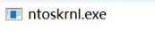

XP下的ntdll模块

XP下的user32模块和kerne32模块

IDA打开下载符号，下载完成点击保存idb，之后分析看idb就行

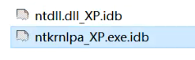

没有符号的函数一般是微软觉得重要不提供符号的函数

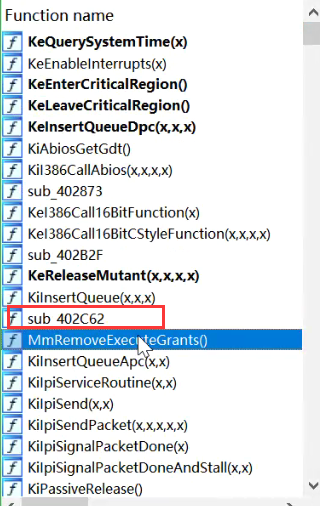

跟踪ReadProcessMemory，这里是参数转换，然后调Ntdll的导入函数

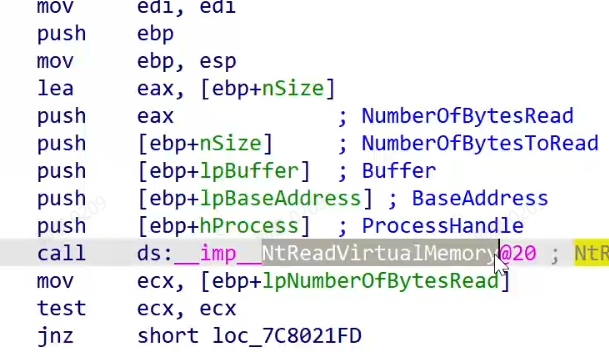

导入表：ntdll导出函数

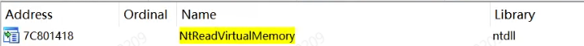

IDA打开Ntdll，NtReadVirtualMemory和ZwReadVirtualMemory函数地址是一样的，序号不一样，为了兼容老版本，新版本一般用Zw，XP用的 Nt

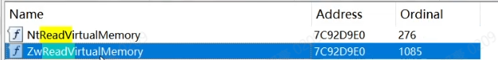

调用了186号API

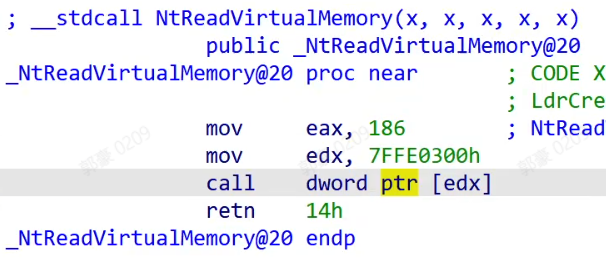

call的函数只有两种情况

1)SYSENTER

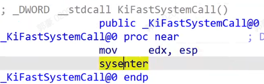

2)Int N

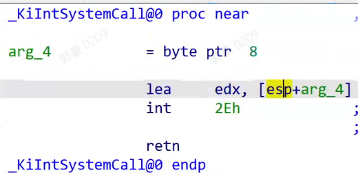

但他们都会调到KiSystemService/ KiFastCallEntry 函数这两个函数之一

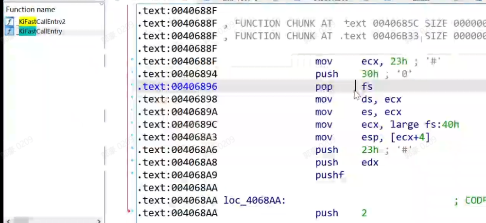

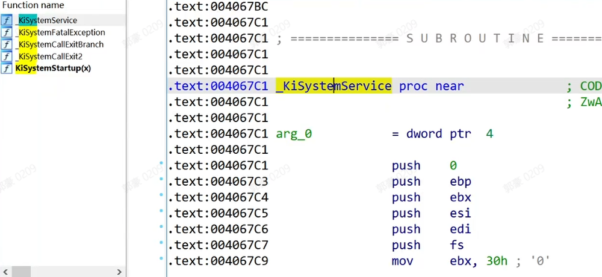

SYSENTER 指令隐含的6步中最为关键的就是从 IA32_SYSENTER_EIP 寄存器取出指令指针放到EIP中，而 IA32_SYSENTER_EIP 寄存器保存的即是 nt!KiFastCallEntry() 的起始地址。通过内核调试器命令 rdmsr 0x176 可以获取该地址

在Windbg中对照一下：获取KiFastCallEntry的地址

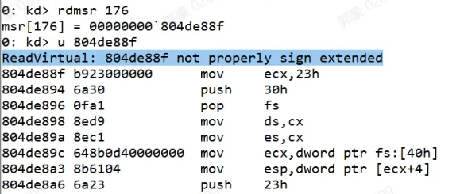

因为所有进程都会来，所以进程对象筛选一下

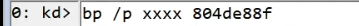

FS改为内核就能访问到KPCRB结构体(0x30)，如果不改就是指向3环的TEB结构体(0x3B)

FS:40h是TSS指针，访问TSS+4，ESP0是0环的ESP，修改ESP为0环的ESP，说明SYSENTER不会切栈

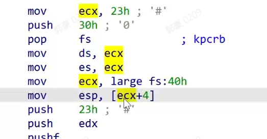

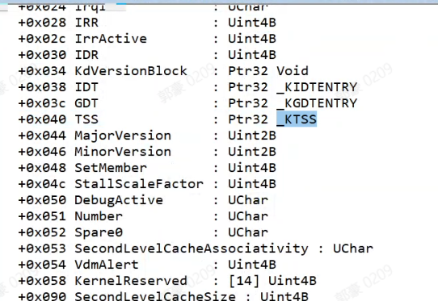

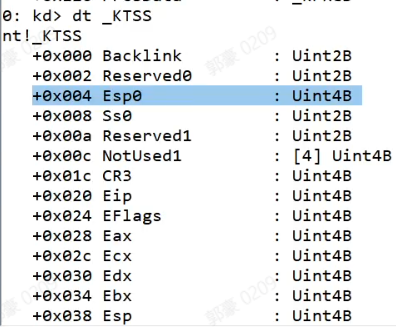

接下来，edx是3环的栈，这里+8说明3环没有+8，3环正好是ebp和返回值，+8才是参数

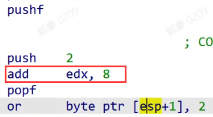

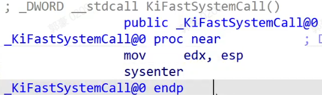

FS+1C存储了_KPCR首地址也就是FS:0，FS:0就是KPCR首地址，这里为什么不直接用FS:[0]，因为汇编无法直接访问FS:0的地址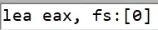，不能取地址，只能mov取内容

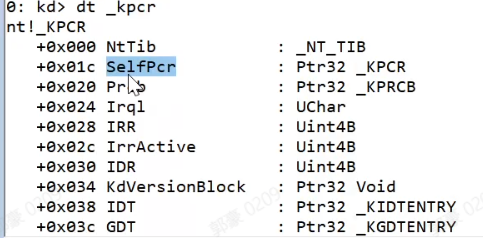

而这样等于直接拿结构体首地址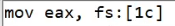

+0x124是KPCRB+4的位置，也就是当前线程

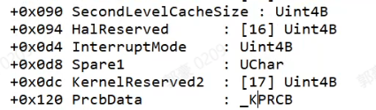

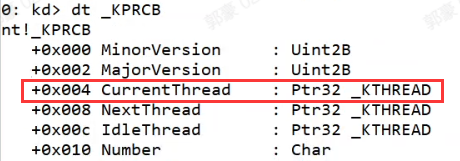

当前线程+0x18是当前栈

当前线程+0x140是之前模式，也就是从3环过来还是0环过来的

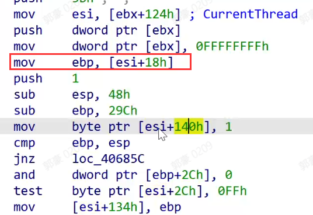

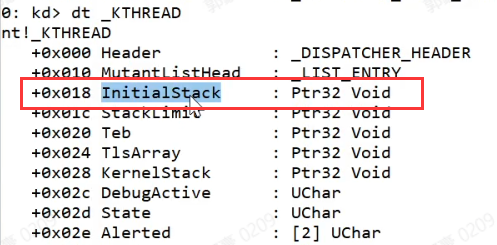

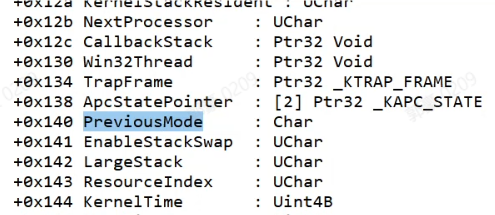

Zw跟Nt很像

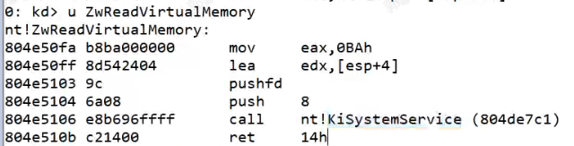

Zw调的是KiSystemService

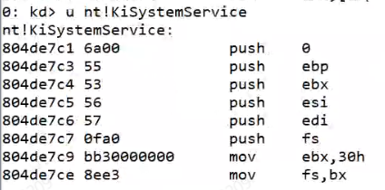

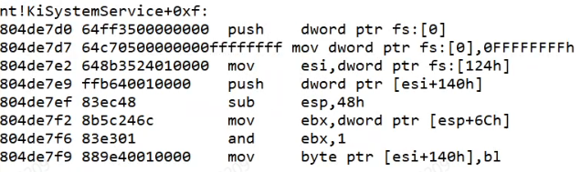

Zw函数最终还是调用了Nt函数，为什么微软不建议调Nt函数？

1)因为Nt不检查参数

2)下个版本这个函数可能就被删了

为什么还要坚持调用？因为一般HOOK的都是Zw函数，而不是Nt函数，Nt更底层

而MSR在3环比Nt更底层，寄存器选择调用函数和传参

_KTHREAD（_ETHREAD）+E0就是SSDT（系统服务表），ServiceTable

说明创建线程的时候SSDT表地址就放入了这个成员里

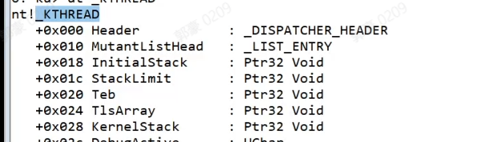

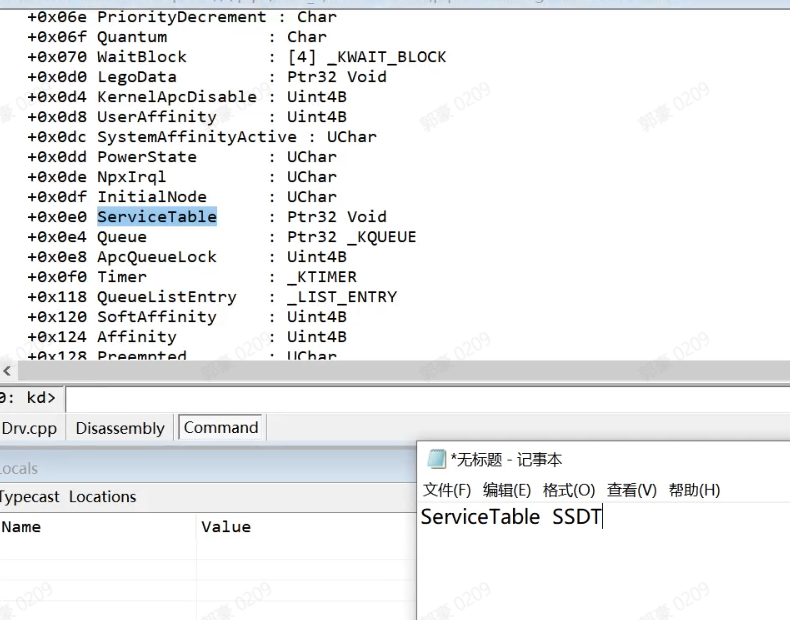

表地址+EDI，说明表有两个，控制台只有SSDT表，Win32程序有两个表SSDT和ShadowSSDT

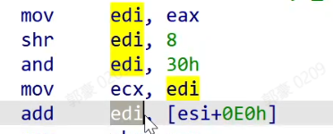

UI函数实现代码在Win32k.sys

切环境：/r，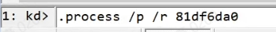

切进程：/i，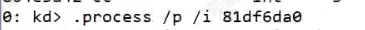

再使用lm命令查看模块就能看到Win32k.sys

对指定进程的指定函数下断点

API编号12位有效，高位丢弃了

下断点，拿到EDI之后断下

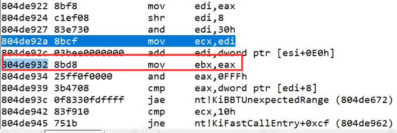

EDI是结构体，16字节大小

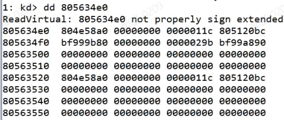

[EDI+0]是指向SSDT首地址

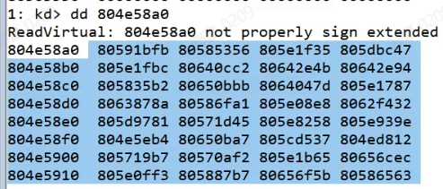

[EDI+8]是SSDT的函数数量

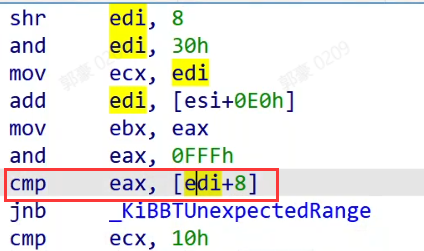

dds 地址，符号解析；ddp 地址，二级指针

符号解析每个成员

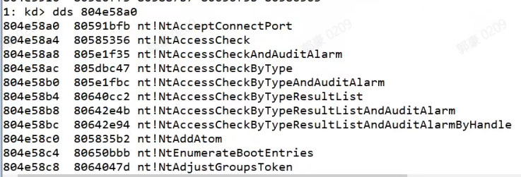

最后一项是参数大小的数组指针

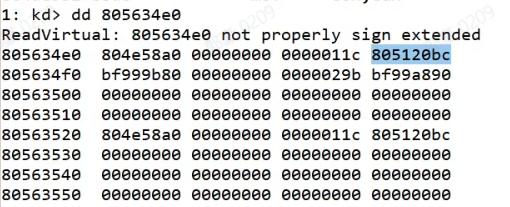

项数 = (当前函数下标地址 - 数组首地址)/4

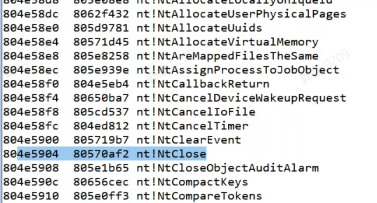

参数大小 = 参数大小的数组指针 + 项数

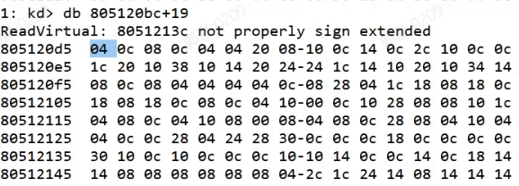

遍历进程线程

线程的ServiceTable指向服务表首地址，Win32服务表第一项是SSDT，第二项是ShadowSSDT

取参数

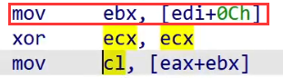

查出数量抬栈

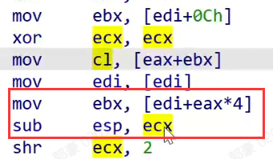

查表完成后调用该函数

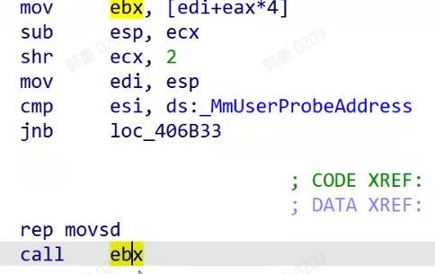

HOOK SSDT的方案：

1)hook msr

2)inine hook KiFastCallEntry

3)hook 修改SSDT表 或 ShadowSSDT表

inine hook KiIsCall

最好的位置就是在调用时，判断eax就知道调用的哪个函数了，而且此时参数正好在栈顶，不用考虑参数

**拿到SSDT表**

WRK中找到KTHREAD，然后找到服务表的引用处

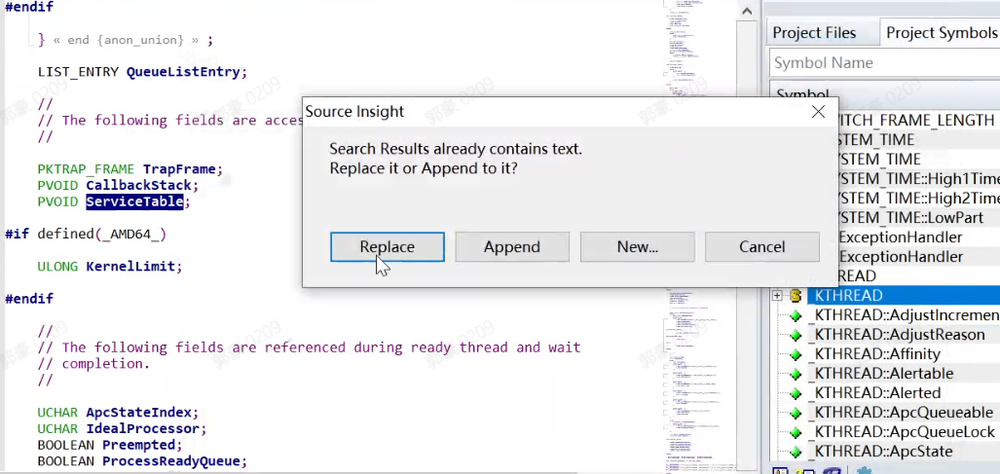

会发现有两个全局变量，这就是SSDT表 和 ShadowSSDT表

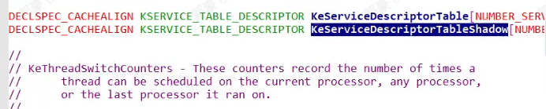

SSDT和ShadowSSDT结构体定义

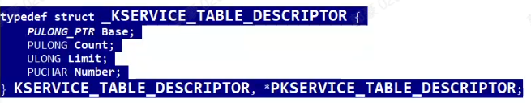

KiFastCallEntry已经导出了SSDT全局变量，代码中直接导入即可

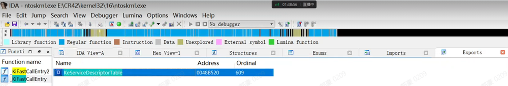

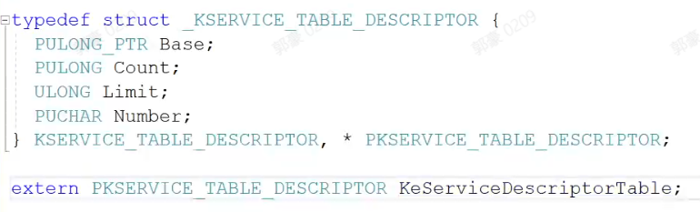

如果当前进程没有ShadowSSDT，就强制切到有ShadowSSDT的表

对于SSDT指针在_KTHREAD的偏移，可以用特征码定位拿到，但是要每个版本都看一下，保证这个特征码通用

然后切到Win32程序，两个表就都可以拿到了，ShadowSSDT在SSDT + 16的位置

通过线程ID拿到PETHREAD

申明

HOOK -> OpenProcess函数

拿OpenProcess编号：Ntdll导出函数，看到OpenProcess编号是122->0x7A

函数地址 = SSDT首地址 + 编号 * 4

HOOK还需要知道参数，WRK可以查看

伪造的OpenProcess

SSDT表中填入伪造的OpenProcess地址，在伪造的OpenProcess中调原来的OpenProcess

OpenProcess可以路径打开也可以进程ID打开

SSDT表内存只读的，禁用写保护

nop掉断点代码

断点

命令

同步加减引用计数

对进程ID不是自己的监控操作自己的情况，就返回错误（也可以返回成功，假装成功其实没成功）

这样别人就打开不了进程了

任务管理器结束不了了

具体要HOOK那些函数？

看杀毒软件HOOK的哪些函数，学他们的

看游戏保护HOOK的哪些函数，这些函数都是外挂的重点，学他们的

如果是隐藏窗口，那就HOOK FindWindow，只要是自己的窗口就返回没有

如果对方投递WM_CREATE消息，就HOOK PostMessage，只要是自己的就不投递，自己投递可以投递

如何知道函数被HOOK了？

早期：编译SSDT表判断地址是不是在内核(nt)模块范围内。但是别人可以再nt模块内找到一个地址填入SSDT，那个地址jmp到HOOK函数执行。

深层次检测：重载内核得到一个干净的内核文件，对比现在的SSDT。

绕过SSDT检测：备份SSDT表，目标进程的ETHREAD.serviceTable = 备份的SSDT表，修改的位置等于是ETHREAD就已经修改了，跟SSDT表位置没关系，本来都指向的是一个位置的SSDT（这个位置的SSDT会被扫描是否被修改），现在当前进程指向了自己申请的SSDT表。

如何检测这种方式？检测每个线程的SSDT是否是原来的SSDT。ARK工具不见得做出了这一步的检测。

PCHunter做的HOOK

如何显示函数名？

1.写死

2.遍历ntdll导出表：读出函数的编号，确定函数名，缺点是函数名不全

3.解析pdb文件：自动下载pdb，解析pdb，传入RVA->找到函数名。系统如果更新再从微软服务器下载，微软服务器网络不好自己建服务器，自己的服务器不定时向微软服务器下载最新的pdb

VS提供的解析pdb文件的工具案例

依赖的COM插件

注册COM

案例设置的命令行参数：-all pdb路径

查询系统信息的函数，是ntkernel的导出函数，基本上都可以查到，但这个函数要是被HOOK了就废了

第一个参数是枚举，微软官方公开的枚举很少，实际上有很多，看下面的图（来自WRK）

遍历进程

内核所有模块，类似windbg的lm功能

遍历所有驱动

遍历所有模块

遍历内存使用情况

遍历进程

如何使用？WRK参考引用这个枚举值，找到微软代码例子

