-   cpu得兼容32位操作系统

### CPU模式变化

#### 模式种类

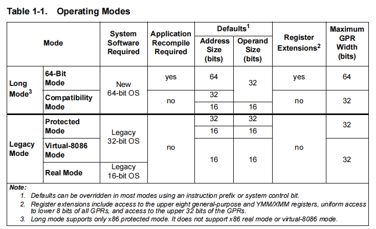

-   长模式 ： 种种模式下只能运行64位操作系统

-   -   64位模式 ： 所有地址和代码都按64为解析，寄存器进行了扩展
    -   兼容模式：64位系统也可以运行32位程序，32位汇编和64位汇编的格式和地址都不一样，在该模式下CPU从内存取指令当x86解析，寄存器没有扩展

-   兼容模式： 可以运行32位 或者16位操作系统

#### 模式切换

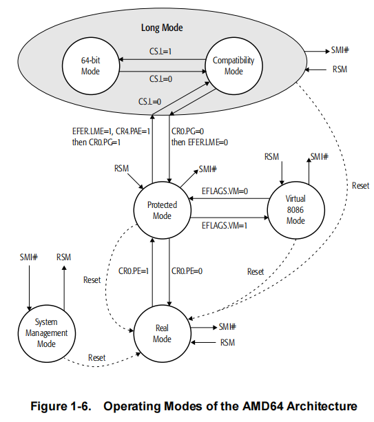

-   CS中的L位 为1 ，就进入 64位模式，等于0就进入兼容模式，因此执行32位汇编还是64位汇编完全就靠CS，所以在32位程序和64位程序的CS肯定不一样，32位是  0x23 ，64位是 0x33

#### 寄存器

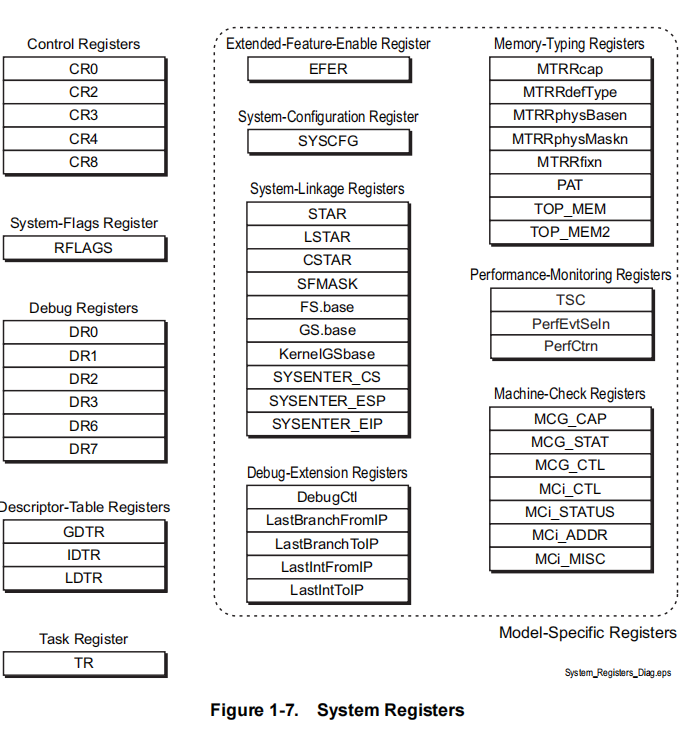

-   CR1寄存器其实一直都有，只不过我们没法用
-   FS 和 GS 可以自动切了，因为保存了
-   堆栈段也进行了扩展

#### 数据结构(表)

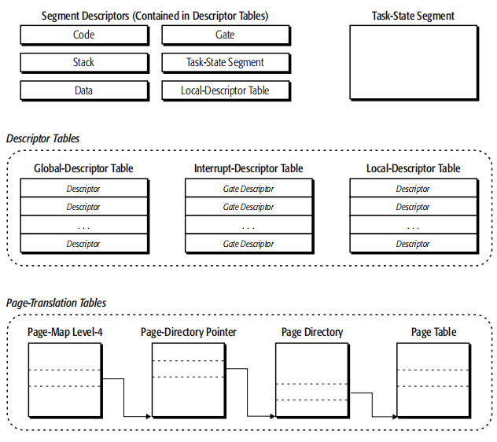

-   32位中 3个表可以映射4G内存，现在64位映射的内存可以超过4G，因此可以改成多少个4G就可以了，但是原来8个字节可能不够用，64位的地址不代表都要保存，因为是页首地址。因此可以省12位，但是如果物理地址是64位还是不够用，因为原来表格式就是8字节，64位省掉12位还剩52位，肯定不够用，表就变成16字节
-   表变成了四级表，加了一个  Page-Map Level-4 表

#### 中断表

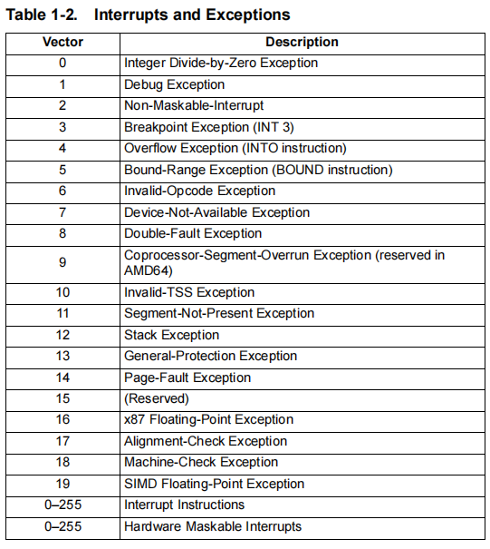

-   中断表跟32位相比，变化不大

#### 指令

**SWAPGS:** 我们进内核要换FS ，FS里面放的是系统的结构体地址，系统作者需要去切换，现在只需要这条指令他自动会把MSR的指令换过来 ,一键切换GS，这对系统作意味着 AMD希望作者用GS来保存结构（微软是FS），这就代表着在windows操作系统中，极有可能吧KPCR放到GS，为了兼容32位程序，FS仍在用

### 内存管理变化

-   分段分页的概念不会变，变得只是表结构

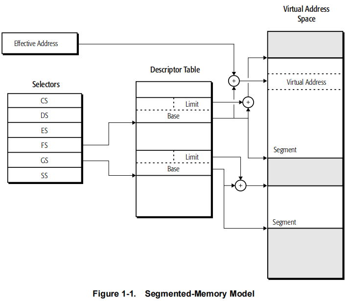

-   虚拟地址就是线性地址
-   还是选择子查段描述符（LDT 或者 GDT） 得到 Base 和 Limit 加上有效地址的偏移得到一个线性地址空间  

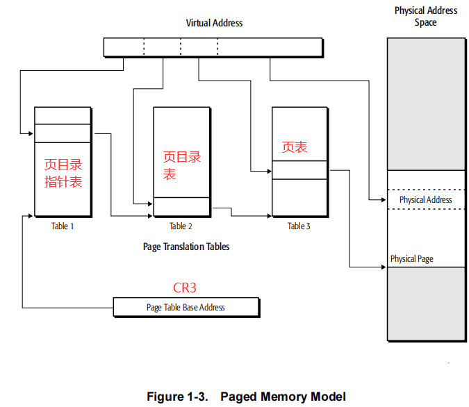

-   分页异常还是保持不变

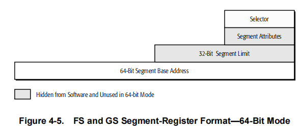

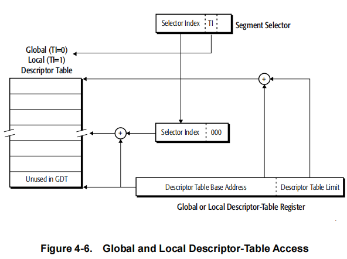

-   选择子没有变还是16位，这代表GDT表的表项数还是8192项
-   GDT表里面现在可能有32位的段，也可能有64位的段混合用
-   GDTR 64位大小发生了变化 80位(10字节)，低16位没变，高32位变成了64位
-   LDT表没用了

#### GDT表

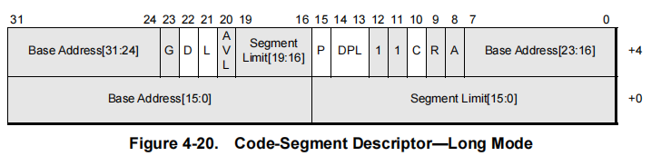

-   从上图可以知道就 D，L，P，DPL，C位有用，其他都没用，所以可以看出CPU 自己放弃了分段  

#### 数据段表

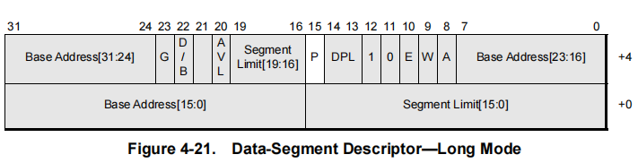

-   除了P位，其它的都废弃

#### 描述符表


-   除了LDT ，TSS，调用门（Call  Gate），其他的都没意义了

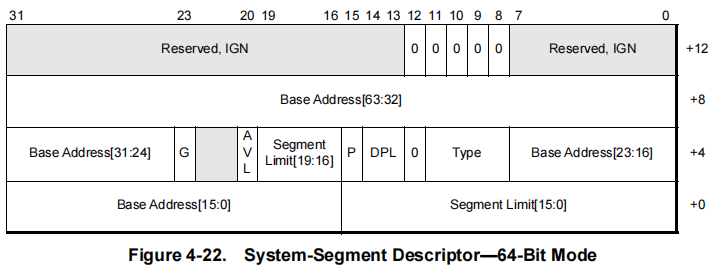

-   门描述符扩展了，一项16字节
-   如果这个描述符是系统描述符，那么这个表要解析成16字节（128位），扩展了4个字节的函数地址，剩下四个字节对其
-   所以解析GDT表不能用 dp 了，要先解析成32位，如果 L位是1，在解析成64位，因为他可能是32位和64位混合

#### 分页

-   64位的逻辑地址就是线性地址
-   CR3变成64位

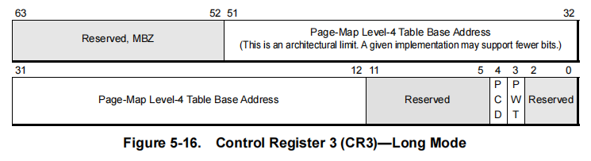

-   物理地址并没有64位(因为如果64位，3级表放不下)，偏移是12位。页首地址是40位，所以物理地址是52位（4096T），52位刚好页表们页目录表，页目录指针表都不用动

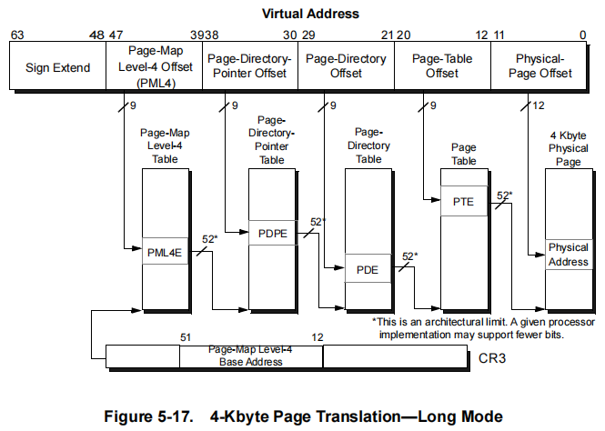

-   四个表，每个表下标9位，剩下的用不到。
-   高16位不用，变成符号扩展，所以线性地址可以理解为48位，即48位是一个线程可以申请的极限内存（256T）
-   所以在64位中 ring0   0~128T        ring3 128-256T 
-   剩下符号扩展位将来加表做准备
-   除了加一个表，其他表的解析方式不变

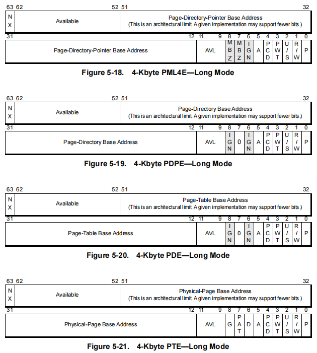

-   放弃分段采用分页，会产生内核溢出漏洞，栈可以执行代码，当时并没有dep(不可执行代码)，现在 NX位 就拥有了这个功能 1 代表可执行  0代表不可执行，这样就可以让栈不可以执行代码了

##### 4K页查表

GDTR  =   ffff   f880009fb  4c0    高16位符号扩展，可以直接不要      低12位是偏移 所以解析 12~47位就可以了

1    1111 0001     0 0000 0000      0 0000 0100       1 1111 1011    

=》四个表下标

PML4  = 0x1f1

PTPT = 0

PDT  = 4

PTT  = 0x1fb


CR3 = 0000000000187000


=》 !dq    0000000000187000 +  1f1 * 8    得到页目录指针表  

从第0项取出 第12-51位  然后第12位 补0 ，得到 页目录指针表地址

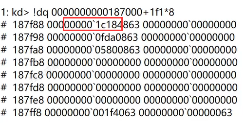

页目录指针表地址： 1C184000  

-   最高位时0，表示该段不能跑代码

=》 !dq    00000000001C184000   +  0 * 8    得到页目录表  

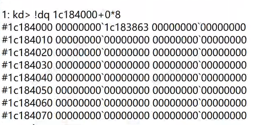

页目录表地址： 1C183000  


=》 !dq    00000000001C183000    +4 * 8    得到页表地址

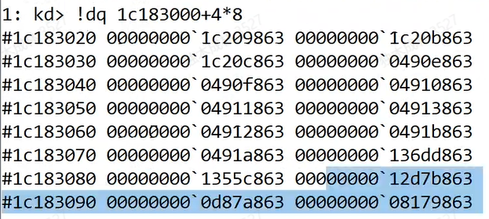

页表地址： 1C209000


=》 !dq    0000000000 1C209000    +1fb * 8    得到物理地址

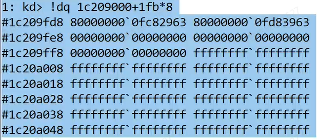

-   最高位是1，代表可以执行代码  

=》物理地址 =  fc82000 + 偏移  =》  fc82000+  4c0


 可以 !pte  虚拟地址  验证  或者  !vtop  0   虚拟地址  


##### 2M页

-   2M还是 4K 看PS位

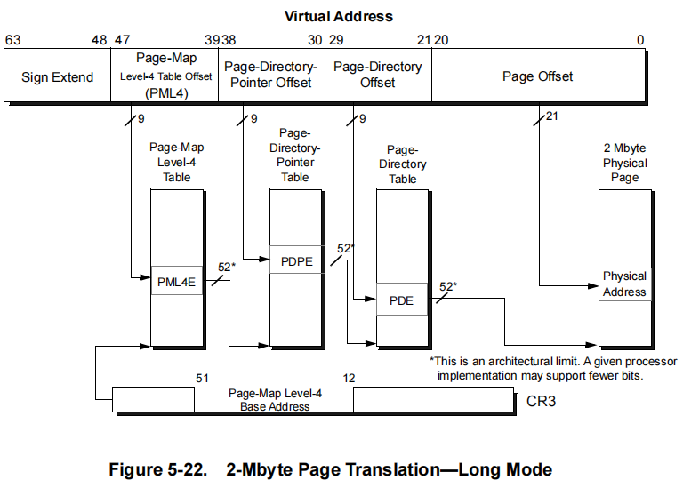

##### 1G页

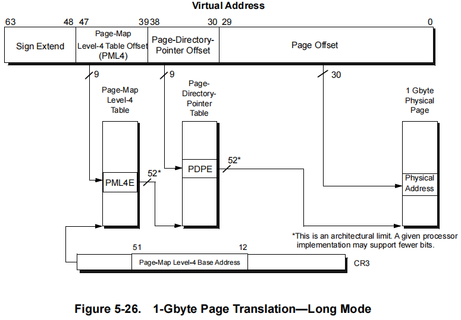

##### 页的区分

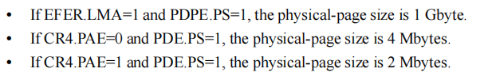

-   通过PAE来区分
-   ps = 0 就是 4K	

### 系统调用变化

-   以前的切换CR3还是可以用
-   64位不能内联汇编，但是有内部函数
-   多了2条指令   **SYSCALL / SYSRET**  只能64位模式下用

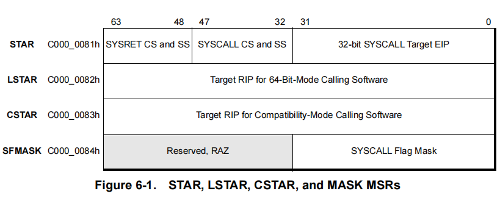

-   MSR寄存会自动切很多寄存器了
-   CS 和 SS 是相邻的
-   rdmsr  c0000082  查看函数地址
-   SDT变化很大，对他进行了加密，而且偏移超过了4个G，因为微软不想别人 hook 这个表
-   如果对 KiSysremCall64 函数 进行了修改，那么微软就会自动蓝屏，而且无法通过蓝屏文件找到蓝屏原因，这就是 PG保护


#### 32位App怎么调 系统调用

-   内核中的API是64位，32位的APi怎么调呢，32位的程序进内核以后调不了64的API
-   不可能内核中既做32位的API实现又做64位的API实现
-   微软做了一个 SysWow64的的子系统，他的重要目的是 32位的x86汇编调 x64位的 汇编


-   用x32dbg打开一个32位程序，可以发现通过调用门 调 33项 跳到一个地址，该地址用64位解析，所以此时调试器会崩，因为过不去，因为调试器是32位调试器
-   此时只有windbg才可以调，因为windbg会把寄存器全部切成64位的，其他的调试器做不到
-   r13就是64位的 peb
-   因为很多寄存器3环访问不了，所以微软就把很多环境保存在里面
-   32位到64位是从teb取一个地址通过门跳过去的，回去是从函数里面去一个地址（R14）跳回来，地址里面可能有一个门
-   在64位中栈不能模4，必须模16

```c++
// wow64.cpp : 此文件包含 "main" 函数。程序执行将在此处开始并结束。
//

#include <windows.h>


__declspec(naked) void GetValue() {
  __asm  {
    int 3
    push 33h     
    call $+5                  //当前地址+5 ，就是把 retf 的地址压栈
    add  dword ptr [esp], 5   //跳过retf，执行下面的代码
    retf                      //在3环也可以执行，只不过不会进行权限的切换，会从栈顶拿EIP给 当前的EIP，并且会从栈顶+4的位置拿CS给当前CS

    //mov rax, 10;
    _emit 48h       //前缀，把32位操作数扩展成64位
    _emit 0c7h
    _emit 0c0h
    _emit 10h
    _emit 00h
    _emit 00h
    _emit 00h

   //push 23
    _emit 6ah  
    _emit 23h

    //call $+5
    _emit 0e8h
    _emit 00h
    _emit 00h
    _emit 00h
    _emit 00h

    //add qword ptr ss:[rsp], 0x13    
    _emit 48h   
    _emit 83h  
    _emit 04h
    _emit 24h
    _emit 06h

    retf
    ret
  }
}

int main()
{

 GetValue();

  /*   用于调试32位到64位的代码
  HANDLE hFile;

  hFile = CreateFile("MYFILE1.TXT",           // open MYFILE.TXT 
    GENERIC_READ | GENERIC_WRITE,              // open for reading 
    FILE_SHARE_READ,           // share for reading 
    NULL,                      // no security 
    CREATE_NEW,             // existing file only 
    FILE_ATTRIBUTE_NORMAL,     // normal file 
    NULL);                     // no attr. template 

  if (hFile == INVALID_HANDLE_VALUE)
  {
    return 0;
  }

  DebugBreak();
  CloseHandle(hFile);
 */
  return 0;
}
```

#### 游戏保护

-   分析游戏要从搜内存入手，搜内存原理是遍历所有内存,但是我们可以把一些重要的数据(例如加密的key)放到 内核寄存器(例如 r8 )里面，从内核去读，读完再回来，这样就无法通过内存搜索到

#### wow64ext

-   他已经把代码注入，切换环境，遍历teb，拿64位模块基址都已经写好了，但是在win11还是有问题