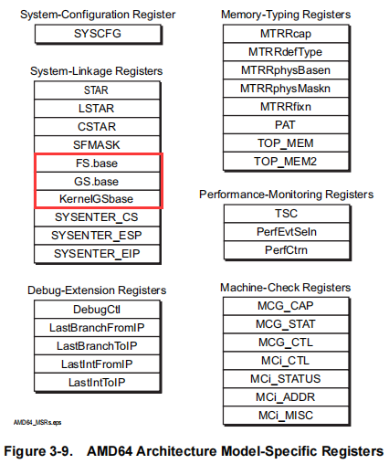
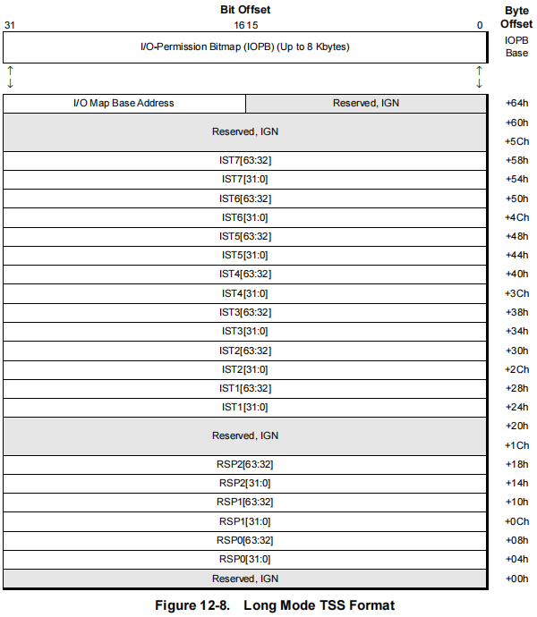
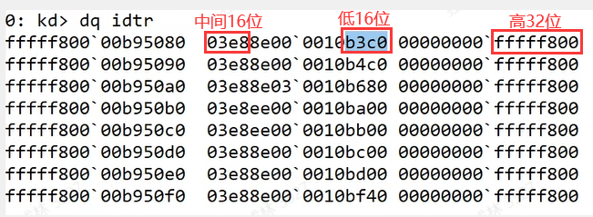
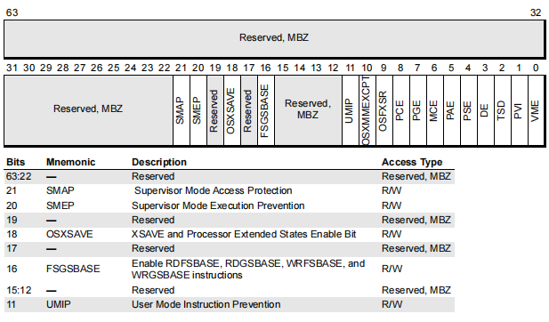
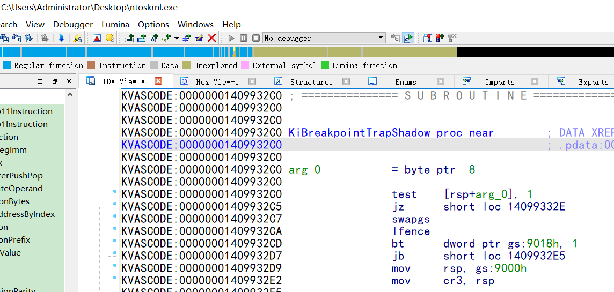

-   在64位中，段基址和段界限没用了



-   FS.base : C000_0100h         GS.base : C000_0101h        KernelGSbase : C000_0102h
-   64位不再是通过分段表查寻结构体地址，是直接吧结构体地址放到个寄存器里面
-   GS.base 是0环 GS的地址  KernelGSbase  是3环 GS的地址
-   rdmsr  C0000102 结果就是3环KPCR的地址  如果是3环程序是32位的 就是  rdmsr  C0000100
-   rdmsr  C0000101 结果就是0环KPCR的地址  
-   GS寄存器的值没用了，只是用于检查一下权限
-   swapgs 就是交换   GS.base   KernelGSbase  的值，从3环到0环或者从0环回到3环


#### TSS(任务状态段)的变化



-   32位里面没有系统作者用TSS来切换线程，最多只是用TSS来切栈，所以64位CPU里面只放栈，其他的都不放了
-   IST也是栈 ，里面放的是中断的栈

#### 中断表(IDT表)


-   中断门里面多了一个IST属性，如果终端想要用独立的栈，这里就放IST编号，产生中断时CPU就会根据编号去TSS里面去拿，即把把当前RSP，改成对应编号的 IST，如果没说，就是ESP0~ESP2中的一个，具体看几环
-   
-   所以地址为 fffff80003e8b3c0 可以通过  !idt  0 验证 
-   IDT表在64位中是不能被hook的

#### Patch Guard(pg) 保护

-   windows会检测核心代码段和常用的表的结构，如果发现被别人修改了，就会触发PG保护，直接蓝屏
-   对核心代码 和 核心表 进行保护，保护的是 .text段，他会算出一个 哈希值，内核运行的时候会去检测，如果发现校验值不对就直接蓝屏，而且检测时间随机不固定，idt表的修改他也会检测
-   这就代表在64中，改代码或者改表都会造成蓝屏
-   PG保护属于系统功能，不属于硬件功能，这就代表不能像32位那样随便HOOK

#### SMEP，SMAP保护

-   这个属于硬件保护
-   EP就是执行保护，AP就是访问保护,只有window8以上系统才有
-   3环的时候我们可以构造中断门(或者调用门)来执行 ring3 的 Shellcode，如果我们找到一个内核级的漏洞我们就可以王idt表或者gdt表里面写一个门，然后通过3环去调用这个门，这样我们可以以 ring0的权限去执行 ring3 的 Shellcode
-   这个保护可以开，可以关，开了可以屏蔽上面的漏洞
-   
-   这个开关在CR4寄存器的20位和21位
-   EP就是如果 CR4的 SMEP如果设为1，就是开启执行保护，中断门将不可以执行3环的代
-   例如下面代码。，在win7或者xp可以运行在win8以上，开了SMEP保护的话将无法运行

Gate.asm

```assembly

.code
GateEntry Proc
   mov rax,cr3
   iretq
GateEntry endp


CallGate Proc
   int 21h    //使用中断的第21号
   ret
CallGate endp
end

//需要先生成.obj文件，再放到项目中联合编译
```

Gate.cpp

```c++
#include <stdio.h>
#include <stdlib.h>
#include <windows.h>
extern "C" long long GateEntry();
extern "C" long long CallGate();

int main()
{
    SetProcessAffinityMask(GetCurrentProcess(), 2);  //让程序在第二核跑 
    printf("GateEntry=%p\n", GateEntry);             //获取函数地址
    long long ret = CallGate();
    printf("ret=%p\n", ret);
    system("pause");
    return 0;
}

```

-   需要在windbg上手动改程我们程序的地址（按照规则进行拼接成正确的）
-   我们只要想办法通过ShellCode 把这两个标志关了就可以绕过保护了
-   SMAP保护 就是3环的代码即使有0换的权限，也不可以访问0环的地址，就是执行了代码，去读0环的数据结构一样读不了，读不了内核的内存，但是有一条汇编指令  **stac** 可以取消 SMAP  保护

#### KPTI(内核分页隔离)

-   限制3环去访问内核的内存
-   程序运行在3环，通过漏洞得到0环权限，他去访问内存，CPU是通过CR3去查表，查出物理地址去访问
-   原理： 微软做了2个CR3，做了2个页表，运行在3环用的是3环的CR3，运行在0环，用的是0环的CR3

-   -   CR3  user
    -   CR3   kernel

-   这样在3环访问CR3时，得到的就是3环的CR3，读到内核的地址时，3环的CR3得到的页表没有映射，就是一个无效内存
-   正常调API如果CR3没有切换到内核就会有问题，因此我们只需要搞清楚切换流程，这个保护就很容易过
-   

```assembly

     test    [rsp+arg_0], 1
     jz      short loc_14099332E
     swapgs
     lfence
     bt      dword ptr gs:9018h, 1   ;不同系统的偏移是不一样的
     jb      short loc_1409932E5
     mov     rsp, gs:9000h
     mov     cr3, rsp
loc_1409932E5:                         
     mov     rsp, gs:9008h
     mov     gs:10h, rsi
     mov     rsi, gs:38h
     add     rsi, 4200h
     push    qword ptr [rsi-8]
     push    qword ptr [rsi-10h]
     push    qword ptr [rsi-18h]
     push    qword ptr [rsi-20h]
     push    qword ptr [rsi-28h]
     mov     rsi, gs:10h
     and     qword ptr gs:10h, 0

//因此只需要把这段代码加到我们代码里面就可以绕过这个保护了
```

 DSE(驱动强制签名) 

●病毒敢通过内核驱动干坏事是因为别人不知道他是谁

●因此微软就采用了数字签名，如果驱动没有数字签名，系统将拒绝加载

●一般是 rsa加密算法(公钥，私钥)  + 哈希值 (sha) 

●这个证书要CA来颁发

●加密者会拿私钥对哈希值进行加密，但是私钥不在证书上面，因此只能拿公钥去解密

●驱动验证是离线验证

●签名需要找微软购买

 测试模式 

●F8，然后以禁用驱程序签名强制  模式进入系统，这样就不要签名也能加载驱动，右下角会有一个log

●改注册表也可以进入测试模式

●测试模式安装需要驱动，驱动需要安装测试签名（设置里里面有）

●还可以通过软件 dseo13b.exe 设置

 绕过办法 

●对于攻击者来说，不可能购买签名

●由于微软是离线验证，所以有很多漏洞

1找黄牛购买签名

2证书是有可能过期，这种情况下系统会正常加载，所以在网上可以找到很多过期的签名

3证书是还可能吊销，，吊销之前的签名还是可以正常加载，因此在网上可以找到一大堆泄露的签名

4win10的签名更严格了，自己签名过后需要微软再签名一次，所以再win10上，驱动有2套签名，如果在驱动上藏恶意代码微软可能拒绝签名

●验不验证签名是有一个内核里的全局变量决定的，我们只要找到这个全局变量改成0就可以了  g_CiEnabled

●修改可以利用已签名的有该功能驱动去修改  (CE)

●修改可以利用已签名的驱动的漏洞去修改  (dsefix 就是利用驱动漏洞去关全局变量 通过扫特征码搜的全局变量)