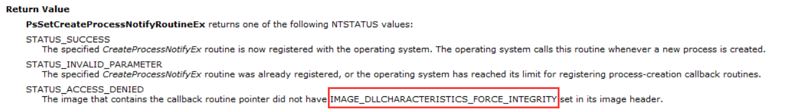
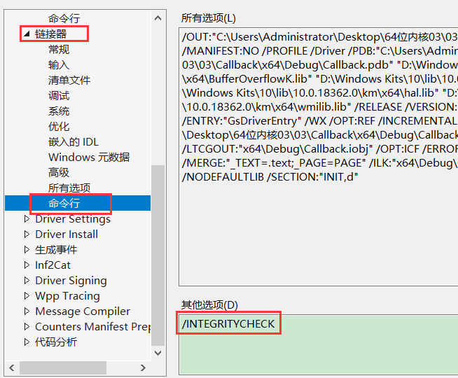

-   把一个驱动签名移到另一个驱动需要私钥,因为拿公钥去解密哈希值是不对的,哈希值根据程序得到的


-   微软并不希望其他人随便改系统东西,因此新增了很多保护
-   这样我们进内核什么事情也干不了,不管是杀毒软件还是游戏保护,因此微软提供了系统回调函数
-   系统回调函数: 要监控什么信息告诉系统,系统会帮我们监控,这件事情产生了系统就告诉我们,这样比我们自己做hook要稳定,而且他自己会更新,而且兼容所有版本
-   文件操作,网络操作都有自己独特的框架

### 监控进程创建

```c++
NTSTATUS  PsSetCreateProcessNotifyRoutine(
    IN PCREATE_PROCESS_NOTIFY_ROUTINE  NotifyRoutine,   //回调函数
    IN BOOLEAN  Remove    //卸载还是安装 ture 卸载   flase 安装
);
```

需要提供的回调函数

```c++
VOID  (*PCREATE_PROCESS_NOTIFY_ROUTINE) (
    IN HANDLE  ParentId,
    IN HANDLE  ProcessId,
    IN BOOLEAN  Create
);
```

#### 源码

```c++
#include <ntifs.h>
#include <ntddk.h>


VOID CreateProcessNotify(
  IN HANDLE  ParentId,
  IN HANDLE  ProcessId,
  IN BOOLEAN  Create) {
  UNREFERENCED_PARAMETER(ParentId);

  if (Create) {   //Create是真,代表创建进程
    DbgPrint("[51asm] Create Process pid:%d ProcessId:%d\n", PsGetCurrentProcessId(), ProcessId); // PsGetCurrentProcessId() 获取当前进程
  }
  else {       //Create是假,代表退出进程
    DbgPrint("[51asm] Exit Process pid:%d ProcessId:%d\n", PsGetCurrentProcessId(), ProcessId);
  }
}


VOID Unload(_In_ struct _DRIVER_OBJECT* DriverObject) {
  UNREFERENCED_PARAMETER(DriverObject);
  DbgPrint("Unload\n");
  PsSetCreateProcessNotifyRoutine(CreateProcessNotify, TRUE); //注销回调函数
}


NTSTATUS DriverEntry(
  __in struct _DRIVER_OBJECT* DriverObject,
  __in PUNICODE_STRING  RegistryPath)
{
  UNREFERENCED_PARAMETER(DriverObject);
  UNREFERENCED_PARAMETER(RegistryPath);

  DriverObject->DriverUnload = Unload;
  DbgPrint("DriverEntry\n");

  //监控进程创建
  NTSTATUS Status = PsSetCreateProcessNotifyRoutine(CreateProcessNotify, FALSE);  //注册回调函数
  DbgPrint("[51asm] PsSetCreateProcessNotifyRoutine Status:%p\n", Status);


  return STATUS_SUCCESS;
}
```

-   这个只是监控,并不能阻止,只适合做行为监控

### 阻止进程创建

```c++
NTSTATUS PsSetCreateProcessNotifyRoutineEx(
    IN PCREATE_PROCESS_NOTIFY_ROUTINE_EX  NotifyRoutine,
    IN BOOLEAN  Remove
);

//除了拦截以外,还能监控
```

回调函数

```c++
VOID CreateProcessNotifyEx(
    __inout PEPROCESS  Process,
    __in HANDLE  ProcessId,
    __in_opt PPS_CREATE_NOTIFY_INFO  CreateInfo
);
```

#### 源码

```c++
#include <ntifs.h>
#include <ntddk.h>


VOID CreateProcessNotifyEx(
  __inout PEPROCESS  Process,
  __in HANDLE  ProcessId,
  __in_opt PPS_CREATE_NOTIFY_INFO  CreateInfo
) {
  UNREFERENCED_PARAMETER(Process);
  if (CreateInfo != NULL) {    //指针不为空代表创建,否则代表退出
    DbgPrint("[51asm] Create Process pid:%d ProcessId:%d ImageFileName:%wZ\n", 
      PsGetCurrentProcessId(), ProcessId, CreateInfo->ImageFileName);
    CreateInfo->CreationStatus = STATUS_UNSUCCESSFUL;  //这里可以阻止进程创建,只要不等于0就是失败
  }
  else {
    DbgPrint("[51asm] Exit Process pid:%d ProcessId:%d\n", PsGetCurrentProcessId(), ProcessId);
  }
}


VOID Unload(_In_ struct _DRIVER_OBJECT* DriverObject) {
  UNREFERENCED_PARAMETER(DriverObject);

  DbgPrint("Unload\n");
  PsSetCreateProcessNotifyRoutineEx(CreateProcessNotifyEx, TRUE);    注销回调函数
}


NTSTATUS DriverEntry(
  __in struct _DRIVER_OBJECT* DriverObject,
  __in PUNICODE_STRING  RegistryPath)
{
  UNREFERENCED_PARAMETER(DriverObject);
  UNREFERENCED_PARAMETER(RegistryPath);

  DriverObject->DriverUnload = Unload;

  DbgPrint("DriverEntry\n");

  //监控进程创建
  DbgPrint("[51asm] CreateProcessNotifyEx:%p\n", CreateProcessNotifyEx);
  NTSTATUS Status = PsSetCreateProcessNotifyRoutineEx(CreateProcessNotifyEx, FALSE);  //注册回调函数
  DbgPrint("[51asm] PsSetCreateProcessNotifyRoutineEx Status:%p\n", Status);


  return STATUS_SUCCESS;
}
```




-   要使用Ex版本 该项必须打勾,这样系统就会验证这个驱动的签名
-   不能直接强行改PE格式,否则直接加载失败,而且写驱动的人不一定懂PE格式
-   因此得加上一个链接选项



-   测试签名也算签名
-   这个回调在xp就已经实现了,但是回调函数有一个数组数量上限只有8个,别的系统版本不一定是8个
-   拦截进程创建的难点在于时机,早了什么信息都没有,晚了进程已经创建了,拦截的最好时机就是进程已创建,但是还没运行起来
-   通过 WRK 可以看微软是如何实现的
-   如果我们把回调函数数组占满,那么其他人就无法注册回调函数
-   64位系统里面的对抗点就在回调函数数组上面,;例如可以把数组里面元素抹了,就无法监控了,或者发现自己函数地址不在数组就直接蓝屏
-   xp没人用的原因是因为没有EX版本只能监控,不能拦截
-   要想安全的函数一个回调函数,需要调API传函数地址去删


### 寻找回调函数

-   回调函数一直在变更新因此要寻找回调函数可以去官网查看 
-   https://learn.microsoft.com/zh-cn/windows-hardware/drivers/ddi/_kernel/
-   常见的回调函数

-   -   PsSetCreateProcessNotifyRoutine            监控创建进程
    -   PsSetCreateProcessNotifyRoutineEx        监控创建进程并可拦截
    -   PsSetCreateProcessNotifyRoutineEx2 	                         Windows 10 版本 1703开始可用
    -   PsSetCreateThreadNotifyRoutine             监控创建线程
    -   PsSetCreateThreadNotifyRoutineEx     	                        Windows 10开始可用
    -   PsSetLoadImageNotifyRoutine                  监控模块加载
    -   PsSetLoadImageNotifyRoutineEx                                         Windows 10 版本 1709开始可用
    -   CmRegisterCallback                                       监控注册表
    -   CmRegisterCallbackEx                                   监控注册表并带拦截
    -   ObRegisterCallbacks                                      监控句柄的操作

-   有的回调函数当前系统版本没有拦截功能,我们可以自己去拦截,例如可以改回调函数,让他直接返回一个错误码


#### 监控模块加载

```c++
#include <ntifs.h>
#include <ntddk.h>

//监控模块加载
VOID LoadImageNotify(
  IN PUNICODE_STRING  FullImageName,
  IN HANDLE  ProcessId, // where image is mapped
  IN PIMAGE_INFO  ImageInfo
  ) {
  UNREFERENCED_PARAMETER(ImageInfo);
  DbgPrint("[51asm] LoadImageNotify ProcessId:%d FullImageName:%wZ\n", ProcessId, FullImageName);
}


VOID Unload(_In_ struct _DRIVER_OBJECT* DriverObject) {
  UNREFERENCED_PARAMETER(DriverObject);

  DbgPrint("Unload\n");

  PsRemoveLoadImageNotifyRoutine(LoadImageNotify);

}


NTSTATUS DriverEntry(
  __in struct _DRIVER_OBJECT* DriverObject,
  __in PUNICODE_STRING  RegistryPath)
{
  UNREFERENCED_PARAMETER(DriverObject);
  UNREFERENCED_PARAMETER(RegistryPath);

  DriverObject->DriverUnload = Unload;

  DbgPrint("DriverEntry\n");

  NTSTATUS Status = PsSetLoadImageNotifyRoutine(LoadImageNotify);
  DbgPrint("[51asm] PsSetLoadImageNotifyRoutine Status:%p\n", Status);

  return STATUS_SUCCESS;
}
```

#### 监控句柄(对象)

-   可以通过拷贝句柄的方式绕开这个回调函数

```c++
#include <ntifs.h>
#include <ntddk.h>


UCHAR* PsGetProcessImageFileName(__in PEPROCESS Process);  //获取进程名 未公开,需要声明


PVOID g_RegistrationHandle = NULL;

VOID Unload(_In_ struct _DRIVER_OBJECT* DriverObject) {
  UNREFERENCED_PARAMETER(DriverObject);

  DbgPrint("Unload\n");

  ObUnRegisterCallbacks(g_RegistrationHandle);    //取消回调
}

//回调函数
OB_PREOP_CALLBACK_STATUS ObjectPreCallback(
  __in PVOID  RegistrationContext,
  __in POB_PRE_OPERATION_INFORMATION  OperationInformation
) 
{
  UNREFERENCED_PARAMETER(RegistrationContext);
  if (OperationInformation != NULL) {
    if (OperationInformation->ObjectType == *PsProcessType) {  //进程操作
      PEPROCESS Process = OperationInformation->Object;
      UCHAR* ImageFileNname = PsGetProcessImageFileName(Process);
      PEPROCESS Process2 = NULL;
      NTSTATUS Status = PsLookupProcessByProcessId(PsGetCurrentProcessId(), &Process2); //判断是不是自己打开自己
      
      if (NT_SUCCESS(Status)) {    
        if (Process == Process2) {     //自己打开自己就不拦截
          return OB_PREOP_SUCCESS;
        }

        if (strstr((const char*)ImageFileNname, "calc.exe") != NULL) 
        {
          DbgPrint("[51asm] ObjectPreCallback pid:%d ImageFileNname:%s\n", PsGetCurrentProcessId(), ImageFileNname);

          if (OperationInformation->Operation == OB_OPERATION_HANDLE_CREATE)
          { //创建
            OperationInformation->Parameters->CreateHandleInformation.DesiredAccess = 0;  //改为0代表拦截,什么权限都没有
          }
          else if (OperationInformation->Operation == OB_OPERATION_HANDLE_DUPLICATE) 
          { //拷贝
            OperationInformation->Parameters->DuplicateHandleInformation.DesiredAccess = 0;
          }
        }

        ObDereferenceObject(Process2);
      }
    }
    else if (OperationInformation->ObjectType == *PsThreadType) { //线程操作
    }
  }
  return OB_PREOP_SUCCESS;    //必须返回这个
}


NTSTATUS DriverEntry(
  __in struct _DRIVER_OBJECT* DriverObject,
  __in PUNICODE_STRING  RegistryPath)
{
  UNREFERENCED_PARAMETER(DriverObject);
  UNREFERENCED_PARAMETER(RegistryPath);

  DriverObject->DriverUnload = Unload;

  DbgPrint("DriverEntry\n");

 
  OB_CALLBACK_REGISTRATION ObReg = {0};    //创建对象
  
  OB_OPERATION_REGISTRATION obOper[2] = {0};   //监控的行为
  obOper[0].ObjectType = PsProcessType;        //监控操作类型
  obOper[0].Operations = OB_OPERATION_HANDLE_CREATE | OB_OPERATION_HANDLE_DUPLICATE;    //什么操作
  obOper[0].PreOperation = ObjectPreCallback;  //监控是在操作之前   
  obOper[0].PostOperation  = NULL;             //监控是否在操作之后
  obOper[1].ObjectType = PsThreadType;
  obOper[1].Operations = OB_OPERATION_HANDLE_CREATE | OB_OPERATION_HANDLE_DUPLICATE;
  obOper[1].PreOperation = ObjectPreCallback;
  obOper[1].PostOperation = NULL;


  ObReg.Version = OB_FLT_REGISTRATION_VERSION;         //版本信息
  ObReg.OperationRegistrationCount = 2;                //监控的行为数量
  RtlInitUnicodeString(&ObReg.Altitude, L"320000");    //序列号,不同的序列号的时间不一样
  ObReg.RegistrationContext = NULL;                    //需不需要额外传递参数
  ObReg.OperationRegistration = obOper;               //把监控行为数组填到结构体

  NTSTATUS Status = ObRegisterCallbacks(&ObReg, &g_RegistrationHandle);   //会返回一个指针(传出参数),用于取消回调
  DbgPrint("[51asm] ObRegisterCallbacks Status:%p\n", Status);


  return STATUS_SUCCESS;
}
```

