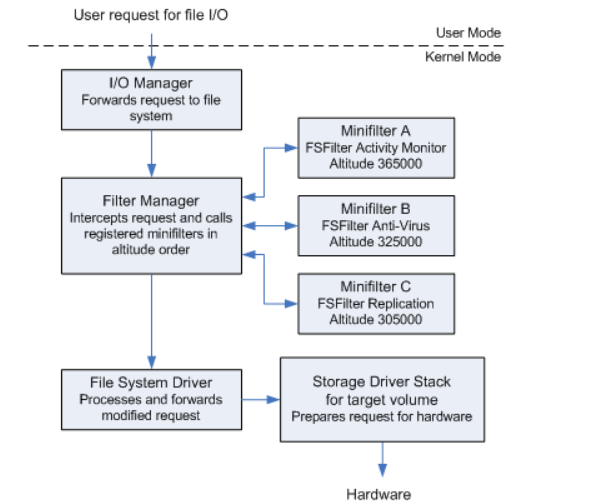
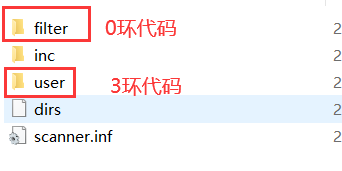

-   过滤驱动最大的问题就是下一层驱动不是我们写的,所有有些Irp的处理方式我们不太熟悉,还有就是数据结构不是很清楚
-   一般复杂的设备还有设备扩展,可以为每一层设备创建一个独立的区域,用来保存额外的信息
-   除非微软,没人能写好过滤驱动
-   我们hook一些关键硬件,比如键盘,网络,文件等,这些驱动都是微软写的
-   小端口驱动,由硬件厂家完成的驱动的很小一部分功能,如网卡驱动
-   所有创建设备对象的驱动都可以过滤


## FSD过滤驱动

-   File System Driver Filter  文件系统过虑驱动
-   如果我们把硬盘的驱动全部过滤了,那我们就可以监控文件的所有操作
-   用途: 

-   -   1.   反病毒（主动防御）
    -   2.   硬盘加密（key)  : 如果对硬盘数据进行写入,可以把数据加密再写入硬盘,读文件的话把文件数据在解密给用户,这样数据在这台电脑是没问题的,在其他电脑上都是加密的
    -   3.   沙盒(VirtualBox)  :系统还原精灵,可以重定位系统操作

-   硬盘有多种格式,一般格式化为 NTFS 格式,还有U盘,因此微软做了一堆驱动来支持不同格式
-   不管什么磁盘格式.最终提供的设备接口就是 RawDisk   ,对这个设备名下过滤驱动就可以了
-   如果考虑光盘就得过滤  RawCdRom
-   磁盘的格式比较复杂,不同的格式方法不一样,但是一般都是树结构,所以他的Irp不好处理,数据不好拿
-   还有第二个难点就是u盘,插入U盘需要监控里面的文件,我们需要时时刻刻监控什么时候多了一个U盘设备,而且U盘可以插多个,我们就得  **IoAttachDeviceToDeviceStack**    多次 ,而且拔掉U盘还得  **IoDetachDevice** 
-   还有一个难点就是缓存,往文件写数据并一定会马上写入硬盘,为了效率问题,一般先放到缓存,在关闭文件时写入硬盘,缓存是不走派遣函数的,缓存的操作是走 FastIoDispatch 里面的回调函数
-   但是微软写了一份文件过滤驱动的源码,会监控文件的打开和关闭操作
-   我们一般做了过滤驱动以后要申请内存保存驱动信息,并且每发起一次Irp请求都得申请一次这个结构体,请求完成就得释放,就会在内存里面产生很多内存碎片,就可能造成明明有内存,别人却申请不到,但是通过  **ExInitializePagedLookasideList**函数 可以单独分配一块内存区域,申请内存就从这块区域申请,这样就不会产生内存碎片,释放也在这块区域释放.,如果区域大小不够,系统会自动自动增加内存大小
-   使用 **ExInitializePagedLookasideList**函数 申请内存大小的情况

-   -   申请固定大小的内存
    -   频繁申请和释放

-   申请的时候先初始化一个  **ExInitializePagedLookasideList**  链表,申请的时候就往 ExAllocateFromPageDLookasideLis 里面申请
-   一般我们在内核中要保存的信息都是大小固定的结构体的,因此可以用

#### 微软源码

-   [📎SFilter.zip](./SFilter.zip)
-   微软的文件过滤驱动源码有很大作用,他想我们展示了怎么给任意设备强制发Irp请求
-   而且很多过滤驱动都可以参考这份源码来实现
-   2159~2175 行就是过滤的代码,我们写过滤驱动者此处代码就可以了,所有信息已经帮我们处理好了
-   可以用  **Windows Driver Kits**  进行编译


#### 磁盘加密源码

-   [📎tooflat_sfilterencrypt.zip](./tooflat_sfilterencrypt.zip)

####   

-   上面的框架太复杂,因此微软重新做了一套框架
-   而且上面框架没有考虑把通知给3环,然后根据3环的请求决定让不让它过

## miniFilter 

-   让向系统回调那样方便使用过滤驱动,这个框架新版本才能用
-   
-   设计



-   基本把以前文件过滤驱动的所有难点都解决了
-   他会拦截所有发给文件驱动的所有Irq请求
-   他有一个序列号,调用的时间不同,序列号就不同
-   在老版本的过滤驱动,如果我们挂载驱动,如果做磁盘加密,应该挂在最底层,因为最后加密数据的时候需要我们加密解密,但是如果是做反病毒软件,则希望挂载在最上层,因此不同的软件要挂载的层次是不一样的,但是我们 **IoAttachDeviceToDeviceStack**  的时候不能保证我们挂载的位置,那么 miniFilter 里面提供了序列号,来保证我们调用的时机,序列号取决于我们的驱动类型
-   而且我们随时安装卸载不会蓝屏 
-   简化我们的过滤驱动的写法,就调几个api,注册一个回调函数就可以了,要监控什么就注册什么什么回调
-   而且支持直接将监控的数据直接通知3环用户程序,并且十分高效.3环不需要跟驱动通讯,就可以收到所有事件,即在3环里面掉一个api就可以拿到内核监控到的所有信息,并且考虑到了多线程问题
-   因此 miniFilter  把我们想做的所有事情都考虑到封装好了,并且32和64位通用
-   微软的wdk安装包里面写好了   miniFilter   的例子我们可以根据 这个例子来写自己的过滤驱动

#### 例子源码

-   [📎nullFilter.zip](./nullFilter.zip)
-   miniFilter   所有的API 都是以  FLT_  开头

注册的API

```c++
NTSTATUS   FltRegisterFilter(
    IN PDRIVER_OBJECT  Driver,    //驱动对象
    IN CONST FLT_REGISTRATION  *Registration,   //过滤的东西,过滤什么就写什么回调
    OUT PFLT_FILTER  *RetFilter    //句柄
 ); 

// 过滤的东西填 FLT_OPERATION_REGISTRATION 结构体就好了

typedef struct _FLT_OPERATION_REGISTRATION {
  UCHAR  MajorFunction;
  FLT_OPERATION_REGISTRATION_FLAGS  Flags;
  PFLT_PRE_OPERATION_CALLBACK  PreOperation;    //之前的回调
  PFLT_POST_OPERATION_CALLBACK  PostOperation;  //之后的回调
  PVOID  Reserved1;
} FLT_OPERATION_REGISTRATION, *PFLT_OPERATION_REGISTRATION;
```

-   调上面的API就注册好了过滤驱动 
-   开始过滤调用  **FltStartFiltering**  函数就可以了
-   卸载的时候通过 **FltUnregisterFilter** 取消过滤就可以了


#### 跟3环通讯的例子

-   [📎scanner.zip](./scanner.zip)


-   
-   这个例子的功能就是在驱动里面会监控一些特殊的指定的后缀名,例如 XXX.txt  XXX.doc的文件,如果往里面写入 foul 就拒绝,当然写入的内容有3环控制,即3环可以拒绝往什么后缀名的文件写入什么数据,还可用于PE格式,例如任何一个人往磁盘释放一个PE头 都不允许,即这个例子就是一个主动防御的例子

##### 内核代码

```c++
$入口和刚才的框架一样,注册然后开始监控,但是注册的时候它填了回调,Callbacks$
const FLT_REGISTRATION FilterRegistration = {
    sizeof( FLT_REGISTRATION ),         //  Size
    FLT_REGISTRATION_VERSION,           //  Version
    0,                                  //  Flags
    ContextRegistration,                //  Context Registration.
    Callbacks,                          //  回调
    ScannerUnload,                      //  FilterUnload
    ScannerInstanceSetup,               //  InstanceSetup
    ScannerQueryTeardown,               //  InstanceQueryTeardown
    NULL,                               //  InstanceTeardownStart
    NULL,                               //  InstanceTeardownComplete
    NULL,                               //  GenerateFileName
    NULL,                               //  GenerateDestinationFileName
    NULL                                //  NormalizeNameComponent
};
$Callbacks就填要监控什么操作,在之前还是之后,数组的大小自己决定$
const FLT_OPERATION_REGISTRATION Callbacks[] = {

    { IRP_MJ_CREATE,//监控创建
      0,
      ScannerPreCreate, //之前
      ScannerPostCreate},//之后
    { IRP_MJ_CLEANUP,//监控Cleanup,关闭的时候可能会刷缓存
      0,
      ScannerPreCleanup,
      NULL},
    { IRP_MJ_WRITE,//监控写入
      0,
      ScannerPreWrite,
      NULL},
    { IRP_MJ_OPERATION_END}//加上这个标志就表示不监控了
};
$注册完就要创建一套机制和3环通讯,它在内核驱动里创建了一个完成端口$
	        status = FltCreateCommunicationPort( ScannerData.Filter,
                                             &ScannerData.ServerPort,
                                             &oa,
                                             NULL,
                                             ScannerPortConnect,
                                             ScannerPortDisconnect,
                                             NULL,
                                             1 );
$完成端口要给个名字,方便3环去打开$
	const PWSTR ScannerPortName = L"\\ScannerPort";
	RtlInitUnicodeString( &uniString, ScannerPortName );
$3环只要打开这个完成端口,就能直接读写数据了,完成端口是很高效的,没有数据就会自动挂起线程$

$打开文件之前回调$
FLT_PREOP_CALLBACK_STATUS
ScannerPreCreate (
    __inout PFLT_CALLBACK_DATA Data,
    __in PCFLT_RELATED_OBJECTS FltObjects,
    __deref_out_opt PVOID *CompletionContext
    )
{
    UNREFERENCED_PARAMETER( FltObjects );
    UNREFERENCED_PARAMETER( CompletionContext );
    PAGED_CODE();
    //判断是不是自己的线程是不是自己打开文件.然后就没做啥了
    if (IoThreadToProcess( Data->Thread ) == ScannerData.UserProcess) {
        DbgPrint( "!!! scanner.sys -- allowing create for trusted process \n" );
        return FLT_PREOP_SUCCESS_NO_CALLBACK;
    }
    return FLT_PREOP_SUCCESS_WITH_CALLBACK;
}


$写入文件之前回调$
写之前就代表要拦截了
和3环通讯的结构体,结构体需要自己定义
typedef struct _SCANNER_NOTIFICATION {
    ULONG BytesToScan;    //字节数
    ULONG Reserved; 
    UCHAR Contents[SCANNER_READ_BUFFER_SIZE];//写的内存数据,固定长度的数组
} SCANNER_NOTIFICATION, *PSCANNER_NOTIFICATION;


3环回复的结构体
typedef struct _SCANNER_REPLY {
    BOOLEAN SafeToOpen; //是否允许
} SCANNER_REPLY, *PSCANNER_REPLY;

把结构体数据发送给3环,使用FltSendMessage函数
    status = FltSendMessage( ScannerData.Filter,
                             &ScannerData.ClientPort,
                             notification,
                             sizeof( SCANNER_NOTIFICATION ),
                             notification,
                             &replyLength,
                             NULL );
如果这个函数返回了就把这个缓冲区强转成3环回复的结构体,然后判断一下,是否允许
    if (STATUS_SUCCESS == status) {   //允许就正常走
       safe = ((PSCANNER_REPLY) notification)->SafeToOpen;
   } else {
       DbgPrint( "!!! scanner.sys --- couldn't send message to user-mode 
                    to scan file, status 0x%X\n", status );
   }

所以它和3环通讯就是用FltSendMessage函数,发送接收直接都搞定了
```

##### 3环代码

```c++
requestCount = atoi( argv[1] );  //首先会传递一个命令行参数
做主动防御有一个问题,就是让用于决定是否是允许的事件特别多, 自己可以决定开多少个线程来处理这个事件


//连接完成端口
hr = FilterConnectCommunicationPort( ScannerPortName,
                                         0,
                                         NULL,
                                         0,
                                         NULL,
                                         &port );

//创建完成端口
completion = CreateIoCompletionPort( port,
                                     NULL,
                                     0,
                                     threadCount );

//根据命令行参数创建线程

//等待线程结束
WaitForMultipleObjectsEx( i, threads, TRUE, INFINITE, FALSE );


//线程回调函数里面
//看完成端口状态,有错误信息就退,没有就拿数据
result = GetQueuedCompletionStatus( Context->Completion,&outSize,&key &pOvlp,INFINITE );

//从内核端口拿数据
hr = FilterReplyMessage( Context->Port,
                        (PFILTER_REPLY_HEADER) &replyMessage,
                         sizeof( replyMessage ) );
```

-   编译好后就可以加载驱动了,但是硬件驱动一般都用inf文件加载
-   微软已经写好了inf文件,可以通过写这个脚本就能直接安装驱动了,可以在微软官网查看inf的写法
-   它会把硬件驱动自动拷贝到系统目录,并且自动安装.直接右键安装就行...
-   但是启动要自己启动了,通过命令行自己启动.  

-   -   net start scanner(驱动名称)

-   停止的话也是

-   -   net stop scanner

-   inf没提供卸载功能,但是它卸载的脚本也是写了的.对于硬件驱动来说把它卸载了的话就直接蓝屏了,所以它不提供
-   卸载函数.所以inf想卸载就要通过命令行来卸载了

-   -   RUNDLL32.EXE SETUPAPI.DLL,InstallHinfSection DefaultUninstall 132      .inf文件路径

-   使用驱动加载工具加载的话,它是不会拷贝到系统目录的.