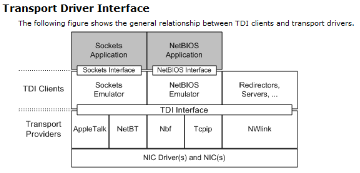
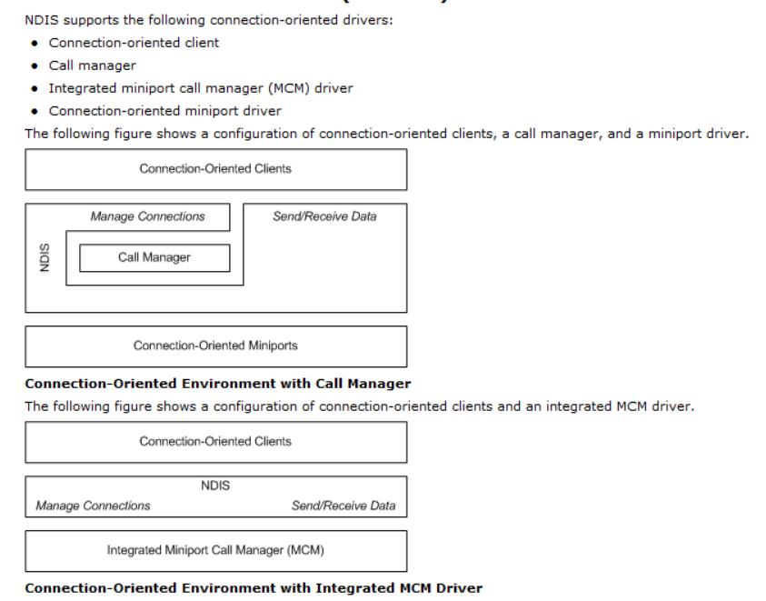
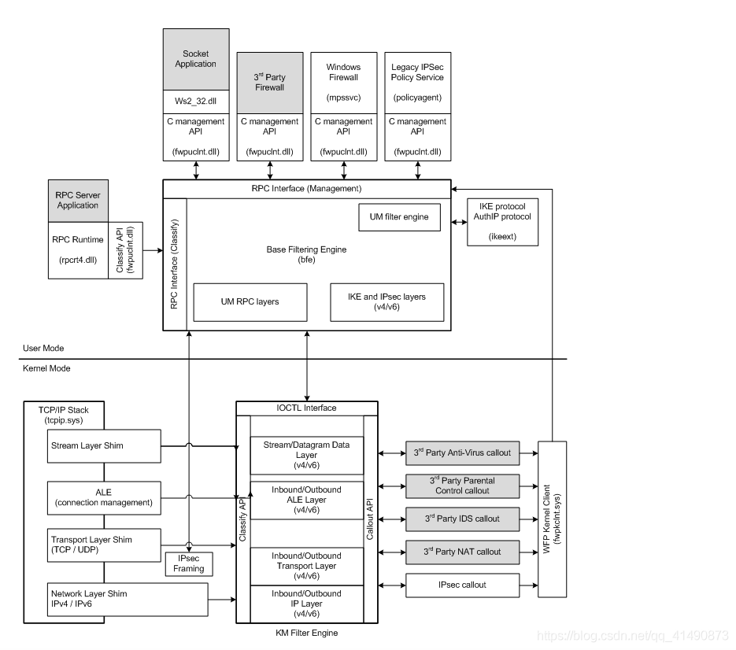
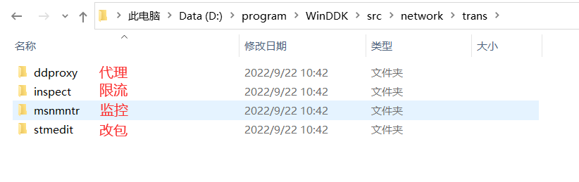

-   网络监控可以实现的功能

-   -   限流
    -   防火墙 
    -   反病毒（行为监控,拦截发包 更关心发包的进程)
    -   代理:  某个网址自己的电脑ip无法连接,可以通过另一台电脑去转发,原理是有一个软件发起连接要把服务器的地址换成你代理服务器的地址,代理服务器的地址再去转发这个数据,原理是替换ip地址,使用代理有风险,数据有可能被代理服务器监控
    -   抓包
    -   改包: 例如原先数据包的长度是 4 ,我们改成4G,这样服务器可以把服务器内存耗光,他就崩了;如果服务器没考虑同步问题,我们可以同时发多个包,游戏刷钱就是这个原理

-   网络监控分为ring3 和 ring0 : ring3监控有局限性

### 监控网络方法

-   Hook  api

-   -   socket
    -   connect
    -   send/sendto
    -   recv/recvfrom

-   但是内核里面没有这些API,因为 OSI 7层模型
-   TCPIP把有的层合并了,只剩下四层

1.  应用层
2.  传输层
3.    网络层
4.  物理层

-   其中2,3层归操作系统来做,微软每一层都有一套对应的驱动
-   最上层的就是传输层,传输层要跟应用层的  socket 通信,因此他们之间的通讯要规范一套接口
-   socket <=>   TDI(tcpip.sys tdi.sys http.sys tdx.sys)   <=>  NDIS（ndis.sys）   <=>  网卡
-   不同版本上的传输层的驱动是不一样的
-   因此3环发的包直接跟驱动通信了,所以找不到前面提到的API
-   跟驱动通讯就是发送一个Irq请求,没有函数实现,然后系统就根据协议决定跟传输层通讯,因此要为一下传输层协议创建设备对象
-   因此如果我们要拦截 Tcp 就可以在Tcp设备上下一个过滤驱动,如果要拦截udp,可就在udp设备上下,在这一层下的好处是不关心他具体驱动是哪一个,因为设备名是固定的

-   

### TDI过滤驱动

-   要抓什么协议,就过滤什么设备就可以了

### NDIS过滤驱动

-   [📎passthru.zip](./passthru.zip)
-   物理层是由网卡厂家来做,网卡厂家跟么跟网络层通讯呢,所以微软需要定义一套接口,接口规范理论上由微软说了算,但是微软并不懂网卡,因此就找所有网卡厂家定义了一套规范接口,这套接口就是   NDIS
-   NDIS 有不同的版本,使用时候需要注意,他有5.1和6.0各版本,因此我们hook要根据系统版本决定是用5.1还是6.0的,微软例子里面有什么系统对应什么版本(xp是5.1,win7之后是6.0)
-   

-   因此我们要实现一个过滤驱动有2种方案

1.  TDI过滤驱动 

1.  1.  最顶层,因此有进程信息,可以知道包是哪个进程发出的,可以拿到 EPROCESS
    2.  过滤规则放在配置文件里面.3环可以读这个配置文件,通过给驱动发控制码.把规则告诉驱动,驱动就可以根据规则去拦截

1.  NDIS过滤驱动

1.  1.  因此在最底层,因此没有进程信息,但是有ip地址,端口等

-   如果做杀毒软件,反病毒在  TDI 层比较好
-   如果做抓包软件 在 NDIS 层比较好
-   有课时候可能有既要抓包,又要知道他是哪个进程的,那可以结合使用,2层都hook 
-   这个过滤驱动并不好写.因为协议很复杂
-   NDIS过滤驱动在WDK种写了很多例子,但是 TDI 的没有,因为微软主推的是 NDIS,但是TID可以通过开源的防火墙源码来了解
-   第3方的开源软件代表稳定性没那么好,不能兼容所有版本(主要不能兼容高版本的64位,32位很稳定)
-   防火墙参考源码(TDI过滤驱动参考)[📎tdifw-1.4.4.zip](./tdifw-1.4.4.zip)

#### wireshark源码

[📎wireshark-master.zip](./wireshark-master.zip)

### WFP框架

-   现在的主流框架

-   3环也能使用,但是功能没有0环强大
-   自带规则引擎,即规则微软都做好了
-   

### 保护(绕过)方法

-   程序不用 socket 直接向 NDIS 发包
-   拦截上一层直接走底层,绕过监控
-   如果可以进内核更简单,可以删除对方的监控
-   监控是有规则的,可以找到监控遗漏的规则来进行通讯