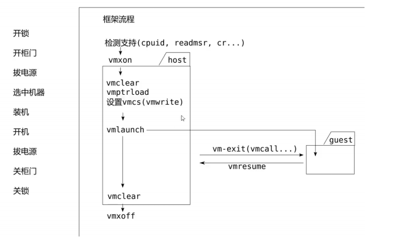
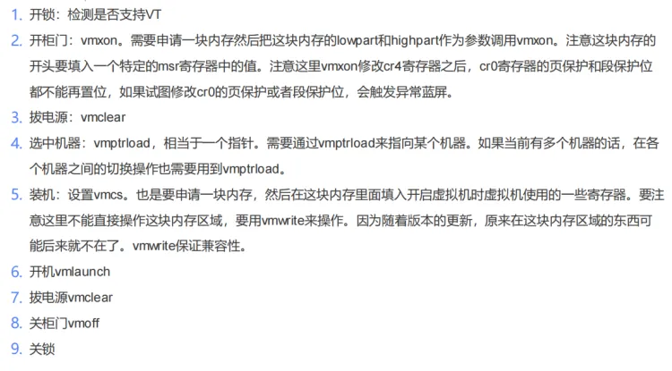

-   PG保护虽然能过,但是只限于当前版本,如果版本不断更新,可能会失效
-   SoftICE 就是以前一款比较好的内核调试软件,随着微软的一直更新,所以放弃了,因为他也要一直更新
-   PG保护的优势在于攻击者没有问题,因为攻击者可以不更新系统,只要产品支持该系统,他就可以攻击,作为保护者,它需要兼容各个版本,所以就不敢过PG

## VT

-   即 vmx  虚拟机
-   模拟器:  模拟器里面用的CPU,主板,显示器跟我们的真机是不相同的,因此我们把模拟器里面的程序代码拷贝到真机上肯定是不能运行的,因为指令集都不一样,那怎么让他在真机上跑起来呢,我们可以用代码来模拟出他的硬件

例如:  模拟器的寄存器是 A0 ~ A8

假设指令集                      01 00 01 00  

在真机里面是           => mov ax, 0x0001  

在模拟器里面就是   =>  mov A0, 0x0001

1.  首先就是模拟CPU

```c++
strcut VirtualCPU {
 short A0;
 short A1;
 short A1;
 short A1;	
 ......
 short IP;	
};

//用结构体表示CPU的寄存器环境
```

1.  我们自己申请一段内存 memory ,把文件代码读到 VirtualCPU   context;
2.  接下来就是把  context.ip = memory addr;    即把文件读进内存,再把内存地址给ip
3.  接下来就是模拟器入口,取指令,译码

vmloop:     //循环处理指令

取指令 => 01 

译码  => 00 01 00  => A0, 0x0001

执行  => context.A0 = 0x0001

JMP vmloop:

-   不同的模拟器可能用不同的CPU,我们可以做成一个框架,不同的模拟器把 CPU结构体 换了就可以了,这样就可以模拟不同的cpu


-   一台机器可能不止一个CPU,我们代码执行的时候还会产生 I/O , I/O就是对硬件设备进行操作,例如操作硬盘进行读写文件
-   就会产生中断指令,那我们收到这条指令后就去真实硬盘的某个地方去读写
-   I/O => 硬件设备   =>  硬件  => xxx .    硬件主要是3个设备  CPU    显卡    声卡
-   不模拟就是在循环处理指令指令时不管他就行了
-   换模拟器的程序就是把内存里面的代码换一下就行了
-   这样我们模拟任何硬件都可以,用代码模拟硬件功能

#### 缺点

-   跟真机相比 运行速度慢 ,因为真机操作的是寄存器,而模拟器操作的是内存
-   我们定义的结构体是一个局部或者全局变量,一般是局部变量,因为可以开很多模拟器,或者用堆
-   现在电脑性能很强,所以模拟器就可以可以让人感觉不到卡


#### VT 处理器虚拟化技术

-   如果卡到一定程度,虚拟机是没什么价值的
-   那则么解决卡的问题呢? 那就是真实的cpu去模拟执行我们需要执行的代码,这样就基本和针真机一样了,打开办法就是在虚拟机设置处理选项,勾选上 VT
-   这样代码就是用真实cpu去跑的,这样就有一问题,那就是跟真实的机器就会产生冲突,因此模拟一个模拟器的话,VT实现不了,因为cpu指令不一样(除非模拟器的指令是 intel 的指令集)
-   让CPU去模拟执行其操作系统的代码是有冲突的,VT就是解决这个冲突问题的
-   CPU单核跑多个软件就是线程调度
-   所以虚拟机可以通过机器调度来实现多虚拟机运行

##### 运用

1.  实现虚拟机
2.  云计算机      可以将一台性能非常强大的计算机,通过VT技术,创建出多个自己需要的各种配置的服务器,而且随时调整服务器配置,但是缺点是服务器里面的东西都在别人电脑上

##### ring -1

-   intel要实现这一套虚拟化技术有一个问题,一般机器的代码是运行在 ring0,0环属于最高权限,要切换机器就要打断这台机器正在执行的代码,因此必须要给CPU一个比0环更高的权限级别才能打断0还的代码,即ring -1(-1环),因此开启VT以后,CPU将进入 -1 环,切换机器的时候他可以在0环跑,-1环权限 比0环高,因此随时以可打断正在执行的代码切换到另一台机器
-   ring -1 有多种叫法,例如 0环叫做 root ,-1环就叫做 non-root  还有一种叫法是 0环是 guest  -1环是 vmm 或
-   者 host

-   当进入VT模式以后,真机就运行在 guest 模式,产生事件以后,cpu就进入 host 模式,然后在host 可以切换到不同的机器

##### MSR欺骗

-   我们可以通过intel提供的特殊指令可以让cpu进入VT模式.当前正在执行的系统代码就会进入 guest 模式,而我们的代码在 host模式,这时候如果我们用驱动写的代码,那我们的代码权限比系统要高,接下来执行guest 所有代码的时候,CPU都会通知我们,这样我们就可以监控这台机器所执行的所有汇编
-   例如我们要监控机器执行的所有  rdmsr   指令(可以读到 SycallEntry 系统调用的入口地址),那么当它进入 guest 模式以后,他如果掉了  rdmsr  指令就会进入host模式,那么这台机器读的 rdmsr   ,他就会问寄存器要给什么值 ,我们就给他原来的值,  rdmsr  中  SycallEntry  这个寄存器被用 是由   sysenter(系统调用)  指令造成的,这条指令我们也可以监控
-   sysenter  xxxx   msr eip = MySycallEntry -> jmp SycallEntry   这样就做了一个 hook
-   PG代码会去检测  msr 验证msr的eip是否被改过,就会陷入 host 模式,于是我们就给他一个真的,那么它在执行令的时候拿的代码地址是假的,就是利用VT的功能去欺骗真实的操作系统代码寄存器的值,这就叫做MSR欺骗
-   这种hook方式虽然简单,但是他只能hook   msr,   也就是只能hook所有通过msr 调用的api ,例如内核里面的API 不走msr,直接走nt,就没办法hook,内核的函数也没办法hook,但是如果只是想hook 3环调用的API,hook msr就够用了

##### EPT  扩展页面  Exten Page Table

-   在64位CPU里面我们页表有四个,每台机器都应该用自己的页表,CPU就得通过CR3去查表,这个表由我们来提供,这个表就是 EPT 表
-   我们可以做2个页表,假设我们对原来系统 SycallEntry   第一行代码改成 jmp,会被pg检测出来,当机器读内存的时候就都原来的代码,,机器要执行代码的时候就换成第二个表,我们可以该第二个表的代码,这样从内存读代码就是正常的,执行代码时候用的是新的代码.这就是 EPT hook
-   EPT hook的代码地址没有限制,每个内存地址都可以骗


## VT框架

-   需要为每一台机器准备寄存器环境,还得位host机器准备寄存器环境
-   很多代码只能联合编译或者尽量用内部函数
-   

### 课堂代码

```c++
-----------------vt.h----------------

#pragma once

#include <ntifs.h>
#include <Ntddk.h>
#include <stddef.h>

/*MSR definition*/
#define MSR_IA32_VMX_BASIC              0x480
#define MSR_IA32_FEATURE_CONTROL 		0x03a
#define MSR_IA32_VMX_PINBASED_CTLS		0x481
#define MSR_IA32_VMX_PROCBASED_CTLS		0x482
#define MSR_IA32_VMX_EXIT_CTLS          0x483
#define MSR_IA32_VMX_ENTRY_CTLS         0x484

#define MSR_IA32_SYSENTER_CS            0x174
#define MSR_IA32_SYSENTER_ESP           0x175
#define MSR_IA32_SYSENTER_EIP           0x176
#define MSR_IA32_DEBUGCTL               0x1d9

#define MSR_EFER                        0xc0000080          /* extended feature register */
#define MSR_STAR                        0xc0000081          /* legacy mode SYSCALL target */
#define MSR_LSTAR                       0xc0000082          /* long mode SYSCALL target */
#define MSR_CSTAR                       0xc0000083          /* compatibility mode SYSCALL target */
#define MSR_SYSCALL_MASK                0xc0000084          /* EFLAGS mask for syscall */
#define MSR_FS_BASE                     0xc0000100          /* 64bit FS base */
#define MSR_GS_BASE                     0xc0000101          /* 64bit GS base */
#define MSR_SHADOW_GS_BASE              0xc0000102          /* SwapGS GS shadow */

typedef struct {
    unsigned PE : 1;
    unsigned MP : 1;
    unsigned EM : 1;
    unsigned TS : 1;
    unsigned ET : 1;
    unsigned NE : 1;
    unsigned Reserved_1 : 10;
    unsigned WP : 1;
    unsigned Reserved_2 : 1;
    unsigned AM : 1;
    unsigned Reserved_3 : 10;
    unsigned NW : 1;
    unsigned CD : 1;
    unsigned PG : 1;
    //unsigned Reserved_64:32;
}_CR0;

typedef union {
  struct {
    unsigned VME : 1;
    unsigned PVI : 1;
    unsigned TSD : 1;
    unsigned DE : 1;
    unsigned PSE : 1;
    unsigned PAE : 1;
    unsigned MCE : 1;
    unsigned PGE : 1;
    unsigned PCE : 1;
    unsigned OSFXSR : 1;
    unsigned PSXMMEXCPT : 1;
    unsigned UNKONOWN_1 : 1;		//These are zero
    unsigned UNKONOWN_2 : 1;		//These are zero
    unsigned VMXE : 1;			//It's zero in normal
    unsigned Reserved : 18;		//These are zero
    //unsigned Reserved_64:32;
  }flags;
  long cr4;
}_CR4;


typedef struct {
    unsigned SSE3 : 1;
    unsigned PCLMULQDQ : 1;
    unsigned DTES64 : 1;
    unsigned MONITOR : 1;
    unsigned DS_CPL : 1;
    unsigned VMX : 1;
    unsigned SMX : 1;
    unsigned EIST : 1;
    unsigned TM2 : 1;
    unsigned SSSE3 : 1;
    unsigned Reserved : 22;
}_CPUID_ECX;

typedef struct _IA32_FEATURE_CONTROL_MSR
{
  unsigned Lock : 1;		// Bit 0 is the lock bit - cannot be modified once lock is set
  unsigned Reserved1 : 1;		// Undefined
  unsigned EnableVmxon : 1;		// Bit 2. If this bit is clear, VMXON causes a general protection exception
  unsigned Reserved2 : 29;	// Undefined
  unsigned Reserved3 : 32;	// Undefined

} IA32_FEATURE_CONTROL_MSR;

typedef struct _VMX_BASIC_MSR
{
  unsigned RevId : 32;
  unsigned szVmxOnRegion : 12;
  unsigned ClearBit : 1;
  unsigned Reserved : 3;
  unsigned PhysicalWidth : 1;
  unsigned DualMonitor : 1;
  unsigned MemoryType : 4;
  unsigned VmExitInformation : 1;
  unsigned Reserved2 : 9;
} VMX_BASIC_MSR, * PVMX_BASIC_MSR;

NTSTATUS DriverEntry(__in struct _DRIVER_OBJECT* DriverObject,
  __in PUNICODE_STRING  RegistryPath);

VOID Unload(__in struct _DRIVER_OBJECT* DriverObject);

#define Log(message,value) {{KdPrint(("[MinVT] %-40s [%p]\n",message,value));}}

#pragma alloc_text( "INIT", DriverEntry)
#pragma alloc_text( "PAGE", Unload)


-----------------vt.c---------------- 
#include <intrin.h>
#include "vt.h"
#include "vt_asm.h"

PVOID g_pVMXONRegion = NULL;    //寄存器环境

//检测是否支持VT
BOOLEAN IsVTEnabled()
{
  int CpuInfo[4];   // eax,ebx,ecx,edx

   //检测CPU是不是支持 VT  ,看ecx是否为1 
  __cpuid(CpuInfo, 1);
  _CPUID_ECX *pEcx = (_CPUID_ECX *)&CpuInfo[3];
  if (pEcx->VMX != 1) {     
    Log("ERROR: 这个CPU不支持VT!", 0);
    return FALSE;
  }

  _CR4 uCR4;
  uCR4.cr4 = __readcr4();
  if (uCR4.flags.VMXE == 1)
  {
    Log("ERROR:这个CPU已经开启了VT!", 0);
    Log("可能是别的驱动已经占用了VT，你必须关闭它后才能开启。", 0);
    return FALSE;
  }

  // 3. MSR
  IA32_FEATURE_CONTROL_MSR msr;
  *((PULONG)&msr) = (ULONG)__readmsr(MSR_IA32_FEATURE_CONTROL);
  if (msr.Lock != 1)
  {
    Log("ERROR:VT指令未被锁定!", 0);
    return FALSE;
  }

  Log("SUCCESS:这个CPU支持VT!", 0);

  return TRUE;
}

//停止释放资源
NTSTATUS StopVirtualTechnology()
{
  //拨电源

  //关柜门
  if (g_pVMXONRegion)
    ExFreePool(g_pVMXONRegion);

  //关锁
  _CR4 uCR4;
  uCR4.cr4 = __readcr4();
  uCR4.flags.VME = 0;
  __writecr4(uCR4.cr4);
  Log("关锁!", 0);

  return STATUS_SUCCESS;
}

//开始VT
NTSTATUS StartVirtualTechnology()
{
  //检测VT
  if (!IsVTEnabled()) {
    return STATUS_SUCCESS;
  }

  //开锁
  _CR4 uCR4;
  uCR4.cr4 = __readcr4();
  uCR4.flags.VME = 1;
  __writecr4(uCR4.cr4);
  Log("开锁!", 0);

  //开柜门
  g_pVMXONRegion = ExAllocatePoolWithTag(NonPagedPool, 0x1000, 'vmon'); //4KB  申请空间,保存寄存器环境
  if (!g_pVMXONRegion)
  {
    Log("ERROR:申请VMXON内存区域失败!", 0);
    return STATUS_MEMORY_NOT_ALLOCATED;
  }
  RtlZeroMemory(g_pVMXONRegion, 0x1000);  //内存初始化位0

  VMX_BASIC_MSR Msr;
  *((PULONG)&Msr) = (ULONG)__readmsr(MSR_IA32_VMX_BASIC);
  *(int*)g_pVMXONRegion = Msr.RevId;
  Log("TIP:VMX版本号信息", Msr.RevId);
  PHYSICAL_ADDRESS pa = MmGetPhysicalAddress(g_pVMXONRegion);  //获取对应的物理地址
  Vmx_VmxOn(pa.LowPart, pa.HighPart);   //开柜门
  //拨电源

  //选中机器

  //装机

  //开机

  return STATUS_SUCCESS;
}

/*驱动卸载函数 clean_up*/
VOID Unload(__in struct _DRIVER_OBJECT* DriverObject)
{
  DbgPrint("[51asm] Unload! DriverObject:%p\n", DriverObject);

  StopVirtualTechnology();
}


/*1.驱动入口函数*/
 NTSTATUS DriverEntry(
  __in struct _DRIVER_OBJECT* DriverObject,
  __in PUNICODE_STRING  RegistryPath)
{
  UNREFERENCED_PARAMETER(DriverObject);
  UNREFERENCED_PARAMETER(RegistryPath);

  //4.注册卸载函数
  DriverObject->DriverUnload = Unload;

  DbgPrint("[51asm] DriverEntry DriverObject:%p\n", DriverObject);

  StartVirtualTechnology();

  return STATUS_SUCCESS;
}


-----------------vt_asm.h---------------- 
#pragma once
void Vmx_VmxOn(ULONG LowPart, ULONG HighPart);


-----------------vt_asm.asm----------------    
//64位不要下面3行代码
.686p   //386没有VT指令,所以要用 686
.model flat, stdcall
OPTION CASEMAP:NONE

.code
Vmx_VmxOn Proc LowPart:dword,HighPart:dword
        push HighPart
        push LowPart
        vmxon qword ptr [esp]
        add esp,8
        ret
Vmx_VmxOn Endp

end  
```

#### 参考源码

##### 商业产品

-   要想实现一个商业产品,可以参考代码  https://github.com/tandasat/HyperPlatform

##### VT调试器

-   可以监控机器的每一步操作,就相当于做了一个调试器的功能,不需要下断点就能监控他的每一行代码

[📎Ddvp.7z](./Ddvp.7z)

##### MSR Hook

[📎FpVTProject-框架代码.zip](./FpVTProject-框架代码.zip)

##### EPT Hook

[📎VT_Learn-master.zip](./VT_Learn-master.zip)


#### 参考文档

[📎vt实现ssdt hook.pdf](./vt实现ssdt hook.pdf)






 流程 

●开锁就是该寄存器标志,分别在CR0 和 CR4 ,把标志置位就是开锁,关锁

●开柜门需要提供一个参数,开柜门就是要换另一台机器跑,因此要保存机器环境,保存到物理地址上

●拔电源就是申请一台新的机器,准备运行新的机器,通过开柜门已经保存了旧的机器的寄存器环境,但是新的机器也需要new一个空间来保存寄存器环境,也需要一个物理地址作为参数

●选中机器 就是环境转到新申请的机器环境

●装机就是装显卡,装cpu,装主板等,就是设置寄存器环境,寄存器环境是一个结构体,我们无法操作,因为偏移可能随着版本的变化而变化,所以intel 提供了 vmwrite 指令,通过参数来写寄存器里面哪个的值

●开机,运行新机器,真实的cpu就会走新机器的汇编代码,包括寄存环境我们设置了,EIP也设置了,他自然知道去哪跑代码

●拔电源 就是 不用这台机器

●关柜门就是回到原来的机器

●上锁

●可以不关柜门,不拔电源,不关锁那么这台机器就会一直跑,这台机器只要产生了一个事件,就会一个  vm-exit事件,就会通知我们

●通过上面流程可以重复创建机器,通过 vmptrload 来指明运行的机器,参事就是机器环境 

●当我们开机用这台虚拟机的时候,只要没关锁,别人讲无法进入 VT ,因此一个CPU,不能同时2个或者多个进入VT

●如果多核CPU,就可以同时让多个机器进入VT,一核对应一台

●这样我们就可以写代码故意不退出VT, 就是 进入 VT啥也不干,就是不退出,这样其他人就无法进入VT,有些杀软就是这么做的

●杀软比病毒启动时间早,因此病毒抢不过杀软,除非先装病毒,再装杀软

●这样其他人就没办法用VT攻击我们

