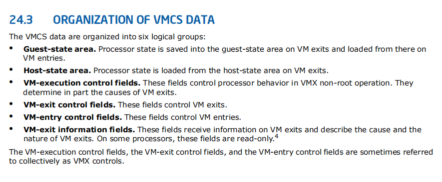
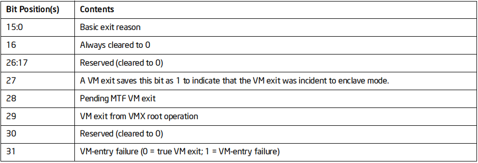

CPU信息结构体

```c++
typedef struct _VMX_CPU
{
    PVOID               pVMXONRegion;       //申请的非分页内存的地址
    PHYSICAL_ADDRESS    pVMXONRegion_PA;    //申请的非分页内存的物理地址

    //初始化环境用的
    PVOID               pVMCSRegion;       //申请的非分页内存的地址
    PHYSICAL_ADDRESS    pVMCSRegion_PA;    //申请的非分页内存的物理地址
    
    PVOID               pStack;             //栈
    BOOLEAN             bVTStartSuccess;    //标志,用于自己判断是否退出
}VMX_CPU, * PVMX_CPU;

//可以看出完成一个虚拟机,最少得申请2个非分页内存
```

### 准备环境



-   想要一条机器运行起来,需要为他准备好各种环境,比如说寄存器环境,对于一台机器来说,他可能产生中断,产生中断就会去IDT表查表,这个表如果没给,那么执行这台机器的代码就会崩
-   机器可能会访问CS段,CS会查GDT表,所以GDT表也得准备好
-   Guest-state area. 就是用来准备这台机器的运行环境,代码是需要环境才能运行的
-   VM-execution control fields,就是设置想要监控这台机器的什么操作,比如说机器访问了CR3,我们想知道,就需要设一下标志位,我们可以根据标志位来决定要监控哪些东西,一直这台机器CPU去跑它代码的时候,比如果说我们监控了 CPUID,它调了CPUID, 虚拟机就会从 Guest 状态 退出到 Host 状态,  在Host  状态执行完后,又会回到  Guest 状态 
-    Host 状态 也需要一段代码, Host 状态 可以理解为一台权限更高的机器,这两台机器环境需要注意的就是ESP的问题,Host 的机器不能用真机的ESP(如果能用就说明虚拟机逃逸了),因此我们要为 Host 机器和 Guest  机器分别 准备一个独立的栈,申请栈的时候申请了 8K , 即  Host 机器和 Guest  机器分别 4K,所以  Host-state area的环境跟  Guest-state area 差不多,区别就在于执行的权限不一样
-   控制域分3类

-   -   VM-execution control fields      执行控制
    -   VM-exit control fields.                 退出控制
    -   VM-entry control fields.              入口控制

-   VM-exit information fields.    64位需要设置,32位可以不管


-   一般真正做了一个虚拟机锁门申请了一段内存,然后把磁盘里面的代码读到内存,然后为他准备寄存器环境然后把  Guest 的 eip 设到这里,他就会开始跑代码


-   GDT 和IDT填的和真机一样这样他就可以正常处理键盘中断,这样我们我就不需要模拟键盘了,因为跟跟真机一样,所以它可以照常处理


-   
-   监控到事件以后会产生 VM  exit ,那我门就得检查他会什么退出,他是执行哪条指令退出,因为他就会告诉我们退出的信息
-   低16 位 就是退出的原因(主要),即退出码


-   通过 监控功能我们可以实现伪造序列号,拿序列号也是通过汇编指令跟硬件通信,因为硬件操作都在监控当中,所以所有硬件信息都可以伪造
-   里如果伪造CPU信息,我们直接处理时修改寄存器的值就可以了


-   跨函数调用可以通过保存环境实现,但是其实C语言标准函数里面有一个跨函数调用,从一个函数直接jmp到 另一个函数,快跨函数调用主要保存和恢复环境


-    因为要监控CR寄存器,需要模拟物理内存,所以会很卡,因此就出现了EPT,EPT就是解决
-   正常guest访问一个内存先通过CR3如果开了PAE 就去查 PDPT,再去查 PDTE,再去查PTE得到一个物理地址PA
-   即 GVA -> CR3 ->PDPE -> PDTE -> PTE -> GPA 这套机制 就是 GVA -> GPA ,但是 GPA 是无效的,所以我们我需要模仿,因此极大地影响了性能,模仿就是要改里面的页表,把页表改到真机去
-   EPT 就是提供一张表 通过指令给 VM  ,GPA->HPA,极大效率的完成内存隔离
-   Host  ept  MMU-> GPA -> PML4E -> PDPTE -> PDPE ->PTE -> HPA   四级表可以支持的最大内存是 256T
-   GPA  最终会走到MMU(逻辑单元)去访问物理地址,它会自动从EPT表去拿 GPA,同通过查表得到真机的物理地址去访问,GVA就会访问到 HPA
-   这样每创建一个虚拟机,,就给他一个 EPT就可以了,这样就解决了模拟内存的问题
-   不是所有CPU都有EPT功能,得标志位去检查
-   这样虚拟机访问物理地址我们都可以通过EPT去控制

### EPT Hook

-   我们可以准备2个EPT表,一个是原来的,一个是我们自己设计的,接下来让CPU陷入 guset模式,当他读的时候就给原来的页表,当CPU在执行代码的时候,我们就可以拦截下来,把页表换成我们自己设计的,自己设计的代码走完要跳回原来的
-   例子可以参考昨天笔记里的例子
-   要每一核的CPU都陷入VT,可以让代码在每一核跑一遍

### 课堂源码

#### vt.h

```c++
#pragma once

#include <ntifs.h>
#include <Ntddk.h>
#include <stddef.h>

/*MSR definition*/
#define MSR_IA32_VMX_BASIC              0x480
#define MSR_IA32_FEATURE_CONTROL 		0x03a
#define MSR_IA32_VMX_PINBASED_CTLS		0x481
#define MSR_IA32_VMX_PROCBASED_CTLS		0x482
#define MSR_IA32_VMX_EXIT_CTLS          0x483
#define MSR_IA32_VMX_ENTRY_CTLS         0x484

#define MSR_IA32_SYSENTER_CS            0x174
#define MSR_IA32_SYSENTER_ESP           0x175
#define MSR_IA32_SYSENTER_EIP           0x176
#define MSR_IA32_DEBUGCTL               0x1d9

#define MSR_EFER                        0xc0000080          /* extended feature register */
#define MSR_STAR                        0xc0000081          /* legacy mode SYSCALL target */
#define MSR_LSTAR                       0xc0000082          /* long mode SYSCALL target */
#define MSR_CSTAR                       0xc0000083          /* compatibility mode SYSCALL target */
#define MSR_SYSCALL_MASK                0xc0000084          /* EFLAGS mask for syscall */
#define MSR_FS_BASE                     0xc0000100          /* 64bit FS base */
#define MSR_GS_BASE                     0xc0000101          /* 64bit GS base */
#define MSR_SHADOW_GS_BASE              0xc0000102          /* SwapGS GS shadow */

//Processor-Based VM-Execution Controls
#define CPU_BASED_VIRTUAL_INTR_PENDING          0x00000004
#define CPU_BASED_USE_TSC_OFFSETING             0x00000008
#define CPU_BASED_HLT_EXITING                   0x00000080
#define CPU_BASED_INVLPG_EXITING                0x00000200
#define CPU_BASED_MWAIT_EXITING                 0x00000400
#define CPU_BASED_RDPMC_EXITING                 0x00000800
#define CPU_BASED_RDTSC_EXITING                 0x00001000
#define CPU_BASED_CR3_LOAD_EXITING		        0x00008000
#define CPU_BASED_CR3_STORE_EXITING             0x00010000
#define CPU_BASED_CR8_LOAD_EXITING              0x00080000
#define CPU_BASED_CR8_STORE_EXITING             0x00100000
#define CPU_BASED_TPR_SHADOW                    0x00200000
#define CPU_BASED_VIRTUAL_NMI_PENDING		    0x00400000
#define CPU_BASED_MOV_DR_EXITING                0x00800000
#define CPU_BASED_UNCOND_IO_EXITING             0x01000000
#define CPU_BASED_USE_IO_BITMAPS                0x02000000
#define CPU_BASED_ACTIVATE_MSR_BITMAP           0x10000000
#define CPU_BASED_MTF_TRAP_EXITING              0x08000000
#define CPU_BASED_USE_MSR_BITMAPS               0x10000000
#define CPU_BASED_MONITOR_EXITING               0x20000000
#define CPU_BASED_PAUSE_EXITING                 0x40000000
#define CPU_BASED_ACTIVATE_SECONDARY_CONTROLS   0x80000000

//VM Entry Controls
#define VM_ENTRY_LOAD_DEBUG_CONTROLS            0x00000004
#define VM_ENTRY_IA32E_MODE                     0x00000200
#define VM_ENTRY_SMM                            0x00000400
#define VM_ENTRY_DEACT_DUAL_MONITOR             0x00000800
#define VM_ENTRY_LOAD_IA32_PAT                  0x00004000
#define VM_ENTRY_LOAD_IA32_EFER                 0x00008000
#define VM_ENTRY_LOAD_BNDCFGS                   0x00010000

//VM Exit Controls
#define VM_EXIT_SAVE_DEBUG_CONTROLS             0x00000004
#define VM_EXIT_IA32E_MODE                      0x00000200
#define VM_EXIT_ACK_INTR_ON_EXIT                0x00008000
#define VM_EXIT_SAVE_IA32_PAT                   0x00040000
#define VM_EXIT_LOAD_IA32_PAT                   0x00080000
#define VM_EXIT_SAVE_IA32_EFER                  0x00100000
#define VM_EXIT_LOAD_IA32_EFER                  0x00200000
#define VM_EXIT_SAVE_VMX_PREEMPTION_TIMER       0x00400000
#define VM_EXIT_CLEAR_BNDCFGS                   0x00800000


//VMX Exit Reasons
#define EXIT_REASON_EXCEPTION_NMI       0
#define EXIT_REASON_EXTERNAL_INTERRUPT  1
#define EXIT_REASON_TRIPLE_FAULT        2
#define EXIT_REASON_INIT                3
#define EXIT_REASON_SIPI                4
#define EXIT_REASON_IO_SMI              5
#define EXIT_REASON_OTHER_SMI           6
#define EXIT_REASON_PENDING_INTERRUPT   7
#define EXIT_REASON_TASK_SWITCH         9
#define EXIT_REASON_CPUID               10
#define EXIT_REASON_HLT                 12
#define EXIT_REASON_INVD                13
#define EXIT_REASON_INVLPG              14
#define EXIT_REASON_RDPMC               15
#define EXIT_REASON_RDTSC               16
#define EXIT_REASON_RSM                 17
#define EXIT_REASON_VMCALL              18
#define EXIT_REASON_VMCLEAR             19
#define EXIT_REASON_VMLAUNCH            20
#define EXIT_REASON_VMPTRLD             21
#define EXIT_REASON_VMPTRST             22
#define EXIT_REASON_VMREAD              23
#define EXIT_REASON_VMRESUME            24
#define EXIT_REASON_VMWRITE             25
#define EXIT_REASON_VMXOFF              26
#define EXIT_REASON_VMXON               27
#define EXIT_REASON_CR_ACCESS           28
#define EXIT_REASON_DR_ACCESS           29
#define EXIT_REASON_IO_INSTRUCTION      30
#define EXIT_REASON_MSR_READ            31
#define EXIT_REASON_MSR_WRITE           32
#define EXIT_REASON_INVALID_GUEST_STATE 33
#define EXIT_REASON_MSR_LOADING         34
#define EXIT_REASON_MWAIT_INSTRUCTION   36
#define EXIT_REASON_MONITOR_INSTRUCTION 39
#define EXIT_REASON_PAUSE_INSTRUCTION   40
#define EXIT_REASON_MACHINE_CHECK       41
#define EXIT_REASON_TPR_BELOW_THRESHOLD 43

/* VMCS Encordings */
enum
{
  VIRTUAL_PROCESSOR_ID = 0x00000000,
  POSTED_INTR_NV = 0x00000002,
  GUEST_ES_SELECTOR = 0x00000800,
  GUEST_CS_SELECTOR = 0x00000802,
  GUEST_SS_SELECTOR = 0x00000804,
  GUEST_DS_SELECTOR = 0x00000806,
  GUEST_FS_SELECTOR = 0x00000808,
  GUEST_GS_SELECTOR = 0x0000080a,
  GUEST_LDTR_SELECTOR = 0x0000080c,
  GUEST_TR_SELECTOR = 0x0000080e,
  GUEST_INTR_STATUS = 0x00000810,
  HOST_ES_SELECTOR = 0x00000c00,
  HOST_CS_SELECTOR = 0x00000c02,
  HOST_SS_SELECTOR = 0x00000c04,
  HOST_DS_SELECTOR = 0x00000c06,
  HOST_FS_SELECTOR = 0x00000c08,
  HOST_GS_SELECTOR = 0x00000c0a,
  HOST_TR_SELECTOR = 0x00000c0c,
  IO_BITMAP_A = 0x00002000,
  IO_BITMAP_A_HIGH = 0x00002001,
  IO_BITMAP_B = 0x00002002,
  IO_BITMAP_B_HIGH = 0x00002003,
  MSR_BITMAP = 0x00002004,
  MSR_BITMAP_HIGH = 0x00002005,
  VM_EXIT_MSR_STORE_ADDR = 0x00002006,
  VM_EXIT_MSR_STORE_ADDR_HIGH = 0x00002007,
  VM_EXIT_MSR_LOAD_ADDR = 0x00002008,
  VM_EXIT_MSR_LOAD_ADDR_HIGH = 0x00002009,
  VM_ENTRY_MSR_LOAD_ADDR = 0x0000200a,
  VM_ENTRY_MSR_LOAD_ADDR_HIGH = 0x0000200b,
  TSC_OFFSET = 0x00002010,
  TSC_OFFSET_HIGH = 0x00002011,
  VIRTUAL_APIC_PAGE_ADDR = 0x00002012,
  VIRTUAL_APIC_PAGE_ADDR_HIGH = 0x00002013,
  APIC_ACCESS_ADDR = 0x00002014,
  APIC_ACCESS_ADDR_HIGH = 0x00002015,
  POSTED_INTR_DESC_ADDR = 0x00002016,
  POSTED_INTR_DESC_ADDR_HIGH = 0x00002017,
  EPT_POINTER = 0x0000201a,
  EPT_POINTER_HIGH = 0x0000201b,
  EOI_EXIT_BITMAP0 = 0x0000201c,
  EOI_EXIT_BITMAP0_HIGH = 0x0000201d,
  EOI_EXIT_BITMAP1 = 0x0000201e,
  EOI_EXIT_BITMAP1_HIGH = 0x0000201f,
  EOI_EXIT_BITMAP2 = 0x00002020,
  EOI_EXIT_BITMAP2_HIGH = 0x00002021,
  EOI_EXIT_BITMAP3 = 0x00002022,
  EOI_EXIT_BITMAP3_HIGH = 0x00002023,
  VMREAD_BITMAP = 0x00002026,
  VMWRITE_BITMAP = 0x00002028,
  XSS_EXIT_BITMAP = 0x0000202C,
  XSS_EXIT_BITMAP_HIGH = 0x0000202D,
  GUEST_PHYSICAL_ADDRESS = 0x00002400,
  GUEST_PHYSICAL_ADDRESS_HIGH = 0x00002401,
  VMCS_LINK_POINTER = 0x00002800,
  VMCS_LINK_POINTER_HIGH = 0x00002801,
  GUEST_IA32_DEBUGCTL = 0x00002802,
  GUEST_IA32_DEBUGCTL_HIGH = 0x00002803,
  GUEST_IA32_PAT = 0x00002804,
  GUEST_IA32_PAT_HIGH = 0x00002805,
  GUEST_IA32_EFER = 0x00002806,
  GUEST_IA32_EFER_HIGH = 0x00002807,
  GUEST_IA32_PERF_GLOBAL_CTRL = 0x00002808,
  GUEST_IA32_PERF_GLOBAL_CTRL_HIGH = 0x00002809,
  GUEST_PDPTR0 = 0x0000280a,
  GUEST_PDPTR0_HIGH = 0x0000280b,
  GUEST_PDPTR1 = 0x0000280c,
  GUEST_PDPTR1_HIGH = 0x0000280d,
  GUEST_PDPTR2 = 0x0000280e,
  GUEST_PDPTR2_HIGH = 0x0000280f,
  GUEST_PDPTR3 = 0x00002810,
  GUEST_PDPTR3_HIGH = 0x00002811,
  GUEST_BNDCFGS = 0x00002812,
  GUEST_BNDCFGS_HIGH = 0x00002813,
  HOST_IA32_PAT = 0x00002c00,
  HOST_IA32_PAT_HIGH = 0x00002c01,
  HOST_IA32_EFER = 0x00002c02,
  HOST_IA32_EFER_HIGH = 0x00002c03,
  HOST_IA32_PERF_GLOBAL_CTRL = 0x00002c04,
  HOST_IA32_PERF_GLOBAL_CTRL_HIGH = 0x00002c05,
  PIN_BASED_VM_EXEC_CONTROL = 0x00004000,
  CPU_BASED_VM_EXEC_CONTROL = 0x00004002,
  EXCEPTION_BITMAP = 0x00004004,
  PAGE_FAULT_ERROR_CODE_MASK = 0x00004006,
  PAGE_FAULT_ERROR_CODE_MATCH = 0x00004008,
  CR3_TARGET_COUNT = 0x0000400a,
  VM_EXIT_CONTROLS = 0x0000400c,
  VM_EXIT_MSR_STORE_COUNT = 0x0000400e,
  VM_EXIT_MSR_LOAD_COUNT = 0x00004010,
  VM_ENTRY_CONTROLS = 0x00004012,
  VM_ENTRY_MSR_LOAD_COUNT = 0x00004014,
  VM_ENTRY_INTR_INFO_FIELD = 0x00004016,
  VM_ENTRY_EXCEPTION_ERROR_CODE = 0x00004018,
  VM_ENTRY_INSTRUCTION_LEN = 0x0000401a,
  TPR_THRESHOLD = 0x0000401c,
  SECONDARY_VM_EXEC_CONTROL = 0x0000401e,
  PLE_GAP = 0x00004020,
  PLE_WINDOW = 0x00004022,
  VM_INSTRUCTION_ERROR = 0x00004400,
  VM_EXIT_REASON = 0x00004402,
  VM_EXIT_INTR_INFO = 0x00004404,
  VM_EXIT_INTR_ERROR_CODE = 0x00004406,
  IDT_VECTORING_INFO_FIELD = 0x00004408,
  IDT_VECTORING_ERROR_CODE = 0x0000440a,
  VM_EXIT_INSTRUCTION_LEN = 0x0000440c,
  VMX_INSTRUCTION_INFO = 0x0000440e,
  GUEST_ES_LIMIT = 0x00004800,
  GUEST_CS_LIMIT = 0x00004802,
  GUEST_SS_LIMIT = 0x00004804,
  GUEST_DS_LIMIT = 0x00004806,
  GUEST_FS_LIMIT = 0x00004808,
  GUEST_GS_LIMIT = 0x0000480a,
  GUEST_LDTR_LIMIT = 0x0000480c,
  GUEST_TR_LIMIT = 0x0000480e,
  GUEST_GDTR_LIMIT = 0x00004810,
  GUEST_IDTR_LIMIT = 0x00004812,
  GUEST_ES_AR_BYTES = 0x00004814,
  GUEST_CS_AR_BYTES = 0x00004816,
  GUEST_SS_AR_BYTES = 0x00004818,
  GUEST_DS_AR_BYTES = 0x0000481a,
  GUEST_FS_AR_BYTES = 0x0000481c,
  GUEST_GS_AR_BYTES = 0x0000481e,
  GUEST_LDTR_AR_BYTES = 0x00004820,
  GUEST_TR_AR_BYTES = 0x00004822,
  GUEST_INTERRUPTIBILITY_INFO = 0x00004824,
  GUEST_ACTIVITY_STATE = 0X00004826,
  GUEST_SYSENTER_CS = 0x0000482A,
  VMX_PREEMPTION_TIMER_VALUE = 0x0000482E,
  HOST_IA32_SYSENTER_CS = 0x00004c00,
  CR0_GUEST_HOST_MASK = 0x00006000,
  CR4_GUEST_HOST_MASK = 0x00006002,
  CR0_READ_SHADOW = 0x00006004,
  CR4_READ_SHADOW = 0x00006006,
  CR3_TARGET_VALUE0 = 0x00006008,
  CR3_TARGET_VALUE1 = 0x0000600a,
  CR3_TARGET_VALUE2 = 0x0000600c,
  CR3_TARGET_VALUE3 = 0x0000600e,
  EXIT_QUALIFICATION = 0x00006400,
  GUEST_LINEAR_ADDRESS = 0x0000640a,
  GUEST_CR0 = 0x00006800,
  GUEST_CR3 = 0x00006802,
  GUEST_CR4 = 0x00006804,
  GUEST_ES_BASE = 0x00006806,
  GUEST_CS_BASE = 0x00006808,
  GUEST_SS_BASE = 0x0000680a,
  GUEST_DS_BASE = 0x0000680c,
  GUEST_FS_BASE = 0x0000680e,
  GUEST_GS_BASE = 0x00006810,
  GUEST_LDTR_BASE = 0x00006812,
  GUEST_TR_BASE = 0x00006814,
  GUEST_GDTR_BASE = 0x00006816,
  GUEST_IDTR_BASE = 0x00006818,
  GUEST_DR7 = 0x0000681a,
  GUEST_RSP = 0x0000681c,
  GUEST_RIP = 0x0000681e,
  GUEST_RFLAGS = 0x00006820,
  GUEST_PENDING_DBG_EXCEPTIONS = 0x00006822,
  GUEST_SYSENTER_ESP = 0x00006824,
  GUEST_SYSENTER_EIP = 0x00006826,
  HOST_CR0 = 0x00006c00,
  HOST_CR3 = 0x00006c02,
  HOST_CR4 = 0x00006c04,
  HOST_FS_BASE = 0x00006c06,
  HOST_GS_BASE = 0x00006c08,
  HOST_TR_BASE = 0x00006c0a,
  HOST_GDTR_BASE = 0x00006c0c,
  HOST_IDTR_BASE = 0x00006c0e,
  HOST_IA32_SYSENTER_ESP = 0x00006c10,
  HOST_IA32_SYSENTER_EIP = 0x00006c12,
  HOST_RSP = 0x00006c14,
  HOST_RIP = 0x00006c16,
};

typedef struct _GUEST_REGS
{
  ULONG eax;
  ULONG ecx;
  ULONG edx;
  ULONG ebx;
  ULONG esp;
  ULONG ebp;
  ULONG esi;
  ULONG edi;
  ULONG eip;
  ULONG eflags;
}GUEST_REGS, * PGUEST_REGS;

typedef struct {
    unsigned PE : 1;
    unsigned MP : 1;
    unsigned EM : 1;
    unsigned TS : 1;
    unsigned ET : 1;
    unsigned NE : 1;
    unsigned Reserved_1 : 10;
    unsigned WP : 1;
    unsigned Reserved_2 : 1;
    unsigned AM : 1;
    unsigned Reserved_3 : 10;
    unsigned NW : 1;
    unsigned CD : 1;
    unsigned PG : 1;
    //unsigned Reserved_64:32;
}_CR0;


typedef struct {
    unsigned VME : 1;
    unsigned PVI : 1;
    unsigned TSD : 1;
    unsigned DE : 1;
    unsigned PSE : 1;
    unsigned PAE : 1;
    unsigned MCE : 1;
    unsigned PGE : 1;
    unsigned PCE : 1;
    unsigned OSFXSR : 1;
    unsigned PSXMMEXCPT : 1;
    unsigned UNKONOWN_1 : 1;		//These are zero
    unsigned UNKONOWN_2 : 1;		//These are zero
    unsigned VMXE : 1;			//It's zero in normal
    unsigned Reserved : 18;		//These are zero
    //unsigned Reserved_64:32;
}_CR4;


typedef struct {
    unsigned SSE3 : 1;
    unsigned PCLMULQDQ : 1;
    unsigned DTES64 : 1;
    unsigned MONITOR : 1;
    unsigned DS_CPL : 1;
    unsigned VMX : 1;
    unsigned SMX : 1;
    unsigned EIST : 1;
    unsigned TM2 : 1;
    unsigned SSSE3 : 1;
    unsigned Reserved : 22;
}_CPUID_ECX;


typedef struct _IA32_FEATURE_CONTROL_MSR
{
  unsigned Lock : 1;		// Bit 0 is the lock bit - cannot be modified once lock is set
  unsigned Reserved1 : 1;		// Undefined
  unsigned EnableVmxon : 1;		// Bit 2. If this bit is clear, VMXON causes a general protection exception
  unsigned Reserved2 : 29;	// Undefined
  unsigned Reserved3 : 32;	// Undefined

} IA32_FEATURE_CONTROL_MSR;


typedef struct _VMX_BASIC_MSR
{
  unsigned RevId : 32;
  unsigned szVmxOnRegion : 12;
  unsigned ClearBit : 1;
  unsigned Reserved : 3;
  unsigned PhysicalWidth : 1;
  unsigned DualMonitor : 1;
  unsigned MemoryType : 4;
  unsigned VmExitInformation : 1;
  unsigned Reserved2 : 9;
} VMX_BASIC_MSR, * PVMX_BASIC_MSR;

//可以看出完成一个虚拟机,最少得申请2个非分页内存
typedef struct _VMX_CPU
{
    PVOID               pVMXONRegion;       //申请的非分页内存的地址
    PHYSICAL_ADDRESS    pVMXONRegion_PA;    //申请的非分页内存的物理地址

    //初始化环境用的
    PVOID               pVMCSRegion;       //申请的非分页内存的地址
    PHYSICAL_ADDRESS    pVMCSRegion_PA;    //申请的非分页内存的物理地址

    PVOID               pStack;             //栈
    BOOLEAN             bVTStartSuccess;    //标志,用于自己判断是否退出
}VMX_CPU, * PVMX_CPU;


//标志寄存器结构体
typedef struct {
    unsigned CF : 1;        //判断开机有没有成功
    unsigned Unknown_1 : 1;	//Always 1
    unsigned PF : 1;
    unsigned Unknown_2 : 1;	//Always 0
    unsigned AF : 1;
    unsigned Unknown_3 : 1;	//Always 0
    unsigned ZF : 1;
    unsigned SF : 1;
    unsigned TF : 1;
    unsigned IF : 1;
    unsigned DF : 1;
    unsigned OF : 1;
    unsigned TOPL : 2;
    unsigned NT : 1;
    unsigned Unknown_4 : 1;
    unsigned RF : 1;
    unsigned VM : 1;
    unsigned AC : 1;
    unsigned VIF : 1;
    unsigned VIP : 1;
    unsigned ID : 1;
    unsigned Reserved : 10;	//Always 0
    //unsigned Reserved_64:32;	//Always 0
}_EFLAGS;

NTSTATUS DriverEntry(__in struct _DRIVER_OBJECT* DriverObject,
  __in PUNICODE_STRING  RegistryPath);


VOID Unload(__in struct _DRIVER_OBJECT* DriverObject);

#define Log(message,value) {{KdPrint(("[MinVT] %-40s [%p]\n",message,value));}}


#pragma alloc_text( "INIT", DriverEntry)
#pragma alloc_text( "PAGE", Unload)
```

#### vt.c

```c++
#include <intrin.h>
#include "vt.h"
#include "vt_asm.h"
#include < setjmp.h >

VMX_CPU g_VMXCPU;
GUEST_REGS g_GuestRegs;
jmp_buf mark;
ULONG g_exit_esp;
ULONG back_position;


BOOLEAN IsVTEnabled()
{
    ULONG       uRet_EAX, uRet_ECX, uRet_EDX, uRet_EBX;
    _CPUID_ECX  uCPUID;
    _CR0        uCr0;
    _CR4    uCr4;
    IA32_FEATURE_CONTROL_MSR msr;
    //1. CPUID
    Asm_CPUID(1, &uRet_EAX, &uRet_EBX, &uRet_ECX, &uRet_EDX);
    *((PULONG)&uCPUID) = uRet_ECX;

    if (uCPUID.VMX != 1)
    {
        Log("ERROR: 这个CPU不支持VT!", 0);
        return FALSE;
    }

    // 2. CR0 CR4
    *((PULONG)&uCr0) = Asm_GetCr0();
    *((PULONG)&uCr4) = Asm_GetCr4();

    if (uCr0.PE != 1 || uCr0.PG != 1 || uCr0.NE != 1)
    {
        Log("ERROR:这个CPU没有开启VT!", 0);
        return FALSE;
    }

    if (uCr4.VMXE == 1)
    {
        Log("ERROR:这个CPU已经开启了VT!", 0);
        Log("可能是别的驱动已经占用了VT，你必须关闭它后才能开启。", 0);
        return FALSE;
    }

    // 3. MSR
    *((PULONG)&msr) = (ULONG)Asm_ReadMsr(MSR_IA32_FEATURE_CONTROL);
    if (msr.Lock != 1)
    {
        Log("ERROR:VT指令未被锁定!", 0);
        return FALSE;
    }
    Log("SUCCESS:这个CPU支持VT!", 0);
    return TRUE;
}

//申请内存
NTSTATUS AllocateVMXRegion()
{
    PVOID pVMXONRegion;
    PVOID pVMCSRegion;
    PVOID pStack;

    //申请 vmon 的内存
    pVMXONRegion = ExAllocatePoolWithTag(NonPagedPool, 0x1000, 'vmon'); //4KB
    if (!pVMXONRegion)
    {
        Log("ERROR:申请VMXON内存区域失败!", 0);
        return STATUS_MEMORY_NOT_ALLOCATED;
    }
    RtlZeroMemory(pVMXONRegion, 0x1000);  //初始化内存

    //申请 vmcs 的内存
    pVMCSRegion = ExAllocatePoolWithTag(NonPagedPool, 0x1000, 'vmcs');
    if (!pVMCSRegion)
    {
        Log("ERROR:申请VMCS内存区域失败!", 0);
        ExFreePool(pVMXONRegion);
        return STATUS_MEMORY_NOT_ALLOCATED;
    }
    RtlZeroMemory(pVMCSRegion, 0x1000);   //初始化内存

    //申请栈
    pStack = ExAllocatePoolWithTag(NonPagedPool, 0x2000, 'stck');
    if (!pStack)
    {
        Log("ERROR:申请宿主机堆载区域失败!", 0);
        ExFreePool(pVMXONRegion);
        ExFreePool(pVMCSRegion);
        return STATUS_MEMORY_NOT_ALLOCATED;
    }
    RtlZeroMemory(pStack, 0x2000);   //初始化内存

    Log("TIP:VMXON内存区域地址", pVMXONRegion);
    Log("TIP:VMCS内存区域地址", pVMCSRegion);
    Log("TIP:宿主机堆载区域地址", pStack);

    //把申请的内存地址放入结构体
    g_VMXCPU.pVMXONRegion = pVMXONRegion;
    g_VMXCPU.pVMXONRegion_PA = MmGetPhysicalAddress(pVMXONRegion);
    g_VMXCPU.pVMCSRegion = pVMCSRegion;
    g_VMXCPU.pVMCSRegion_PA = MmGetPhysicalAddress(pVMCSRegion);
    g_VMXCPU.pStack = pStack;

    return STATUS_SUCCESS;
}

void SetupVMXRegion()
{
    VMX_BASIC_MSR Msr;
    ULONG uRevId;
    _CR4 uCr4;
    _EFLAGS uEflags;

    RtlZeroMemory(&Msr, sizeof(Msr));

    *((PULONG)&Msr) = (ULONG)Asm_ReadMsr(MSR_IA32_VMX_BASIC);
    uRevId = Msr.RevId;

    //填入版本号
    *((PULONG)g_VMXCPU.pVMXONRegion) = uRevId;
    *((PULONG)g_VMXCPU.pVMCSRegion) = uRevId;

    Log("TIP:VMX版本号信息", uRevId);

    //开锁 将 cr4的VMXE位置1
    *((PULONG)&uCr4) = Asm_GetCr4();
    uCr4.VMXE = 1;
    Asm_SetCr4(*((PULONG)&uCr4));

    //开柜门
    Vmx_VmxOn(g_VMXCPU.pVMXONRegion_PA.LowPart, g_VMXCPU.pVMXONRegion_PA.HighPart);
    *((PULONG)&uEflags) = Asm_GetEflags();
    if (uEflags.CF != 0)  //通过 uEflags的CF位判断是否开柜门成功 
    {
        Log("ERROR:VMXON指令调用失败!", 0);
        return;
    }
    Log("SUCCESS:VMXON指令调用成功!", 0);
}

void __declspec(naked) g_exit()
{
    __asm {
        mov esp, g_exit_esp
        jmp back_position
    }
}


void __declspec(naked) GuestEntry()
{
    //这里放的是就是要模拟的机器代码这里的代码都能够监控到
    __asm {
        mov ax, es
        mov es, ax

        mov ax, ds
        mov ds, ax

        mov ax, fs
        mov fs, ax

        mov ax, gs
        mov gs, ax

        mov ax, ss
        mov ss, ax
    }
    //longjmp(mark, -1);    //C语言标准函数跨函数调用,跳回去,返回值 -1
    __asm {
        jmp g_exit   //让guest 机器回真机去跑代码,把真机当作guest入口点(虚拟机逃逸)
                     //,直接jmp 到 DriverEntry 的 return,这样return 以后就到真机去跑代码了
    }
}

void HandleCPUID()
{
    if (g_GuestRegs.eax == 'Mini')  //后门
    { 
        //伪造CPU信息
        g_GuestRegs.ebx = 0x88888888;
        g_GuestRegs.ecx = 0x11111111;
        g_GuestRegs.edx = 0x12345678;
    }
    else
    {
        //调原来CPUID 的功能
        Asm_CPUID(g_GuestRegs.eax, &g_GuestRegs.eax, &g_GuestRegs.ebx, &g_GuestRegs.ecx, &g_GuestRegs.edx);
    }   
}

void HandleCrAccess()
{
    ULONG		movcrControlRegister;
    ULONG		movcrAccessType;
    ULONG		movcrOperandType;
    ULONG		movcrGeneralPurposeRegister;
    //ULONG		movcrLMSWSourceData;
    ULONG		ExitQualification;

    ExitQualification = Vmx_VmRead(EXIT_QUALIFICATION);
    movcrControlRegister = (ExitQualification & 0x0000000F);
    movcrAccessType = ((ExitQualification & 0x00000030) >> 4);
    movcrOperandType = ((ExitQualification & 0x00000040) >> 6);
    movcrGeneralPurposeRegister = ((ExitQualification & 0x00000F00) >> 8);

    if (movcrControlRegister != 3) {    // not for cr3
        __asm int 3
    }
    //什么都不干,让 guest机器也用真实的物理内存
    if (movcrAccessType == 0) {         // CR3 <-- reg32
        Vmx_VmWrite(GUEST_CR3, *(PULONG)((ULONG)&g_GuestRegs + 4 * movcrGeneralPurposeRegister));
    }
    else {                            // reg32 <-- CR3
        *(PULONG)((ULONG)&g_GuestRegs + 4 * movcrGeneralPurposeRegister) = Vmx_VmRead(GUEST_CR3);
    }
}

ULONG g_vmcall_arg;
ULONG g_stop_esp, g_stop_eip;

void HandleVmCall()
{
    if (g_vmcall_arg == 'SVT')  
    {
        //关锁
        Vmx_VmClear(g_VMXCPU.pVMCSRegion_PA.LowPart, g_VMXCPU.pVMCSRegion_PA.HighPart);
        Vmx_VmxOff();
        //跳回去继续执行代码
        __asm {
            mov esp, g_stop_esp
            jmp g_stop_eip
        }
    }
    else {
        __asm int 3
    }
}

static void  VMMEntryPointEbd(void)
{
    ULONG ExitReason;
    ULONG ExitInstructionLength;
    ULONG GuestResumeEIP;

    //vm_exit
    ExitReason = Vmx_VmRead(VM_EXIT_REASON);   //获取退出码 通过虚拟指令去读编号
    ExitInstructionLength = Vmx_VmRead(VM_EXIT_INSTRUCTION_LEN); //获取退出代码指令长度,用于处理完返回

    //获取退出时的标注寄存器,esp,和eip
    g_GuestRegs.eflags = Vmx_VmRead(GUEST_RFLAGS);
    g_GuestRegs.esp = Vmx_VmRead(GUEST_RSP);
    g_GuestRegs.eip = Vmx_VmRead(GUEST_RIP);

    //产生事件的处理方式
    switch (ExitReason)  //下面 3个信息一定会被拦截
    {
    case EXIT_REASON_CPUID: //cpuid    操作系统代码运行时候肯定会检查 CPUID 的,所以得伪造,设置CPU信息
      //如果我们想什么都不做,直接也执行一下 __asm cpuid
        HandleCPUID();  
        Log("EXIT_REASON_CPUID", 0)
            break;

    case EXIT_REASON_VMCALL:
        HandleVmCall();  //主要关机
        Log("EXIT_REASON_VMCALL", 0)
            break;
        //驱动停止是直接在卸载时候关柜门,但是现在是机器进入了host状态,关柜门的时候没有权限执行,因此关柜门的指令
        //必须由host执行,但是怎么让host执行呢,我们再执行一条有权限的 guest可以执行的vm指令即VT指令 Vmx_Vmcall()
        //这儿条指令就会退出产生一个 EXIT_REASON_VMCALL 事件,这也是 guest 怎么跟 host 通信的方法,这样guest代码
        //就会陷入 host
    case EXIT_REASON_CR_ACCESS:   //访问cr寄存器
        //例如 mov  eax ,cr3退出,如果我们 mov eax,100,那么执行完 eax值就是100,如果什么都不做
        //可以 我们也执行 mov eax,cr3就可以了
        HandleCrAccess();
        //Log("EXIT_REASON_CR_ACCESS", 0)
        break;
        //访问CR寄存器必然会被拦截,不管同不同意,因为虚拟机会访问物理内存,我们没有这个物理内存,而且多台机器也需要内存隔离
        //所以这个事件就是为了我们模拟内存,虚拟机访问CR3,我们就得把页表放在真是机器的物理内存的某个地方
    default:
        Log("not handled reason: %p", ExitReason);
        //__asm int 3
    }

    //Resume:
    GuestResumeEIP = g_GuestRegs.eip + ExitInstructionLength;  //eip设为退出指令+长度,即下一条指令地址
    //把eip,esp,eflags 设置回去
    Vmx_VmWrite(GUEST_RIP, GuestResumeEIP);
    Vmx_VmWrite(GUEST_RSP, g_GuestRegs.esp);
    Vmx_VmWrite(GUEST_RFLAGS, g_GuestRegs.eflags);

}

void __declspec(naked) VMMEntryPoint(void)
{
    __asm {
        //保存guest机器的寄存器环境,因为需要回去
        mov g_GuestRegs.eax, eax
        mov g_GuestRegs.ecx, ecx
        mov g_GuestRegs.edx, edx
        mov g_GuestRegs.ebx, ebx
        mov g_GuestRegs.esp, esp
        mov g_GuestRegs.ebp, ebp
        mov g_GuestRegs.esi, esi
        mov g_GuestRegs.edi, edi

        pushfd
        pop eax
        mov g_GuestRegs.eflags, eax

        mov ax, fs
        mov fs, ax
        mov ax, gs
        mov gs, ax
    }

    VMMEntryPointEbd();

    __asm {
        //恢复环境 
        mov  eax, g_GuestRegs.eax
        mov  ecx, g_GuestRegs.ecx
        mov  edx, g_GuestRegs.edx
        mov  ebx, g_GuestRegs.ebx
        mov  esp, g_GuestRegs.esp
        mov  ebp, g_GuestRegs.ebp
        mov  esi, g_GuestRegs.esi
        mov  edi, g_GuestRegs.edi

        //vmresume   还原后通过指令让他继续执行
        __emit 0x0f
        __emit 0x01
        __emit 0xc3
    }
}


static ULONG  VmxAdjustControls(ULONG Ctl, ULONG Msr)
{
    LARGE_INTEGER MsrValue;
    MsrValue.QuadPart = Asm_ReadMsr(Msr);
    Ctl &= MsrValue.HighPart;     /* bit == 0 in high word ==> must be zero */
    Ctl |= MsrValue.LowPart;      /* bit == 1 in low word  ==> must be one  */
    return Ctl;
}

NTSTATUS StopVirtualTechnology()
{
    _CR4 uCr4;

    if (g_VMXCPU.bVTStartSuccess)   //根据标志判断虚拟机是否开启
    {
        g_VMXCPU.bVTStartSuccess = FALSE;    //标志置位,改成关闭虚拟机状态

        //关柜门
        g_vmcall_arg = 'SVT';
        __asm {
            pushad
            pushfd
            mov g_stop_esp, esp
            mov g_stop_eip, offset LLL
        }
        Vmx_VmCall();
    LLL:
        __asm {
            popfd
            popad
        }

        //关锁
        *((PULONG)&uCr4) = Asm_GetCr4();
        uCr4.VMXE = 0;
        Asm_SetCr4(*((PULONG)&uCr4));


        //释放资源
        ExFreePool(g_VMXCPU.pVMXONRegion);
        ExFreePool(g_VMXCPU.pVMCSRegion);
        ExFreePool(g_VMXCPU.pStack);

        Log("SUCCESS:关闭VT成功!", 0);
        Log("SUCCESS:现在这个CPU退出了VMX模式.", 0);
    }

    return STATUS_SUCCESS;
}

void SetupVMCS()
{
    _EFLAGS uEflags;
    ULONG GdtBase, IdtBase;
    //ULONG uCPUBase, uExceptionBitmap;

    //拨电源
    Vmx_VmClear(g_VMXCPU.pVMCSRegion_PA.LowPart, g_VMXCPU.pVMCSRegion_PA.HighPart);  //初始化申请的4K的页
    *((PULONG)&uEflags) = Asm_GetEflags();
    if (uEflags.CF != 0 || uEflags.ZF != 0)
    {
        Log("ERROR:VMCLEAR指令调用失败!", 0)
            return;
    }
    Log("SUCCESS:VMCLEAR指令调用成功!", 0)


        //装机
        Vmx_VmPtrld(g_VMXCPU.pVMCSRegion_PA.LowPart, g_VMXCPU.pVMCSRegion_PA.HighPart);

    GdtBase = Asm_GetGdtBase();
    IdtBase = Asm_GetIdtBase();

    //
    // 1.Guest State Area   ring0
    //直接用真机的 CR0   CR3  Cr4,不然就得自己模拟
    Vmx_VmWrite(GUEST_CR0, Asm_GetCr0());   //将真机的CR0给一个编号给虚拟机
    Vmx_VmWrite(GUEST_CR3, Asm_GetCr3());
    Vmx_VmWrite(GUEST_CR4, Asm_GetCr4());

    Vmx_VmWrite(GUEST_DR7, 0x400);
    Vmx_VmWrite(GUEST_RFLAGS, Asm_GetEflags() & ~0x200);  //屏蔽中断位

    //写入段寄存器的值,那当前的  后面的 &0xFFF8 是将段寄存器的 dql 设为0环的
    Vmx_VmWrite(GUEST_ES_SELECTOR, Asm_GetEs() & 0xFFF8);
    Vmx_VmWrite(GUEST_CS_SELECTOR, Asm_GetCs() & 0xFFF8);
    Vmx_VmWrite(GUEST_DS_SELECTOR, Asm_GetDs() & 0xFFF8);
    Vmx_VmWrite(GUEST_FS_SELECTOR, Asm_GetFs() & 0xFFF8);
    Vmx_VmWrite(GUEST_GS_SELECTOR, Asm_GetGs() & 0xFFF8);
    Vmx_VmWrite(GUEST_SS_SELECTOR, Asm_GetSs() & 0xFFF8);
    Vmx_VmWrite(GUEST_TR_SELECTOR, Asm_GetTr() & 0xFFF8);

    Vmx_VmWrite(GUEST_ES_AR_BYTES, 0x10000);
    Vmx_VmWrite(GUEST_FS_AR_BYTES, 0x10000);
    Vmx_VmWrite(GUEST_DS_AR_BYTES, 0x10000);
    Vmx_VmWrite(GUEST_SS_AR_BYTES, 0x10000);
    Vmx_VmWrite(GUEST_GS_AR_BYTES, 0x10000);
    Vmx_VmWrite(GUEST_LDTR_AR_BYTES, 0x10000);

    //访问CS段就要去查GDT表,这里就是告诉虚拟机去哪查表
    Vmx_VmWrite(GUEST_CS_AR_BYTES, 0xc09b);
    Vmx_VmWrite(GUEST_CS_BASE, 0);
    Vmx_VmWrite(GUEST_CS_LIMIT, 0xffffffff);

    //正常情况下应该通过 当前的tr寄存器去查表把 基址,界限,属性拿出来
    Vmx_VmWrite(GUEST_TR_AR_BYTES, 0x008b);   //属性
    Vmx_VmWrite(GUEST_TR_BASE, 0x80042000);   //基址
    Vmx_VmWrite(GUEST_TR_LIMIT, 0x20ab);      //界限

    //设置GDT表和IDT表的位置,这就具备了查表的能力
    Vmx_VmWrite(GUEST_GDTR_BASE, GdtBase);
    Vmx_VmWrite(GUEST_GDTR_LIMIT, Asm_GetGdtLimit());
    Vmx_VmWrite(GUEST_IDTR_BASE, IdtBase);
    Vmx_VmWrite(GUEST_IDTR_LIMIT, Asm_GetIdtLimit());

    //设置调试的控制位
    Vmx_VmWrite(GUEST_IA32_DEBUGCTL, Asm_ReadMsr(MSR_IA32_DEBUGCTL) & 0xFFFFFFFF);
    Vmx_VmWrite(GUEST_IA32_DEBUGCTL_HIGH, Asm_ReadMsr(MSR_IA32_DEBUGCTL) >> 32);

    //设置msr 的 3个段,写到环境里面
    Vmx_VmWrite(GUEST_SYSENTER_CS, Asm_ReadMsr(MSR_IA32_SYSENTER_CS) & 0xFFFFFFFF);   //174
    Vmx_VmWrite(GUEST_SYSENTER_ESP, Asm_ReadMsr(MSR_IA32_SYSENTER_ESP) & 0xFFFFFFFF); //175
    Vmx_VmWrite(GUEST_SYSENTER_EIP, Asm_ReadMsr(MSR_IA32_SYSENTER_EIP) & 0xFFFFFFFF); //176  KiFastCallEntry

    //设置栈
    Vmx_VmWrite(GUEST_RSP, ((ULONG)g_VMXCPU.pStack) + 0x1000);     //Guest 临时栈
    //设置代码入口
    Vmx_VmWrite(GUEST_RIP, (ULONG)GuestEntry);                     // 客户机的入口点

    Vmx_VmWrite(VMCS_LINK_POINTER, 0xffffffff);
    Vmx_VmWrite(VMCS_LINK_POINTER_HIGH, 0xffffffff);

    //
    // 2.Host State Area  ring-1
    //处理 Host机器的环境
    Vmx_VmWrite(HOST_CR0, Asm_GetCr0());
    Vmx_VmWrite(HOST_CR3, Asm_GetCr3());
    Vmx_VmWrite(HOST_CR4, Asm_GetCr4());

    Vmx_VmWrite(HOST_ES_SELECTOR, Asm_GetEs() & 0xFFF8);
    Vmx_VmWrite(HOST_CS_SELECTOR, Asm_GetCs() & 0xFFF8);
    Vmx_VmWrite(HOST_DS_SELECTOR, Asm_GetDs() & 0xFFF8);
    Vmx_VmWrite(HOST_FS_SELECTOR, Asm_GetFs() & 0xFFF8);
    Vmx_VmWrite(HOST_GS_SELECTOR, Asm_GetGs() & 0xFFF8);
    Vmx_VmWrite(HOST_SS_SELECTOR, Asm_GetSs() & 0xFFF8);
    Vmx_VmWrite(HOST_TR_SELECTOR, Asm_GetTr() & 0xFFF8);

    Vmx_VmWrite(HOST_TR_BASE, 0x80042000);   //这个地址是 直接真机抄过来的,换个版本可能值不一样  正常情况下应该通过 当前的tr寄存器去查表把 基址,界限,属性拿出来

    Vmx_VmWrite(HOST_GDTR_BASE, GdtBase);
    Vmx_VmWrite(HOST_IDTR_BASE, IdtBase);

    Vmx_VmWrite(HOST_IA32_SYSENTER_CS, Asm_ReadMsr(MSR_IA32_SYSENTER_CS) & 0xFFFFFFFF);
    Vmx_VmWrite(HOST_IA32_SYSENTER_ESP, Asm_ReadMsr(MSR_IA32_SYSENTER_ESP) & 0xFFFFFFFF);
    Vmx_VmWrite(HOST_IA32_SYSENTER_EIP, Asm_ReadMsr(MSR_IA32_SYSENTER_EIP) & 0xFFFFFFFF); // KiFastCallEntry

    Vmx_VmWrite(HOST_RSP, ((ULONG)g_VMXCPU.pStack) + 0x2000);     //Host 临时栈
    Vmx_VmWrite(HOST_RIP, (ULONG)VMMEntryPoint);                  //这里定义我们的VMM处理程序入口


    //
    // 3.虚拟机运行控制域
    //控制于是寄存器用位来表示监控什么,每一位表示一种监控,因此设置的时候要先把原来的读出来,在或上去
    //啥都不监控
    Vmx_VmWrite(PIN_BASED_VM_EXEC_CONTROL, VmxAdjustControls(0, MSR_IA32_VMX_PINBASED_CTLS));
    Vmx_VmWrite(CPU_BASED_VM_EXEC_CONTROL, VmxAdjustControls(0, MSR_IA32_VMX_PROCBASED_CTLS));

    //
    // 4.VMEntry运行控制域
    //啥都不监控
    Vmx_VmWrite(VM_ENTRY_CONTROLS, VmxAdjustControls(0, MSR_IA32_VMX_ENTRY_CTLS));

    //
    // 5.VMExit运行控制域
    //啥都不监控
    Vmx_VmWrite(VM_EXIT_CONTROLS, VmxAdjustControls(0, MSR_IA32_VMX_EXIT_CTLS));
    
    //控制域啥都不监控也必须设置

    Vmx_VmLaunch();   //开机                 //打开新世界大门
  //==========================================================
    //开机以后,额IP直接进入 guset 机器走代码,下面的代码是走不了的
    g_VMXCPU.bVTStartSuccess = FALSE;

    Log("ERROR:VmLaunch指令调用失败!!!!", Vmx_VmRead(VM_INSTRUCTION_ERROR));
    StopVirtualTechnology();
}

NTSTATUS StartVirtualTechnology()
{
    //检测VT
    NTSTATUS status = STATUS_SUCCESS;
    if (!IsVTEnabled())    //检测是否开启VT
        return STATUS_NOT_SUPPORTED;

    //申请内存
    status = AllocateVMXRegion();
    if (!NT_SUCCESS(status))
    {
        Log("ERROR:VMX内存区域申请失败", 0);
        return STATUS_UNSUCCESSFUL;
    }
    Log("SUCCESS:VMX内存区域申请成功!", 0);


    SetupVMXRegion();   //开锁
    g_VMXCPU.bVTStartSuccess = TRUE;  //标志置位,表示虚拟机已开启

    SetupVMCS();   //拔电源


    if (g_VMXCPU.bVTStartSuccess)    //判断虚拟机是否开启成功
    {
        Log("SUCCESS:开启VT成功!", 0);
        Log("SUCCESS:现在这个CPU进入了VMX模式.", 0);
        return STATUS_SUCCESS;
    }
    else
        Log("ERROR:开启VT失败!", 0);

    return STATUS_SUCCESS;
}

/*驱动卸载函数 clean_up*/
VOID Unload(__in struct _DRIVER_OBJECT* DriverObject)
{
    DbgPrint("[51asm] Unload! DriverObject:%p\n", DriverObject);

    //停止虚拟机,释放资源
    StopVirtualTechnology();
}


/*1.驱动入口函数*/
NTSTATUS DriverEntry(
    __in struct _DRIVER_OBJECT* DriverObject,
    __in PUNICODE_STRING  RegistryPath)
{
    UNREFERENCED_PARAMETER(DriverObject);
    UNREFERENCED_PARAMETER(RegistryPath);

    //4.注册卸载函数
    DriverObject->DriverUnload = Unload;

    DbgPrint("[51asm] DriverEntry DriverObject:%p\n", DriverObject);

    // C语言标准函数跨函数调用
    //int jmpret = setjmp(mark);    保存环境
    //if (jmpret == -1) {  //=-1,说明是跳回来的
    //  return STATUS_SUCCESS;
    //}

    __asm
    {
        //为了回到真机,保存环境
        pushad
        pushfd
        mov g_exit_esp, esp   //保存 esp
        mov back_position, offset RETPOSITION  //把函数地址保存到全局变量
    }


    StartVirtualTechnology();

 //guset 直接跳到这个地址,,跳之前把esp还原,在pop就可以回到真机,把真机当作 guest 入口点,这样就可以监控真机
RETPOSITION:   
    __asm {
        //恢复环境
        popfd
        popad
    }
    Log("GuestEntry~~~~~~~~~~~~~~~~~~~~", 0);
    return STATUS_SUCCESS;
}

```

#### vt_asm.h

```c++
#pragma once


ULONG Asm_GetEflags();
ULONG Asm_GetCs();
ULONG Asm_GetDs();
ULONG Asm_GetEs();
ULONG Asm_GetFs();
ULONG Asm_GetGs();
ULONG Asm_GetSs();
ULONG Asm_GetLdtr();
ULONG Asm_GetTr();

void Asm_SetGdtr(ULONG uBase, ULONG uLimit);
void Asm_SetIdtr(ULONG uBase, ULONG uLimit);

ULONG Asm_GetGdtBase();
ULONG Asm_GetIdtBase();
ULONG Asm_GetGdtLimit();
ULONG Asm_GetIdtLimit();

ULONG Asm_GetCr0();
ULONG Asm_GetCr2();
ULONG Asm_GetCr3();
ULONG Asm_GetCr4();
void Asm_SetCr0(ULONG uNewCr0);
void Asm_SetCr2(ULONG uNewCr2);
void Asm_SetCr3(ULONG uNewCr3);
void Asm_SetCr4(ULONG uNewCr4);

ULONG Asm_GetDr0();
ULONG Asm_GetDr1();
ULONG Asm_GetDr2();
ULONG Asm_GetDr3();
ULONG Asm_GetDr6();
ULONG Asm_GetDr7();
void Asm_SetDr0(ULONG uNewDr0);
void Asm_SetDr1(ULONG uNewDr1);
void Asm_SetDr2(ULONG uNewDr2);
void Asm_SetDr3(ULONG uNewDr3);
void Asm_SetDr6(ULONG uNewDr6);
void Asm_SetDr7(ULONG uNewDr7);

ULONG64 Asm_ReadMsr(ULONG uIndex);
void Asm_WriteMsr(ULONG uIndex, ULONG LowPart, ULONG HighPart);

void Asm_CPUID(ULONG uFn, PULONG uRet_EAX, PULONG uRet_EBX, PULONG uRet_ECX, PULONG uRet_EDX);

void Vmx_VmxOn(ULONG LowPart, ULONG HighPart);
void Vmx_VmxOff();
void Vmx_VmClear(ULONG LowPart, ULONG HighPart);
void Vmx_VmPtrld(ULONG LowPart, ULONG HighPart);
ULONG Vmx_VmRead(ULONG uField);
void Vmx_VmWrite(ULONG uField, ULONG uValue);
void Vmx_VmLaunch();
void Vmx_VmResume();
void Vmx_VmCall();
```

#### vt_asm.asm

```assembly
.686p
.model flat, stdcall
OPTION CASEMAP:NONE

.code
Asm_CPUID	Proc	uses ebx esi edi fn:dword, ret_eax:dword, ret_ebx:dword, ret_ecx:dword, ret_edx:dword
        mov	eax, fn
        cpuid
        mov	esi, ret_eax
        mov	dword ptr [esi], eax
        mov	esi, ret_ebx
        mov	dword ptr [esi], ebx
        mov	esi, ret_ecx
        mov	dword ptr [esi], ecx
        mov	esi, ret_edx
        mov	dword ptr [esi], edx
        ret
Asm_CPUID 	Endp

Asm_ReadMsr		Proc	Index:dword
        mov	ecx,Index
        rdmsr
        ret
Asm_ReadMsr		Endp

Asm_WriteMsr	Proc	Index:dword,LowPart,HighPart
        mov	ecx, Index
        mov	eax, LowPart
        mov	edx, HighPart
        wrmsr
        ret
Asm_WriteMsr 	Endp

Asm_Invd Proc
        invd
        ret
Asm_Invd Endp

Asm_GetCs PROC
        mov		eax, cs
        ret
Asm_GetCs ENDP

Asm_GetDs PROC
        mov		eax, ds
        ret
Asm_GetDs ENDP

Asm_GetEs PROC
        mov		eax, es
        ret
Asm_GetEs ENDP

Asm_GetSs PROC
        mov		eax, ss
        ret
Asm_GetSs ENDP

Asm_GetFs PROC
        mov		eax, fs
        ret
Asm_GetFs ENDP

Asm_GetGs PROC
        mov		eax, gs
        ret
Asm_GetGs ENDP

Asm_GetCr0		Proc
        mov 	eax, cr0
        ret
Asm_GetCr0 		Endp

Asm_GetCr3		Proc
        mov 	eax, cr3
        ret
Asm_GetCr3 		Endp

Asm_GetCr4		Proc
        mov 	eax, cr4
        ret
Asm_GetCr4 		Endp

Asm_SetCr0		Proc 	NewCr0:dword
        mov 	eax, NewCr0
        mov	cr0, eax
        ret
Asm_SetCr0 		Endp

Asm_SetCr2		Proc 	NewCr2:dword
        mov 	eax, NewCr2
        mov	cr2, eax
        ret
Asm_SetCr2 		Endp

Asm_SetCr3		Proc 	NewCr3:dword
        mov 	eax, NewCr3
        mov	cr3, eax
        ret
Asm_SetCr3 		Endp

Asm_SetCr4		Proc	NewCr4:dword
        mov 	eax,NewCr4
        mov 	cr4, eax
        ret
Asm_SetCr4 		Endp

Asm_GetDr0 PROC
        mov		eax, dr0
        ret
Asm_GetDr0 ENDP

Asm_GetDr1 PROC
        mov		eax, dr1
        ret
Asm_GetDr1 ENDP

Asm_GetDr2 PROC
        mov		eax, dr2
        ret
Asm_GetDr2 ENDP

Asm_GetDr3 PROC
        mov		eax, dr3
        ret
Asm_GetDr3 ENDP

Asm_GetDr6 PROC
        mov		eax, dr6
        ret
Asm_GetDr6 ENDP

Asm_GetDr7 PROC
        mov		eax, dr7
        ret
Asm_GetDr7 ENDP

Asm_SetDr0 PROC
        mov		dr0, ecx
        ret
Asm_SetDr0 ENDP

Asm_SetDr1 PROC
        mov		dr1, ecx
        ret
Asm_SetDr1 ENDP

Asm_SetDr2 PROC
        mov		dr2, ecx
        ret
Asm_SetDr2 ENDP

Asm_SetDr3 PROC
        mov		dr3, ecx
        ret
Asm_SetDr3 ENDP

Asm_SetDr6 PROC nNewDr6:DWORD
        mov eax,nNewDr6
        mov		dr6, eax
        ret
Asm_SetDr6 ENDP

Asm_SetDr7 PROC	nNewDr7:DWORD
        mov eax,nNewDr7
        mov		dr7, eax
        ret
Asm_SetDr7 ENDP

Asm_GetEflags PROC
        pushfd
        pop		eax
        ret
Asm_GetEflags ENDP

Asm_GetIdtBase PROC
        LOCAL	idtr[10]:BYTE
        sidt	idtr
        mov		eax, dword PTR idtr[2]
        ret
Asm_GetIdtBase ENDP

Asm_GetIdtLimit PROC
        LOCAL	idtr[10]:BYTE
        sidt	idtr
        mov		ax, WORD PTR idtr[0]
        ret
Asm_GetIdtLimit ENDP

Asm_GetGdtBase PROC
        LOCAL	gdtr[10]:BYTE
        sgdt	gdtr
        mov		eax, dword PTR gdtr[2]
        ret
Asm_GetGdtBase ENDP

Asm_GetGdtLimit PROC
        LOCAL	gdtr[10]:BYTE
        sgdt	gdtr
        mov		ax, WORD PTR gdtr[0]
        ret
Asm_GetGdtLimit ENDP

Asm_GetLdtr PROC
        sldt	eax
        ret
Asm_GetLdtr ENDP

Asm_GetTr PROC
        str	eax
        ret
Asm_GetTr ENDP

Vmx_VmxOn Proc LowPart:dword,HighPart:dword
        push HighPart
        push LowPart
        Vmxon qword ptr [esp]
        add esp,8
        ret
Vmx_VmxOn Endp

Vmx_VmxOff Proc
        Vmxoff
        ret
Vmx_VmxOff Endp

Vmx_VmPtrld Proc LowPart:dword,HighPart:dword
        push HighPart
        push LowPart
        vmptrld qword ptr [esp]
        add esp,8
        ret
Vmx_VmPtrld endp

Vmx_VmClear Proc LowPart:dword,HighPart:dword
        push HighPart
        push LowPart
        vmclear qword ptr [esp]
        add esp,8
        ret
Vmx_VmClear endp

Vmx_VmRead Proc uses ecx Field:dword
        mov eax,Field
        vmread ecx,eax
        mov eax,ecx
        ret
Vmx_VmRead endp

Vmx_VmWrite Proc uses ecx Field:dword,Value:dword
        mov eax,Field
        mov ecx,Value
        vmwrite eax,ecx
        ret
Vmx_VmWrite endp

Vmx_VmCall Proc
        vmcall
        ret
Vmx_VmCall endp

Vmx_VmLaunch Proc
        vmlaunch
        ret
Vmx_VmLaunch endp

Vmx_VmResume Proc
        vmresume
        ret
Vmx_VmResume endp

end
```

-   64位跟32位差不多,就有些标志位可能不一样