### 指令种类

1.  数据传送指令
2.  算数运算类指令
3.  位操作类指令
4.  串操作类指令
5.  控制转移类指令
6.  处理器控制类指令


### 数据传送类指令

**传送类指令不影响标志位，****除了标志位传送指令外。**

#### 传送指令MOV（move）

##### 说明

​      把一个字节或字的操作数从源地址传送至目的地址。注意：**不存在存储器向存储器的传送指令。**

​     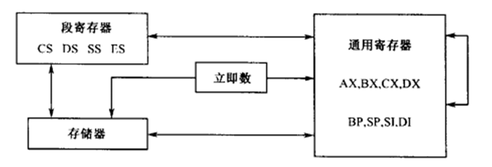

##### 举例：

```
mov     ax,es      ；ax←es
mov     ds,ax  ；ds←ax←es
mov     word ptr [si+2],0bh
```

   

##### 注意:  

​       **两个操作数类型要一致.操作宽度**

**不允许段寄存器向段寄存器传送**

##### 操作

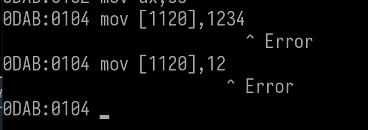

立即数到内存需要注意: 需要指明立即数要占多大内存   byte 表示字节  word 表示 字,寄存器不需要是因为他自带宽度属性

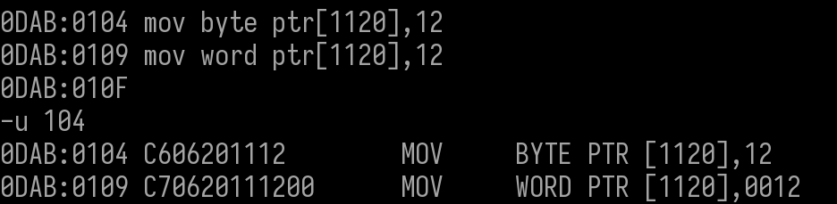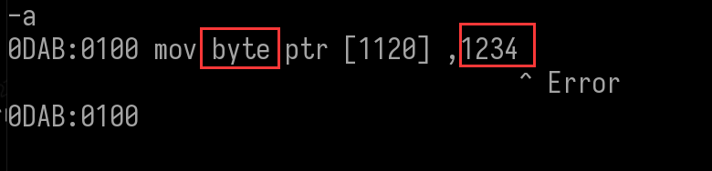

源操作数和目标数的长度必须一致,要么都是byte,要么都是word,个别指令除外,8位寄存器和16位寄存器相互赋值,会被系统转化成16位


段寄存器到内存需要指明宽度

段偏移的不同写法,推荐使用 [bp + si + 12 ]


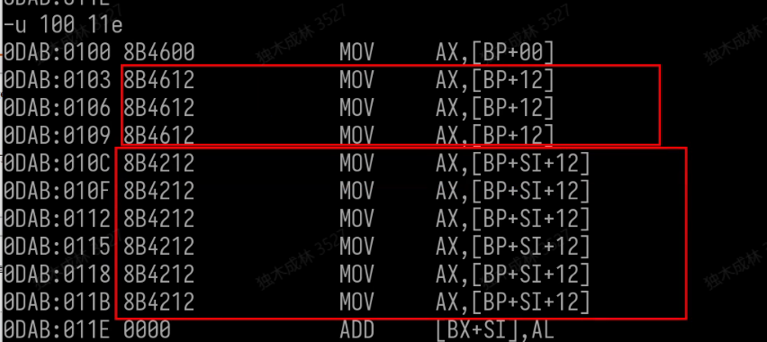


#### 交换指令XCHG（exchange）

##### 说明

 把两个地方的数据进行互换。**不存在存储器向存储器的传送指令。**

##### 举例

```
1. al, ah高低位交换       xchg  al,ah 
2.存储器 [2040]与[2050]交换   xchg  ax,[2040] 
                             xchg  ax,[2050] 
                             xchg  ax,[2040]
```

##### 注意

1.寄存器与寄存器之间可以对换数据

2.寄存器与存储器之间可以对换数据

3.不能在存储器与存储器之间对换数据

##### 操作

###### 寄存器到寄存器


###### 寄存器到内存


#### 换码指令XLAT

##### 说明

•作用：将BX 指定的缓冲区中、AL指定的位移处的一个字节取出赋给AL 。即 ：  al <-- ds:[ bx + al ]

•该指令无操作数。

•用途：键盘的扫描码，需要转为ASCII 码，可以将扫描码做成表，扫描码作下标可以查到对应的ASCII 码

类似于  al =  bx[al]; 

##### 操作

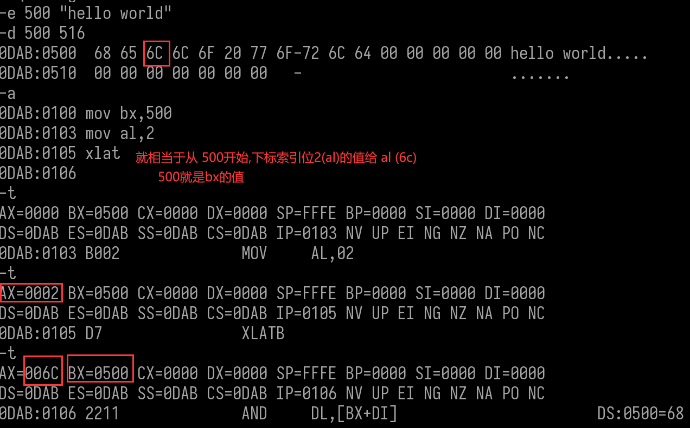


### 堆栈操作指令

#### 进栈（push reg）

##### 说明

将标志寄存器的内容压入堆栈，同时栈顶指针SP减2

等同于      sub    sp ,  2                申请内存

​                  mov   [sp] , reg        吧数据存入内存

寄存器SP的值就是当前栈顶


##### 操作

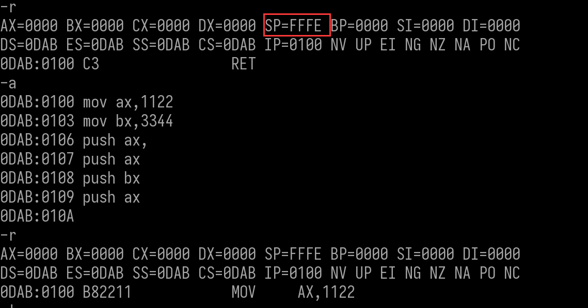

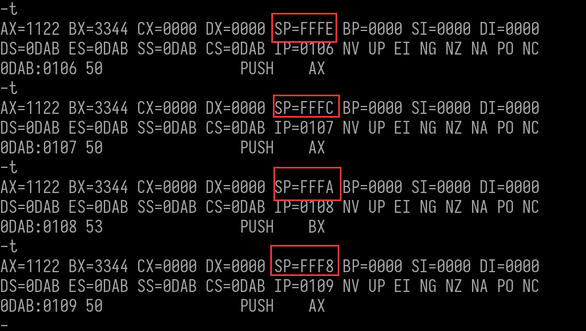

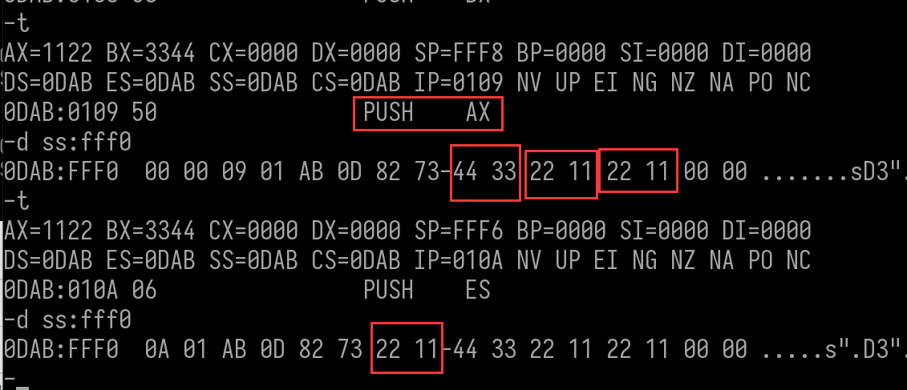这里查看数据内存是  -d ss:fffo  是因为 sp寄存器的段基址 是 ss,sp是段偏移


8位寄存器,8位内存和还有立即数是不可以入栈的


#### 出栈（pop reg）

##### 说明

将栈顶单元内容送到标志寄存器，同时栈顶指针SP 加 2  

等同于      **mov  reg, [sp]**               把把数据传给变量

​                  **add    sp ,   2**                   释放内存

##### 操作


#### 保存所有寄存器环境

##### 32位：pushad / popad

##### 16位：pusha / popa

###### 说明

将所有寄存器的值入栈或者出栈

一般用于函数,为了不影响其他函数的环境,自己先把寄存器环境入栈,自己操作完再出栈

###### 操作

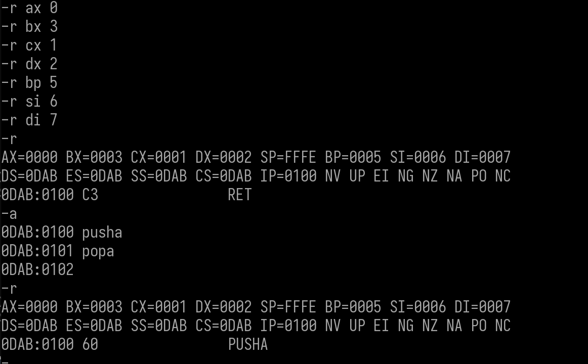

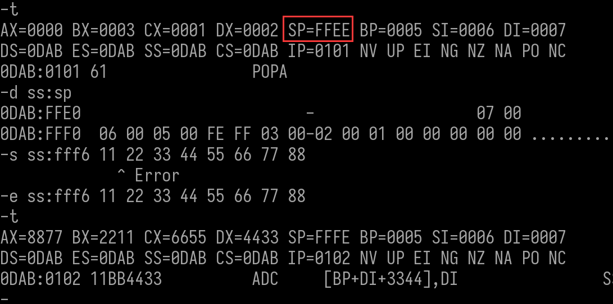

### 标志寄存器传送指令

标志寄存器传送指令用来传送标志寄存器FLAGS的内容，方便进行对各个标志位的直接操作

**•有2对4条指令**

–低8位传送：LAHF和SAHF

–16位传送：PUSHF和POPF

#### LAHF 和  SAHF


LAHF；AH←FLAGS的低字节

​      •LAHF指令将标志寄存器的低字节送寄存器AH

​      •SF/ZF/AF/PF/CF状态标志位分别送入AH的第7/6/4/2/0位，而AH的第5/3/1位任意

SAHF；FLAGS的低字节←AH

​     •SAHF将AH寄存器内容送FLAGS的低字节

​    •用AH的第7/6/4/2/0位相应设置SF/ZF/AF/ PF/CF标志


82 =  1000 0000   上面标志位图 可知   SF = 1  即  SF 状态标志位的值是 1     NG

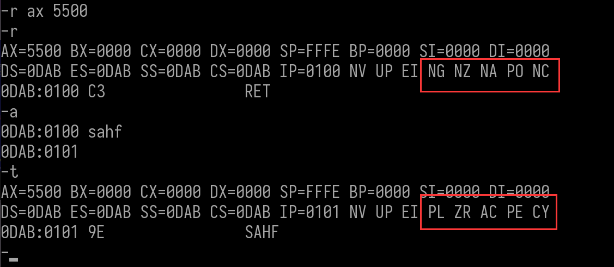

55  =  0101 0101  上面标志位图 可知  使   0 , 2 ,3, 6 号的标志位全部设为 1 


#### PUSHF   和  POPF

PUSHF

•SP←SP－2

•SS:[SP]←FLAGS

•PUSHF指令将标志寄存器的内容压入堆栈，同时栈顶指针SP减2

POPF

•FLAGS←SS:[SP]

•SP←SP＋2

•POPF指令将栈顶字单元内容送标志寄存器，同时栈顶指针SP加2


32字节传送

pushfd:将eflags压栈

popfd :将栈顶32字节出栈到eflags中


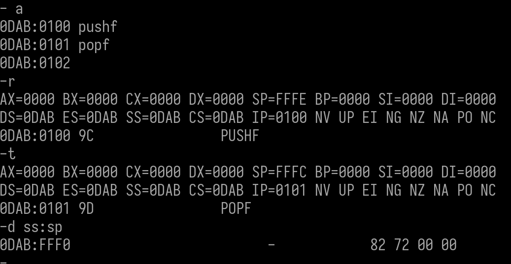

8272  转成  小尾  是   72 82

​       0          1         1            1		0	  0          1        0        1        0          0           0         0         0          1          0


可以看出    if 位  和 sf 位是 1


将值改成 FF 即   1 1 1 1 1 1 1 1 1 1 1 1 1 1 1 1   可以看出,所有标志位都变成了1

### 地址传送指令

•地址传送指令将存储器单元的逻辑地址送至指定的寄存器

​       –有效地址传送指令  LEA

​       –指针传送指令  LDS和LES

•注意不是获取存储器单元的内容

#### LEA（load EA）

##### 说明

  作用：将存储器操作数的有效地址传送至指定的16位寄存器中

​              还可以用来做多位数的加法

  格式:     LEA  reg16 ,[EA]  

举例

 LEA bx ,[bx + si]   //相当于bx = bx+si。

操作


可以看出  lea 跟 mov 的区别 是  lea 是 将 偏移值 给  寄存器,mov是获取 地址里面的值 给 寄存器

#### LDS && LES

LDS   r16,mem

​          r16←mem

​          DS←mem+2

​          LDS指令将主存中mem指定的字送至r16，并将mem的下一字送DS寄存器

​        相当于在内存中存了一个逻辑地址(四个字节  2个字节 表示段偏移,2个字节表示段基址),然后把段偏移给了寄存器,段基址给了DS

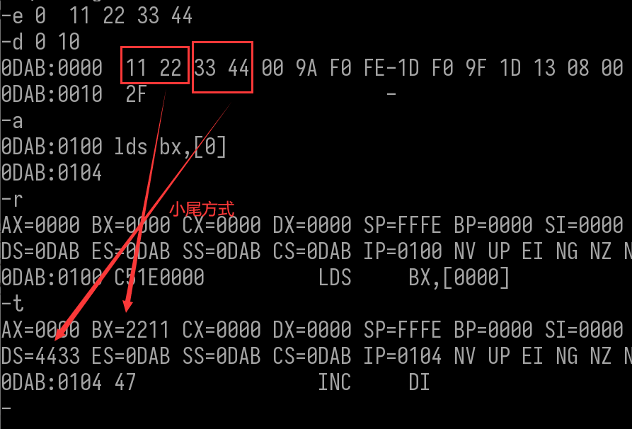

LES    r16, mem

   r16←mem，

​           ES←mem+2

  LES指令将主存中mem指定的字送至r16，并将mem的下一字送ES寄存器

 

### 输入输出指令

•8086通过输入输出指令与外设进行数据交换；呈现给程序员的外设是端口（Port）即I/O地址

•8086用于寻址外设端口的地址线为16条，端口最多为216＝65536（64K）个，端口号为0000H～FFFFH

•每个端口用于传送一个字节的外设数据

##### 输入输出寻址方式

•8086的端口有64K个，无需分段，设计有两种寻址方式

​     直接寻址：只用于寻址00H～FFH前256个端口，操作数i8表示端口号

​      间接寻址：可用于寻址全部64K个端口，DX寄存器的值就是端口号

•对大于FFH的端口只能采用间接寻址方式

#### 输入指令IN

•将外设数据传送给CPU内的AL/AX

IN AL,i8；    字节输入：AL←I/O端口（i8直接寻址）  

IN AL,DX； 字节输入： AL←I/O端口（DX间接寻址）

IN AX,i8 ；  字输入 ：   AX←I/O端口（i8直接寻址）

IN AX,DX； 字输入：    AX←I/O端口（DX间接寻址）

#### 输出指令OUT

•将CPU内的AL/AX数据传送给外设

OUT i8,AL；   字节输出：I/O端口←AL（i8直接寻址）

OUT DX,AL； 字节输出：I/O端口←AL（DX间接寻址）

OUT i8,AX；   字输出：I/O端口←AX（i8直接寻址）

OUT DX,AX； 字输出：I/O端口←AX（DX间接寻址）

### 算术运算指令

1.四则运算是计算机经常进行的一种操作。算术运算指令实现二进制（和十进制）数据的四则运算。

2.请注意算术运算类指令对标志的影响

掌握：ADD/ADC/INC、SUB/SBB/DEC/ NEG/CMP

熟悉：MUL/IMUL、DIV/IDIV

理解：CBW/CWD、DAA/DAS、 AAA/ AAS/AAM/AAD

#### 加法

##### add: 加法

ADD reg,imm/reg/mem；reg←reg＋imm/reg/mem         //把结果存入寄存器

ADD mem,imm/reg；  mem←mem＋imm/reg                   //把结果存入内存,内存不可以与内存相加


##### adc: 带进位加法

 跟上面区别是会加上上一次加法的进位值 ,常用于大数运算

ADC reg,imm/reg/mem； reg←reg＋imm/reg/mem＋CF    

ADC mem,imm/reg；         mem←mem＋imm/reg＋CF

```
编写汇编指令计算加法：
   76543218
+  fa23fbc3
= 170782DDB
```


##### inc: 加一(自增)，不影响CF标志位


#### 减法

##### Sub 减法

SUB reg,imm/reg/mem；  reg←reg－imm/reg/mem        //把结果存入寄存器

SUB mem,imm/reg；          mem←mem－imm/reg             //把结果存入内存,内存不可以与内存相减


##### Sbb带借位的减法

跟上面区别是会减去上一次减法的借位值 

SUB reg,imm/reg/mem；reg←reg－imm/reg/mem

SUB mem,imm/reg；        mem←mem－imm/reg

编写汇编指令计算减法：

 70782DDB
-76543218
 FA23FBC3

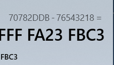


MOV AX,2DDB

0DAB:0100

0DAB:0103 SUB AX,3218

LV BX,7078

IODAB:0106 MOV

10DAB:0109 SBB BX,7654

0DAB:010D

-T

AX-2DDB BX-0000 CX-0000 DX-0000 SP-FFFE BP-0000 SI-0000 DI-000

SS-0DAB CS-0DAB IP-0103 NV UP EI NG NZ NA PO NC

DS-ODAB

ES-ODAB

AX,3218

0DAB:0103 2D1832

SUB

AX-FBC3 BX-0000 CX-0000 DX-0000 SP-FFFE BP-0000 SI-0000 DI-000

DS-ODAB ES-ODAB SS-0DAB CS-0DAB IP-0106 NV UP EI NG NZ NA PEI

CY

MOV

BX,7078

10DAB:0106 BB70

产生借位

AXFBC3 BX-7078 CX-000

DX-000 SP-FFE BP-0000 SI-0000 DI-0000

CS-ODAB IP-0109 NV UP EI NG NA PE CY

SS-ODAB

DS-ODAB ES-ODAB

BX,7654

0DAB:0109 81DB5476

SBB

7078 -7654

-1(借位)

CX-0000 DX-000 SP-FFFE BP-0000 SI-0000 DI-00000

FA23

AXFBC3

BX:

CS-ODAB IP-010D NV UP EI NG NZ NA PO CY

DS-ODAB

ES-ODAB SS-ODAB

AX

POP

58

IODAB:010D


 DEC -1，不影响CF位。 

100

-R

AX

A.

0DAB:0100 DEC AX

0DAB:0101

DEC AX

0DAB:0102

DEC AX

0DAB:0103 DEC AX

10DAB:0104

-T

100 SI-000 DI-0000

00FF

AX:

BX-000 CX-0000 DX-0000 SPFFE BP-0000

DS-0DAB ES-0DAB SS-0DAB CS-0DAB IP-0101 NV UP EI PL NZ AC PE NC

48

10DAB:0101

DEC

AX

BX-0000 CX-000 DX-0000 SP-FFFE BP-0000 SI-0000 DI-00000

AX-00FE

ES-0DAB SS-ODAB CS-0DAB IP-0102 NV UP EI PL NZ NA PO NC

DS-ODAB

DEC

0DAB:0102 48

AX

IBX-000 CX-0000 DX-0000 SP-FFFE BP-0000 SI-0000 DI-0000

AX-00FD

ES-0DAB SS-ODAB CS-0DAB IP-0103 NV UP EI PL NZ NA PO NC

OS-ODAB

0DAB:0103 48

AX

DEC

-T

AX-00FC

BX-0000 CX-0000 DX-000 SP-FFFE BP-0000 SI-00000 DI-0000

DS-ODAB ES-ODAB SS-0DAB CS-0DAB IP-0104 NV UP EI PL NZ NA PE NC


 求补指令NEG（negative） 

•NEG指令对操作数执行求补运算：用零减去操作数，然后结果返回操作数

•求补运算也可以表达成：将操作数按位取反后加1

•neg ax  ; 如果ax = 0，则CF标志位 = 0；若ax != 0, 则CF = 1

NEG reg/mem；      reg/mem←  0－reg/mem

一个数 + 这个数补码  =  0

-A

LODAB:0100 MOV AX,100

0DAB:0103 NEG AX

0DAB:0105 NEG AX

0DAB:0107

AX-0100 BX-0000 CX-000 DX-0000 SP-FFFE BP-0000 SI-00000 DI-0000

DS-0DAB ES-0DAB SS-0DAB CS-0DAB IP-0103 NV UP EI NG NZ

NZ NA PO NC

AX

0DAB:0103 F7D8

NEG

AX-FF00 BX-0000 CX-0000 DX-0000 SP-FFFE BP-0000 SI-00000 DI-0000

DS-0DAB ES-0DAB SS-0DAB CS-0DAB IP-0105 NV UP EI NG NG NA PE CY

0DAB:0105 F7D8

AX

NEG

AX-0100 BX-0000 CX-0000 DX-0000 SP-FFFE BP-0000 SI-0000 DI-0000

IDS-0DAB ES-0DAB SS-0DAB CS-0DAB IP-0107 NV UP EI PL NZ NA PE CY

JS

0179

0DAB:01077870


0DAB:0100

AX,0

MOV

0DAB:0103 NEG AX

(0DAB:0105

NEG AX

ODAB:0107

AX-000 BX-0000 CX-0000 DX-00000 SP-FFFE BP-0000 SI-0000 DI-000

NG NZ

IDS-ODAB ES-0DAB SS-0DAB CS-0DAB IP-0103 NV UP EI NO

PONC

NA

0DAB:0103 F7D8

NEG

AX

-T

AX-0000

BX-0000

0 DX-000 SP-FFFE BP-0000 SI-0000 DI-000

CX-0000 DX:

NC

CS-ODAB

SS-ODAB

DS-ODAB

PE

IP-0105 NV UP EI PL ZR NA

ES-ODAB

0DAB:0105 F7D8

NEG

AX

-T

AX-0000

BX-0000 CX-0000 DX-0000 SP-FFFE BP-0000 SI-0000 DI-0ARA

DS-ODAB ES-0DAB SS-0DAB CS-0DAB IP-0107 NV UP EI PL ZR NA PEINC

JS

0179

0DAB:01077870

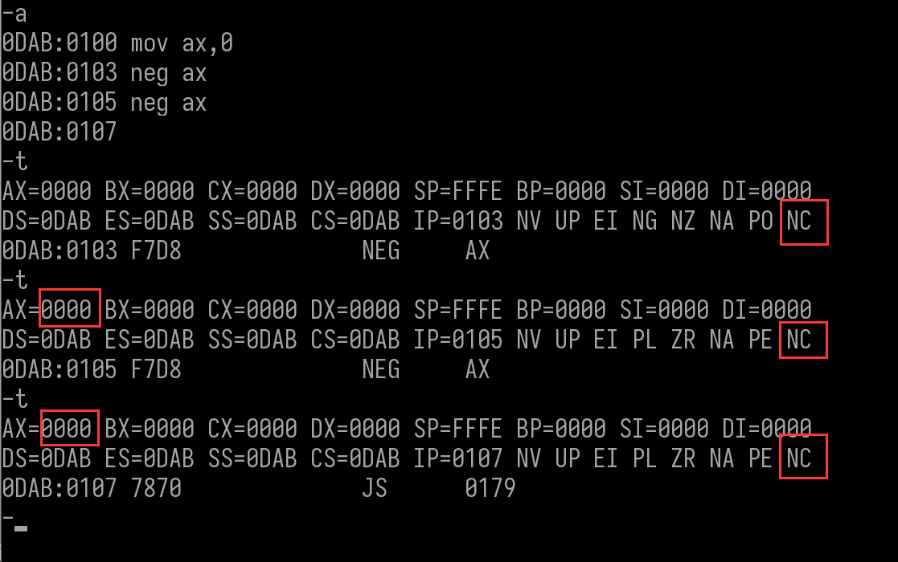


 作业 

1 选择指令实现下列要求，OPN1 ← OPN2的含义：把操作数OPN2的值传送给OPN1。

 	1)、SI ← BX              mov  si,bx
 	
 	2)、AL ← BH            mov  al,bh 
 	
 	3)、AX ← 13AH       mov  ax,013a 
 	
 	4)、SI ← 1000H       mov  si,1000
 	
 	5)、BX ← CL             mov   bx,cl
 	
 	6)、DS ← AX             mov   DS,AX
 	
 	7)、AL ← 12H           mov   AL,12
 	
 	8)、CX ← 0CDH       mov   CX,00CD                  (假设0CDH为无符号数)

 


2 PUSHA指令能把哪些寄存器压栈？它们进栈的顺序是什么？可用什么指令把这些寄存器依次弹出堆栈？

​       8个通用寄存器      进栈顺序为:  ax  cx  dx  bx  sp   bp  si  di

​      可用 popa  将这些寄存器依次弹出堆栈


3 PUSHAD指令完成什么操作？它与什么操作的作用相反？

​      32位cpu中,将所有寄存器入栈,保存寄存器环境

​     与他作用相反的操作是  popad

  

4 在16位/32位CPU中，标志位寄存器的内容进栈和出栈的指令是什么?

​                      进栈         出栈

​        16位     PUSHF     POPF

​        32位     pushfd    popfd

  

5 写出下列指令序列中每条指令的执行结果，请在Debug环境下验证之，并注意各标志位的变化情况。

 	MOV   BX,  23ABH       BX = 23AB
 	
 	ADD   BL,  0ACH           BX = 2357       ZF,AF,OF状态位改变
 	
 	MOV   AX,  23F5H        ax = 23f5        无状态位改变
 	
 	ADD   BH,  AL               bx = 1857       PF,AF,OF 状态位改变
 	
 	SBB   BX,  AX                bx = F461        PF 和 SF 状态位改变
 	
 	ADC   AX,  12H            ax  = 2408       CF 和 SF 状态位改变
 	
 	SUB   BH,  -9                bx  =  fd61       CF,AF,SF状态位改变

| 标志位 | 标志名称     | FLASE | TURE |
| ------ | ------------ | ----- | ---- |
| OF     | 溢出标志     | NV    | OV   |
| DF     | 方向标志     | UP    | DN   |
| IF     | 中断标志     | DI    | EI   |
| SF     | 符号标志     | PL    | NG   |
| ZF     | 零标志       | NZ    | ZR   |
| AF     | 辅助进位标志 | NA    | AC   |
| PF     | 奇偶标志     | PO    | PE   |
| CF     | 进位标志     | NC    | CY   |

MOV

BX, 23AB

0DAB:0100

ADD

0DAB:0103

BL, OAC

MOV

0DAB:0106

AX,  23F5

BH, AL

ADD

0DAB:0109

10DAB:010B

SBB

BX, AX

ADC

AX, 12

0DAB:010D

0DAB:0110

SUB

BH, -9

0DAB:0113

AX-0000 BX-23AB CX-000 DX-0000 SP-FFFFE BP-0000 SI-0000 DI-000

DS-0DAB ES-0DAB SS-0DAB CS-0DAB IP-0103 NV UP EI NG NZ NA PO NC

0DAB:0103 80C3AC

BL, AC

ADD

-000 SI-000 DI-0000

AX-0000 BX-2357 CX-0000 DX-000 SP-FFFE BP-0000 SI

DS-ODAB ES-0DAB SS-0DAB CS-0DAB IP-0106 OV UP EI PL NZ AC PO CY

0DAB:0106 B8F523

MOV

AX,23F5

AX-23F5 BX-2357 CX-000 DX-0000 SP-FFFFE BP-0000 SI-0000 DI-0000

DS-ODAB ES-0DAB SS-0DAB CS-0DAB IP-0109 OV UP EI PL NZ AC PO CY

BH, AL

0DAB:0109 00C7

ADD

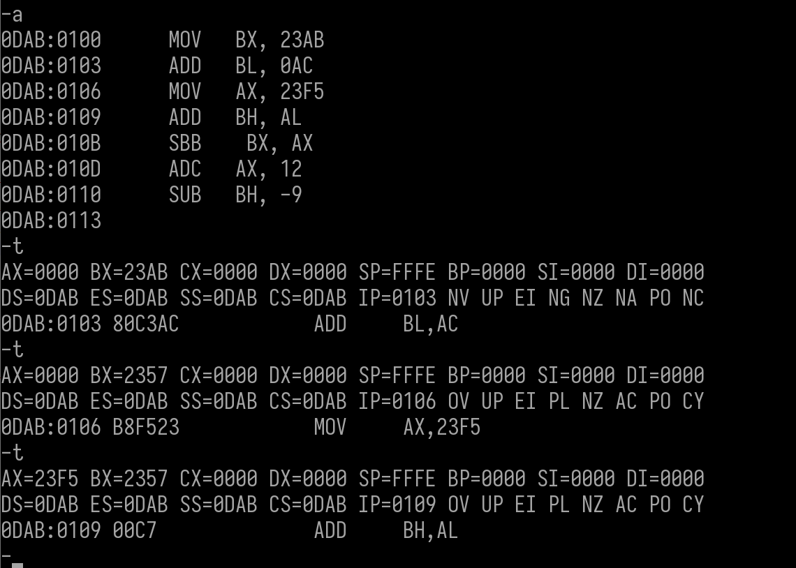


SP-FFE BP-0000 SI-000 DI-0000

AX-23F5 BX-1857 CX-000 DX-000

DS-ODAB ES-ODAB SS-ODAB CS-ODAB

IP-010B NV UP EI PL NZ NA PE CY

BX, AX

ODAB:010B 19C3

SBB

-T

I CX-000 DX-0000 SP-FFFFE BP-000 SI-0000 DI-0000

AX23F5 BX-F461 CX

DS-ODAB ES-ODAB SS-ODAB CS-ODAB IP

IP010D NV UP EI NG NZ NA PO CY

ODAB:010D83D012

AX,+12

ADC

-T

AX-2408 BX-F461 CX-0000 DX-0000 SP-FFFE BP-0000 SI-0000 DI-0000

SS-0DAB CS-ODAB IP-0110 NV UP EI PL NZ NA PO NC

DS-ODAB ES-ODAB

BH, F7

ODAB:011080EFF7

SUB

-T

AX-2408 BX-FD61 CX-000 DX-0000 SI

00 SPFFE BP-000 SI-0000 DI-000

IP-0113 NV UP EI NG NZ AC PO CY

DS-ODAB ES-ODAB

SS-ODAB CS-ODAB


6 假定DS=1123H，SS=1400H，BX=0200H，BP=1050H，DI=0400H，SI=0500H，

LIST的偏移量为250H，试确定下面各指令访问内存单元的地址。

 	1)、MOV AL, [1234H]             12464     =   1123 * 10 + 1234

​	2)、MOV AX, [BX]                    11430     =  1123*10 + 200

 	3)、MOV [DI], AL                     11630     =   1123 * 10  +  400

​	4)、MOV [2000H], AL             13230      =   1123 * 10  +  2000

 	5)、MOV AL, [BP+DI]             15450      =   1400 * 10 + (1050 + 400)

​	6)、MOV CX, [DI]                     11630     =   1123 * 10  +  400

 	7)、MOV EDX, [BP]                  15050     =   1400*10  + 1050

​	8)、MOV LIST[SI], EDX                    11980  =  1123 * 10 + 500 + 250 

 	9)、MOV CL, LIST[BX+SI]              12180   =   1123 * 10 + 500 + 250 +200

​	10)、MOV CH, [BX+SI]                   11930   =  1123 * 10  + 500 + 200

​	11)、MOV AL, [BP+SI+200H]       15750   =  1400*10  + 1050 + 500 +200

 	12)、MOV AL, [SI-0100H]              11630  =  1123 * 10 + 500 -100

​	13)、MOV BX, [BX+4]                     11434 =  1123 * 10 + 200 + 4

​	

7 已知SI=1200H,DS:[1205H]=1234H,试说明指令MOV BX,5[SI]和LEA BX,5[SI]的区别,执行后BX的内容分别是多少?

   MOV BX,5[SI]   是将  DS最为段基址  , si+ 5  = 1025 作为段偏移 处的值  1234 给  BX   ,此时 BX 值 是  1234

   LEA BX,5[SI]    是将   si+ 5  = 1025  的值 给 BX ,此时 BX 的值位 1025


8 用一条指令实现把BX和SI之和传送给CX。

​    LEA  CX,[BX+Si]

  

9 试比较下列三组指令的功能。

  1)、LDS SI, [DI]

将 si[di] 处的一个字传给  si   ,并将下一字传入 DS

SPFFFE BP-0000 SI-000 DI-0000

AX-0000 BX-000 CX-0000 DX-0000

UP EI NG NZ

NZ NA PO NC

ES-ODAB SS-0DAB CS-ODAB IP-0100 NV UP E

DS-ODAB

RET

10DAB:0100 C3

DS:DI 11 22 33 44

-E

J-

SP-FFFE BP-000 SI-000 DI-0000

BX-0000 CX-000 DX-0000

AX-0000

SS-0DAB CS-0DAB IP-0100 NV UP EI NG NZ NA PO NC

ES-ODAB

DS-ODAB

RET

ODAB:0100 C3

-A

ODAB:0100 LDS SI ,[DI]

0DAB:0102

-T

SI-2211 DI-0000

AX-000 BX-0000 CX-0000 DX-0000 SP-FFFE BP-0000

DS-4433 ES-0DAB SS-0DAB CS-0DAB IP-0102 NV UP EI NG NZ NA PO NC

[BX+SI],AL

0DAB:0102 000

ADD


  2)、MOV SI, [DI]　　　

  3)、MOV SI, [DI+2]   ?     感觉应该是:  MOV DS, [DI+2] 

BX-0000 CX-0000 DX-0000 SP-FFFE BP-0000 SI-0000 DI-0000

AX-0000

DS-ODAB

SS-ODAB

ES-ODAB

CS-ODAB IP-0100 NV UP EI NZ NA PO NC

DAB:0100 C3

RET

-E DS:DI 11 22 33 44 55

0DAB:0100

SI,LDIL

MOV

ODAB:0102

SI,[DI+2]

MOV

0DAB:0105

SP-FFFE BP-000 SI-2211 DI-000

AX-0000

BX-0000

CX-0000 DX-000

CS-ODAB

SS-ODAB

, IP-0102 NV UP EI NZ NA PO NC

ES-ODAB

DS-ODAB

SI,[DI+02]

MOV

8B7502

ODAB:0102

-T

AX-0000

BX-0000

FE BP-000 SI-4433 DI-000

CX-0000 DX-000 SPFFFE E

NV UP EI NG NZ NA PO NC

ES-ODAB

SS0DAB CS-0DAB IP-0105

DS-ODAB

[BX+SI],AL

ADD

10DAB:0105 000


 1 的指令 相当于   2,3两组指令的组合

-E DS:SI 11 22 33 44 55 66

AX-000 BX-00000 CX-0000 DX-0000 SP-FFFFE BP-0000 SI-0000 DI-0000

DS-ODAB ES-0DAB SS-0DAB CS-0DAB IP-0100 NV UP EI NG NG NA PO NC

RET

0DAB:0100 C3

-A

30 MOV SI, [DI]

ODAB:0100

2 MOV DS,WORD PTR [DI+2]

0DAB:0102

0DAB:0105

AX-000 BX-0000 CX

CX-00000 DX-000

00 SI-2211 DI-000

000 SPFFFE BP0000 ST

NV UP EI NG NZ NA PO NC

DS-0DAB ES-0DAB SS-0DAB CS-0DAB IP-0102

DS,WORD PTR [DI+02]

DS:0002-4433

0DAB:0102 8E5D02

MOV

AX-000 BX-0000 CX-00000 DX-0000 SP-FFE BP-0000 SI-2211

DI-0000

DS-4433

LES-0DAB SS-0DAB CS-0DAB IP-0105 NV UP EI NG NZ NA PO NC

[BX+SI],AL

DS:221100

ADD

0DAB:0105 000


10 标志位CF有着重要的作用，请简述之，并至少写出三种把CF置0的方法。

1  8位寄存器 与一个数相加 结果不产生进位

2  将 ah 寄存器的最低位值 改为 0 ,执行 SAHF  指令将AH寄存器内容送FLAGS的低字节

3  将  ax 的最低位 置 0 ,在通过  PUSHF   将 ax的值入栈,在通过  POPF  出栈


11.   使用今天学的指令，实现三目运算。

Reg == 0 ? 0 : -1

```
mov ax, 0
neg ax
sbb ax, ax

mov ax, 452
neg ax
sbb ax, ax
```

Reg == 1 ? 1 : 0

```
mov ax, 0
sub ax, 1
neg ax
sbb ax, ax
add ax, 1

mov ax, 452
sub ax, 1
neg ax
sbb ax, ax
add ax, 1
```

Reg == 8 ? 9 : 8

```
mov ax, 8
sub ax, 8
neg ax
sbb ax, ax
adc ax, 9


mov ax, 452
sub ax, 8
neg ax
sbb ax, ax
adc ax, 9
```

Reg == 6 ? 8 : 9

```
mov ax, 6
sub ax, 6
neg ax
sbb ax, ax
adc ax, 9

mov ax, 452
sub ax, 6
neg ax
sbb ax, ax
adc ax, 9
```

12 分析 test2.exe 

[📎TEST2.zip](./TEST2.zip)       输出5个星号(粉色)

调试方法:  把 exe 文件 放在 挂载文件目录之下 ,   debug  文件名即可


首先查看寄存器数据和标志位    此时栈顶 地址  为   E140


只有AX值发生改变     指令是   mov   ax,[bx+06]    所以推断出    DF40 + 6  处内存的值位为  FEF0

下一步   CALL   0E16:0000,改变了栈顶


继续执行       MOV    AX,0E04      将  ax值 赋值成   0e04       跟  ss 的一样    


MOV     SS,AX            将  ax值 赋值给  ss           申请栈空间

MOV     SP,0000        将sp的值 置0                                     


 MOV     AX,0E14      将 ax 的值 改成  0e14    


MOV     DS,AX    将 ax 的值 给 ds


MOV     AX,0E16   将  ax 的 值 改成   0e16      跟CS一样

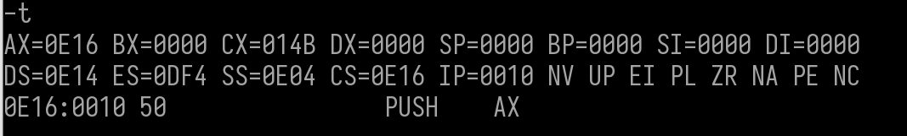

 PUSH    AX    将 ax 的值 入栈  


  MOV     AX,0026     将 ax 的值 改成 0026 


  PUSH    AX      将 ax 的值 入栈  

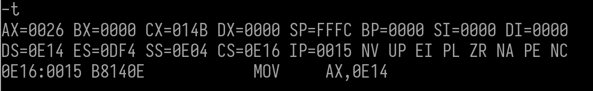

MOV     AX,0E14     再将 ax 的值 改成  0e14    更 DS同值


 PUSH    AX    将 ax 的值 入栈  


 MOV     AX,0000    再将 ax 的值 改成  0000      


 PUSH    AX    将 ax 的值 入栈             

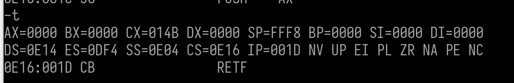

retf     指令是⽤栈中的数据，修改CS和IP的内容，从⽽实现了远转移(就是修改了CS和IP)


ADD     [DI],CL


 MOV     AH,09

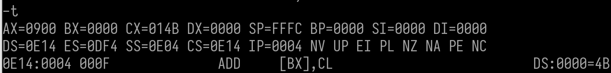

 ADD     [BX],CL


MOV     AL,2A


 ADD     [BX+DI],DL

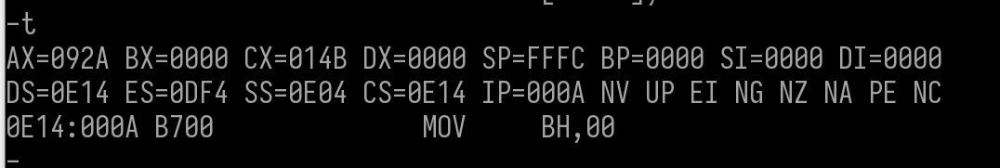

 MOV     BH,00


 ADD     [BP+DI],DL


MOV     BL,DA

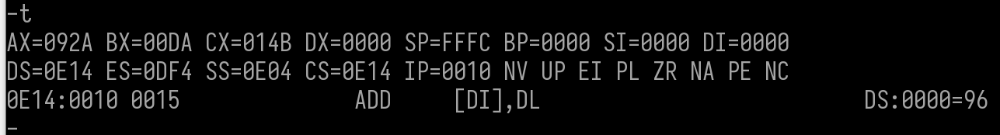

ADD     [DI],DL


MOV     CX,0005

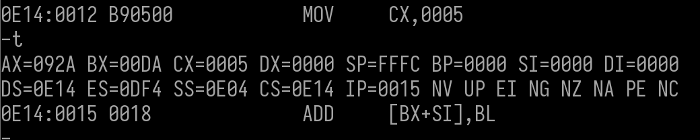

 ADD     [BX+SI],BL

