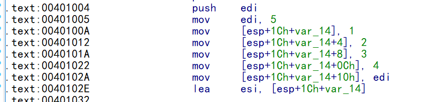

数组改低版本有差异,高版本差异是从2013开始的


### 什么是数组

数组是一组连续且一致的元素的集合

数组的特性:   连续     一致(业务功能)

结构体(成员都是整形)不是数组是因为成员的业务功能不一致

证明一致的方法:  

1.  循环,在一个循环中,跑同一块代码的变量业务功能肯定一致
2.  比例因子寻址     [base + reg*4]       reg的取值范围业务类型都一致

因此汇编中证明数组的方法

1.  比例因子寻址          因子寄存器的取值范围可以得到数组的界限
2.  循环结构                   循环次数的取值范围可以得到数组的界限


无法确定范围说明可以通过数组越界读写


## 数组的优化

### 一维数组

##### 比例因子寻址

​       **ary[n]  的地址  =   (int)  ary  +  n \* sizeof(type)**

**因此访问  第n个元素 就是   [  (int)  ary  +  n \* sizeof(type) ]**

```
int main(int argc, char* argv[])
{
    int ary[5]={1,2,3,4,5};
    ary[2] = 20;         //常量下标访问
    ary[argc] = 30;      //变量下标访问
    ary[argc/7] = 50;    //表达式下标访问
}
反汇编代码:
7:        int ary[5]={1,2,3,4,5};
0040D718   mov         dword ptr [ebp-14h],1
0040D71F   mov         dword ptr [ebp-10h],2
0040D726   mov         dword ptr [ebp-0Ch],3
0040D72D   mov         dword ptr [ebp-8],4
0040D734   mov         dword ptr [ebp-4],5
;上面看起来跟反汇编差不多.因此无法构成 是数组的依据
8:        ary[2] = 20;         //常量下标访问
0040D73B   mov         dword ptr [ebp-0Ch],14h
  ;这里产生了常量折叠    (ebp - 14h) + 2*4  =    ebp - 0Ch;
9:        ary[argc] = 30;      //变量下标访问
0040D742   mov         eax,dword ptr [ebp+8]
0040D745   mov         dword ptr [ebp+eax*4-14h],1Eh      
  ; [ebp+eax*4+var_14] =>    [(ebp+var_14)+eax*4] ,正常情况 eax 肯定有取值范围,不然就是漏洞
10:       ary[argc/7] = 50;    //表达式下标访问
0040D74D   mov         eax,dword ptr [ebp+8]
0040D750   cdq
0040D751   mov         ecx,7
0040D756   idiv        eax,ecx
0040D758   mov         dword ptr [ebp+eax*4-14h],32h
;先计算表达式,再把结果进行比例因子寻址
11:       return 0;
0040D760   xor         eax,eax


```

##### 无比例因子寻址有指针

在汇编中,判断是否指针 只需要看他是否保存了有效地址,保存了有效地址说明是指针

```
int main(int argc, char* argv[])
{
    int ary[5]={1,2,3,4,5};
    int *p =ary;
    for(int i= 0; i<5 ; i++)
    {
        printf("%d\r\n",*p);
        p++;
    }
    return 0;
}
反汇编代码:
debug版
7:        int ary[5]={1,2,3,4,5};
0040D718   mov         dword ptr [ebp-14h],1
0040D71F   mov         dword ptr [ebp-10h],2
0040D726   mov         dword ptr [ebp-0Ch],3
0040D72D   mov         dword ptr [ebp-8],4
0040D734   mov         dword ptr [ebp-4],5
8:        int *p =ary;
0040D73B   lea        eax,[ebp-14h] 
0040D73E   mov     dword ptr [ebp-18h],eax    ;保存了地址,所以 ebp-18h 这个变量是指针
9:        for(int i= 0; i<5 ; i++)
0040D741   mov         dword ptr [ebp-1Ch],0     //循环起点
0040D748   jmp         main+53h (0040d753)
0040D74A   mov         ecx,dword ptr [ebp-1Ch]
0040D74D   add         ecx,1        //循环步长
0040D750   mov         dword ptr [ebp-1Ch],ecx
0040D753   cmp         dword ptr [ebp-1Ch],5     //循环终点
0040D757   jge         main+77h (0040d777)
10:       {
11:           printf("%d\r\n",*p);
0040D759   mov         edx,dword ptr [ebp-18h]    //从地址 ebp-18h 开始,循环5轮,说明连续且一致
0040D75C   mov         eax,dword ptr [edx]      //指针取内容间接访问
0040D75E   push        eax
0040D75F   push        offset string "%d\r\n" (0042201c)
0040D764   call        printf (00401070)
0040D769   add         esp,8
12:           p++;
0040D76C   mov         ecx,dword ptr [ebp-18h]
0040D76F   add         ecx,4
0040D772   mov         dword ptr [ebp-18h],ecx
13:       }


```

##### 无比例因子无指针

结构体数组  不止四个字节,在比例因子寻址时,就会用到  imul 获得地址,再寻址

```
int main(int argc, char* argv[])
{
    int ary[5]={1,2,3,4,5};
    for(int i= 0; i<5 ; i++)
    {
        printf("%d\r\n",ary[i]);
       
    }
    return 0;
}
反汇编代码:

DEBUG版

7:        int ary[5]={1,2,3,4,5};
0040D718   mov         dword ptr [ebp-14h],1
0040D71F   mov         dword ptr [ebp-10h],2
0040D726   mov         dword ptr [ebp-0Ch],3
0040D72D   mov         dword ptr [ebp-8],4
0040D734   mov         dword ptr [ebp-4],5
8:        for(int i= 0; i<5 ; i++)
;循环,可以判定数组
0040D73B   mov         dword ptr [ebp-18h],0
0040D742   jmp         main+4Dh (0040d74d)
0040D744   mov         eax,dword ptr [ebp-18h]    
0040D747   add         eax,1
0040D74A   mov         dword ptr [ebp-18h],eax
0040D74D   cmp         dword ptr [ebp-18h],5
0040D751   jge         main+6Ah (0040d76a)
9:        {
10:           printf("%d\r\n",ary[i]);
0040D753   mov         ecx,dword ptr [ebp-18h]  ;从上面可以看出   ebp-18h 的取值范围是 0 - 5 
0040D756   mov         edx,dword ptr [ebp+ecx*4-14h]     ;比例因子寻址可以判定为数组
0040D75A   push        edx
0040D75B   push        offset string "%d\r\n" (0042201c)
0040D760   call        printf (00401070)
0040D765   add         esp,8
11:
12:       }

RELEASE版
release版都变成了指针,没有用到比例因子寻址
.text:00401005                 mov     edi, 5
.text:0040100A                 mov     [esp+1Ch+var_14], 1
.text:00401012                 mov     [esp+1Ch+var_10], 2
.text:0040101A                 mov     [esp+1Ch+var_C], 3
.text:00401022                 mov     [esp+1Ch+var_8], 4
.text:0040102A                 mov     [esp+1Ch+var_4], edi
.text:0040102E                 lea     esi, [esp+1Ch+var_14]        ;说明这里是数组首地址
.text:00401032
.text:00401032 loc_401032:                         ;循环
.text:00401032                 mov     eax, [esi]
.text:00401034                 push    eax
.text:00401035                 push    offset aD       ; "%d\r\n"
.text:0040103A                 call    sub_401050
.text:0040103F                 add     esp, 8
.text:00401042                 add     esi, 4         ;每次加4字节 说明是 dword 数组
.text:00401045                 dec     edi     ;循环式比较的是edi--   从5开始递减到0 
.text:00401046                 jnz     short loc_401032
.text:00401048                 pop     edi
.text:00401049                 xor     eax, eax
.text:0040104B                 pop     esi
.text:0040104C                 add     esp, 14h
.text:0040104F                 retn
```


这样就可以很容看出地址加的偏移



**高版本 RELEASE 版**

使用了多媒体指令集

.text:00401040                 push    ebp

.text:00401041                 mov     ebp, esp

.text:00401043                 sub     esp, 14h

.text:00401046                 movaps  xmm0, ds:__xmm@00000004000000030000000200000001

; xmm 是单位,表示128位     xmm0 相当于浮点型寄存中的  eax     这里就相当把 1,2,3,4 16字节一次性给xmm0

.text:0040104D                 push    esi

.text:0040104E                 movups  xmmword ptr [ebp+ary], xmm0

;这里相当于 把 xmm0 中 的 1,2,3,4 给数组中的 首地址开始的 16字节

.text:00401052                 mov     [ebp+ary+10h], 5   ;前面已经给了4个dword ,所以这里直接是5

.text:00401059                 xor     esi, esi

.text:0040105B                 nop     dword ptr [eax+eax+00h]

.text:00401060

.text:00401060 loc_401060:                         

.text:00401060                 push    [**ebp+esi\*4+ary]   ;比例因子, 每个元素长度为4字节**

.text:00401064                 push    offset _Format  ; "%d\r\n"

.text:00401069                 call    _printf

.text:0040106E                 inc     esi

.text:0040106F                 add     esp, 8

.text:00401072                 cmp     esi, **5**

.text:00401075                 jl      short loc_401060

.text:00401077                 xor     eax, eax

.text:00401079                 pop     esi

.text:0040107A                 mov     esp, ebp

.text:0040107C                 pop     ebp

.text:0040107D                 retn

###### 多媒体指令集

多媒体指令集:

总共8个寄存器 (xmm0  -   xmm7),每个寄存器长度是 128 位 (16字节)  除了能做多媒体指令外,还能用于浮点运算和数组的初始化,因此初始化一次就是 4个int,因此很容易把数组初始化完

##### 数组与数组相加

都转成了指针

```
int main(int argc, char* argv[])
{
    int ary[5]={1,2,3,4,5};
    for(int i= 0; i<5 ; i++)
    {
        printf("%d\r\n",ary[i] + ary[4-i] );
       
    }
    return 0;
}

反汇编代码:
低版本 RELEASE
text:00401000                 sub     esp, 14h
.text:00401003                 push    ebx
.text:00401004                 push    esi
.text:00401005                 mov     ebx, 5
.text:0040100A                 push    edi
.text:0040100B                 mov     [esp+20h+var_14], 1
.text:00401013                 mov     [esp+20h+var_10], 2
.text:0040101B                 mov     [esp+20h+var_C], 3
.text:00401023                 mov     [esp+20h+var_8], 4
.text:0040102B                 mov     [esp+20h+var_4], ebx
.text:0040102F                 lea     edi, [esp+20h+var_14]
.text:00401033                 lea     esi, [esp+20h+var_4]
.text:00401037
.text:00401037 loc_401037:       
                      
.text:00401037                 mov     eax, [edi]
.text:00401039                 mov     ecx, [esi]
;  eax  和   ecx 分别取内容
.text:0040103B                 add     eax, ecx
.text:0040103D                 push    eax
.text:0040103E                 push    offset aD       ; "%d\r\n"
.text:00401043                 call    sub_401060
.text:00401048                 add     esp, 8

.text:0040104B                 sub     esi, 4
.text:0040104E                 add     edi, 4
;一个取头,一个取尾
.text:00401051                 dec     ebx
.text:00401052                 jnz     short loc_401037
.text:00401054                 pop     edi
.text:00401055                 pop     esi
.text:00401056                 xor     eax, eax
.text:00401058                 pop     ebx
.text:00401059                 add     esp, 14h
.text:0040105C                 retn

高版本RELEASE

text:00401040                 push    ebp
.text:00401041                 mov     ebp, esp
.text:00401043                 sub     esp, 14h
.text:00401046                 movaps  xmm0, ds:__xmm@00000004000000030000000200000001
.text:0040104D                 push    esi
.text:0040104E                 push    edi
.text:0040104F                 movups  xmmword ptr [ebp+ary], xmm0
.text:00401053                 mov     [ebp+ary+10h], 5
.text:0040105A                 lea     edi, [ebp+ary+10h]    ;数组最后一个元素给edi
.text:0040105D                 xor     esi, esi
.text:0040105F                 nop
.text:00401060
.text:00401060 loc_401060:                         
.text:00401060                 mov     eax, [ebp+esi*4+ary]   ;数组第一个数给 eax
.text:00401064                 add     eax, [edi]                           ;2者相加
.text:00401066                 push    eax
.text:00401067                 push    offset _Format  ; "%d\r\n"
.text:0040106C                 call    _printf
.text:00401071                 inc     esi
.text:00401072                 lea     edi, [edi-4]
.text:00401075                 add     esp, 8
.text:00401078                 cmp     esi, 5
.text:0040107B                 jl      short loc_401060
.text:0040107D                 pop     edi
.text:0040107E                 xor     eax, eax
.text:00401080                 pop     esi
.text:00401081                 mov     esp, ebp
.text:00401083                 pop     ebp
.text:00401084                 retn
```

#### 字符数组

主要是识别常用的字符串函数,因为 release 版 会直接内联进汇编

```
#define _CRT_SECURE_NO_WARNINGS
#include <stdio.h>
#include <string.h>
int main(int argc, char* argv[])
{
    char szHello[] = "Hello world!";
    char szBuf[20];
    strcpy(szBuf, szHello);
    printf(szBuf);
    return strlen(szHello);
}

高版本:
.text:00401050                 mov     eax, ds:dword_402108
.text:00401055                 movq    xmm0, qword ptr ds:aHelloWo ; "Hello wo"
.text:0040105D                 mov     dword ptr [ebp+szHello+8], eax
.text:00401060                 mov     al, ds:byte_40210C
.text:00401065                 mov     [ebp+szHello+0Ch], al
.text:00401068                 xor     eax, eax
.text:0040106A                 movq    qword ptr [ebp+szHello], xmm0
.text:0040106F                 nop
.text:00401070
.text:00401070 loc_401070:                        
.text:00401070                 mov     cl, [ebp+eax+szHello]    ;eax取数组首地址
.text:00401074                 lea     eax, [eax+1]        
.text:00401077                 mov     [ebp+eax+var_29], cl
.text:0040107B                 test    cl, cl                        ;判断 \0
.text:0040107D                 jnz     short loc_401070
.text:0040107F                 lea     eax, [ebp+szBuf]
.text:00401082                 push    eax             ; _Format
.text:00401083                 call    _printf
.text:00401088                 lea     eax, [ebp+szHello]
.text:0040108B                 add     esp, 4
.text:0040108E                 lea     edx, [eax+1]
.text:00401091
.text:00401091 loc_401091:                         
.text:00401091                 mov     cl, [eax]
.text:00401093                 inc     eax
.text:00401094                 test    cl, cl               ;判断 \0
.text:00401096                 jnz     short loc_401091
.text:00401098                 mov     ecx, [ebp+var_4]
.text:0040109B                 sub     eax, edx        ;尾指针 - (头指针 + 1) ,求字符串长度    头+1 是去掉 \0


低版本:
.text:00401000                 sub     esp, 24h
.text:00401003                 mov     eax, dword_407030
.text:00401008                 mov     ecx, dword_407034
.text:0040100E                 mov     edx, dword_407038
.text:00401014                 mov     [esp+24h+var_24], eax
.text:00401018                 mov     al, byte_40703C
.text:0040101D                 push    esi
.text:0040101E                 push    edi
.text:0040101F                 mov     [esp+2Ch+var_20], ecx
.text:00401023                 mov     [esp+2Ch+var_18], al
.text:00401027                 lea     edi, [esp+2Ch+var_24]    ;源字符串首地址
.text:0040102B                 or      ecx, 0FFFFFFFFh
.text:0040102E                 xor     eax, eax
.text:00401030                 mov     [esp+2Ch+var_1C], edx
.text:00401034                 lea     edx, [esp+2Ch+var_14]     ;目标字符串首地址
.text:00401038                 repne scasb
.text:0040103A                 not     ecx
;求长度  strlen
.text:0040103C                 sub     edi, ecx
.text:0040103E                 mov     eax, ecx
.text:00401040                 mov     esi, edi
.text:00401042                 mov     edi, edx
.text:00401044                 shr     ecx, 2       ; /4    四字节拷贝  总长度除以四,四字节拷贝次数
.text:00401047                 rep movsd      ;四字节拷贝
.text:00401049                 mov     ecx, eax
.text:0040104B                 and     ecx, 3   ; %4   ,四字节拷贝完,剩下的字节,不足四节一个字节的拷贝
.text:0040104E                 rep movsb     ;一字节拷贝
.text:00401050                 lea     ecx, [esp+2Ch+var_14]
.text:00401054                 push    ecx
.text:00401055                 call    sub_401080
注意:  拷贝前面没有求长度 ,那么 有可能是 memcpy  , 有求长度则是 strcpy

.text:0040105A                 lea     edi, [esp+30h+var_24]
.text:0040105E                 or      ecx, 0FFFFFFFFh
.text:00401061                 xor     eax, eax
.text:00401063                 add     esp, 4
.text:00401066                 repne scasb      
 ;  repne    不等于就重复  al = 0,所以是找 \0    scasb:  edi指向的空间是否等于al,如果不等于 ecx-1,edi+1;
.text:00401068                 not     ecx
.text:0040106A                 dec     ecx          ;如果是  strlen(szBuf) + 1 ,则此条指令没有
.text:0040106B                 pop     edi
.text:0040106C                 mov     eax, ecx
.text:0040106E                 pop     esi
.text:0040106F                 add     esp, 24h
.text:00401072                 retn

分析:      ecx = -1   
=>    -1  -  Length  -1  =ecx  
=>  - Length  = ecx +2
=>   Length   = -ecx - 2
=>    Length  =  neg(ecx ) - 2
=>    Length  =  not (ecx) + 1- 2
=>    Length  =  not (ecx) -1
```


对于memcpy  如果长度 太小,那么就会直接  move 实现, 如果很长 ,在低版本就是 **movsd**  和  **movsw** ,**scasb** 搭配高版本种可能还有 多媒体指令集


### 二维数组

二维数组在低版本才有优化,高版本无优化(看循环)

二维数组的寻址公式

type ary[N][M] = {.....}

int  x ,y

ary[x][y] 的地址为:

=  (int) ary  + sizeof ( type [M]) *x              //第一次下标运算得到一维数组  ary[x]

​     \+ sizeof ( type ) *y                                    //第二次下标运算得到维维数组  ary[y]

=    **(int) ary  + sizeof ( type [M]) \* x     + sizeof ( type ) \*  y**          //调试版寻址    

= (int) ary  + sizeof ( type) *M * x     + sizeof ( type ) *  y   

=    **(int) ary  + sizeof ( type ) \*  (M\* x  + y)**           //release版寻址    


三维数组的寻址公式

type ary[N][M][L] = {.....}

int  x ,y,z

ary[x][y] [z]的地址为:

=  (int) ary  + sizeof ( type [M][L]) *x              //第一次下标运算得到一维数组  ary[x]

​     \+ sizeof ( type[L] ) *y                                    //第二次下标运算得到维维数组  ary[y]

​    \+ sizeof ( type ) *z                                        //第三次下标运算得到维维数组  ary[y]

=    **(int)ary +sizeof(type [M][L]) \* x + sizeof ( type [L]) \* y+ sizeof ( type [L]) \*  z**          //调试版寻址    

= (int) ary  + sizeof ( type) *M*L * x     + sizeof ( type ) * L *  y   + sizeof ( type ) * z

=    **(int) ary  + sizeof ( type ) \*  (  L \* ( M \* x + y) + z)**           //release版寻址  


这时候不管是多维数组还是一维数组,归根结底就是变成了运算符 和 表达式的还原

```
int main(int argc, char* argv[])
{
    int ary[2][3] ={
        {10,20,30},
        {40,50,60},
    };

    for(int i =0; i<2;i++)
    {
        for(int j =0; j<3;j++)
        {
       
            printf("%d\r\n",ary[i][j]);
        }
    }
    return 0;
}
反汇编代码:
调试版  DEBUG
7:        int ary[2][3] ={
8:            {10,20,30},
0040D718   mov         dword ptr [ebp-18h],0Ah
0040D71F   mov         dword ptr [ebp-14h],14h
0040D726   mov         dword ptr [ebp-10h],1Eh
9:            {40,50,60},
0040D72D   mov         dword ptr [ebp-0Ch],28h
0040D734   mov         dword ptr [ebp-8],32h
0040D73B   mov         dword ptr [ebp-4],3Ch
10:       };
11:
12:       for(int i =0; i<2;i++)
0040D742   mov         dword ptr [ebp-1Ch],0
0040D749   jmp         main+54h (0040d754)
0040D74B   mov         eax,dword ptr [ebp-1Ch]
0040D74E   add         eax,1
0040D751   mov         dword ptr [ebp-1Ch],eax
0040D754   cmp         dword ptr [ebp-1Ch],2
0040D758   jge         main+94h (0040d794)
13:       {
14:           for(int j =0; j<3;j++)
0040D75A   mov         dword ptr [j],0
0040D761   jmp         main+6Ch (0040d76c)
0040D763   mov         ecx,dword ptr [j]
0040D766   add         ecx,1
0040D769   mov         dword ptr [j],ecx
0040D76C   cmp         dword ptr [j],3
0040D770   jge         main+92h (0040d792)
15:           {
16:
17:               printf("%d\r\n",ary[i][j]);
0040D772   mov         edx,dword ptr [ebp-1Ch]
0040D775   imul        edx,edx,0Ch   
0040D778   lea         eax,[ebp+edx-18h]
 ;第一次下标运算
0040D77C   mov         ecx,dword ptr [j]
0040D77F   mov         edx,dword ptr [eax+ecx*4]    ;比例因子寻址
 ;第二次下标运算
0040D782   push        edx
0040D783   push        offset string "%d\r\n" (0042201c)
0040D788   call        printf (00401070)
0040D78D   add         esp,8
18:           }
0040D790   jmp         main+63h (0040d763)
19:       }

RELEASE版
int main(int argc, char* argv[])
{
    int ary[2][3] ={
        {10,20,30},
        {40,50,60},
    };

    int x,y;
    scanf("%d%d",&x,&y);
    ary[x][y]=999;
    
    return 0;
}
反汇编代码
.text:00401003                 lea     eax, [esp+20h+var_1C]
.text:00401007                 lea     ecx, [esp+20h+var_20]
.text:0040100B                 push    eax
.text:0040100C                 push    ecx
.text:0040100D                 push    offset Format   ; "%d%d"
.text:00401012                 call    _scanf
.text:00401017                 mov     eax, [esp+2Ch+var_20]     ; x
.text:0040101B                 mov     edx, [esp+2Ch+var_1C]    ; y
.text:0040101F                 lea     ecx, [edx+eax*2]           ; ecx = 2x + y
.text:00401022                 add     eax, ecx                             ;  eax =  3x+y
.text:00401024                 mov     [esp+eax*4+2Ch+var_18], 3E7h
.text:0040102C                 xor     eax, eax
.text:0040102E                 add     esp, 2Ch
.text:00401031                 retn


int main(int argc, char* argv[])
{
    int ary[2][3] = {
    {10,20,30},
    {40,50,60},
    };
    int x, y;
    scanf_s("%d%d", &x, &y);
    ary[x][y] = 999;
    for (int i = 0; i < 2; i++)
    {
        for (int j = 0; j < 3; j++)
        {
            printf("%d\r\n", ary[i][j]);
        }
    }
    return 0;
}
高版本汇编代码:
.text:004010A0                 movaps  xmm0, ds:__xmm@000000280000001e000000140000000a
.text:004010A7                 lea     eax, [ebp+y]
.text:004010AA                 push    ebx
.text:004010AB                 push    esi
.text:004010AC                 push    edi
.text:004010AD                 push    eax
.text:004010AE                 lea     eax, [ebp+x]
.text:004010B1                 mov     [ebp+ary+10h], 32h
.text:004010B8                 push    eax
.text:004010B9                 push    offset _Format  ; "%d%d"
.text:004010BE                 movups  xmmword ptr [ebp+ary], xmm0
.text:004010C2                 mov     [ebp+ary+14h], 3Ch 
.text:004010C9                 call    _scanf_s
.text:004010CE                 mov     ecx, [ebp+x]
.text:004010D1                 lea     esi, [ebp+ary]
.text:004010D4                 mov     eax, [ebp+y]
.text:004010D7                 add     esp, 0Ch
.text:004010DA                 mov     ebx, 2
.text:004010DF                 lea     eax, [eax+ecx*2]
.text:004010E2                 add     eax, ecx
.text:004010E4                 mov     [ebp+eax*4+ary], 3E7h    ;比例因子寻址
.text:004010EC                 nop     dword ptr [eax+00h]
.text:004010F0
.text:004010F0 loc_4010F0:                           
.text:004010F0                 mov     edi, 3
.text:004010F5                 db      66h, 66h
.text:004010F5                 nop     word ptr [eax+eax+00000000h]   ;对齐到0地址
.text:00401100
.text:00401100 loc_401100:                            
.text:00401100                 push    dword ptr [esi]
.text:00401102                 push    offset aD       ; "%d\r\n"
.text:00401107                 call    _printf
.text:0040110C                 add     esp, 8
.text:0040110F                 add     esi, 4
.text:00401112                 sub     edi, 1
.text:00401115                 jnz     short loc_401100
.text:00401117                 sub     ebx, 1
.text:0040111A                 jnz     short loc_4010F0
```

编译器经常为了对齐或者其他考虑,或者合并指令的考虑,不一定是从数组首地址寻址 ,而是从数组首地址 +1, -1 的地方开始寻址,这样可以省一条指令,如果不在首地址,寻址的时候,对应的偏移量 页跟着 加或减对应的值就可以了,如果首地址不在第一个元素的位置而在后面元素的地址调整  sizeof (type) * n 就可以了

到了数组,会结合前面的很多优化手段,因为存在借指令的情况,即前面的指令,后面直接拿来用


### 借指令

前面的指令,后面直接拿来用,一般是为了节省指令或者减少指令长度

```
int main(int argc, char* argv[])
{
    int ary[5]={1,2,3,4,5};
    for(int i= 0; i<5 ; i++)
    {
        printf("%d\r\n",ary[i]);  
    }
    return 0;
}
反汇编代码:
.text:00401005                 mov     edi, 5
.text:0040100A                 mov     [esp+1Ch+var_14], 1
.text:00401012                 mov     [esp+1Ch+var_10], 2
.text:0040101A                 mov     [esp+1Ch+var_C], 3
.text:00401022                 mov     [esp+1Ch+var_8], 4
.text:0040102A                 mov     [esp+1Ch+var_4], edi   ;这本来应该是 5 ,但是为了节省字节用了前面的edi
.text:0040102E                 lea     esi, [esp+1Ch+var_14]
.text:00401032
.text:00401032 loc_401032:                             ; CODE XREF: _main+46↓j
.text:00401032                 mov     eax, [esi]
.text:00401034                 push    eax
.text:00401035                 push    offset aD       ; "%d\r\n"
.text:0040103A                 call    sub_401050
.text:0040103F                 add     esp, 8
.text:00401042                 add     esi, 4
.text:00401045                 dec     edi
.text:00401046                 jnz     short loc_401032
.text:00401048                 pop     edi
.text:00401049                 xor     eax, eax
.text:0040104B                 pop     esi
.text:0040104C                 add     esp, 14h
```


可以看到用寄存器的指令长度要小于 立即数


### 作业

分析 strcmp 的返回结果

```
int main(int argc, char* argv[])
{
    return (int)strcmp(argv[0],argv[1]);
}

反汇编代码:
.text:00401000                 mov     eax, [esp+argv]
.text:00401004                 push    ebx
.text:00401005                 push    esi
.text:00401006                 mov     esi, [eax+4]
.text:00401009                 mov     eax, [eax]
.text:0040100B
.text:0040100B LOOP_BEGIN:                       
.text:0040100B                 mov     dl, [eax]
.text:0040100D                 mov     bl, [esi]
.text:0040100F                 mov     cl, dl
.text:00401011                 cmp     dl, bl
.text:00401013                 jnz     short LOOP_END
.text:00401015                 test    cl, cl
.text:00401017                 jz      short loc_40102F
.text:00401019                 mov     dl, [eax+1]
.text:0040101C                 mov     bl, [esi+1]
.text:0040101F                 mov     cl, dl
.text:00401021                 cmp     dl, bl
.text:00401023                 jnz     short LOOP_END
.text:00401025                 add     eax, 2
.text:00401028                 add     esi, 2
.text:0040102B                 test    cl, cl
.text:0040102D                 jnz     short LOOP_BEGIN
.text:0040102F
.text:0040102F loc_40102F:                           
.text:0040102F                 pop     esi
.text:00401030                 xor     eax, eax
.text:00401032                 pop     ebx
.text:00401033                 retn
.text:00401034 ; ---------------------------------------------------------------------------
.text:00401034
.text:00401034 LOOP_END:                            
.text:00401034                                        
.text:00401034                 sbb     eax, eax

cmp     dl, bl  ,当 dl != bl时跳转
当  dl >  bl   即 str1>str2  ,cf=0
sbb   =>  eax = eax - eax  -cf   =>  =  0 
当  dl < bl   即 str1< str2, cf = 1
sbb   =>  eax = eax - eax  -cf   =>  = -1

.text:00401036                 pop     esi
.text:00401037                 sbb     eax, 0FFFFFFFFh

=>  eax = eax - ( -1)  -cf   
=>  eax =  0  时 cf =0  =>   eax = eax - ( -1)  -cf   = 1
=>  eax =  -1  时 cf =1   =>   eax = eax - ( -1)  -cf   = -1
=>  当  dl >  bl   即 str1> str2    返回值  eax =  1
=>  当  dl <  bl   即 str1< str2    返回值  eax = - 1

.text:0040103A                 pop     ebx
.text:0040103B                 retn
```

