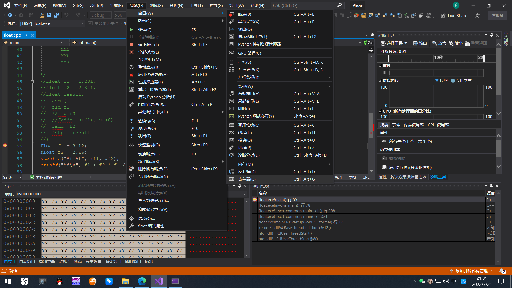
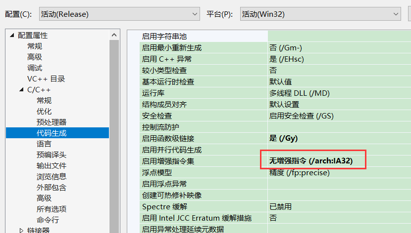
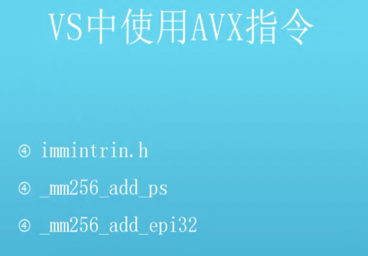

浮点寄存器有时候会用在其他优化地方,例如 数组的初始化

 __asm cpuid   通过 这条指令可以拿到cpu 的信息

### 浮点协处理器

​          定点数:      早期计算机是不能做浮点运算的,只支持正数的运算,因此发明了定点数,2个浮点数转成整数在 除以 10 的小数点次数的幂,获得正数,在打印一个点,在获取  %   0 的小数点次数的幂 获得余数

​         但是定点数保存的数值范围很小,因此  小数点 的 位置确定 , 例如  16位 ,前8位整数, 后8位保存小数,那么整数部分超过8位就无法保存,空间没办法最大化利用,因此发明了浮点数,即小数点的位置是浮动的

​       现在的浮点格式 基本是    IEEE     1(符号)   8 (指数,小数点位置)      23 (值)       浮点数的有效数字是7位

为了解决浮点运算,因此发明了浮点协处理器 

​          浮点指令最开始是通过模拟运算来进行的，效率低下。后来为了提高效率，从硬件入手，产生了只能做浮点运算的x87浮点处理器（副处理器），协助整型处理器（主处理器）进行运算，故浮点处理器又称为浮点协处理器FPU。

​      在早期的计算机行业  浮点协处理器 并不是普及的,因此价格比较贵或者不需要

​     

​     浮点指令的更新很慢,因为旧的cpu不能用,没这条指令,只能等新的cpu普及了才能用,否则程序可能无法运行

​      

​     AMD 的浮点指令 和  INTEL  的 浮点指令存在部分差异

### x87浮点处理器

#### 1.浮点寄存器（存储浮点数）

-   数量8个：ST(0)–ST(7)；
-   结构：stack registers，栈结构（循环堆栈闭环结构）， 只能操作栈顶。 
-   运算： 

-   -   入栈相当于从st(0)向下压。
    -   只能在栈顶运算，所以做完浮点运算后，数据必须出栈。
    -   出栈相当于整体向上挪，出栈的寄存器st(0)的值移动到末尾ST(7)。
    -   浮点寄存器满了再操作会报错。
    -    不能直接操作寄存器

#### 2.浮点指令（操作）

-   Intel x87 FPU专门用于执行浮点计算，可以对单精度浮点（32位）、双精度浮点（64位）、扩展双精度浮点（80位）进行计算。
-   **常用浮点数指令：**

-   -   入栈：fld(内存地址)  fild(整形内存地址,转为浮点型)
    -   加：fadd[p]     带p代表出栈一次
    -   减：fsub[p]
    -   乘：fmul[p]
    -   除：fdiv[p]
    -   作比较:  fcom
    -   求绝对值: fabs 
    -   出栈：fst（把寄存器值拷贝到内存，栈不变）、fstp（把寄存器值拷贝到内存，出栈一次）  fisp (把值转整形再给内存)     fistp (把值转整形再给内存，出栈一次)


-   **FADDP运算过程模拟：**1（栈顶st(0)）+2作运算后，原1出栈弃，原2循环至st(7)，结果3置于原2处（新晋栈顶）。


#### 3.**代码用例**

```
int main()
{
    //注意,如果用 {}赋值表示不允许隐式转换，避免=赋值运算时产生的丢失精度问题
    float f1 = 1.23f;
    float f2 = 2.34f;
    float result = 0.0f;	// 返回值必须初始化
    
    // 优化前：寄存器间操作
    __asm
    {
		fld f1;		        //fl压栈 st(0) = 1.23f
        fld f2;		        //f2压栈 st(0) = 2.34f；st(1) = 1.23f
        faddp st(1), st(0);	// st(0) = 3.57f；st(7) = 2.34f
        fstp result;			// st(6) = 2.34f；st(7) = 3.57f；ret = 3.57f
    }
    
    // 优化后：直接加内存，减少两次操作（入栈出栈各一次） 内存操作不能带p
    __asm
    {
     	fld f1;		// st(0) = 1.23f
        fadd f2;	// st(0) 1.23f + 内存值  2.34f → st(0) = 3.57f
        fstp result;	// st(7) = 3.57f ；ret = 3.57f
    }   
}
```

调试:






```
int main() {
  float f1 = 3.12;
  float f2 = 2.66;
  printf("%f\n", f1 + f2 * f1 / f2 );
  return 0;
}
反汇编代码:
debug版
fld     ds:flt_417B3C        
fstp    [ebp+var_8]
;入栈 出栈 初数化值
fld     ds:flt_417B38
fstp    [ebp+var_14]    

fld     [ebp+var_14]
fmul    [ebp+var_8]        ;乘法
fdiv    [ebp+var_14]       ;除法
fadd    [ebp+var_8]       ;加法
sub     esp, 8
fstp    qword ptr [esp+0ECh+var_EC] ; char
push    offset aLf      ; "%lf\n"
call    sub_4110CD
add     esp, 0Ch
xor     eax, eax


int main() {
    float f1 = 3.12f;
   float f2 = 2.66f;
   scanf_s("%f %f", &f1, &f2);
   printf("%lf\n", f1 + f2 * f1 / f2 );
   return 0;
}
反汇编代码:
release版
fld     ds:flt_402114
lea     eax, [esp+40h+var_C]
push    eax
fstp    dword ptr [esp+44h+Arglist]
fld     ds:flt_402110
lea     eax, [esp+44h+Arglist]
push    eax             ; Arglist
push    offset aFF      ; "%f %f"
fstp    [esp+4Ch+var_C]
call    sub_401060
fld     [esp+4Ch+var_C]
add     esp, 4
fld     dword ptr [esp+48h+Arglist]
fld     st
;都压栈,内存操作效率低
fmul    st, st(2)
fdivrp  st(2), st
faddp   st(1), st
fstp    qword ptr [esp+48h+ArgList] ; ArgList
push    offset Format   ; "%lf\n"
call    sub_401020
```

 4.缺点 

​       操作不方便,需要不停出栈入栈

​     不能直接操作指定寄存器


 MMX指令集 

并行正数运算

 1.MMX指令集概念 

●MMX（Multi Media eXtension，多媒体扩展指令集）指令集是Intel公司于1996年推出的一项多媒体指令增强技术（并行运算技术，使得做一次运算和做多次运算的速度是一样的 ）。  

●MMX指令集包括57条多媒体指令，通过这些指令可以一次处理多个数据，在处理结果超过实际处理能力的时候也能正常进行处理，这样在软件的配合下，就可以得到更高的性能。

●只支持整型的并行运算，不支持浮点数的并行运算（此问题由AMD公司解决）。

 2.MMX指令集优势 

●取消了浮点栈结构，与通用寄存器操作一致。

 3.MMX寄存器 

●MMX8个64位寄存器名称：MM0 ~ MM7。

●MM0 ~ MM7== st(0) ~ st(7) ，以便兼容都是栈相关，改变mm0，st(0)也改变，一般观察mmx指令集后即可。

 4.mmx常用浮点指令 

●首字母前缀p：打包运算，即整个寄存器做运算。

●饱和方式：有符号运算不会溢出，如255+1=255，一般用在显示器算法当中。

常用指令表

私锁

CRACKING

使用格式

指令名称

指令功能

复制MIX寄存器中的低位双字到一个通用寄存器或内存中,也可以把通

mmxreg/mem32

movd

用寄存器或内存中的数据复制到MMX寄存器的低位双字中

w,reg/mem32

mmx,

把一个MMX寄存器的内容复制到另一个MX寄存器中,这个指令也能被

mmxl,mmx2/mem64

movg

用来把一个内存区域中的内容复制到一个MNX寄存器中,或者把MX寄

mmx1/mem64,

mmx2

存器中的内容复制到内存中

环绕方式,并行执行1个字节整型加法

mmx1,mmx2/mem64

paddb

环绕方式,并行执行4个字节整型加法

mmx1,mmx2/mem64

paddd

饱和方式,并行执行有符号1个字节整型加法

mmx1,mmx2/mem64

paddsb

饱和方式,并行执行有符号2个字节整型加法

mmx1,mmx2/mem64

paddsw

饱和方式,并行执行无符号1个字节整型加法

mmx1,mmx2/mem64

paddusb

饱和方式,并行执行无符号2个字节整型加法

mmx1,mmx2/mem64

paddusw

环绕方式,并行执行1个字节整型减法

mmx1,mmx2/mem64

psubb

环绕方式,并行执行2个字节整型减法

mmx1,mmx2/mem64

psubw

环绕方式,并行执行4个字节整型减法

mmx1,mmx2/mem64

psubd

饱和方式,并行执行有符号1个字节整型加法

mmx1,mmx2/mem64

psubsb


mmx常用浮点指令表


 5.代码用例 

```
int main()
{
    // 4字节长度数据类型
    int ary1[] = {10,20};
    int ary2[] = {10,10};

    
    // 并行运算
    __asm
    {
        //q 8字节 d 四字节    
     	movq mm0, ary1;	 // MM0 = 00000140000000a
        movq mm1, ary2;  // 同上，MM1 = 000000a000000a
        paddd mm0, mm1;	 // 并行执行加法：10+10和20+10的结果给mm0       			
        movq ary1, mm0;	 //  ary1[0] = 0000001e ary1[1] = 00000014；
        
        movd eax,mm0;    //可以直接把浮点寄存器的值给通用寄存器
    }
    
    // 1字节长度数据类型：可以同时8个整型做加法
    char ary1[] = {1,1,1,1,1,1,1,1};
    char ary2[] = {2,2,2,2,2,2,2,2};

    
     // 并行运算
    __asm
    {
     	movq mm0, ary1;	// MM0 = 0101010101010101
        movq mm1, ary2; // 同上，MM1 = 0202020202020202
        paddb mm0, mm1;	// 并行执行加法：结果给mm0        				
        movq ary1, mm0;	
    }
    return 0;
}
```

 AMD 3DNOW指令集 

●3DNow!(据称是“3D No Waiting!”的缩写)，是由AMD开发的一套SIMD多媒体指令集，支持单精度浮点数的矢量运算，用于增强x86架构的计算机在三维图像处理上的性能。

●新增浮点数的并行运算指令：

○Pfadd

○pfsub

●后面因为 intel  不支持  3DNOW 指令集, 推出了 sse 指令集 所以后面该指令集就作废了,因此生命周期很短

 SSE指令 

这一套指令集是目前逆向遇到最多的,也是 vs 2019 默认的浮点指令

 1.SSE指令概念 

●SSE( Streaming SIMD Extensions）是英特尔在AMD的3D Now!发布一年之后，在其计算机芯片Pentium III中引入的指令集，是继MMX扩展指令集。提供70条新指令。AMD后来在Athlon XP中加入了对这个新指令集的支持。

●加快浮点运算的同时，改善了内存的使用效率，使内存速度更快。对游戏和图形处理方面的效果尤其显著。

●SSE：有8个128位独立寄存器（XMM0~XMM7）。现在有256位

●MM：指64位MMX寄存器。

●XMM：指XMM寄存器。

●m128：指128位内存变量。

●SSE1：主要是单精度浮点运算。

●SSE2：主要是双精度浮点运算，与SSE1使用相同寄存器。

●SSE5:   AMD发布,支持3操作数

 2.常用指令集 

●打包运算（除了paddw，其它指令仅支持浮点）：除了movaps ，还有movups。

○movaps：对齐，变量内存地址必须 %16 = 0（最低4位一定是0），以保证更高的计算效率，否则cpu报错；

○movups：不对齐。

○考虑效率，movaps优于movups，但需要自行把控地址，所以一般使用movups。

常用指令表

私锁

CRACKING

指令名称

指令功能

使用格式

传送单精度数

MOVSS

xmml,xmm2

Xmml,mem32

xmm2/mem32,xmml

传送双精度数

MOVSD

xmml,xmm2

mem64

xmm

xmm2/mem64,xmml

传送对齐的封装好的单精度数

MOVAPS

xmml,xmm2/mem128

xmm1/mem128.

Xmm2

传送对

专好的双精度数

MOVAPD

xmml,xmm2/mem128

Xmm2

xmml/mem128,

单精度数加法

ADDSS

xmml,xmm2/mem32

双精度数加法

xmml,xmm2/mem64

ADDSD


科锐

CRACKING

逆

向实训

使用格式

指令名称

指令功能

并行4个单精度数加法

ADDPS

XMML,XMM2/MEM128

并行2个双精度数加法

ADDPD

XMML,XMM2/MEM128

单精度数减法

SUBSS

XMML,XMM2/MEM32

双精度数减法

SUBSD

XMM1,XMM2/MEM64

并行4个单精度数减法

SUBPS

XMML,XMM2/MEM128

并行4个整型减法

XMML,XMM2/MEM128

PADDD


●注意：SSE不支持3DNOW!。编译可通过，无法运行。


 3.代码用例 

```
#include <stdio.h>

#include <xmmintrin.h> //SSE1 内部函数
/*
* SSE指令寄存器：xmm0~xmm7
* 
* 原：dword ptr、qword ptr
* 新：mmword ptr（8字节）、xmmword ptr
*/

int main()
{
  // 单精度float
  float f1 = 1.1f;
  float f2 = 2.2f;
  float ret1 = 0.0f;
  // 双精度double
  double d1 = 1.1;
  double d2 = 2.2;
  double ret2 = 0.0;
  // float[]
  float ary1[] = { 1.1f, 1.1f, 1.1f, 1.1f };
  float ary2[] = { 1.1f, 1.1f, 1.1f, 1.1f };


  float f;
  int ary11[] = {1, 1, 1, 1 };
  __asm {
    
    //类型转换 
    mov eax, 6			// eax = 6
    cvtsi2sd xmm1, eax	// 将后者eax的值转换成浮点数给前者xmm1
    movss f, xmm1		// f = 6.0
        
    // 单精度float
    movss xmm0, f1	// xmm0 = 0...03F8CCCCD
    movss xmm1, f2	// xmm1 = 0...0400CCCCD
    addss xmm0, xmm1// xmm1同上，xmm0 = 0...040533334
    movss ret1, xmm0// xmm0和xmm1同上，ret1 =3.3
        
    // 双精度double
    movsd xmm0, d1		// xmm0 = 0...3FF199999999999A
    movsd xmm1, d2		// xmm1 = 0...400199999999999A
    addsd xmm0, xmm1	// xmm1同上，xmm0 = 0...400A666666666667
    movsd ret2, xmm0	// xmm0和xmm1同上，ret2 =3.3 
       
    //并行运算    
    movups xmm0, ary1   // xmm1同上，xmm0 = 3F8CCCCD3F8CCCCD*2组
    movups xmm1, ary2 	// xmm1同上xmm0
    addps  xmm0, xmm1	// xmm1同上，xmm0 = 400CCCCD400CCCCD*2组
    movups ary1, xmm0	// ret[0] ~ ret[3] = 2.2
        
    movups xmm0, ary11	// xmm1同上，xmm0 = 3F8CCCCD3F8CCCCD*2组
    movups xmm1, ary11
    paddw xmm0, xmm1
  }
  return 0;
    
    
     //高级语言并行运算      
      __m128 ary1 = { 1, 2, 3, 4 };
      __m128 ary2 = { 1, 2, 3, 4 };
      ary1 = _mm_add_ps(ary1, ary2);
    
}
```

```
int main() {
  float f1 = 3.12;
  float f2 = 2.66;
  scanf_s("%f %f", &f1, &f2);
  printf("%f\n", f1 + f2 * f1 / f2 );
  return 0;
}
反汇编代码
mov     ecx, offset unk_41C005
call    j_@__CheckForDebuggerJustMyCode@4 ; __CheckForDebuggerJustMyCode(x)
movss   xmm0, ds:dword_417B40
movss   dword ptr [ebp+var_C], xmm0
movss   xmm0, ds:dword_417B3C
movss   [ebp+var_18], xmm0
lea     eax, [ebp+var_18]
push    eax
lea     ecx, [ebp+var_C]
push    ecx             ; char
push    offset aFF      ; "%f %f"
call    sub_411280
add     esp, 0Ch
movss   xmm0, [ebp+var_18]
mulss   xmm0, dword ptr [ebp+var_C]   ;乘法
divss   xmm0, [ebp+var_18]                     ;除法
addss   xmm0, dword ptr [ebp+var_C]  ;加法
cvtss2sd xmm0, xmm0      ;类型强转
sub     esp, 8
movsd   qword ptr [esp+0F0h+var_F0], xmm0 ; char
push    offset asc_417B38 ; "%f\n"
call    sub_4110D7
```

### AVX指令集

#### 1.AVX指令集概念

-   AVX（Advanced Vector Extension,，高级向量扩展）。即寄存器扩展到256位。

-   -   在XMM的基础上寄存器范围增加一倍

-   -   -   XMM0 ~ XMM15 128bit
        -   YMM0 ~ YMM15 256bit

-   -   运算指令支持三个操作数。

-   兼容性：全面兼容SSE指令，只需要将SSE指令前+V即可。
-   




```
#include <stdio.h>
#include <xmmintrin.h> //SSE1 内部函数
#include <immintrin.h> //avx 内部函数

int main() {


   float ary1[] = {1, 2, 3, 4};
   float ary2[] = {1, 1, 1, 1};

   
   float f1 = 1.2f;
   float f2 = 1.3f;
   float result = 0.0f;
  __asm {
     vmovss   xmm0, f1
     vcvtss2si eax, xmm0
     vmovss   xmm1, f2
     vaddss   xmm0, xmm0, xmm1
     vmovss   result, xmm0
     
     //并行运算 
     vmovups  xmm0, ary1  
     vmovups  xmm1, ary2
     vaddps   xmm0, xmm0, xmm1
     vmovups  ary1, xmm0  
   }
   __asm cpuid

   //c语言版并行运算
   __m256 ary1 = { 1, 2, 3, 4, 1, 2, 3, 4 };
   __m256 ary2 = { 1, 2, 3, 4, 1, 2, 3, 4 };
    ary1 = _mm256_add_ps(ary1, ary2);


  return 0;
}
```

```
#include <stdio.h>
#include <xmmintrin.h> //SSE1 内部函数
#include <immintrin.h> //avx 内部函数

int main() {
  float f1 = 3.12;
   float f2 = 2.66;
   scanf_s("%f %f", &f1, &f2);
   printf("%f\n", f1 + f2 * f1 / f2);

   __m256 ary1 = { 1, 2, 3, 4, 1, 2, 3, 4 };
   __m256 ary2 = { 1, 2, 3, 4, 1, 2, 3, 4 };
   ary1 = _mm256_add_ps(ary1, ary2);
  return 0;
}

lea     eax, [esp+10h+var_C]
mov     dword ptr [esp+10h+Arglist], 4047AE14h
push    eax
lea     eax, [esp+14h+Arglist]
mov     [esp+14h+var_C], 402A3D71h
push    eax             ; Arglist
push    offset aFF      ; "%f %f"
call    sub_401060
movss   xmm2, [esp+1Ch+var_C]
add     esp, 4
mulss   xmm2, dword ptr [esp+18h+Arglist]
divss   xmm2, [esp+18h+var_C]
addss   xmm2, dword ptr [esp+18h+Arglist]
cvtps2pd xmm0, xmm2
movsd   qword ptr [esp+18h+ArgList], xmm0 ; ArgList
push    offset Format   ; "%f\n"
call    sub_401020
```

### 多媒体指令集小结

#### 1.发展历程


#### 2.常见选择

-   多媒体指令集发展到现在，浮点寄存器不仅仅是用来进行浮点运算，有时候IDE为可执行文件做优化的时候也会使用独立的浮点寄存器做运算等（如Release版本）。
-   **VS指定增强指令设置：**项目属性 → C/C++ →代码生成 →启用增强指令集 →选择。出于兼容性考虑，一般建议使用集vs默认使用SSE2。

#### 3.封装为函数的并行运算

-   VS中不使用内联汇编就能并行运算，将所有的指令封装成函数，这样在64位的情况下也能使用并行运算了。
-   如何描述大小：通过独有的数据类如：__m128 
-   各个版本的多媒体函数头文件特点：
-   mm：mmx指令
-   xmm：SSE指令
-   imm：AVX指令

```
#include <stdio.h>
#include <mmintrin.h> //mmx指令
#include <xmmintrin.h> // SSE
//emmintrin.h   SSE2
//pmmintrin.h   SSE3
//smmintrin.h   SSE4
#include <immintrin.h> //avx
int main()
{
  __m64 n1;
  n1.m64_i32[0] = 1;
  n1.m64_i32[1] = 2;
  __m64 ret = _m_paddd(n1, n1);

  //__m128 n1;
  //__m256 n2;
  float f1;
  float f2;
  scanf_s("%f %f", &f1, &f2);
  printf("%f\n", f1 + f2);
}
```

 4.查看cpu支持指令集的工具 -- CPU-Z 


