### 补丁

#### 扫雷游戏啊下补丁

在扫雷游戏中,点关闭弹出一个确认框,确认之后再关闭,取消就不关闭


1.  首先第一步就是确认关闭按钮响应的位置,一般都是  WM_CLOSE 的消息 ,消息响应一般都在过程函数,所以就是要定位到过程函数,我们知道 MC 项目中 ,如果是重叠类的窗口,注册窗口类的时候会用到过程函数, 如果是对话框的 那就是调 **DialogBox**
2.  先假设扫雷是一个  重叠类窗口   那我们就要知道程序中那个地方调用了   RegisterClass (注册窗口类)

-   ​    最笨的方法就是一步步跟,但比较耗时间
-   使用OD自带的功能,帮助我们定位在哪些地方,调用了哪些导入函数,只显示当前加载的


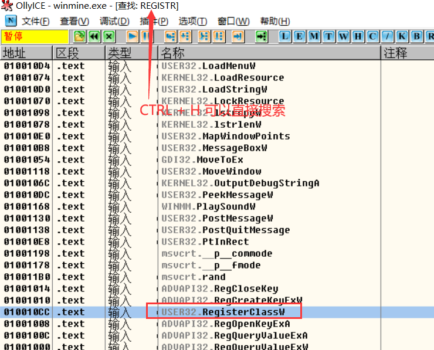

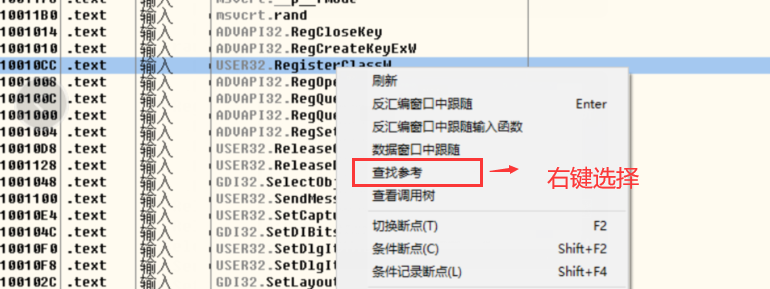


在所有调用地方设置断点

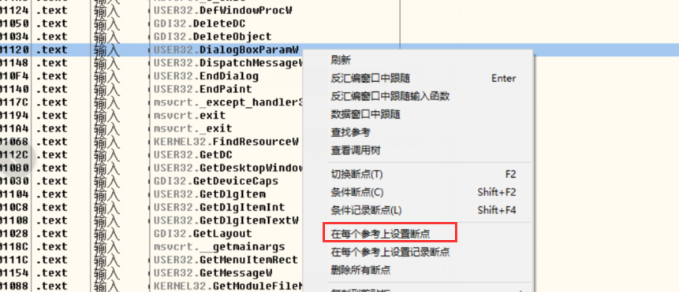

1.  下好断点后开始调试, F9 运行到断点处

注册窗口类第一个参数是窗口类的地址,

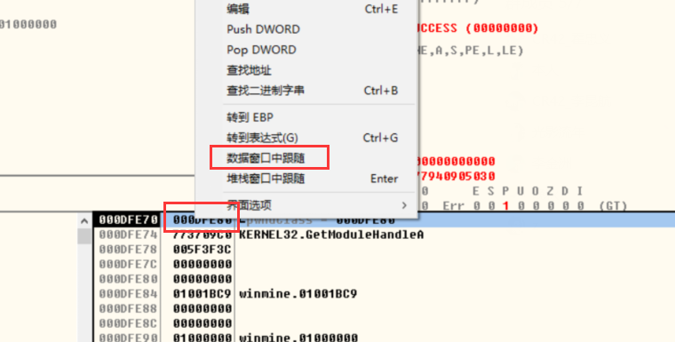

窗口类第二个参数是函数地址,第一个是风格

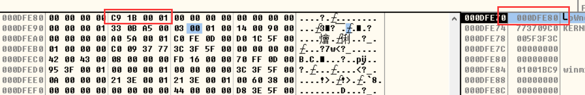


1.  寻找 WM_CLOSE  消息,可以通过条件断点寻找


 分析可知  , 参数入栈顺序是   最后一个参数,倒数第二个参数........,第一个参数,返回地址,二消息id是通过   第三个参数    WPARAM    所以参数位置在  esp +  8  处 


1.  在关闭游戏,这样就可以触发 WM_CLOSE 消息,从而触发断点,在 F8 单步运行,看到哪部跳走

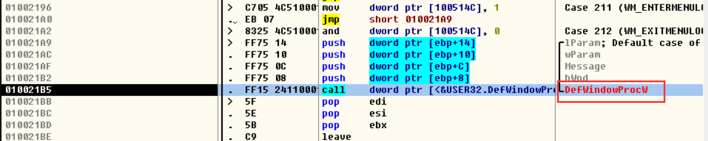 可以看出它调用了   默认过程函数,并没有自己处理关闭消息,所以我们只能 自己来 判断是不是WM_CLOSE 消息,然后我们自己来处理 ,如果是 WM_CLOSE  ,那么就需要我们去弹窗,不是的话就交给过程函数去处理

1.  我们要处理 WM_CLOSE 消息,那么就需要去写代码,但是又不能覆盖他原本的代码,因此他们有代码地方我们都不能用,只能找空白的地方写

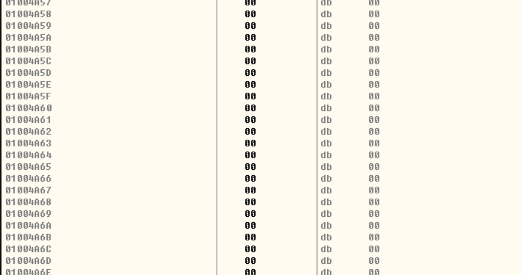

记录一下我们们写代码的地方

我们汇编代码开始位置

01004A60                                  00            db      00


通过之前我们跟代码,可以知道,程序是从该处跳转到 默认过程函数的,因此我们可以将此处改成 跳转到我们的代码处,然后再由我们跳转回来

原来的跳转地址

01001C16                              |. /0F85 8D050000     jnz     010021A9


函数退出位置

010021BB                              |> \5F                   pop     edi


通过空格单击, ,修改汇编代码,来修改跳转位置

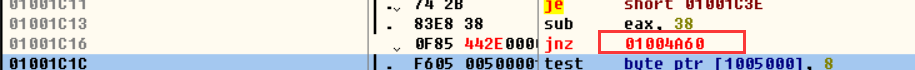

选中修改后的地址,跳转过去开始写我们的汇编代码

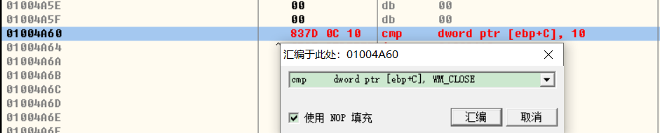

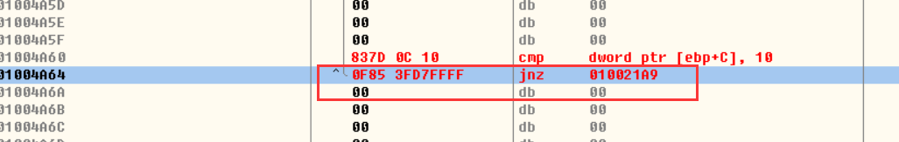

接下来相等就要弹窗   ,首先要有提示语,需要保存到文本


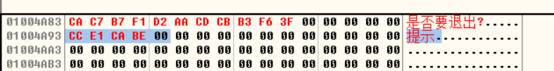

1.  调用弹窗函数


标题,文本入栈


窗口句柄入栈


调用函数


判断点击按钮

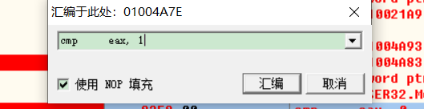

判断,是确定就挑转到  默认过程处理函数,否则退出函数

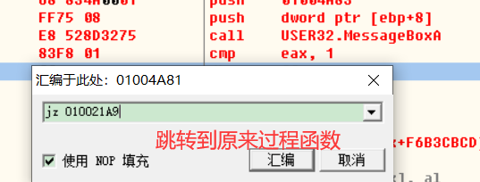


但是这个时候我们写的代码还只是在内存里面,程序一旦重启 就都没了,因此我们要保存到可执行文件

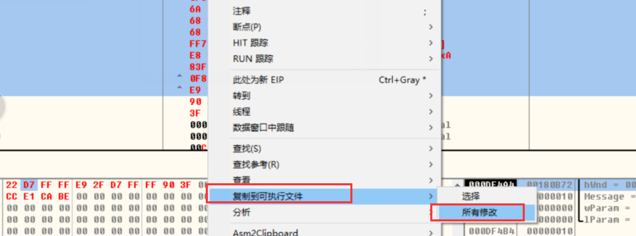


1.  保存文件运行

这是点击退出,发现出现了弹窗提示


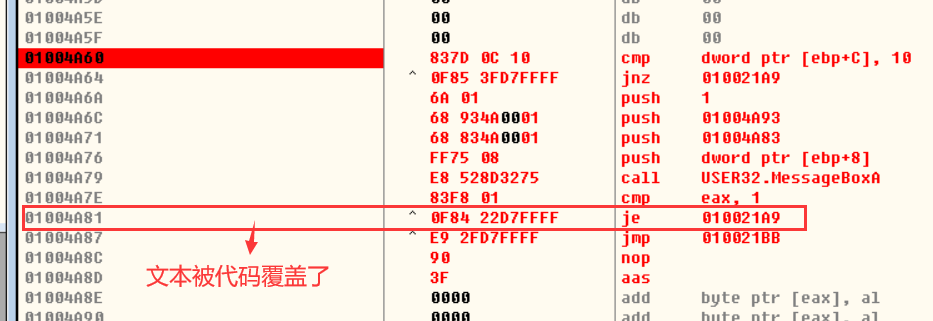


注意: 找空白位置不要到最后,不然按可能报错,位置有规律,但是要学pe

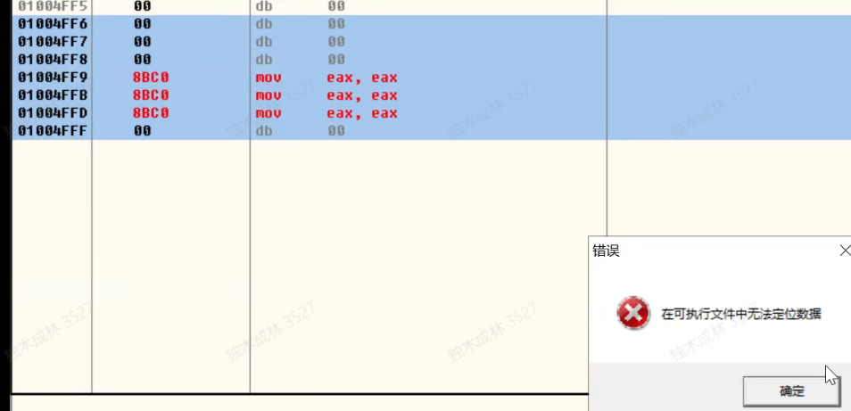

##### 通过OD 下断点/取消断点   alt   +b

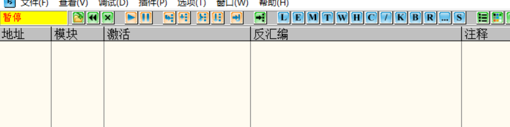

如果有断点 ,选中 del


程序 F9 运行后

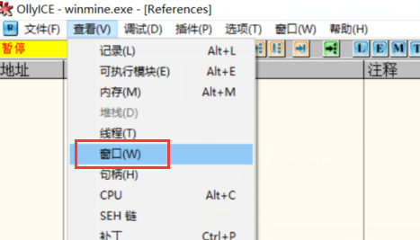

 


 在Crack Me 下补丁 

使其提示成功

Brad Soblesky.1.zip(4 KB)


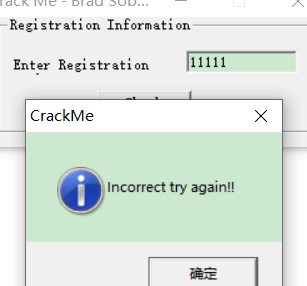


方法1: 定位 command 消息


或者


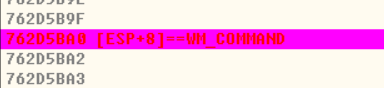


f9 运行 到断点 ,在 f8 单步运行


可以看到,运行到系统的 dll 中,所以这不是一个  重叠类窗口,所以过程函数不是自己的,无法用上面方法,所以要换个f方法


因为 他失败成功都会弹出一个对话框,里面有字符串,因此我们可以通过 OD 的字符串查找功能


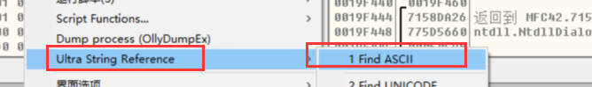


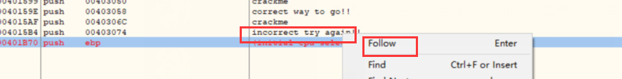


查看上面的代码

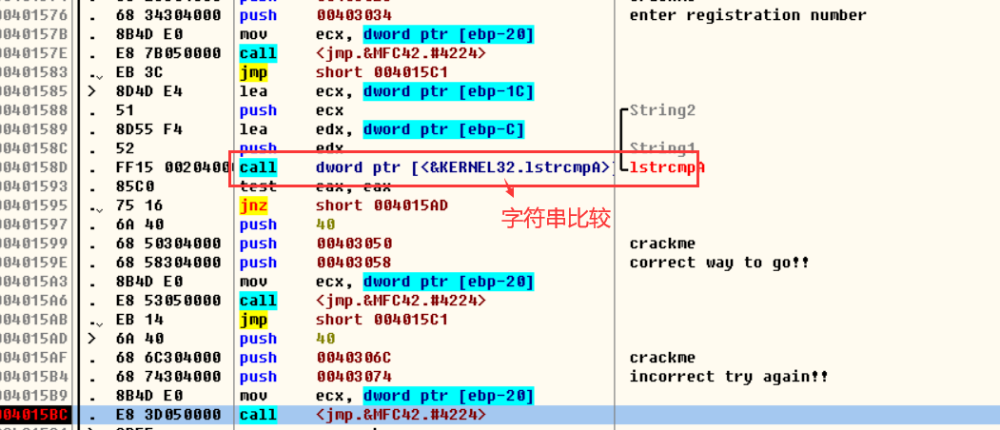


在此处下点,就可以看到比较的字符串,即正确的字符串


或者直接去掉比较,那么不管输出字符串是啥,都可以成功


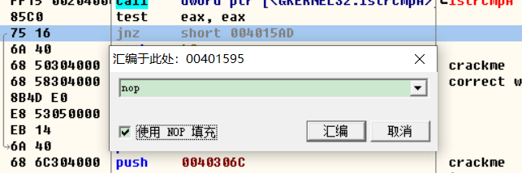


将文件保存


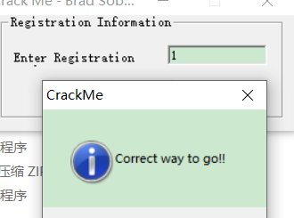


运行我们保存的文件,发下不管输入什么字符串都可以通过了,即破解成功了


 注册机 

当遇到非明码比较时,上面的方法就行不通,因为密码是通过 加密解密得到的


输入2行字符串,验证通过

Brad Soblesky.2.zip(4 KB)


首先定位到字符串,下断点


往上找代码,在函数入口出下断点


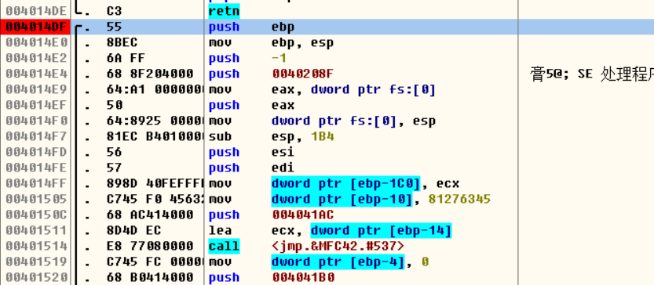


跟一下大体流程,通过跟代码,我们可以知道


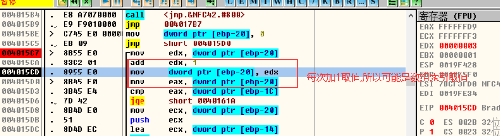


F4 运行到光标处,运行完循环 ,继续运行


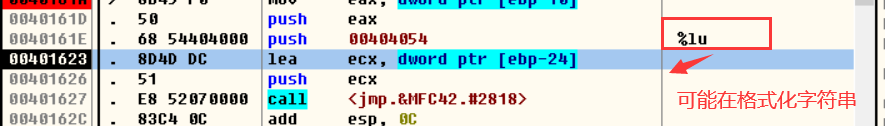


断点继续跟


加注释于0040163B


因此可以分析出,程序是那我们输入的字符串做一系列运算,再把结果格式化后去跟第二个字符串 作比较,我们把上面格式化后的字符串拿去测试,可以发现通过了,所以猜想是正确的


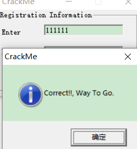


上面软件已经提供了加密算法,因此写该软件的注册机可以直接把他的代码复制出来来就可以了


```
L000:
  mov     edx, dword ptr [ebp-20]
  add     edx, 1
  mov     dword ptr [ebp-20], edx
  mov     eax, dword ptr [ebp-20]
  cmp     eax, dword ptr [ebp-1C]
  jge     short 0040161A
  mov     ecx, dword ptr [ebp-20]
  push    ecx
  lea     ecx, dword ptr [ebp-14]
  call    00401900
  movsx   edx, al
  mov     eax, dword ptr [ebp-10]
  add     eax, edx
  mov     dword ptr [ebp-10], eax
  mov     ecx, dword ptr [ebp-20]
  shl     ecx, 8
  mov     edx, dword ptr [ebp-10]
  xor     edx, ecx
  mov     dword ptr [ebp-10], edx
  mov     eax, dword ptr [ebp-20]
  add     eax, 1
  mov     ecx, dword ptr [ebp-1C]
  imul    ecx, dword ptr [ebp-20]
  not     ecx
  imul    eax, ecx
  mov     edx, dword ptr [ebp-10]
  imul    edx, eax
  mov     dword ptr [ebp-10], edx
  jmp L000
```

上面还有很多参数,必须我们去分析


新建工程


模板,根据自己需要选择


剩下的不用动,一直下一步完成就行


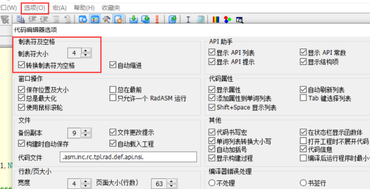


GIST\REGIST.ASM


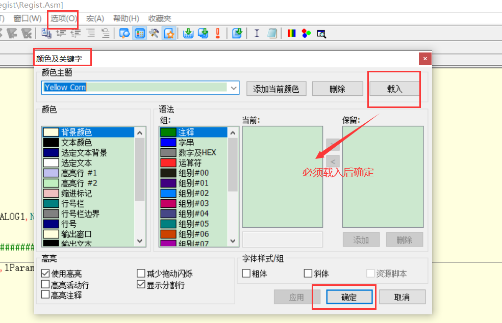

S\ADMINISTRATOR\DESKTOP\03 补丁\REGIST\REGIST.ASM]


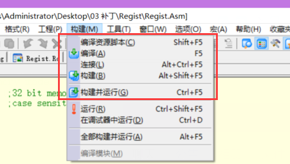

编译和链接,链接之前记得编译资源脚本,或者直接构建


添加资源

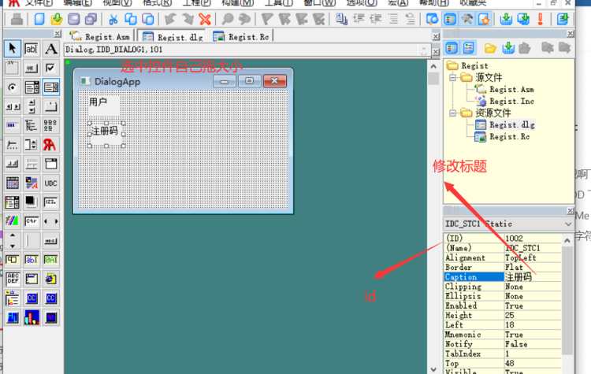


如果给控件添加名字需要自己手动加到头文件


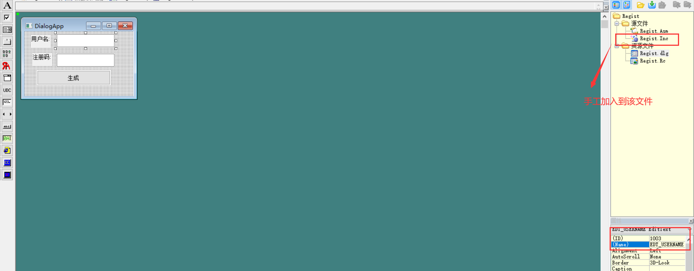


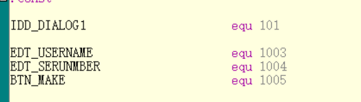


下面就开始写注册机了

```
L000:
  mov     edx, dword ptr [ebp-20]
  add     edx, 1
  mov     dword ptr [ebp-20], edx
  mov     eax, dword ptr [ebp-20]
  cmp     eax, dword ptr [ebp-1C]
  jge     short 0040161A
  mov     ecx, dword ptr [ebp-20]
  push    ecx
  lea     ecx, dword ptr [ebp-14]
  call    00401900
  movsx   edx, al
  mov     eax, dword ptr [ebp-10]
  add     eax, edx
  mov     dword ptr [ebp-10], eax
  mov     ecx, dword ptr [ebp-20]
  shl     ecx, 8
  mov     edx, dword ptr [ebp-10]
  xor     edx, ecx
  mov     dword ptr [ebp-10], edx
  mov     eax, dword ptr [ebp-20]
  add     eax, 1
  mov     ecx, dword ptr [ebp-1C]
  imul    ecx, dword ptr [ebp-20]
  not     ecx
  imul    eax, ecx
  mov     edx, dword ptr [ebp-10]
  imul    edx, eax
  mov     dword ptr [ebp-10], edx
  jmp L000
```

首选要对函数进行分析

通过跟代码发现    ebp-20  是一个局部变量,作用是计数器

​                                ebp-1c   是输入字符长度

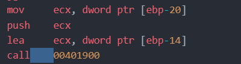

这里是去字符串读取 所以可以用   lodsb 替换

几位下来就剩  ebp-10 ,ebp-1c .找到最开始出现的地方,来观察数据变化


通过几次不同测试,发现值 是固定的


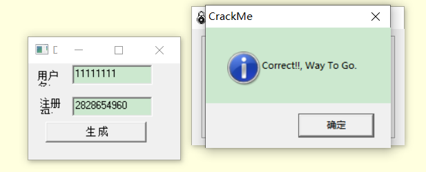

注册机源码

```
.386
.model flat, stdcall  ;32 bit memory model
option casemap :none  ;case sensitive

include Regist.inc

.data
  g_szUserName  db 50 dup(0)  ;用户名  
  g_szSerial    db 50 dup(0)  ;注册码
  g_szFmt       db "%lu" ,0   ;格式化字符串

.code

start:

	invoke GetModuleHandle,NULL
	mov		hInstance,eax

    invoke InitCommonControls
	invoke DialogBoxParam,hInstance,IDD_DIALOG1,NULL,addr DlgProc,NULL
	invoke ExitProcess,0

;########################################################################
Make  proc   hWin:HWND    ;加密
    LOCAL  @dwIdx:DWORD
    LOCAL  @dwCnt:DWORD
    LOCAL  @dwEdp_10:DWORD
    LOCAL  @dwEdp_14:DWORD
   
    ;回去文本输入的值
   invoke GetDlgItemText,hWin,EDT_USERNAME,offset g_szUserName,size g_szUserName  ;获取用户名内容
  
   
   mov  @dwCnt,eax
   mov  @dwIdx,0
  
   mov esi ,offset g_szUserName  
   mov @dwEdp_10,81276345H
   
   jmp  LSATART
 ;对用户名加密解密
 L000:
   mov     edx, @dwIdx
   add     edx, 1
   mov     @dwIdx, edx
   
LSATART:   
   mov     eax, @dwIdx
   cmp     eax, @dwCnt
   jge     LEND
   ;mov     ecx, @dwIdx
   ;push    ecx
   ;lea     ecx, dword ptr [ebp-14]
   ;call    00401900
   lodsb    ;上面四行作用
   movsx   edx, al
   mov     eax, @dwEdp_10
   add     eax, edx
   mov     @dwEdp_10, eax
   mov     ecx, @dwIdx
   shl     ecx, 8
   mov     edx, @dwEdp_10
   xor     edx, ecx
   mov     @dwEdp_10, edx
   mov     eax, @dwIdx
   add     eax, 1
   mov     ecx, dword ptr @dwCnt
   imul    ecx, @dwIdx
   not     ecx
   imul    eax, ecx
   mov     edx, @dwEdp_10
   imul    edx, eax
   mov     @dwEdp_10,edx
 jmp L000
 
 LEND: 
    ;格式化字符串
    invoke wsprintf,offset g_szSerial,offset g_szFmt,@dwEdp_10 
    ;显示到界面
    invoke SetDlgItemText,hWin,EDT_SERUNMBER,offset  g_szSerial  
 

Make endp


DlgProc proc hWin:HWND,uMsg:UINT,wParam:WPARAM,lParam:LPARAM

	mov		eax,uMsg
	.if eax==WM_INITDIALOG

	.elseif eax==WM_COMMAND
	   mov eax,wParam
	   .if eax == BTN_MAKE
	      invoke Make,hWin
	   .endif

	.elseif eax==WM_CLOSE
		invoke EndDialog,hWin,0
	.else
		mov		eax,FALSE
		ret
	.endif
	mov		eax,TRUE
	ret

DlgProc endp

end start

```

### 作业

[📎作业文件.zip](https://www.yuque.com/attachments/yuque/0/2022/zip/27242010/1653340894894-7a0dccb3-5296-4d6d-9996-5b3153d922b4.zip)

####  1. 修改机器码指令对照表.exe的字体

思路:   

 \1. sendmessage给callwindow发消息  然后绘制界面，sendmessage的第一个消息就是设置字体的  

\2.  调用 CreateFontA    它有个设置字体的那块    设置完毕后会发个消息    找消息循环上面的发消息那块   就能看见有个函数,在获取系统字体   然后把这个函数换掉,换成跳转到自己的代码处   改完再跳回来

```
HFONT CreateFontA(
  [in] int    cHeight,    
  [in] int    cWidth,
  [in] int    cEscapement,
  [in] int    cOrientation,
  [in] int    cWeight,
  [in] DWORD  bItalic,
  [in] DWORD  bUnderline,
  [in] DWORD  bStrikeOut,
  [in] DWORD  iCharSet,
  [in] DWORD  iOutPrecision,
  [in] DWORD  iClipPrecision,
  [in] DWORD  iQuality,
  [in] DWORD  iPitchAndFamily,
  [in] LPCSTR pszFaceName
);
```


  2. COM Explorer_Setup 注册机，汇编实现。 

详情见 day05  补课

思路:  根据弹窗标题搜字符串，往上找到分支跳，定位到关键函数，找到算法代码，（算法代码使用四则运算和位运算比较多），然后把代码抽出来去分析，失败分支那里肯定有校验的算法


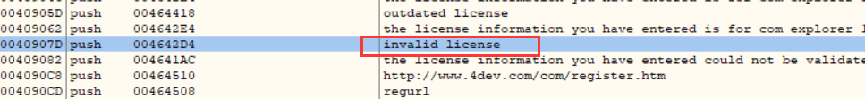


找到成功或失败分支


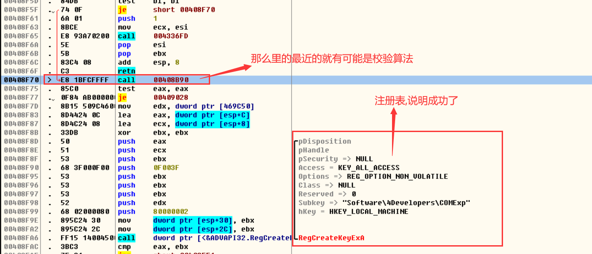


```
L000:
  mov     ebp, dword ptr [463E48]
  or      ecx, FFFFFFFF
  mov     edi, ebp
  xor     eax, eax
  repne   scas byte ptr es:[edi]
  not     ecx
  dec     ecx
  mov     eax, esi
  xor     edx, edx
  mov     edi, ebp
  div     ecx
  mov     ecx, dword ptr [esp+14]
  mov     eax, esi
  movsx   ebx, byte ptr [edx+ebp]
  xor     edx, edx
  div     ecx
  movsx   eax, byte ptr [edx+469968]
  lea     edx, dword ptr [eax+eax*2]
  lea     eax, dword ptr [eax+edx*4]
  mov     edx, esi
  imul    edx, esi
  imul    edx, esi
  imul    edx, ecx
  add     ebx, eax
  or      ecx, FFFFFFFF
  xor     eax, eax
  add     ebx, edx
  repne   scas byte ptr es:[edi]
  not     ecx
  dec     ecx
  mov     eax, ebx
  xor     edx, edx
  div     ecx
  lea     ecx, dword ptr [esp+10]
  mov     al, byte ptr [edx+ebp]
  push    eax
  call    0042F29A
  test    esi, esi
  je L048
  mov     eax, esi
  xor     edx, edx
  mov     ecx, 3
  div     ecx
  test    edx, edx
  jnz L048
  push    004640F8
  lea     ecx, dword ptr [esp+14]
  call    0042F273
L048:
  inc     esi
  cmp     esi, 9
  jb L000
```


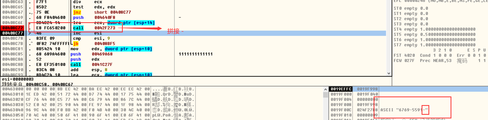

