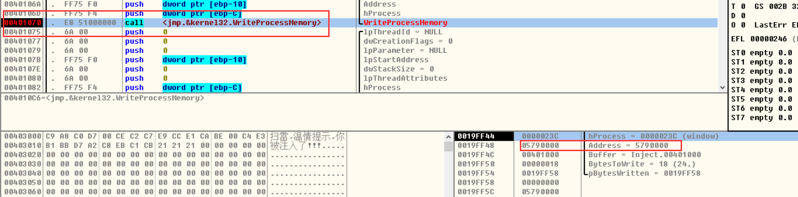
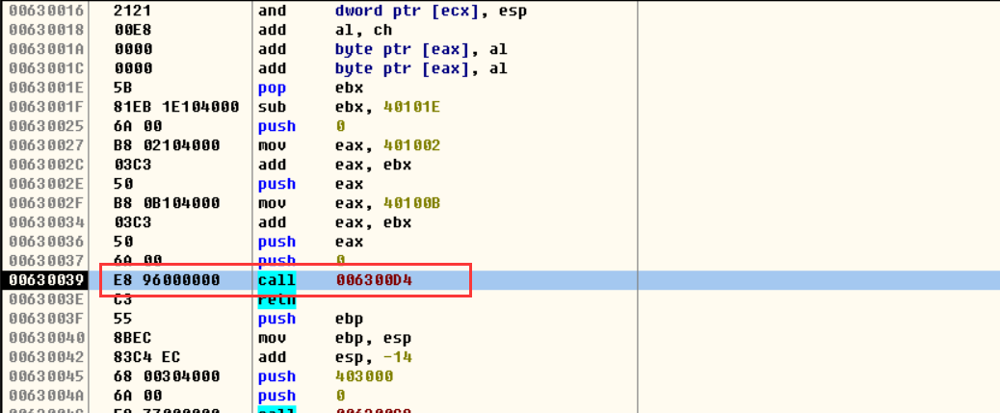
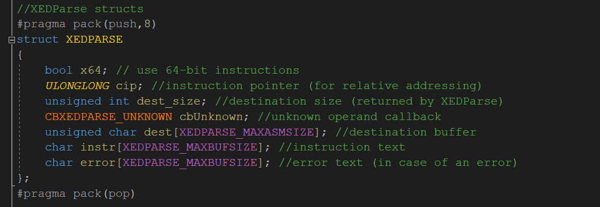
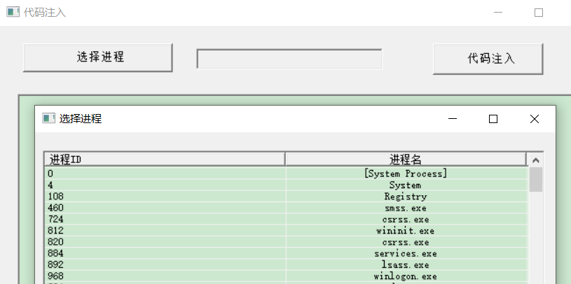

### 重定位

**重定位：**也称为代码自重定位，代码自己去计算自己使用的各种资源再新进程中的地址，相应代码被称为被重新定位过后的代码。

#### 示例

-   目标：向指定进程 扫雷 注入一段机器码，机器码的作用是弹出MessageBox。

​         与远程注入dll的区别：原是加载dll，本目标是注入一段机器码。

  注机器码就是 把机器码写到对应进程里面去,写的地方不能覆盖它原本代码,否则会影响它原本的功能 ,可以去找一些空隙,但是这种方法不是很通用.最好的办法是 申请一块内存,把代码写进去,在调用线程去跑这个段代码

#### .asm

```
.586
.model flat,stdcall
option casemap:none

   include windows.inc
   include user32.inc
   include kernel32.inc
   
   includelib user32.lib
   includelib kernel32.lib


WinMain proto 

.data

   g_szCap    db "扫雷",0          ;窗口标题,用来获取窗口句柄
   g_szTitle  db "温情提示",0      ;弹窗窗口标题
   g_szText   db "你被注入了!!!",0 ;弹窗内容  
.code

CODE_BEGIN:
invoke MessageBox,NULL,offset  g_szText,offset g_szTitle,MB_OK


; ---------------------------------------------------------------------------
WinMain proc 
	LOCAL @hWndWinMine :HWND    ;窗口句柄
	LOCAL @dwPid :HWND          ;进程id
	LOCAL @hProc :HINSTANCE     ;进程句柄
	LOCAL @pAddr :LPVOID        ;申请的内存地址
	LOCAL @dwBytesWirites :DWORD    ;写入的字节数
	
	invoke FindWindow,NULL ,offset g_szCap  ;通过窗口标题获取窗口句柄
    mov    @hWndWinMine,eax
        
    invoke GetWindowThreadProcessId,@hWndWinMine,addr @dwPid  ;获取进程id  
        
    invoke OpenProcess,PROCESS_ALL_ACCESS,FALSE,@dwPid   ;获取进程句柄
    mov   @hProc,eax
        
    invoke VirtualAllocEx,@hProc, NULL,1,MEM_COMMIT,PAGE_EXECUTE_READWRITE    ;自动申请内存空间
    mov   @pAddr,eax
        
    ;在内存中写入代码
    invoke WriteProcessMemory,@hProc,@pAddr,\      ;\是换行
       offset CODE_BEGIN, offset WinMain -   offset CODE_BEGIN,\
        addr @dwBytesWirites
           
    invoke CreateRemoteThread,@hProc ,NULL,0,@pAddr,NULL,0,NULL  ;创建线程
          
	mov     eax,0
	ret
WinMain endp

start:
	
	
	invoke WinMain
	invoke ExitProcess,eax

end start
```

没重定向之前运行程序,发现我么的文件和扫雷都崩了,单独调试我们自己的代码是没问题,所以需要同时调试2个进程



写入代码的地址是 05790000


可以看出,我们字符串的内存地址获取失败了,因为我们的字符串写在了我们的自己程序中,并不在扫雷程序中


把字符串移进来,调试发现地址还是我们自己的地址,字符串地址需要调整,最好让他自己算.我们只要原来代码所在的地址,与新地址所在的差值,就可以推算出新字符串所在的地址


```
.586
.model flat,stdcall
option casemap:none

   include windows.inc
   include user32.inc
   include kernel32.inc
   
   includelib user32.lib
   includelib kernel32.lib


WinMain proto 


.data

   g_szCap    db "扫雷",0          ;窗口标题,用来获取窗口句柄
  
.code

CODE_BEGIN:

 jmp MSGBOX
 g_szTitle  db "温情提示",0      ;弹窗窗口标题
 g_szText   db "你被注入了!!!",0 ;弹窗内容  
  
MSGBOX:
   call LTEST  ;会把  LIST 的地址入站   

LTEST:
   pop ebx                ;获取 LTEST 在新进程的地址
   sub ebx ,offset LTEST  ;可以得到LTEST 在 新进程地址和我们自己进程的地址差值
   
   push MB_OK
   
   mov eax, offset  g_szTitle  ;获取字符串在原进程中的地址
   add eax, ebx     ;获取字符串在新进程中的地址
   push eax         ;入栈
   
   
   mov eax, offset  g_szText
   add eax, ebx
   push eax
   
   push NULL
   
   call  MessageBox
   
;invoke MessageBox,NULL,offset  g_szText,offset g_szTitle,MB_OK
ret


; ---------------------------------------------------------------------------
WinMain proc 
	LOCAL @hWndWinMine :HWND    ;窗口句柄
	LOCAL @dwPid :HWND    ;进程id
	LOCAL @hProc :HINSTANCE    ;线程句柄
	LOCAL @pAddr :LPVOID    ;申请的内存地址
	LOCAL @dwBytesWirites :DWORD    ;写入的字节数
	
	invoke FindWindow,NULL ,offset g_szCap  ;通过窗口标题获取窗口句柄
        mov    @hWndWinMine,eax
        
        invoke GetWindowThreadProcessId,@hWndWinMine,addr @dwPid  ;获取进程id  
        
        invoke OpenProcess,PROCESS_ALL_ACCESS,FALSE,@dwPid   ;创建新线程
        mov   @hProc,eax
        
        invoke VirtualAllocEx,@hProc, NULL,1,MEM_COMMIT,PAGE_EXECUTE_READWRITE    ;自动申请内存空间
        mov   @pAddr,eax
        
        ;在内存中写入代码
        invoke WriteProcessMemory,@hProc,@pAddr,\      ;\是换行
           offset CODE_BEGIN, offset WinMain -   offset CODE_BEGIN,\
           addr @dwBytesWirites
           
        invoke CreateRemoteThread,@hProc ,NULL,0,@pAddr,NULL,0,NULL  
          
	mov     eax,0
	ret
WinMain endp

start:
	
	invoke WinMain
	invoke ExitProcess,eax

end start

```

再继续调试,发现此数地址已经变了


有时候 CTRL + G 找地址会提示无效地址, 可以先到内存窗口,右键,在cpu数据窗口中查看,找到自己跳转的地址,在回到 代码页面  用 CTRL + G  跟随就可以了



user32  在 同一台电脑上的 不同进程的地址是一样的，因此可以利用这一点，还要注意，我们写的代码位于代码段，必须修改才能写入

重定位后的代码

```
.586
.model flat,stdcall
option casemap:none

   include windows.inc
   include user32.inc
   include kernel32.inc
   
   includelib user32.lib
   includelib kernel32.lib


WinMain proto 


.data

   g_szCap    db "扫雷",0          ;窗口标题,用来获取窗口句柄
   g_szUser32 db "user32", 0
   g_szMessageBox db "MessageBoxA", 0

  
.code

CODE_BEGIN:

 jmp MSGBOX
 g_szTitle  db "温情提示",0      ;弹窗窗口标题
 g_szText   db "你被注入了!!!",0 ;弹窗内容 
 g_dwMessageBox   dd 0           ;MessageBox的地址    
  
MSGBOX:


   ;下面四条就是重定位的核心代码
   call NEXT  ;会把  LIST 的地址入站   
NEXT:
   pop ebx                ;获取 NEXT 在新进程的地址
   sub ebx ,offset NEXT  ;可以得到NEXT 在 新进程地址和我们自己进程的地址差值
   
   
 
   push MB_OK
   
   mov eax, offset  g_szTitle  ;获取字符串在原进程中的地址
   add eax, ebx     ;获取字符串在新进程中的地址
   push eax         ;入栈
   
   
   mov eax, offset  g_szText
   add eax, ebx
   push eax
   
   push NULL
   
   mov eax, offset g_dwMessageBox
   add eax, ebx
   mov eax, [eax]
   call eax
   
   ;call  MessageBox
   
   ;invoke MessageBox,NULL,offset  g_szText,offset g_szTitle,MB_OK
ret


; ---------------------------------------------------------------------------
WinMain proc 
	LOCAL @hWndWinMine :HWND    ;窗口句柄
	LOCAL @dwPid :HWND    ;进程id
	LOCAL @hProc :HINSTANCE    ;线程句柄
	LOCAL @pAddr :LPVOID    ;申请的内存地址
	LOCAL @dwBytesWirites :DWORD    ;写入的字节数
	LOCAL @dwOldProc:DWORD    ;之前的内存属性
	
	invoke FindWindow,NULL ,offset g_szCap  ;通过窗口标题获取窗口句柄
        mov    @hWndWinMine,eax
        
        invoke GetWindowThreadProcessId,@hWndWinMine,addr @dwPid  ;获取进程id  
        
        invoke OpenProcess,PROCESS_ALL_ACCESS,FALSE,@dwPid   ;创建新线程
        mov   @hProc,eax
        
        invoke VirtualAllocEx,@hProc, NULL,1,MEM_COMMIT,PAGE_EXECUTE_READWRITE    ;自动申请内存空间
        mov   @pAddr,eax
        
        
         ;修改代码区内存属性
        invoke VirtualProtect, offset CODE_BEGIN, 1, PAGE_EXECUTE_READWRITE, addr @dwOldProc
    
        invoke GetModuleHandle, offset g_szUser32
        invoke GetProcAddress, eax, offset g_szMessageBox
        
        mov g_dwMessageBox, eax
    
        ;还原内存属性
        invoke VirtualProtect, offset CODE_BEGIN, 1, @dwOldProc, addr @dwOldProc
    
           
        ;在内存中写入代码
        invoke WriteProcessMemory,@hProc,@pAddr,\      ;\是换行
           offset CODE_BEGIN, offset WinMain -   offset CODE_BEGIN,\
           addr @dwBytesWirites
           
        invoke CreateRemoteThread,@hProc ,NULL,0,@pAddr,NULL,0,NULL  
          
	mov     eax,0
	ret
WinMain endp

start:
	
	invoke WinMain
	invoke ExitProcess,eax

end start
```

 汇编引擎 

使用 XDE

库： 如果装了x32DEBUG ，那么就有需要的库

 用C来实现 汇编引擎 

创建一个控制台程序

把头文件，dll，lib 拷贝到项目




成员： 

1  32位还是64位，true  64位 flase 32位

2 汇编的地址     （跳转类指令必须）

3返回参数，汇编出来的机器码有几个字节

4回调，用不上，空就行

5传出的机器吗

6我们写进去的源码

7错误信息

```
// test.cpp : 此文件包含 "main" 函数。程序执行将在此处开始并结束。
//

#include <iostream>

#include "XEDParse.h"
#pragma comment (lib, "XEDParse_x86.lib")

int main()
{
    XEDPARSE xde = {};
    xde.x64 = false;
    xde.cip = 0x00401000;
    strcpy_s(xde.instr, sizeof(xde.instr), "mov eax, eax");

    XEDPARSE_STATUS stus = XEDParseAssemble(&xde);

    std::cout << "Hello World!\n";
}
```

#### 汇编实现汇编引擎

```
.586
.model flat,stdcall
option casemap:none

   include windows.inc
   include user32.inc
   include kernel32.inc
   include msvcrt.inc
   
   include AsmXde.inc
   
   includelib user32.lib
   includelib kernel32.lib
   includelib msvcrt.lib
   
   includelib XEDParse_x86.lib

WinMain proto :DWORD,:DWORD,:DWORD,:DWORD

.data

    
   xdep XEDPARSE <FALSE, 00401000h>   
   g_szInstr db "mov ebp, esp", 0

.code
start:
    invoke crt_strcpy, offset xdep._instr, offset g_szInstr
    invoke XEDParseAssemble, offset xdep

end start
```

.inc

```
ifndef XDE_INC 
XDE_INC  equ 1

XEDPARSE_ERROR equ 0
XEDPARSE_OK equ 1

XEDPARSE_MAXBUFSIZE equ 256
XEDPARSE_MAXASMSIZE equ 16

;定义结构体    
XEDPARSE struc
    x64 db 0
    ALIGN 8   ;设置对齐值
    cip dd 0  ;只用低32位
        dd 0
    dest_size dd 0
    cbUnknown dd 0
    dest db XEDPARSE_MAXASMSIZE dup(0)
    _instr db XEDPARSE_MAXBUFSIZE dup(0)
    error db XEDPARSE_MAXBUFSIZE dup(0)
XEDPARSE ends

XEDParseAssemble proto c :ptr XEDPARSE   ;函数声明

endif
```


比较强悍的工具是：Asmjit   但只能c使用

### 作业

周作业

####   1. 代码注入器

有bug,   eip 每次要加它的长度

头文件xde.inc

```
ifndef XDE_INC
XDE_INC equ 1 ;防止重复包含


    ;这是原先出错或成功的枚举,换成equ
    XEDPARSE_ERROR equ 0
    XEDPARSE_OK equ 1
    
    
    ;原先的宏
    XEDPARSE_MAXBUFSIZE  equ 256
    XEDPARSE_MAXASMSIZE equ 16
    
    
    ;定义结构体 还需要设置对齐值,它的对齐值是8
    XEDPARSE struc
        x64       db 0 ;x64 
        ALIGN     8 ;设置对齐值,只影响它下一条
        cip       dd 0 ;它是__int64类型的,但是我们只用低32位,所以就dd ,高32位就不用了
                  dd 0 ;它的高32位
        dest_size dd 0;传出参数,机器码有几个字节
        cbUnknown dd 0;回调
        dest      db XEDPARSE_MAXASMSIZE dup(0) ;机器码
        _instr     db XEDPARSE_MAXBUFSIZE dup(0);汇编指令
        error     db XEDPARSE_MAXBUFSIZE dup(0)
            
    XEDPARSE ends
    
    ;函数声明,C调用约定 ,参数为结构体指针
    XEDParseAssemble proto C :ptr XEDPARSE 
    
endif
```

code.inc

```
include windows.inc
include kernel32.inc
include user32.inc
include Comctl32.inc
include shell32.inc
include msvcrt.inc
include Xde.inc

includelib kernel32.lib
includelib user32.lib
includelib Comctl32.lib
includelib shell32.lib
includelib msvcrt.lib
includelib XEDParse_x86.lib

DlgProc			PROTO	:HWND,:UINT,:WPARAM,:LPARAM

.const

IDD_DIALOG1			equ 101
BTN_SELECT          equ 1001
BTN_INJECTION       equ 1002
EDT_PROCESSID       equ 1003
EDT_CODE            equ 1004


DLG_PROCESS         equ 1000
LST_PROCESS         equ 1005


;#########################################################################

.data?

hInstance			dd ?

;#########################################################################

```

code.asm

```
.386
.model flat, stdcall  ;32 bit memory model
option casemap :none  ;case sensitive

include CodeIn.inc

.data
    g_szHintProcessID db "进程ID" , 0 ;提示的中文
    g_szHintProcessName db "进程名" , 0 ;提示的中文
    g_szFmt db "%d",0 ;格式化字符串
    g_szProcess db 255 dup(0) ; 进程ID字符串
    g_hWnd dd 0 ;主窗口句柄
    g_szCode db 255 dup(0)
.code


;获取进程信息
GetProcess proc hWin:HWND 
    LOCAL lvcol:LVCOLUMN ;lst的列结构体
    LOCAL item:LVITEM  ;项的结构体
    local hlist
    LOCAL pe32:PROCESSENTRY32 ;pe32
    LOCAL hProcessSnap:HANDLE
    LOCAL bRet:BOOL ; bool类型的返回值
    LOCAL nRowCount:dword  ;列数
    LOCAL szTh32ProcessID[255]:byte
    LOCAL oldStyle :dword
    
    ;先初始化list控件
    invoke GetDlgItem,hWin,LST_PROCESS  ;获取控件句柄
    mov hlist,eax
    
    ;向样式结构体里填数据
    mov lvcol.imask,LVCF_FMT or LVCF_WIDTH or  LVCF_TEXT or LVCF_SUBITEM
    mov lvcol.fmt,LVCFMT_CENTER
    mov lvcol.lx,275
    mov lvcol.pszText,offset g_szHintProcessID
    ;发消息,增加一列
    ;invoke SendMessage,hlist,LVM_INSERTCOLUMN,0,addr lvcol
    invoke SendDlgItemMessage,hWin,LST_PROCESS,LVM_INSERTCOLUMN,0,addr lvcol
    
    ;第二列
    mov lvcol.pszText,offset g_szHintProcessName
    ;invoke SendMessage,hlist,LVM_INSERTCOLUMN,1,addr lvcol
     invoke SendDlgItemMessage,hWin,LST_PROCESS,LVM_INSERTCOLUMN,1,addr lvcol
    
    
    ;开始获取进程
    ;hProcessSnap = ::CreateToolhelp32Snapshot(TH32CS_SNAPALL, 0);
    invoke CreateToolhelp32Snapshot,TH32CS_SNAPALL,0
    mov hProcessSnap,eax
    
    ;Process32First(hProcessSnap, &pe32)
    mov pe32.dwSize,size PROCESSENTRY32
    invoke Process32First,hProcessSnap,addr pe32
    mov bRet,eax
    
    ;First成功后循环
    .if bRet != 0
         ;列数先置为0 
        mov nRowCount ,0
        ;开始循环
        .REPEAT
		        ;插入第一列
                mov eax,nRowCount
		        mov item.iItem , eax; ;行号 从0开始
		        mov item.iSubItem,0 ;列号
    		    mov item.imask,LVCF_FMT or LVCF_WIDTH or LVCF_TEXT
		        mov eax,pe32.th32ProcessID
		        ;格式化字符串进程ID
		        invoke wsprintf,addr szTh32ProcessID,offset g_szFmt, pe32.th32ProcessID
		        lea eax,szTh32ProcessID
		        mov item.pszText,eax

		        invoke SendDlgItemMessage,hWin,LST_PROCESS,LVM_INSERTITEM,0,addr item
		     
		        
                ;清除内存
                invoke crt_memset,addr item,0,size item
		        
		        ;插入第二列
		        mov eax,nRowCount
		        mov item.iItem , eax; ;行号
		        mov item.iSubItem,1;列号
		        mov item.imask , LVCF_FMT or LVCF_WIDTH or LVCF_TEXT;
		        lea eax,pe32.szExeFile ;进程名称
		        mov item.pszText,eax
		        
		        
		        ;插入其他列
		        invoke SendDlgItemMessage,hWin,LST_PROCESS,LVM_SETITEMTEXT,nRowCount,addr item
		        
                ;行号++
                mov eax,nRowCount
                inc eax
                mov nRowCount,eax
                
                ;清除内存
                lea eax, pe32
                invoke crt_memset,eax,0,128
                ;重新赋值大小
                mov pe32.dwSize,size PROCESSENTRY32
                
                ;Next获取下一个
		        invoke Process32Next,hProcessSnap,addr pe32
                mov bRet,eax
       .UNTIL bRet == 0
    .endif 
    
    
    ;获取旧样式
    invoke SendDlgItemMessage,hWin,LST_PROCESS,LVM_GETEXTENDEDLISTVIEWSTYLE,0,0
    ;拼接新样式
    or eax,LVS_EX_FULLROWSELECT
    or eax,LVS_EX_GRIDLINES
    
    ;设置选中高亮一行和网格线样式
    invoke SendDlgItemMessage,hWin,LST_PROCESS,LVM_SETEXTENDEDLISTVIEWSTYLE,0,eax 
    ret

GetProcess endp


OnProc proc hWin:HWND,wParam:WPARAM,lParam :LPARAM
    LOCAL item:LVITEM  ;项的结构体
    LOCAL dwSel:dword 
    ;判断控件ID
    mov eax,wParam
    .if eax == LST_PROCESS
        mov esi,lParam
        assume esi:ptr NMHDR
        mov ebx,[esi].code
        assume esi:nothing
        .if ebx == NM_DBLCLK 
            ;invoke MessageBox,hWin,offset g_szHintProcessID,offset g_szHintProcessID,MB_OK
            ;获取选中的ID
            invoke SendDlgItemMessage ,hWin,LST_PROCESS,LVM_GETSELECTIONMARK,0,0
            
            ;选中ID赋值
            mov dwSel,eax
            
            ;开始获取选中的文本
	        mov item.iItem , eax; ;行号
	        mov item.iSubItem,0;列号
	        mov item.imask , LVCF_FMT or LVCF_WIDTH or LVCF_TEXT;
            lea eax,g_szProcess
            mov item.pszText,eax
            mov item.cchTextMax,size g_szProcess
            invoke SendDlgItemMessage,hWin,LST_PROCESS,LVM_GETITEMTEXT,dwSel,addr item
            
            
            ;给外面的进程文本框赋值
            invoke	SetDlgItemText,g_hWnd,EDT_PROCESSID,offset g_szProcess
            ;关闭窗口
            invoke EndDialog,hWin,0
        .endif
    .endif 
     
     
     
     
    ret

OnProc endp
;进程对话框过程函数
DlgProcessProc proc hWin:HWND,uMsg:UINT,  wParam  :WPARAM,lParam:LPARAM
        mov		eax,uMsg
	.if eax==WM_INITDIALOG ;初始化
        invoke GetProcess,hWin
	.elseif eax==WM_CLOSE
		invoke EndDialog,hWin,0
    .elseif eax == WM_NOTIFY
        invoke OnProc,hWin,wParam,lParam 
	.else
		mov		eax,FALSE
		ret
	.endif
	mov		eax,TRUE
	ret

DlgProcessProc endp

Inject proc
    LOCAL @hProc:HINSTANCE ; 进程句柄
    LOCAL @pAddr :LPVOID ;申请的内存地址
    LOCAL @dwBytesWrited:dword ;写入的字节数,它是返回值
    LOCAL @dwOldProc:dword ;旧的内存属性
    LOCAL @xdep:XEDPARSE
    LOCAL @machineCode[255]:byte ;字符串
    LOCAL @StrLen :dword 
    LOCAL @idx:dword
    
     ;把进程ID字符串转成数字
    invoke crt_atoi,offset g_szProcess
    ; 打开进程
    invoke OpenProcess,PROCESS_ALL_ACCESS,FALSE,eax
    ;把进程句柄存储一下
    mov @hProc,eax 
    ;申请内存
    invoke VirtualAllocEx,@hProc,NULL,1,MEM_COMMIT,PAGE_EXECUTE_READWRITE
    ;把申请的内存地址存一下 
    mov @pAddr,eax 
    
    ;解析指令

    
    ;代码注入
    
    ;获取指令长度
    invoke crt_strlen,offset g_szCode
    mov @StrLen,eax
    
    ;一个字节一个字节读取
    lea esi,g_szCode
    lea edi,@machineCode
    
    
    .WHILE @StrLen > 0
        mov eax,@idx
        .if byte ptr[esi] == 0dh
            inc esi
            
            .continue
        .endif 
        .if byte ptr[esi] == 0ah
            inc esi
           ;开始注入代码
            mov @xdep.x64,FALSE ;64位
            mov eax,@pAddr
            mov @xdep.cip,eax   ;内存地址
            ;拷贝指令
            invoke crt_strcpy ,addr @xdep._instr,addr @machineCode
            invoke XEDParseAssemble,addr @xdep
            
            ;要加上机器码的长度,也就是写入的字节数,确保下次正确写入
            mov eax,@pAddr
            add eax,@dwBytesWrited
            mov @pAddr,eax
            ;写入机器码
            invoke WriteProcessMemory,@hProc,@pAddr,addr @xdep.dest,@xdep.dest_size,addr @dwBytesWrited
            
            ;edi恢复
            lea edi,@machineCode
            invoke crt_memset,addr @machineCode,0,255
            ;invoke crt_memset, @xdep, 0,255
            invoke crt_memset,addr @xdep._instr,0,255
            invoke crt_memset,addr @xdep.dest,0,16
            .continue
        .endif
        ;读取一个字节
        movsb
        ;长度--
        sub @StrLen,1
        
    .ENDW
    
    ;创建远程线程 它的地址就是申请的内存地址,那块内存已经写入了自己的代码了
    invoke CreateRemoteThread,@hProc,NULL,0,@pAddr,NULL,0,NULL
    ret

Inject endp
start:

	invoke GetModuleHandle,NULL
	mov		hInstance,eax

    invoke InitCommonControls
	invoke DialogBoxParam,hInstance,IDD_DIALOG1,NULL,addr DlgProc,NULL
	invoke ExitProcess,0

;########################################################################

; 主对话框过程函数
DlgProc proc hWin:HWND,uMsg:UINT,wParam:WPARAM,lParam:LPARAM
    mov eax,hWin
    mov g_hWnd,eax
    
	mov		eax,uMsg
	.if eax==WM_INITDIALOG ;初始化

	.elseif eax==WM_COMMAND
	       mov eax,wParam
           .if ax == BTN_SELECT     ;打开对话框选择进程
               invoke CreateDialogParam,hInstance,DLG_PROCESS,NULL,addr DlgProcessProc,NULL
           .elseif ax == BTN_INJECTION  ;代码注入
               ;获取输入的代码
               invoke GetDlgItemText,hWin,EDT_CODE,offset g_szCode,255
               invoke Inject
               
               ;解析输入的代码
           .endif
	.elseif eax==WM_CLOSE
		invoke EndDialog,hWin,0
	.else
		mov		eax,FALSE
		ret
	.endif
	mov		eax,TRUE
```

资源界面





####   2. 扫雷辅助

C++版

```
#include <Windows.h>
#include <Windowsx.h>

#define ARY_0 0x1005340
#define MINE 0x8F

HWND g_hWnd = 0;
WNDPROC g_OldProc = 0;

LRESULT CALLBACK WindowProc(HWND hWnd, UINT Msg, WPARAM wParam, LPARAM lParam)
{
    switch (Msg)
    {
    case WM_MOUSEMOVE:
    {
        int x = LOWORD(lParam);
        int y = HIWORD(lParam);

        int ary_x = (x + 4) >> 4;
        int ary_y = ((y - 0x27) >> 4) << 5;

        if (*(PBYTE)((DWORD)ARY_0 + ary_x + ary_y) == MINE)
        {
            SetWindowText(hWnd, "扫雪");
        }
        else
        {
            SetWindowText(hWnd, "扫雷");
        }
    }

    default:
        break;
    }

    return CallWindowProc(g_OldProc, hWnd, Msg, wParam, lParam);
}


void Init()
{
    g_hWnd = ::FindWindow(NULL, "扫雷");
	g_OldProc = (WNDPROC)SetWindowLong(g_hWnd, GWL_WNDPROC, (LONG)WindowProc);
}


BOOL APIENTRY DllMain(HMODULE hModule, DWORD ul_reason_for_call, LPVOID lpReserved)
{
    switch (ul_reason_for_call)
    {
    case DLL_PROCESS_ATTACH:
    {
        Init();
        break;
    }
    }
    return TRUE;
}
```

win32asm版

```
.386
.model flat, stdcall
option casemap :none

include WinMineDLL.Inc


.data
    g_szBuffSnow db "扫雪", 0
    g_szBuffMine db "扫雷", 0
    g_szBuffError db "SetWindowLong success", 0
    g_szBuffX db "X", 0 
    g_szBuffY db "Y", 0
      
    g_OldProc dd 0
    g_ddMine dd 0
    g_hMine dd 0
    
    
.code


MYWindowProc proc uses ecx esi edi, hwnd:HWND, uMsg:UINT , wParam:WPARAM, lParam:LPARAM

    .if uMsg == WM_MOUSEMOVE

        ; coordinate -> ary
        mov eax, dword ptr [lParam]
        shr eax, 010h
        sub eax, 027h
        sar eax, 04h
        mov edi, eax
        shl edi, 5 ; edi - Y
        
        movzx eax, word ptr [lParam]
        add eax, 4h
        sar eax, 4h
        mov esi, eax ; esi - X
        
        ; ary[0] = 01005340h
        xor eax, eax
        mov ebx, 01005340h
        add ebx, esi
        add ebx, edi
        mov al, byte ptr [ebx]
        
        ; is mine
        mov g_ddMine, eax
        .if g_ddMine == 08Fh
            invoke SetWindowText, hwnd, offset g_szBuffSnow
        .elseif
            invoke SetWindowText, hwnd, offset g_szBuffMine
        .endif
    .endif
    
    invoke CallWindowProc, g_OldProc, hwnd, uMsg, wParam, lParam

    ret
MYWindowProc endp


InitDLL proc

        invoke FindWindow, NULL, offset g_szBuffMine
        mov g_hMine, eax

        invoke SetWindowLongW, g_hMine, GWL_WNDPROC, offset MYWindowProc
        mov g_OldProc, eax

        .if g_OldProc != NULL
            invoke MessageBox, NULL, offset g_szBuffError, NULL, MB_OK
        .endif
        
InitDLL endp


DllMain proc hinstDLL:HINSTANCE, fdwReason:DWORD, lpvReserved:LPVOID
    
    .if fdwReason == DLL_PROCESS_ATTACH
        invoke InitDLL
    .endif

    mov eax, TRUE
    ret
DllMain endp

end DllMain
```

```
.386
.model flat, stdcall
option casemap:none

include windows.inc
include user32.inc
include kernel32.inc

includelib user32.lib
includelib kernel32.lib

.data
    g_hwnd HWND 0
    g_windowtitle db "扫雷", 0
    g_dProcessId dd 0
    g_dThreadId dd 0
    g_hHook HHOOK 0
    
    g_sz db "钩子", 0
    
.code 
GetMessageProc proc nCode:dword, wParam:WPARAM, lParam:LPARAM

    .if nCode < 0
        invoke CallNextHookEx, g_hHook, nCode, wParam, lParam
		ret
		
	.endif

    mov eax, lParam
    assume eax:ptr MSG
    
    
    .if [eax].message == WM_COMMAND
        invoke MessageBox, NULL, offset g_sz, offset g_sz, MB_OK 
    .endif
    
    
    invoke CallNextHookEx, g_hHook, nCode, wParam, lParam
    ret
GetMessageProc endp


DllMain proc hinstDLL:HINSTANCE, fdwReason:DWORD, lpvReserved:LPVOID
    ;给扫雷安装消息钩子
    invoke FindWindow, offset g_windowtitle, NULL
    mov g_hwnd, eax
    invoke GetWindowThreadProcessId, g_hwnd, offset g_dProcessId
	mov g_dThreadId, eax
    invoke SetWindowsHookEx, WH_GETMESSAGE, GetMessageProc, NULL, g_dThreadId
    
    ret

DllMain endp

end DllMain
```

