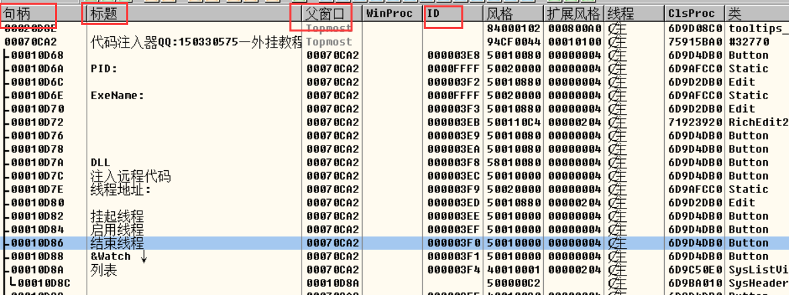
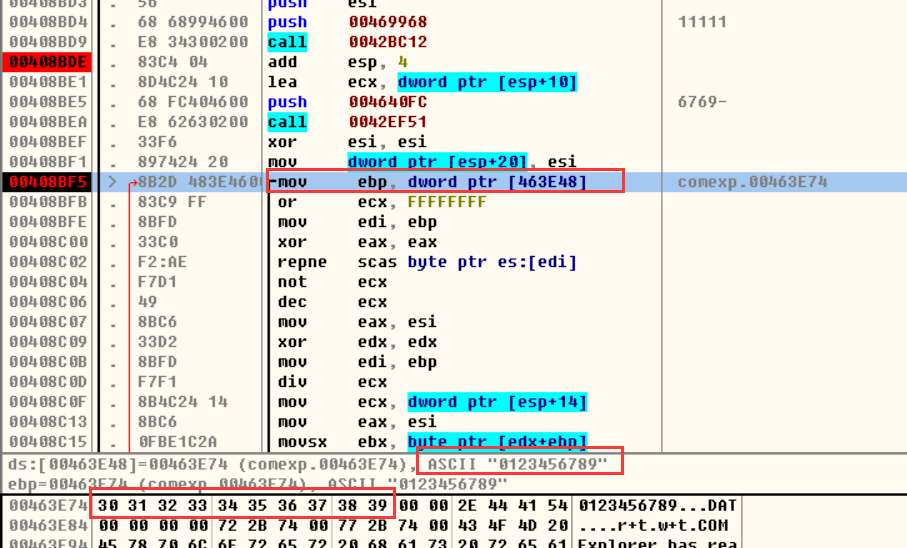
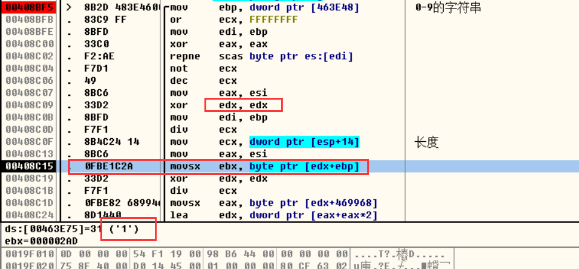
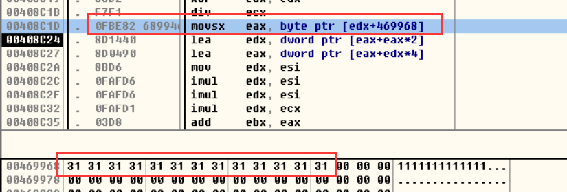

定位关键点3种方法:  过程函数       api      字符串

但是不确定用要哪一种方法,可以3种方法都用一下,因为在不同的程序,实用的方法是不一样的


### 窗口程序看控件信息

#### 1.通过OD去看



#### 还可以用   spy ++ 查看 


还可以用vs2019 ,打开软件,找到对应控件直接看属性


一般拿句柄没用,因为按钮是响应 WM_COMMAND 消息,因此需要知道控件id


可以修改控件属性的软件:    eXeScope       Restorato


OD 没有查看资源的功能

OD没有通过控件ID下断点功能 ,可在在 WM_COMMAND 消息 下条件断点


### COM注册机

1.  第一件事情就是定位关键点

关键点一般还是看它弹得什么窗扣,然后通过窗口上的字符串取OD查找字符串,找到字符串后下断点,运行程序,看看有没有断下来

1.  寻找关键分支

找到关键点后,找到函数开头,然后看一下所有条件跳转,因为肯定存在校验后的失败和成功跳转,在所有跳转下断点后,重新运行软件,看看失败后执行那些分支执行了跳转,没执行的 就说明不是

1.  查看关键分支最近的  call ,因此这个 调用校验算法 一般是通过调用函数 实现的

可以通过删除该段代码,看看程序是否提示失败,如果没有就说明该出是调用校验算法,验证完就撤销修改

1.  校验算法一般移位和算术运算用的很多

找到关键代码复制出来,然后去分析算法,分析算法主中函数的功能传入和传出,即参数和返回值,猜出其大概作用,然后用自己的代码去替换

```
xor     esi, esi
  mov     dword ptr [esp+20], esi
L002:
  mov     ebp, dword ptr [463E48]
  or      ecx, FFFFFFFF
  mov     edi, ebp
  xor     eax, eax
  repne   scas byte ptr es:[edi]
  not     ecx
  dec     ecx
  mov     eax, esi
  xor     edx, edx
  mov     edi, ebp
  div     ecx
  mov     ecx, dword ptr [esp+14]
  mov     eax, esi
  movsx   ebx, byte ptr [edx+ebp]
  xor     edx, edx
  div     ecx
  movsx   eax, byte ptr [edx+469968]
  lea     edx, dword ptr [eax+eax*2]
  lea     eax, dword ptr [eax+edx*4]
  mov     edx, esi
  imul    edx, esi
  imul    edx, esi
  imul    edx, ecx
  add     ebx, eax
  or      ecx, FFFFFFFF
  xor     eax, eax
  add     ebx, edx
  repne   scas byte ptr es:[edi]
  not     ecx
  dec     ecx
  mov     eax, ebx
  xor     edx, edx
  div     ecx
  lea     ecx, dword ptr [esp+10]
  mov     al, byte ptr [edx+ebp]
  push    eax
  call    0042F29A
  test    esi, esi
  je L050
  mov     eax, esi
  xor     edx, edx
  mov     ecx, 3
  div     ecx
  test    edx, edx
  jnz L050
  push    004640F8
  lea     ecx, dword ptr [esp+14]
  call    0042F273
L050:
  inc     esi
  cmp     esi, 9
  jb L002
```




说明存在一个全局的字符传 "0123456789"


这几个寄存器是直接赋值,所以没有保存什么特殊的值,分析时可以不用管


跟我们输入字符串长度一样,所以猜测可能会是字符串长度




有点像是取字符串



取用户名


观察call执行前后的变化,发现他在拼接字符


观察此处 call 发现他在拼接 '-'


把执行后的结果拿去测试,看看是否成功没,如果成功后面就不需要看了,说明上面就是生成注册码的算法

```
.386
.model flat, stdcall  ;32 bit memory model
option casemap :none  ;case sensitive

include Register.inc

.data 
    g_szUserName db 128 dup(0)

   
    g_szNumber  db "0123456789", 0       ;常量字符串
    g_szSerNumb db "6769-", 32 dup(0)    ;注册码
    g_ch        db 2 dup(0)              ;拼接的字符
    g_szGang    db "-", 0                ;拼接的字符
    g_dwCnt     dd 0                     ;用户名长度
.code

start:

	invoke GetModuleHandle,NULL
	mov		hInstance,eax

    invoke InitCommonControls
	invoke DialogBoxParam,hInstance,IDD_DIALOG1,NULL,addr DlgProc,NULL
	invoke ExitProcess,0

;########################################################################


Make proc uses esi ecx edi ebx  hWin:HWND 
    LOCAL @dwCnt:DWORD
    
  invoke GetDlgItemText, hWin, EDT_USERNAME, offset g_szUserName, size g_szUserName
   
  mov g_dwCnt, eax   ;将字符串长度给 g_dwCnt

  ;算法解析开始
  push ebp     ;因为改变了 edp,所以需要先入栈
  
  xor     esi, esi
L002:
  lea     ebp, g_szNumber   ;获取字符串地址
  or      ecx, 0FFFFFFFFh
  mov     edi, ebp
  xor     eax, eax
  repne   scas byte ptr es:[edi]
  not     ecx
  dec     ecx
  mov     eax, esi
  xor     edx, edx
  mov     edi, ebp
  div     ecx
  mov     ecx, g_dwCnt    ;这里换全局变量是因为 ebp的值发生了改变
  mov     eax, esi
  movsx   ebx, byte ptr [edx+ebp]
  xor     edx, edx
  div     ecx
  movsx   eax, byte ptr [edx + offset g_szUserName]
  lea     edx, dword ptr [eax+eax*2]
  lea     eax, dword ptr [eax+edx*4]
  mov     edx, esi
  imul    edx, esi
  imul    edx, esi
  imul    edx, ecx
  add     ebx, eax
  or      ecx, 0FFFFFFFFh
  xor     eax, eax
  add     ebx, edx
  repne   scas byte ptr es:[edi]
  not     ecx
  dec     ecx
  mov     eax, ebx
  xor     edx, edx
  div     ecx
  mov     al, byte ptr [edx+ebp]
  mov     g_ch,al                                       ;将 al转成字符串
  invoke crt_strcat, offset g_szSerNumb, offset g_ch    ;字符拼接
  test    esi, esi
  je L050
  mov     eax, esi
  xor     edx, edx
  mov     ecx, 3
  div     ecx
  test    edx, edx
  jnz L050
  invoke crt_strcat, offset g_szSerNumb, offset g_szGang  ;拼接字符串
L050:
  inc     esi
  cmp     esi, 9
  jb L002
  pop ebp    ;出栈

    ;显示到界面
    invoke SetDlgItemText,hWin, EDT_SERNUMBER, offset g_szSerNumb
    
    ret

Make endp


DlgProc proc hWin:HWND,uMsg:UINT,wParam:WPARAM,lParam:LPARAM

	mov		eax,uMsg
	.if eax==WM_INITDIALOG

	.elseif eax==WM_COMMAND
	    mov eax, wParam
	    .if ax == BTN_MAKE
	        invoke Make, hWin
	    .endif

	.elseif eax==WM_CLOSE
		invoke EndDialog,hWin,0
	.else
		mov		eax,FALSE
		ret
	.endif
	mov		eax,TRUE
	ret

DlgProc endp

end start

```

注册成功删除 注册表重新注册   搜索   4Developers