### windbg

windows上调试功能最强大的工具

#### 安装

##### 下载

下载 win10 SDK (如果系统是 win11  ,那就是下载 win11 sdk )


大部分用的都是  windbg preview

通过微软商店下载


##### 配置符号

1.  直接配置到环境变量

​         _NT_SYMBOL_PATH

​        SRV*g:\symbol*http://msdl.microsoft.com/download/symbols


1.  配置软件中


##### 使用

1.  调试可执行文件

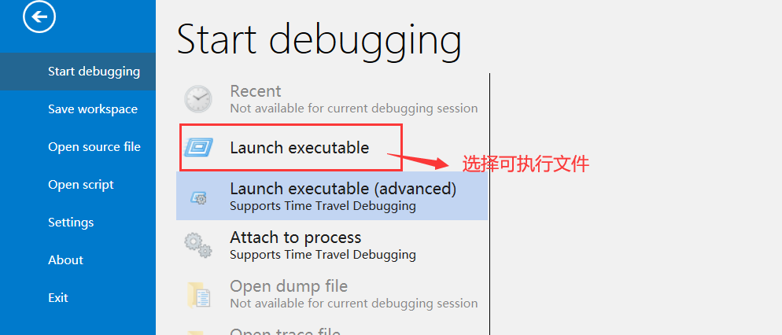

1.  调试源码

先打开对应的 可执行文件 (.exe),在打开源吗


#### 常用命令

-   命令分为标准命令、元命令、扩展命令
-   f10单步步过，f11单步步入，f9断点 ,f5直接运行（配合源码使用）

帮助文档


##### 1. 通用命令

**d    --  查看内存**

**e    --  内存修改**

**r     --  查看寄存器，修改寄存器**

**p    --  单步跳过**

**r     --  单步进入**

**u    --  查看汇编指令**

**bp  --  设置断点**

**bl  --   查看断点**

**bc  --  删除断点**


d命令有很多扩展功能，可以将内存数据解释成不同格式显示出来 

**da - ascii				//按照ascll解析**

**du - unicode			//按照unicode解析**


​    **ds - ascii_string  		//以ascii格式显示字符串**

**dS - unicode_string    	//以unicode格式显示字符串**


##### 2. 特有命令

-   同时Windbg还有很多自己独有的命令，例如debug只能在已经加载的模块上下断点，而windbg可以在模块为加载之前设置，同时还支持通配符下断点。

设置断点的命令格式：bx   addr/module!function      地址/模块!函数名

bp   --  设置断点，如果使用bp在模块未加载之前设置断点，windbg会自动转换成 bu

bu  --   延迟断点，针对符号            可以在模块没有加载之前设置断点

bm   --  m是match的首字母，可以使用通配符


​     bd   --  禁用断点，对应OD中的使断点失效功能

​        be   --  使断点重新生效


##### 硬件断点：在内存中设置执行、读以及写断点。

ba  -e/r/w  size(1/2/4/8)  addr

-e  当执行到内存处时命中断点

-r  当在内存中执行读操作时命中断点

-w  当在内存中执行写操作时命中断点

大小必须是1/2/4/8


#### 断点

-   软件断点

| 命令 | 说明                            | 示例                                                   |
| ---- | ------------------------------- | ------------------------------------------------------ |
| bp   | bp + address                    | bp 0x7783FEB或    bp  user32!MessageBoxA               |
| bu   | 延迟断点 - 对未加载的模块设断点 | bu kernel32!GetVersion                                 |
| bm   | 匹配通用符                      | bm msvcr80d!print*bm msvcr80d!*Alloc*                  |
| bl   | 查看断点                        | bl                                                     |
| bc   | 删除断点                        | bc 2   或   bc  0  -  30  (会把编号0-30的断点全部取消) |

-   硬件断点

| 命令 | 说明                                         | 格式                  |
| ---- | -------------------------------------------- | --------------------- |
| ba   | 针对数据下断点，断点在指定内存被访问是触发。 | ba Access Size [地址] |

Access:  访问方式     e访问   r读  w写   

size  :  内存大小       只能是   1 或 2或 4 或 8

-   ba   w    4   0x0483DEF：要对内存0x0483DEF进行写操作的时候下断点      

#### 查看当前加载了那些 dll

lm

查看dll中的导出函数

-   x  对应的dll 名!*
-   x user32!*    查看user32.dll中的所有导出函数
-   x user32!*Create*    查看user32.dll中的所有名字含 Create  导出函数


#### 伪寄存器

-   伪寄存器并不是寄存器，本质上是一些变量，方便我们使用。例如：&exentry
-   伪寄存器的值有些可以改,有些不可以
-   用法：直接在windbg下命令行输出即可
-   **$exentry**：该伪寄存器记录了程序的入口点。
-   使用OD调试程序时，一开始是系统断点，g命令执行会自动停到程序入口点，而windbg会直接运行程序使用windbg一开始停到系统断点，使用$exentry查看程序的入口断点。

用法：?   伪寄存器

例如：?   $exentry


**g   $exentry   跳转到程序入口点**


### _TEB 和 _PEB

------

#### 介绍

-   **PEB —— Thread environment block**   （**进程环境块）   描述进程相关的信息**
-   **TEB —— Process environment block**  （**线程环境快）   描述线程相关的信息**

-   -   同样进程也有自己的环境块，进程与线程的关系是一对多的关系，可想而知，_teb中肯定包含了_peb的信息在偏移量为30h的位置，


##### 1. Windbg 常用有关结构体命令

-   dt _teb/_peb 	：查看teb/peb结构体
-   dt _teb 0026c00(teb 结构体某地址变量)	：解析teb结构体该变量下的所有结构体的值
-   !teb/peb  : teb 的地址 和peb 的地址，列举了少量的信息
-   lm： 查看模块加载顺序


#### _TEB 解析

-   ntdll.NtCurrentTeb() 函数用来返回当前线程的TEB结构体指针
-   NtCurrentTeb() 函数所返回的结构体指针即为 fs:[0x18] 的值，里面的值即为TEB的结构体指针，fs:[0]的值即为TEB的起始地址


-   fs[18] 指向_TEB的地址。

##### 1. 验证GetLastError获取

错误码是线程独立的

-   引入：windows提供GetLastError可以拿到程序最后的产生的错误码，那这个错误码是如何获取的呢？
-   这个错误码应该是以线程为单位的，针对线程的错误码，很容易想明白，如果针对的是进程，那么在多线程运行时，多个线程产生错误，那么某一个线程去调用GetLastError是不能准确拿到自己的，结果是不可靠的。


-   示例：
-   验证：生成一个exe，获取错误码，观察这个错误码是从那里来的。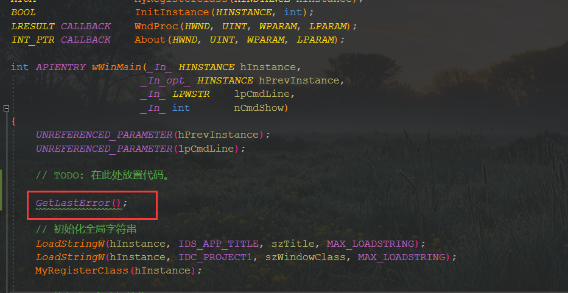
-   g wWinMain    到函数入口
-   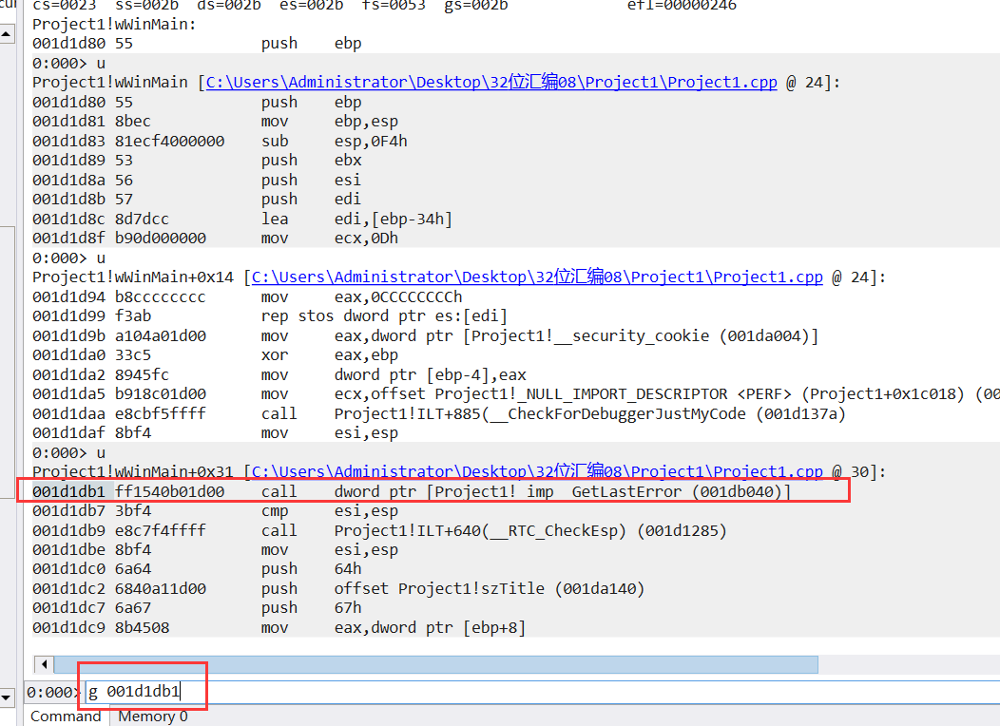

跳转到  获取到错误码的函数


可以看到  他从  fs  偏移为 18的地方取出来了一个  dword ,  又从  dword  这个位置 偏移 34 的地方又取出一个dword 


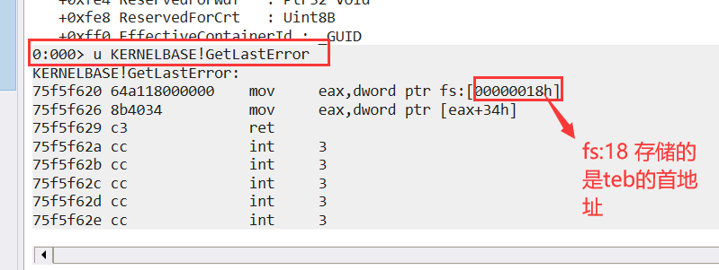

其实 fs 从 0 开始 存储的 就是 teb的信息


查看   _NT_TID 结构体


查看该处的值

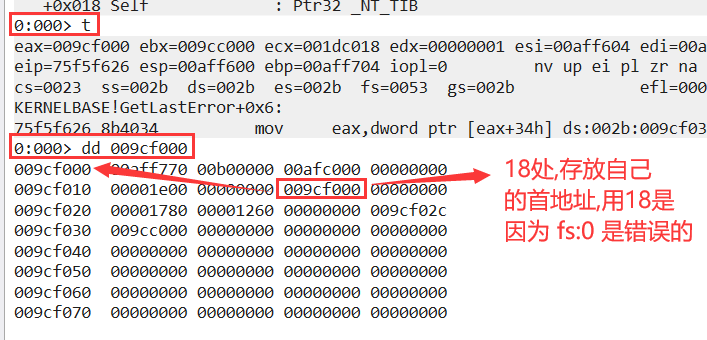


每一个线程都有自己单独的 teb ,保存线程的一些信息


线程有一个单独的 结构体保存自己的信息,同理 每一个线程也有一个自己单独的结构体来保存自己的信息

#### _PEB 解析

-   同样进程也有自己的环境块，进程与线程的关系是一对多的关系，可想而知，_teb中肯定包含了_peb的信息在偏移量为30h的位置。
-   和_teb类似，可以通过扩展指令!peb获取进程环境块的地址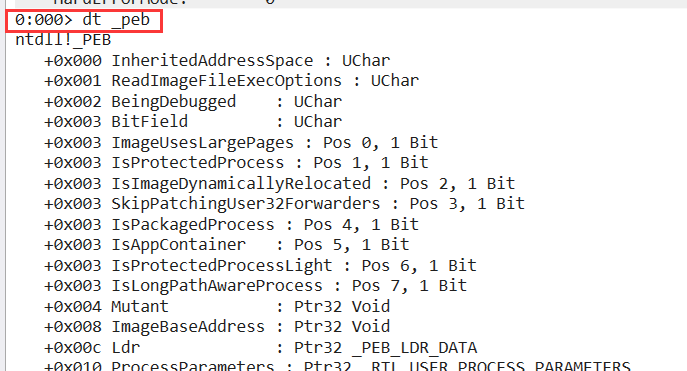
-   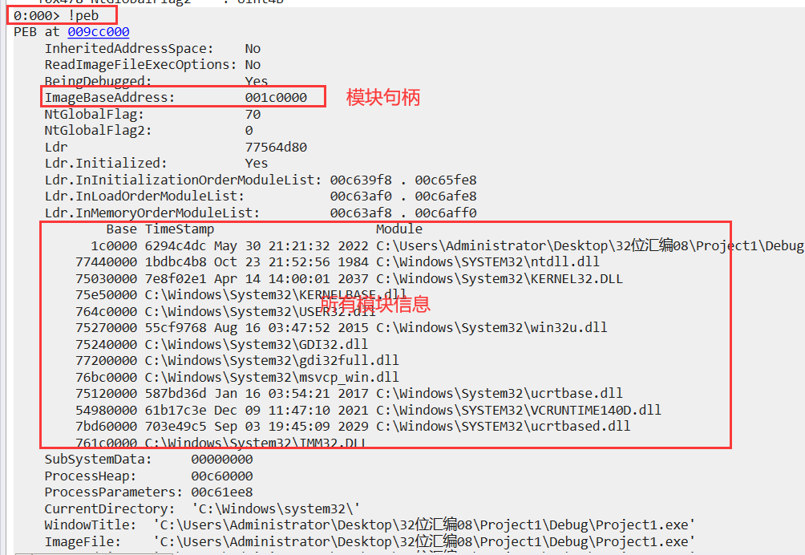
-   
-   


##### Ldr解析

-   在_peb结构体中0ch偏移处，Ldr结构体成员，该结构体有三个链表，存储了模块信息。
-   这三个链表的数据和数据是一样的，但是顺序是不一样的。

InLoadOrderModuleList：按加载顺序的模块链表

InMemoryOrderModuleList：按内存顺序的模块链表

InInitializationOrderModuleList：按初始化顺序的模块链表

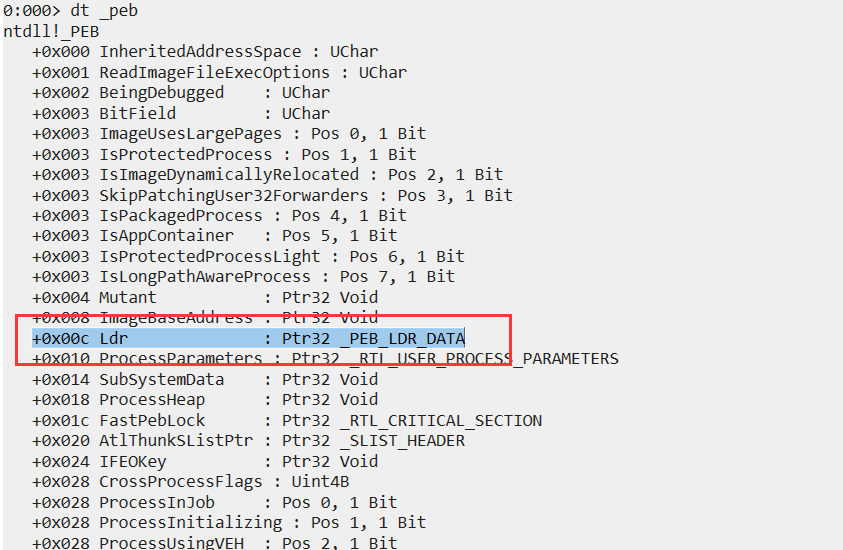


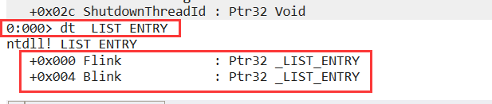

可以看出  _LIST_ENTRY  结构体里面存放的  是 2个 _LIST_ENTRY 结构体指针,所以明显是双向链表,链表只给了链表头,里面的成员需要自己去逆向去挖掘


获取peb首地址

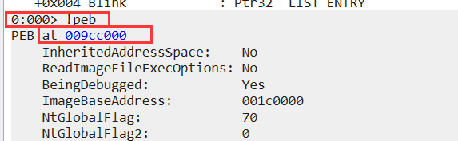


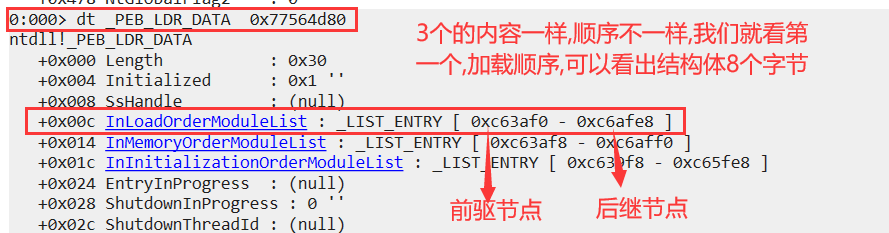


在继续向前跟发现 是  自己主模块       ntddll.dll    kernel32.dll       kernelbase.dll     user32.dll (有的程序没有,控制台就不需要),而且继续跟会发现他是一个双向循环链表

这个顺序自 xp 以来就没变过,因此可以通过 自己主模块 获取到      kernel32.dll 或者 user32.dll 的模块句柄   

##### _LIST_ENTRY

##### 

-   链表中的node数据中重要的数据有：

偏移量为18h的位置是模块地址

偏移量为1ch的数据是程序入口地址，实践可知只有主模块才有程序入口地址信息

偏移量为24h的位置是模块全路径字符串数据，DLL全路径字符串使用了UNICODE_STRING结构体保存

偏移量为2c的位置是DLL名字符串数据，同样使用UNICODE_STRING结构体保存


```
typedef struct _LDR_DATA_TABLE_ENTRY
{
    LIST_ENTRY InLoadOrderLinks;
    LIST_ENTRY InMemoryOrderLinks;
    LIST_ENTRY InInitializationOrderLinks;
    PVOID DllBase;
    PVOID EntryPoint;
    ULONG SizeOfImage;
    UNICODE_STRING FullDllName;
    UNICODE_STRING BaseDllName;
    ULONG Flags;
    WORD LoadCount;
    WORD TlsIndex;
    union
    {
        LIST_ENTRY HashLinks;
        struct
        {
            PVOID SectionPointer;
            ULONG CheckSum;
        };
    };
    union
    {
        ULONG TimeDateStamp;
        PVOID LoadedImports;
    };
    _ACTIVATION_CONTEXT * EntryPointActivationContext;
    PVOID PatchInformation;
    LIST_ENTRY ForwarderLinks;
    LIST_ENTRY ServiceTagLinks;
    LIST_ENTRY StaticLinks;
} LDR_DATA_TABLE_ENTRY, *PLDR_DATA_TABLE_ENTRY;

（在0x028处获取 DllName的名称字符串）
```

他的结构如图：


GetModuleHandle：输入字符串获取


**_teb结构图（包括_peb）**


该链表是一个双向循环链表，结构如下


注意: 拿   peb首地址     fs 用之前  记得    assume  fs:nothing


理一下顺序:

dt _teb   ;查看teb结构

!teb          ;查看teb首地址

dt  _teb    teb收地址     ;在该地址以teb的格式解析结构体,找一下 偏移位为 30 的位置 拿到  peb 的首地址

dt  _peb    peb首地址   ;在该地址以peb的格式解析结构体,找一下偏移为 c 的位置  拿到  ldr 的首地址

dt  _PEB_LDR_DATA ldr首地址        ;在该地址以ldr的格式解析结构体,

​                                                                 ;找一下偏移为 c 的位置  拿到  进程信息 的首地址

dd   前驱结点地址     获取自己主模块地址

dd   前驱结点地址     获取自己ntdll.dll的信息

dd   前驱结点地址     获取自己kernel32.dll的信息

dd   前驱结点地址     获取自己kernebase.dll的信息


### 作业

#### 模拟实现GetModuleHandle和GetModuleFileName

```
.386
.model flat,stdcall
option casemap:none

   include windows.inc
   include user32.inc
   include kernel32.inc
   include msvcrt.inc
   
   includelib user32.lib
   includelib kernel32.lib
   includelib msvcrt.lib

.data
    g_szModuleName db 'GetModuleInfo.exe', 0           ;要查找的模块名
    g_szModuleFileName db 255 dup(0)                   ;根据模块句柄找到的模块名
    g_szFmt db 'Handle: %08X      FileName: %s', 0     ;格式化
    g_dwHandle dd 0                                    ;根据模块名查找的模块句柄
    g_szInfo   dd  255 dup(0)                          ;弹窗信息

.code
MyGetModuleHandle proc lpModuleName:LPCSTR
    LOCAL @pFlink:DWORD   ;上一个节点地址
    LOCAL @pBlink:DWORD   ;下一个节点地址
    LOCAL @dwLen:DWORD
    LOCAL @dwNLen:DWORD
    LOCAL @szBuff[MAX_PATH]:BYTE
    
    xor eax, eax
    invoke RtlZeroMemory, addr @szBuff, sizeof @szBuff
    
    assume fs:nothing

    mov eax,dword ptr fs:[18H]  ;获取teb首地址 
    mov eax,dword ptr [eax+30H] ;获取peb首地址 
    mov eax,dword ptr [eax+0cH] ;获取Lar首地址
    mov eax,dword ptr [eax+0cH] ;获取保存模块信息的首地址
    
 
    mov ebx, eax
    .if eax == NULL
        jmp NOTEXIT_PROC
    .endif
    .if  lpModuleName == NULL
        mov eax, [eax + 18h]    ;返回主模块基址
        ret
    .endif
    
    mov eax, [ebx + 4h]     ;获取下一个节点信息
    mov @pBlink, eax        ;保存下一个节点信息
 
    ;转字节
    invoke crt_strlen, lpModuleName      ;获取模块名长度
    mov @dwLen, eax
    invoke MultiByteToWideChar,CP_ACP, 0, lpModuleName, @dwLen,NULL, 0
    mov @dwNLen, eax
    invoke MultiByteToWideChar,CP_ACP, 0, lpModuleName, @dwLen, addr @szBuff, @dwNLen
    
    .while ebx != @pBlink         ;如果遍历结束 
        mov eax, ebx
        mov edx, [eax + 30h]      ;获取当前的模块名
        invoke crt_wcscmp, edx, addr @szBuff    ;当前的模块名和 查找的模块名对比
        .if eax == 0                            ;如果相同就找到了,返回模块句柄,否则继续遍历
            mov eax, ebx
            mov eax, [eax + 18h]                ;获取模块句柄
            ret
        .endif
        mov ebx, [ebx]                           ;获取上一个节点首地址
    .endw
    
NOTEXIT_PROC:
    mov eax, NULL
    ret
MyGetModuleHandle endp


MyGetModuleFileName proc hModule:HMODULE
    LOCAL @szBuff[MAX_PATH]:BYTE
 
    invoke RtlZeroMemory, addr @szBuff, sizeof @szBuff
    
    assume fs:nothing

    mov eax,dword ptr fs:[18H]  ;获取teb首地址 
    mov eax,dword ptr [eax+30H] ;获取peb首地址 
    mov eax,dword ptr [eax+0cH] ;获取Lar首地址
    mov eax,dword ptr [eax+0cH] ;获取保存模块信息的首地址
    
    .if hModule == NULL
        jmp EXIT_PROC
    .endif
    
    mov ebx, [eax + 4]           ;获取下一个模块地址
    .while ebx != eax
        mov ecx, [eax + 18h]     ;获取下一个模块句柄
        .if ecx == hModule       ;判断是否等于我们要查找的模块句柄
            jmp EXIT_PROC        ;找到了就不需要继续循环
        .endif
        mov eax, [eax]           ;获取上一个节点信息首地址
    .endw
    ;未找到返回null
    mov eax, NULL
    ret
    
EXIT_PROC:
    mov edx, [eax + 28h]       ;获取模块的全路径
    ;mov edx, [eax + 30h]      ;获取模块的名字
    
    ;转字节
    invoke WideCharToMultiByte, CP_ACP, 0, edx, -1, addr @szBuff, sizeof @szBuff, NULL, FALSE
      
    invoke RtlZeroMemory, offset g_szModuleFileName, 255
    invoke crt_memcpy, offset g_szModuleFileName, addr @szBuff, 255
    ret

MyGetModuleFileName endp

start:   

    invoke MyGetModuleHandle, offset g_szModuleName
    mov g_dwHandle, eax
    invoke MyGetModuleFileName, g_dwHandle
    
    ;格式化字符串
    invoke wsprintf,offset g_szInfo,offset g_szFmt,g_dwHandle, offset g_szModuleFileName
    ;弹窗显示结果
    invoke MessageBoxA,NULL,offset g_szInfo,offset g_szModuleName,MB_OK

    invoke ExitProcess, 0
end start
```

