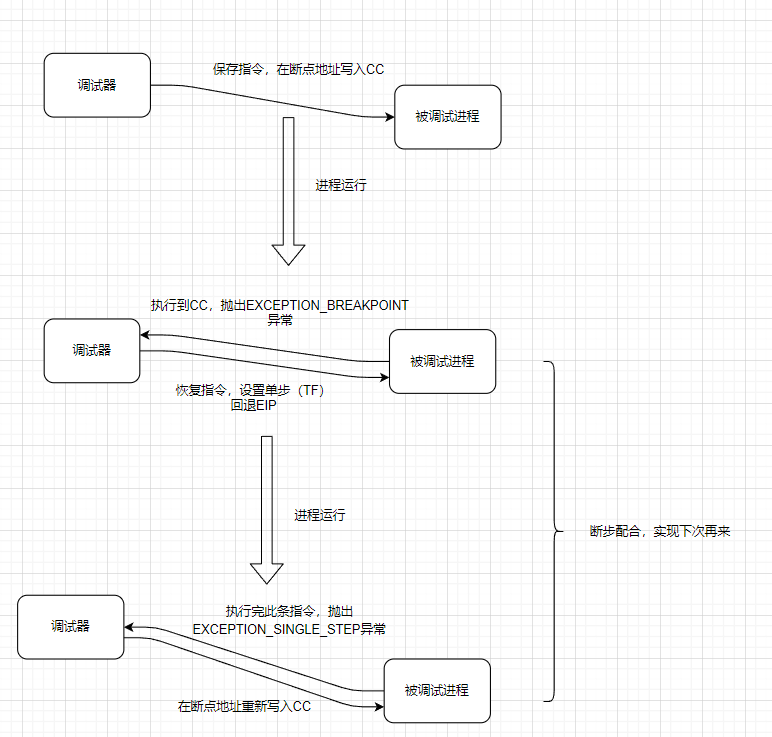
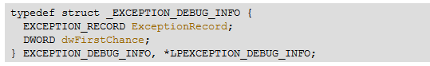
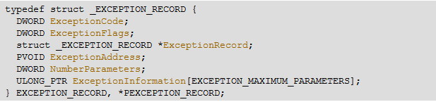

## 一般断点(软件断点)


断点的尊严

1.  断的下来     
2.  走的过去     
3.  下次还来

所有合格的断点都应该满足这3个要求


OD下断点实际是把指令的第一个字节改成了CC,当程序执行到CC的时候其实是抛了一个异常(EXCEPTION_BREAKPOINT),这个异常就会进入调试器里面因为处于调试状态,调试器拿到这个异常之后就会知道程序要断到这里,写了CC之后,这条指令正常的功能就被破坏了,但是这条指令正常功能中他还是应该执行的,那怎么让他走过去呢,那就是把这条指令恢复,下次再来只需要走过去之后再把它写回CC,这条指令执行完可通过 TF 标志位 来实现, (TF置1就会抛出异常(EXCEPTION_SINGLE_STEP)),




断步配合: 断点和单步配合实现断点下次再来 

调试的时候 如果 断点下次没来  就检查断步配合,如果崩了说明没有恢复,如果程序跑飞了,断点不再来,说明单步没处理好


调试器对被调试进程拥有所有的权限(除了写)




  第二个成员就是调试器判断异常第一个次来还是第二次

第一个成员,异常信息结构体




### 获取寄存器环境    GetThreadContext


第一个参数: 线程句柄   ,第二个结构体指针(结构体类型要到 vs中去看, msdn没有) 


### 代码实现

以扫雷为例

```
扫雷的过程函数：
地址                    机器码           助记符
01001BC9          55                  push    ebp
01001BCA         8BEC             mov     ebp, esp
01001BCC         83EC 40        sub     esp, 40
01001BCF         8B55 0C        mov     edx, dword ptr [ebp+C]        //在该行下断点
01001BD2         8B4D 14       mov     ecx, dword ptr [ebp+14]
01001BD5         53                  push    ebx
01001BD6         56                  push    esi
01001BD7         33DB             xor     ebx, ebx
```

```
.586
.model flat,stdcall
option casemap:none

   include windows.inc
   include user32.inc
   include kernel32.inc
   include msvcrt.inc
   
   includelib user32.lib
   includelib kernel32.lib
   includelib msvcrt.lib
   
.data
    g_szExe db "winmine.exe", 0     ;被调试的程序
    g_hExe  dd 0                    ;被调试的程序句柄
    g_szEXCEPTION_DEBUG_EVENT         db "EXCEPTION_DEBUG_EVENT", 0dh, 0ah, 0
    g_szCREATE_THREAD_DEBUG_EVENT     db "CREATE_THREAD_DEBUG_EVENT", 0dh, 0ah, 0
    g_szCREATE_PROCESS_DEBUG_EVENT    db "CREATE_PROCESS_DEBUG_EVENT", 0dh, 0ah, 0
    g_szEXIT_THREAD_DEBUG_EVENT       db "EXIT_THREAD_DEBUG_EVENT", 0dh, 0ah, 0
    g_szEXIT_PROCESS_DEBUG_EVENT      db "EXIT_PROCESS_DEBUG_EVENT", 0dh, 0ah, 0
    g_szLOAD_DLL_DEBUG_EVENT          db "LOAD_DLL_DEBUG_EVENT", 0dh, 0ah, 0
    g_szUNLOAD_DLL_DEBUG_EVENT        db "UNLOAD_DLL_DEBUG_EVENT", 0dh, 0ah, 0
    g_szOUTPUT_DEBUG_STRING_EVENT     db "OUTPUT_DEBUG_STRING_EVENT", 0dh, 0ah, 0
    
    g_szLoadDllFmt    db "%08X %s", 0dh, 0ah, 0
    g_szwLoadDllFmt   dw '%', '0', '8', 'X', ' ', '%', 's', 0dh, 0ah, 0
    
    g_szBpFmt  db      "CC异常 %08X", 0dh, 0ah, 0
    g_szSsFmt  db      "单步异常 %08X", 0dh, 0ah, 0
    
    g_btOldCode db   0           ;记录没下断点之前的字符
    g_dwBpAddr  dd   01001BCFh   ;下断点的地址
    g_byteCC    db   0CCh        ; 短点符号 CC 
   
.code  

;处理异常信息
OnException proc uses esi pDE:ptr DEBUG_EVENT 
    LOCAL @dwOldProc:DWORD   ;修改之前的内存属性
    LOCAL @dwBytesOut:DWORD   
    LOCAL @hThread:HANDLE
    LOCAL @ctx:CONTEXT

    mov esi, pDE
    assume esi:ptr DEBUG_EVENT
    
    ;判断是否断点异常
    .if [esi].u.Exception.pExceptionRecord.ExceptionCode == EXCEPTION_BREAKPOINT
        
        ;判断是否是自己的CC  通过地址判断
        mov eax, [esi].u.Exception.pExceptionRecord.ExceptionAddress
        .if eax != g_dwBpAddr     ;该处地址是不是我们下断点地址
            ;不是自己的CC异常，不处理
            mov eax, DBG_EXCEPTION_NOT_HANDLED 
            ret
        .endif
    
      
        ;处理自己的CC异常
        invoke crt_printf, offset g_szBpFmt, [esi].u.Exception.pExceptionRecord.ExceptionAddress
        
         ;修改内存属性
        invoke VirtualProtect, g_dwBpAddr, 1, PAGE_EXECUTE_READWRITE, addr @dwOldProc

        ;恢复指令
        invoke WriteProcessMemory, g_hExe, g_dwBpAddr, offset g_btOldCode, size g_btOldCode, addr @dwBytesOut 
  
        ;还原内存属性
        invoke VirtualProtect, g_dwBpAddr, 1, @dwOldProc, addr @dwOldProc
        
        ;设置单步
        
        ;获取线程句柄
        invoke OpenThread, THREAD_ALL_ACCESS, FALSE, [esi].dwThreadId
        mov @hThread, eax
        
        ;设置结构体标志位,用来判断获取那些寄存器环境
        ; CONTEXT_FULL  表示获取控制,整数,段   CONTEXT_ALL 是所有的
        mov @ctx.ContextFlags, CONTEXT_FULL
        ;获取寄存器环境
        invoke GetThreadContext, @hThread, addr @ctx
        
        ;将TF标志位置1
        or @ctx.regFlag, 100h
            
        ;返回当前代码地址  @ctx.regEip 执行完CC的地址 
        dec @ctx.regEip     ;减1,cc是一个字节.
        
        ;设置寄存器环境
        invoke SetThreadContext, @hThread, addr @ctx
        
        ;关闭线程句柄
        invoke CloseHandle, @hThread
        
        mov eax, DBG_CONTINUE
        ret
    .endif
    
    ;单步来了  (如果是单步异常)
    .if [esi].u.Exception.pExceptionRecord.ExceptionCode == EXCEPTION_SINGLE_STEP
        ;处理自己的单步
        invoke crt_printf, offset g_szSsFmt, [esi].u.Exception.pExceptionRecord.ExceptionAddress
        
         ;修改内存属性
        invoke VirtualProtect, g_dwBpAddr, 1, PAGE_EXECUTE_READWRITE, addr @dwOldProc
    
        ;重设断点, 重新写入CC
        invoke WriteProcessMemory, g_hExe,  g_dwBpAddr, offset g_byteCC, size g_byteCC, addr @dwBytesOut
    
        ;还原内存属性
        invoke VirtualProtect, g_dwBpAddr, 1, @dwOldProc, addr @dwOldProc
    
        ;异常已处理,继续执行代码
        mov eax, DBG_CONTINUE
        ret
    .endif
    
    
    assume esi:nothing
    
    mov eax, DBG_EXCEPTION_NOT_HANDLED 
    ret

OnException endp


OnCreateProcess proc 
    LOCAL @dwBytesOut:DWORD  
    LOCAL @dwOldProc:DWORD   ;修改之前的内存属性
    
    ;修改内存属性
    invoke VirtualProtect, g_dwBpAddr, 1, PAGE_EXECUTE_READWRITE, addr @dwOldProc
  
    
    ;保存原来的被下断点地址 指令到 g_btOldCode ,用于恢复
    invoke ReadProcessMemory, g_hExe, g_dwBpAddr, offset g_btOldCode, size g_btOldCode, addr @dwBytesOut
    
    ;在 01001BCF(断点地址)写入CC
    invoke WriteProcessMemory, g_hExe,  g_dwBpAddr, offset g_byteCC, size g_byteCC, addr @dwBytesOut
    
    
    ;还原内存属性
    invoke VirtualProtect, g_dwBpAddr, 1, @dwOldProc, addr @dwOldProc
  
    ret

OnCreateProcess endp


main proc
    LOCAL @si:STARTUPINFO
    LOCAL @pi:PROCESS_INFORMATION
    LOCAL @de:DEBUG_EVENT 
    LOCAL @dwStatus:DWORD   ;事件处理结果
    
    invoke RtlZeroMemory, addr @si, size @si
    invoke RtlZeroMemory, addr @pi, size @pi
    invoke RtlZeroMemory, addr @de, size @de
    
    mov @dwStatus, DBG_CONTINUE
    ;建立调试会话
    invoke CreateProcess, NULL, offset g_szExe, NULL, NULL, FALSE, \
        DEBUG_ONLY_THIS_PROCESS,\
        NULL, NULL,\
        addr @si,\
        addr @pi
    .if !eax
        ret
    .endif 
    mov eax, @pi.hProcess
    mov g_hExe, eax
    
    ;循环接受调试事件
    .while TRUE
        invoke WaitForDebugEvent, addr @de, INFINITE
        
        ;处理调试事件
        .if @de.dwDebugEventCode == EXCEPTION_DEBUG_EVENT
            ;invoke crt_printf, offset g_szEXCEPTION_DEBUG_EVENT
            invoke OnException, addr @de
            mov @dwStatus, eax
        .elseif @de.dwDebugEventCode == CREATE_THREAD_DEBUG_EVENT
            invoke crt_printf, offset g_szCREATE_THREAD_DEBUG_EVENT
        .elseif @de.dwDebugEventCode == CREATE_PROCESS_DEBUG_EVENT
            ;invoke crt_printf, offset g_szCREATE_PROCESS_DEBUG_EVENT
            invoke OnCreateProcess
        .elseif @de.dwDebugEventCode == EXIT_THREAD_DEBUG_EVENT
            invoke crt_printf, offset g_szEXIT_THREAD_DEBUG_EVENT
        .elseif @de.dwDebugEventCode == EXIT_PROCESS_DEBUG_EVENT
            invoke crt_printf, offset g_szEXIT_PROCESS_DEBUG_EVENT
        .elseif @de.dwDebugEventCode == LOAD_DLL_DEBUG_EVENT
            ;invoke OnLoadDll, addr @de
        .elseif @de.dwDebugEventCode == UNLOAD_DLL_DEBUG_EVENT
            invoke crt_printf, offset g_szUNLOAD_DLL_DEBUG_EVENT
        .elseif @de.dwDebugEventCode == OUTPUT_DEBUG_STRING_EVENT
            invoke crt_printf, offset g_szOUTPUT_DEBUG_STRING_EVENT
        .endif
        
        ;提交事件处理结果
        invoke ContinueDebugEvent, @de.dwProcessId, @de.dwThreadId, @dwStatus
        invoke RtlZeroMemory, addr @de, size @de
    .endw
    
    ret

main endp


start:
    invoke main 

end start
```

## 反汇编引擎

https://bbs.pediy.com/thread-205590.htm

udis86官网    http://udis86.sourceforge.net/

[📎udis86.zip](/udis86.zip)

```
00513D41    8945 FC         mov     dword ptr [ebp-4], eax
00513D44    817D FC 4EE640B>cmp     dword ptr [ebp-4], BB40E64E
00513D4B    75 09           jnz     short 00513D56
00513D4D    C745 FC 4FE640B>mov     dword ptr [ebp-4], BB40E64F
00513D54    EB 1C           jmp     short 00513D72
00513D56    8B55 FC         mov     edx, dword ptr [ebp-4]
00513D59    81E2 0000FFFF   and     edx, FFFF0000
00513D5F    75 11           jnz     short 00513D72
00513D61    8B45 FC         mov     eax, dword ptr [ebp-4]
00513D64    0D 11470000     or      eax, 4711
00513D69    C1E0 10         shl     eax, 10
00513D6C    0B45 FC         or      eax, dword ptr [ebp-4]
00513D6F    8945 FC         mov     dword ptr [ebp-4], eax
00513D72    8B4D FC         mov     ecx, dword ptr [ebp-4]
00513D75    890D 04A05100   mov     dword ptr [__security_cookie], e>
00513D7B    8B55 FC         mov     edx, dword ptr [ebp-4]
00513D7E    F7D2            not     edx
00513D80    8915 00A05100   mov     dword ptr [__security_cookie_com>
00513D86    8BE5            mov     esp, ebp
00513D88    5D              pop     ebp
00513D89    C3              ret

```

```
#include "udis86.h"
#pragma comment(lib, "libudis86.lib")

#include <iostream>
using namespace std;

int  main()
{
	unsigned char data[73] = {
	0x89, 0x45, 0xFC, 0x81, 0x7D, 0xFC, 0x4E, 0xE6, 0x40, 0xBB, 0x75, 0x09, 0xC7, 0x45, 0xFC, 0x4F,
	0xE6, 0x40, 0xBB, 0xEB, 0x1C, 0x8B, 0x55, 0xFC, 0x81, 0xE2, 0x00, 0x00, 0xFF, 0xFF, 0x75, 0x11,
	0x8B, 0x45, 0xFC, 0x0D, 0x11, 0x47, 0x00, 0x00, 0xC1, 0xE0, 0x10, 0x0B, 0x45, 0xFC, 0x89, 0x45,
	0xFC, 0x8B, 0x4D, 0xFC, 0x89, 0x0D, 0x04, 0xA0, 0x51, 0x00, 0x8B, 0x55, 0xFC, 0xF7, 0xD2, 0x89,
	0x15, 0x00, 0xA0, 0x51, 0x00, 0x8B, 0xE5, 0x5D, 0xC3
	};
    
	ud_t ud_obj;                                        //定义
	ud_init(&ud_obj);                                   //初始化
	ud_set_input_buffer(&ud_obj, data, sizeof(data));   //缓冲区来源
	ud_set_mode(&ud_obj, 32);                           //32还是64位反汇编
	ud_set_syntax(&ud_obj, UD_SYN_INTEL);               //默认语法       
	ud_set_pc(&ud_obj, 0x00513D41);                     //指令开始地址
	while (ud_disassemble(&ud_obj))                     //开始反汇编
	{
		auto nLen = ud_insn_len(&ud_obj);   //当前指令长度
		auto nOff = ud_insn_off(&ud_obj);   //EIP  当前指令地址
		auto pHex = ud_insn_hex(&ud_obj);   //机器码
		auto ptr = ud_insn_ptr(&ud_obj);    //在本程序内存中的地址
		auto opr = ud_insn_opr(&ud_obj, 0);  
		auto mn = ud_insn_mnemonic(&ud_obj);
		auto mn0 = ud_lookup_mnemonic(mn);
		cout << hex << nOff << " "
			<< pHex << "\t\t"
			<< ud_insn_asm(&ud_obj) << endl;              //反汇编结果
	}

	return 0;
}

```


## 作业：

####  调试器，支持一般断点功能。