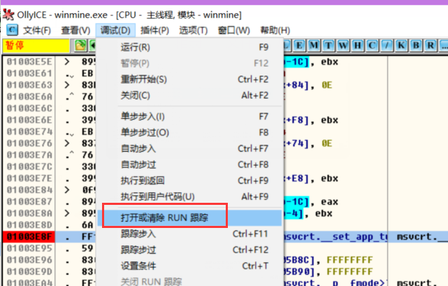
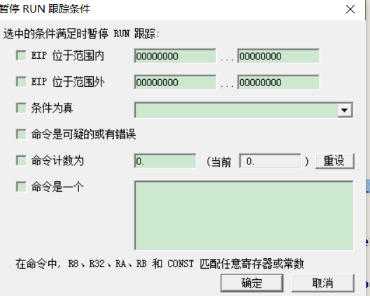
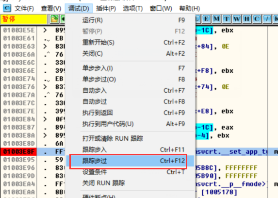

## 单步

TF - 置位(置1  复位就是置0)

#### 单步步入 -- 遇到call便入

#### 

#### 单步步过  -- 遇到call不入


区分一条指令是不是call指令:    通过反汇编引擎,反汇编出来是个 call 说明 就是 call指令


#### 代码实现

```
.586
.model flat,stdcall
option casemap:none

   include windows.inc
   include user32.inc
   include kernel32.inc
   include msvcrt.inc
   include udis86.inc
   
   includelib user32.lib
   includelib kernel32.lib
   includelib msvcrt.lib
   includelib libudis86.lib
   
.data
    g_szExe db "winmine.exe", 0     ;打开的进程
    g_hExe  dd 0
    g_szEXCEPTION_DEBUG_EVENT         db "EXCEPTION_DEBUG_EVENT", 0dh, 0ah, 0
    g_szCREATE_THREAD_DEBUG_EVENT     db "CREATE_THREAD_DEBUG_EVENT", 0dh, 0ah, 0
    g_szCREATE_PROCESS_DEBUG_EVENT    db "CREATE_PROCESS_DEBUG_EVENT", 0dh, 0ah, 0
    g_szEXIT_THREAD_DEBUG_EVENT       db "EXIT_THREAD_DEBUG_EVENT", 0dh, 0ah, 0
    g_szEXIT_PROCESS_DEBUG_EVENT      db "EXIT_PROCESS_DEBUG_EVENT", 0dh, 0ah, 0
    g_szLOAD_DLL_DEBUG_EVENT          db "LOAD_DLL_DEBUG_EVENT", 0dh, 0ah, 0
    g_szUNLOAD_DLL_DEBUG_EVENT        db "UNLOAD_DLL_DEBUG_EVENT", 0dh, 0ah, 0
    g_szOUTPUT_DEBUG_STRING_EVENT     db "OUTPUT_DEBUG_STRING_EVENT", 0dh, 0ah, 0
    
    g_szLoadDllFmt   db "%08X %s", 0dh, 0ah, 0
    g_szwLoadDllFmt   dw '%', '0', '8', 'X', ' ', '%', 's', 0dh, 0ah, 0
    g_szBpFmt  db "CC异常 %08X", 0dh, 0ah, 0
    g_szSsFmt  db "单步异常 %08X", 0dh, 0ah, 0
    
    g_szInputCmd db "选择命令：", 0dh, 0ah
                db "是:单步步入", 0dh, 0ah
                db "否:单步步过", 0dh, 0ah
                db "取消:直接运行", 0dh, 0ah,0
                
    
    g_btOldCode db 0               ;下断点之前的指令
    g_dwBpAddr  dd   010021a9h     ;下断点的地址
    g_byteCC   db 0CCh             ;CC指令
    
    g_szOutPutAsm db 64 dup(0)    ;要进行反汇编的指令
    
    g_szOutPutAsmFmt db "%08x %-20s %-20s", 0dh, 0ah, 0     ;指令反汇编输出格式 
    
    
    g_ud_obj db 1000h dup(0)
    
    g_bIsCCStep dd FALSE          ;是否是CC单步
    
    g_bIsStepStep dd FALSE        ;是否是T命令单步
   
.code  


;判断是否是 call 指令
IsCallMn  proc uses esi edi pDE:ptr DEBUG_EVENT, pdwCodeLen:DWORD
    LOCAL @dwBytesOut:DWORD
    LOCAL @dwOff:DWORD
    LOCAL @pHex:LPSTR
    LOCAL @pAsm:LPSTR
    
    mov esi, pDE
    assume esi:ptr DEBUG_EVENT
    
      ;显示下一条即将执行的指令   从内存读取要反汇编指令 (20个字节)到  g_szOutPutAsm
    invoke ReadProcessMemory, g_hExe, [esi].u.Exception.pExceptionRecord.ExceptionAddress, \
        offset g_szOutPutAsm, 20, addr @dwBytesOut
     
    ;初始化结构体  
    invoke ud_init, offset g_ud_obj
    invoke ud_set_input_buffer, offset g_ud_obj, offset g_szOutPutAsm, 20
    invoke ud_set_mode, offset g_ud_obj, 32
    invoke ud_set_syntax, offset g_ud_obj, offset ud_translate_intel
    invoke ud_set_pc, offset g_ud_obj, [esi].u.Exception.pExceptionRecord.ExceptionAddress
        
    invoke ud_disassemble, offset g_ud_obj
    
    
    ;获取EIP  当前指令地址
    invoke ud_insn_off, offset g_ud_obj
    mov @dwOff, eax
    
    ;获取机器码
    invoke ud_insn_hex, offset g_ud_obj
    mov @pHex, eax
    
    ;获取反汇编结果
    invoke ud_insn_asm, offset g_ud_obj
    mov @pAsm, eax
   
    ;获取指令长度 
    invoke ud_insn_len, offset g_ud_obj
    mov edi, pdwCodeLen
    
    mov [edi], eax
    
    ;输出反汇编结果
    invoke crt_printf, offset g_szOutPutAsmFmt, @dwOff, @pHex, @pAsm
    
    
    mov eax, @pAsm                 ;将反汇编字符数组的首地址给eax
    .if dword ptr [eax] == 'llac'  ;call在内存里面是 小尾方式存储
        mov eax, TRUE
        ret        
    .endif
    
    mov eax, FALSE
    ret

IsCallMn endp

;将TF置位(置1)
SetTF proc dwTID:DWORD
    LOCAL @hThread:HANDLE 
    LOCAL @ctx:CONTEXT
    
    invoke OpenThread, THREAD_ALL_ACCESS, FALSE, dwTID
    mov @hThread, eax
    
    mov @ctx.ContextFlags, CONTEXT_FULL
    invoke GetThreadContext, @hThread, addr @ctx
    
    ;将TF置1
    or @ctx.regFlag, 100h

    invoke SetThreadContext, @hThread, addr @ctx
    invoke CloseHandle, @hThread
    
    ret

SetTF endp

;回退EIP
DecEIP proc dwTID:DWORD
    LOCAL @hThread:HANDLE 
    LOCAL @ctx:CONTEXT
    
    invoke OpenThread, THREAD_ALL_ACCESS, FALSE, dwTID
    mov @hThread, eax
    
    mov @ctx.ContextFlags, CONTEXT_FULL
    invoke GetThreadContext, @hThread, addr @ctx
    
    dec @ctx.regEip
    
    invoke SetThreadContext, @hThread, addr @ctx
    invoke CloseHandle, @hThread
    ret

DecEIP endp

;设置断点
SetBp proc  
    LOCAL @dwBytesOut:DWORD  
    LOCAL @dwOldProc:DWORD   ;修改之前的内存属性
    
    ;修改内存属性
    invoke VirtualProtect, g_dwBpAddr, 1, PAGE_EXECUTE_READWRITE, addr @dwOldProc
        
    ;保存指定地址的指令，
    invoke ReadProcessMemory, g_hExe, g_dwBpAddr, offset g_btOldCode, size g_btOldCode, addr @dwBytesOut
    
    ;在指定地址 写入cc
    invoke WriteProcessMemory, g_hExe,  g_dwBpAddr, offset g_byteCC, size g_byteCC, addr @dwBytesOut
   
    ;还原内存属性
    invoke VirtualProtect, g_dwBpAddr, 1, @dwOldProc, addr @dwOldProc
    ret

SetBp endp

;选择指令
InputCmd proc uses esi pDE:ptr DEBUG_EVENT 
    LOCAL @bIsCall:BOOL        ;是否call指令
    LOCAL @dwCodeLen:DWORD     ;指令长度

    mov esi, pDE
    assume esi:ptr DEBUG_EVENT
    
    ;判断是否是call指定以及获取指令长度
    invoke IsCallMn, pDE, addr @dwCodeLen
    mov @bIsCall, eax    ;保存判断结果
    
    invoke MessageBox, NULL, offset g_szInputCmd, NULL, MB_YESNOCANCEL
   
    .if eax == IDYES
        ;单步步入，直接TF置1
        invoke SetTF, [esi].dwThreadId
    
        ;单步中需要处理T命令
        mov g_bIsStepStep, TRUE
    .elseif eax == IDNO
        ;单步步过，判断是否是call
        .if @bIsCall
            ;call指令，在下一条指令设置断点
            mov eax, [esi].u.Exception.pExceptionRecord.ExceptionAddress      ;获取call指令地址
            add eax, @dwCodeLen     ;获取call下条指令地址  call指令地址 +  指令长度 
            mov g_dwBpAddr, eax    
            invoke SetBp            ;设置断点
        
        .else  
            ;单步步入，直接TF置1
            invoke SetTF, [esi].dwThreadId
        
            ;单步中需要处理T命令
            mov g_bIsStepStep, TRUE   
            
        .endif
        
    .else
        ;直接运行
        
    .endif
    ret

InputCmd endp

OnException proc uses esi pDE:ptr DEBUG_EVENT 
    LOCAL @dwOldProc:DWORD   ;修改之前的内存属性
    LOCAL @dwBytesOut:DWORD  
    mov esi, pDE
    assume esi:ptr DEBUG_EVENT
    
    .if [esi].u.Exception.pExceptionRecord.ExceptionCode == EXCEPTION_BREAKPOINT
        ;判断是否是自己的CC
        mov eax, [esi].u.Exception.pExceptionRecord.ExceptionAddress
        .if eax != g_dwBpAddr
            ;不是自己的CC异常，不处理
            mov eax, DBG_EXCEPTION_NOT_HANDLED 
            ret
        .endif
    
        ;处理自己的CC异常
        invoke crt_printf, offset g_szBpFmt, [esi].u.Exception.pExceptionRecord.ExceptionAddress
        
        ;修改内存属性
        invoke VirtualProtect, g_dwBpAddr, 1, PAGE_EXECUTE_READWRITE, addr @dwOldProc
        
        ;恢复之前指令
        invoke WriteProcessMemory, g_hExe, g_dwBpAddr, offset g_btOldCode, size g_btOldCode, addr @dwBytesOut 
        
        ;还原内存属性
        invoke VirtualProtect, g_dwBpAddr, 1, @dwOldProc, addr @dwOldProc
        
        ;设置单步
        invoke SetTF, [esi].dwThreadId
        invoke DecEIP, [esi].dwThreadId
        
        ;单步中需要处理CC的单步
        mov g_bIsCCStep,  TRUE
        
        ;输入命令
        invoke InputCmd, pDE
        
        mov eax, DBG_CONTINUE
        ret
    .endif
    
    ;单步来了
    .if [esi].u.Exception.pExceptionRecord.ExceptionCode == EXCEPTION_SINGLE_STEP
    
        ;处理自己的单步
        invoke crt_printf, offset g_szSsFmt, [esi].u.Exception.pExceptionRecord.ExceptionAddress
        
        ;处理CC的单步
        .if g_bIsCCStep == TRUE
            mov g_bIsCCStep, FALSE
            
            ;重设断点, 重新写入CC
            ;invoke WriteProcessMemory, g_hExe,  g_dwBpAddr, offset g_byteCC, size g_byteCC, addr @dwBytesOut
        .endif
        
        ;处理T命令的单步
        .if g_bIsStepStep == TRUE
            mov g_bIsStepStep, FALSE
            
            invoke InputCmd, pDE
        .endif
        
        mov eax, DBG_CONTINUE
        ret
    .endif
    
    assume esi:nothing
    
    mov eax, DBG_EXCEPTION_NOT_HANDLED 
    ret

OnException endp

OnCreateProcess proc 

    ;设置断点
    invoke SetBp
    
    ret

OnCreateProcess endp


main proc
    LOCAL @si:STARTUPINFO
    LOCAL @pi:PROCESS_INFORMATION
    LOCAL @de:DEBUG_EVENT 
    LOCAL @dwStatus:DWORD
    
    invoke RtlZeroMemory, addr @si, size @si
    invoke RtlZeroMemory, addr @pi, size @pi
    invoke RtlZeroMemory, addr @de, size @de
    
    mov @dwStatus, DBG_CONTINUE
    ;建立调试会话
    invoke CreateProcess, NULL, offset g_szExe, NULL, NULL, FALSE, \
        DEBUG_ONLY_THIS_PROCESS,\
        NULL, NULL,\
        addr @si,\
        addr @pi
    .if !eax
        ret
    .endif 
    mov eax, @pi.hProcess
    mov g_hExe, eax
    
    ;循环接受调试事件
    .while TRUE
        invoke WaitForDebugEvent, addr @de, INFINITE
        
        ;处理调试事件
        .if @de.dwDebugEventCode == EXCEPTION_DEBUG_EVENT
            ;invoke crt_printf, offset g_szEXCEPTION_DEBUG_EVENT
            invoke OnException, addr @de
            mov @dwStatus, eax
        .elseif @de.dwDebugEventCode == CREATE_THREAD_DEBUG_EVENT
            invoke crt_printf, offset g_szCREATE_THREAD_DEBUG_EVENT
```

反汇编头文件

udis86.inc

```
ifndef UDIS86_H

UDIS86_H equ

ud_init proto c ud:ptr
ud_set_input_buffer proto c ud:ptr, pBuf:ptr, nSize:dword
ud_set_mode proto c ud:ptr, nBit:dword
ud_set_syntax proto c ud:ptr, translate:ptr
ud_translate_intel proto c ud:ptr
ud_set_pc proto c ud:ptr, eip:dword
ud_disassemble proto c ud:ptr
ud_insn_asm proto c ud:ptr
ud_insn_len proto c ud:ptr
ud_insn_off proto c ud:ptr
ud_insn_hex proto c ud:ptr

endif
```

## 反单步

单步主要是通过 TF 置位 来实现的,所以检查单步的一般思路是  检查TF 位

获取TF位的方法是  获取 标志寄存器

;pushfd

;and dword ptr [esp], 100h

;jz CONTIUE

;invoke MessageBox, NULL, NULL, NULL, MB_OK

​	

但是通过调试发现并不能实现,应该  代码执行完 TF 已经被还原为0 了此时在入栈,它的值就是0 ,所以没办法检查判断是否为1,因此要反其道行之 ,自己置个单步, 正常情况下自己可以收到一个单步异常,但处于调试状况时就无法收到,因为被调试器收了,调试器收到之后就继续往后执行

```
.586
.model flat,stdcall
option casemap:none

   include windows.inc
   include user32.inc
   include kernel32.inc
   
   includelib user32.lib
   includelib kernel32.lib


WinMain proto :DWORD,:DWORD,:DWORD,:DWORD


.data
   ClassName db "MainWinClass",0
   AppName  db "Main Window",0

.data?
   hInstance HINSTANCE ?
   CommandLine LPSTR ?

.code


; ---------------------------------------------------------------------------


start:
	invoke GetModuleHandle, NULL
	mov    hInstance,eax
	
	invoke GetCommandLine
	mov    CommandLine,eax
	
	invoke WinMain, hInstance,NULL,CommandLine, SW_SHOWDEFAULT
	invoke ExitProcess,eax

;SEH异常回调函数
F0Handler proc uses esi edi pER:ptr EXCEPTION_RECORD, pFrame:dword, pContext:ptr CONTEXT, pDC:dword
    
    assume esi:ptr EXCEPTION_RECORD
    mov esi, pER
    
    mov edi, pContext
    assume edi:ptr CONTEXT
    
    ;跳过下条指令
    add [edi].regEip, 5

    assume edi:nothing
    assume esi:nothing
    
    ret
F0Handler endp
	
WinMain proc hInst:HINSTANCE,hPrevInst:HINSTANCE,CmdLine:LPSTR,CmdShow:DWORD
	LOCAL wc:WNDCLASSEX
	LOCAL msg:MSG
	LOCAL hwnd:HWND
	
	
	
	assume fs:nothing
    push offset F0Handler ;handler    ;注册SEH异常
    push fs:[0] ;next
    mov fs:[0], esp
	
	pushfd
	or dword ptr [esp], 100h
	popfd
    
    ;异常被调试器收了,会继续执行下面的代码,自己异常无法收到,无法进SEH异常函数,所以无法跳过下条指令
    
	invoke ExitProcess, 0   ;退出进程 非单步调试情况下执行当前指令进异常,指令长度为5
	
	;获取TF
	;pushfd
	;and dword ptr [esp], 100h
	;jz CONTIUE
	;invoke MessageBox, NULL, NULL, NULL, MB_OK
	
;CONTIUE:
    ;正常流程，TF没有置1
        
        
        	
	mov   wc.cbSize,SIZEOF WNDCLASSEX
	mov   wc.style, CS_HREDRAW or CS_VREDRAW
	mov   wc.lpfnWndProc, OFFSET WndProc
	mov   wc.cbClsExtra,NULL
	mov   wc.cbWndExtra,NULL
	push  hInstance
	pop   wc.hInstance
	mov   wc.hbrBackground,COLOR_BTNFACE+1
	mov   wc.lpszMenuName,NULL
	mov   wc.lpszClassName,OFFSET ClassName
	
	invoke LoadIcon,NULL,IDI_APPLICATION
	mov   wc.hIcon,eax
	mov   wc.hIconSm,eax
	
	invoke LoadCursor,NULL,IDC_ARROW
	mov   wc.hCursor,eax
	
	invoke RegisterClassEx, addr wc
	INVOKE CreateWindowEx,NULL,ADDR ClassName,ADDR AppName,\
           WS_OVERLAPPEDWINDOW,CW_USEDEFAULT,\
           CW_USEDEFAULT,CW_USEDEFAULT,CW_USEDEFAULT,NULL,NULL,\
           hInst,NULL
	mov   hwnd,eax
	
	invoke ShowWindow, hwnd,SW_SHOWNORMAL
	invoke UpdateWindow, hwnd
	
	.WHILE TRUE
		invoke GetMessage, ADDR msg,NULL,0,0
		.BREAK .IF (!eax)
		invoke TranslateMessage, ADDR msg
		invoke DispatchMessage, ADDR msg
	.ENDW
	
        ;卸载SEH
        pop fs:[0]
        add esp, 4
    
	mov     eax,msg.wParam
	ret
WinMain endp

WndProc proc hWnd:HWND, uMsg:UINT, wParam:WPARAM, lParam:LPARAM
	
	.IF uMsg==WM_DESTROY
		invoke PostQuitMessage,NULL
	.ELSEIF uMsg==WM_CREATE
		;
	.ELSE
		invoke DefWindowProc,hWnd,uMsg,wParam,lParam		
		ret
	.ENDIF
	
	xor eax,eax
	ret
WndProc endp


end start
```

应对方法,在调试器里把上面代码 nop 调,调试器本身没办法处理,因为没办法判断单步是调试器自己的还是程序的

## TRACE  追踪

OD的追踪功能



也可以设置条件





查看


开启trace 就在 指定范围地址直接运行 p 命令,不用提示输入指令

#### 代码实现

点击否执行trace功能

```
.586
.model flat,stdcall
option casemap:none

   include windows.inc
   include user32.inc
   include kernel32.inc
   include msvcrt.inc
   include udis86.inc
   
   includelib user32.lib
   includelib kernel32.lib
   includelib msvcrt.lib
   includelib libudis86.lib
   
.data
    g_szExe db "winmine.exe", 0
    g_hExe  dd 0
    g_szEXCEPTION_DEBUG_EVENT         db "EXCEPTION_DEBUG_EVENT", 0dh, 0ah, 0
    g_szCREATE_THREAD_DEBUG_EVENT     db "CREATE_THREAD_DEBUG_EVENT", 0dh, 0ah, 0
    g_szCREATE_PROCESS_DEBUG_EVENT    db "CREATE_PROCESS_DEBUG_EVENT", 0dh, 0ah, 0
    g_szEXIT_THREAD_DEBUG_EVENT       db "EXIT_THREAD_DEBUG_EVENT", 0dh, 0ah, 0
    g_szEXIT_PROCESS_DEBUG_EVENT      db "EXIT_PROCESS_DEBUG_EVENT", 0dh, 0ah, 0
    g_szLOAD_DLL_DEBUG_EVENT          db "LOAD_DLL_DEBUG_EVENT", 0dh, 0ah, 0
    g_szUNLOAD_DLL_DEBUG_EVENT        db "UNLOAD_DLL_DEBUG_EVENT", 0dh, 0ah, 0
    g_szOUTPUT_DEBUG_STRING_EVENT     db "OUTPUT_DEBUG_STRING_EVENT", 0dh, 0ah, 0
    
    g_szLoadDllFmt   db "%08X %s", 0dh, 0ah, 0
    g_szwLoadDllFmt   dw '%', '0', '8', 'X', ' ', '%', 's', 0dh, 0ah, 0
    g_szBpFmt  db "CC异常 %08X", 0dh, 0ah, 0
    g_szSsFmt  db "单步异常 %08X", 0dh, 0ah, 0
    g_szOutPutAsmFmt db "%08x %-20s %-20s", 0dh, 0ah, 0
    g_szInputCmd db "选择命令：", 0dh, 0ah
                db "是:单步步入", 0dh, 0ah
                db "否:单步步过", 0dh, 0ah
                db "取消:直接运行", 0dh, 0ah,0
                
    
    g_btOldCode db 0
    g_dwBpAddr  dd   01003e21h 
    g_byteCC   db 0CCh
    g_szOutPutAsm db 64 dup(0)
    g_ud_obj db 1000h dup(0)
    g_bIsCCStep dd FALSE
    g_bIsStepStep dd FALSE
    g_bIsAutoStep dd FALSE   ;是否trace追踪 
   
.code  

IsCallMn  proc uses esi edi pDE:ptr DEBUG_EVENT, pdwCodeLen:DWORD
    LOCAL @dwBytesOut:DWORD
    LOCAL @dwOff:DWORD
    LOCAL @pHex:LPSTR
    LOCAL @pAsm:LPSTR
    
    mov esi, pDE
    assume esi:ptr DEBUG_EVENT
    
        ;显示下一条即将执行的指令
    invoke ReadProcessMemory, g_hExe, [esi].u.Exception.pExceptionRecord.ExceptionAddress, \
        offset g_szOutPutAsm, 20, addr @dwBytesOut
    invoke ud_init, offset g_ud_obj
    invoke ud_set_input_buffer, offset g_ud_obj, offset g_szOutPutAsm, 20
    invoke ud_set_mode, offset g_ud_obj, 32
    invoke ud_set_syntax, offset g_ud_obj, offset ud_translate_intel
    invoke ud_set_pc, offset g_ud_obj, [esi].u.Exception.pExceptionRecord.ExceptionAddress
        
    invoke ud_disassemble, offset g_ud_obj
    invoke ud_insn_off, offset g_ud_obj
    mov @dwOff, eax
    invoke ud_insn_hex, offset g_ud_obj
    mov @pHex, eax
    invoke ud_insn_asm, offset g_ud_obj
    mov @pAsm, eax
    invoke ud_insn_len, offset g_ud_obj
    mov edi, pdwCodeLen
    mov [edi], eax
    
    invoke crt_printf, offset g_szOutPutAsmFmt, @dwOff, @pHex, @pAsm
    
    mov eax, @pAsm
    .if dword ptr [eax] == 'llac'
        mov eax, TRUE
        ret        
    .endif
    
    mov eax, FALSE
    ret

IsCallMn endp

SetTF proc dwTID:DWORD
    LOCAL @hThread:HANDLE 
    LOCAL @ctx:CONTEXT
    
    invoke OpenThread, THREAD_ALL_ACCESS, FALSE, dwTID
    mov @hThread, eax
    
    mov @ctx.ContextFlags, CONTEXT_FULL
    invoke GetThreadContext, @hThread, addr @ctx
    
    or @ctx.regFlag, 100h

    invoke SetThreadContext, @hThread, addr @ctx
    invoke CloseHandle, @hThread
    
    ret

SetTF endp

DecEIP proc dwTID:DWORD
    LOCAL @hThread:HANDLE 
    LOCAL @ctx:CONTEXT
    
    invoke OpenThread, THREAD_ALL_ACCESS, FALSE, dwTID
    mov @hThread, eax
    
    mov @ctx.ContextFlags, CONTEXT_FULL
    invoke GetThreadContext, @hThread, addr @ctx
    
    dec @ctx.regEip
    
    invoke SetThreadContext, @hThread, addr @ctx
    invoke CloseHandle, @hThread
    ret

DecEIP endp

SetBp proc  
    LOCAL @dwBytesOut:DWORD  
    
    ;保存原来的指令， 在 01001BCF写入CC
    invoke ReadProcessMemory, g_hExe, g_dwBpAddr, offset g_btOldCode, size g_btOldCode, addr @dwBytesOut
    invoke WriteProcessMemory, g_hExe,  g_dwBpAddr, offset g_byteCC, size g_byteCC, addr @dwBytesOut
    
    ret

SetBp endp

InputCmd proc uses esi pDE:ptr DEBUG_EVENT 
    LOCAL @bIsCall:BOOL
    LOCAL @dwCodeLen:DWORD

    mov esi, pDE
    assume esi:ptr DEBUG_EVENT
    
    .if [esi].u.Exception.pExceptionRecord.ExceptionAddress == 01003ebeh
        mov g_bIsAutoStep, FALSE
    .endif
    
    invoke IsCallMn, pDE, addr @dwCodeLen
    mov @bIsCall, eax
    
    
    ;如果开启了trace 直接执行p命令,否则提示输入指令
    .if g_bIsAutoStep != TRUE
        invoke MessageBox, NULL, offset g_szInputCmd, NULL, MB_YESNOCANCEL
     .else 
         mov eax, IDNO
    .endif
    
    .if eax == IDYES
        ;单步步入，直接TF置1
        invoke SetTF, [esi].dwThreadId
    
        ;单步中需要处理T命令
        mov g_bIsStepStep, TRUE
    .elseif eax == IDNO
    
        ;开启trace追踪
        mov g_bIsAutoStep, TRUE
        ;单步步过，判断是否是call
        .if @bIsCall
            ;call指令，在下一条指令设置断点
            mov eax, [esi].u.Exception.pExceptionRecord.ExceptionAddress
            add eax, @dwCodeLen
            mov g_dwBpAddr, eax
            invoke SetBp
        .else  
            ;单步步入，直接TF置1
            invoke SetTF, [esi].dwThreadId
        
            ;单步中需要处理T命令
            mov g_bIsStepStep, TRUE   
            
        .endif
        
    .else
        ;直接运行
        
    .endif
    ret

InputCmd endp

OnException proc uses esi pDE:ptr DEBUG_EVENT 
    LOCAL @dwBytesOut:DWORD  
    mov esi, pDE
    assume esi:ptr DEBUG_EVENT
    
    .if [esi].u.Exception.pExceptionRecord.ExceptionCode == EXCEPTION_BREAKPOINT
        ;判断是否是自己的CC
        mov eax, [esi].u.Exception.pExceptionRecord.ExceptionAddress
        .if eax != g_dwBpAddr
            ;不是自己的CC异常，不处理
            mov eax, DBG_EXCEPTION_NOT_HANDLED 
            ret
        .endif
    
        ;处理自己的CC异常
        invoke crt_printf, offset g_szBpFmt, [esi].u.Exception.pExceptionRecord.ExceptionAddress
        
        ;恢复指令
        invoke WriteProcessMemory, g_hExe, g_dwBpAddr, offset g_btOldCode, size g_btOldCode, addr @dwBytesOut 
        
        ;设置单步
        invoke SetTF, [esi].dwThreadId
        invoke DecEIP, [esi].dwThreadId
        
        ;单步中需要处理CC的单步
        mov g_bIsCCStep,  TRUE
        
        ;输入命令
        invoke InputCmd, pDE
        
        mov eax, DBG_CONTINUE
        ret
    .endif
    
    ;单步来了
    .if [esi].u.Exception.pExceptionRecord.ExceptionCode == EXCEPTION_SINGLE_STEP
    
        ;处理自己的单步
        invoke crt_printf, offset g_szSsFmt, [esi].u.Exception.pExceptionRecord.ExceptionAddress
        
        ;处理CC的单步
        .if g_bIsCCStep == TRUE
            mov g_bIsCCStep, FALSE
            
            ;重设断点, 重新写入CC
            ;invoke WriteProcessMemory, g_hExe,  g_dwBpAddr, offset g_byteCC, size g_byteCC, addr @dwBytesOut
        .endif
        
        ;处理T命令的单步
        .if g_bIsStepStep == TRUE
            mov g_bIsStepStep, FALSE
            
            invoke InputCmd, pDE
        .endif
        
        mov eax, DBG_CONTINUE
        ret
    .endif
    
    assume esi:nothing
    
    mov eax, DBG_EXCEPTION_NOT_HANDLED 
    ret

OnException endp

OnCreateProcess proc 

    ;保存原来的指令， 在 01001BCF写入CC
    invoke SetBp
    
    ret

OnCreateProcess endp


main proc
    LOCAL @si:STARTUPINFO
    LOCAL @pi:PROCESS_INFORMATION
    LOCAL @de:DEBUG_EVENT 
    LOCAL @dwStatus:DWORD
    
    invoke RtlZeroMemory, addr @si, size @si
    invoke RtlZeroMemory, addr @pi, size @pi
    invoke RtlZeroMemory, addr @de, size @de
    
    mov @dwStatus, DBG_CONTINUE
    ;建立调试会话
    invoke CreateProcess, NULL, offset g_szExe, NULL, NULL, FALSE, \
        DEBUG_ONLY_THIS_PROCESS,\
        NULL, NULL,\
        addr @si,\
        addr @pi
    .if !eax
        ret
    .endif 
    mov eax, @pi.hProcess
    mov g_hExe, eax
    
    ;循环接受调试事件
    .while TRUE
        invoke WaitForDebugEvent, addr @de, INFINITE
        
        ;处理调试事件
        .if @de.dwDebugEventCode == EXCEPTION_DEBUG_EVENT
            ;invoke crt_printf, offset g_szEXCEPTION_DEBUG_EVENT
            invoke OnException, addr @de
            mov @dwStatus, eax
        .elseif @de.dwDebugEventCode == CREATE_THREAD_DEBUG_EVENT
            invoke crt_printf, offset g_szCREATE_THREAD_DEBUG_EVENT
        .elseif @de.dwDebugEventCode == CREATE_PROCESS_DEBUG_EVENT
            ;invoke crt_printf, offset g_szCREATE_PROCESS_DEBUG_EVENT
            invoke OnCreateProcess
        .elseif @de.dwDebugEventCode == EXIT_THREAD_DEBUG_EVENT
            invoke crt_printf, offset g_szEXIT_THREAD_DEBUG_EVENT
        .elseif @de.dwDebugEventCode == EXIT_PROCESS_DEBUG_EVENT
            invoke crt_printf, offset g_szEXIT_PROCESS_DEBUG_EVENT
        .elseif @de.dwDebugEventCode == LOAD_DLL_DEBUG_EVENT
            ;invoke OnLoadDll, addr @de
        .elseif @de.dwDebugEventCode == UNLOAD_DLL_DEBUG_EVENT
            invoke crt_printf, offset g_szUNLOAD_DLL_DEBUG_EVENT
        .elseif @de.dwDebugEventCode == OUTPUT_DEBUG_STRING_EVENT
            invoke crt_printf, offset g_szOUTPUT_DEBUG_STRING_EVENT
        .endif
        
        ;提交事件处理结果
        invoke ContinueDebugEvent, @de.dwProcessId, @de.dwThreadId, @dwStatus
        invoke RtlZeroMemory, addr @de, size @de
    .endw
    
    ret

main endp


start:
    invoke main 
```

