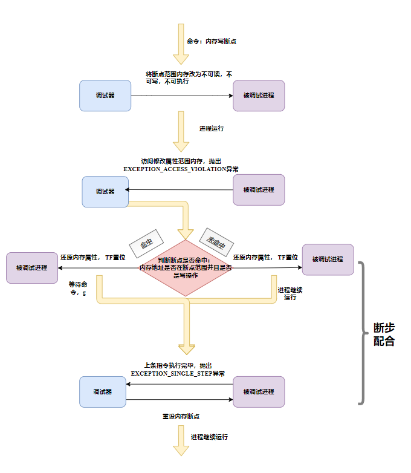
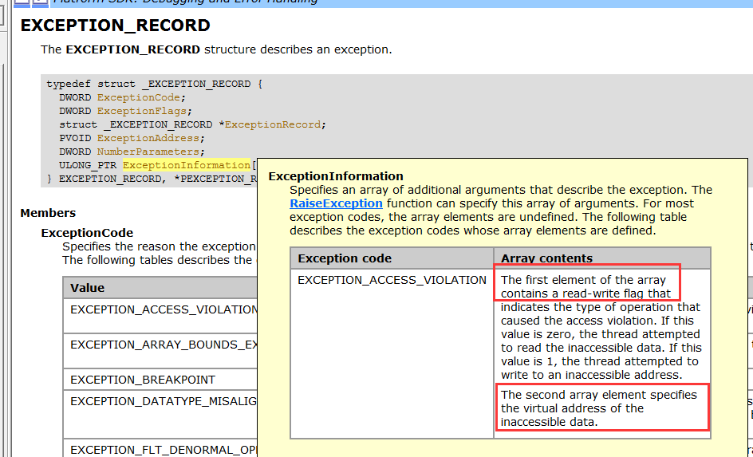
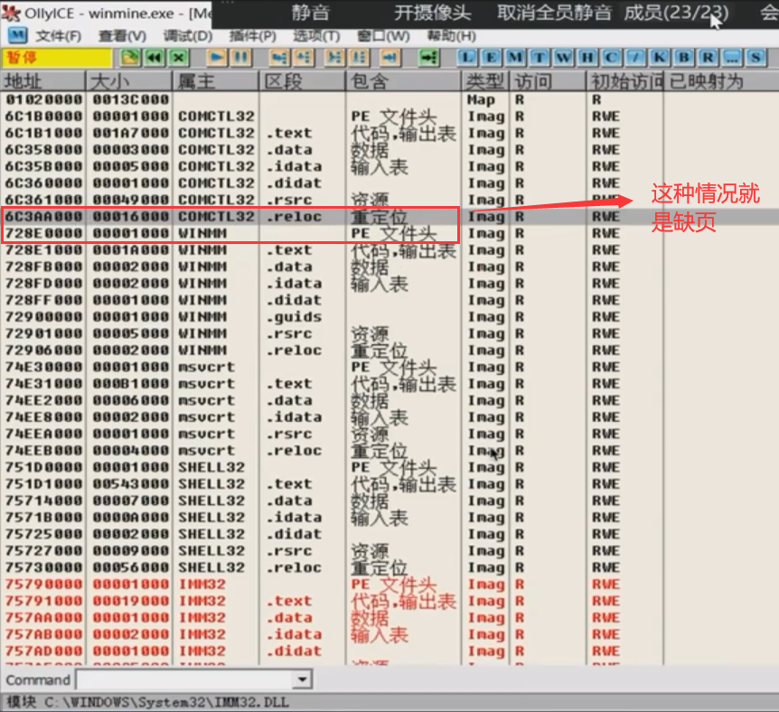

### 内存断点

1.  访问断点
2.  写入断点

#### 内存写入断点

-   **简介：**当被调试进程访问，读或写指定内存的时候，程序能够断下来。

-   **思考1：**

-   -   要想将一段内存设为内存断点，最终的目的是让其能够抛异常。调试器是基于异常的一个程序。应该如何实现呢？

​       可以通过修改内存属性，让其不能访问或读写来实现,之后会触发 c05 异常。

-   -   修改内存属性，至少修改影响一个分页，怎么办？

-   -   -   断下来后，判断不可访问地址是否为内存断点的内存范围。

​                            因为内存被改成了不可读或不可写,所以断点的指令无法执行下去,需要断步配合

-   -   -   -   范围内：断步配合，还原内存属性，执行完了后再次设置内存属性。
            -   范围外：恢复内存属性，执行，单步异常-》重新设置内存属性。


-   **思考2**：

​            如果一段内存，前4字节内存访问断点，后四字节内存写入断点，如何实现？

-   -   修改属性为不可读，不可写，不可执行，异常后，判断地址是否在范围内，再判断访问类型，是否和设置的一样。

#### 流程图



#### 代码实现

注意,并不是所有地址都适合下内存断点



内存断点实现

```
.586
.model flat,stdcall
option casemap:none

   include windows.inc
   include user32.inc
   include kernel32.inc
   include msvcrt.inc
   include udis86.inc
   
   includelib user32.lib
   includelib kernel32.lib
   includelib msvcrt.lib
   includelib libudis86.lib
   
.data
    g_szExe db "winmine.exe", 0
    g_hExe  dd 0
    g_szEXCEPTION_DEBUG_EVENT         db "EXCEPTION_DEBUG_EVENT", 0dh, 0ah, 0
    g_szCREATE_THREAD_DEBUG_EVENT     db "CREATE_THREAD_DEBUG_EVENT", 0dh, 0ah, 0
    g_szCREATE_PROCESS_DEBUG_EVENT    db "CREATE_PROCESS_DEBUG_EVENT", 0dh, 0ah, 0
    g_szEXIT_THREAD_DEBUG_EVENT       db "EXIT_THREAD_DEBUG_EVENT", 0dh, 0ah, 0
    g_szEXIT_PROCESS_DEBUG_EVENT      db "EXIT_PROCESS_DEBUG_EVENT", 0dh, 0ah, 0
    g_szLOAD_DLL_DEBUG_EVENT          db "LOAD_DLL_DEBUG_EVENT", 0dh, 0ah, 0
    g_szUNLOAD_DLL_DEBUG_EVENT        db "UNLOAD_DLL_DEBUG_EVENT", 0dh, 0ah, 0
    g_szOUTPUT_DEBUG_STRING_EVENT     db "OUTPUT_DEBUG_STRING_EVENT", 0dh, 0ah, 0
    
    g_szHardbpTip                     db "硬件访问断点", 0
    
    g_szLoadDllFmt   db "%08X %s", 0dh, 0ah, 0
    g_szwLoadDllFmt   dw '%', '0', '8', 'X', ' ', '%', 's', 0dh, 0ah, 0
    g_szBpFmt  db "CC异常 %08X", 0dh, 0ah, 0
    g_szSsFmt  db "单步异常 %08X", 0dh, 0ah, 0
    g_szOutPutAsmFmt db "%08x %-20s %-20s", 0dh, 0ah, 0
    g_szInputCmd db "选择命令：", 0dh, 0ah
                db "是:设置硬件执行断点", 0dh, 0ah
                db "否:设置硬件访问断点", 0dh, 0ah
                db "取消:直接运行", 0dh, 0ah,0
                
    
    g_btOldCode db 0
    g_dwBpAddr  dd   010026a7h 
    g_byteCC   db 0CCh
    g_szOutPutAsm db 64 dup(0)
    g_ud_obj db 1000h dup(0)
    g_bIsCCStep dd FALSE
    g_bIsStepStep dd FALSE
    g_bIsHardBpStep dd FALSE
    g_bIsResetHardBpStep dd FALSE
    
    g_dwMemAddr dd 01005360h    ;设置内存断点地址
    g_dwMemLen  dd 40h          ;设置内存断点大小
    g_dwOldProc dd 0            ;原来的内存属性
    g_bIsMemStep dd FALSE       ;是否是内存断点单步
    
   
.code  

IsCallMn  proc uses esi edi pDE:ptr DEBUG_EVENT, pdwCodeLen:DWORD
    LOCAL @dwBytesOut:DWORD
    LOCAL @dwOff:DWORD
    LOCAL @pHex:LPSTR
    LOCAL @pAsm:LPSTR
    
    mov esi, pDE
    assume esi:ptr DEBUG_EVENT
    
        ;显示下一条即将执行的指令
    invoke ReadProcessMemory, g_hExe, [esi].u.Exception.pExceptionRecord.ExceptionAddress, \
        offset g_szOutPutAsm, 20, addr @dwBytesOut
    invoke ud_init, offset g_ud_obj
    invoke ud_set_input_buffer, offset g_ud_obj, offset g_szOutPutAsm, 20
    invoke ud_set_mode, offset g_ud_obj, 32
    invoke ud_set_syntax, offset g_ud_obj, offset ud_translate_intel
    invoke ud_set_pc, offset g_ud_obj, [esi].u.Exception.pExceptionRecord.ExceptionAddress
        
    invoke ud_disassemble, offset g_ud_obj
    invoke ud_insn_off, offset g_ud_obj
    mov @dwOff, eax
    invoke ud_insn_hex, offset g_ud_obj
    mov @pHex, eax
    invoke ud_insn_asm, offset g_ud_obj
    mov @pAsm, eax
    invoke ud_insn_len, offset g_ud_obj
    mov edi, pdwCodeLen
    mov [edi], eax
    
    invoke crt_printf, offset g_szOutPutAsmFmt, @dwOff, @pHex, @pAsm
    
    mov eax, @pAsm
    .if dword ptr [eax] == 'llac'
        mov eax, TRUE
        ret        
    .endif
    
    mov eax, FALSE
    ret

IsCallMn endp

SetTF proc dwTID:DWORD
    LOCAL @hThread:HANDLE 
    LOCAL @ctx:CONTEXT
    
    invoke OpenThread, THREAD_ALL_ACCESS, FALSE, dwTID
    mov @hThread, eax
    
    mov @ctx.ContextFlags, CONTEXT_FULL
    invoke GetThreadContext, @hThread, addr @ctx
    
    or @ctx.regFlag, 100h

    invoke SetThreadContext, @hThread, addr @ctx
    invoke CloseHandle, @hThread
    
    ret

SetTF endp

DecEIP proc dwTID:DWORD
    LOCAL @hThread:HANDLE 
    LOCAL @ctx:CONTEXT
    
    invoke OpenThread, THREAD_ALL_ACCESS, FALSE, dwTID
    mov @hThread, eax
    
    mov @ctx.ContextFlags, CONTEXT_FULL
    invoke GetThreadContext, @hThread, addr @ctx
    
    dec @ctx.regEip
    
    invoke SetThreadContext, @hThread, addr @ctx
    invoke CloseHandle, @hThread
    ret

DecEIP endp

GetContext proc uses esi dwTID:DWORD, pCtx:ptr CONTEXT
    LOCAL @hThread:HANDLE 
    
    invoke OpenThread, THREAD_ALL_ACCESS, FALSE, dwTID
    mov @hThread, eax
    
    mov esi, pCtx
    assume esi:ptr CONTEXT
    
    mov [esi].ContextFlags, CONTEXT_ALL
    invoke GetThreadContext, @hThread, esi
    
    assume esi:nothing
    
    invoke CloseHandle, @hThread
    ret

GetContext endp

SetContext proc dwTID:DWORD, pCtx:ptr CONTEXT
    LOCAL @hThread:HANDLE 
    
    invoke OpenThread, THREAD_ALL_ACCESS, FALSE, dwTID
    mov @hThread, eax

    invoke SetThreadContext, @hThread, pCtx

    invoke CloseHandle, @hThread
    ret

SetContext endp

SetBp proc  
    LOCAL @dwBytesOut:DWORD  
    
    ;保存原来的指令， 在 01001BCF写入CC
    invoke ReadProcessMemory, g_hExe, g_dwBpAddr, offset g_btOldCode, size g_btOldCode, addr @dwBytesOut
    invoke WriteProcessMemory, g_hExe,  g_dwBpAddr, offset g_byteCC, size g_byteCC, addr @dwBytesOut
    
    ret

SetBp endp

InputCmd proc uses esi pDE:ptr DEBUG_EVENT 
    LOCAL @bIsCall:BOOL
    LOCAL @dwCodeLen:DWORD
    LOCAL @ctx:CONTEXT

    mov esi, pDE
    assume esi:ptr DEBUG_EVENT
    
    invoke IsCallMn, pDE, addr @dwCodeLen
    mov @bIsCall, eax
    invoke MessageBox, NULL, offset g_szInputCmd, NULL, MB_YESNO
    .if eax == IDYES
   
        ;设置内存访问断点(修改内存属性即可)
        invoke VirtualProtectEx, g_hExe, g_dwMemAddr, g_dwMemLen, PAGE_NOACCESS, offset g_dwOldProc
    .else
        ;直接运行
        
    .endif
    ret

InputCmd endp

OnException proc uses esi pDE:ptr DEBUG_EVENT 
    LOCAL @dwBytesOut:DWORD  
    LOCAL @ctx:CONTEXT
    LOCAL @dwInacessAddr:DWORD  ;不可访问的地址
    LOCAL @dwFlag:DWORD         ;不可访问的操作(0读或1写)
    LOCAL @dwOldproc:DWORD
    
    mov esi, pDE
    assume esi:ptr DEBUG_EVENT
    
    .if [esi].u.Exception.pExceptionRecord.ExceptionCode == EXCEPTION_BREAKPOINT
        ;判断是否是自己的CC
        mov eax, [esi].u.Exception.pExceptionRecord.ExceptionAddress
        .if eax != g_dwBpAddr
            ;不是自己的CC异常，不处理
            mov eax, DBG_EXCEPTION_NOT_HANDLED 
            ret
        .endif
    
        ;处理自己的CC异常
        invoke crt_printf, offset g_szBpFmt, [esi].u.Exception.pExceptionRecord.ExceptionAddress
        
        ;恢复指令
        invoke WriteProcessMemory, g_hExe, g_dwBpAddr, offset g_btOldCode, size g_btOldCode, addr @dwBytesOut 
        
        ;设置单步
        invoke SetTF, [esi].dwThreadId
        invoke DecEIP, [esi].dwThreadId
        
        ;单步中需要处理CC的单步
        mov g_bIsCCStep,  TRUE
        
        ;输入命令
        invoke InputCmd, pDE
        
        mov eax, DBG_CONTINUE
        ret
    .endif
    
    
    ;c05异常   EXCEPTION_ACCESS_VIOLATION
    .if [esi].u.Exception.pExceptionRecord.ExceptionCode == EXCEPTION_ACCESS_VIOLATION
        ;判断是否命中内存断点
       
        ;获取读写标志 (0写 1读)
        mov eax, [esi].u.Exception.pExceptionRecord.ExceptionInformation[0]
        mov @dwFlag, eax
        
        ;不可访问的数据地址  加4是因为操作占四个字节
        mov eax, [esi].u.Exception.pExceptionRecord.ExceptionInformation[4]
        mov @dwInacessAddr, eax
        
        ;判断地址范围
        .if @dwInacessAddr > 01005360h && @dwInacessAddr < 01005360h + 40h && @dwFlag == 1
            ;命中,等待输入命令
            invoke InputCmd, pDE
        .endif
        
        ;还原内存属性
        invoke VirtualProtectEx, g_hExe, g_dwMemAddr, g_dwMemLen, g_dwOldProc,  addr @dwOldproc 
        ;TF置位
        invoke SetTF, [esi].dwThreadId
        ;标志置位
        mov g_bIsMemStep, TRUE
        
        mov eax, DBG_CONTINUE
        ret
    .endif
    
    ;单步来了
    .if [esi].u.Exception.pExceptionRecord.ExceptionCode == EXCEPTION_SINGLE_STEP
    
        ;处理自己的单步
        invoke GetContext, [esi].dwThreadId, addr @ctx
        invoke crt_printf, offset g_szSsFmt, @ctx.regEip

        ;处理CC的单步
        .if g_bIsCCStep == TRUE
            mov g_bIsCCStep, FALSE
            
            ;重设断点, 重新写入CC
            ;invoke WriteProcessMemory, g_hExe,  g_dwBpAddr, offset g_byteCC, size g_byteCC, addr @dwBytesOut
            
            mov eax, DBG_CONTINUE
            ret
        .endif
        
        ;内存的单步
        .if g_bIsMemStep == TRUE
            mov g_bIsMemStep, FALSE
            
            ;重设内存断点
            invoke VirtualProtectEx, g_hExe, g_dwMemAddr, g_dwMemLen, PAGE_NOACCESS,  addr @dwOldproc 
        .endif
        
        mov eax, DBG_CONTINUE
        ret
    .endif
    
    assume esi:nothing
    
    mov eax, DBG_EXCEPTION_NOT_HANDLED 
    ret

OnException endp

OnCreateProcess proc 

    ;保存原来的指令， 在 01001BCF写入CC
    invoke SetBp
    
    ret

OnCreateProcess endp


main proc
    LOCAL @si:STARTUPINFO
    LOCAL @pi:PROCESS_INFORMATION
    LOCAL @de:DEBUG_EVENT 
    LOCAL @dwStatus:DWORD
    
    invoke RtlZeroMemory, addr @si, size @si
    invoke RtlZeroMemory, addr @pi, size @pi
    invoke RtlZeroMemory, addr @de, size @de
    
    mov @dwStatus, DBG_CONTINUE
    ;建立调试会话
    invoke CreateProcess, NULL, offset g_szExe, NULL, NULL, FALSE, \
        DEBUG_ONLY_THIS_PROCESS,\
        NULL, NULL,\
        addr @si,\
        addr @pi
    .if !eax
        ret
    .endif 
    mov eax, @pi.hProcess
    mov g_hExe, eax
    
    ;循环接受调试事件
    .while TRUE
        invoke WaitForDebugEvent, addr @de, INFINITE
        
        ;处理调试事件
        .if @de.dwDebugEventCode == EXCEPTION_DEBUG_EVENT
            ;invoke crt_printf, offset g_szEXCEPTION_DEBUG_EVENT
            invoke OnException, addr @de
            mov @dwStatus, eax
        .elseif @de.dwDebugEventCode == CREATE_THREAD_DEBUG_EVENT
            invoke crt_printf, offset g_szCREATE_THREAD_DEBUG_EVENT
        .elseif @de.dwDebugEventCode == CREATE_PROCESS_DEBUG_EVENT
            ;invoke crt_printf, offset g_szCREATE_PROCESS_DEBUG_EVENT
            invoke OnCreateProcess
        .elseif @de.dwDebugEventCode == EXIT_THREAD_DEBUG_EVENT
            invoke crt_printf, offset g_szEXIT_THREAD_DEBUG_EVENT
        .elseif @de.dwDebugEventCode == EXIT_PROCESS_DEBUG_EVENT
            invoke crt_printf, offset g_szEXIT_PROCESS_DEBUG_EVENT
        .elseif @de.dwDebugEventCode == LOAD_DLL_DEBUG_EVENT
            ;invoke OnLoadDll, addr @de
        .elseif @de.dwDebugEventCode == UNLOAD_DLL_DEBUG_EVENT
            invoke crt_printf, offset g_szUNLOAD_DLL_DEBUG_EVENT
        .elseif @de.dwDebugEventCode == OUTPUT_DEBUG_STRING_EVENT
            invoke crt_printf, offset g_szOUTPUT_DEBUG_STRING_EVENT
        .endif
        
        ;提交事件处理结果
        invoke ContinueDebugEvent, @de.dwProcessId, @de.dwThreadId, @dwStatus
        invoke RtlZeroMemory, addr @de, size @de
    .endw
    
    ret

main endp

start:
    invoke main 
end start
   
   
```

### 注意

#### 调试器添加内存断点功能，需要注意的细节部分

##### ① 分页，缺页

当内存断点需要支持多个，会面临很多问题

###### Ⅰ分页

-   内存断点的范围是可以指定的，内存断点（范围）就会可能比较长，如果内存断点跨分页，比如是这个分页的末尾到下一个分页的开始
-   跨分页带来的危险：会引发缺页问题

###### Ⅱ 缺页

**缺页**指的是当软件试图访问已映射在虚拟地址空间中，但是并未被加载在物理内存中的一个分页时，由中央处理器的内存管理单元所发出的中断。

**缺页中断**就是要访问的页不在主存，需要操作系统将其调入主存后再进行访问。在这个时候，被内存映射的文件实际上成了一个分页交换文件。



###### Ⅲ 缺页如何解决

-   我们的解决是不让他在缺页处下断点

###### Ⅳ 如何检查是否缺页

**NtQueryVirtualMemory**
	NtQueryVirtualMemory是windows的一个未公开[API](https://so.csdn.net/so/search?q=API&spm=1001.2101.3001.7020)（导出但未形成文档），他的作用主要是查询指定进程的某个虚拟地址控件所在的内存对象的一些信息。**我们可以通过这个api看有没有缺页！**

原型（prototype）：

```
NTSTATUS NTAPI NtQueryVirtualMemory(
          IN HANDLE               	ProcessHandle,     			//目标进程句柄
          IN PVOID                	BaseAddress,     			//目标内存地址
          IN MEMORY_INFORMATION_CLASS 	MemoryInformationClass, //查询内存信息的类别
          OUT PVOID               	Buffer,       				//用于存储获取到的内存信息的结构地址
          IN ULONG                	Length,       				//Buffer的最大长度
          OUT PULONG              	ResultLength OPTIONAL); 	//存储该函数处理返回的信息的长度的ULONG的地址 
```

第一个参数是目标进程的句柄，第二个参数是要查询的[内存](https://so.csdn.net/so/search?q=内存&spm=1001.2101.3001.7020)地址，第五个和第六个参数为Buffer长度，和函数处理结果返回的长度。

第三个参数类型MEMORY_INFORMATION_CLASS是一个枚举类型其定义如下：

```
//MEMORY_INFORMATION_CLASS定义
typedef enum _MEMORY_INFORMATION_CLASS
{
 MemoryBasicInformation,     		//内存基本信息
 MemoryWorkingSetInformation,   	//工作集信息
 MemoryMappedFilenameInformation   	//内存映射文件名信息
} MEMORY_INFORMATION_CLASS;
```

第四个参数是根据第三个参数选用不同的结构去接收内存信息的地址。

其对应关系如下：

0x00：使用MemoryBasicInformation时，Buffer应当指向的结构为MEMORY_BASIC_INFORMATION，其定义如下：

```
typedef struct _MEMORY_BASIC_INFORMATION {
    PVOID 		BaseAddress;
    PVOID 		AllocationBase;
    DWORD 		AllocationProtect;
    SIZE_T 		RegionSize;
    DWORD 		State;
    DWORD 		Protect;
    DWORD 		Type;
} MEMORY_BASIC_INFORMATION, *PMEMORY_BASIC_INFORMATION;
```

0x01：使用MemoryWorkingSetInformation时，Buffer应当指向的结构为MEMORY_WORKING_SET_INFORMATION，其定义如下：

```
typedef struct _MEMORY_WORKING_SET_INFORMATION {
	ULONG		SizeOfWorkingSet;
	DWORD		WsEntries[ANYSIZE_ARRAY];
} MEMORY_WORKING_SET_INFORMATION, *PMEMORY_WORKING_SET_INFORMATION;
```

0x02：当使用MemoryMappedFilenameInformation  时，Buffer应当指向结构为MEMORY_MAPPED_FILE_NAME_INFORMATION，其定义如下：

```
#define _MAX_OBJECT_NAME 1024/sizeof(WCHAR)
typedef struct _MEMORY_MAPPED_FILE_NAME_INFORMATION {
 UNICODE_STRING Name;
 WCHAR     Buffer[_MAX_OBJECT_NAME];
} MEMORY_MAPPED_FILE_NAME_INFORMATION, *PMEMORY_MAPPED_FILE_NAME_INFORMATION; 
```

第一种和第二种没有太多需要解释的地方，至于第三种的MEMORY_MAPPED_FILE_NAME_INFORMATION的定义形式需要说明一下，第三种使用方法目前资料很少，我看多资料都是直接直接传了个数组进去，然后很多人就发表评论说为什么要传那个长度呢？为什么不可以传这个长度呢？无人回答……那好我们自己来找找标准用法吧。

##### ② 两个断点导致的问题：


###### Ⅰ解决方式：

-   不让他输入进来

###### Ⅱ 内存的恢复就需要谨慎

-   比如第一个断点设上之后，要修改内存属性，如果此时在这个内存分页中再添加一个内存断点，你保存的内存属性，就是改过之后的内存属性

###### Ⅲ 建三张表

-   内存、分页、断点三者之间的数据关