思路：阳光最开始固定是50，所以可以先搜50，等阳光产生变化以后再搜索新的数值，搜几次应该就能找到动态地址了


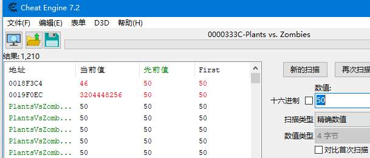

种了一颗向日葵后，阳光是0了


那就继续搜索0

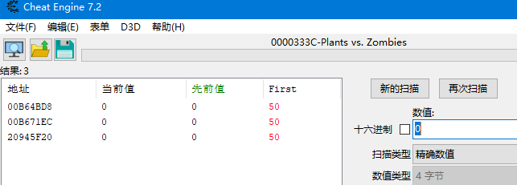

还有3个，其实直接把这3个改成不同的值应该就找到了，但是为了防止改到不该改的地方导致游戏崩溃，还是等阳光变动再搜一次吧

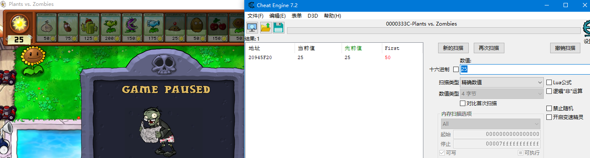

现在100%确定就是这个了~双击这个地址，加入到观察区，我们修改一下

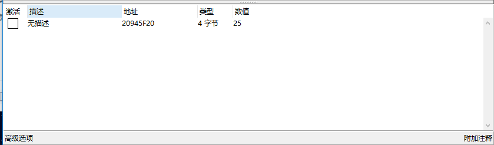

可以看出来，修改是完全OK的

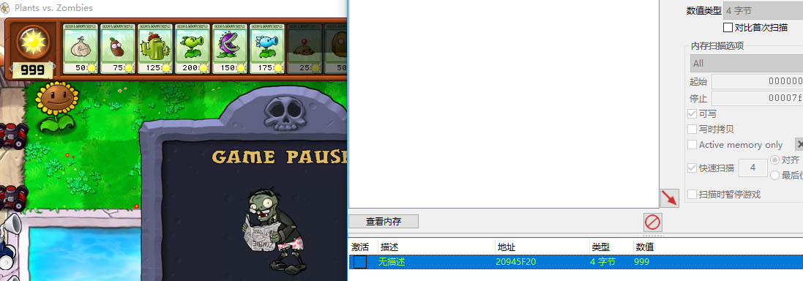

但是。。这样就好了么？程序对变量的地址是随机分配的，我们虽然找到了这个变量地址，但是如果游戏重启，或者重新开始，变量地址就有可能会发生变化，不信重启游戏试试

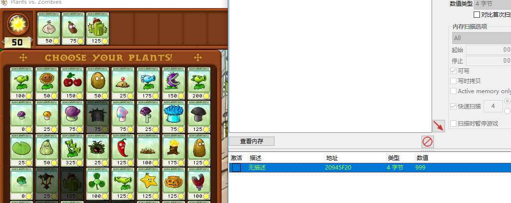

哦豁，果然已经不行了

那怎么办呢~

每次都找？那我们写的辅助还有什么用。。。

虽然变量地址每次都变，但是程序都能找到他，说明什么？说明程序里面肯定存了一个东西，每次都能找到这个变量，这个东西就是所谓的基址+偏移，所谓的基址就是，程序运行起来以后，加载进内存，肯定有部分地址要固定起来，比如起始地址(其实不固定也没关系，程序知道从哪里找到这个起始地址就行了)，这部分不变的就是基址，变量相对某个基址的偏移肯定也是不会变的(除非游戏更新)因为一直乱变的话程序自己也会找不到这个地址。

既然是这样，那先找到上面的存储阳光的变量地址，然后再找出基址吧~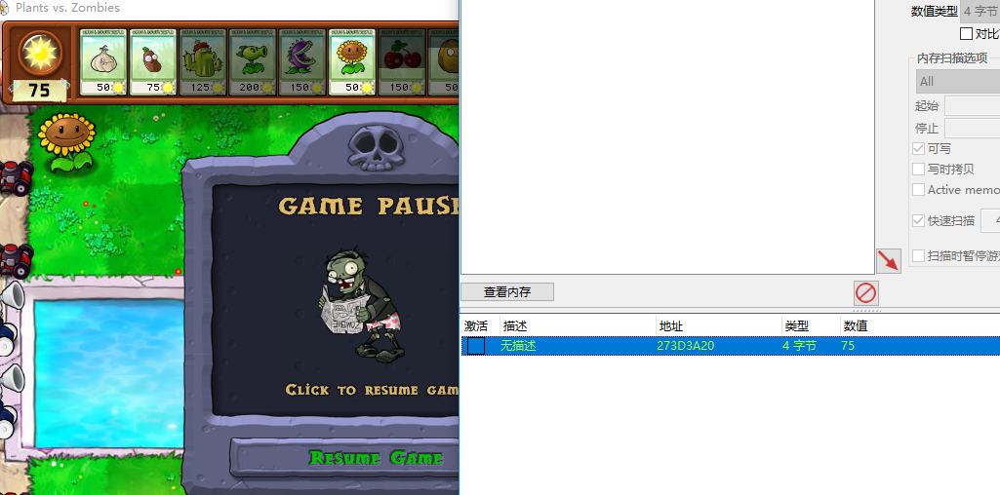

经过扫描，已经找到这个地址了，那要怎么找到基址呢？

按理来讲，阳光变化的时候肯定要改写这个变量吧~根据这个思路，那么下个写入断点应该就能找到关键地方了，试一下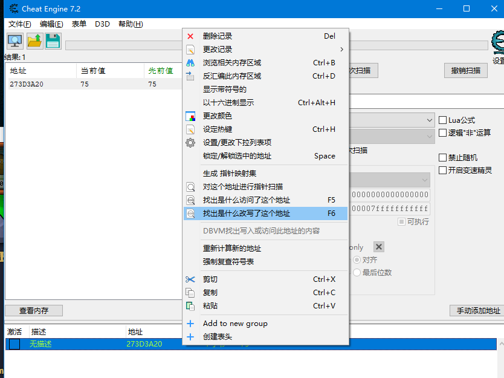

在这个地址(下面的观察窗口)上右键，选择找出是什么改写了这个地址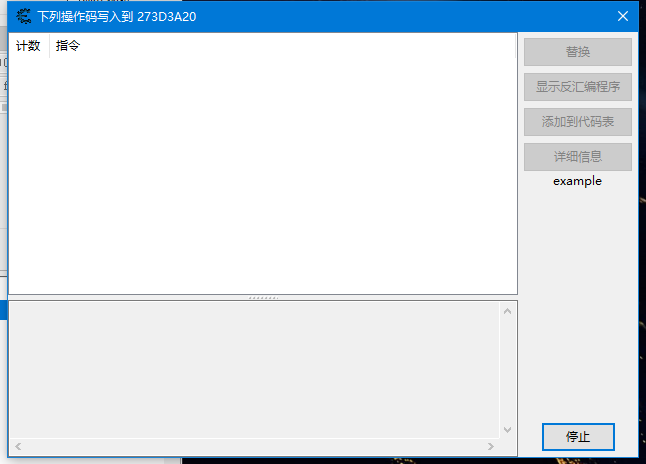

弹出了一个窗口，但是什么都没有，什么都没有是因为阳光还没有发生变动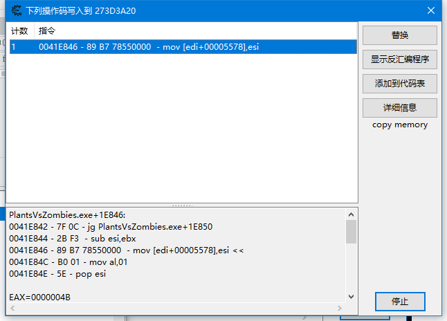

阳光发生变动的时候可以看到，产生了一句mov代码，毫无疑问，esi肯定存的是当前阳光，要写入到edi+0x5578里面，那么0x5578就是它个其中一个偏移了，现在要看看edi里面存的东西在不在基址里面，点一下详细信息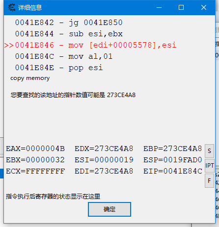

它提示我们要找到的指针可能是0x273ce4a8 看下面的寄存器，EDI确实是0x273ce4a8，那我们去CE里面搜一下0x273ce4a8

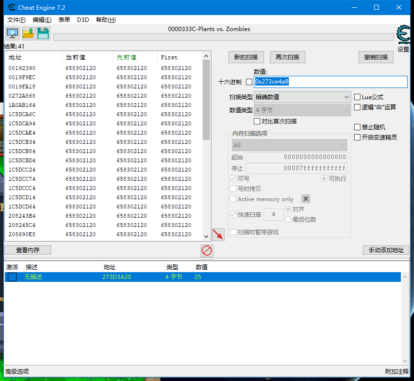

搜出N个，但是没有绿色的(CE中基址是绿色的哦~)

那是不是41个都要去看一下呢，当然是可以的，但是根据经验，一般我们挑几个地址变化较大的丢到内存观察窗口下访问断点看一下

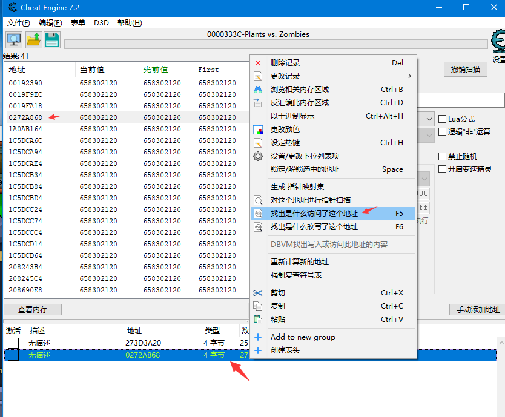

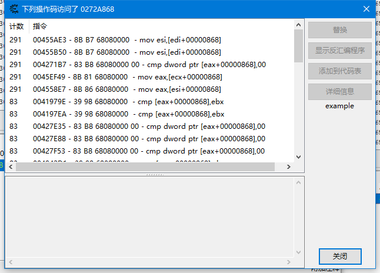

有一堆的访问，随便挑一个看一下，先看第一个

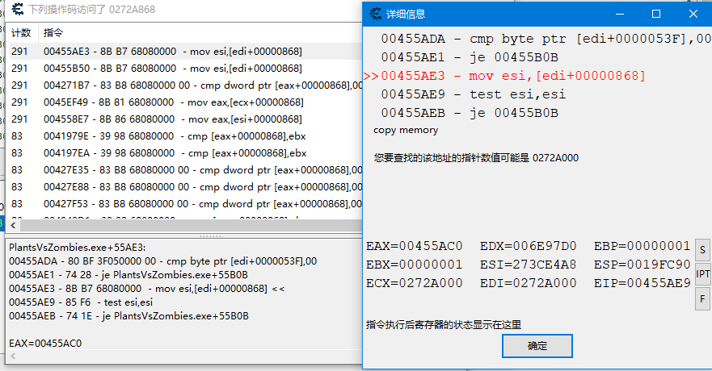

它提示可能得指针是0272A000，那就继续搜一下0272A000

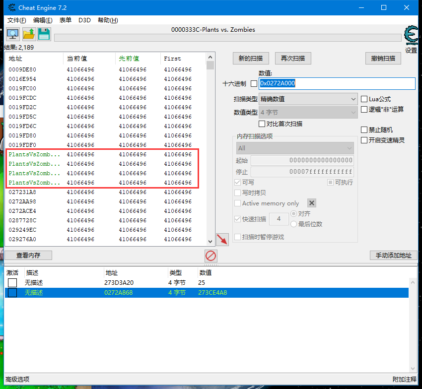

有4个基址，既然有4个，那就说明已经找到了，我们都拉下来，然后再CE里面验证一下

点一下CE右下角的手动添加地址

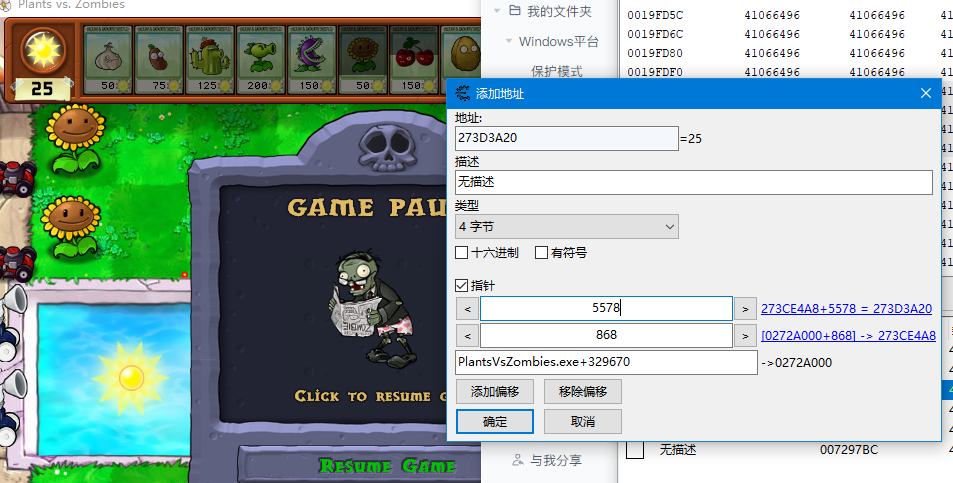

可以看到是对的

解释一下

PlantsVsZombies.exe+329670是基址，也就是PlantsVsZombies.exe这个模块首地址加上0x329670，然后刚刚我们找到一个偏移是0x868 所以要加上偏移868，然后第二层偏移是5578，因为我们是反向找到的，阳光变量=[[基址]+868]+5578 所以我们找到的第一层基址其实在最后面

好了，现在基址也有了，偏移也有了，就可以写代码来改阳光了

```c++
//[[[基址]+868]+5578]里面存的是阳光
    DWORD dwAddr = -1;
    //m_dwBase==PlantsVsZombies.exe+329670 ==00729670
    ReadProcessMemory(m_hGameProcess, (LPVOID)m_dwBase, &dwAddr, sizeof(DWORD), NULL);//0275A280
    //+x868
    dwAddr += OFFSET_BASE_OFFSET1;
    ReadProcessMemory(m_hGameProcess, (LPVOID)dwAddr, &dwAddr,sizeof(DWORD), NULL);//0275A280
    //+5578
    dwAddr += OFFSET_SUN_OFFSET1;
    
    //ReadProcessMemory(hGameProcess, (LPVOID)dwAddr, &dwValue, sizeof(DWORD), NULL);//0275A280

    WriteProcessMemory(m_hGameProcess, (LPVOID)dwAddr, &m_dwSunNum, sizeof(DWORD), NULL);
```

上面代码的m_dwBase是通过遍历进程获取PlantsVsZombies.exe然后加上偏移得到的

GetMoudleBaseAddr(_T("PlantsVsZombies.exe"), _T("PlantsVsZombies.exe"), m_dwBase);

m_dwBase += OFFSET_BASEADDR;//OFFSET_BASEADDR==0x329670 

```c++
//获取指定进程的指定模块的基址 并返回进程ID
DWORD GetMoudleBaseAddr(const TCHAR* szProcess, const TCHAR* szMoudleName, DWORD& dwMoudleBase)
{
    HANDLE hProcessSnap = CreateToolhelp32Snapshot(TH32CS_SNAPPROCESS, 0);
    PROCESSENTRY32 pi = { sizeof(PROCESSENTRY32) };

    //遍历进程
    while (Process32Next(hProcessSnap,&pi))
    {
        if (_tcsicmp(szProcess,pi.szExeFile) !=0)
        {
            continue;
        }
        

        HANDLE hMoudleSnap = ::CreateToolhelp32Snapshot(TH32CS_SNAPMODULE, pi.th32ProcessID);
        MODULEENTRY32 me32 = { sizeof(MODULEENTRY32) };
       
        while (::Module32Next(hMoudleSnap, &me32))
        {
            if (_tcsicmp(szMoudleName, me32.szModule) == 0)
            {
                dwMoudleBase = (DWORD)me32.modBaseAddr;
                break;
            }
        }
        break;
    }
    return pi.th32ProcessID;
}
```

