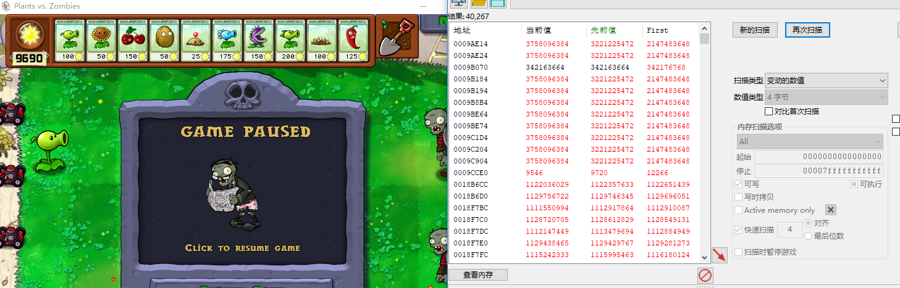
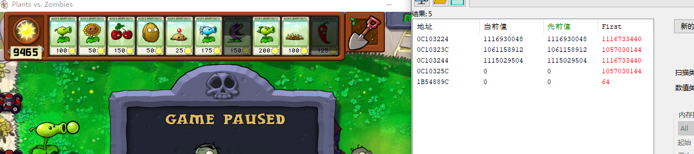
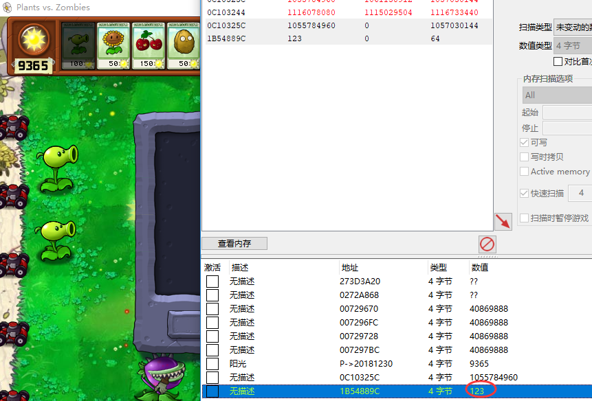
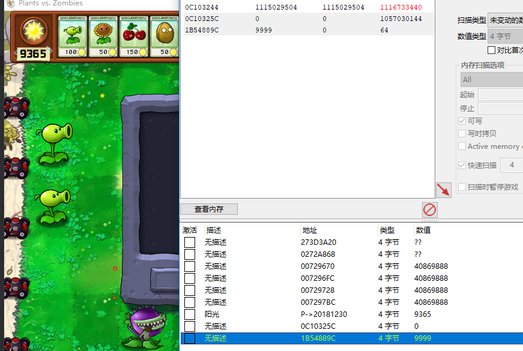
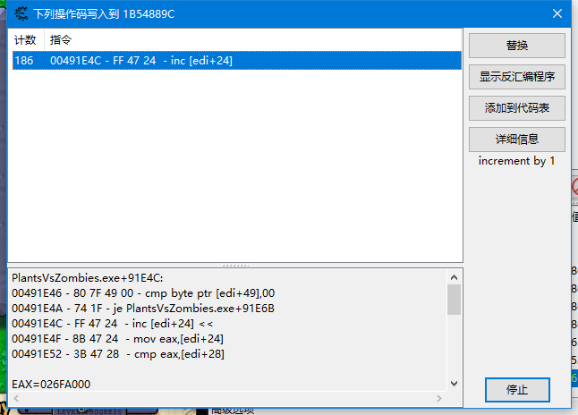
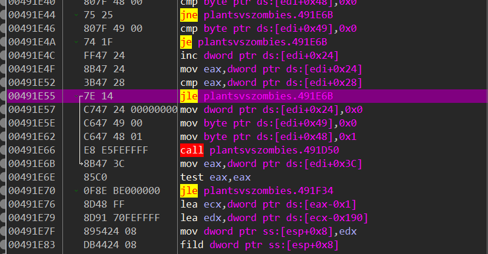
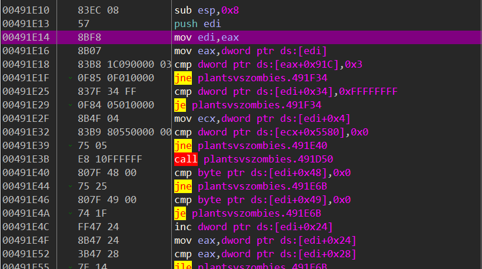
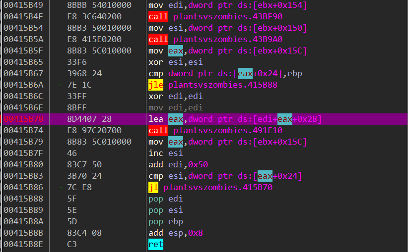
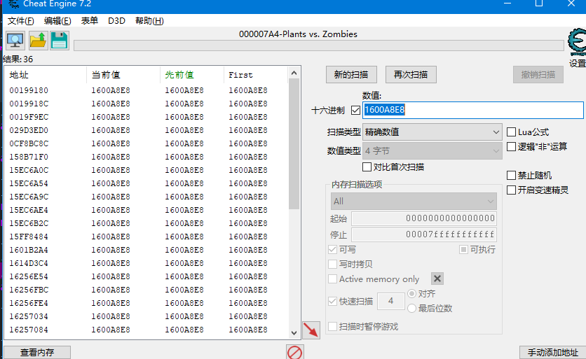
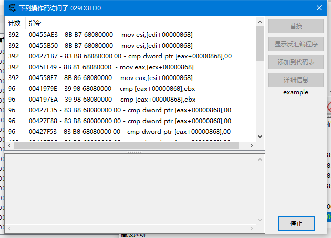

思路：每个植物种植下去以后只有过了一段CD以后才能继续种植，说明内部应该是有个控制时间的变量，所以先搜索未知的初始值，种植以后不断变动的值，应该就能过滤出来了。

种植以后立马搜未知的初始值，然后走一段时间CD搜变动的

经过几轮搜索后 植物CD好了，还有一堆数值



（植物CD好了肯定要搜一次变动，接着不要种植，多搜几次未变动，然后种植点其他植物搜未变动）

经过几轮搜索减少的数值以后，发现一个可疑的数值



玩了几次后，有2个数值是0的比较可疑，拉到观察区看一下再说


种了一个豌豆射手后，1B54889C这个地址的数值一直在增加



当我给他改成9999以后 立马就可以种植了



这说明，这个地址就是控制豌豆射手的CD的，当打到一定的程度，就能种植了，我们对这个地址下个断点，看看是什么情况



确实在不断调用inc，还是去x64dbg里面看一下这代码吧

```
PlantsVsZombies.exe+91E4C:
00491E46 - 80 7F 49 00 - cmp byte ptr [edi+49],00
00491E4A - 74 1F - je PlantsVsZombies.exe+91E6B
00491E4C - FF 47 24  - inc [edi+24] <<
00491E4F - 8B 47 24  - mov eax,[edi+24]
00491E52 - 3B 47 28  - cmp eax,[edi+28]
```



```
inc dword ptr ds:[edi+0x24]
mov eax,dword ptr ds:[edi+0x24]
cmp eax,dword ptr ds:[edi+0x28]
jle plantsvszombies.491E6B
```

这段代码应该就是 先增加CD，然后把增加后的cd取出来放在eax里面，再出去edi+0x28的值比较两个值决定是否要跳转(小于就跳转)，所以把inc dword ptr ds:[edi+0x24]改成mov eax,esp 或者jle改成nop或者je就可以实现无CD了

上面的代码既然[edi+0x24]是当前CD，[edi+0x28]是CD最大值，那我们只要遍历每个植物，把0x24这个位置的值改成跟0x28一样，应该也可以实现每个植物无CD了。既然遍历，那就需要知道edi的基址，我们看一下EDI的来源



发现是来自eax，eax来自上一层，去上一层看一下



lea eax, ds:[edi+eax*1+0x28]这句代码下了几次断点发现，edi的值每次都是增加0x50可能是因为每个植物存储都是0x50个字节吧，eax是来自上面的mov eax, dword ptr ds:[ebx+0x15C]，现在就要接着找ebx的来源了

发现ebx来源不是很好跟，因为代码分支比较多，也没看到赋值的地方，可能是来自上一层 要从函数头部跟一下才确定，这里就用简单的方法了，这里断下来后，直接去CE搜索，看能不能找到来源



对029d3ed0这个地址下访问断



发现是868这个偏移。。跟阳光一样，在继续找就会找到阳光的基址

遍历每个植物CD的代码

```C++
DWORD dwAddr = -1;
        ReadProcessMemory(m_hGameProcess, (LPVOID)m_dwBase, &dwAddr, sizeof(DWORD), NULL);//
        //+x868
        dwAddr += OFFSET_BASE_OFFSET1;
        ReadProcessMemory(m_hGameProcess, (LPVOID)dwAddr, &dwAddr, sizeof(DWORD), NULL);//
        //0x15c
        dwAddr += OFFSET_CD_OFFSET1;
        ReadProcessMemory(m_hGameProcess, (LPVOID)dwAddr, &dwAddr, sizeof(DWORD), NULL);//
        for (int i = 0; i < 10; i++)
        {
            DWORD dwTmp = dwAddr + i * 0x50 + 0x28;

            DWORD dwCurCdaddr = dwTmp + 0x24;//当前CD的地址
            DWORD dwMaxCdaddr = dwTmp + 0x28;//最大CD的地址

            DWORD dwCurCdValue = -1;//当前CD值
            DWORD dwMaxCdValue = -1;//最大CD值

            ReadProcessMemory(m_hGameProcess, (LPVOID)dwCurCdaddr, &dwCurCdValue, sizeof(DWORD), NULL);//读取当前CD
            ReadProcessMemory(m_hGameProcess, (LPVOID)dwMaxCdaddr, &dwMaxCdValue, sizeof(DWORD), NULL);//读取最大CD

            if (dwCurCdValue != dwMaxCdValue)
            {
                WriteProcessMemory(m_hGameProcess, (LPVOID)dwCurCdaddr, &dwMaxCdValue, sizeof(DWORD), NULL);
            }
        }
    }
```

