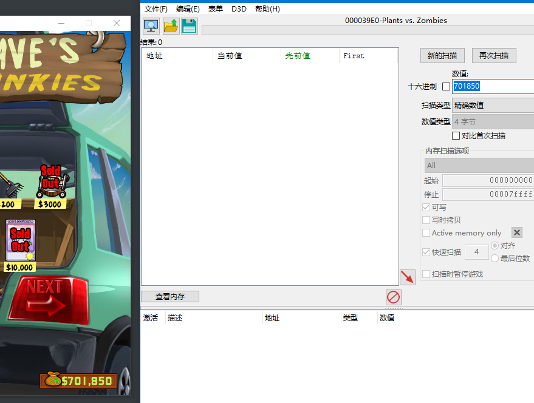
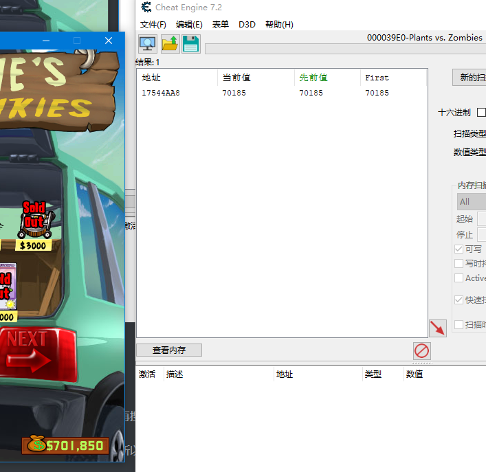
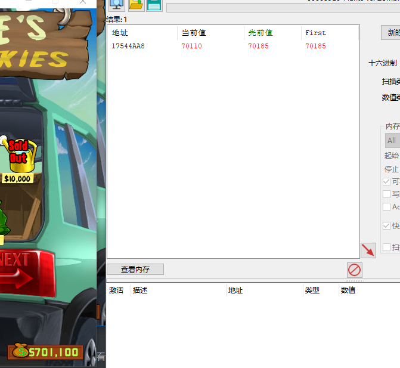
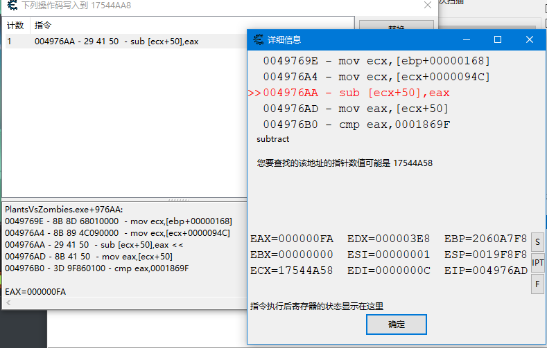
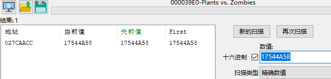
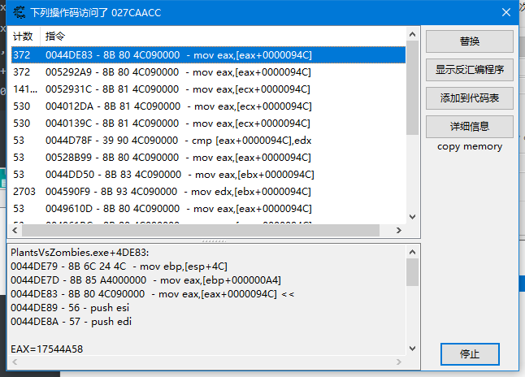
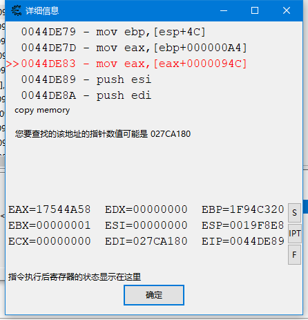
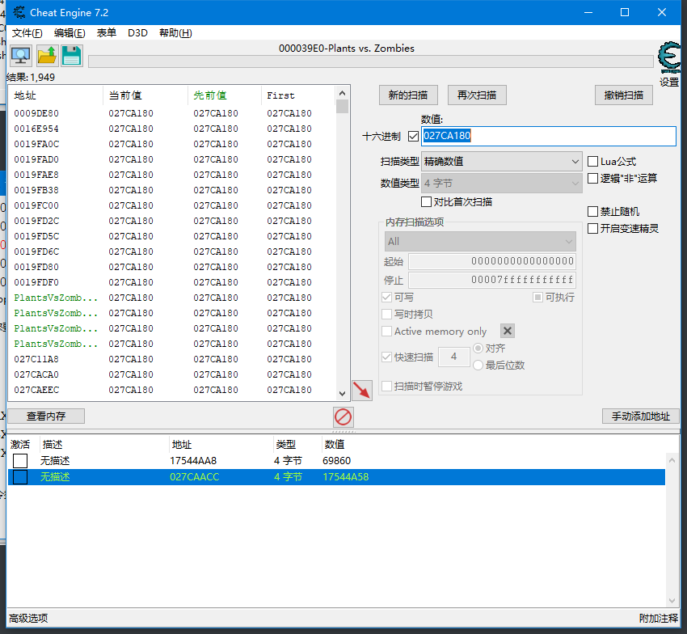

思路：通过搜索金币数量 然后购买物品找到金币的地址



可以看到，一个都没有搜出来


思路2：通过搜未知的初始值，然后不断的买东西，再搜减少的数值

思路3：有的游戏金币数跟现实一样的，存在单位，所以我们直接搜701850可能搜不到，需要搜70185



可以看到，现在确实有一个，我们随便买个的东西，看他会不会变



变了，说明这就是金币的地址，现在我们看看他的基址



```
PlantsVsZombies.exe+976AA:
0049769E - 8B 8D 68010000  - mov ecx,[ebp+00000168]
004976A4 - 8B 89 4C090000  - mov ecx,[ecx+0000094C]
004976AA - 29 41 50  - sub [ecx+50],eax <<
004976AD - 8B 41 50  - mov eax,[ecx+50]
004976B0 - 3D 9F860100 - cmp eax,0001869F
```

我们需要继续查找的地址是 17544A58



只找出一个，继续下访问断点



有很多，我们随便找一个看看



继续找027CA180



已经出现基址了，至此，金币的基址已经找到~