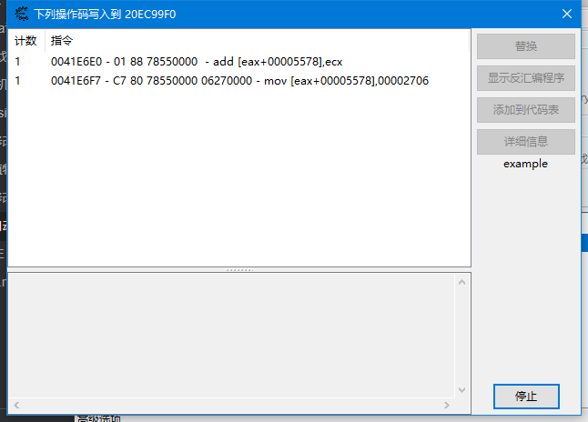
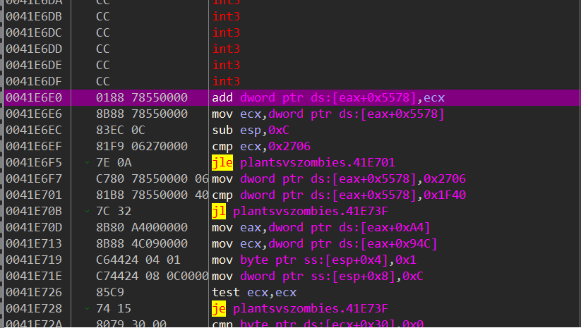
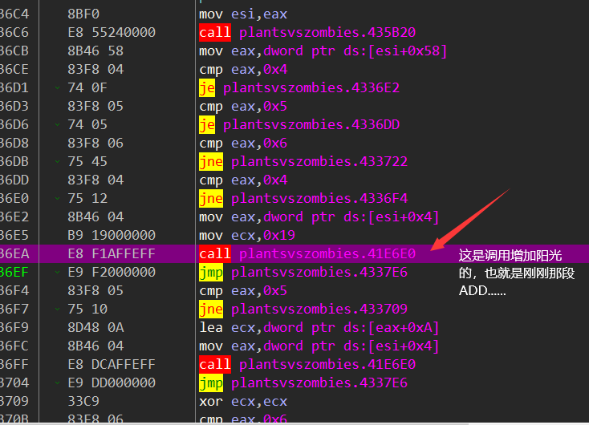
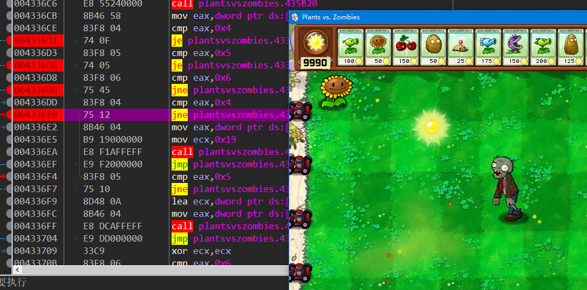
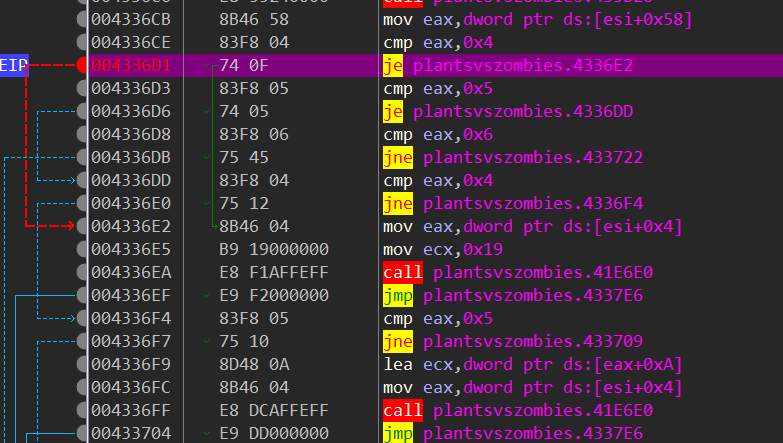
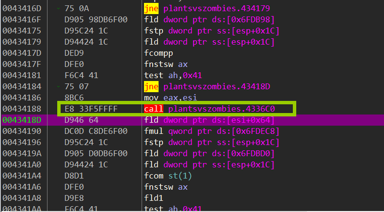
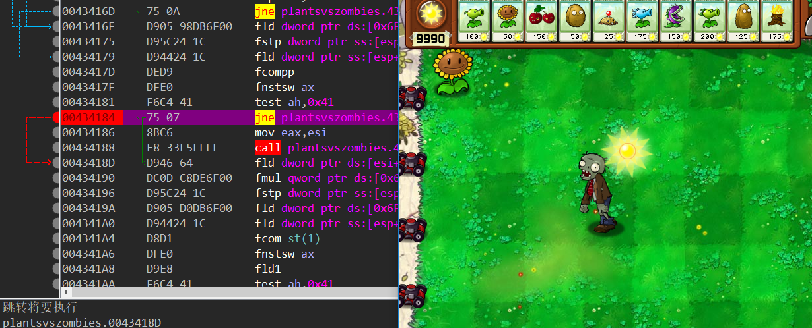
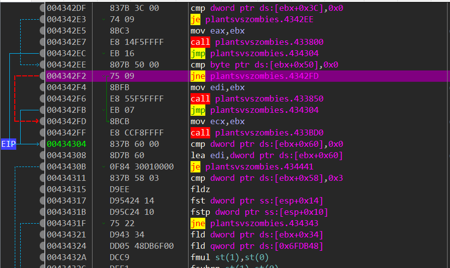
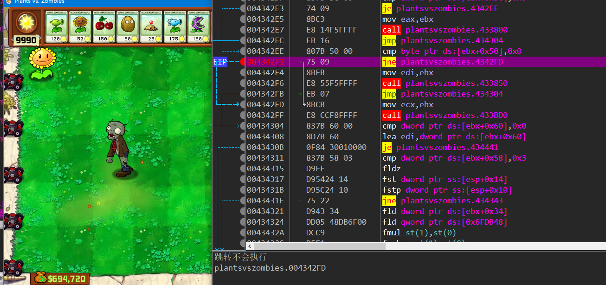
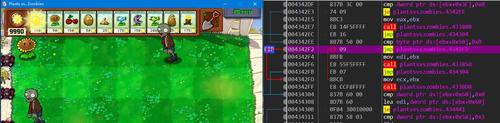

思路：阳光掉落我们拾取或者不拾取应该有个状态，而且我们拾取阳光的时候也会改变阳光数值，所以我们对存储阳光数值的地址下一个写入断点应该就能找到拾取的call



我们下好断点，拾取阳光的时候产生了两句代码，根据代码来看，add...这一句应该就是拾取阳光的时候的代码

```assembly
PlantsVsZombies.exe+1E6E0:
0041E6DE - CC - int 3 
0041E6DF - CC - int 3 
0041E6E0 - 01 88 78550000  - add [eax+00005578],ecx <<
0041E6E6 - 8B 88 78550000  - mov ecx,[eax+00005578]
0041E6EC - 83 EC 0C - sub esp,0C

EAX=20EC4478
EBX=00000001
ECX=00000019
EDX=D5AF0008
ESI=272CA150
EDI=20EC4478
EBP=0019F9A8
ESP=0019F92C
EIP=0041E6E6
```

我们用调试器附加看看0041E6E0这段代码



这段代码看起来就是像已经点了阳光，然后调用它来增加阳光，根据对这段代码(add....)下段观察，发现是我点了阳光，需要增加的时候才会断下来，也就是说这仅仅是增加阳光，而不是点击，我们跳转到上面一层看看

那会不会这个call上面的几个跳转是跳过阳光拾取的地方呢？假设这几个跳转是用来断点是否点了阳光，如果点了就增加，那么我们在上面几个跳转下断点的话，在有阳光的时候肯定会一直断下来，然后跳过增加阳光

可以看到的是，有阳光落下的时候这几个断点并没有断下来，那就说明判断应该还在上一层或者几层，我们再去上一层看一下

当我拾取阳光的时候，这一层确实断下来了，现在CTRL+F9运行到返回，然后再F8运行到上一层

这一层调用call之前也有个判断，现在判断这里下个断点试试

有阳光的时候没有断，因为我的猜测是阳光落下的时候游戏在检测是否点击了，如果点击了就调用增加阳光的call 如果没有点击就跳转，既然它没有断，那就再去上一层看看，

这一层的call看起来就跟我猜测的有点像了，call之前有个jmp 应该是判断没有被点击就跳过去，点击了就进入增加阳光，我们在jne下个点断试试



下了这个断点以后发现，在即将产生阳光的时候和屏幕上有阳光没有拾取的时候这个判断会一直执行，没有阳光的时候这个判断不会执行，那就说明这个判断可能就是判断是否有点击，根据单步发现，如果我不点击阳光的话最终会执行到


这一句正好是跳过了我们增加阳光的call 如果我点击了阳光的话，jne这个跳转就跳转到了增加阳光call的调用，我们试试把jne改成jmp 看看能不能自动拾取阳光

改成jmp后确实阳光一产生就自动拾取了

所以我们只要写一段代码，将植物大战僵尸进程地址0x004342f2由原来的75 09改成 e8 09（jne改jmp）或者把jne改成je即可实现阳光掉落以后自动拾取