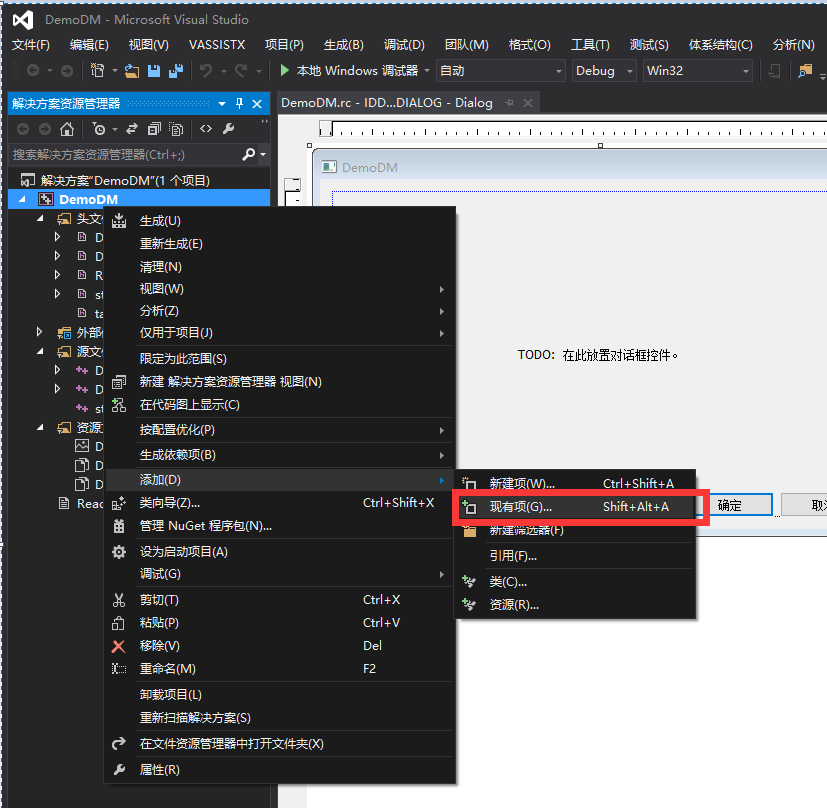
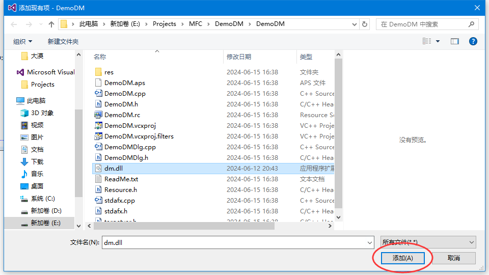
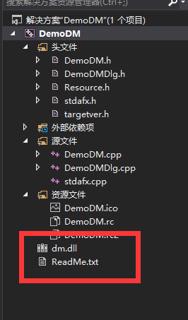
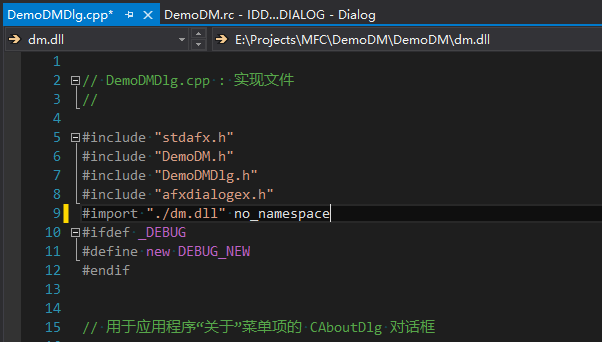
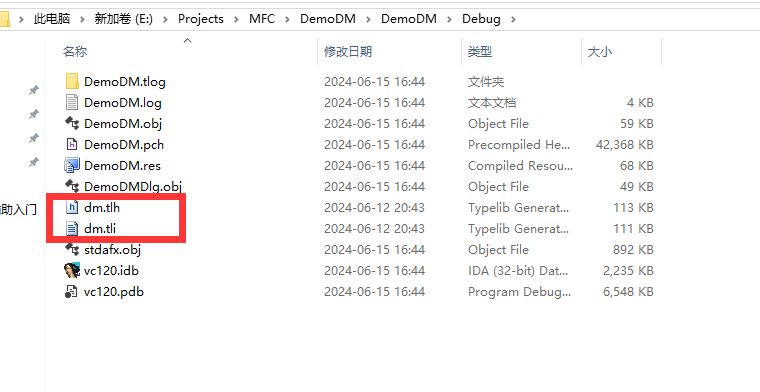
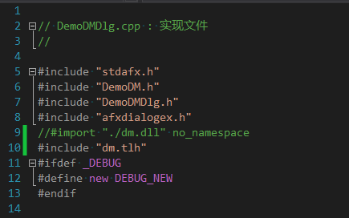
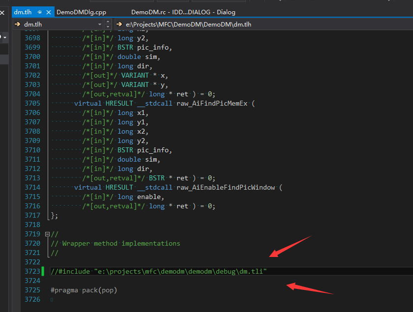

大漠注册的方式有免注册和注册调用

注册调用：

如果是注册调用的话，下载好大漠后 大漠的文件夹里面有个注册大漠插件到系统.bat文件，直接运行即可，或者在代码里面运行“regsvr32 /s dm.dll”，这样就把大漠注册到系统里面了，然后就能直接调用大漠了

免注册调用：

免注册调用可以使用大漠自带的DmReg.dll，这个动态库里面有2个函数

参数如下

SetDllPathA  字符串(Ascii码表示插件所在的路径),整数(0表示STA，1表示MTA)

SetDllPathW  字符串(Unicode码表示插件所在的路径),整数(0表示STA，1表示MTA)

LoadLibrary 然后调用SetDllPathA或者SetDllPathW都可以

其他免调用注册方式代码：

方式一：

```c++
void CScript::DMLoadRegister(CString file)
{
    if (::OleInitialize(NULL) == S_OK)                            //初始化COM库
    {
        HMODULE hLib = LoadLibrary(file);
        if (hLib < (HMODULE)HINSTANCE_ERROR)
        {
            AfxMessageBox("加载大漠dll失败,或者尝试手动注册大漠!");
        }
        FARPROC lpDllEntryPoint = GetProcAddress(hLib, "DllRegisterServer");
        if (lpDllEntryPoint == NULL)
        {
            AfxMessageBox("找不到注册入口,或者尝试手动注册大漠!");
        }

        if (FAILED((*lpDllEntryPoint)()))
        {
            AfxMessageBox("注册大漠插件失败！尝试手动注册！参见帮助文档！");
        }

        FreeLibrary(hLib);

        dm = new Cdmsoft;
        if (dm == NULL)
        {
            AfxMessageBox("分配大漠对象内存失败！尝试清理内存！");
            ::OleUninitialize();
            return;
        }
        if (dm->CreateDispatch("dm.dmsoft") == FALSE)
        {
            AfxMessageBox("创建大漠对象失败！尝试手动注册！参见帮助文档！");
            ::OleUninitialize();
            return;
        }
        //检测大漠版本是否正确
//         if (dm->Ver() != "7.2111")
//         {
//             CString tmp;
//             tmp.Format("版本错误，当前版本号是:%s", dm->Ver());
//             MessageBox(NULL, tmp, "错误", MB_OK);
//             ::OleUninitialize();
//             return;
//         }

        // 步骤5 收费用户注册. 如果是使用免费功能,可以略过这一步
        long ret = dm->Reg(注册码, 附加码);
        if (ret != 1)
        {
            CString tmp;
            tmp.Format("收费用户注册失败,返回值是:%d", ret);
            MessageBox(NULL, tmp, "错误", MB_OK);
            ::OleUninitialize();

            return;
        }

#if 0
        // 步骤6 如果有使用DmGuard功能, 可以在这里开启.如果没使用到保护盾,可以略过这一步
        if (dm->DmGuard(1, "xxx") == 0)
        {
            ::OleUninitialize();

            MessageBox(NULL, "开启保护盾失败", "错误", MB_OK);
            return ;
        }
#endif
        else
        {
            //初始化大漠插件全局路径和字体位置
            char pBuf[MAX_PATH];
            GetCurrentDirectory(MAX_PATH, pBuf);
            strcat_s(pBuf, "\\DmRes\\");
            CString ver = (LPCSTR)dm->Ver();
            CString m_dmpath = pBuf;
            dm->SetPath(m_dmpath);
            dm->SetPicPwd("626617");
            dm->SetDictPwd("626617");
            dm->SetDict(0, "dm_login.txt");//设置字库路劲
            dm->SetDict(1, "dm_game.txt");
            dm->UseDict(0);
            dm->SetShowErrorMsg(0);        //屏蔽坐标越界提示
            Sleep(500);
        }
        ::OleUninitialize();
    }
    else
    {
        AfxMessageBox("初始化COM组件失败！");
    }
}
```

这个函数需要传递一个大漠DLL的路径

方式二：

首先在VS中新建一个工程（控制台、MFC都行）

建立好工程后，把dm.dll添加到项目中（建议把dm.dll复制到项目文件夹中）







然后随便找个CPP文件，添加下面1句代码

\#import "./dm.dll" no_namespace

./dm.dll替换成自己的dm.dll路径



然后编译，编译后在debug目录中会生成

dm.tli、dm.tlh两个文件



然后使用这两个文件就能免注册调用大漠了，把这两个文件复制到要使用的项目中，然后使用#include "dm.tlh"包含头文件（//#import "./dm.dll" no_namespace需要注释掉）



dm.tlh文件最下面会有一个绝对路径，建议删掉



然后再添加注册大漠的函数

```c++
Idmsoft* GetDmObject()
{
    typedef  HRESULT(__stdcall * PDllGetClassObject)(REFCLSID, REFIID, LPVOID*);
    PDllGetClassObject  pDllGetClassObject = NULL;
    HMODULE  h = ::LoadLibrary(_T("dm.dll"));
    if (h == 0)
    {
        AfxMessageBox(_T("Error"));
        return  NULL;
    }
    pDllGetClassObject = (PDllGetClassObject)GetProcAddress(h, "DllGetClassObject");
    if (pDllGetClassObject == NULL)
    {
        return  NULL;
    }
    IClassFactory* pcf = NULL;
    HRESULT hr = pDllGetClassObject(__uuidof(dmsoft), IID_IClassFactory, (void**)&pcf);
    if (SUCCEEDED(hr) && pcf != NULL)
    {
        DWORD* PGetRes = NULL;
        hr = pcf->CreateInstance(NULL, IID_IUnknown, (void**)&PGetRes);
        if (SUCCEEDED(hr) && PGetRes != NULL)
        {
            pcf->Release();
            return (Idmsoft*)PGetRes;
        }
        if (pcf != NULL)
        {
            pcf->Release();
        }
    }
    if (pcf != NULL)
    {
        pcf->Release();
    }
    return  NULL;
}
```

需要创建大漠对象的时候调用以下代码：

```c++
Idmsoft *dm = GetDmObject();
if (dm == NULL)
{
    //
}
long lReg = dm->Reg(注册码, 附加码);
if (lReg != 1)
{
    MessageBox(_T("注册失败"));
}
```

